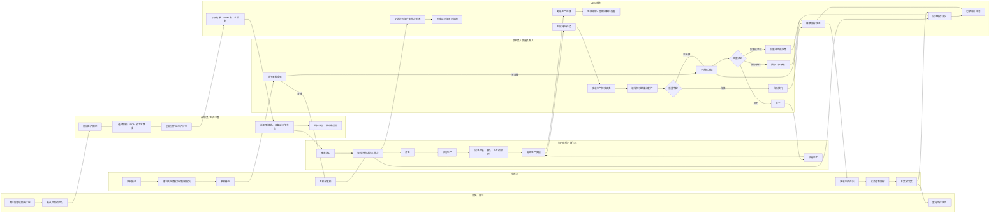

# MES-lite 业务泳道与角色参与矩阵

状态：目标业务流程与分阶段实施边界
日期：2026-08-13

展示文件：[HTML 交互展示](../../public/mes-business-swimlane.html) · [Excalidraw 可编辑源文件](../../public/mes-business-swimlane.excalidraw)

## 1. 文档用途

本文用泳道图说明轻量 MES 从需求、计划、领料、生产、检验到入库和发货的责任交接，并明确人工角色与系统自动动作。图中包含当前已经具备的能力和后续需要补齐的质量、批次与异常闭环，不代表所有节点都已上线。日常评审优先打开 HTML 展示页；需要调整节点、箭头或布局时使用 Excalidraw 源文件。

泳道图适合本流程，因为它同时回答三个问题：

1. 一项业务当前由谁负责。
2. 什么时候需要把责任交给下一个角色。
3. 哪些校验、过账、追溯和提醒由 MES 自动完成。

## 2. 目标业务泳道图

## 3. 角色参与矩阵

| 角色 | 主要职责 | 典型系统操作 | 参与程度 |
| --- | --- | --- | --- |
| 销售人员 | 提交客户需求、确认产品和交期、查看交付 | 销售订单、交付状态、附件 | 中 |
| 计划员 | 将需求转换为可执行生产任务 | 生产订单、BOM、工艺路线、缺料检查 | 高 |
| 生产主管 | 下达、派工、协调异常和进度 | 订单确认、派工、生产进度、异常处理 | 高 |
| 仓库员 | 收料、发料、库存状态转换和发货 | 来料、库位、批次、库存流水、发货 | 高 |
| 操作员 | 执行生产并记录现场事实 | 领料、开工、实绩、废品、人工和机时 | 高 |
| 质检员 | 执行检验并记录客观结果 | 待检任务、检验项目、实测值、附件、判定 | 高 |
| 质量负责人 | 决定返工、报废或让步接收 | 不合格评审、处置授权、复检 | 中但关键 |
| 管理人员 | 监督交付、质量、库存和设备趋势 | 看板、追溯、统计与审计查询 | 低频但关键 |
| 系统管理员 | 维护账号、权限、业务配置和系统设置 | 权限组、人员、单位、菜单、维护工具 | 低频 |
| MES 系统 | 校验、过账、追溯、审计和提醒 | 服务端状态机、库存流水、审计日志、告警 | 全流程自动参与 |

## 4. 当前覆盖与待补齐范围

| 流程段 | 当前状态 | 说明 |
| --- | --- | --- |
| 需求、生产订单、BOM、工艺路线 | 已有基础能力 | 可以创建生产订单并保存关键快照 |
| 派工与生产实绩 | 已有基础能力 | 已有派工、投入、产出、员工和库存过账链路 |
| 来料、库位库存、库存流水 | 部分闭环 | 来料收货已生成内部批次，流程转移同步批次库位余额；来料质检和仓库层级尚未建立 |
| 生产质量判定 | 批次处置闭环已交付 | 生产实绩、产出批次、跨工单待检、整批/部分判定、复检、返工、报废、授权放行和库存流水已串联；检验模板/附件待补 |
| 批次正反向追溯 | 批次级端到端已交付 | 已连通供应商批号、来料内部批次、投入/产出、发货客户和退货回流；搜索全景和序列号待补 |
| 不合格处置 | 本地闭环已交付 | 已支持返工、报废、让步、解冻和复检；退供应商与复杂审批待真实业务需求确认 |
| 设备事件、点检和保养 | 后续 P1 | 先做事件记录和到期提醒，不扩展财务资产管理 |
| PLC、OEE、APS 和专业 WMS | 暂不建设 | 仅在现场需求和采集条件明确后评估 |

## 5. 下一阶段最小闭环

`v0.1.361` 已在完整批次闭环和岗位任务入口上，将生产命令以及流程转移、BOM、主数据、业务设置和运维工具细分为 48 个权限资源，并补充工艺、设备、文控、销售、人事和权限管理员等岗位组；生产任务按本人/工作中心范围、库存与质量任务按库位范围过滤，个人例外使用有期限临时授权。部门/班组范围仍未独立建模。

1. 质量任务使用待检、完成和多轮复检状态；库存使用可用、待检、冻结和返工中状态。
2. 每次判定与处置保留数量、成本、来源/目标状态、原因、人员和时间。
3. 合格/让步/解冻转可用，不合格转冻结，返工完成转待检，报废减少库存和成本。
4. 所有状态转换由服务端事务校验，并写批次交易、库存流水与审计记录。
5. 暂不增加检验模板、抽样方案、SPC、复杂审批和自动设备采集。

## 6. 使用规则

- 泳道表示责任边界，不表示必须为每个节点建立独立页面。
- 同一页面可以服务多个角色，但按钮权限、数据范围和状态操作必须独立控制。
- 人员权限不能只按页面分配；至少区分查看、创建、确认、判定、处置和冲销。
- 任何数量、质量、批次或库存状态变化必须能够通过库存流水和审计记录回放。
- 当前实现与目标图冲突时，以运行代码、Prisma Schema、权限定义和 API 为事实来源。
