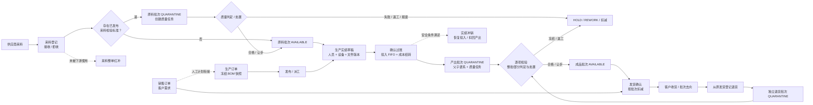
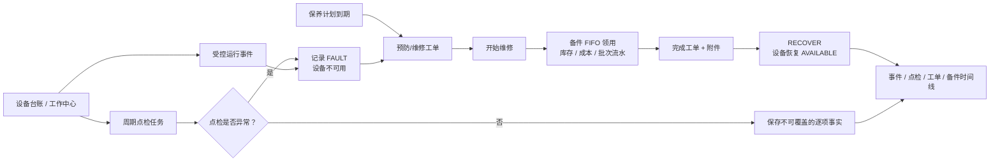
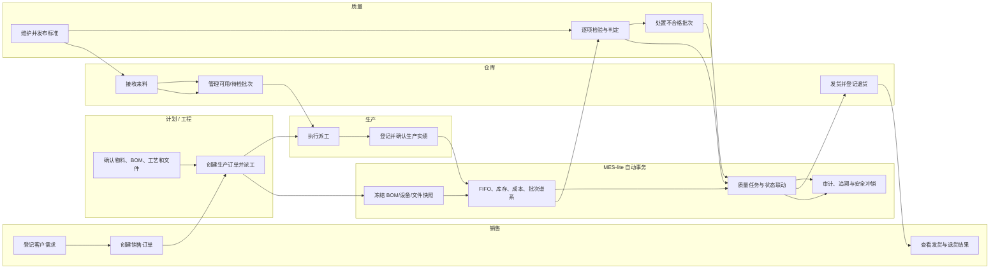

# MES-lite 当前功能流程与泳道

状态：当前代码事实
日期：2026-08-18
事实基线：`v0.1.403`

展示文件：[HTML 流程与泳道](../../public/mes-current-workflow.html) · [Excalidraw 可编辑源文件](../../public/mes-current-workflow.excalidraw)

## 1. 文档用途

本文只描述当前代码已经具备的业务能力，不混入尚未交付的序列号、SPC/过程能力、自动设备采集或 OEE。需要了解未来目标流程时，再查看《MES 业务泳道与角色参与矩阵》。

> `v0.1.376` 补充：来料、生产投入/产出、客户发货和退货回流均已形成内部批次关系；生产、退货及按已发布标准启用的来料质量任务支持标准版本、自动抽样、任务快照、逐项结果、附件、趋势和完整处置，批次追溯可多跳展开。班后实绩冻结实际设备与作业文件版本；岗位任务、生产命令、来料与物流状态命令、数据范围和临时授权已落地，业务资源现为 61 项；设备事件、周期点检、保养维修与备件库存/成本/批次领用已贯通。

## 2. 当前业务链

### 2.0 端到端业务闭环

实线是当前主流程，虚线是人工衔接或受安全条件限制的逆向动作。销售订单不会自动生成生产订单；这不是系统丢失数据，而是当前明确保留的 MES/MRP/ERP 边界。

### 2.1 销售与履约

客户资料 → 销售订单 → 创建或关联发货单 → 确认发货并按批次扣减库存 → 从原发货登记退货 → 收货进入独立待检批次 → 整批/部分判定 → 必要时复检、返工、报废或授权放行。

销售订单保存物料、数量、单价、交期和已发数量；订单卡片和详情中的物料名称、编码可进入只读物料详情，关闭后恢复订单上下文。发货可以独立登记，也可以关联销售订单及其明细。销售订单目前不会自动生成生产订单，两者由业务人员按实际需求衔接。

### 2.2 来料与成本

供应商资料 → 来料登记 → 接收或拒收 → 检查该物料是否存在已发布的来料标准 → 无标准直接可用，或有标准进入待检并自动建立质量任务 → 判定放行/冻结 → 流程转移同步批次余额 → 安全条件下整单红冲。

来料可以记录数量、单位换算、实测数据、价格、供应商批次号和库位。接收后形成库存、成本层和库存流水；只有物料存在已发布 `MATERIAL_IN` 标准时才进入 `QUARANTINE` 并生成任务，否则保持 `AVAILABLE`；拒收不入库。待检任务红冲时自动取消任务并恢复隔离数量，已合格且未被下游消耗的批次可安全红冲，失败或已被使用的批次会阻断直接红冲。

### 2.3 生产执行

生产订单 → BOM 快照 → 发布与派工 → 班后生产实绩 → 投入批次 FIFO 分配 → 确认过账 → 产出内部批次与投入谱系 → 生效检验标准/抽样/项目快照 → 逐项检验与整批/部分判定 → 复检、返工、报废或授权放行 → 进度与成本更新 → 满足安全条件时冲销并恢复投入批次余额。

生产实绩保存员工、投入物料、产出物料、实际数量和库位。确认时在服务端事务中完成投入出库、产出待检入库、内部批次、质量任务、成本结转、库存流水和订单进度重算。质检员可整批或部分判定，处置人员可申请复检、转返工或报废，质量主管可让步或解冻；待检、冻结和返工中库存不能被普通业务消耗。已确认实绩不能删除，只能在库存、成本、批次状态和下游分配均允许时冲销。

### 2.4 库存与转移

库存与库位余额 → 流程或库位转移 → 统一库存流水 → 搜索和核对。

库存流水记录数量、核算数量、成本、来源单据、库位、操作人和前后值，并支持智能搜索、高级字段搜索、列表与卡片视图。精确红冲会同时显示“已由流水冲销”和“冲销原流水”，部分退货等一对多回流只显示关联来源，不冒充整笔冲销。

### 2.5 独立支撑能力

- 新主流程使用 `QualityInspectionStandard` / `QualityInspectionStandardItem` 保存版本化标准，`QualityInspection` / `QualityInspectionCheckItem` 保存当时标准快照、抽样和逐项事实，`QualityDisposition` 保存每次复检、返工、报废、让步和解冻事实，并在一个事务内更新批次、库存、成本层与流水。旧 `QCRecord` 只保留历史兼容，不作为新生产实绩的质量事实。
- 设备与工作中心已经具备台账和基础配置；运行状态只能通过受控事件或维保工单改变。周期点检按设备保存不可覆盖的逐项事实；保养/维修工单覆盖到期、故障、开始、完成、设备恢复和备件 FIFO 批次领用。自动采集、停机原因、节拍和 OEE 尚未贯通。
- 附件、业务单据打印、二维码、权限、审计和数据维护作为公共模块被业务页面复用。

### 2.6 设备运行与维保闭环

### 2.7 角色交接泳道

交接原则：角色负责确认业务事实，系统负责在同一事务内更新状态、库存、成本、批次关系和审计。系统不会代替计划人员自动决定生产订单，也不会代替质量人员做最终检验判定。

## 3. 当前边界

1. 生产/退货质量和按标准启用的来料检验已覆盖标准版本、自动抽样、任务项目快照、逐项判定、附件、趋势及库存去向；SPC/过程能力、原因分类和复杂审批流尚未建设。
2. 批次级供应商到客户及退货回流已经贯通，并已提供跨批次搜索全景；尚无逐件序列号和客户指定批次拣货。
3. 销售订单、来料、生产订单和发货可以独立运行，不存在复杂 ERP/MRP 跨域自动编排。
4. 当前生产记录偏班后实绩，不等同于设备实时采集、OEE 或 APS 排程。

## 4. 事实来源

- 页面入口：`lib/page-registry.ts`
- 数据模型：`prisma/schema.prisma`
- 生产实绩：`modules/production/server/production-order-actual-service.ts`
- 质量判定：`modules/quality/server/quality-inspection-service.ts`
- 检验标准：`modules/quality/server/quality-inspection-standard-service.ts`
- 质量趋势：`modules/quality/server/quality-trend-query-service.ts`
- 批次库存状态：`modules/inventory/server/inventory-status-service.ts`
- 生产过账与冲销：`modules/production/server/production-order-actual-status-service.ts`
- 库存流水查询：`modules/inventory/server/stock-movement-query-service.ts`
- 设备事件：`modules/equipment/server/equipment-event-service.ts`
- 设备点检：`modules/equipment/server/equipment-inspection-command-service.ts`
- 设备维保：`modules/equipment/server/equipment-maintenance-command-service.ts`

当本文件与运行代码冲突时，以当前代码、Schema、权限和 API 为准。
