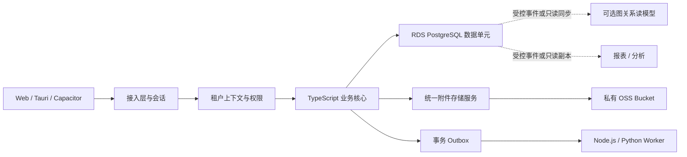

# MES-lite 商业化 SaaS 数据与存储架构

状态：目标架构，按阶段实施  
日期：2026-08-08

## 1. 目的与结论

本文统一定义 MES-lite 从当前单实例系统演进为商业化 SaaS 产品时的数据、附件、租户隔离、运行和扩容边界。具体 PostgreSQL 与 OSS 实施步骤分别见：

- [PostgreSQL SaaS 数据结构与迁移计划](../plans/postgresql-saas-migration.md)
- [OSS SaaS 附件存储接入计划](../plans/oss-saas-integration.md)
- [ADR 0025：共享多租户与数据单元架构](../adr/0025-shared-multitenant-saas-data-cells.md)

最终结论：

1. PostgreSQL 是生产业务的唯一事实源；不使用图数据库、OSS、搜索引擎或 AI 服务承接业务主事务。
2. OSS 保存附件原件、图片派生图、Office/PDF 预览和打印归档 PDF；数据库只保存对象元数据和归属关系。
3. 普通 SaaS 租户采用共享数据库、共享 Schema、每行强制 `tenantId` 的模式；应用服务与 PostgreSQL RLS 共同隔离租户。
4. 普通租户共享同一数据单元内的 RDS 和 OSS Bucket；企业客户可按套餐升级为独立数据单元，而不是从第一天就为每个客户创建数据库和 Bucket。
5. 图关系能力只作为 PostgreSQL 的派生查询模型，用于多跳追溯、影响分析和 AI 知识检索，不参与库存、成本、单据和权限写入。
6. PostgreSQL 和 OSS 不在同一个生产维护窗口同时切换；先建立租户与存储抽象，再迁移 OSS，最后切换 PostgreSQL。

## 2. 现状与目标状态

| 范围 | 当前状态 | SaaS 目标 |
| --- | --- | --- |
| 数据库 | SQLite + Prisma，单实例写入 | 阿里云 RDS PostgreSQL 高可用版，多可用区 |
| 租户 | 当前 Prisma 表没有统一 `tenantId` | 所有租户业务记录强制带 `tenantId` |
| 账号 | `Operator` 同时承担当前登录与权限主体 | 全局账号、租户成员身份和员工业务档案分离 |
| 唯一约束 | 编码多为全局唯一 | 改为 `tenantId + code` 等租户内唯一 |
| 附件 | 本地目录和数据库绝对 `storagePath` | 私有 OSS + 统一存储适配器 + 不透明对象键 |
| 预览 | 服务器本地生成缩略图、WebP 和 Office PDF | 临时落地处理后将派生资源写回 OSS |
| 部署 | Coolify 单实例 | 无状态 Web 实例 + RDS + OSS；后台任务逐步独立 |
| 备份 | 主机目录整体备份 | RDS 自动/日志备份 + OSS 版本控制和清单核对 |
| 扩容 | 纵向扩容单机 | 先共享数据单元，后按负载和合规拆分 Cell |

`docs/minierp/data-model.md` 中已有 `tenant_id` 草案属于目标模型，不代表当前 Prisma Schema 已经具备租户隔离。正式实施必须经过本方案中的默认租户回填、约束补齐、服务层改造和隔离测试，不能只增加一个可空字段。

## 3. 总体架构



架构分成三个平面：

| 平面 | 主要实体 | 职责 |
| --- | --- | --- |
| 控制平面 | Tenant、Plan、Subscription、DataCell、FeatureEntitlement、UsageMeter | 租户开通、套餐、配额、数据单元分配和商业运营 |
| 数据平面 | 物料、BOM、库存、生产、销售、文档、权限、审计 | 租户业务事实、事务、一致性和追溯 |
| 文件平面 | DocumentAttachment、AttachmentVariant、OSS Object | 原始凭据、图片、预览、打印 PDF 和文件生命周期 |

早期可以让控制平面和数据平面使用同一 RDS 实例，但代码和表职责必须分开。规模增长后，控制平面保留全局租户目录，数据平面按 `DataCell` 分片。

## 4. 租户与身份模型

### 4.1 推荐实体

| 实体 | 作用 |
| --- | --- |
| `Tenant` | 客户公司或组织，保存状态、区域、套餐和数据单元 |
| `User` | 全局自然人账号，不直接等同于员工 |
| `TenantMember` | 用户在某租户中的身份、角色和状态 |
| `Employee` | 租户业务员工档案，可选绑定 `TenantMember` |
| `Role` / `PermissionGroup` | 租户内权限模板与权限组 |
| `TenantSetting` | 业务配置、编码规则、单位和企业资料 |
| `Subscription` | 订阅状态、计费周期和套餐 |
| `FeatureEntitlement` | 套餐功能、数量限制和企业专属能力 |
| `UsageEvent` | 存储、AI、用户数、导出等可计量用量事件 |
| `DataCell` | 数据库、OSS、地域和运行单元的逻辑定位 |

### 4.2 强制边界

- 所有租户业务表的 `tenantId` 必须为非空。
- 当前单租户数据先统一回填到 `default-tenant`，验证完成后再收紧为 `NOT NULL`。
- 登录会话只保存允许访问的租户成员关系；请求中的租户不能由浏览器任意声明。
- API、后台任务、AI 工具、PDF 生成、导入导出和维护脚本必须通过同一个可信 `TenantContext`。
- 普通唯一键改为租户内唯一，例如 `@@unique([tenantId, code])`。
- 业务关联需要同时验证两端 `tenantId` 一致；只知道对象 ID 不代表可以访问对象。
- 平台运维账号默认无权读取客户业务数据；临时越权必须有工单、时效和审计记录。

### 4.3 RLS 定位

PostgreSQL Row-Level Security 是第二道防线，不替代服务端鉴权。连接进入事务后设置受控租户变量，RLS Policy 根据该变量限制读写；迁移、备份和运维角色使用独立连接身份，不复用应用账号。

必须验证：

- 无租户上下文时默认拒绝。
- 租户 A 无法按已知 ID 读取、更新或删除租户 B 数据。
- 关联查询、批量更新、原生 SQL 和后台任务同样受控。
- 数据库表所有者通常可绕过 RLS，因此应用运行账号不能使用表所有者或超级用户。

## 5. 业务数据结构改造

### 5.1 第一优先级：租户边界和精度

1. 为主数据、交易、库存、附件、权限、审计和页面偏好增加 `tenantId`。
2. 将编码、名称规则和排序规则从全局唯一改为租户内唯一。
3. 金额和需要精确核算的数量从 `Float` 迁移为 `Decimal`；外部金额统一明确币种和小数位。
4. 状态字符串逐步收敛为受控枚举或公共状态常量。
5. 给跨租户风险高的关联增加复合唯一键、复合外键或事务校验。

### 5.2 第二优先级：统一物料和库存维度

- 继续按现有业务稳定 `Material`，再逐步将 `Product` 收敛为物料的生产/销售能力，禁止在租户改造中同时完成大规模主数据合并。
- 库存余额最终按 `tenantId + materialId + warehouseId + inventoryStatus` 建模。
- 库位余额继续承担物理分布，总库存、预留、核算数量和成本必须保持可验证汇总关系。
- 库存流水和成本消耗记录只追加，不修改历史事实；纠错使用红冲或更正流水。

### 5.3 附件结构

`DocumentAttachment` 是附件业务记录，`AttachmentVariant` 是可重建派生资源：

```text
DocumentAttachment
  tenantId
  ownerType + ownerId
  storageBackend + objectKey
  originalName + mimeType + size + checksum
  storageStatus
  deletedAt

AttachmentVariant
  tenantId + attachmentId
  kind + profileVersion + rotation
  objectKey + mimeType + size + checksum
  status
```

附件 URL 不保存预签名地址；API 在完成权限校验后提供流式响应或短时签名地址。附件永久删除必须先确认业务主体允许永久删除，再清理原件和全部派生对象。

### 5.4 事务 Outbox

邮件、AI 识别、OCR、图片优化、PDF 转换、图关系同步和用量计量不应在业务事务中直接调用外部服务。业务事务同时写入 `OutboxEvent`，Worker 幂等消费：

```text
业务写入 + OutboxEvent  --同一 PostgreSQL 事务--> 提交
Worker --按事件 ID 幂等--> 外部服务 / 派生模型 / UsageEvent
```

这样外部服务失败不会产生“库存已过账但事件完全丢失”的静默不一致。

## 6. OSS 数据隔离

普通租户不单独创建 Bucket。每个环境或数据单元使用独立私有 Bucket，对象键强制包含租户和附件不透明 ID：

```text
prod/tenants/{tenantId}/attachments/{attachmentId}/original-v1.xlsx
prod/tenants/{tenantId}/attachments/{attachmentId}/variants/thumbnail-r0-v1.webp
prod/tenants/{tenantId}/attachments/{attachmentId}/variants/display-r0-v1.webp
prod/tenants/{tenantId}/attachments/{attachmentId}/variants/preview-r0-v1.pdf
```

对象键不能包含客户名称、物料名称、手机号等敏感业务信息。企业专属数据单元可以使用独立 Bucket、独立 RAM Role 和独立 KMS 密钥，但仍复用同一 `AttachmentStorage` 接口。

## 7. 数据单元与扩容

### 7.1 单元定义

一个 `DataCell` 至少包含：

- 一组无状态应用实例。
- 一个 RDS PostgreSQL 主实例及其备份策略。
- 一个私有 OSS Bucket。
- 一个任务队列和 Worker 组。
- 独立监控、告警和密钥范围。

控制平面记录租户所在 Cell。请求完成身份验证后再路由到对应数据单元，业务模块不自行判断数据库地址。

### 7.2 扩容触发条件

不按固定租户数量机械分片。出现以下任一情况才增加 Cell 或企业专属单元：

- 单实例连接、CPU、IOPS、存储或备份窗口接近容量阈值。
- 某个租户长期占用显著资源，需要噪声隔离。
- 客户要求独立地域、独立密钥、专属备份或合规隔离。
- 单元故障影响范围超出既定商业 SLA。

## 8. 图数据库和分析边界

当前不引入图数据库作为主存储。BOM、文档关联、设备与工艺关系优先使用 PostgreSQL 外键、关系表和递归查询。

当多跳追溯和影响分析经过 PostgreSQL 索引、递归查询和缓存优化后仍不能满足需求时，可以从 Outbox/CDC 构建图关系读模型，典型用途包括：

- 批次原料到成品、发货和客户的全链路追溯。
- 工程变更对 BOM、文档、设备、在制订单的影响分析。
- 设备故障关联工序、派工、产品和质量事件。
- AI 助手的关系检索。

图模型必须可以从 PostgreSQL 重建，禁止在图数据库直接修改库存、BOM、订单、权限或附件归属。

## 9. 商业化运行能力

### 9.1 租户生命周期

| 状态 | 行为 |
| --- | --- |
| `TRIAL` | 有明确到期时间、容量和功能限制 |
| `ACTIVE` | 正常读写并按套餐计量 |
| `PAST_DUE` | 限制高成本功能，保留必要读取和续费入口 |
| `SUSPENDED` | 禁止业务写入，保留管理员和数据导出流程 |
| `CLOSING` | 冻结写入，生成导出包并进入保留期 |
| `DELETED` | 保留期结束后按审计流程永久清理 |

### 9.2 计量和配额

至少计量：

- 启用成员数和并发会话。
- OSS 原件字节数、派生资源字节数和月上传量。
- AI/OCR 调用量和处理页数。
- PDF、导入导出和后台任务数量。
- API 调用量与高成本报表运行时间。

业务请求先进行套餐授权和配额判断；计量事件异步写入，不能因为计费系统暂时不可用阻断库存过账等核心事务。

### 9.3 可观测性

日志、指标和 Trace 必须携带 `tenantId`、`cellId`、请求 ID 和操作类型，但不能记录附件签名地址、AccessKey、密码、完整凭据或不必要的业务正文。

核心告警：

- 数据库连接、锁等待、慢查询、复制延迟、备份失败。
- OSS 403/404/5xx、上传失败、缺失对象和待处理附件超时。
- Outbox 积压、任务重试、幂等冲突和死信。
- 跨租户隔离测试失败和异常平台越权。
- 单租户资源突增、套餐超限和异常导出。

## 10. 备份、恢复与商业目标

初期商业目标值，正式对外承诺前必须通过演练确认：

| 项目 | 初期内部目标 |
| --- | --- |
| 应用可用性 | 月度 99.9%，不包含公告维护窗口 |
| PostgreSQL RPO | 不超过 5 分钟 |
| PostgreSQL RTO | 不超过 60 分钟 |
| OSS 原件 | 版本控制、私有访问、定期清单核对 |
| 单租户逻辑恢复 | 先恢复到隔离实例，再筛选租户数据回灌 |
| 灾难恢复演练 | 至少每季度一次 |

OSS 和 RDS 高可用不等于备份。数据库按时间点恢复、OSS 历史版本、跨地域副本和租户导出包分别解决不同风险，必须独立验证。

## 11. 实施阶段

| 阶段 | 结果 | 不在本阶段同时实施 |
| --- | --- | --- |
| 0. 决策与基线 | ADR、数据清单、默认租户、恢复演练基线 | 不切换生产数据库 |
| 1. 租户骨架 | Tenant、TenantMember、TenantContext、默认租户回填 | 不开放多个付费租户 |
| 2. 存储抽象 | 本地和 OSS 使用同一附件接口 | 不迁移 PostgreSQL |
| 3. OSS 迁移 | 新附件写 OSS、历史附件校验迁移、双读回滚 | 不和数据库同窗切换 |
| 4. PostgreSQL 迁移 | RDS、约束、RLS、备份和切换完成 | 不同时统一 Product/Material |
| 5. 商业运营 | 套餐、订阅、配额、用量、租户注销和数据导出 | 不提前引入复杂分片 |
| 6. Cell 扩展 | 按负载或合规迁移租户到独立数据单元 | 不让业务模块感知连接地址 |
| 7. 派生能力 | 只读副本、分析库、可选图关系读模型 | 不形成第二业务事实源 |

## 12. 上线门禁

正式开放第二个真实客户前必须满足：

- 所有业务表已完成 `tenantId` 非空和租户内唯一约束。
- 跨租户 API、原生 SQL、附件、导出、AI 和后台任务测试全部通过。
- 已完成 PostgreSQL 恢复、OSS 对象恢复和单租户数据导出演练。
- 套餐停用不会破坏客户数据，注销有保留期和双重确认。
- 平台运维越权有时效、审批和审计。
- 不存在永久公开的 OSS 对象或永久签名 URL。
- 数据库、OSS、任务和应用日志可按 `tenantId` 与 `cellId` 定位故障。
- 服务条款中的可用性、备份、数据保留和删除承诺与实际演练结果一致。

## 13. 参考资料

- [阿里云 RDS PostgreSQL 高可用系列](https://help.aliyun.com/zh/rds/apsaradb-rds-for-postgresql/rds-high-availability-edition)
- [阿里云 RDS PostgreSQL 备份](https://help.aliyun.com/zh/rds/apsaradb-rds-for-postgresql/back-up-an-apsaradb-rds-for-postgresql-instance/)
- [阿里云 RDS PostgreSQL 数据恢复](https://help.aliyun.com/zh/rds/apsaradb-rds-for-postgresql/restore-data-of-an-apsaradb-rds-for-postgresql-instance)
- [PostgreSQL Row Security Policies](https://www.postgresql.org/docs/17/ddl-rowsecurity.html)
- [阿里云 OSS Node.js SDK](https://help.aliyun.com/zh/oss/developer-reference/nodejs-sdk/)
- [阿里云 OSS 阻止公共访问](https://help.aliyun.com/zh/oss/user-guide/block-public-access/)
- [阿里云 OSS 地域与 Endpoint](https://help.aliyun.com/en/oss/user-guide/regions-and-endpoints)
- [阿里云 OSS 数据加密](https://help.aliyun.com/en/oss/user-guide/data-encryption/)
- [阿里云 OSS 版本控制](https://help.aliyun.com/zh/oss/user-guide/overview-78/)

