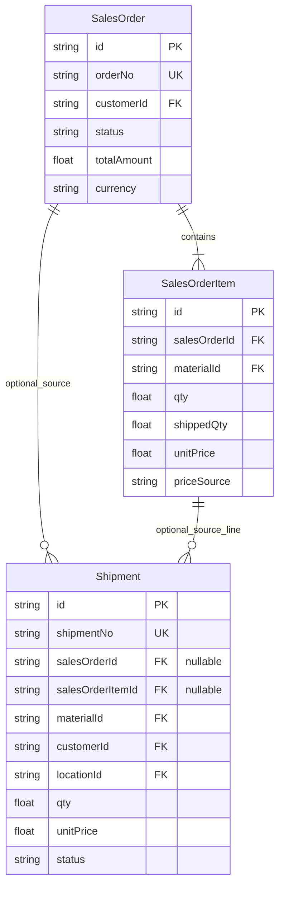

# MES-lite 数据库结构

本文以 `prisma/schema.prisma` 为唯一实现来源，事实基线为 `v0.1.366`。当前运行库为 SQLite；暂停的租户化草案不代表当前实现或当前产品合同。`v0.1.354-v0.1.356` 依次建立生产质量批次、来料到生产谱系和客户发货/退货回流，`v0.1.357` 增加完整不合格处置，`v0.1.358` 提供跨业务批次搜索与多跳全景，`v0.1.359-v0.1.360` 交付岗位任务、命令权限、48 个细分资源和岗位预置组，`v0.1.361` 增加人员数据范围与个人临时授权元数据；`v0.1.362` 增加 CI 与商业运维交付基线，`v0.1.363-v0.1.364` 修正 GitHub Actions，`v0.1.365` 增加原生 SOP 帮助中心，`v0.1.366` 增加无 Schema 变化的附件路径可移植性和应用级恢复演练。操作基线见[全流程作业指导书](../operations/user-guide/MES-lite全流程作业指导书-v0.1.366.md)。当前共有 77 个 Prisma 模型和 76 个迁移。

## 1. 核心实体关系

```mermaid
erDiagram
  Customer ||--o{ Material : "归属客户"
  Customer ||--o{ SalesOrder : "下单"
  Customer ||--o{ Shipment : "收货方"
  Supplier ||--o{ MaterialReceipt : "供货"
  InventoryLocation ||--o{ MaterialReceipt : "统一待分库库位"
  MaterialReceipt ||--|{ MaterialIn : "物料明细"
  MaterialIn ||--o| InventoryLot : "收货形成内部批次"

  Material ||--o| Stock : "汇总库存"
  Stock ||--o{ StockLocationBalance : "库位余额"
  InventoryLocation ||--o{ StockLocationBalance : "存放"
  Stock ||--o{ StockLog : "库存流水"
  InventoryLocation ||--o{ StockLog : "发生库位"
  Material ||--o{ InventoryLot : "内部批次"
  InventoryLot ||--o{ InventoryLotBalance : "按库位与状态余额"
  InventoryLocation ||--o{ InventoryLotBalance : "存放"
  InventoryLot ||--o{ InventoryLotTransaction : "批次交易"
  InventoryLocation ||--o{ InventoryLotTransaction : "发生库位"
  InventoryLot ||--o{ QualityInspection : "质量检验"
  InventoryLot ||--o{ QualityDisposition : "质量处置"
  QualityInspection ||--o{ QualityDisposition : "判定与后续处置"

  BOM ||--o{ BOMItem : "投入"
  BOM ||--o{ BOMOutput : "产出"
  Material ||--o{ BOMItem : "投入物料"
  Material ||--o{ BOMOutput : "产出物料"
  BOM ||--o{ ProductionOrder : "生产方案"
  Material ||--o{ ProductionOrder : "目标物料"
  ProductionOrder ||--o{ ProductionOrderActual : "生产实绩"
  ProductionOrderActual ||--o{ ProductionOrderActualInput : "实际投入"
  ProductionOrderActual ||--o{ ProductionOrderActualOutput : "实际产出"
  ProductionOrderActualInput ||--o{ InventoryLotAllocation : "FIFO 投入分配"
  InventoryLot ||--o{ InventoryLotAllocation : "被生产消耗"
  InventoryLotAllocation ||--o{ InventoryLotGenealogy : "形成谱系边"
  InventoryLot ||--o{ InventoryLotGenealogy : "父/子批次"
  ProductionOrderActualOutput ||--o| InventoryLot : "形成内部批次"
  ProductionOrder ||--o{ PickItem : "旧领料兼容"
  Material ||--o{ PickItem : "领用物料"
  ProductionOrder ||--o{ WorkReport : "旧工序报工兼容"
  ProcessStep ||--o{ WorkReport : "报工工序"
  ProductionOrder ||--o{ StockIn : "旧工单入库兼容"

  Material ||--o{ MaterialIn : "来料"
  Material ||--o{ InventoryCostLayer : "成本层"
  InventoryLot ||--o{ InventoryCostLayer : "批次成本层"
  MaterialIn ||--o{ InventoryCostLayer : "形成成本层"

  SalesOrder ||--|{ SalesOrderItem : "订单明细"
  Material ||--o{ SalesOrderItem : "销售物料"
  SalesOrder ||--o{ Shipment : "可选来源"
  SalesOrderItem ||--o{ Shipment : "可选来源明细"
  Material ||--o{ Shipment : "发货物料"
  InventoryLocation ||--o{ Shipment : "发货库位"
  Shipment ||--o{ ReturnOrder : "必选退货来源"
  Shipment ||--o{ ShipmentLotAllocation : "实际发货批次"
  InventoryLot ||--o{ ShipmentLotAllocation : "发往客户"
  ReturnOrder ||--o| InventoryLot : "形成退货待检批次"
  ReturnOrder ||--o{ ReturnLotAllocation : "退货来源分配"
  ShipmentLotAllocation ||--o{ ReturnLotAllocation : "原发货批次切片"
  InventoryLot ||--o{ ReturnLotAllocation : "退回形成批次"

  DocumentCategory ||--o{ WorkInstruction : "分类"
  Material ||--o{ WorkInstruction : "可选关联"
  WorkCenter ||--o{ Equipment : "设备归属"
  WorkCenter }o--o{ WorkInstruction : "适用范围"
  DocumentAttachment }o--|| WorkInstruction : "ownerType-ownerId"
  DocumentAttachment }o--|| SalesOrder : "ownerType-ownerId"
  DocumentAttachment }o--|| Shipment : "ownerType-ownerId"

  Operator ||--o{ OperatorSession : "登录会话"
  Operator ||--o{ AuditLog : "操作人快照"
  Operator ||--o| OperatorDataScope : "人员数据范围"
  OperatorDataScope ||--o{ OperatorWorkCenterScope : "生产工作中心"
  OperatorDataScope ||--o{ OperatorInventoryLocationScope : "库存库位"
  Operator ||--o{ OperatorPermissionOverride : "个人临时授权"
  AuthenticationThrottle {
    string scope
    string keyHash
    datetime blockedUntil
  }
```

`DocumentAttachment` 使用 `ownerType + ownerId` 形成通用多态关联，数据库不建立具体外键；`modules/attachments` 负责有效记录查询、文件落盘、封面唯一性、归档接替和草稿所有者切换。文件正文不进入 SQLite/PostgreSQL，而由 `storagePath` 指向持久化文件目录；本机 SQLite 和测试上传目录不进入版本库。

`Operator.failedLoginAttempts / lastFailedLoginAt / lockedUntil` 只记录密码认证失败与账号锁定，不替代账号审核状态。`AuthenticationThrottle` 使用 `scope + keyHash` 唯一保存来源哈希、窗口起点、请求次数和阻断截止时间；它不保存原始 IP，也不与 `Operator` 建立外键，以便未知账号同样受来源限流。

`OperatorDataScope` 以账号为主键保存生产 `ALL / SELF / WORK_CENTERS` 和库存 `ALL / LOCATIONS` 模式；所选工作中心与库位使用独立关联表和真实外键。`ProcessStep.workCenterId` 与 `Dispatch.employeeId` 为服务端范围过滤提供稳定关系，历史文字快照继续保留。`OperatorPermissionOverride` 新增原因、授权人、起止时间和 `legacyPermanent`；只有当前有效的临时记录或明确的历史兼容记录参与权限计算。

`MaterialReceipt` 是来料业务和附件的单头边界；`MaterialIn` 是物料、主单位实收量、辅助单位实测/历史推算量、计价、库存流水与成本层的来源行。`conversionSource` 区分本批实测、历史推算和单单位，`conversionSampleCount` 冻结推算所用样本数，`unitVersionUsed` 防止物料单位变更后混用历史；旧 `pieceCount`、`totalLength`、`totalWeight` 等列仅保留兼容。历史 `MaterialIn` 迁移为一单一行并保留原 ID 作为单头 ID。`BOMItem` 与 `BOMOutput` 在主库存数量之外保存 `entryQuantity`、`conversionRateUsed`、`conversionSource` 和 `unitVersionUsed`，确保物料标准单重/米重变化后历史 BOM 不漂移。BOM 主表使用 `status` 表达 `DRAFT / RELEASED / OBSOLETE`，`productId + version` 保证产品内版本唯一；发布后主体、投入和产出由数据库触发器保护为不可变，生产订单只引用 `RELEASED` 版本并继续保存订单快照。

## 2. 销售价格字段

| 模型 | 字段 | 含义 |
| --- | --- | --- |
| `Material` | `defaultSalePrice` | 可空的默认销售价；用于新单据带入，不是成本 |
| `Material` | `salesCurrency` | 默认销售币种，当前界面使用 `CNY` |
| `SalesOrder` | `currency` | 订单币种快照 |
| `SalesOrderItem` | `unitPrice / totalAmount` | 订单明细成交单价与金额快照 |
| `SalesOrderItem` | `priceSource` | `MATERIAL_DEFAULT` 或 `MANUAL` |
| `SalesOrderItem` | `defaultSalePriceSnapshot` | 下单时物料默认价，用于解释价格来源 |
| `SalesOrderItem` | `priceAdjustedAt / By / Reason` | 后续手工调价审计信息 |

销售价与成本严格分离：`Material` 不增加成本字段。库存成本由 `InventoryCostLayer`、`CostLayerConsumption`、`BomCostRun`、生产实际投入/产出及相关成本记录维护。

## 3. 销售订单与发货关系

- 独立发货：`salesOrderId` 与 `salesOrderItemId` 均为空，客户、物料、库位和价格由发货单明确保存。
- 关联发货：两个来源字段有值，创建时校验订单状态和剩余量，并冻结客户、物料和订单单价。
- 发货确认才影响库存；创建销售订单本身不扣减库存。
- 已产生发货记录后销售价格锁定，不自动回写既有发货单金额。
- 确认发货在同一事务扣减总库存、所选库位余额和成本，并按内部可用批次 FIFO 写入 `ShipmentLotAllocation`；处理退货按原发货成本比例进入独立待检批次，重复过账由状态与幂等键共同阻止。

## 4. 数据一致性边界

1. `Stock` 是物料总量，`StockLocationBalance` 是分库位量；`availableQty + quarantineQty + holdQty + reworkQty = qty`，各状态在库位层也必须与汇总层一致。确认类业务在同一事务内更新汇总、库位、批次、成本层和 `StockLog`。
2. 销售订单、发货、退货彼此独立建单；只有显式来源关系才参与数量或状态计算。
3. 物料默认销售价只影响新快照，不批量改写历史订单。
4. 业务记录使用软归档；审计日志保存操作人、前后数据和原因。
5. 原始附件永久保留策略、预览衍生文件和业务 PDF 由文件存储层管理，数据库只保存元数据和路径。
6. 新生产实绩产出先进入 `QUARANTINE`，不能被生产领用、发货或普通库存调整消耗；判定可整批或部分转换为 `AVAILABLE / HOLD`，返工转为 `REWORK`。
7. 放行、冻结、复检、返工和解冻不改变物料总数量、核算数量或总成本，只转换库存状态；质量报废按批次比例同时减少数量、核算量和成本。`InventoryLotTransaction` 与 `StockLog` 记录每次转换或报废。
8. 一个生产实绩产出最多形成一个内部批次；每一轮待检任务只允许判定一次，重复提交由状态和幂等键阻止。复检与返工完成送检建立新轮次，并保留父检验与触发处置关系。
9. 已收货来料行与内部批次一对一；`MaterialIn.batchNo` 是供应商批号，`InventoryLot.lotNo` 是系统内部批号，两者不得互相代替。
10. 生产投入只能消耗来源库位的 `AVAILABLE` 开放批次，按 `receivedAt` 先后 FIFO 分配；分配数量必须与本次库存出库数量一致。
11. 每个投入分配与当次每个产出批次形成显式谱系边；生产冲销恢复原批次余额，并将分配和谱系标记为 `REVERSED`。
12. 历史未追踪可用库存在首次需要分配或转移时进入 `LEGACY_INVENTORY` 兼容批次；它明确不代表真实供应商或生产来源。
13. 新发货确认时按来源库位 `AVAILABLE` 批次 FIFO 自动分配；有效分配合计必须等于发货数量，累计退回量不能为负或超过原分配量。
14. 新退货必须关联已发货/已签收且仍有剩余可退量的原发货单；收货建立独立 `RETURN_ORDER` 批次并先进入 `QUARANTINE`，`ReturnLotAllocation` 合计必须等于退货数量。
15. 迁移前历史发货首次退货时使用 `LEGACY_SHIPMENT` 兼容批次，只证明退货来自该历史发货单，不证明真实生产或来料批次。

## 5. Product→Material 扩展投影

| 模型 | `v0.1.353` 投影 | 当前约束 |
| --- | --- | --- |
| `Product` | `materialId String? @unique` | 人工确认后写入；一个 Material 不得对应多个 Product |
| `BOM` | `materialId String?` | 必须与唯一主产出及 Product 映射一致 |
| `BomCostRun` | `materialId String?` | 与 Product/BOM 对应物料一致 |
| `ProcessRoute` | `materialId String?` | 新写入保存当次明确物料 |
| `SawingCostScenario` | `materialId String?` | 只对绑定 Product 的历史场景要求投影 |
| `StockIn` | `materialId String?` | 归档旧模型，只在确认映射后回填 |

`ProductionOrder`、`Shipment` 和 `ReturnOrder` 早已具备 Material 关系；本阶段将其历史空值与上述投影统一审计和回填。SQLite 增加物理外键通常需要重建表，因此要等生产映射、对账和恢复演练通过后才进入收紧版本。

## 6. 生产产出批次、质量与库存状态

| 模型 | 当前职责 | 关键约束 |
| --- | --- | --- |
| `InventoryLot` | 内部批次主记录 | `lotNo` 唯一；生产来源绑定 `productionOutputId`；反向过账保留冲销人和原因 |
| `InventoryLot.materialInId` | 来料行的内部批次来源 | 可空且唯一；新收货一行一批，保留 `supplierLotNo` |
| `InventoryLot.returnOrderId` | 客户退货的独立批次来源 | 可空且唯一；已收货退货一单一批，先进入待检 |
| `InventoryLotAllocation` | 生产实绩投入的实际批次消耗 | `actualInputId + lotId + locationId` 唯一；保存数量、核算量、成本与冲销状态 |
| `InventoryLotGenealogy` | 投入父批次到产出子批次的谱系边 | `inputAllocationId + childLotId` 唯一；同时保留实绩与产出引用 |
| `ShipmentLotAllocation` | 发货到客户的实际批次切片 | `shipmentId + lotId + locationId` 唯一；保存出库与累计退回数量/成本 |
| `ReturnLotAllocation` | 客户退货到原发货批次的回流边 | `returnOrderId + shipmentAllocationId` 唯一；保存独立退货批次和原发货分配 |
| `InventoryLotBalance` | 批次在一个库位、一个状态下的数量与成本余额 | `lotId + locationId + inventoryStatus` 唯一；部分判定和处置可使同批同库位并存多种状态 |
| `InventoryLotTransaction` | 批次入账和状态转换事实 | 幂等键唯一；保留来源、库位、数量、成本、状态和操作人 |
| `QualityInspection` | 生产产出或客户退货的每轮待检及判定 | 新建为 `PENDING`；支持 `PASS / FAIL / PARTIAL`，轮次通过父检验和触发处置关联 |
| `QualityDisposition` | 不可覆盖的判定与后续处置历史 | 处置号和操作幂等键唯一；保存动作、源/目标状态、数量、核算量、成本、原因、人员和时间 |
| `InventoryCostLayer.inventoryStatus/lotId` | 成本层的质量可用性与批次来源 | `QUARANTINE / HOLD / REWORK` 不参与普通 FIFO 发料或发货；部分转换会拆分成本层 |
| `StockLog` 状态字段 | 对外查账的状态转换投影 | `lotId`、当前/来源/目标状态与质量来源单据一起保留 |

当前停止线是“供应商批号/来料内部批次 → 流程转移 → 生产投入 FIFO 分配 → 产出内部批次 → 多轮质检与不合格处置 → 发货批次/客户 → 原发货退货 → 独立退货待检批次 → 最终质量去向”，并可按批号、客商和业务单号检索后多跳展开。它是批次级正反向追溯，不是逐件序列号；检验项目/附件和客户指定批次拣货仍待后续切片。
