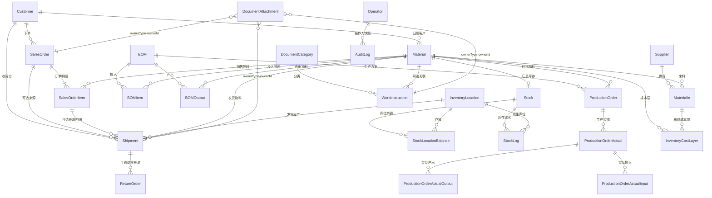
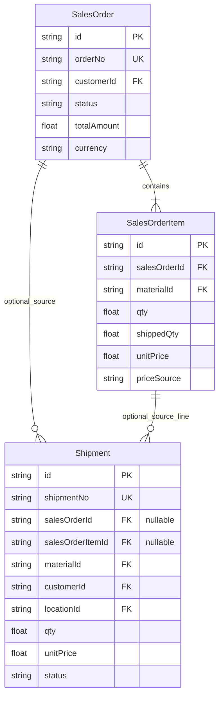

# MES-lite 数据库结构

本文以 `prisma/schema.prisma` 为唯一实现来源，事实基线为 `v0.1.277`。当前运行库为 SQLite，模型设计通过 Prisma 保持向 PostgreSQL 迁移的可能性；`docs/minierp/data-model.md` 中的租户字段属于目标草案，不代表当前已实现。

## 1. 核心实体关系

`DocumentAttachment` 使用 `ownerType + ownerId` 形成通用多态关联，数据库不建立具体外键；服务端负责权限、归档和目标存在性校验。

## 2. 销售价格字段

| 模型 | 字段 | 含义 |
| --- | --- | --- |
| `Material` | `defaultSalePrice` | 可空的默认销售价；用于新单据带入，不是成本 |
| `Material` | `salesCurrency` | 默认销售币种，当前界面使用 `CNY` |
| `SalesOrder` | `currency` | 订单币种快照 |
| `SalesOrderItem` | `unitPrice / totalAmount` | 订单明细成交单价与金额快照 |
| `SalesOrderItem` | `priceSource` | `MATERIAL_DEFAULT` 或 `MANUAL` |
| `SalesOrderItem` | `defaultSalePriceSnapshot` | 下单时物料默认价，用于解释价格来源 |
| `SalesOrderItem` | `priceAdjustedAt / By / Reason` | 后续手工调价审计信息 |

销售价与成本严格分离：`Material` 不增加成本字段。库存成本由 `InventoryCostLayer`、`CostLayerConsumption`、`BomCostRun`、生产实际投入/产出及相关成本记录维护。

## 3. 销售订单与发货关系

- 独立发货：`salesOrderId` 与 `salesOrderItemId` 均为空，客户、物料、库位和价格由发货单明确保存。
- 关联发货：两个来源字段有值，创建时校验订单状态和剩余量，并冻结客户、物料和订单单价。
- 发货确认才影响库存；创建销售订单本身不扣减库存。
- 已产生发货记录后销售价格锁定，不自动回写既有发货单金额。

## 4. 数据一致性边界

1. `Stock` 是物料总量，`StockLocationBalance` 是分库位量；确认类业务在同一事务内更新两者和 `StockLog`。
2. 销售订单、发货、退货彼此独立建单；只有显式来源关系才参与数量或状态计算。
3. 物料默认销售价只影响新快照，不批量改写历史订单。
4. 业务记录使用软归档；审计日志保存操作人、前后数据和原因。
5. 原始附件永久保留策略、预览衍生文件和业务 PDF 由文件存储层管理，数据库只保存元数据和路径。
