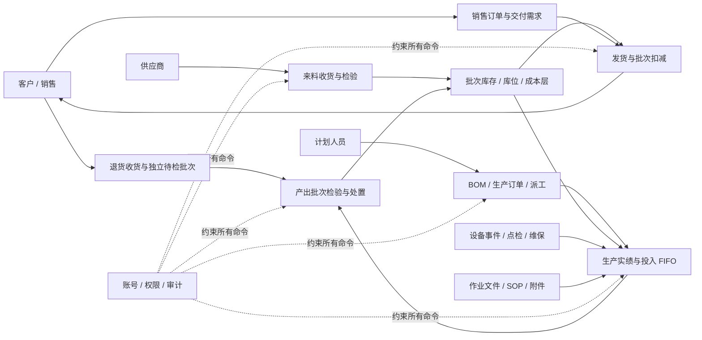

# MES-lite 系统全景索引

状态：当前代码事实与复盘入口
事实基线：`v0.1.434` / 2026-08-22

## 1. 为什么从这里开始

菜单只能说明“从哪里进入”，不能说明模块之间怎样协作。本组文档按“系统边界 → 软件分层 → 业务闭环 → 状态时序 → 功能完备性”组织，先看整体，再决定每个功能是否保留、补强或延后。

| 阅读顺序 | 文档 | 回答的问题 |
| --- | --- | --- |
| 1 | [系统结构图](./系统结构图.md) | 用户、客户端、模块、API、数据库、文件和部署环境怎样连接？ |
| 2 | [MES 当前功能流程与泳道](./MES当前功能流程与泳道.md) | 销售、计划、仓库、生产、质量和设备人员怎样完成业务闭环？ |
| 3 | [系统时序图](./系统时序图.md) | 一次确认、判定、冲销或维保完成时，服务内部按什么顺序改变状态？ |
| 4 | [系统功能全景与完备性审查](./系统功能全景与完备性审查.md) | 17 个模块分别做什么，输入输出是什么，还缺什么？ |
| 5 | [数据库结构](./数据库结构.md) | 业务事实最终保存在哪些模型和约束中？ |
| 6 | [功能、页面、权限与接口矩阵](./功能页面权限接口矩阵.md) | 某个页面键、权限资源和 API 的具体对应关系是什么？ |

## 2. 当前系统事实基线

| 维度 | 当前事实 | 解释 |
| --- | ---: | --- |
| 领域/平台模块 | 17 | 业务代码集中于 `modules/*`，跨模块通过公开入口协作 |
| 页面模块定义 | 46 | 其中 44 个稳定业务入口，另有生产创建和详情内部页面 |
| 一级导航分组 | 12 | 这是任务入口分组，不是 12 套独立系统 |
| Route Handler | 162 | HTTP 层负责鉴权、输入校验、审计和响应映射；含生产日报 BOM 快捷转换、盘点、文档字段、批量导入与批量修改适配器 |
| Prisma 模型 | 99 | 当前生产数据源为 SQLite |
| 数据库迁移 | 90 | 通过 Prisma migration 随容器启动部署 |
| 权限资源 | 62 | 页面可见性和命令执行均需服务端复核 |
| SOP 工作流 | 183 | 覆盖 44 个页面、17 个章节，可关联视频和离线文件 |

这些数字用于发现文档漂移，不用于评价产品质量。业务完备性必须按“输入—处理—输出—库存/成本—追溯—冲销”逐条检查。

## 3. 一张图理解 MES-lite

这是一套单厂、统一数据源的混合业务系统：MES 是主体；BOM 和生产需求提供有限 MRP 基础；客户、销售、发货和退货提供有限 ERP 协同。左上角预留模块按钮只改变入口表达，不复制页面、权限、API 或数据库。

## 4. 图中状态怎样理解

| 标记 | 含义 | 是否可对外承诺 |
| --- | --- | --- |
| 当前闭环 | 已有输入、事务处理、输出、追溯和安全逆操作 | 可按现有范围验收 |
| 基础可用 | 主路径可执行，但异常、自动化或管理颗粒度仍有缺口 | 需写清限制后验收 |
| 横切支撑 | 不直接形成生产结果，但为所有业务提供权限、文件、设置或审计 | 可按支撑能力验收 |
| 兼容过渡 | 仅用于解释或处理历史数据，不是新业务入口 | 不作为新增使用方式 |
| 未建设 | 当前代码没有形成可信闭环 | 不应通过菜单名称推断为已交付 |

## 5. 复盘顺序

1. 先在[系统功能全景与完备性审查](./系统功能全景与完备性审查.md)中确认模块目标和停止线。
2. 再沿[当前业务闭环](./MES当前功能流程与泳道.md)逐个确认角色交接、异常处理和逆向动作。
3. 对库存、成本、质量和设备状态等高风险动作，使用[系统时序图](./系统时序图.md)核对事务顺序。
4. 确认要保留或补强的能力后，再按典型工作流制作视频；不按单个按钮制作碎片化视频。
5. 页面、权限、接口或模型改变时，同一版本同步更新本组文档和验证脚本。

## 6. 事实来源与维护规则

- 页面和菜单：`lib/page-registry.ts`、统一导航配置。
- 权限：`lib/permissions.ts` 及服务端 `requireResourcePermission`。
- 业务规则：`modules/*/server`、`modules/*/domain`。
- 数据事实：`prisma/schema.prisma`、`prisma/migrations`。
- 操作教学：`sop/manifest.json` 与 `sop/workflows/*`。
- 部署事实：`Dockerfile`、`docs/deployment/coolify.md`。

当文档与代码冲突时，以当前代码、数据库迁移和权限校验为准，并把差异视为需要修复的文档漂移。
