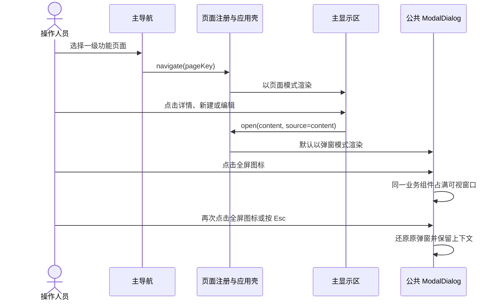
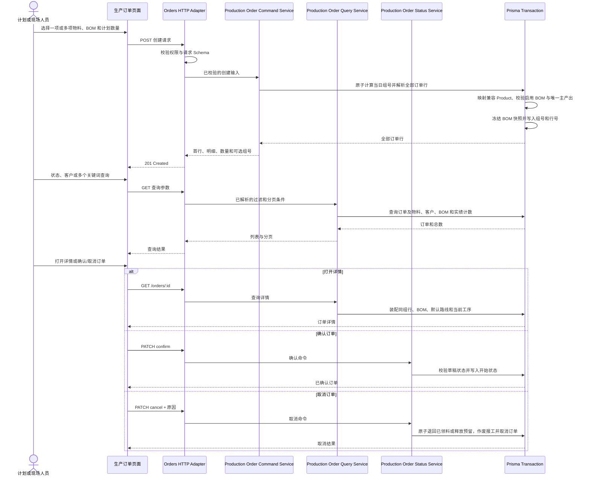
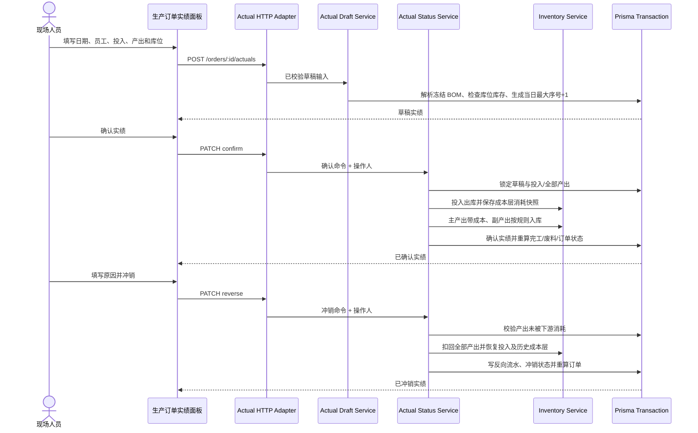
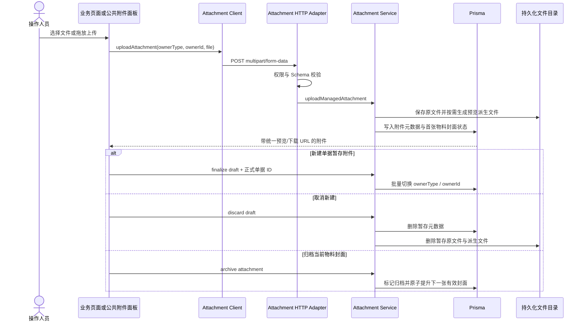
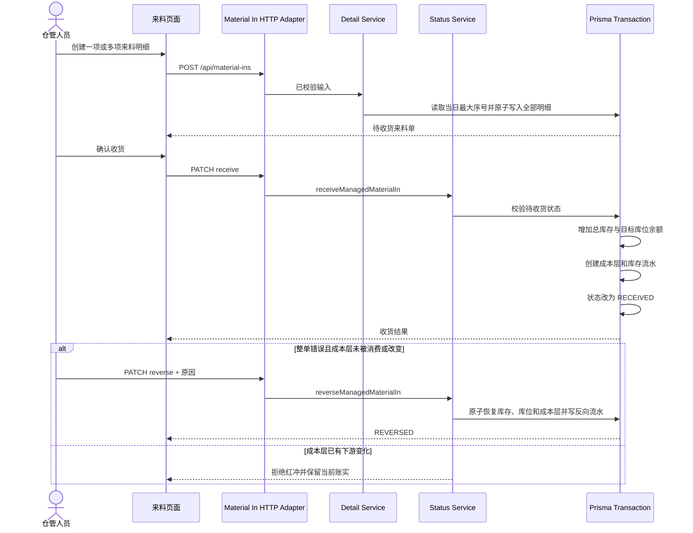
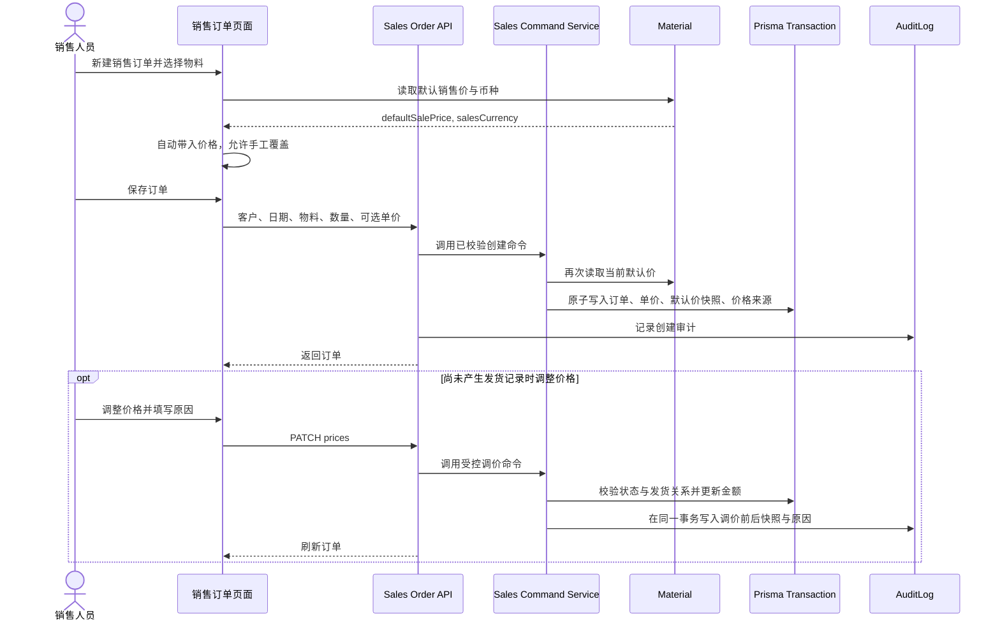
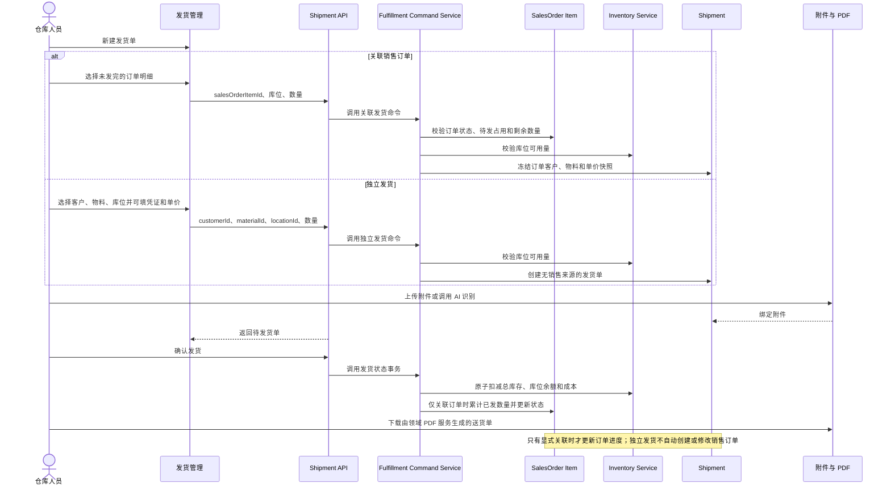
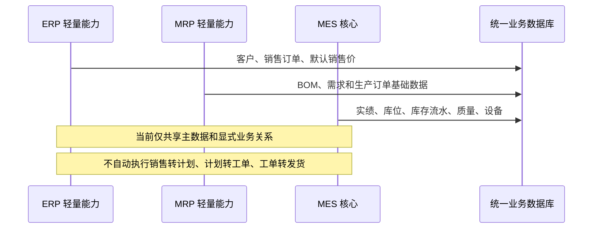
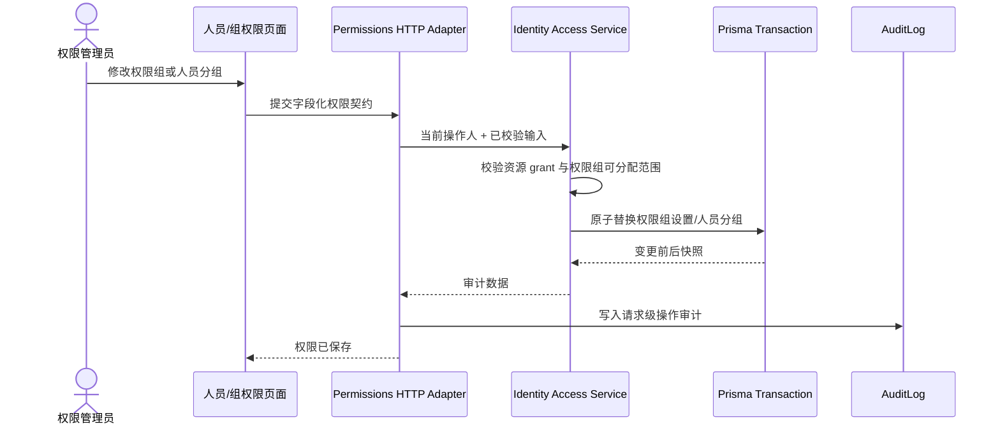

# MES-lite 系统时序图

本文记录 v0.1.316 的关键交互与业务时序。系统定位为 MES 主体、有限 MRP/ERP 支持，不在当前阶段实现跨域自动编排。

## 1. 页面打开与形态切换

规则：主导航始终进入主显示区；页内资源操作默认弹窗；公共弹窗只保留一个可逆的全屏图标，不再提供“在主页面打开”平行形态。命令型操作在当前上下文执行。复杂工作区可以在页面注册中声明例外，不在每个页面重复实现打开逻辑。

## 2. 生产订单创建与查询服务

Route Handler 只负责 HTTP、权限和请求级审计；生产订单编号、BOM 结构校验、快照、详情装配、确认和取消事务属于 `modules/production`。验证使用临时独立 SQLite，不连接本机测试库或服务器正式库。

## 3. 生产实绩登记、确认与冲销

四条实绩 Route Handler 不访问 Prisma；请求契约、冻结快照、日期编号、共同投入、多产出、库存成本过账、冲销恢复和订单累计均由 `modules/production` 所有。冲销不能绕过产出可用库存和成本层未被消费校验。

## 3.5 通用附件上传、草稿绑定与归档

页面与其他领域不得自行实现附件 CRUD。附件 Route Handler 只承担权限、HTTP 文件流、审计和错误映射；上传、封面、旋转、归档与草稿生命周期统一由 `modules/attachments` 所有。

## 3.6 来料登记、收货与整单红冲

5 条来料 Route Handler 均不访问 Prisma。编号、详情装配、状态约束、库存/库位/成本层过账和红冲恢复由 `modules/receiving` 所有；临时 SQLite 回归不读写本机测试数据或服务器正式数据。

## 4. 销售订单与默认销售价

价格是销售快照，不是动态引用。物料只保存默认销售价；成本继续由 BOM、来料成本层或手工成本流程计算，不在物料主数据增加成本字段。

## 5. 独立发货与可选来源关系

退货登记先校验原发货状态、物料和累计可退量；处理时由销售履约状态服务按原发货成本比例恢复总库存与所选库位并写幂等库存流水，拒绝退货不改变库存。16 条销售履约 Route Handler 均不直接访问 Prisma。

## 6. MES、MRP、ERP 当前协作边界

## 7. 权限组与人员授权

权限 API 只处理 HTTP、会话入口、审计和错误映射；权限契约、授权规则与事务归 `modules/identity-access`，避免页面、API 和数据库写入各自维护一套授权逻辑。
