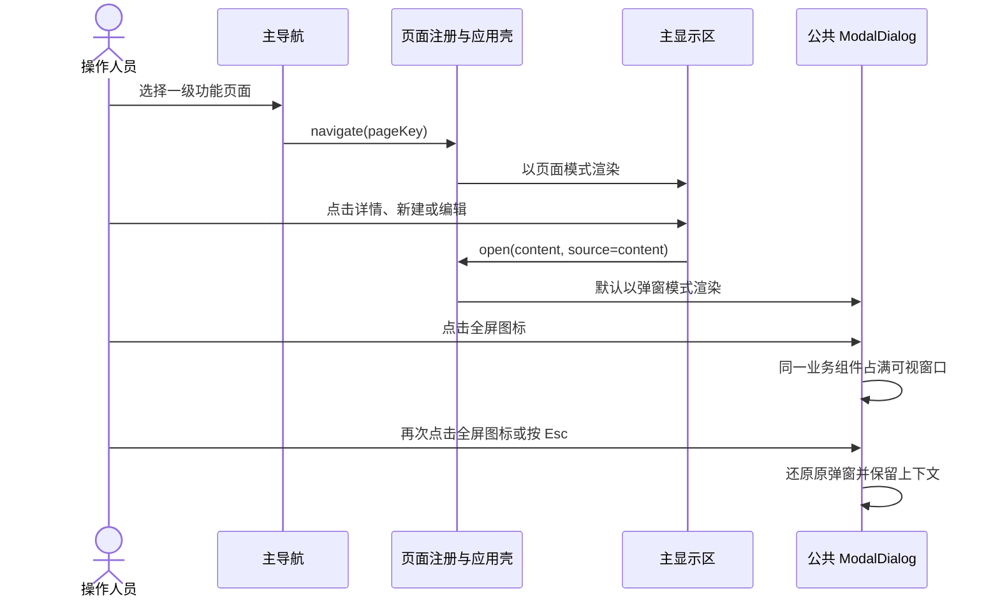
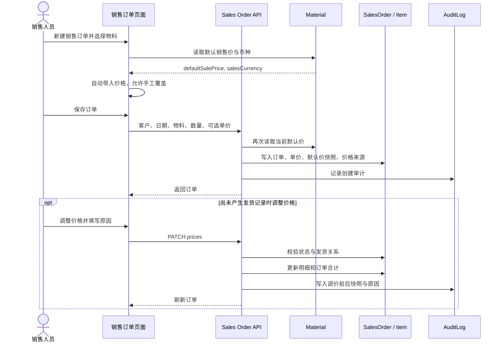
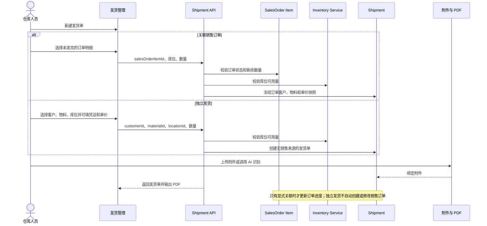
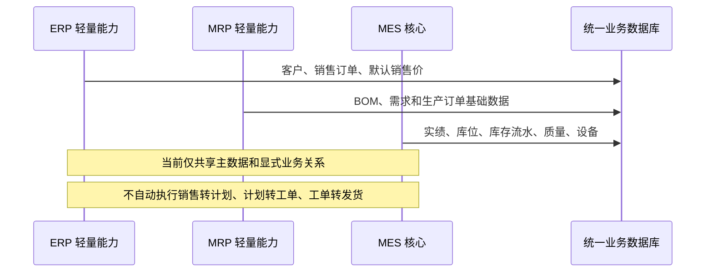
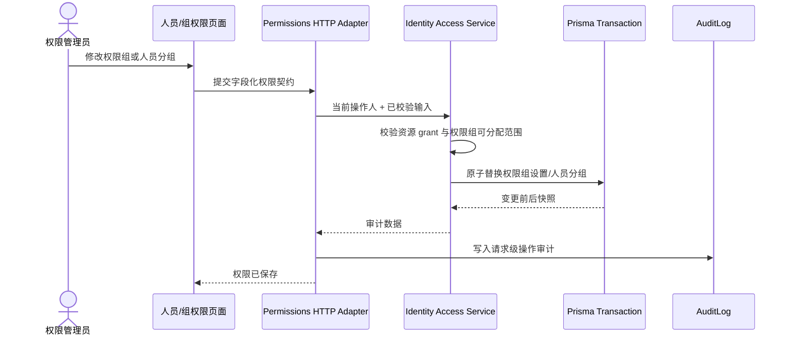

# MES-lite 系统时序图

本文记录 v0.1.310 的关键交互与业务时序。系统定位为 MES 主体、有限 MRP/ERP 支持，不在当前阶段实现跨域自动编排。

## 1. 页面打开与形态切换

规则：主导航始终进入主显示区；页内资源操作默认弹窗；公共弹窗只保留一个可逆的全屏图标，不再提供“在主页面打开”平行形态。命令型操作在当前上下文执行。复杂工作区可以在页面注册中声明例外，不在每个页面重复实现打开逻辑。

## 2. 销售订单与默认销售价

价格是销售快照，不是动态引用。物料只保存默认销售价；成本继续由 BOM、来料成本层或手工成本流程计算，不在物料主数据增加成本字段。

## 3. 独立发货与可选来源关系

## 4. MES、MRP、ERP 当前协作边界

## 5. 权限组与人员授权

权限 API 只处理 HTTP、会话入口、审计和错误映射；权限契约、授权规则与事务归 `modules/identity-access`，避免页面、API 和数据库写入各自维护一套授权逻辑。
