# MES-lite 系统时序图

本文记录 `v0.1.434` 的关键交互与业务时序。系统定位为 MES 主体、有限 MRP/ERP 支持，不在当前阶段实现跨域自动编排；当前已实现链路见《MES 当前功能流程与泳道》，模块功能和缺口见《系统功能全景与完备性审查》。

阅读方法：流程图说明角色和单据怎样前后衔接；本文件说明一次高风险命令在 HTTP、领域服务、数据库事务、库存和审计之间怎样执行。带人员字段的旧生产日报通用入口仍只属于兼容时序；当前前端使用专用 BOM 快捷接口。

## 1. 页面打开与形态切换

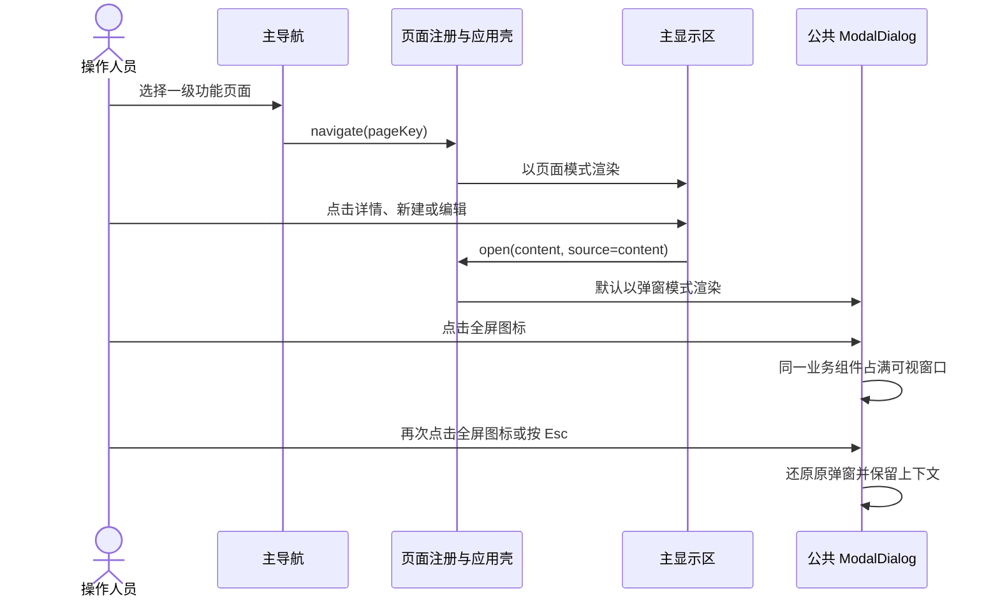
```mermaid
sequenceDiagram
  actor U as 操作人员
  participant N as 主导航
  participant H as 页面注册与应用壳
  participant P as 主显示区
  participant D as 公共 ModalDialog

  U->>N: 选择一级功能页面
  N->>H: navigate(pageKey)
  H->>P: 以页面模式渲染

  U->>P: 点击详情、新建或编辑
  P->>H: open(content, source=content)
  H->>D: 默认以弹窗模式渲染
  U->>D: 点击全屏图标
  D->>D: 同一业务组件占满可视窗口
  U->>D: 再次点击全屏图标或按 Esc
  D->>D: 还原原弹窗并保留上下文
```

规则：主导航始终进入主显示区；页内资源操作默认弹窗；公共弹窗只保留一个可逆的全屏图标，不再提供“在主页面打开”平行形态。命令型操作在当前上下文执行。复杂工作区可以在页面注册中声明例外，不在每个页面重复实现打开逻辑。

### 1.1 销售订单查看关联物料

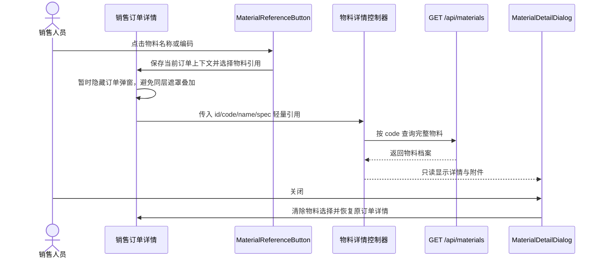
```mermaid
sequenceDiagram
  actor U as 销售人员
  participant SO as 销售订单详情
  participant R as MaterialReferenceButton
  participant M as 物料详情控制器
  participant API as GET /api/materials
  participant D as MaterialDetailDialog

  U->>R: 点击物料名称或编码
  R->>SO: 保存当前订单上下文并选择物料引用
  SO->>SO: 暂时隐藏订单弹窗，避免同层遮罩叠加
  SO->>M: 传入 id/code/name/spec 轻量引用
  M->>API: 按 code 查询完整物料
  API-->>M: 返回物料档案
  M-->>D: 只读显示详情与附件
  U->>D: 关闭
  D->>SO: 清除物料选择并恢复原订单详情
```

销售模块只持有轻量物料引用，查询和详情展示由 `modules/materials` 公开入口负责；在销售上下文中不传入编辑或全景命令，避免跨域写入。

## 2. 生产订单创建与查询服务

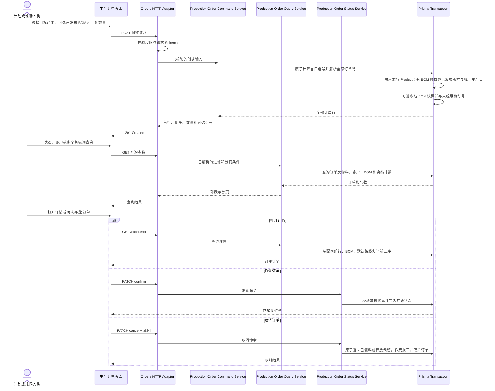
```mermaid
sequenceDiagram
  actor U as 计划或现场人员
  participant UI as 生产订单页面
  participant API as Orders HTTP Adapter
  participant C as Production Order Command Service
  participant Q as Production Order Query Service
  participant S as Production Order Status Service
  participant DB as Prisma Transaction

  U->>UI: 选择目标产出、可选已发布 BOM 和计划数量
  UI->>API: POST 创建请求
  API->>API: 校验权限与请求 Schema
  API->>C: 已校验的创建输入
  C->>DB: 原子计算当日组号并解析全部订单行
  DB->>DB: 映射兼容 Product；有 BOM 时校验已发布版本与唯一主产出
  DB->>DB: 可选冻结 BOM 快照并写入组号和行号
  DB-->>C: 全部订单行
  C-->>API: 首行、明细、数量和可选组号
  API-->>UI: 201 Created

  U->>UI: 状态、客户或多个关键词查询
  UI->>API: GET 查询参数
  API->>Q: 已解析的过滤和分页条件
  Q->>DB: 查询订单及物料、客户、BOM 和实绩计数
  DB-->>Q: 订单和总数
  Q-->>API: 列表与分页
  API-->>UI: 查询结果

  U->>UI: 打开详情或确认/取消订单
  alt 打开详情
    UI->>API: GET /orders/:id
    API->>Q: 查询详情
    Q->>DB: 装配同组行、BOM、默认路线和当前工序
    DB-->>UI: 订单详情
  else 确认订单
    UI->>API: PATCH confirm
    API->>S: 确认命令
    S->>DB: 校验草稿状态并写入开始状态
    DB-->>UI: 已确认订单
  else 取消订单
    UI->>API: PATCH cancel + 原因
    API->>S: 取消命令
    S->>DB: 原子退回已领料或释放预留，作废报工并取消订单
    DB-->>UI: 取消结果
  end
```

Route Handler 只负责 HTTP、权限和请求级审计；生产订单编号、BOM 结构校验、快照、详情装配、确认和取消事务属于 `modules/production`。验证使用临时独立 SQLite，不连接本机测试库或服务器正式库。

## 3. 生产实绩登记、确认与冲销

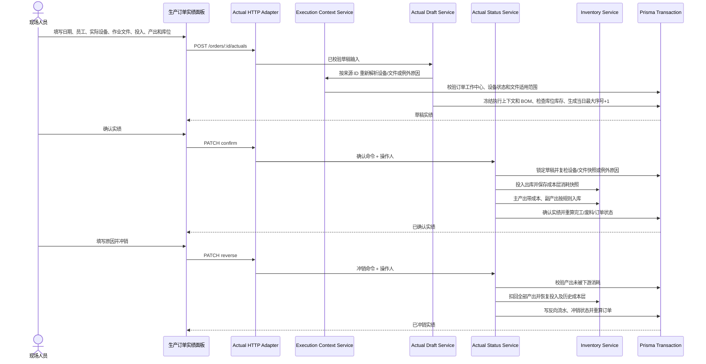
```mermaid
sequenceDiagram
  actor U as 现场人员
  participant UI as 生产订单实绩面板
  participant API as Actual HTTP Adapter
  participant C as Execution Context Service
  participant D as Actual Draft Service
  participant S as Actual Status Service
  participant I as Inventory Service
  participant DB as Prisma Transaction

  U->>UI: 填写日期、员工、实际设备、作业文件、投入、产出和库位
  UI->>API: POST /orders/:id/actuals
  API->>D: 已校验草稿输入
  D->>C: 按来源 ID 重新解析设备/文件或例外原因
  C->>DB: 校验订单工作中心、设备状态和文件适用范围
  D->>DB: 冻结执行上下文和 BOM、检查库位库存、生成当日最大序号+1
  DB-->>UI: 草稿实绩

  U->>UI: 确认实绩
  UI->>API: PATCH confirm
  API->>S: 确认命令 + 操作人
  S->>DB: 锁定草稿并复检设备/文件快照或例外原因
  S->>I: 投入出库并保存成本层消耗快照
  S->>I: 主产出带成本、副产出按规则入库
  S->>DB: 确认实绩并重算完工/废料/订单状态
  DB-->>UI: 已确认实绩

  U->>UI: 填写原因并冲销
  UI->>API: PATCH reverse
  API->>S: 冲销命令 + 操作人
  S->>DB: 校验产出未被下游消耗
  S->>I: 扣回全部产出并恢复投入及历史成本层
  S->>DB: 写反向流水、冲销状态并重算订单
  DB-->>UI: 已冲销实绩
```

四条实绩 Route Handler 不访问 Prisma；请求契约、设备/作业文件候选与快照、BOM 快照、日期编号、共同投入、多产出、库存成本过账、冲销恢复和订单累计均由 `modules/production` 所有。确认不能绕过每类“快照或原因”的服务/数据库双重约束；冲销不能绕过产出可用库存和成本层未被消费校验。

## 3.5 通用附件上传、草稿绑定与归档

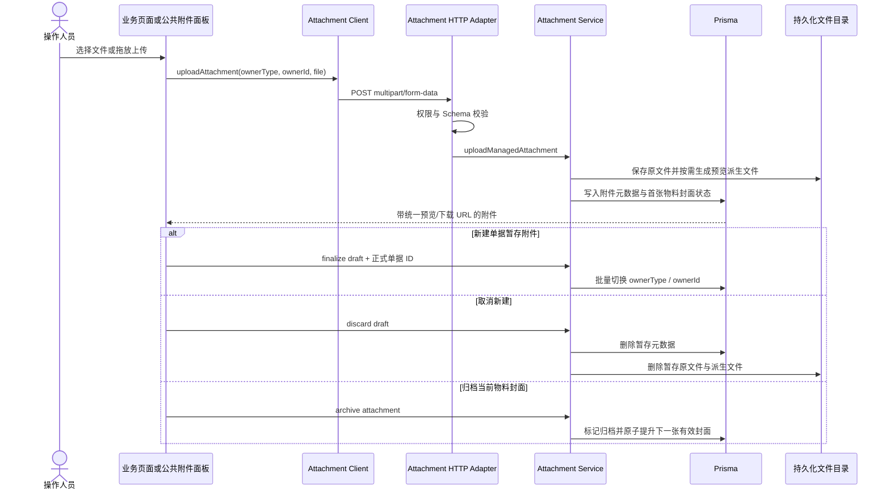
```mermaid
sequenceDiagram
  actor U as 操作人员
  participant UI as 业务页面或公共附件面板
  participant C as Attachment Client
  participant API as Attachment HTTP Adapter
  participant S as Attachment Service
  participant DB as Prisma
  participant FS as 持久化文件目录

  U->>UI: 选择文件或拖放上传
  UI->>C: uploadAttachment(ownerType, ownerId, file)
  C->>API: POST multipart/form-data
  API->>API: 权限与 Schema 校验
  API->>S: uploadManagedAttachment
  S->>FS: 保存原文件并按需生成预览派生文件
  S->>DB: 写入附件元数据与首张物料封面状态
  DB-->>UI: 带统一预览/下载 URL 的附件

  alt 新建单据暂存附件
    UI->>S: finalize draft + 正式单据 ID
    S->>DB: 批量切换 ownerType / ownerId
  else 取消新建
    UI->>S: discard draft
    S->>DB: 删除暂存元数据
    S->>FS: 删除暂存原文件与派生文件
  else 归档当前物料封面
    UI->>S: archive attachment
    S->>DB: 标记归档并原子提升下一张有效封面
  end
```

页面与其他领域不得自行实现附件 CRUD。附件 Route Handler 只承担权限、HTTP 文件流、审计和错误映射；上传、封面、旋转、归档与草稿生命周期统一由 `modules/attachments` 所有。

## 3.5.1 文档批量导入、分类字段与批量修改

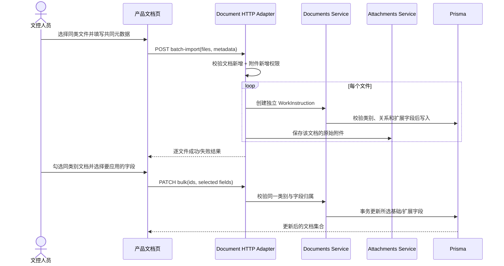
```mermaid
sequenceDiagram
  actor U as 文控人员
  participant UI as 产品文档页
  participant API as Document HTTP Adapter
  participant D as Documents Service
  participant A as Attachments Service
  participant DB as Prisma

  U->>UI: 选择同类文件并填写共同元数据
  UI->>API: POST batch-import(files, metadata)
  API->>API: 校验文档新增 + 附件新增权限
  loop 每个文件
    API->>D: 创建独立 WorkInstruction
    D->>DB: 校验类别、关系和扩展字段后写入
    API->>A: 保存该文档的原始附件
  end
  API-->>UI: 逐文件成功/失败结果

  U->>UI: 勾选同类别文档并选择要应用的字段
  UI->>API: PATCH bulk(ids, selected fields)
  API->>D: 校验同一类别与字段归属
  D->>DB: 事务更新所选基础/扩展字段
  DB-->>UI: 更新后的文档集合
```

字段定义由类别拥有，基础字段不进入动态定义。扩展字段只有使用计数为零时才能删除；批量修改未选择的字段不会随空值提交，跨类别选择整批拒绝。

## 3.6 来料登记、收货与整单红冲

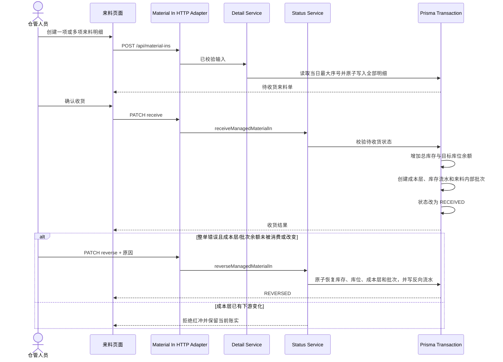
```mermaid
sequenceDiagram
  actor U as 仓管人员
  participant UI as 来料页面
  participant API as Material In HTTP Adapter
  participant D as Detail Service
  participant S as Status Service
  participant DB as Prisma Transaction

  U->>UI: 创建一项或多项来料明细
  UI->>API: POST /api/material-ins
  API->>D: 已校验输入
  D->>DB: 读取当日最大序号并原子写入全部明细
  DB-->>UI: 待收货来料单

  U->>UI: 确认收货
  UI->>API: PATCH receive
  API->>S: receiveManagedMaterialIn
  S->>DB: 校验待收货状态
  DB->>DB: 增加总库存与目标库位余额
  DB->>DB: 创建成本层、库存流水和来料内部批次
  DB->>DB: 状态改为 RECEIVED
  DB-->>UI: 收货结果

  alt 整单错误且成本层/批次余额未被消费或改变
    U->>API: PATCH reverse + 原因
    API->>S: reverseManagedMaterialIn
    S->>DB: 原子恢复库存、库位、成本层和批次，并写反向流水
    DB-->>UI: REVERSED
  else 成本层已有下游变化
    S-->>UI: 拒绝红冲并保留当前账实
  end
```

5 条来料 Route Handler 均不访问 Prisma。编号、详情装配、状态约束与来料事务由 `modules/receiving` 所有；内部批次余额和批次交易由 `modules/inventory` 所有。新收货行将供应商批号写入内部批次；已被生产消耗或余额变动的来源批次会阻断红冲。

## 3.7 生产投入批次分配与谱系

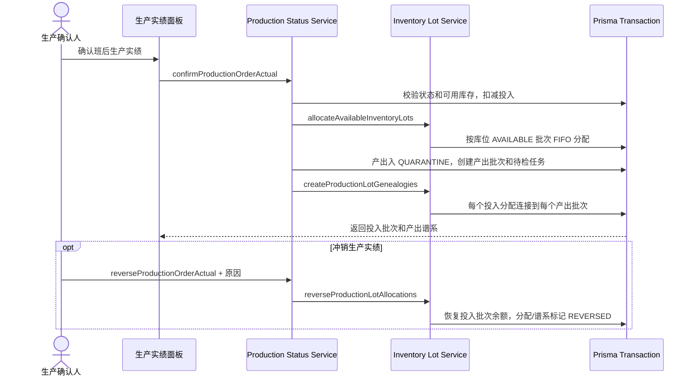
```mermaid
sequenceDiagram
  actor U as 生产确认人
  participant UI as 生产实绩面板
  participant P as Production Status Service
  participant I as Inventory Lot Service
  participant DB as Prisma Transaction

  U->>UI: 确认班后生产实绩
  UI->>P: confirmProductionOrderActual
  P->>DB: 校验状态和可用库存，扣减投入
  P->>I: allocateAvailableInventoryLots
  I->>DB: 按库位 AVAILABLE 批次 FIFO 分配
  P->>DB: 产出入 QUARANTINE，创建产出批次和待检任务
  P->>I: createProductionLotGenealogies
  I->>DB: 每个投入分配连接到每个产出批次
  DB-->>UI: 返回投入批次和产出谱系

  opt 冲销生产实绩
    U->>P: reverseProductionOrderActual + 原因
    P->>I: reverseProductionLotAllocations
    I->>DB: 恢复投入批次余额，分配/谱系标记 REVERSED
  end
```

批次分配是库存出库的实物追溯投影，不取代成本层核算。当历史可用库存没有批次记录时，事务先计算未追踪差额并建立 `LEGACY_INVENTORY` 兼容批次；该来源不被展示为供应商批号。

## 3.8 派工创建与五态流转

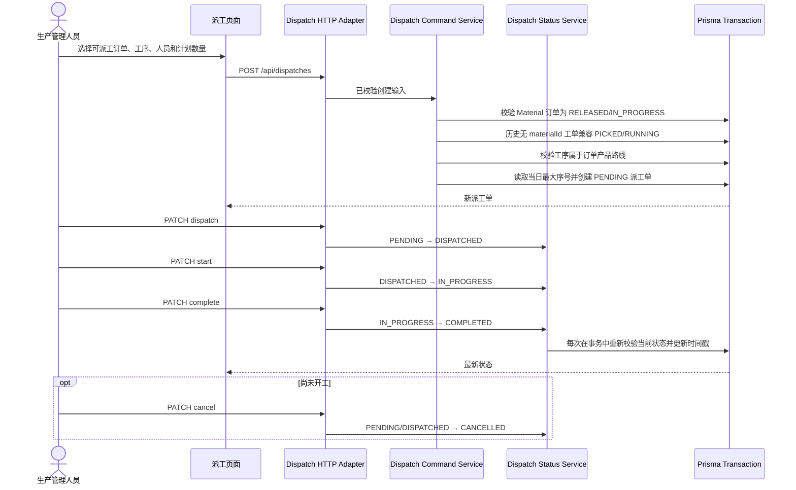
```mermaid
sequenceDiagram
  actor U as 生产管理人员
  participant UI as 派工页面
  participant API as Dispatch HTTP Adapter
  participant C as Dispatch Command Service
  participant S as Dispatch Status Service
  participant DB as Prisma Transaction

  U->>UI: 选择可派工订单、工序、人员和计划数量
  UI->>API: POST /api/dispatches
  API->>C: 已校验创建输入
  C->>DB: 校验 Material 订单为 RELEASED/IN_PROGRESS
  C->>DB: 历史无 materialId 工单兼容 PICKED/RUNNING
  C->>DB: 校验工序属于订单产品路线
  C->>DB: 读取当日最大序号并创建 PENDING 派工单
  DB-->>UI: 新派工单

  U->>API: PATCH dispatch
  API->>S: PENDING → DISPATCHED
  U->>API: PATCH start
  API->>S: DISPATCHED → IN_PROGRESS
  U->>API: PATCH complete
  API->>S: IN_PROGRESS → COMPLETED
  S->>DB: 每次在事务中重新校验当前状态并更新时间戳
  DB-->>UI: 最新状态

  opt 尚未开工
    U->>API: PATCH cancel
    API->>S: PENDING/DISPATCHED → CANCELLED
  end
```

6 条派工 Route Handler 均不访问 Prisma；组合查询、编号、工序归属和状态流转由 `modules/production` 所有。非法重复流转在领域层拒绝，临时 SQLite 回归不接触本机或服务器正式数据。

## 3.8 流程转移确认与冲销

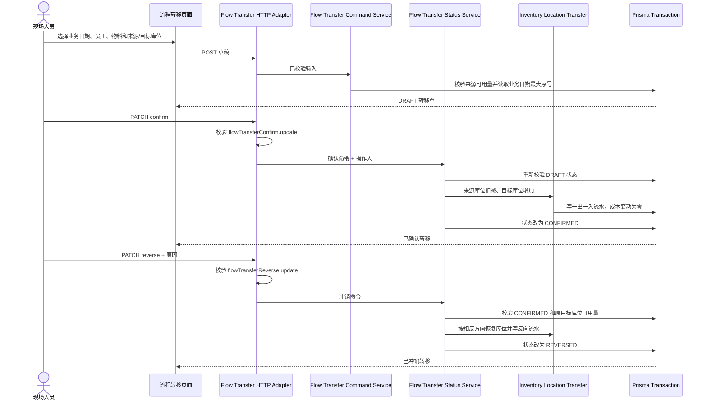
```mermaid
sequenceDiagram
  actor U as 现场人员
  participant UI as 流程转移页面
  participant API as Flow Transfer HTTP Adapter
  participant C as Flow Transfer Command Service
  participant S as Flow Transfer Status Service
  participant I as Inventory Location Transfer
  participant DB as Prisma Transaction

  U->>UI: 选择业务日期、员工、物料和来源/目标库位
  UI->>API: POST 草稿
  API->>C: 已校验输入
  C->>DB: 校验来源可用量并读取业务日期最大序号
  DB-->>UI: DRAFT 转移单

  U->>API: PATCH confirm
  API->>API: 校验 flowTransferConfirm.update
  API->>S: 确认命令 + 操作人
  S->>DB: 重新校验 DRAFT 状态
  S->>I: 来源库位扣减、目标库位增加
  I->>DB: 写一出一入流水，成本变动为零
  S->>DB: 状态改为 CONFIRMED
  DB-->>UI: 已确认转移

  U->>API: PATCH reverse + 原因
  API->>API: 校验 flowTransferReverse.update
  API->>S: 冲销命令
  S->>DB: 校验 CONFIRMED 和原目标库位可用量
  S->>I: 按相反方向恢复库位并写反向流水
  S->>DB: 状态改为 REVERSED
  DB-->>UI: 已冲销转移
```

4 条流程转移 Route Handler 均不访问 Prisma。草稿维护、确认与冲销分别使用通用页面资源和两个独立命令资源，只有冲销要求保存原因。总库存、计价数量、成本和成本层在确认与冲销前后保持不变；失败事务不能留下单边库位变化。

## 3.9 库存流水查询

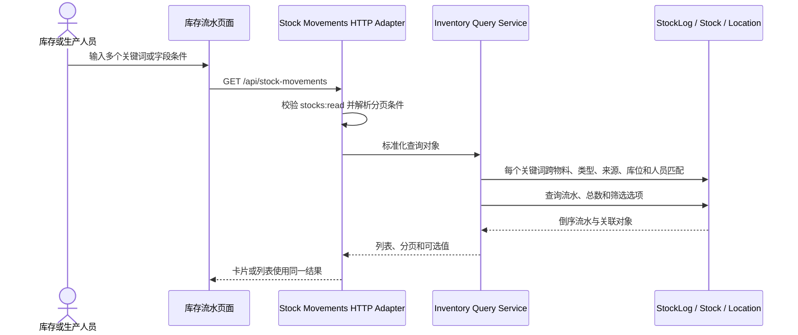
```mermaid
sequenceDiagram
  actor U as 库存或生产人员
  participant UI as 库存流水页面
  participant API as Stock Movements HTTP Adapter
  participant Q as Inventory Query Service
  participant DB as StockLog / Stock / Location

  U->>UI: 输入多个关键词或字段条件
  UI->>API: GET /api/stock-movements
  API->>API: 校验 stocks:read 并解析分页条件
  API->>Q: 标准化查询对象
  Q->>DB: 每个关键词跨物料、类型、来源、库位和人员匹配
  Q->>DB: 查询流水、总数和筛选选项
  DB-->>Q: 倒序流水与关联对象
  Q-->>API: 列表、分页和可选值
  API-->>UI: 卡片或列表使用同一结果
```

该链路只读取既有 `StockLog`，不修改库存、成本层或正式数据。Route Handler 不访问 Prisma；关键词空格分词、精确条件、关联装配和分页由 `modules/inventory/server` 统一实现。

## 4. 销售订单与默认销售价

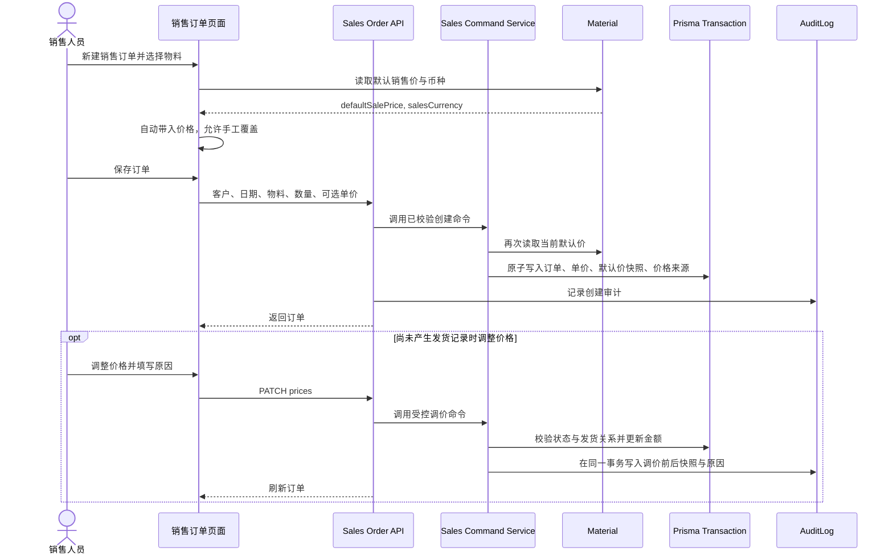
```mermaid
sequenceDiagram
  actor U as 销售人员
  participant UI as 销售订单页面
  participant API as Sales Order API
  participant C as Sales Command Service
  participant M as Material
  participant SO as Prisma Transaction
  participant A as AuditLog

  U->>UI: 新建销售订单并选择物料
  UI->>M: 读取默认销售价与币种
  M-->>UI: defaultSalePrice, salesCurrency
  UI->>UI: 自动带入价格，允许手工覆盖
  U->>UI: 保存订单
  UI->>API: 客户、日期、物料、数量、可选单价
  API->>C: 调用已校验创建命令
  C->>M: 再次读取当前默认价
  C->>SO: 原子写入订单、单价、默认价快照、价格来源
  API->>A: 记录创建审计
  API-->>UI: 返回订单

  opt 尚未产生发货记录时调整价格
    U->>UI: 调整价格并填写原因
    UI->>API: PATCH prices
    API->>C: 调用受控调价命令
    C->>SO: 校验状态与发货关系并更新金额
    C->>A: 在同一事务写入调价前后快照与原因
    API-->>UI: 刷新订单
  end
```

价格是销售快照，不是动态引用。物料只保存默认销售价；成本继续由 BOM、来料成本层或手工成本流程计算，不在物料主数据增加成本字段。

## 5. 独立发货与可选来源关系

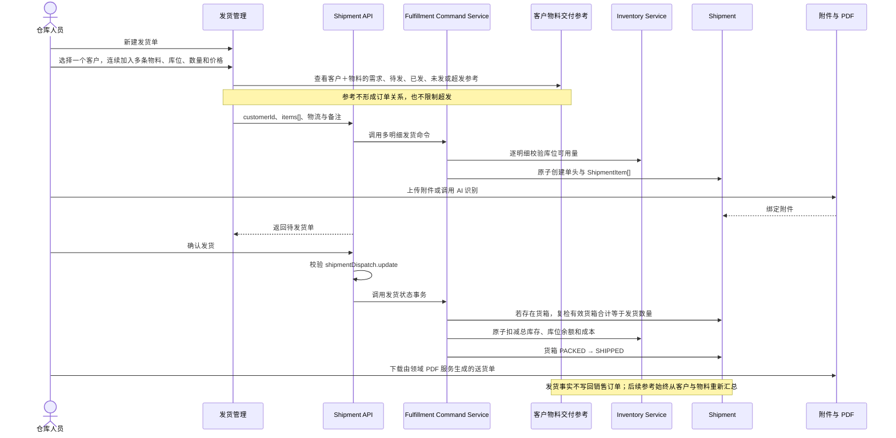
```mermaid
sequenceDiagram
  actor U as 仓库人员
  participant UI as 发货管理
  participant API as Shipment API
  participant C as Fulfillment Command Service
  participant R as 客户物料交付参考
  participant I as Inventory Service
  participant S as Shipment
  participant F as 附件与 PDF

  U->>UI: 新建发货单
  U->>UI: 选择一个客户，连续加入多条物料、库位、数量和价格
  UI->>R: 查看客户＋物料的需求、待发、已发、未发或超发参考
  Note over UI,R: 参考不形成订单关系，也不限制超发
  UI->>API: customerId、items[]、物流与备注
  API->>C: 调用多明细发货命令
  C->>I: 逐明细校验库位可用量
  C->>S: 原子创建单头与 ShipmentItem[]
  U->>F: 上传附件或调用 AI 识别
  F-->>S: 绑定附件
  API-->>UI: 返回待发货单
  U->>API: 确认发货
  API->>API: 校验 shipmentDispatch.update
  API->>C: 调用发货状态事务
  C->>S: 若存在货箱，复检有效货箱合计等于发货数量
  C->>I: 原子扣减总库存、库位余额和成本
  C->>S: 货箱 PACKED → SHIPPED
  U->>F: 下载由领域 PDF 服务生成的送货单

  Note over S,R: 发货事实不写回销售订单；后续参考始终从客户与物料重新汇总
```

### 5.1 货箱单据、二维码与现场照片

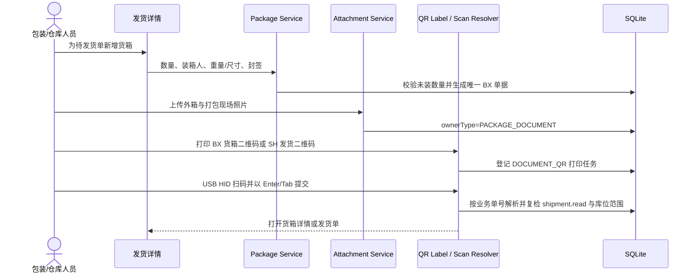
```mermaid
sequenceDiagram
  actor W as 包装/仓库人员
  participant UI as 发货详情
  participant P as Package Service
  participant A as Attachment Service
  participant Q as QR Label / Scan Resolver
  participant DB as SQLite

  W->>UI: 为待发货单新增货箱
  UI->>P: 数量、装箱人、重量/尺寸、封签
  P->>DB: 校验未装数量并生成唯一 BX 单据
  W->>A: 上传外箱与打包现场照片
  A->>DB: ownerType=PACKAGE_DOCUMENT
  W->>Q: 打印 BX 货箱二维码或 SH 发货二维码
  Q->>DB: 登记 DOCUMENT_QR 打印任务
  W->>Q: USB HID 扫码并以 Enter/Tab 提交
  Q->>DB: 按业务单号解析并复检 shipment.read 与库位范围
  Q-->>UI: 打开货箱详情或发货单
```

扫码只是受控导航，不自动发货、签收或改变库存。货箱内容数量负责发货前完整性校验，真实出库批次仍由 `ShipmentLotAllocation` 记录；承运商 `trackingNo` 不复用系统二维码。

退货登记先校验原发货状态、物料和累计可退量；接收入库使用 `returnReceive.update`，拒绝使用 `returnReject.update` 且必须填写原因。处理时由销售履约状态服务按原发货成本比例增加总库存与所选库位待检库存，建立独立退货批次、原发货批次回流边和质量任务。质量判定后才转可用或冻结，拒绝退货不改变库存。发货、签收、取消同样分别使用 `shipmentDispatch.update`、`shipmentDeliver.update` 与 `shipmentCancel.update`；状态命令写请求级审计。19 条销售履约 Route Handler 均不直接访问 Prisma；单据码解析 Route 同样只调用业务文档查询服务。

## 6. MES 主体与计划、经营辅助能力的当前协作边界

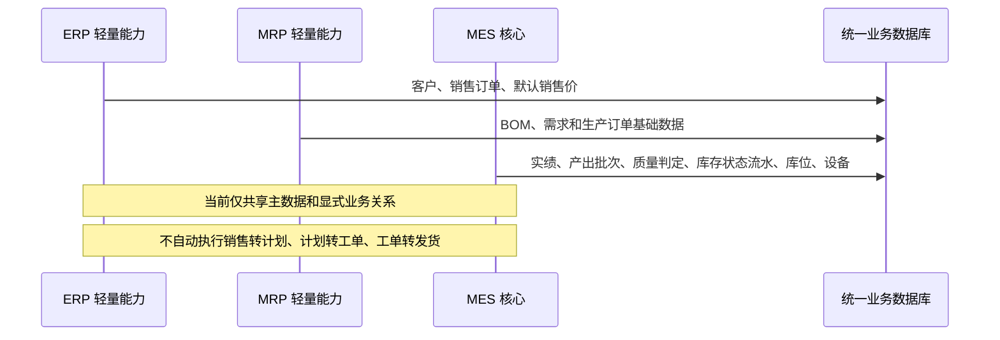
```mermaid
sequenceDiagram
  participant ERP as ERP 轻量能力
  participant MRP as MRP 轻量能力
  participant MES as MES 核心
  participant DB as 统一业务数据库

  ERP->>DB: 客户、销售订单、默认销售价
  MRP->>DB: BOM、需求和生产订单基础数据
  MES->>DB: 实绩、产出批次、质量判定、库存状态流水、库位、设备
  Note over ERP,MES: 当前仅共享主数据和显式业务关系
  Note over ERP,MES: 不自动执行销售转计划、计划转工单、工单转发货
```

## 7. 权限组与人员授权

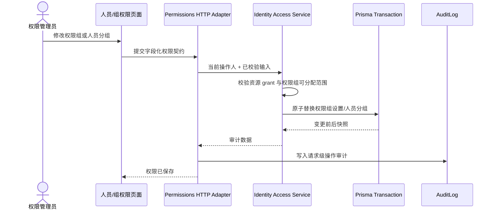
```mermaid
sequenceDiagram
  actor A as 权限管理员
  participant UI as 人员/组权限页面
  participant API as Permissions HTTP Adapter
  participant S as Identity Access Service
  participant DB as Prisma Transaction
  participant Audit as AuditLog

  A->>UI: 修改权限组或人员分组
  UI->>API: 提交字段化权限契约
  API->>S: 当前操作人 + 已校验输入
  S->>S: 校验资源 grant 与权限组可分配范围
  S->>DB: 原子替换权限组设置/人员分组
  DB-->>S: 变更前后快照
  S-->>API: 审计数据
  API->>Audit: 写入请求级操作审计
  API-->>UI: 权限已保存
```

权限 API 只处理 HTTP、会话入口、审计和错误映射；权限契约、授权规则与事务归 `modules/identity-access`，避免页面、API 和数据库写入各自维护一套授权逻辑。

### 7.1 管理员重置人员密码

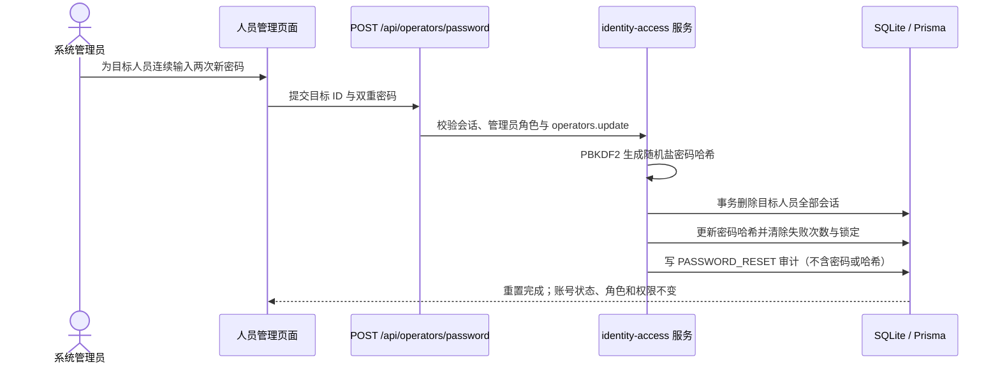
```mermaid
sequenceDiagram
  actor A as 系统管理员
  participant UI as 人员管理页面
  participant API as POST /api/operators/password
  participant S as identity-access 服务
  participant DB as SQLite / Prisma

  A->>UI: 为目标人员连续输入两次新密码
  UI->>API: 提交目标 ID 与双重密码
  API->>S: 校验会话、管理员角色与 operators.update
  S->>S: PBKDF2 生成随机盐密码哈希
  S->>DB: 事务删除目标人员全部会话
  S->>DB: 更新密码哈希并清除失败次数与锁定
  S->>DB: 写 PASSWORD_RESET 审计（不含密码或哈希）
  DB-->>UI: 重置完成；账号状态、角色和权限不变
```

旧密码不能恢复或查看。管理员重置只替换哈希；如果重置当前登录账号，当前会话也会失效并回到登录页。停用账号重置密码后仍保持停用，必须另行执行恢复。

## 8. 参数化供应商与客户资料

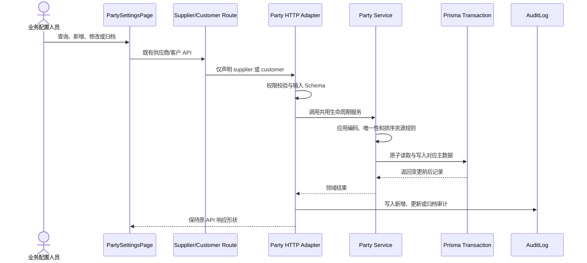
```mermaid
sequenceDiagram
  actor U as 业务配置人员
  participant UI as PartySettingsPage
  participant R as Supplier/Customer Route
  participant H as Party HTTP Adapter
  participant S as Party Service
  participant DB as Prisma Transaction
  participant A as AuditLog

  U->>UI: 查询、新增、修改或归档
  UI->>R: 既有供应商/客户 API
  R->>H: 仅声明 supplier 或 customer
  H->>H: 权限校验与输入 Schema
  H->>S: 调用共用生命周期服务
  S->>S: 应用编码、唯一性和排序资源规则
  S->>DB: 原子读取与写入对应主数据
  DB-->>S: 返回变更前后记录
  S-->>H: 领域结果
  H->>A: 写入新增、更新或归档审计
  H-->>UI: 保持原 API 响应形状
```

公共化不抹平业务差异：客户保留有效名称唯一规则，供应商保留允许同名但编码唯一规则。员工、库位和单位不接入这一服务，因为其账号关系、默认库位或量纲换算属于不同领域不变式。

## 9. 库位归档保护

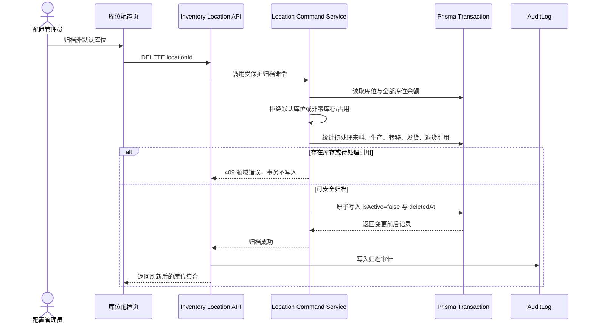
```mermaid
sequenceDiagram
  actor U as 配置管理员
  participant UI as 库位配置页
  participant API as Inventory Location API
  participant C as Location Command Service
  participant DB as Prisma Transaction
  participant A as AuditLog

  U->>UI: 归档非默认库位
  UI->>API: DELETE locationId
  API->>C: 调用受保护归档命令
  C->>DB: 读取库位与全部库位余额
  C->>C: 拒绝默认库位或非零库存/占用
  C->>DB: 统计待处理来料、生产、转移、发货、退货引用
  alt 存在库存或待处理引用
    C-->>API: 409 领域错误，事务不写入
  else 可安全归档
    C->>DB: 原子写入 isActive=false 与 deletedAt
    DB-->>C: 返回变更前后记录
    C-->>API: 归档成功
    API->>A: 写入归档审计
    API-->>UI: 返回刷新后的库位集合
  end
```

`PATCH isActive=false` 不再是停用旁路；有效库位必须走上述归档命令。设置默认库位会同时保证其启用并清除归档时间，系统没有有效默认库位时，新建的首个库位自动成为启用默认库位。

## 10. 设备迁移与工作中心归档保护

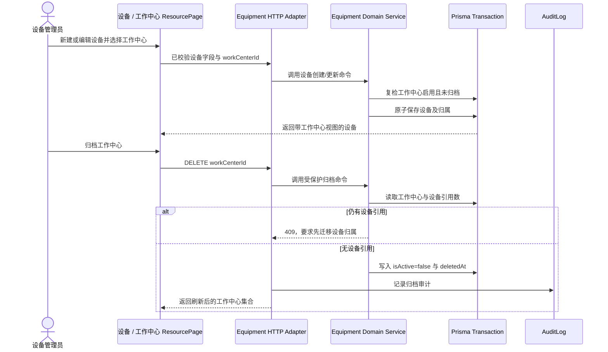
```mermaid
sequenceDiagram
  actor U as 设备管理员
  participant UI as 设备 / 工作中心 ResourcePage
  participant API as Equipment HTTP Adapter
  participant S as Equipment Domain Service
  participant DB as Prisma Transaction
  participant A as AuditLog

  U->>UI: 新建或编辑设备并选择工作中心
  UI->>API: 已校验设备字段与 workCenterId
  API->>S: 调用设备创建/更新命令
  S->>DB: 复检工作中心启用且未归档
  S->>DB: 原子保存设备及归属
  DB-->>UI: 返回带工作中心视图的设备

  U->>UI: 归档工作中心
  UI->>API: DELETE workCenterId
  API->>S: 调用受保护归档命令
  S->>DB: 读取工作中心与设备引用数
  alt 仍有设备引用
    S-->>API: 409，要求先迁移设备归属
  else 无设备引用
    S->>DB: 写入 isActive=false 与 deletedAt
    API->>A: 记录归档审计
    API-->>UI: 返回刷新后的工作中心集合
  end
```

普通 `PATCH isActive=false` 不得绕过设备引用检查。设备归档会同时写入 `STOPPED`；恢复工作中心通过显式更新清除 `deletedAt`，但归档设备不能继续编辑。

### 10.1 设备故障与恢复事件

```mermaid
sequenceDiagram
  actor M as 设备维护员
  participant UI as 设备事件弹窗
  participant API as /api/equipment/:id/events
  participant S as Equipment Event Service
  participant DB as Prisma Transaction
  participant A as AuditLog

  M->>UI: 选择故障并填写原因
  UI->>API: POST FAULT
  API->>API: 校验 equipmentEvents.update
  API->>S: 记录事件命令与可信操作人
  S->>DB: 校验当前状态并原子创建 FAULT + 更新 Equipment.status
  DB-->>UI: 返回故障状态和事件
  API->>A: 写前后快照与原因

  M->>UI: 维修试运行后选择恢复
  UI->>API: POST RECOVER
  S->>DB: 关闭最近未结束故障并计算持续时间
  S->>DB: 创建 RECOVER + 更新为 AVAILABLE
  DB-->>UI: 返回完整时间线
```

基础资料 `POST/PATCH /api/equipment` 严格拒绝 `status` 字段。只读岗位可用 `equipment.read` 获取时间线，但任何运行命令都必须通过 `equipmentEvents.update`；重复开机、错误状态恢复等非法转换返回 409。

## 11. 旧生产日报兼容过账与冲销

```mermaid
sequenceDiagram
  actor H as 历史兼容调用方
  participant API as Daily Production HTTP Adapter
  participant S as Production Legacy Service
  participant DB as Prisma Transaction
  participant I as Inventory Service
  participant A as AuditLog

  H->>API: POST 创建旧日报
  API-->>H: 410 Gone（禁止新增）

  H->>API: 修改既有旧日报草稿
  API->>S: 已校验输入
  S->>DB: 更新既有 BOM / 人员 / 耗用快照
  DB-->>API: DRAFT 历史兼容记录

  H->>API: 确认旧日报
  API->>S: confirmedBy
  S->>DB: 复检 DRAFT 与耗用快照
  S->>I: 逐项扣料并结转成本层
  S->>I: 产出入库到指定库位
  S->>DB: 原子写入 CONFIRMED 与成本快照
  API->>A: 记录确认审计

  H->>API: 冲销已确认旧日报
  API->>S: reason / reversedBy
  S->>DB: 复检产出未被后续消耗
  S->>I: 撤销产出并恢复原料与成本层
  S->>DB: 原子写入 REVERSED
  API->>A: 记录冲销审计
```

该链路只为服务器可能存在的 `DailyProductionReport` 历史数据保留，不恢复前端入口，也不再允许创建记录。HTTP 层不直接访问 Prisma；历史状态、库存和成本层规则集中在 `modules/production`。

## 12. 旧生产订单执行接口兼容边界

```mermaid
sequenceDiagram
  actor H as 历史兼容调用方
  participant API as Orders Legacy HTTP Adapter
  participant S as Production Legacy Execution Service
  participant DB as Prisma Transaction
  participant I as Inventory / Cost Service

  H->>API: POST /pick、/reports 或 /stock-in
  API->>API: orders 权限与 Zod 输入校验
  API->>S: 已校验的兼容命令
  alt 工单已有 materialId
    S-->>API: 410 Gone，改用 ProductionOrderActual
  else 领料
    S->>DB: 复检 CONFIRMED、领料项和库存预留
    S->>I: 结转成本层并扣减总库存与库位余额
    S->>DB: 写 PickItem、StockLog 与 PICKED 状态
  else 工序报工
    S->>DB: 读取默认路线和未归档工序
    S->>S: 按排序位置校验上一工序，不假设工序号连续
    S->>DB: 写 WorkReport 与 RUNNING / QC_WAITING 状态
  else 旧工单入库
    S->>DB: 复检 QC_DONE 并创建 StockIn
    S->>I: 更新总库存与默认库位余额
    S->>DB: 即使首次创建库存也写 StockLog，并完成工单
  end
  S-->>API: 兼容结果
```

当前生产页面不调用上述三条 URL；正式投入、产出、成本结转和冲销只走第 3 节的 `ProductionOrderActual`。兼容接口仅处理 `materialId=null` 的历史工单；后续只有在生产盘点、备份和可回滚迁移完成后才能下线。

## 13. 检验标准发布与任务快照

```mermaid
sequenceDiagram
  actor Q as 质量主管
  participant UI as 质量标准页面
  participant API as Quality Standard HTTP Adapter
  participant S as Quality Standard Service
  participant DB as Prisma Transaction
  participant Source as 来料/生产/退货事务
  participant Task as Quality Inspection Service

  Q->>UI: 新建或复制标准草稿
  UI->>API: 物料、来源类型、抽样规则、检验项目
  API->>S: 已鉴权且通过 Schema 的命令
  S->>DB: 保存 DRAFT 标准及有序项目
  Q->>UI: 发布标准
  API->>S: release
  S->>DB: 校验草稿完整性并写入 RELEASED
  Note over S,DB: 已发布版本不可直接修改；变更必须复制新草稿

  Source->>Task: 为新批次建立质量任务
  Task->>DB: 查找物料+来源类型的最新已发布标准
  Task->>Task: 计算建议抽样数量
  Task->>DB: 冻结标准编号、版本、规则及检验项目快照
  DB-->>Source: 待检任务
```

任务永远引用当时的快照，后续发布新标准不会重写历史检验事实。来料只有存在已发布 `MATERIAL_IN` 标准时才进入待检并创建任务；生产和退货批次按各自来源类型创建任务。

## 14. 质量判定、处置与库存状态

```mermaid
sequenceDiagram
  actor I as 检验员/质量主管
  participant UI as 质量任务或批次质量卡
  participant API as Quality Inspection HTTP Adapter
  participant Q as Quality Inspection Service
  participant INV as Inventory Status Service
  participant DB as Prisma Transaction
  participant A as AuditLog

  I->>UI: 填写逐项结果、抽样数量和附件
  UI->>API: 判定 PASS / FAIL 或部分数量
  API->>API: 校验质量命令权限与输入
  API->>Q: decide inspection
  Q->>DB: 锁定待检任务和批次余额
  alt 合格
    Q->>INV: QUARANTINE → AVAILABLE
  else 不合格
    Q->>INV: QUARANTINE → HOLD
  end
  INV->>DB: 同步批次、库位、总库存状态余额与流水
  Q->>DB: 保存检验结果和判定人
  API->>A: 写请求级审计
  DB-->>UI: 当前任务与批次状态

  opt 复检/返工/报废/让步/解冻
    I->>API: disposition action + 原因
    API->>Q: dispose inspection
    Q->>DB: 创建不可覆盖的 QualityDisposition
    Q->>INV: 转 QUARANTINE / REWORK / AVAILABLE 或扣减报废库存成本
    DB-->>UI: 处置记录和最终库存去向
  end
```

质量任务、批次状态、库位状态余额、成本和流水必须在同一事务中保持一致。前端不能直接修改库存状态；让步和解冻等高风险动作由独立权限控制。

## 15. 客户退货接收与质量回流

```mermaid
sequenceDiagram
  actor W as 仓库人员
  participant UI as 退货页面
  participant API as Return HTTP Adapter
  participant S as Sales Fulfillment Service
  participant I as Inventory Lot Service
  participant Q as Quality Inspection Service
  participant DB as Prisma Transaction

  W->>UI: 从已发货/已签收单选择退货物料和数量
  UI->>API: POST return with shipment source
  API->>S: createManagedReturn
  S->>DB: 校验原发货、物料和累计剩余可退量
  DB-->>UI: 待处理退货单

  W->>UI: 接收退货
  UI->>API: process return
  API->>S: processManagedReturn
  S->>DB: 锁定退货和原发货分配
  S->>I: 按原发货成本比例写入待检库存
  I->>DB: 创建独立退货批次和原发货批次回流边
  S->>Q: 创建 RETURN_ORDER 质量任务
  Q->>DB: 冻结标准/抽样/项目快照
  DB-->>UI: QUARANTINE 退货批次

  alt 拒绝退货
    W->>API: reject + 原因
    S->>DB: 写 REJECTED，不改变库存
  else 质量判定
    Q->>I: 放行、冻结、返工或报废
  end
```

退货不会直接加回普通可用库存。它先形成与原发货有关联、但拥有独立内部批号的待检批次，再由质量结果决定最终去向。

## 16. 周期点检异常到维修恢复

```mermaid
sequenceDiagram
  actor M as 点检/维修人员
  participant UI as 设备点检与维保页面
  participant API as Equipment HTTP Adapters
  participant INS as Inspection Command Service
  participant EVT as Equipment Event Service
  participant WO as Maintenance Command Service
  participant INV as Inventory Service
  participant DB as Prisma Transaction

  M->>UI: 按计划提交逐项点检结果
  UI->>API: complete inspection
  API->>INS: 已校验结果与操作人
  INS->>DB: 保存不可覆盖的检查事实
  alt 存在异常项
    INS->>EVT: 记录 FAULT
    EVT->>DB: 原子更新设备为 FAULT
    M->>UI: 创建纠正维修工单
    UI->>API: start work order
    API->>WO: 开始维修
    WO->>DB: 工单进入 IN_PROGRESS
    M->>UI: 完成工单并登记备件
    API->>WO: complete work order
    WO->>INV: 按可用备件批次 FIFO 领用
    INV->>DB: 扣减库存/成本并写批次流水
    WO->>EVT: 记录 RECOVER
    EVT->>DB: 关闭故障并恢复 AVAILABLE
  else 全部正常
    DB-->>UI: 保存完成记录，设备状态不变
  end
  DB-->>UI: 点检、事件、工单和备件时间线
```

设备基础资料接口拒绝直接写运行状态。状态只能由受控事件、异常点检和维保完成命令改变，避免台账编辑绕过维修证据。

## 16.5 生产日报 BOM 快捷转换

```mermaid
sequenceDiagram
  actor M as 授权管理人员
  participant UI as 生产日报页面
  participant API as daily-production-shortcut API
  participant PROD as 生产日报领域服务
  participant DB as SQLite / StockLog / AuditLog

  M->>UI: 选择正式 BOM、主产出数量、库位和产出处置
  UI->>UI: 按 BOM 比例展开投入并允许修正实耗
  UI->>API: 提交快捷转换整单
  API->>API: 校验 stocks.update、会话和库位数据范围
  API->>PROD: 传入可信操作人与 BOM 转换整单
  PROD->>DB: 开启单一事务并冻结 BOM/投入快照
  loop 每项 BOM 投入
    PROD->>DB: FIFO 扣减库存与成本层
  end
  alt 直接入库
    PROD->>DB: 主产出进入可用库存并承接投入成本
  else 后续质检
    PROD->>DB: 主产出进入待检库存并建立内部批次
    PROD->>DB: 生成质量任务，后续判定再转可用或冻结
  end
  PROD->>DB: 确认 DailyProductionReport + CONFIRM 审计
  DB-->>UI: 全部成功或全部回滚，不留下草稿
```

该时序不创建生产订单、派工或报工；省略的是复杂生产组织流程，不是 BOM、库存、成本、审计和可选质量控制。选择待检时复用统一质量任务与处置流程。库存盘点已移到库存菜单的独立页面，仍沿用 `daily-count` 事务且不能代替 BOM 转换。

## 17. 在线帮助与视频解析

```mermaid
sequenceDiagram
  actor U as 当前登录用户
  participant Page as 当前业务页面
  participant Help as 快捷帮助/完整帮助
  participant API as SOP Catalog API
  participant Auth as 权限与 pageKey 过滤
  participant Manifest as SOP Manifest + videos.json
  participant OSS as SOP_PUBLIC_BASE_URL / 媒体平台

  U->>Page: 点击快捷帮助或完整帮助
  Page->>Help: 新页面打开 /help?pageKey=当前页面
  Help->>API: 请求当前页目录
  API->>Auth: 校验登录、页面和资源读取权限
  Auth->>Manifest: 读取章节、工作流和视频关系
  Manifest-->>API: 仅返回有权查看的流程和媒体
  API-->>Help: 步骤、截图、结果检查、下载和播放信息
  alt OSS 文件视频/DOCX/PDF
    Help->>OSS: 访问版本化 HTTPS 地址
  else Bilibili/YouTube
    Help->>OSS: 使用受控嵌入播放地址
  end
```

视频通过工作流 ID 关联到现有 SOP，再由工作流映射到页面和权限；不建立与 SOP 平行的第二套分类。文件媒体可放在单一 OSS 下载点，Git 只保存清单和关系。

## 18. Coolify 启动、迁移前备份与就绪检查

```mermaid
sequenceDiagram
  participant C as Coolify
  participant Container as MES-lite Container
  participant Backup as Verified Backup Script
  participant Volume as data/uploads/backups 持久目录
  participant Prisma as Prisma Migrate
  participant Next as Next.js Standalone
  participant Health as /api/health/ready

  C->>Container: 部署指定 Git 提交并启动
  Container->>Volume: 检查明确挂载和可写性
  opt 旧数据库存在且启用迁移前备份
    Container->>Backup: 创建 SQLite 一致性快照
    Backup->>Volume: 写数据库+附件清单及 SHA-256 校验
  end
  Container->>Prisma: migrate deploy
  Prisma->>Volume: 只对持久数据库应用待执行迁移
  Container->>Next: 启动 server.js
  C->>Health: 轮询就绪状态
  Health->>Volume: 检查数据库、上传目录和备份新鲜度
  Health-->>C: ready / unhealthy + 明确原因
```

Docker 镜像本身不保存业务数据。Coolify 的正常停止、重启和重新部署必须继续使用同一组明确持久目录；删除应用或改挂载前必须先生成并验证可恢复备份。
