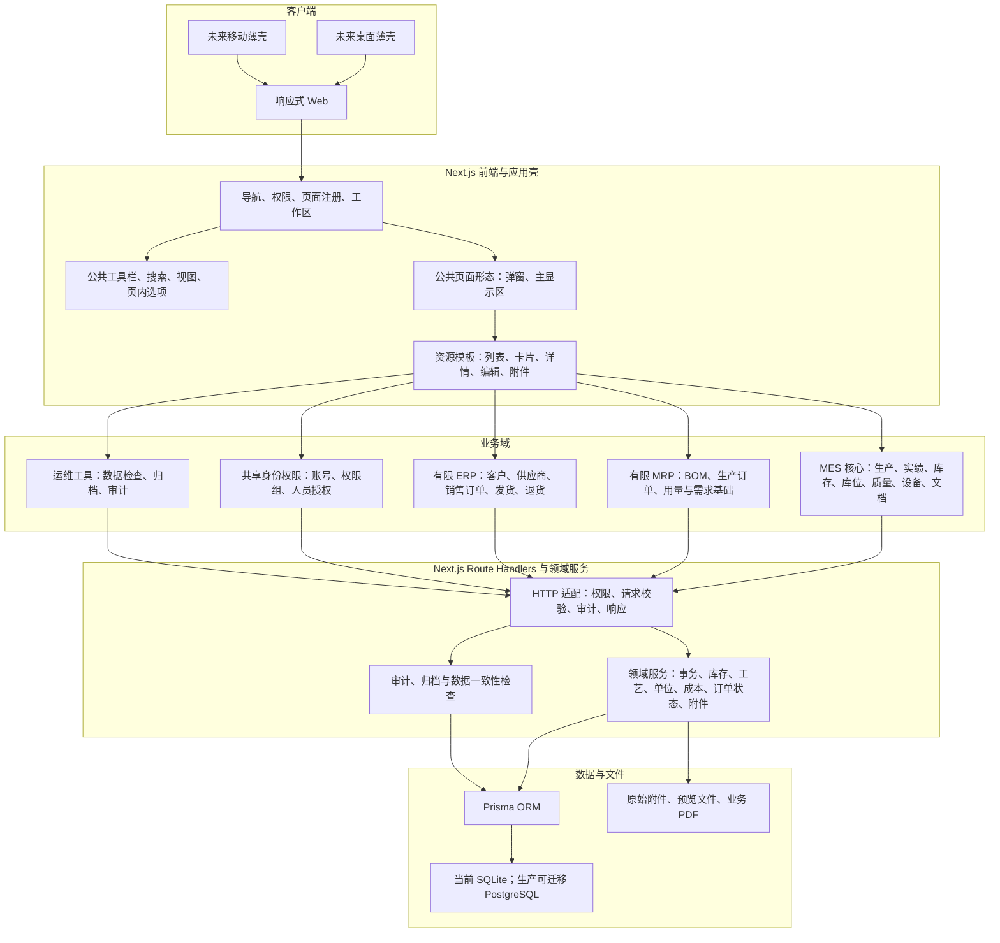
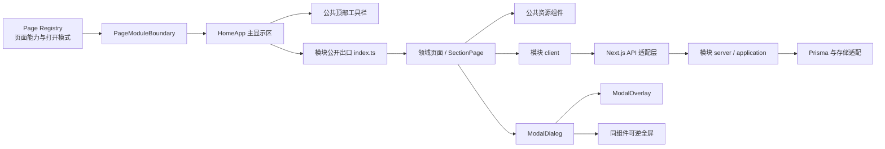
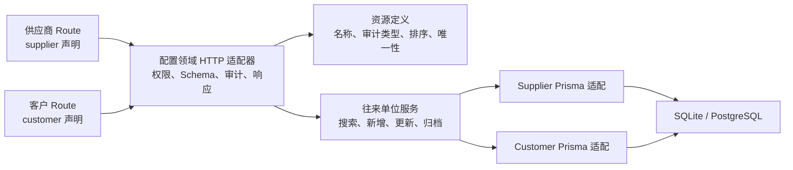
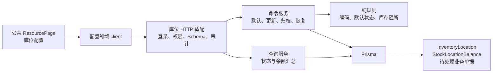
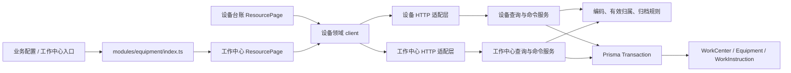
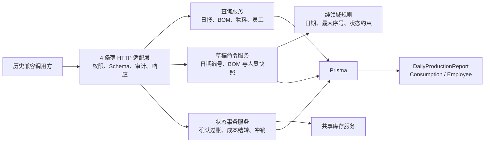

# MES-lite 系统结构图

## 1. 总体结构

## 2. 页面模块化骨架

页面只声明能力和业务内容。搜索、视图、页内选项、弹窗标题区、可逆全屏、附件管理等行为必须复用公共模块；业务页面不得并行实现“主页面打开”形态，专用文件查看器继续复用文件模块的全屏预览。仅复杂 BOM 工作区、仪表盘等页面级场景允许注册为例外。

### 2.1 参数化往来单位切片

参数化只覆盖字段结构和生命周期真正同构的供应商、客户资料。员工、库位、单位和工作中心仍有账号绑定、默认库位、单位换算或设备关联等独立规则，不能为了减少文件数强行接入同一万能 CRUD。

### 2.2 库位专用领域服务

库位页面仍使用公共资源骨架，但服务端保持专用领域规则；它不复用客商 CRUD，因为默认库位和库存/业务引用约束无法由普通资料配置安全表达。

### 2.3 设备与工作中心领域切片

菜单入口不等于代码所有权。工作中心虽然从业务配置菜单进入，但它定义设备能力区域并约束设备归属，因此其 UI、契约、搜索、client、规则和事务均由设备领域拥有；配置模块只负责 section 分派。

### 2.4 旧生产日报兼容切片

旧日报页面不再可达，生产订单实绩仍是唯一正式入口。兼容 API 暂留用于解释和处理服务器历史数据，但业务规则不再散落在 Route Handler 或扁平 `lib`；将来迁移到只读档案或删除旧表时，以该生产领域兼容切片作为唯一替换边界。

## 3. 功能域定位

| 域 | 当前定位 | 本阶段包含 | 本阶段不做 |
| --- | --- | --- | --- |
| MES | 主体 | 生产订单、生产实绩、库存、库位、流程转移、质量、设备、作业文档 | 高级 APS、设备协议全覆盖 |
| MRP | 有限支持 | BOM、生产用量、基础计划数据 | 自动净需求、完整采购建议、跨组织计划 |
| ERP | 有限支持 | 客户、供应商、销售订单、销售价、发货、退货 | 财务总账、应收应付、税务、自动订单编排 |

三个工作区是菜单和认知边界，不复制页面或数据库。同一页面原则上只归属一个主工作区；跨域关系通过明确字段和用户动作建立，不做隐式级联。
