# MES-lite 系统结构图

状态：当前代码与部署事实
事实基线：`v0.1.434` / 2026-08-22

本文从系统外部边界、运行部署、应用分层和领域模块四个层面说明 MES-lite。功能是否完备请结合[系统功能全景与完备性审查](./系统功能全景与完备性审查.md)，业务怎样流动请结合[当前功能流程与泳道](./MES当前功能流程与泳道.md)。

## 1. 系统上下文

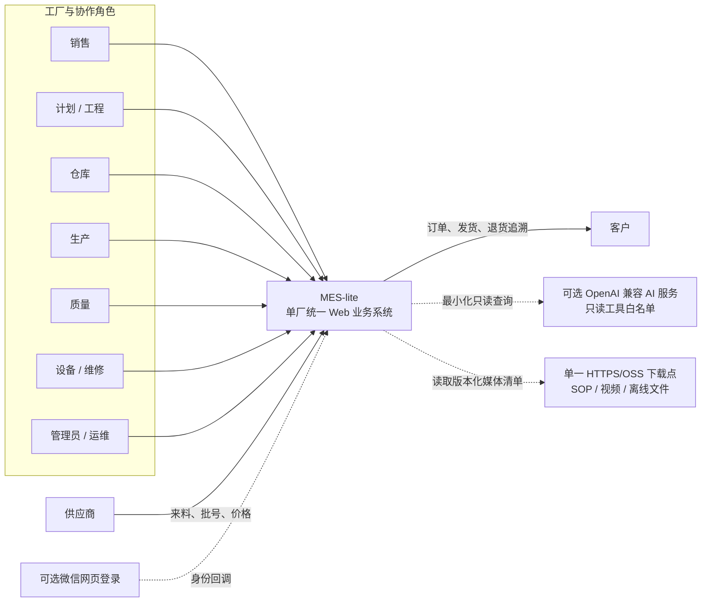

当前边界是单厂、单实例、统一数据库。MES 是主体，MRP/ERP 是有限协同能力和预留入口，不是三套独立应用。桌面端和移动端若后续发布，只能作为连接同一 Web/API 的薄壳。

## 2. 运行与部署架构

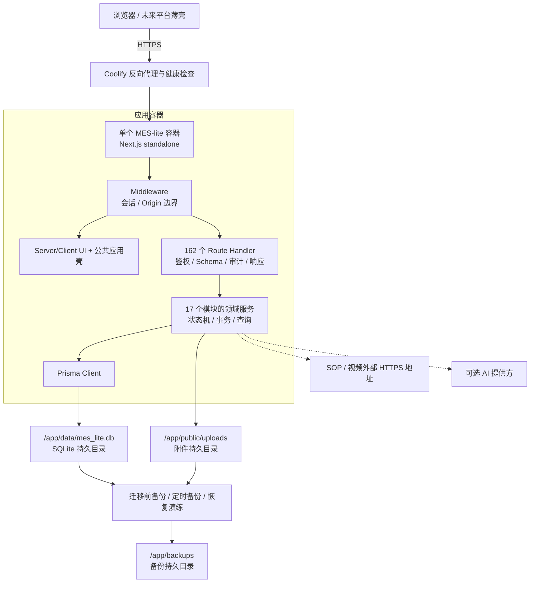

`/app/data`、`/app/public/uploads` 和 `/app/backups` 必须在 Coolify 中映射到明确、可识别和可备份的持久目录。镜像重建不能成为业务数据持久化机制；外部 SOP/视频下载点只保存发布媒体，不替代数据库与附件备份。

## 3. 领域模块与依赖方向

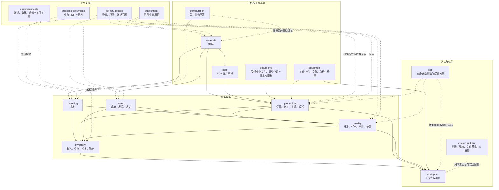

箭头表示业务事实或能力依赖，不表示允许任意跨模块导入。跨模块调用必须经模块公开入口；Route Handler 不拥有领域规则，UI 不直接请求数据库或复制事务逻辑。

## 4. 应用分层总体结构

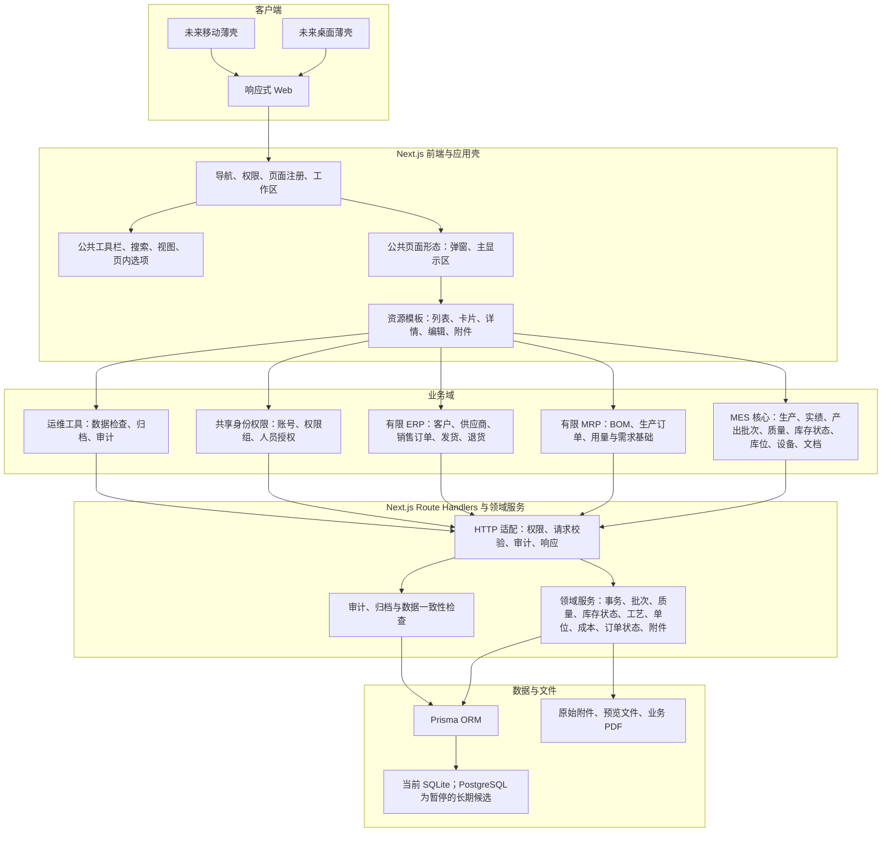

## 5. 页面模块化骨架

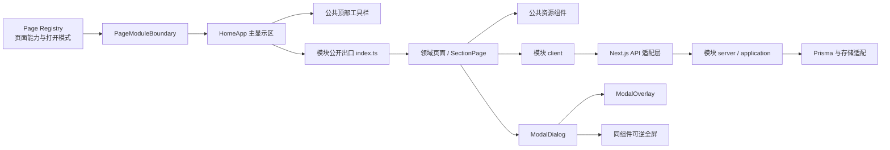

页面只声明能力和业务内容。搜索、视图、页内选项、弹窗标题区、可逆全屏、附件管理等行为必须复用公共模块；业务页面不得并行实现“主页面打开”形态，专用文件查看器继续复用文件模块的全屏预览。仅复杂 BOM 工作区、仪表盘等页面级场景允许注册为例外。

### 5.1 参数化往来单位切片

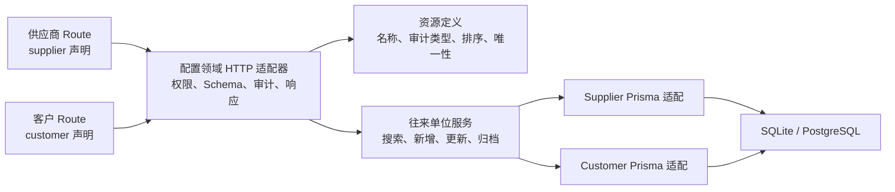

参数化只覆盖字段结构和生命周期真正同构的供应商、客户资料。员工、库位、单位和工作中心仍有账号绑定、默认库位、单位换算或设备关联等独立规则，不能为了减少文件数强行接入同一万能 CRUD。

### 5.2 库位专用领域服务

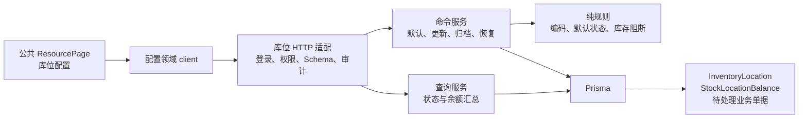

库位页面仍使用公共资源骨架，但服务端保持专用领域规则；它不复用客商 CRUD，因为默认库位和库存/业务引用约束无法由普通资料配置安全表达。

### 5.3 库存流水查询切片

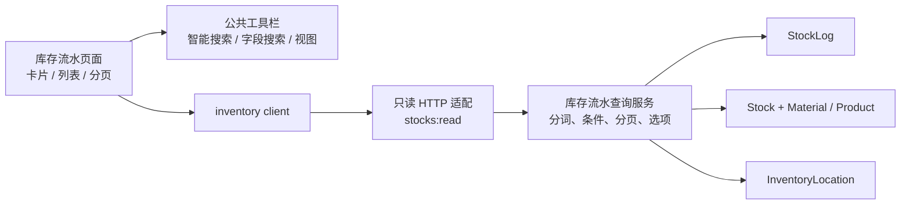

库存流水页面只提供可验证的查账入口，既有库存过账仍由来料、生产、销售、流程转移和库存调整领域服务写入同一个 `StockLog`，不能从页面建立第二套账。精确冲销通过 `sourceMovementId` / `reversalMovementId` 双向关联并由服务与数据库共同保护；部分退货等合法一对多回流只保留一般来源关联。

#### 生产日报 BOM 快捷转换与独立库存盘点切片

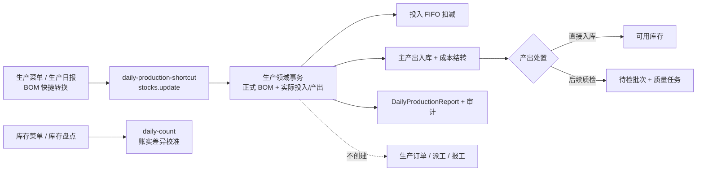

生产日报允许管理人员不填写生产人员、设备和工序，按可选的已发布 BOM 预填或直接登记实际投入与多个实际产出，完成库存转换和成本记录。产出可直接进入可用库存，也可进入待检批次并生成质量任务；需要人员、设备、作业文件和完整投入产出谱系时仍走生产订单实绩。库存盘点是库存菜单下的独立页面，只写库存差异事实。

### 5.4 设备与工作中心领域切片

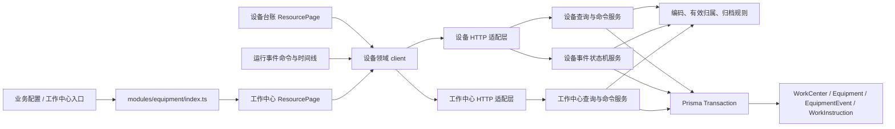

菜单入口不等于代码所有权。工作中心虽然从业务配置菜单进入，但它定义设备能力区域并约束设备归属，因此其 UI、契约、搜索、client、规则和事务均由设备领域拥有；配置模块只负责 section 分派。设备基础资料只维护静态字段，运行状态由 `EquipmentEvent` 状态机与设备快照在同一事务更新。

### 5.5 生产产出批次与质量状态切片

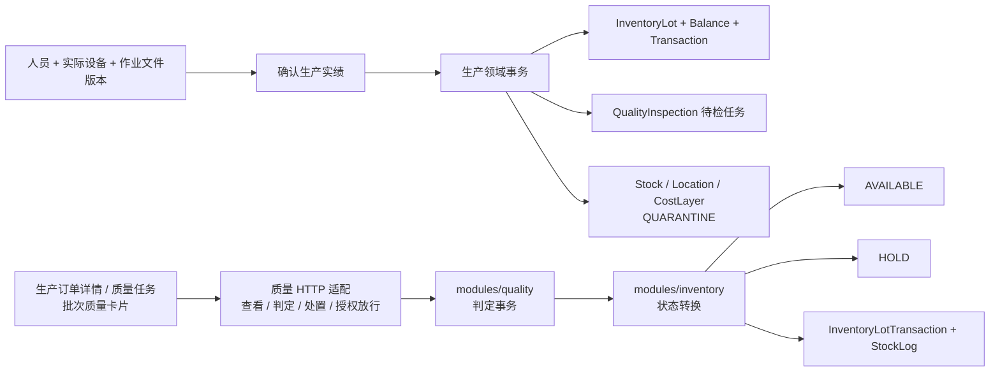

该切片保持生产、质量和库存的代码所有权：生产负责何时产生批次，质量负责检验判定与处置，库存负责状态余额、成本层和追溯读取。`v0.1.357` 增加跨工单质量任务入口，`v0.1.358` 已增加只读的可搜索批次全景。

### 5.6 来料到生产批次谱系切片

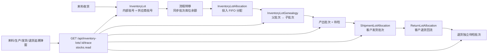

收货、生产和销售继续拥有自己的单据状态机，批次余额、分配、谱系与追溯查询归 `modules/inventory`。追溯 UI 复用公共 `ModalDialog` 和 `AppButton`，显示相邻生产节点和客户履约节点并允许继续导航；质量卡由 `modules/quality` 在生产和退货详情共同复用。

### 5.7 BOM 快捷生产日报与历史兼容切片

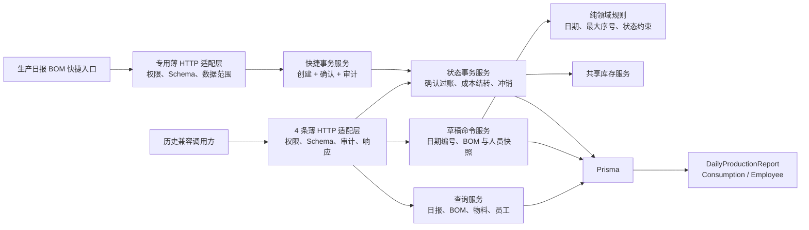

旧的大型通用日报页面仍不可达，4 条旧 API 暂留用于解释和处理服务器历史数据，旧创建接口继续返回 `410`。`v0.1.433` 只新增专用 BOM 快捷入口：它复用同一状态与库存服务，在一个事务中创建并确认日报，但不创建订单、派工或报工；选择待检时会复用统一质量任务。需要完整人员、设备、作业文件和谱系追溯时仍使用生产订单实绩。

## 6. 功能域定位

| 域 | 当前定位 | 本阶段包含 | 本阶段不做 |
| --- | --- | --- | --- |
| MES | 主体 | 生产订单、带人员/实际设备/作业文件版本快照的生产实绩、BOM 快捷投入/主产出过账、来料/产出/退货内部批次、投入与发货 FIFO 分配、父子谱系、客户去向、退货回流、质量处置、可用/待检/冻结库存、库位、流程转移、设备、作业文档 | 序列号、高级 APS、自动设备采集、节拍和 OEE |
| MRP | 有限支持 | BOM、生产用量、基础计划数据 | 自动净需求、完整采购建议、跨组织计划 |
| ERP | 有限支持 | 客户、供应商、销售订单、销售价、发货、退货 | 财务总账、应收应付、税务、自动订单编排 |

前端只有一个统一 MES 工作台，按现场任务和功能区组织菜单。左上角 MES-lite/MRP/ERP 是可改名、可控制预留项显隐的模块按钮：MES-lite 点击后返回仪表盘首页，MRP/ERP 不执行工作区切换；系统版本显示在左侧导航底部。MES、MRP-lite、ERP-lite 仅表示领域责任，不复制页面或数据库；跨域关系通过明确字段和用户动作建立，不做隐式级联。
