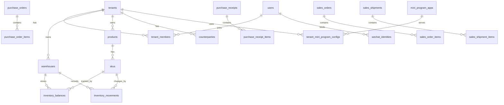

# MiniERP 数据模型草案

## 命名约定

- 主键统一使用 `id`。
- 所有业务表包含 `tenant_id`。
- 所有可审计表包含 `created_at`、`updated_at`、`created_by`、`updated_by`。
- 状态字段使用英文枚举值，页面展示再翻译成中文。
- 金额使用整数分或定点小数，避免浮点数。

## 表清单

### tenants

租户，也就是客户公司或经营主体。

| 字段 | 含义 |
| --- | --- |
| id | 租户 ID |
| name | 公司或组织名称 |
| short_name | 简称 |
| business_license_name | 营业执照名称，可选 |
| contact_name | 联系人 |
| contact_phone | 联系电话 |
| status | active, suspended, archived |
| created_at | 创建时间 |
| updated_at | 更新时间 |

### users

系统用户，表示一个自然人账号。

| 字段 | 含义 |
| --- | --- |
| id | 用户 ID |
| name | 姓名 |
| mobile | 手机号 |
| email | 邮箱，可选 |
| status | active, disabled |
| created_at | 创建时间 |
| updated_at | 更新时间 |

### operators

操作人员账号。第一版可先作为系统登录账号，后续再与租户成员身份合并。

| 字段 | 含义 |
| --- | --- |
| id | 操作人员 ID |
| username | 登录账号 |
| password_hash | 密码哈希 |
| name | 姓名 |
| phone | 手机号 |
| role | OPERATOR, AUDITOR, ADMIN |
| status | PENDING, ACTIVE, REJECTED, DISABLED |
| approved_at | 审核通过时间 |
| approved_by | 审核人 |
| last_login_at | 最近登录时间 |
| created_at | 注册时间 |
| updated_at | 更新时间 |

### operator_sessions

操作人员登录会话。

| 字段 | 含义 |
| --- | --- |
| id | 会话 ID |
| token_hash | 会话 token 哈希 |
| operator_id | 操作人员 ID |
| expires_at | 过期时间 |
| created_at | 创建时间 |

### tenant_members

用户在某个租户里的员工身份。

| 字段 | 含义 |
| --- | --- |
| id | 成员 ID |
| tenant_id | 租户 ID |
| user_id | 用户 ID |
| display_name | 租户内显示名 |
| role_id | 角色 ID |
| default_warehouse_id | 默认仓库 |
| status | active, disabled |
| created_at | 创建时间 |
| updated_at | 更新时间 |

### roles

租户角色。

| 字段 | 含义 |
| --- | --- |
| id | 角色 ID |
| tenant_id | 租户 ID，系统预置角色可为空 |
| code | 角色编码 |
| name | 角色名称 |
| description | 说明 |

### role_permissions

角色权限。

| 字段 | 含义 |
| --- | --- |
| id | 记录 ID |
| role_id | 角色 ID |
| permission_code | 权限编码 |

### stores

门店或经营点。

| 字段 | 含义 |
| --- | --- |
| id | 门店 ID |
| tenant_id | 租户 ID |
| name | 门店名称 |
| address | 地址 |
| status | active, disabled |

### warehouses

仓库。

| 字段 | 含义 |
| --- | --- |
| id | 仓库 ID |
| tenant_id | 租户 ID |
| store_id | 所属门店，可选 |
| name | 仓库名称 |
| type | main, store, vehicle, virtual |
| status | active, disabled |

### product_categories

商品分类。

| 字段 | 含义 |
| --- | --- |
| id | 分类 ID |
| tenant_id | 租户 ID |
| parent_id | 上级分类 |
| name | 分类名称 |
| sort_order | 排序 |

### products

商品。

| 字段 | 含义 |
| --- | --- |
| id | 商品 ID |
| tenant_id | 租户 ID |
| category_id | 分类 ID |
| name | 商品名称 |
| brand | 品牌 |
| status | active, discontinued |
| remark | 备注 |

### skus

SKU，实际库存单位。

| 字段 | 含义 |
| --- | --- |
| id | SKU ID |
| tenant_id | 租户 ID |
| product_id | 商品 ID |
| sku_code | SKU 编码 |
| barcode | 条码 |
| spec_text | 规格描述 |
| unit | 单位 |
| purchase_price | 默认采购价 |
| sale_price | 默认销售价 |
| low_stock_qty | 低库存预警数量 |
| status | active, disabled |

### counterparties

往来单位，客户和供应商共用。

| 字段 | 含义 |
| --- | --- |
| id | 往来单位 ID |
| tenant_id | 租户 ID |
| type | customer, supplier, both |
| name | 名称 |
| contact_name | 联系人 |
| contact_phone | 联系电话 |
| address | 地址 |
| status | active, disabled |

### purchase_orders

采购订单。

| 字段 | 含义 |
| --- | --- |
| id | 采购订单 ID |
| tenant_id | 租户 ID |
| order_no | 单号 |
| supplier_id | 供应商 ID |
| warehouse_id | 默认入库仓库 |
| status | draft, pending_review, approved, partial_received, completed, cancelled |
| order_date | 订单日期 |
| total_amount | 总金额 |
| remark | 备注 |
| created_at | 创建时间 |
| updated_at | 更新时间 |

### purchase_order_items

采购订单明细。

| 字段 | 含义 |
| --- | --- |
| id | 明细 ID |
| tenant_id | 租户 ID |
| purchase_order_id | 采购订单 ID |
| sku_id | SKU ID |
| qty | 采购数量 |
| received_qty | 已入库数量 |
| unit_price | 单价 |
| amount | 金额 |

### purchase_receipts

采购入库单。

| 字段 | 含义 |
| --- | --- |
| id | 入库单 ID |
| tenant_id | 租户 ID |
| receipt_no | 单号 |
| purchase_order_id | 采购订单 ID，可选 |
| supplier_id | 供应商 ID |
| warehouse_id | 入库仓库 |
| status | draft, confirmed, cancelled |
| receipt_date | 入库日期 |
| remark | 备注 |

### purchase_receipt_items

采购入库明细。

| 字段 | 含义 |
| --- | --- |
| id | 明细 ID |
| tenant_id | 租户 ID |
| purchase_receipt_id | 入库单 ID |
| purchase_order_item_id | 来源采购明细，可选 |
| sku_id | SKU ID |
| qty | 入库数量 |
| unit_price | 单价 |
| amount | 金额 |

### sales_orders

销售订单。

| 字段 | 含义 |
| --- | --- |
| id | 销售订单 ID |
| tenant_id | 租户 ID |
| order_no | 单号 |
| customer_id | 客户 ID |
| warehouse_id | 默认出库仓库 |
| status | draft, pending_review, approved, partial_shipped, completed, cancelled |
| order_date | 订单日期 |
| total_amount | 总金额 |
| remark | 备注 |

### sales_order_items

销售订单明细。

| 字段 | 含义 |
| --- | --- |
| id | 明细 ID |
| tenant_id | 租户 ID |
| sales_order_id | 销售订单 ID |
| sku_id | SKU ID |
| qty | 销售数量 |
| shipped_qty | 已出库数量 |
| unit_price | 单价 |
| amount | 金额 |

### sales_shipments

销售出库单。

| 字段 | 含义 |
| --- | --- |
| id | 出库单 ID |
| tenant_id | 租户 ID |
| shipment_no | 单号 |
| sales_order_id | 销售订单 ID，可选 |
| customer_id | 客户 ID |
| warehouse_id | 出库仓库 |
| status | draft, confirmed, cancelled |
| shipment_date | 出库日期 |
| remark | 备注 |

### sales_shipment_items

销售出库明细。

| 字段 | 含义 |
| --- | --- |
| id | 明细 ID |
| tenant_id | 租户 ID |
| sales_shipment_id | 出库单 ID |
| sales_order_item_id | 来源销售明细，可选 |
| sku_id | SKU ID |
| qty | 出库数量 |
| unit_price | 单价 |
| amount | 金额 |

### inventory_balances

库存余额。

| 字段 | 含义 |
| --- | --- |
| id | 余额 ID |
| tenant_id | 租户 ID |
| warehouse_id | 仓库 ID |
| sku_id | SKU ID |
| on_hand_qty | 现存量 |
| locked_qty | 锁定量 |
| available_qty | 可用量 |
| updated_at | 更新时间 |

唯一约束：

- `tenant_id + warehouse_id + sku_id`

### inventory_movements

库存流水，库存变化的核心事实表。

| 字段 | 含义 |
| --- | --- |
| id | 流水 ID |
| tenant_id | 租户 ID |
| movement_no | 流水号 |
| warehouse_id | 仓库 ID |
| sku_id | SKU ID |
| direction | in, out |
| movement_type | purchase_receipt, sales_shipment, stock_gain, stock_loss, adjustment_in, adjustment_out, transfer_in, transfer_out |
| qty | 数量 |
| unit_cost | 成本价，可选 |
| source_type | 来源单据类型 |
| source_id | 来源单据 ID |
| occurred_at | 发生时间 |
| created_by | 创建人 |

### stock_adjustments

库存调整单。

| 字段 | 含义 |
| --- | --- |
| id | 调整单 ID |
| tenant_id | 租户 ID |
| adjustment_no | 单号 |
| warehouse_id | 仓库 ID |
| status | draft, confirmed, cancelled |
| reason | 原因 |
| remark | 备注 |

### stock_adjustment_items

库存调整明细。

| 字段 | 含义 |
| --- | --- |
| id | 明细 ID |
| tenant_id | 租户 ID |
| stock_adjustment_id | 调整单 ID |
| sku_id | SKU ID |
| direction | in, out |
| qty | 调整数量 |
| reason | 原因 |

### stock_counts

盘点单。

| 字段 | 含义 |
| --- | --- |
| id | 盘点单 ID |
| tenant_id | 租户 ID |
| count_no | 单号 |
| warehouse_id | 仓库 ID |
| status | draft, counted, confirmed, cancelled |
| count_date | 盘点日期 |
| remark | 备注 |

### stock_count_items

盘点明细。

| 字段 | 含义 |
| --- | --- |
| id | 明细 ID |
| tenant_id | 租户 ID |
| stock_count_id | 盘点单 ID |
| sku_id | SKU ID |
| book_qty | 账面数量 |
| actual_qty | 实盘数量 |
| diff_qty | 差异数量 |

### mini_program_apps

微信小程序应用配置。

| 字段 | 含义 |
| --- | --- |
| id | 应用 ID |
| appid | 微信 AppID |
| name | 小程序名称 |
| owner_type | developer, tenant |
| owner_tenant_id | 如果客户自有主体，则记录租户 ID |
| subject_name | 小程序主体名称 |
| status | active, migrating, disabled |
| created_at | 创建时间 |
| updated_at | 更新时间 |

### tenant_mini_program_configs

租户与小程序入口的关系。

| 字段 | 含义 |
| --- | --- |
| id | 配置 ID |
| tenant_id | 租户 ID |
| mini_program_app_id | 小程序应用 ID |
| default_entry | 是否默认入口 |
| migration_status | none, planned, in_progress, completed |

### wechat_identities

微信身份绑定。

| 字段 | 含义 |
| --- | --- |
| id | 微信身份 ID |
| mini_program_app_id | 小程序应用 ID |
| openid | 小程序 openid |
| unionid | unionid，可选 |
| user_id | 系统用户 ID |
| bound_at | 绑定时间 |

### document_attachments

原始单据附件。所有业务对象共用这张表，不在每张单据表里单独增加照片字段。

| 字段 | 含义 |
| --- | --- |
| id | 附件 ID |
| owner_type | 业务对象类型，如 purchase_receipt, sales_shipment, stock_count |
| owner_id | 业务对象 ID |
| document_type | 附件类型，第一版默认为 original |
| original_name | 原始文件名 |
| file_name | 存储文件名 |
| mime_type | 文件 MIME 类型 |
| size | 文件大小 |
| url | 访问地址 |
| storage_path | 存储路径 |
| note | 备注 |
| uploaded_by | 上传人 |
| created_at | 上传时间 |

索引：

- `owner_type + owner_id`

### sawing_cost_scenarios（当前 Prisma 已实现）

锯切成本计算方案。保存当次材料输入、材料口径计算结果、规模经营测算结果和加工工艺组合，用于多方案对比。

| 字段 | 含义 |
| --- | --- |
| id | 方案 ID |
| name | 方案名称 |
| material_length / material_weight | 材料长度与总重量 |
| workpiece_length / blade_thickness | 工件长度与锯缝 |
| raw_material_price / sawdust_price / scrap_price | 原料及回收单价 |
| finished_price | 成品单价 |
| quantity / utilization | 可加工数量与材料利用率 |
| net_material_cost / material_cost_per_piece | 净材料成本与单件材料成本 |
| profit_per_piece / total_profit / gross_margin | 材料口径毛利结果 |
| labor_cost | 新版锯切计算中保存规模测算人工成本 |
| fixed_cost | 新版锯切计算中保存规模机时费用和其他期间费用 |
| full_cost / full_profit / full_margin | 新版锯切计算中保存规模总成本、经营利润和经营利润率 |
| product_kind / product_id | 保存为临时产品或绑定已有产品；临时产品不进入正式产品档案 |
| labor_hours_per_piece / machine_hours_per_piece | 后续混合测算调用时使用的单件人工时和单件机时快照 |
| process_templates | 多对多关联的加工工艺模板 |

### BOMItem 锯切成本组成

`BOMItem` 支持两类组成：

- `MATERIAL`：原有物料组成，参与工单创建时的领料需求、库存预留和成本扣减。
- `SAWING_COST`：锯切成本组成，关联 `SawingCostScenario`，用于表达某个产品 BOM 包含一段锯切测算成本，不参与领料和库存扣减。

锯切费用计算器保存方案时，可将当前锯切测算作为 `SAWING_COST` 项追加到指定产品 BOM。该项保存数量、单位和锯切方案引用，具体单件材料成本、人工时和机时从关联的锯切方案读取。

### production_cost_items（当前 Prisma 已实现）

保存成本方案中用户自行录入或页面生成的费用明细。新版锯切计算会生成规模测算人工工时、机时费用和其他期间费用快照。

| 字段 | 含义 |
| --- | --- |
| scenario_id | 所属锯切/生产成本方案 |
| stage | `DIRECT`、`LABOR`、`FIXED` |
| name | 用户自定义费用名称 |
| method | 直接金额、数量单价、人数工时、计件或周转分摊 |
| input_a / input_b / input_c | 计算方法所需的数值快照 |
| amount | 当时计算结果 |
| is_deduction | 是否为回收价值或其他抵扣 |

### process_templates 可计算工艺参数

加工工艺模板不只保存名称和工位，还保存可换算千件工时、机时和变动工艺成本的标准参数：

- 标准批量与每批准备时间。
- 单件节拍与标准合格率。
- 人数与人工小时费率。
- 设备数量与设备机时费率。
- 每小时能源费和每批耗材费。

```text
千件运行工时 = (1000 ÷ 合格率) × 单件节拍 ÷ 3600
千件准备工时 = 每批准备时间 × (1000 ÷ 标准批量)
千件人工工时 = (运行工时 + 准备工时) × 人数
千件机时 = (运行工时 + 准备工时) × 设备数量
```

### process_steps 工艺成本快照

产品工艺路线可从加工工艺模板加入工序。加入时将模板编码、批量、节拍、人员、设备、费率、耗材和合格率复制到 `ProcessStep`。

- 后续修改通用工艺模板，不会静默改变已保存产品路线的标准成本。
- 重新选择模板时，才会用最新模板覆盖当前工序快照。
- 路线的千件人工工时、机时和工艺成本由所有未归档工序快照汇总。

## 核心关系



## 第一版最小数据闭环

如果先做可运行版本，至少需要以下表：

- `tenants`
- `users`
- `tenant_members`
- `roles`
- `warehouses`
- `product_categories`
- `products`
- `skus`
- `counterparties`
- `purchase_receipts`
- `purchase_receipt_items`
- `sales_shipments`
- `sales_shipment_items`
- `inventory_balances`
- `inventory_movements`
- `mini_program_apps`
- `wechat_identities`
- `document_attachments`

采购订单和销售订单可以第二步加入。第一版也可以直接做入库单和出库单，先把库存流水跑通。

## 关键约束

- 确认后的单据不允许物理删除，只能红冲、作废或归档。
- 库存流水不允许修改，只能追加更正流水。
- 原始单据附件不直接写入业务表，通过统一附件表关联。
- 出库确认时必须校验库存不能为负，除非租户明确开启负库存。
- 所有查询必须带 `tenant_id`，后台运维查询也要记录审计日志。
- 微信 openid 不能直接当员工账号，必须绑定到 `users` 和 `tenant_members`。
