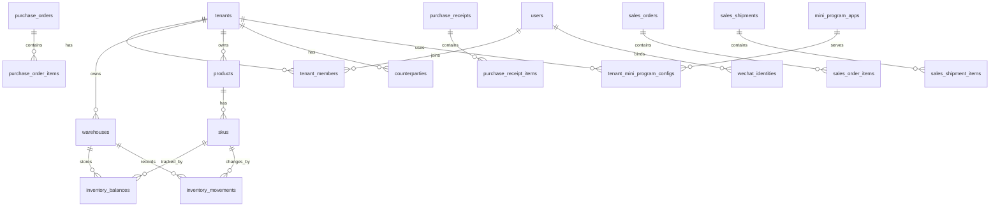

# MiniERP 数据模型草案

## 命名约定

- 主键统一使用 `id`。
- 所有业务表包含 `tenant_id`。
- 所有可审计表包含 `created_at`、`updated_at`、`created_by`、`updated_by`。
- 状态字段使用英文枚举值，页面展示再翻译成中文。
- 金额使用整数分或定点小数，避免浮点数。

## 表清单

### tenants

租户，也就是客户公司或经营主体。

| 字段 | 含义 |
| --- | --- |
| id | 租户 ID |
| name | 公司或组织名称 |
| short_name | 简称 |
| business_license_name | 营业执照名称，可选 |
| contact_name | 联系人 |
| contact_phone | 联系电话 |
| status | active, suspended, archived |
| created_at | 创建时间 |
| updated_at | 更新时间 |

### users

系统用户，表示一个自然人账号。

| 字段 | 含义 |
| --- | --- |
| id | 用户 ID |
| name | 姓名 |
| mobile | 手机号 |
| email | 邮箱，可选 |
| status | active, disabled |
| created_at | 创建时间 |
| updated_at | 更新时间 |

### operators

操作人员账号。第一版可先作为系统登录账号，后续再与租户成员身份合并。

| 字段 | 含义 |
| --- | --- |
| id | 操作人员 ID |
| username | 登录账号 |
| password_hash | 密码哈希 |
| name | 姓名 |
| phone | 手机号 |
| role | OPERATOR, AUDITOR, ADMIN |
| status | PENDING, ACTIVE, REJECTED, DISABLED |
| approved_at | 审核通过时间 |
| approved_by | 审核人 |
| last_login_at | 最近登录时间 |
| created_at | 注册时间 |
| updated_at | 更新时间 |

### operator_sessions

操作人员登录会话。

| 字段 | 含义 |
| --- | --- |
| id | 会话 ID |
| token_hash | 会话 token 哈希 |
| operator_id | 操作人员 ID |
| expires_at | 过期时间 |
| created_at | 创建时间 |

### employees

`Employee` 是业务员工档案，不是登录账号。它由“配置 / 员工资料”维护，供班后生产实绩和流程转移选择；新增员工不会自动创建 `Operator`、登录凭证或权限。

| 字段 | 含义 |
| --- | --- |
| id | 数据库内部员工 ID；只用于表关联和内部接口定位，不在业务页面、报表或导出中展示 |
| code | 系统自动生成的业务员工编码，格式为 `EMP-000001`，组织内唯一且创建后不可修改 |
| name | 员工姓名 |
| department | 部门，可选 |
| phone | 联系电话，可选 |
| note | 备注，可选 |
| isActive | 是否允许用于新业务单据 |
| operatorId | 可选绑定的注册账号 ID，唯一；一个账号最多绑定一名员工 |
| createdAt / updatedAt | 创建和更新时间 |

新增员工时服务端根据现有系统员工编码生成下一连续编号，不接收用户指定编码；历史非 `EMP-` 格式编码不参与编号计算。员工停用后不再出现在新单据选择器中，但编码和已经保存的人员快照都保持不变。业务页面、打印、报表、导出和对外集成使用 `code`；内部前端接口可以携带不展示的 `id` 完成选择和更新，但不能把隐藏 ID 当作权限控制。`Operator` 继续负责注册、登录、角色和权限；管理员可在员工资料中显式建立可空的一对一绑定。绑定或解除绑定不修改账号状态、角色和权限，删除账号时员工档案保留并自动解除绑定。

### tenant_members

用户在某个租户里的员工身份。

| 字段 | 含义 |
| --- | --- |
| id | 成员 ID |
| tenant_id | 租户 ID |
| user_id | 用户 ID |
| display_name | 租户内显示名 |
| role_id | 角色 ID |
| default_warehouse_id | 默认仓库 |
| status | active, disabled |
| created_at | 创建时间 |
| updated_at | 更新时间 |

### roles

租户角色。

| 字段 | 含义 |
| --- | --- |
| id | 角色 ID |
| tenant_id | 租户 ID，系统预置角色可为空 |
| code | 角色编码 |
| name | 角色名称 |
| description | 说明 |

### role_permissions

角色权限。

| 字段 | 含义 |
| --- | --- |
| id | 记录 ID |
| role_id | 角色 ID |
| permission_code | 权限编码 |

### stores

门店或经营点。

| 字段 | 含义 |
| --- | --- |
| id | 门店 ID |
| tenant_id | 租户 ID |
| name | 门店名称 |
| address | 地址 |
| status | active, disabled |

### warehouses

仓库。

| 字段 | 含义 |
| --- | --- |
| id | 仓库 ID |
| tenant_id | 租户 ID |
| store_id | 所属门店，可选 |
| name | 仓库名称 |
| type | main, store, vehicle, virtual |
| status | active, disabled |

### product_categories

商品分类。

| 字段 | 含义 |
| --- | --- |
| id | 分类 ID |
| tenant_id | 租户 ID |
| parent_id | 上级分类 |
| name | 分类名称 |
| sort_order | 排序 |

### products

商品。

| 字段 | 含义 |
| --- | --- |
| id | 商品 ID |
| tenant_id | 租户 ID |
| category_id | 分类 ID |
| name | 商品名称 |
| brand | 品牌 |
| status | active, discontinued |
| remark | 备注 |

### skus

SKU，实际库存单位。

| 字段 | 含义 |
| --- | --- |
| id | SKU ID |
| tenant_id | 租户 ID |
| product_id | 商品 ID |
| sku_code | SKU 编码 |
| barcode | 条码 |
| spec_text | 规格描述 |
| unit | 单位 |
| purchase_price | 默认采购价 |
| sale_price | 默认销售价 |
| low_stock_qty | 低库存预警数量 |
| status | active, disabled |

### counterparties

往来单位，客户和供应商共用。

| 字段 | 含义 |
| --- | --- |
| id | 往来单位 ID |
| tenant_id | 租户 ID |
| type | customer, supplier, both |
| name | 名称 |
| contact_name | 联系人 |
| contact_phone | 联系电话 |
| address | 地址 |
| status | active, disabled |

### purchase_orders

采购订单。

| 字段 | 含义 |
| --- | --- |
| id | 采购订单 ID |
| tenant_id | 租户 ID |
| order_no | 单号 |
| supplier_id | 供应商 ID |
| warehouse_id | 默认入库仓库 |
| status | draft, pending_review, approved, partial_received, completed, cancelled |
| order_date | 订单日期 |
| total_amount | 总金额 |
| currency | 订单币种快照，当前默认为 `CNY` |
| remark | 备注 |
| created_at | 创建时间 |
| updated_at | 更新时间 |

### purchase_order_items

采购订单明细。

| 字段 | 含义 |
| --- | --- |
| id | 明细 ID |
| tenant_id | 租户 ID |
| purchase_order_id | 采购订单 ID |
| sku_id | SKU ID |
| qty | 采购数量 |
| received_qty | 已入库数量 |
| unit_price | 单价 |
| amount | 金额 |

### purchase_receipts

采购入库单。

| 字段 | 含义 |
| --- | --- |
| id | 入库单 ID |
| tenant_id | 租户 ID |
| receipt_no | 单号 |
| purchase_order_id | 采购订单 ID，可选 |
| supplier_id | 供应商 ID |
| warehouse_id | 入库仓库 |
| status | draft, confirmed, cancelled |
| receipt_date | 入库日期 |
| remark | 备注 |

### purchase_receipt_items

采购入库明细。

| 字段 | 含义 |
| --- | --- |
| id | 明细 ID |
| tenant_id | 租户 ID |
| purchase_receipt_id | 入库单 ID |
| purchase_order_item_id | 来源采购明细，可选 |
| sku_id | SKU ID |
| qty | 入库数量 |
| unit_price | 单价 |
| amount | 金额 |

### sales_orders

销售订单。

| 字段 | 含义 |
| --- | --- |
| id | 销售订单 ID |
| order_no | 单号 |
| voucher_no | 客户订单号或外部凭据号 |
| customer_id | 客户 ID |
| status | `DRAFT / CONFIRMED / PARTIAL / COMPLETED / CANCELLED` |
| order_date | 订单日期 |
| delivery_date | 计划交付日期，可选 |
| total_amount | 总金额 |
| note | 备注 |
| deleted_at / deleted_by | 软归档信息 |

### sales_order_items

销售订单明细。

| 字段 | 含义 |
| --- | --- |
| id | 明细 ID |
| sales_order_id | 销售订单 ID |
| material_id | 统一物料 ID |
| qty | 销售数量 |
| shipped_qty | 已确认发货数量；待发货单数量另由关联 `Shipment` 汇总 |
| unit | 下单时物料库存单位快照 |
| unit_price | 单价 |
| total_amount | 金额 |
| currency | 明细币种快照 |
| price_source | `MATERIAL_DEFAULT / MANUAL`，说明价格来源 |
| default_sale_price_snapshot | 下单时物料默认销售价快照 |
| price_adjusted_at / by / reason | 后续手工调价时间、操作人和原因 |
| note | 明细备注 |

### shipments

销售出库单。

| 字段 | 含义 |
| --- | --- |
| id | 出库单 ID |
| tenant_id | 租户 ID |
| shipment_no | 单号 |
| sales_order_id | 可选来源销售订单 ID；独立发货为空 |
| sales_order_item_id | 可选来源销售订单明细 ID；关联时用于控制未发数量和回写进度 |
| customer_id | 客户 ID |
| warehouse_id | 出库仓库 |
| status | `PENDING / SHIPPED / DELIVERED / CANCELLED` |
| location_id | 实际发货库位 |
| qty / unit_price / total_amount | 本次发货数量、订单单价和金额 |
| customer / customer_phone / address | 创建发货单时冻结的甲方快照 |
| shipped_at | 实际确认发货时间 |

轻量版允许独立创建 `Shipment`，也允许显式关联一条销售订单明细；同一销售订单可关联多张发货单。关联时甲方来自订单客户，独立发货时由用户选择客户；乙方企业资料存放在 `SystemSetting` 的 `company.*` 键中并用于 PDF。销售订单页面不直接派生发货单。

销售订单、发货与退货的读取、创建、状态流转和归档由 `modules/sales/server` 统一拥有。关联待发货数量从有效 `PENDING` 发货单汇总，确认发货才累计 `shipped_qty` 并原子扣减总库存、库位余额与成本；关联退货处理按原发货 `shippedValuationQty / shippedCostAmount` 比例恢复库存，库存流水幂等键阻止重复过账。

### inventory_balances

库存余额。

| 字段 | 含义 |
| --- | --- |
| id | 余额 ID |
| tenant_id | 租户 ID |
| warehouse_id | 仓库 ID |
| sku_id | SKU ID |
| on_hand_qty | 现存量 |
| locked_qty | 锁定量 |
| available_qty | 可用量 |
| updated_at | 更新时间 |

唯一约束：

- `tenant_id + warehouse_id + sku_id`

### inventory_movements

库存流水，库存变化的核心事实表。

| 字段 | 含义 |
| --- | --- |
| id | 流水 ID |
| tenant_id | 租户 ID |
| movement_no | 流水号 |
| warehouse_id | 仓库 ID |
| sku_id | SKU ID |
| direction | in, out |
| movement_type | purchase_receipt, sales_shipment, stock_gain, stock_loss, adjustment_in, adjustment_out, transfer_in, transfer_out |
| qty | 数量 |
| unit_cost | 成本价，可选 |
| source_type | 来源单据类型 |
| source_id | 来源单据 ID |
| occurred_at | 发生时间 |
| created_by | 创建人 |

### stock_adjustments

库存调整单。

| 字段 | 含义 |
| --- | --- |
| id | 调整单 ID |
| tenant_id | 租户 ID |
| adjustment_no | 单号 |
| warehouse_id | 仓库 ID |
| status | draft, confirmed, cancelled |
| reason | 原因 |
| remark | 备注 |

### stock_adjustment_items

库存调整明细。

| 字段 | 含义 |
| --- | --- |
| id | 明细 ID |
| tenant_id | 租户 ID |
| stock_adjustment_id | 调整单 ID |
| sku_id | SKU ID |
| direction | in, out |
| qty | 调整数量 |
| reason | 原因 |

### stock_counts

盘点单。

| 字段 | 含义 |
| --- | --- |
| id | 盘点单 ID |
| tenant_id | 租户 ID |
| count_no | 单号 |
| warehouse_id | 仓库 ID |
| status | draft, counted, confirmed, cancelled |
| count_date | 盘点日期 |
| remark | 备注 |

### stock_count_items

盘点明细。

| 字段 | 含义 |
| --- | --- |
| id | 明细 ID |
| tenant_id | 租户 ID |
| stock_count_id | 盘点单 ID |
| sku_id | SKU ID |
| book_qty | 账面数量 |
| actual_qty | 实盘数量 |
| diff_qty | 差异数量 |

### mini_program_apps

微信小程序应用配置。

| 字段 | 含义 |
| --- | --- |
| id | 应用 ID |
| appid | 微信 AppID |
| name | 小程序名称 |
| owner_type | developer, tenant |
| owner_tenant_id | 如果客户自有主体，则记录租户 ID |
| subject_name | 小程序主体名称 |
| status | active, migrating, disabled |
| created_at | 创建时间 |
| updated_at | 更新时间 |

### tenant_mini_program_configs

租户与小程序入口的关系。

| 字段 | 含义 |
| --- | --- |
| id | 配置 ID |
| tenant_id | 租户 ID |
| mini_program_app_id | 小程序应用 ID |
| default_entry | 是否默认入口 |
| migration_status | none, planned, in_progress, completed |

### wechat_identities

微信身份绑定。

| 字段 | 含义 |
| --- | --- |
| id | 微信身份 ID |
| mini_program_app_id | 小程序应用 ID |
| openid | 小程序 openid |
| unionid | unionid，可选 |
| user_id | 系统用户 ID |
| bound_at | 绑定时间 |

### document_attachments

业务单据附件。所有业务对象共用这张表，不在每张单据表里单独增加照片或文件字段。系统生成单据以结构化业务记录作为正文；外部上传单据以主要上传文件作为正文来源，两类单据都可以继续关联多个附件。

| 字段 | 含义 |
| --- | --- |
| id | 附件 ID |
| owner_type | 业务对象类型，如 purchase_receipt, sales_shipment, stock_count |
| owner_id | 业务对象 ID |
| document_type | 附件类型，第一版默认为 original |
| original_name | 原始文件名 |
| file_name | 存储文件名 |
| mime_type | 文件 MIME 类型 |
| size | 文件大小 |
| url | 访问地址 |
| storage_path | 存储路径 |
| note | 备注 |
| uploaded_by | 上传人 |
| created_at | 上传时间 |

索引：

- `owner_type + owner_id`

上传、预览、下载、归档和后续 AI 识别统一通过附件管理模块完成。AI 识别结果只能作为待确认字段建议，不得绕过业务表单校验直接修改单据。

附件预览不增加数据库字段：服务端根据 `storage_path + size + rotation + profileVersion` 计算确定性文件名并保存在同一持久化附件目录。通用图片/PDF 可生成 PNG 缩略图，Office 文件先生成 PDF 预览再生成缩略图；物料图片另外生成 320px WebP 缩略图和 1600px WebP 展示图。原始文件始终作为不可变事实源保留，业务列表和详情只引用派生文件，用户明确下载时才读取原文件。原文件归档时保留派生缓存以支持恢复，永久删除附件所属业务记录时同时删除原文件及全部派生文件。

### sawing_cost_scenarios（当前 Prisma 已实现）

锯切成本计算方案。保存当次材料输入、材料口径计算结果、规模经营测算结果和加工工艺组合，用于多方案对比。

| 字段 | 含义 |
| --- | --- |
| id | 方案 ID |
| name | 方案名称 |
| material_length / material_weight | 材料长度与总重量 |
| workpiece_length / blade_thickness | 工件长度与锯缝 |
| raw_material_price / sawdust_price / scrap_price | 原料及回收单价 |
| finished_price | 成品单价 |
| quantity / utilization | 可加工数量与材料利用率 |
| net_material_cost / material_cost_per_piece | 净材料成本与单件材料成本 |
| profit_per_piece / total_profit / gross_margin | 材料口径毛利结果 |
| labor_cost | 新版锯切计算中保存规模测算人工成本 |
| fixed_cost | 新版锯切计算中保存规模机时费用和其他期间费用 |
| full_cost / full_profit / full_margin | 新版锯切计算中保存规模总成本、经营利润和经营利润率 |
| product_kind / product_id | 保存为临时成本对象或绑定已有物料；`product_id` 是旧外键兼容字段，由物料自动映射 |
| labor_hours_per_piece / machine_hours_per_piece | 后续混合测算调用时使用的单件人工时和单件机时快照 |
| process_templates | 多对多关联的加工工艺模板 |

### BOM / BOMItem / BOMOutput（当前 Prisma 已实现）

`Product` 与 `BOM` 为一对多。同一产出物料的 `productId + version` 唯一，服务层保证每个产出物料最多只有一个启用的默认方案。旧读取场景继续使用默认启用 BOM，BOM 管理和反查则返回全部方案。

| BOM 字段 | 含义 |
| --- | --- |
| `name / version` | 方案名称与产品内唯一版本 |
| `purpose` | `PRODUCTION` 生产 BOM 或 `PACKAGING` 包装 BOM；包装 BOM 只能有一项产出 |
| `isDefault / isActive` | 默认选择与启用状态 |
| `outputQuantity / outputUnit` | 主产出基准数量/单位的兼容投影，真实产出集合以 `BOMOutput` 为准 |

`BOMOutput.quantity` 保存同一基准批次按产出物料主库存单位归一化后的每项产出，并以 `isPrimary` 标识唯一主产出。`BOMItem.quantity` 保存该批次按投入物料主库存单位归一化后的绝对投入量；两表的 `unit` 都是主库存单位快照。`entryUnit / entryQuantity` 保存用户实际输入的单位和数量，`conversionRateUsed / conversionSource / unitVersionUsed` 冻结保存时使用的物料换算。单位目录负责同量纲换算；物料配置有效的参考计量和 `conversionRate` 后，还可在主计量与参考计量之间换算，例如按 kg 填写长度库存物料的 BOM 用量。同一投入物料在一个 BOM 中只能出现一次。新保存的物料投入将兼容字段 `outputMaterialId` 置空，表示它属于整个批次而非某项产出。投入物料不按 `Material.category` 限制，分类只参与筛选和显示，也可用成品或半成品作为投入表达二次加工。一对一只是普通批次关系，不设独立换算模型；`purpose` 仅用于区分生产和包装语义。同物料的纯移库不属于 BOM 转换。

### BOMItem 锯切成本组成

`BOMItem` 支持两类组成：

- `MATERIAL`：库存物料投入，可为原材料、半成品或已有产品；数量表示整个 BOM 批次共同消耗，生产订单实绩确认时从所选来源库位扣减并结转成本。
- `SAWING_COST`：锯切成本组成，关联 `CostObject`，兼容关联 `SawingCostScenario`，用于表达某个物料 BOM 包含一段锯切测算成本，不参与领料和库存扣减。

锯切费用计算器保存方案时，会自动生成一个 `CostObject` 和一条生效的 `CostObjectCost`，并可将该成本对象作为 `SAWING_COST` 项追加到指定物料 BOM。该项保存数量、单位、成本对象引用和锯切方案引用；BOM 成本计算优先读取成本对象成本，旧数据可回退读取锯切方案中的单件材料成本、人工时和机时。

当前轻量生产订单创建不生成领料或库存预留。创建时选择真实启用 BOM 并保存快照；`MATERIAL` 项在班后实绩中换算、校验并确认扣减。成本对象类型的 BOM 项只参与成本结构表达和 BOM 成本计算。

### cost_objects / cost_object_costs（当前 Prisma 已实现）

成本对象主数据与成本版本表。成本对象用于把非库存物料的加工、外协、锯切或人工机时成本纳入 BOM，但不把这些项目当成库存物料处理。

`/api/cost-objects` 提供成本数据工作台读取和手工成本对象创建能力。手工成本对象保存后生成一条 active `CostObjectCost`，后续可作为 BOM 成本组成引用。

`CostObject` 字段：

| 字段 | 含义 |
| --- | --- |
| code | 成本对象编码，锯切方案自动生成为 `SAW-xxxxxxxx` |
| name | 成本对象名称 |
| objectType | 成本对象类型，如 `SAWING_COST`、`MANUAL` |
| sourceType / sourceId | 来源类型和来源 ID，锯切来源为 `SAWING_COST_SCENARIO` |
| unit | 成本对象默认单位 |
| status | `ACTIVE` 等状态 |

`CostObjectCost` 字段：

| 字段 | 含义 |
| --- | --- |
| costObjectId | 所属成本对象 |
| version | 成本版本 |
| materialCostPerUnit | 单位材料成本 |
| laborHoursPerUnit | 单位人工工时 |
| machineHoursPerUnit | 单位机时 |
| directCostPerUnit | 其他单位直接费用 |
| active / effectiveFrom | 生效标记和生效时间 |

### bom_cost_runs / bom_cost_run_lines（当前 Prisma 已实现）

BOM 成本计算快照。它是独立于派工、领料和库存的成本测算记录，用于保存某次按数量基准、人工费率、机时费率和固定费用分摊计算出来的结果。

`BomCostRun` 字段：

| 字段 | 含义 |
| --- | --- |
| productId / bomId / bomVersion | 被计算产品、BOM 与版本快照 |
| quantityBasis | 计算数量基准，如 1 件或 1000 件 |
| laborRatePerHour / machineRatePerHour | 本次人工、机时费率 |
| overheadCost | 本次固定费用分摊，不写回 BOM |
| totalMaterialCost / totalLaborCost / totalMachineCost / totalDirectCost | 成本分类汇总 |
| totalCost / unitCost | 总成本与单位成本 |
| createdBy / createdAt | 计算人和计算时间 |

`BomCostRunLine` 字段：

| 字段 | 含义 |
| --- | --- |
| lineType | `BOM_MATERIAL`、`BOM_COST_OBJECT`、`OVERHEAD` |
| sourceId / code / name | 来源对象和显示名称 |
| quantity / unit / unitCost | 数量、单位和本行单位成本 |
| materialCost / laborHours / machineHours | 材料成本、人工工时、机时 |
| laborCost / machineCost / directCost / totalCost | 分类金额与行合计 |
| note | 说明，如损耗率或固定费用分摊 |

BOM 成本计算会展开物料 BOM：

- `MATERIAL` 项的 `quantity` 保存整个基准批次按主库存单位归一化后的共同投入，`unit` 固定为所选投入物料主库存单位，`entryUnit` 不参与成本计算。当前成本试算将每批投入除以主产出每批数量得到成本基准用量，再乘数量基准和库存成本单价；其他产出的成本分摊仍是后续切片。
- `SAWING_COST` 或其他成本对象项读取生效成本版本，按数量计算材料成本、人工工时、机时和直接费用。
- 固定费用作为本次 `OVERHEAD` 快照行保存，不写入 BOM 本体。

BOM 数据保存“整批输入集合 -> 整批输出集合”。界面左右并列显示输入和输出，单位下拉列出物料主计量单位，以及已配置有效物料换算时的参考计量单位；长度新行默认 `mm`，重量新行默认 `g`。服务端将 `BOMItem.quantity` 和 `BOMOutput.quantity` 统一换算到各物料主库存单位，同时保存原始录入量和换算快照。后续修改物料标准单重/米重不会改写历史 BOM 的显示量，只有操作员再次保存该 BOM 时才采用新换算。新投入的 `outputMaterialId` 置空。标准 BOM 不再单独设置固定或百分比损耗：废料、废屑和可回收料必须作为明确的 `BOMOutput` 记录，避免与损耗字段重复核算。生产订单按主产出实际数量计算批次倍数并展开共同投入和全部计划产出；实绩中的额外耗用仅表示本批次计划外差异。

### ProductionOrder / ProductionOrderActual（当前 Prisma 已实现）

`ProductionOrder` 保存主产出目标、计划数量和创建时选定的 `bomId / bomName / bomVersion / bomSnapshot`。Prisma 字段 `bomSnapshot` 映射到数据库列 `productionBomSnapshot`，避免与曾部署后撤销的旧型材流程遗留同名列冲突。快照包含全部物料投入和全部产出，后续修改 BOM 不回算历史订单。

`ProductionOrderActual` 是订单下可重复登记的班后生产实绩，状态为 `DRAFT → CONFIRMED → REVERSED`。`ProductionOrderActualEmployee` 保存员工引用及工号/姓名快照；`ProductionOrderActualInput` 保存任意类别投入物料、来源库位、基准批量用量、损耗、计划/实际耗用、成本和成本层快照；`ProductionOrderActualOutput` 保存全部产出、去向库位、主产出标识、计划/实际数量及入库成本。

草稿保存时按冻结 BOM 中每条投入绑定的产出实际量分别计算投入，再按投入物料汇总，并校验来源库位可用量；旧快照缺少绑定字段时兼容回退到主产出。确认在单一事务内扣减所有投入、增加全部产出并累计订单完成数量；当前全部投入成本归集到主产出，其他产出零成本入库。冲销要求本次产出尚未被后续业务消耗，并反向恢复库存、库位余额、成本层和订单累计。

`DailyProductionReport` 是旧生产过账模型，其中 `bomType` 仅为旧快照字段，不再来自 BOM 方案类型。其业务入口已移除，新的生产过账统一使用 `ProductionOrderActual`；考虑服务器可能存在历史正式记录，旧表和 4 条兼容 API 暂时保留。兼容输入、日期编号、BOM/人员/耗用快照、查询、确认过账和冲销恢复统一归 `modules/production`，不再由 Route Handler 或扁平 `lib` 维护。下线前必须先盘点、备份并提供可回滚迁移，不得把本机测试数据结论直接套用到服务器。

`PickItem`、`WorkReport` 和 `StockIn` 是更早的生产订单执行记录。当前页面不再调用 `/api/orders/:id/pick`、`reports` 或 `stock-in`，正式过账由 `ProductionOrderActual` 一次表达实际投入和全部产出；三条 URL 暂为服务器历史数据兼容保留。兼容输入、状态/工序顺序规则、领料成本、库存及库位事务统一归 `modules/production`，Route Handler 只做权限、校验和响应映射。旧入库在首次创建库存余额时也必须写入 `StockLog`，避免只有余额而没有流水。

旧生产记录通过 `DailyProductionReportEmployee` 保留多名员工快照，仅用于清理前的历史数据解释。新流程的员工快照由 `ProductionOrderActualEmployee` 保存。

`DailyProductionConsumption` 的损耗与耗用字段：

| 字段 | 含义 |
| --- | --- |
| `quantityPerUnit` | 日报创建时的 BOM 换算比例快照 |
| `lossMode` | `FIXED_PER_UNIT`、`PERCENT`；历史手工日报为 `MANUAL` |
| `lossValue` | 每产出单位固定损耗值或损耗百分比 |
| `lossQty` | 按本次产量计算出的损耗主单位数量 |
| `plannedQty` | 基准耗用加损耗后的计算耗用 |
| `actualQty` | 最终确认扣减的实际主单位耗用 |
| `locationId` | 本项投入实际扣减和冲销恢复的必填来源库位 |

`bomItemId` 只是日报创建时指向来源 BOM 明细的辅助追踪字段，不是日报计算依据。BOM 明细被重新保存或通过数据工具删除时，系统把相应日报快照的 `bomItemId` 清空；上表中的耗用、损耗、单位和成本快照保持不变。

### flow_transfers

`FlowTransfer` 是独立的流程转移单，不属于 BOM 或生产订单实绩。它仅表达同一物料在两个不同库位之间的物理位置或流程节点变化。

| 字段 | 含义 |
| --- | --- |
| `transferNo` / `transferDate` | 转移单号和业务日期 |
| `materialId` | 转移前后的唯一物料，不存在第二个输出物料字段 |
| `sourceLocationId` / `targetLocationId` | 来源和目标库位，必须不同 |
| `quantity` / `unit` | 转移数量和物料主库存单位快照，转出和转入数量严格相等 |
| `employeeId` / `employeeCode` / `operator` | 当前员工引用、工号快照和姓名快照；历史旧单允许员工引用为空 |
| `note` | 业务备注 |
| `status` | `DRAFT` → `CONFIRMED` → `REVERSED` |
| 确认/冲销字段 | 确认人、确认时间、冲销人、冲销时间和原因 |

转移确认时只原子更新两个 `StockLocationBalance`：来源扣减、目标增加。`Stock.qty`、计价数量、总成本、单价和 `InventoryCostLayer` 全部不变。系统保存一出一入两条 `StockLog`，两条流水的总量/总成本前后值相同、成本变动为零。冲销按相反库位方向执行，目标库位可用数量不足时拒绝冲销。

流程转移工作区查询、草稿创建/编辑以及确认/冲销由 `modules/production/server/flow-transfer-*` 统一拥有。创建时从业务日期最大历史序号生成单号，保存草稿即校验来源库位可用量；确认和冲销在事务内重新校验状态与库位库存。Route Handler 不复制候选装配、编号或库存规则。

### 物料主计量与长度型来料

`Material.primaryMeasure` 取 `LENGTH`、`WEIGHT`、`QUANTITY` 或 `OTHER`。`stockUnit` 是主库存单位，库存、领料和生产耗用都以它为准。`referenceMeasure`、`valuationUnit` 和 `conversionRate` 是唯一可选辅助/计价口径；`conversionRate` 的统一语义是“1 主库存单位 = N 辅助单位”。当辅助计量为重量时，数量主单位对应标准单重，长度主单位对应标准单位长度重量（如 kg/m）。它用于 BOM 计划换算和资料参考；来料实际核算优先使用本批实测，其次使用满足门槛的历史实测，不直接用标准值兜底。物料不保存标准长度。

物料单位必须来自系统单位目录。长度、重量、数量和其他计量方式的系统基准单位分别为 `m`、`kg`、`件` 和 `项`；自定义单位保存到 `SystemSetting` 的 `units.customCatalog` 配置中，并记录换算到所属基准单位的系数。该目录只处理同一计量方式内的通用换算，物料自身的长度与重量等跨计量关系仍由 `conversionRate` 表达。

编辑物料时允许直接修改主计量方式、主库存单位和参考/计价单位。系统不判断新旧量纲是否等价，也不换算库存、比例、成本层或历史流水数值；操作员负责在修改前处理业务数值。每次单位变动递增 `unitVersion` 并写入包含变更前后单位、操作人和“不转换数值”声明的审计记录。既有 BOM 和兼容 `Product` 不自动改写；“工具 / 数据工具”的数据关系检查会列出单位漂移，并允许逐条同步单位标签或删除错误 BOM 明细。

有效库存成本层的单位若与当前物料主单位不一致，不能仅改标签或直接删除，因为该层仍参与 FIFO 和成本运算。数据关系检查只把它列为阻塞风险，必须由操作员核对并通过合法库存调整处理。

`MaterialReceipt` 是来料单头，保存单号、供应商、凭据号、统一待分库库位、状态、日期、收料人、备注和归档信息；一张单头关联一至多条 `MaterialIn` 明细。`MaterialIn` 保留物料、批次、数量、计价、换算和成本层来源，是兼容既有库存流水的来料行模型。历史单行记录迁移为“一张单头 + 一条明细”，附件继续绑定单头 ID。

每条新 `MaterialIn` 使用 `qty + unit` 保存必填的主单位实收量；双单位物料使用 `valuationQty + valuationUnit` 保存本批辅助实测量或历史推算量。来源链固定为：

1. 填写有效辅助数量时，`conversionSource=DOCUMENT_ACTUAL`。
2. 未填写时，只读取同物料、同单位标签、同 `unitVersion`、状态为已收货且来源为 `DOCUMENT_ACTUAL` 的最近最多 100 行。
3. 有效样本至少 3 批时，按 `sum(valuationQty) ÷ sum(qty)` 得到加权换算率，保存 `conversionSource=HISTORICAL_ESTIMATE` 与 `conversionSampleCount`。
4. 样本不足时拒绝保存并要求本批实测；历史推算行永不进入后续样本。
5. 单单位物料保存 `conversionSource=SAME_UNIT`，两套数量数值相同。

`conversionRate` 始终冻结为本行 `valuationQty ÷ qty`，`unitVersionUsed` 冻结物料单位版本。旧 `pieceCount`、`stockQtyMode`、`stockQtyInput`、`totalLength` 和 `totalWeight` 列继续保留以读取历史记录，但新界面和新写入不再依赖这些列。采购可按主单位或辅助单位计价；用户可以录入单价或总价格，服务端最终统一保存相互一致的 `unitPrice` 与 `totalAmount`。

来料登记、详情、编辑、收货、拒收和整单红冲由 `modules/receiving/server` 统一拥有。创建时所有明细强制使用单头的待分库库位，不按物料分别选择最终库位；确认收货在同一事务逐行增加 `Stock`、该待分库 `StockLocationBalance` 和成本层并写入库存流水，后续通过 `FlowTransfer` 调拨到实际原料、待检或生产库位。整单红冲要求所有明细的对应成本层均未被消费或人工改变，任一行不满足则整笔回滚。Route Handler 不复制这些状态或库存规则。

> v0.1.339 将既有 `MaterialIn` 记录按原 ID 建立兼容单头，不删除历史库存流水、成本层或附件；旧记录以一单一行继续展示。v0.1.340 起新来料行采用“主量必填、辅助量实测优先、至少 3 批历史实测加权兜底”的来源链。

当前库存不维护长度分布，只保存汇总值，不能直接回答某个具体长度各有多少根。未来如需显示“3.5 m 有几根、1.5 m 有几根”，应在来料单下增加同长分组/包装明细并汇总到现有字段；不需要改成每根实体库存。

### 操作员工作台偏好

`OperatorWorkspacePreference` 以 `operatorId` 为主键保存当前账号的工作台模式、快捷入口顺序和智能模式固定项；顺序字段使用经过功能注册表校验的 JSON 数组。`OperatorFunctionUsage` 按 `operatorId + functionKey` 唯一保存主动访问次数和最近访问时间。

- `GET/PUT /api/workspace-preferences` 读取和保存账号级模式、布局和固定项。
- `POST /api/workspace-usage` 只由用户主动打开已注册一级页面时调用，使用原子递增避免并发覆盖。
- 服务端只接受功能注册表内的稳定 `functionKey`；前端再按权限过滤可见入口，已失效或无权限的键不会显示。
- 系统默认模式使用固定推荐顺序；智能模式先显示固定项，再按次数、最近访问和默认顺序排序；自定义模式按保存顺序显示，最多十项。

### 库存余额一致性补齐

`Material` 是用户侧唯一物品主数据，保存“这是什么”；`Product` 仅作为旧外键兼容记录；`Stock` 是库存余额，保存“当前有多少”。主数据和库存余额不合并为一张表，页面和 API 负责把物料与库存余额组合成库存清单。

`Stock` 是物料或内部兼容物料的总库存余额。系统要求每个未归档 `Material` 和每个内部兼容 `Product` 都有一条对应的 0 或正数库存余额记录。

库存页读取 `/api/stocks` 时会检查：

- 未归档物料是否缺少 `Stock.materialId` 余额。
- 内部兼容物料是否缺少 `Stock.productId` 余额。
- 库存数量、预留数量、可用数量和核算数量之间是否一致。

`PATCH /api/stocks` 用于补齐缺失的物料和内部兼容物料 0 库存余额记录，不修改已有库存数量、核算数量和金额。补齐动作使用幂等写入，重复执行不会改变已有库存。

库存页读取时若只发现缺失 0 库存余额，会自动调用补齐动作并重新加载；若发现负库存、预留大于库存、余额同时关联物料和内部兼容物料等真正异常，仍会停止展示并列出明细。物料资料更新、自动由物料生成 `MAT-*` 内部兼容记录的接口也会同步补齐 0 库存余额，避免库存页被主数据缺失阻断。

### production_cost_items（当前 Prisma 已实现）

保存成本方案中用户自行录入或页面生成的费用明细。新版锯切计算会生成规模测算人工工时、机时费用和其他期间费用快照。

| 字段 | 含义 |
| --- | --- |
| scenario_id | 所属锯切/生产成本方案 |
| stage | `DIRECT`、`LABOR`、`FIXED` |
| name | 用户自定义费用名称 |
| method | 直接金额、数量单价、人数工时、计件或周转分摊 |
| input_a / input_b / input_c | 计算方法所需的数值快照 |
| amount | 当时计算结果 |
| is_deduction | 是否为回收价值或其他抵扣 |

### process_templates 可计算工艺参数

加工工艺模板不只保存名称和工位，还保存可换算千件工时、机时和变动工艺成本的标准参数：

- 标准批量与每批准备时间。
- 单件节拍与标准合格率。
- 人数与人工小时费率。
- 设备数量与设备机时费率。
- 每小时能源费和每批耗材费。

```text
千件运行工时 = (1000 ÷ 合格率) × 单件节拍 ÷ 3600
千件准备工时 = 每批准备时间 × (1000 ÷ 标准批量)
千件人工工时 = (运行工时 + 准备工时) × 人数
千件机时 = (运行工时 + 准备工时) × 设备数量
```

### process_steps 工艺成本快照

物料工艺路线可从加工工艺模板加入工序。加入时将模板编码、批量、节拍、人员、设备、费率、耗材和合格率复制到 `ProcessStep`。

- 后续修改通用工艺模板，不会静默改变已保存物料路线的标准成本。
- 重新选择模板时，才会用最新模板覆盖当前工序快照。
- 路线的千件人工工时、机时和工艺成本由所有未归档工序快照汇总。

### Dispatch（当前 Prisma 已实现）

派工单绑定一张 `ProductionOrder` 和所属产品工艺路线中的一个 `ProcessStep`，保存负责人、计划数量、优先级和外部凭据号。状态固定按 `PENDING → DISPATCHED → IN_PROGRESS → COMPLETED` 正向流转；`PENDING / DISPATCHED` 可取消为 `CANCELLED`，已开工或完工不可直接取消。

派工列表、详情、创建、归档和状态流转由 `modules/production/server/dispatch-*` 统一拥有。创建时校验生产订单处于 `PICKED / RUNNING` 且工序确实属于该订单产品路线；日期编号从当日最大历史序号递增。Route Handler 不复制编号、工序归属或状态规则。

### scan_count_sessions / scan_count_events

扫码计数使用通用会话和追加事件建模，不直接外键绑定发货单。

| 模型 | 关键字段 | 含义 |
| --- | --- | --- |
| `ScanCountSession` | `purpose`、`referenceType`、`referenceId` | 为后续业务联动保留的通用引用；当前独立计数使用 `GENERAL_COUNT / GENERAL` |
| `ScanCountSession` | `expectedCode`、`expectedQty`、`countedQty` | 目标条码、目标数量和已接受数量 |
| `ScanCountSession` | `status`、`scannerModel` | `OPEN / COMPLETED / CANCELLED` 与设备型号 |
| `ScanCountSession` | `clientRequestId` | 创建会话的幂等键，避免网络重试生成重复会话 |
| `ScanCountEvent` | `rawValue`、`code`、`quantity` | 原始扫码值、规范化编码和本次数量 |
| `ScanCountEvent` | `result` | `MATCHED / UNKNOWN / OVER`，只有 `MATCHED` 增加会话累计数量 |
| `ScanCountEvent` | `clientEventId` | 单次扫码幂等键，重复请求不得重复累计 |

### label_print_jobs

标签打印任务保存模板、通用引用、打印机配置、所选介质宽高、份数和标签数据快照。当前默认介质为 105 × 70 mm，但每次任务以 `labelWidthMm / labelHeightMm` 快照为准，历史记录不随后续默认值变化。`clientRequestId` 保证同一打印请求只登记一次。当前 `REQUESTED` 表示系统已经发起浏览器打印请求，不表示打印机已经物理出纸；后续独立打印桥接模块需扩展可确认的发送和设备回执状态。

### document_categories / work_instructions

产品文档使用可配置类别，不在前端或 API 中维护固定类别枚举。

| 模型 | 关键字段 | 含义 |
| --- | --- | --- |
| `DocumentCategory` | `name`、`parentId`、`sortOrder` | 文档类别；`parentId = null` 为一级类别，非空为二级类别，最多两级 |
| `WorkInstruction` | `title`、`categoryId` | 文档必须有独立标题并关联一个可用类别 |
| `WorkInstruction` | `materialId` | 可空的成品物料关联；为空表示跨产品通用文档，客户仅从非空关联产品读取 |
| `WorkInstruction` | `contentJson`、`contentText` | `contentJson` 保存 Tiptap 结构化正文，`contentText` 是服务器提取的纯文本搜索投影 |
| `WorkInstruction` | `version`、`status`、`note` | 保存版本、状态和通用备注；不保存具体工序实绩 |
| `WorkInstruction.workCenters` | 多对多工作中心 | 工艺文件可声明一个或多个适用工作中心；空集合表示不限工作中心 |
| `DocumentAttachment` | `ownerType = WORK_INSTRUCTION`、`ownerId` | 保存产品文档的原始附件，包括图片、PDF、Office、文本和其他业务文件 |
| `DocumentAttachment` | `rotation` | 文件显示方向校正角度，只允许 `0 / 90 / 180 / 270`；不修改原文件 |

正文 JSON 是可编辑事实源，纯文本只用于搜索，不允许由客户端单独写入。在线正文和附件可以独立存在，也可以同时维护；附件始终保留原文件，不嵌入正文 JSON。Office 预览是从原文件按需生成的 PDF 派生缓存，不是新的业务事实源。

默认数据包含“作业指导书、图纸、工艺文件、检验文件、包装文件、设备文件、其他”等一级类别，但它们是可维护的数据库记录。“作业指导书”下可增加“机床作业、环境作业”等二级类别。已有文档引用或仍有子类别时禁止删除类别。

### work_centers / equipment

工作中心与设备的边界见 [ADR 0010](../adr/0010-work-center-equipment-and-process-document-boundary.md)。

| 模型 | 关键字段 | 含义 |
| --- | --- | --- |
| `WorkCenter` | `code`、`name`、`category`、`isActive`、`sortOrder` | 锯切、钻孔、检验等逻辑能力区域，由“业务配置 / 工作中心”进入、`modules/equipment` 实现；`sortOrder` 保存共享默认顺序 |
| `Equipment` | `code`、`name`、`equipmentType`、`workCenterId` | 实际生产设备及其工作中心归属 |
| `Equipment` | `manufacturer`、`model`、`serialNumber` | 设备厂商、型号和出厂编号 |
| `Equipment` | `status`、`location`、`basicParameters` | 可用、使用中、维护、停用状态及基础能力参数 |

工作中心归档前必须先调整其全部设备归属，普通更新不得绕过引用检查直接停用。设备只能归属启用且未归档的工作中心；设备归档同时进入 `STOPPED` 状态并保留审计记录。工艺文档后续修改适用工作中心时使用显式保存。

### system_settings

系统级运行设置使用键值记录保存，由“配置 / 系统设置”维护。

| 字段 | 含义 |
| --- | --- |
| `key` | 设置键，当前包含 `sorting.materialCodeNatural`、`units.customCatalog`、`units.displayOrder`、`ai.agent.config.v1` |
| `value` | 字符串形式的设置值 |
| `updatedAt` | 最近更新时间 |

`sorting.materialCodeNatural=true` 时，物料列表和物料导出在按编码排序时先读取完整筛选结果，再按数字片段自然排序后分页或输出；该设置不修改 `Material.code`。

`units.displayOrder` 保存单位目录键到人工顺序的映射；单位键由计量类别和单位编码组成。单位排序仅在相同计量类别内生效，自定义单位仍由 `units.customCatalog` 保存。

`ai.agent.config.v1` 保存 AI 提供商、接口地址、模型、启用状态、超时、最大工具轮次和可选 API Key 密文。API Key 使用 AES-256-GCM 加密，解密主密钥只存在于服务端 `AI_AGENT_CONFIG_SECRET`，不能写入该记录、审计日志或前端响应。页面配置优先于环境变量；删除页面密钥后可继续回退到 `AI_AGENT_API_KEY`。

### configuration_sort_order

| 模型 | 排序字段 | 含义 |
| --- | --- | --- |
| `Supplier`、`Customer`、`Employee` | `sortOrder` | 供应商、客户和业务员工的共享默认显示顺序 |
| `InventoryLocation`、`WorkCenter` | `sortOrder` | 库位和工作中心的共享默认显示顺序 |
| `ProcessTemplate`、`ProcessRoute` | `sortOrder` | 加工工艺和物料路线的共享默认显示顺序 |

新增记录使用当前最大 `sortOrder + 1` 追加；管理员保存手动排序时在事务内重新编号为连续整数并写入审计日志。表头临时排序不修改这些字段。

### inventory_locations / stock_location_balances

库位采用“总库存 + 实物库位余额”双层模型，详细决策见 [ADR 0008](../adr/0008-configurable-inventory-locations.md)。

| 模型 | 关键字段 | 含义 |
| --- | --- | --- |
| `InventoryLocation` | `code`、`name`、`isDefault`、`isActive`、`sortOrder` | 可配置库位；默认库位承接未明确指定库位的兼容流程，`sortOrder` 保存共享默认顺序 |
| `StockLocationBalance` | `stockId`、`locationId`、`qty`、`reservedQty`、`availableQty` | 主库存单位下的库位实物余额，`stockId + locationId` 唯一 |
| `Stock` | 原有总量、核算数量和成本字段 | 继续作为物料总库存及成本唯一汇总账，不把成本复制到库位余额 |
| `StockLog.locationId` | 库位外键 | 记录每次库存变动发生在哪个库位 |
| `MaterialReceipt.stagingLocationId` | 整单待分库库位 | 一张来料单的全部明细确认时先进入该统一库位 |
| `MaterialIn.locationId` | 明细入账库位快照 | 与单头待分库库位一致，供库存流水和历史成本层追踪 |
| `DailyProductionReport.consumptionLocationId` | 默认投入来源库位 | 仅作为新建投入明细时的界面默认值 |
| `DailyProductionConsumption.locationId` | 逐项投入来源库位 | 日报确认时按各明细库位扣减，冲销时恢复到同一库位 |
| `DailyProductionReport.outputQty` | 产出入库数量 | 日报确认时增加到物料总库存和所选产出库位 |
| `DailyProductionReport.outputLocationId` | 产出入库库位 | 表达产出的实际去向；成品、不良、报废等由可配置库位区分 |
| `FlowTransfer.sourceLocationId / targetLocationId` | 转移来源/目标库位 | 确认时只在两个库位余额之间等量移动 |
| `Shipment.locationId` | 发货库位 | 确认发货时同时校验并扣减该库位和总库存 |
| `Shipment.salesOrderId / salesOrderItemId` | 可选销售来源 | 关联时必须绑定已确认订单明细；独立发货允许为空 |
| `ReturnOrder.locationId` | 退回库位 | 退货处理时恢复该库位和总库存 |

生产、来料、发货、退货等正常过账和冲销在同一事务内更新 `Stock`、`StockLocationBalance`、成本层和 `StockLog`。流程转移是例外：它只更新库位余额并写入成对流水，不改变总库存或成本层。各库位的数量、占用和可用合计必须分别等于总库存对应字段；数据检查接口会把不一致视为库存完整性错误。

系统必须始终保留一个启用的默认库位：没有有效默认库位时，新建库位自动成为启用默认库位；设置其他库位为默认时在同一事务清除旧默认，并自动恢复目标库位。默认库位不能停用或归档。有效库位不能通过普通更新直接写成停用，必须走归档命令；归档事务会复检非零库存/占用，以及待处理来料、生产、流程转移、发货和退货引用，任一存在时整笔拒绝。

存货调整必须指定启用库位并输入该库位的调整后数量。服务端以“调整后库位数量 - 调整前库位数量”计算差额，在同一事务内更新对应 `StockLocationBalance`、物料 `Stock` 总量和带 `locationId` 的 `StockLog`；调整后库位数量不得小于该库位已预留数量。核算数量和总成本仍属于物料总账，不拆分到库位余额。

库存包装穿透是 `/api/stocks` 的只读派生结果，不新增库存余额字段。服务端只读取默认启用的 `PACKAGING` BOM，以主产出批量为分母递归展开非 `PACKAGING` 分类的内容物投入，并按包装物料实际 `Stock.qty` 和各 `StockLocationBalance.qty` 计算内容物等效数量。纸箱、标签等包装物投入不参与内容物汇总；真实散件库存、整箱库存和等效总量必须分别展示，等效结果不得用于库存过账或重复求和。

`ReturnOrder.locationId` 在新建接口中为必填字段，不能再由界面隐式使用默认库位。`Supplier.code` 继续作为数据库内部唯一键和历史关联兼容字段，但由服务端自动生成；新增、编辑和业务选择器不接受或展示该编码。

## 核心关系


```mermaid
erDiagram
    tenants ||--o{ tenant_members : has
    users ||--o{ tenant_members : joins
    tenants ||--o{ warehouses : owns
    tenants ||--o{ products : owns
    products ||--o{ skus : has
    tenants ||--o{ counterparties : has
    skus ||--o{ inventory_balances : tracked_by
    skus ||--o{ inventory_movements : changes_by
    warehouses ||--o{ inventory_balances : stores
    warehouses ||--o{ inventory_movements : records
    purchase_orders ||--o{ purchase_order_items : contains
    purchase_receipts ||--o{ purchase_receipt_items : contains
    sales_orders ||--o{ sales_order_items : contains
    sales_shipments ||--o{ sales_shipment_items : contains
    mini_program_apps ||--o{ tenant_mini_program_configs : serves
    tenants ||--o{ tenant_mini_program_configs : uses
    users ||--o{ wechat_identities : binds
```

## 第一版最小数据闭环

如果先做可运行版本，至少需要以下表：

- `tenants`
- `users`
- `tenant_members`
- `roles`
- `warehouses`
- `product_categories`
- `products`
- `skus`
- `counterparties`
- `purchase_receipts`
- `purchase_receipt_items`
- `sales_shipments`
- `sales_shipment_items`
- `inventory_balances`
- `inventory_movements`
- `mini_program_apps`
- `wechat_identities`
- `document_attachments`

采购订单和销售订单可以第二步加入。第一版也可以直接做入库单和出库单，先把库存流水跑通。

## 关键约束

- 确认后的单据不允许物理删除，只能红冲、作废或归档。
- 无有效业务引用的归档主数据和未生效单据可以由管理员永久删除；完整红冲、净影响为零且没有下游引用的来料库存流水和成本层可随主体事务清理。主体自有附件随主体删除；扫码打印等独立弱引用继续阻断，所有永久删除均写入审计记录。
- 库存流水不允许修改，只能追加更正流水。
- 原始单据附件不直接写入业务表，通过统一附件表关联。
- 出库确认时必须校验库存不能为负，除非租户明确开启负库存。
- 所有查询必须带 `tenant_id`，后台运维查询也要记录审计日志。
- 微信 openid 不能直接当员工账号，必须绑定到 `users` 和 `tenant_members`。
