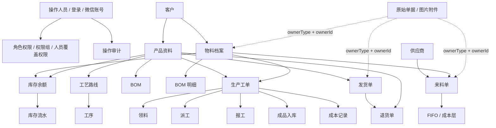
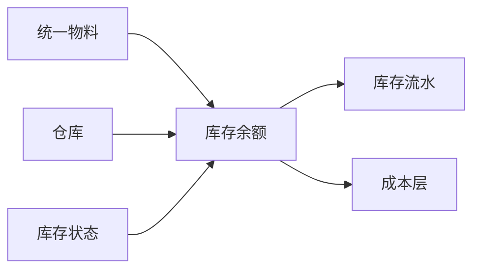

# MES-lite 数据库架构分析报告

日期：2026-07-14

## 结论摘要

当前系统使用 SQLite + Prisma，属于单体应用内置数据库架构。业务数据已经覆盖物料、产品、库存、来料、生产、发货、退货、权限、附件、审计等核心模块。

当前最重要的建模结论：

- `Material` / `Product` 是主数据，描述“这是什么物品”。
- `Stock` 是库存余额，描述“当前有多少、预留多少、可用多少、成本多少”。
- 主数据和库存余额分表是合理的 ERP 建模方式，不建议为了显示方便把二者合并成一张表。
- 但系统必须保证：每个有效物料和每个产品都必须有且只有一条库存余额记录。
- 当前已经增加历史补齐迁移和运行时一致性检查，用来避免“物料档案存在，但库存页面静默不显示”的问题再次发生。

## 当前数据规模

以下为本地开发库在 2026-07-14 的抽样统计，仅用于架构分析，不代表远程生产数据：

| 表 | 数量 |
| --- | ---: |
| Product | 3 |
| Material | 6 |
| Stock | 9 |
| StockLog | 2 |
| MaterialIn | 3 |
| ProductionOrder | 3 |
| PickItem | 4 |
| InventoryCostLayer | 2 |
| CostLayerConsumption | 0 |
| Shipment | 1 |
| ReturnOrder | 0 |
| Operator | 4 |
| AuditLog | 8 |

本地一致性检查结果：

| 检查项 | 结果 |
| --- | ---: |
| 有效物料无库存记录 | 0 |
| 产品无库存记录 | 0 |
| 孤立或非法库存记录 | 0 |

## 总体结构

## 核心模块分析

### 1. 主数据

主要表：

- `Material`：物料档案。包含编码、名称、规格、分类、客户、库存单位、核算单位、换算率、成本方法、归档字段。
- `Product`：产品资料。包含 SKU、名称、分类、客户、单位、描述。
- `Customer`：客户主数据。
- `Supplier`：供应商主数据。

当前特点：

- `Material.code` 和 `Product.sku` 都是唯一编码。
- `Material` 已经支持物料分类，如原料、成品、辅材、废料、废品等。
- `Material` 已经支持双单位：库存单位 `stockUnit`、核算单位 `valuationUnit`、换算率 `conversionRate`。
- `Product` 和 `Material` 目前仍是两套主数据，这和后续“所有东西统一叫物料”的目标模型不完全一致。

建议：

- 短期保留 `Material + Product` 双表，避免大规模迁移风险。
- 中期逐步把成品也纳入统一物料模型，`Product` 可以弱化为销售/生产视图或产品业务属性。
- 主数据归档不应删除库存记录；归档只影响默认显示和可选择范围。

### 2. 库存余额与库存流水

主要表：

- `Stock`：当前库存余额。
- `StockLog`：库存变动流水。
- `InventoryCostLayer`：来料或调整形成的成本层。
- `CostLayerConsumption`：领料消耗 FIFO 成本层的记录。

当前设计：

- `Stock.materialId` 和 `Stock.productId` 都是可空唯一字段。
- 一条库存余额记录应该只能关联一个 `Material` 或一个 `Product`。
- `qty` 表示库存单位数量。
- `reservedQty` 表示预留库存数量。
- `availableQty` 表示可用库存数量。
- `valuationQty` 表示核算单位数量。
- `reservedValuationQty` 表示预留核算数量。
- `availableValuationQty` 表示可用核算数量。
- `totalCost` 表示库存总金额。
- `valuationUnitCost` / `stockUnitCost` 分别表示核算单位成本和库存单位成本。

必须满足的业务不变量：

| 不变量 | 含义 |
| --- | --- |
| 每个有效 `Material` 必须有 `Stock` | 物料档案不能在库存页静默丢失 |
| 每个 `Product` 必须有 `Stock` | 产品资料不能在库存页静默丢失 |
| `Stock` 必须且只能关联一个主数据 | 不允许同时关联物料和产品，也不允许都不关联 |
| `availableQty = qty - reservedQty` | 可用库存必须由库存和预留库存推导 |
| `availableValuationQty = valuationQty - reservedValuationQty` | 可用核算库存必须由核算库存和预留核算库存推导 |
| 数量、预留、金额不能为负 | 普通业务不允许形成负库存或负金额 |
| 预留不能大于库存 | 避免可用库存为负 |

已完成补强：

- 新增迁移 `20260714123000_backfill_missing_stock_records`，补齐历史 `Material` / `Product` 缺失的 0 余额库存记录。
- 物料创建时在事务内同步创建 `Stock`。
- 产品创建时在事务内同步创建 `Stock`。
- `/api/stocks` 增加一致性检查，发现缺失或非法库存记录时返回 `409`，页面显示红色错误面板。

仍需增强：

- SQLite 层面无法直接用 Prisma 表达“`materialId` 与 `productId` 二选一”的强约束，建议后续增加数据库 CHECK 约束迁移或保持服务端统一校验。
- 目前库存没有仓库、库位、库存状态维度。后续如果需要成品仓、待检仓、废料仓，应引入 `Warehouse` 和 `StockBalance` 维度，而不是继续把状态塞进物料分类。
- 金额和数量当前使用 `Float`，长期应改为整数分或 Decimal，避免尾差。

### 3. 来料与成本

主要表：

- `MaterialIn`：来料单。
- `InventoryCostLayer`：成本层。
- `StockLog`：收货后库存流水。

当前设计：

- 来料单记录供应商、物料、库存单位数量、核算单位数量、单价依据、总金额、批次和状态。
- `priceBasis` 支持按核算单位或库存单位定价。
- 收货后应同步增加 `Stock`，生成库存流水，并生成成本层。
- FIFO 消耗通过 `InventoryCostLayer` 和 `CostLayerConsumption` 记录。

建议：

- 来料红冲保持整单红冲。
- 非整单反向业务更适合做独立来料退货/调整单。
- 库存尾差用库存调整处理，必须写入 `StockLog` 和 `AuditLog`。

### 4. 生产与派工

主要表：

- `ProductionOrder`：生产工单。
- `PickItem`：领料。
- `Dispatch`：派工单。
- `WorkReport`：报工。
- `QCRecord`：质检记录。
- `StockIn`：成品入库。
- `CostRecord`：成本记录。

当前设计：

- 工单目前必须绑定 `Product`，并可选绑定 `targetMaterial`。
- `PickItem` 支持库存单位数量和核算单位数量，并记录换算率来源和成本消耗。
- `Dispatch` 独立于工单，用于需要明确派单的工序。
- `WorkReport` 可承载现场报工、在线检测和简易返工记录。

当前不足：

- 工单与派工已经分表，但页面和流程仍需要进一步明确“工单创建、确认、领料、派工、报工、入库”的入口顺序。
- 待检、在制、报废待处理目前还不是库存状态维度，复杂流程仍需要后续建模。

### 5. 发货与退货

主要表：

- `Shipment`：发货单。
- `ReturnOrder`：退货单。

当前设计：

- 发货单绑定产品和客户，记录数量、单价、总金额、状态和物流信息。
- 退货单可关联发货单，也绑定产品。

建议：

- 来料退货和成品退货可以共用“退货/冲销”思路，但建议分业务类型处理。
- 发货确认、退货处理必须写库存流水和审计日志。

### 6. 权限、登录与审计

主要表：

- `Operator`：操作人员。
- `OperatorSession`：登录会话。
- `OperatorAuthAccount`：第三方账号绑定，当前用于微信登录适配。
- `PermissionSetting`：角色默认权限。
- `PermissionGroup` / `PermissionGroupSetting`：权限组。
- `OperatorPermissionGroup`：人员与权限组关系。
- `OperatorPermissionOverride`：人员覆盖权限。
- `AuditLog`：操作审计。

当前设计：

- 已支持注册、审核、登录会话、角色权限、人员权限、权限组和微信账号绑定表。
- 权限模型已经具备“角色默认 + 权限组 + 人员覆盖”的基础。
- `AuditLog` 可以记录操作前后数据、操作人、IP、User-Agent。

建议：

- 所有会造成业务数据变化的接口都应写 `AuditLog`。
- 权限授予本身也应作为可审计操作。
- 后续如果要做多客户/多租户系统，需要引入 `tenantId`，并让权限、主数据、业务单据全部带租户边界。

### 7. 附件与图片

主要表：

- `DocumentAttachment`

当前设计：

- 使用 `ownerType + ownerId` 关联业务对象，不做数据库外键。
- 支持原始单据、物料图片、封面图、软删除。

优点：

- 足够灵活，可以给物料、来料单、发货单等不同对象挂附件。

风险：

- 因为没有真实外键，可能出现附件指向不存在业务对象的情况。
- 建议增加附件完整性检查脚本或后台维护页面。

## 当前主要风险

| 风险 | 影响 | 建议 |
| --- | --- | --- |
| `Material` 与 `Product` 双主数据并存 | 成品既可能被视为产品，也可能被视为物料，长期会让筛选和工单目标变复杂 | 短期保持，后续规划统一物料 |
| `Stock` 缺少数据库级二选一约束 | 可能出现库存记录不关联任何主数据，或同时关联物料和产品 | 保留接口一致性检查，后续加 CHECK 约束 |
| 没有仓库、库位、库存状态 | 待检品、在制品、废料仓等只能临时用分类或筛选表达 | 后续增加仓库与库存状态维度 |
| 金额和数量使用 `Float` | 尾差、成本核算误差 | 后续改 Decimal 或整数分 |
| `ownerType + ownerId` 附件无外键 | 附件可能成为孤儿数据 | 增加完整性检查和清理工具 |
| 状态字段多为字符串 | 输入错误或状态漂移风险 | 用统一状态常量和接口校验收敛 |
| 软删除策略不完全统一 | 页面显示、恢复、审计口径可能不一致 | 明确归档/恢复规则，并统一筛选入口 |

## 推荐演进路线

### 第一阶段：数据一致性优先

- 保持 `Material` / `Product` / `Stock` 当前结构。
- 强制所有主数据创建时同步创建库存余额。
- 库存查询前执行一致性检查。
- 增加后台“数据体检”页面，集中显示缺失库存、孤立附件、异常余额、负库存、权限异常。

### 第二阶段：库存维度增强

- 增加 `Warehouse`。
- 增加库存状态，如可用、待检、冻结、在制、报废待处理。
- 将当前 `Stock` 拆分或演进为按“物料 + 仓库 + 状态”聚合的库存余额。

建议目标：

### 第三阶段：统一物料

- 逐步把 `Product` 的生产/销售属性迁移到统一物料属性。
- 用物料分类和业务能力标记表达原料、成品、辅材、废料、可采购、可生产、可销售。
- 工单、发货、退货逐步绑定统一物料，而不是同时支持 `Product` 和 `Material` 两套目标。

## 对当前问题的判断

“物料档案有内容，但库存管理没有显示该物料”不是因为物料和库存分表本身错误，而是因为旧数据中存在主数据和库存余额脱节。

正确处理方式是：

1. 用迁移补齐历史库存余额。
2. 新增主数据时事务内创建库存余额。
3. 查询库存时先做一致性检查。
4. 一旦发现主数据缺库存、库存余额非法、库存指向不存在对象，应直接报错并显示明细，而不是静默隐藏。

这套处理方式已经与当前实现方向一致。
