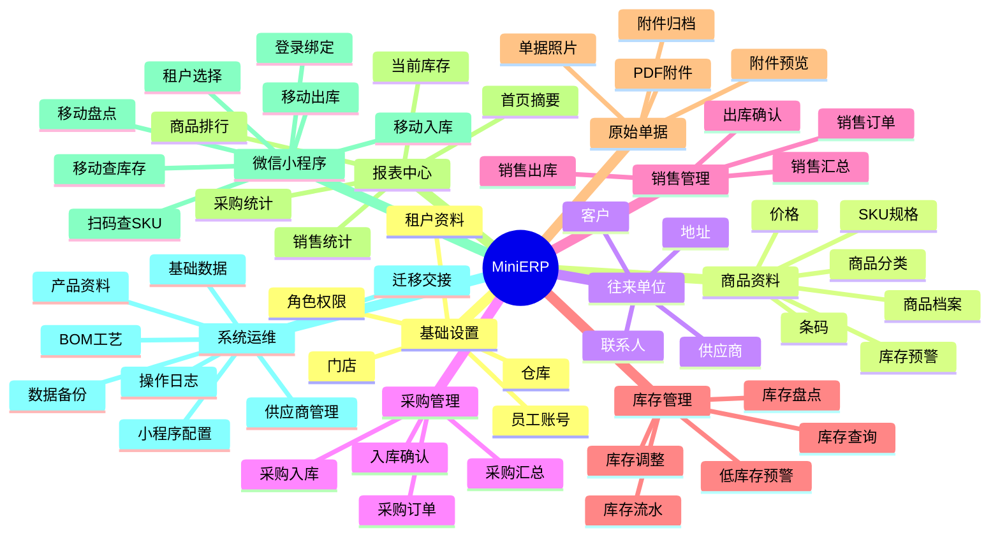
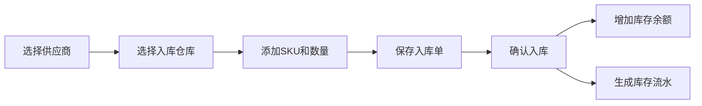
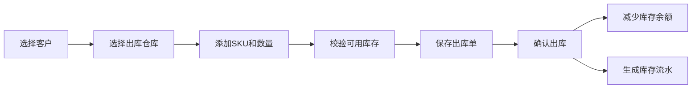

# MiniERP 功能模型

## 总体功能地图



## 使用角色

| 角色 | 主要目标 | 常用功能 |
| --- | --- | --- |
| 开发商运维 | 开通租户、配置小程序、处理迁移交接 | 租户管理、小程序配置、备份、操作日志 |
| 租户管理员 | 管公司资料、员工权限、看经营情况 | 员工角色、商品资料、仓库、报表 |
| 提交人员 | 录入和提交业务内容 | 创建单据、上传原始单据、提交 |
| 审核人员 | 审核注册和业务提交内容 | 人员审核、单据审核 |
| 管理人员 | 维护人员和权限 | 人员管理、角色调整、停用账号 |
| 仓管 | 保证库存准确 | 查库存、入库、出库、盘点、调整 |
| 采购 | 管供应商和进货 | 供应商、采购订单、采购入库 |
| 销售 | 管客户和出货 | 客户、销售订单、销售出库 |
| 财务查看 | 看业务汇总，不做会计凭证 | 采购汇总、销售汇总、库存金额 |

## 端侧划分

### Web 管理后台

适合录入、配置、审核和看报表。

| 模块 | 页面 | 第一版 |
| --- | --- | --- |
| 首页 | 经营摘要、待办提醒、低库存提醒 | 是 |
| 基础设置 | 租户资料、员工、角色、门店、仓库 | 是 |
| 人员管理 | 操作人员注册、审核、角色管理、停用 | 是 |
| 商品资料 | 分类、商品、SKU、条码、价格 | 是 |
| 往来单位 | 客户、供应商、联系人 | 是 |
| 采购管理 | 采购订单、采购入库、入库明细 | 入库先做，订单可后做 |
| 销售管理 | 销售订单、销售出库、出库明细 | 出库先做，订单可后做 |
| 库存管理 | 库存查询、库存流水、盘点、调整 | 是 |
| 原始单据 | 上传照片/PDF、预览、归档 | 是 |
| 报表中心 | 库存、采购、销售、商品排行 | 是 |
| 系统管理 | 供应商、产品资料、BOM/工艺、备份、操作日志 | 部分 |

### 微信小程序

适合现场移动操作，不承载消费者商城。

| 模块 | 页面 | 第一版 |
| --- | --- | --- |
| 账号 | 登录绑定、租户选择、我的账号 | 是 |
| 首页 | 库存摘要、今日入库、今日出库、待处理 | 是 |
| 库存 | 搜索库存、扫码查 SKU、SKU 详情 | 是 |
| 入库 | 创建采购入库、扫码加商品、确认入库 | 是 |
| 出库 | 创建销售出库、扫码加商品、确认出库 | 是 |
| 盘点 | 创建盘点、录入实盘、提交差异 | 是 |
| 单据 | 入库单列表、出库单列表、盘点单列表、原始单据照片 | 是 |
| 报表 | 简单销售/库存摘要 | 可选 |

## 一级模块说明

### 1. 首页

目标：让老板或管理员打开系统就知道经营状态。

第一版指标：

- 当前库存 SKU 数
- 低库存 SKU 数
- 今日入库数量
- 今日出库数量
- 近 7 天销售数量
- 待确认单据数

### 2. 基础设置

目标：配置系统使用边界。

功能：

- 租户资料维护
- 员工账号维护
- 员工启用/停用
- 角色权限配置
- 门店维护
- 仓库维护

第一版可以预置角色，减少自定义权限配置工作。

人员注册和审核：

- 操作人员提交注册。
- 首位注册人员自动成为管理人员。
- 后续注册人员默认待审核。
- 审核通过后才能登录系统。
- 角色分为提交、审核、管理。

### 2.1 系统管理

目标：集中维护不属于日常单据流转的基础数据。

第一版包含：

- 供应商新增、编辑、归档、搜索
- 供应商不允许物理删除，不再使用时进入归档记录

后续扩展：

- 产品资料维护
- BOM 版本维护
- 工艺路线和工序维护
- 客户资料维护
- 业务编码规则
- 系统备份和操作日志

### 3. 商品资料

目标：建立库存管理基础。

功能：

- 商品分类
- 商品档案
- SKU 规格
- 条码
- 单位
- 默认采购价
- 默认销售价
- 低库存预警数量

第一版建议支持 Excel 导入，但不是必须阻塞主流程。

### 4. 往来单位

目标：管理客户和供应商。

功能：

- 客户列表
- 供应商列表
- 联系人
- 电话
- 地址
- 停用

客户和供应商底层可以共用一套数据。

### 5. 采购管理

目标：记录进货和入库。

第一版最小闭环：



后续增强：

- 采购订单
- 部分入库
- 采购退货
- 供应商对账

### 6. 销售管理

目标：记录出货和客户销售。

第一版最小闭环：



后续增强：

- 销售订单
- 部分出库
- 销售退货
- 客户对账

### 7. 库存管理

目标：保证库存数量可信。

功能：

- 当前库存查询
- 按仓库查库存
- 按 SKU 查库存流水
- 库存盘点
- 库存调整
- 低库存预警

盘点流程：


### 8. 报表中心

目标：用业务报表替代复杂财务系统。

第一版报表：

- 当前库存表
- 库存流水表
- 低库存预警表
- 采购入库汇总
- 销售出库汇总
- 商品销售排行

### 9. 原始单据

目标：每一张业务单据都能保留原始凭证，方便追溯、对账和审计。

适用对象：

- 采购入库单
- 销售出库单
- 来料单
- 发货单
- 退货单
- 派工单
- 库存调整单
- 盘点单
- 生产工单

第一版能力：

- 上传单据照片
- 上传 PDF
- 查看附件缩略图
- 打开原图或 PDF
- 归档误传附件

附件不要分散存到每张业务表，应使用统一附件表，通过 `ownerType + ownerId` 关联业务对象。

### 10. 微信小程序

目标：让现场人员不用电脑也能完成高频操作。

小程序首页建议放 4 个主入口：

- 查库存
- 入库
- 出库
- 盘点

辅助入口：

- 扫码
- 单据
- 我的

## 权限矩阵

| 功能 | 租户管理员 | 仓管 | 采购 | 销售 | 财务查看 |
| --- | --- | --- | --- | --- | --- |
| 员工角色 | 管理 | 无 | 无 | 无 | 无 |
| 商品资料 | 管理 | 查看 | 查看 | 查看 | 查看 |
| 客户 | 管理 | 查看 | 无 | 管理 | 查看 |
| 供应商 | 管理 | 查看 | 管理 | 无 | 查看 |
| 库存查询 | 管理 | 管理 | 查看 | 查看 | 查看 |
| 采购入库 | 管理 | 管理 | 管理 | 无 | 查看 |
| 销售出库 | 管理 | 管理 | 无 | 管理 | 查看 |
| 库存盘点 | 管理 | 管理 | 无 | 无 | 查看 |
| 库存调整 | 管理 | 管理 | 无 | 无 | 查看 |
| 报表 | 管理 | 查看 | 查看 | 查看 | 查看 |

## 第一版功能优先级

### P0：必须有

- 登录和租户身份
- 员工角色
- 操作人员注册、登录、审核和管理
- 系统管理和供应商基础资料维护
- 仓库
- 商品/SKU
- 客户/供应商
- 库存余额
- 库存流水
- 采购入库
- 销售出库
- 库存查询
- 小程序登录绑定
- 小程序查库存、入库、出库
- 原始单据照片上传

### P1：应该有

- 库存盘点
- 库存调整
- 低库存预警
- 首页摘要
- 单据列表
- 单据附件预览和归档
- 基础报表
- 操作日志

### P2：后续增强

- 采购订单
- 销售订单
- 部分入库/部分出库
- 调拨
- Excel 导入导出
- 客户独立小程序 AppID
- 数据迁出包

### 暂不做

- C 端商城
- 微信支付
- 会员积分
- 财务凭证
- 发票税务
- 复杂生产计划

## 第一版推荐导航

Web 后台：

```text
首页
商品
库存
采购
销售
客户/供应商
报表
设置
```

微信小程序：

```text
首页
库存
入库
出库
我的
```

## 关键验收场景

1. 管理员创建仓库、员工、商品和供应商。
2. 仓管在小程序创建采购入库单并确认入库。
3. 系统库存余额增加，并能看到采购入库流水。
4. 销售在小程序创建销售出库单并确认出库。
5. 系统库存余额减少，并能看到销售出库流水。
6. 管理员在 Web 后台查看当前库存、低库存预警和销售汇总。
7. 同一个微信用户可以选择进入不同租户身份。
