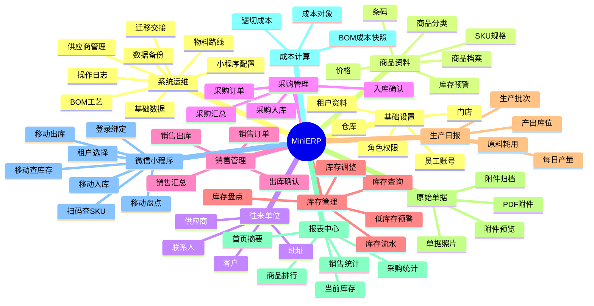
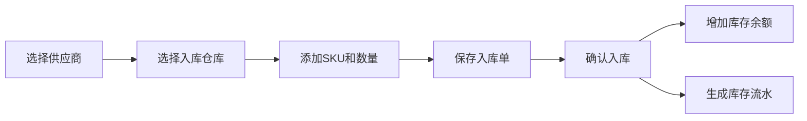
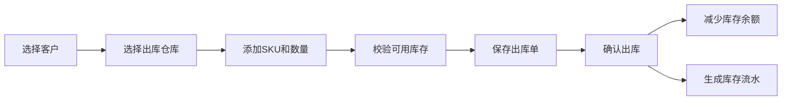

# MiniERP 功能模型

## 当前轻量主线

当前默认启用轻量生产业务模式。业务菜单优先保留：

- 生产日报：记录每日产出数量、产出库位、原料耗用和生产批次；成品、不良、报废等去向由库位配置表达。
- 仪表盘：同时汇总工单流和独立生产日报流。生产记录数分别展示工单/日报来源，产量由工序报工合格数与已确认日报产出组成；日报草稿进入待处理，已冲销日报不计入有效日报数量和产量。
- 物料与 BOM：作为物料主数据和 BOM 关系的统一一级入口。
- 物料管理：维护物料档案、分类、规格、单位和成本核算基础，列表不混入 BOM 编辑工作区。
- 物料 BOM 关联：同一产出物料可维护多个方案/版本和基准批量，并指定一个默认启用 BOM；界面同时显示单位用量。
- BOM 反查：按原材料汇总所有引用它的产品 BOM，并可跳转到物料 BOM 关联；物料列表的 BOM 简况同时显示自身组成和作为原材料被引用的数量及摘要。
- 来料管理：记录原材料到货、收货和库存增加；来料单并列保存件数、总长度、总重量，采购单价可按米、kg、件计价，并与总价格双向换算。
- 工单管理：记录生产计划、领料、报工和成品入库。
- 库存管理：查询物料库存、库存金额、库存预警和物料封面图，并通过存货调整处理盘点差异。
- 发货管理：记录成品出库、送货单和客户发货。
- 库位管理：在“配置”中维护库位；来料、生产日报、发货和退货使用同一套库位实物余额。生产日报确认的产出入库可直接作为对应库位库存，成品、不良、报废等业务类别不再写死。
- 退货管理：创建退货单时必须选择退回库位，处理后增加该库位与物料总库存；拒绝退货不改变库存。
- 供应商资料：业务人员只维护名称、联系人、电话和地址；内部唯一编码由系统自动生成且不在业务界面展示。
- 产品文档：选择产品后维护图片或 PDF；文档类别支持可配置的一级/二级结构，“作业指导书”是默认一级类别，可增加“机床作业、环境作业”等二级类别。产品文档不保存适用工序，通用说明使用备注；PDF 使用第一页缩略预览，打开文件默认进入全屏查看并按完整页面适配。每个文件可左右旋转并保存方向校正，卡片、全屏查看和产品全景图使用同一方向。产品全景图完整展示该产品的全部相关文档。
- 工作中心：在“配置”中维护锯切、钻孔、检验等逻辑能力区域；工艺文件可选择多个适用工作中心，未选择表示通用。
- 设备台账：作为“设备”一级入口维护实际设备、类型、厂商、型号、状态、位置、基础参数及工作中心归属；具体加工方法继续由工艺文件表达。
- 关键词筛选：物料、来料、工单、库存、发货、退货和产品文档等主列表必须支持输入文字快速检索，拉丁字母统一忽略大小写；当前搜索词可保存为当前浏览器、当前页面独立的快捷搜索，后续点击直接应用。

BOM 能力保留在轻量模式主线中，并收敛到顶部“物料”分类下的左侧分级菜单；派工暂时作为隐藏高级模块，不在轻量模式主菜单中展示。一级业务分类为工作台、物料、生产、设备、物流、库存、配置、工具：“设备”维护设备台账；“配置”收纳供应商资料、客户资料、库位配置、单位配置、工作中心、加工工艺、物料路线和系统设置；“工具”保留锯切成本、硬件工具、归档记录、操作记录和数据工具；右上角账户菜单只保留人员和权限。硬件工具第一阶段提供独立的 Honeywell 1900 扫码计数底座与 PC310T 标签打印底座，暂不把扫码结果绑定发货单或强制触发标签打印。

### 硬件工具底座

- Honeywell 1900 按 USB HID 键盘模式接入，默认以 Enter 或 Tab 作为一条扫码输入的结束符。
- 扫码计数会话独立保存目标条码、目标数量、累计数量、设备型号和状态。
- 每次扫码保存原始值、规范化编码、数量与匹配结果，支持撤销最后一次有效扫码。
- PC310T 配置固定为 203 dpi、网线连接；默认介质为 105 × 70 mm（840 × 560 dots），可选择已有 100 × 150 mm 介质或输入自定义宽高。
- 标签编辑、Code 128 渲染和浏览器打印独立于扫码会话；打印请求单独记录。
- 打印机 IP 目前作为客户机配置保存，网络静默打印后续通过 QZ Tray 或独立局域网打印桥接模块实现。

## 总体功能地图


```mermaid
mindmap
  root((MiniERP))
    基础设置
      租户资料
      员工账号
      角色权限
      门店
      仓库
    商品资料
      商品分类
      商品档案
      SKU规格
      条码
      价格
      库存预警
    往来单位
      客户
      供应商
      联系人
      地址
    采购管理
      采购订单
      采购入库
      入库确认
      采购汇总
    销售管理
      销售订单
      销售出库
      出库确认
      销售汇总
    库存管理
      库存查询
      库存流水
      库存盘点
      库存调整
      低库存预警
    生产日报
      每日产量
      产出库位
      原料耗用
      生产批次
    原始单据
      单据照片
      PDF附件
      附件预览
      附件归档
    报表中心
      首页摘要
      当前库存
      采购统计
      销售统计
      商品排行
    成本计算
      锯切成本
      成本对象
      BOM成本快照
    微信小程序
      登录绑定
      租户选择
      移动查库存
      扫码查SKU
      移动入库
      移动出库
      移动盘点
    系统运维
      基础数据
      供应商管理
      物料路线
      BOM工艺
      小程序配置
      数据备份
      操作日志
      迁移交接
```

## 使用角色

| 角色 | 主要目标 | 常用功能 |
| --- | --- | --- |
| 开发商运维 | 开通租户、配置小程序、处理迁移交接 | 租户管理、小程序配置、备份、操作日志 |
| 租户管理员 | 管公司资料、员工权限、看经营情况 | 员工角色、商品资料、仓库、报表 |
| 提交人员 | 录入和提交业务内容 | 创建单据、上传原始单据、提交 |
| 审核人员 | 审核注册和业务提交内容 | 人员审核、单据审核 |
| 管理人员 | 维护人员和权限 | 人员管理、角色调整、停用账号 |
| 仓管 | 保证库存准确 | 查库存、入库、出库、盘点、调整 |
| 采购 | 管供应商和进货 | 供应商、采购订单、采购入库 |
| 销售 | 管客户和出货 | 客户、销售订单、销售出库 |
| 财务查看 | 看业务汇总，不做会计凭证 | 采购汇总、销售汇总、库存金额 |

## 端侧划分

### Web 管理后台

适合录入、配置、审核和看报表。

| 模块 | 页面 | 第一版 |
| --- | --- | --- |
| 首页 | 经营摘要、待办提醒、低库存提醒 | 是 |
| 基础设置 | 租户资料、员工、角色、门店、仓库 | 是 |
| 人员管理 | 操作人员注册、审核、角色管理、停用 | 是 |
| 商品资料 | 分类、商品、SKU、条码、价格 | 是 |
| 往来单位 | 客户、供应商、联系人 | 是 |
| 采购管理 | 采购订单、采购入库、入库明细 | 来料入库可见，采购订单可后做 |
| 销售管理 | 销售订单、销售出库、出库明细 | 发货/退货可见，销售订单可后做 |
| 库存管理 | 库存查询、库存流水、盘点、调整 | 是 |
| 生产日报 | 每日产出数量、产出库位、原料耗用和生产批次 | 是 |
| 原始单据 | 上传照片/PDF、预览、归档 | 是 |
| 报表中心 | 库存、采购、销售、商品排行 | 是 |
| 管理类页面 | 供应商、客户、加工工艺、物料路线、归档记录、操作日志、数据检查与一次性工具、系统设置；按业务归入生产、物流和工具菜单 | 部分 |
| 锯切成本 | 三步测算材料成本、单班收入、混合物料规模营业收入和经营利润 | 是 |
| BOM成本 | 选择物料并展开 BOM，按库存材料成本、成本对象工时机时和固定费用分摊生成成本快照；提供成本数据页签检查成本对象、BOM 组成、工艺参数和最近成本 | 隐藏高级模块 |
| 可计算加工工艺 | 工艺模板保存批量、节拍、人员、设备、费率和合格率，输出千件工时、机时和成本 | 隐藏高级模块 |
| 物料工艺成本路线 | 从可计算工艺模板组合物料工序，保存参数快照并汇总千件工时、机时和成本 | 隐藏高级模块 |

### 微信小程序

适合现场移动操作，不承载消费者商城。

| 模块 | 页面 | 第一版 |
| --- | --- | --- |
| 账号 | 登录绑定、租户选择、我的账号 | 是 |
| 首页 | 库存摘要、今日入库、今日出库、待处理 | 是 |
| 库存 | 搜索库存、扫码查 SKU、SKU 详情 | 是 |
| 入库 | 创建采购入库、扫码加商品、确认入库 | 是 |
| 出库 | 创建销售出库、扫码加商品、确认出库 | 是 |
| 盘点 | 创建盘点、录入实盘、提交差异 | 是 |
| 单据 | 入库单列表、出库单列表、盘点单列表、原始单据照片 | 是 |
| 报表 | 简单销售/库存摘要 | 可选 |

## 一级模块说明

### 1. 首页

目标：让老板或管理员打开系统就知道经营状态。

第一版指标：

- 当前库存 SKU 数
- 低库存 SKU 数
- 今日入库数量
- 今日出库数量
- 近 7 天销售数量
- 待确认单据数

### 2. 基础设置

目标：配置系统使用边界。

功能：

- 租户资料维护
- 员工账号维护
- 员工启用/停用
- 角色权限配置
- 门店维护
- 仓库维护

第一版可以预置角色，减少自定义权限配置工作。

人员注册和审核：

- 操作人员提交注册。
- 首位注册人员自动成为管理人员。
- 后续注册人员默认待审核。
- 审核通过后才能登录系统。
- 角色分为提交、审核、管理。

### 2.1 管理类页面

目标：维护不属于日常单据流转的基础数据，同时避免再套一层“系统管理”页内导航。

第一版包含：

- 加工工艺、物料路线从“生产”菜单进入
- 供应商、客户资料从“物流”菜单进入
- 归档记录、操作记录、数据工具和系统设置从“工具”菜单进入
- 人员管理、人员权限和组权限保留在右上角账户菜单
- 供应商新增、编辑、归档、搜索
- 业务页面只允许归档；“工具 / 归档记录”可永久删除没有有效业务引用的主数据、未生效单据，以及库存和成本净影响已完整冲销的来料单
- 永久删除前必须输入“永久删除”确认；自有附件随主体删除，未冲销库存、BOM、下游单据、扫码或打印记录等有效引用仍会阻止删除
- 数据工具可预检并一次性将全部物料编码删除空白、转换为大写；存在空编码或重复编码时禁止执行
- 物料编码转换同步内部兼容 `Product.sku`，使用事务并写入操作记录
- 数据工具可扫描 BOM 单位漂移、重复/自引用/无效明细、产出单位漂移、日报失效 BOM 指针和有效成本层旧单位风险
- 可安全处理的问题允许逐条同步单位标签或删除错误 BOM 明细；日报保留耗用快照，只清空失效指针；有效库存和成本层禁止直接删除
- 修复和删除执行前会在事务内重新扫描问题，全部写入操作记录；单位同步不换算任何数量和金额
- 系统设置可开启物料编码数字自然排序；设置对所有客户端生效，物料列表和导出统一得到 `2 < 12`、`A2 < A10` 的顺序
- 自然排序开关不修改编码内容，关闭后恢复数据库字符串排序

后续扩展：

- 物料路线维护
- 工单显式选择 BOM 版本并保存快照
- 工艺路线和工序维护
- 客户资料维护
- 新增或导入时的持续业务编码规则
- 系统备份和操作日志

### 2.2 成本计算

目标：先为小微制造企业提供独立于派工的物料关系型 BOM，再在数据稳定后扩展 BOM 成本测算。

当前实现：

- 物料 BOM 关联页可为同一产出物料新建多个方案/版本，设定方案名称、基准产出数量、生产转换/一对一基础转换类型和默认状态。
- 界面可用“标准用量 + 损耗”或“成品数量 : 原料数量”录入，操作员仍编辑每 1 个产出单位的用量；服务端按基准产出数量保存批量输入关系。
- 生产日报按 BOM 换算比例和总加工数量计算基准耗用；每种原料可选择本批次额外的固定或百分比损耗，并允许修正实际耗用。
- 当前轻量流程不设置领料步骤；日报确认时直接扣减实际耗用，并由库存成本层换算对应重量/参考数量与成本。
- BOM 反查页独立汇总某个物料被哪些 BOM 使用，并可点击结果跳转到物料 BOM 关联。
- 锯切费用计算器可保存为临时成本对象或绑定已有物料，并可加入指定物料 BOM。
- 成本对象保存单位材料成本、单位人工工时、单位机时和其他单位直接费用。
- BOM 成本页按产品筛选，以 BOM 单位消耗量乘数量基准，并结合人工费率、机时费率和固定费用分摊计算成本快照；生产日报的本次损耗不自动带入成本试算。
- BOM 成本快照保存汇总和明细行，可回看历史计算结果。
- BOM 成本页的“成本数据”页签可新增手工成本对象，并集中查看成本对象、物料 BOM、默认工艺路线、可计算加工工艺和最近成本快照。
- 物料全景图展示该物料关联的加工工艺参数、推导工艺路线成本、相关成本对象和产品最新 BOM 成本快照。

边界：

- BOM 第一阶段负责“成品对应哪些原材料、每一成品主单位标准消耗多少”，不保存生产批次损耗或实际耗用。
- 用户可以从物料 BOM 关联页维护多方案和批量输入/产出关系；单位用量是批量数据的界面派生值。
- 用户侧不再维护独立 `Product` 主数据；旧业务表需要产品外键时，由后端从物料自动生成内部兼容视图。
- 派工负责“怎么做、谁来做、何时做”。
- BOM 成本计算不生成派工、不占用库存；当前轻量流程没有领料步骤，生产日报确认时按实际耗用直接扣减库存。
- 房租、设备折旧等期间性固定费用不建议写入 BOM 本体，当前作为一次成本测算的分摊项保存。

### 3. 商品资料

目标：建立库存管理基础。

功能：

- 商品分类
- 商品档案
- SKU 规格
- 条码
- 单位
- 默认采购价
- 默认销售价
- 低库存预警数量

第一版建议支持 Excel 导入，但不是必须阻塞主流程。

### 4. 往来单位

目标：管理客户和供应商。

功能：

- 客户列表
- 供应商列表
- 联系人
- 电话
- 地址
- 停用

客户和供应商底层可以共用一套数据。

### 5. 采购管理

目标：记录进货和入库。

第一版最小闭环：


```mermaid
flowchart LR
    A[选择供应商] --> B[选择入库仓库]
    B --> C[添加SKU和数量]
    C --> D[保存入库单]
    D --> E[确认入库]
    E --> F[增加库存余额]
    E --> G[生成库存流水]
```

后续增强：

- 采购订单
- 部分入库
- 采购退货
- 供应商对账

### 6. 销售管理

目标：记录出货和客户销售。

第一版最小闭环：


```mermaid
flowchart LR
    A[选择客户] --> B[选择出库仓库]
    B --> C[添加SKU和数量]
    C --> D[校验可用库存]
    D --> E[保存出库单]
    E --> F[确认出库]
    F --> G[减少库存余额]
    F --> H[生成库存流水]
```

后续增强：

- 销售订单
- 部分出库
- 销售退货
- 客户对账

### 7. 库存管理

目标：保证库存数量可信。

功能：

- 当前库存查询
- 按仓库查库存
- 按 SKU 查库存流水
- 库存盘点
- 库存调整
- 低库存预警

盘点流程：


```mermaid
flowchart LR
    A[创建盘点单] --> B[选择仓库]
    B --> C[录入实盘数量]
    C --> D[计算差异]
    D --> E[审核确认]
    E --> F[生成盘盈盘亏流水]
    F --> G[更新库存余额]
```

### 8. 报表中心

目标：用业务报表替代复杂财务系统。

第一版报表：

- 当前库存表
- 库存流水表
- 低库存预警表
- 采购入库汇总
- 销售出库汇总
- 商品销售排行

### 9. 原始单据

目标：每一张业务单据都能保留原始凭证，方便追溯、对账和审计。

适用对象：

- 采购入库单
- 销售出库单
- 来料单
- 发货单
- 退货单
- 派工单
- 库存调整单
- 盘点单
- 生产工单

第一版能力：

- 上传单据照片
- 上传 PDF
- 查看附件缩略图
- 打开原图或 PDF
- 归档误传附件

附件不要分散存到每张业务表，应使用统一附件表，通过 `ownerType + ownerId` 关联业务对象。

### 10. 微信小程序

目标：让现场人员不用电脑也能完成高频操作。

小程序首页建议放 4 个主入口：

- 查库存
- 入库
- 出库
- 盘点

辅助入口：

- 扫码
- 单据
- 我的

## 权限矩阵

| 功能 | 租户管理员 | 仓管 | 采购 | 销售 | 财务查看 |
| --- | --- | --- | --- | --- | --- |
| 员工角色 | 管理 | 无 | 无 | 无 | 无 |
| 商品资料 | 管理 | 查看 | 查看 | 查看 | 查看 |
| 客户 | 管理 | 查看 | 无 | 管理 | 查看 |
| 供应商 | 管理 | 查看 | 管理 | 无 | 查看 |
| 库存查询 | 管理 | 管理 | 查看 | 查看 | 查看 |
| 采购入库 | 管理 | 管理 | 管理 | 无 | 查看 |
| 销售出库 | 管理 | 管理 | 无 | 管理 | 查看 |
| 库存盘点 | 管理 | 管理 | 无 | 无 | 查看 |
| 库存调整 | 管理 | 管理 | 无 | 无 | 查看 |
| 报表 | 管理 | 查看 | 查看 | 查看 | 查看 |

## 第一版功能优先级

### P0：必须有

- 登录和租户身份
- 员工角色
- 操作人员注册、登录、审核和管理
- 管理类页面和供应商基础资料维护
- 仓库
- 商品/SKU
- 客户/供应商
- 库存余额
- 库存流水
- 采购入库
- 销售出库
- 库存查询
- 小程序登录绑定
- 小程序查库存、入库、出库
- 原始单据照片上传

### P1：应该有

- 库存盘点
- 库存调整
- 低库存预警
- 首页摘要
- 单据列表
- 单据附件预览和归档
- 基础报表
- 操作日志

### P2：后续增强

- 采购订单
- 销售订单
- 部分入库/部分出库
- 调拨
- Excel 导入导出
- 客户独立小程序 AppID
- 数据迁出包

### 暂不做

- C 端商城
- 微信支付
- 会员积分
- 财务凭证
- 发票税务
- 复杂生产计划

## 第一版推荐导航

当前 MES-lite Web 后台：

```text
工作台
  仪表盘
  所有功能
物料
生产
物流
库存
配置
工具
```

工作台快捷入口支持系统默认、按当前账号主动访问次数智能排序和自定义摆放；“所有功能”按上述一级入口分组展示当前账号可读页面。整个系统只允许“一级入口 + 一级页面 + 可选二级详情/子页”，终端功能不超过三次跳转。

微信小程序：

```text
首页
库存
入库
出库
我的
```

## 关键验收场景

1. 管理员创建仓库、员工、商品和供应商。
2. 仓管在小程序创建采购入库单并确认入库。
3. 系统库存余额增加，并能看到采购入库流水。
4. 销售在小程序创建销售出库单并确认出库。
5. 系统库存余额减少，并能看到销售出库流水。
6. 管理员在 Web 后台查看当前库存、低库存预警和销售汇总。
7. 同一个微信用户可以选择进入不同租户身份。
