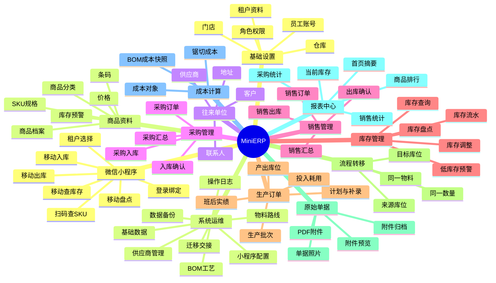
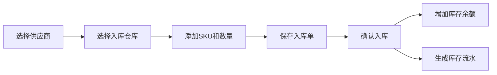
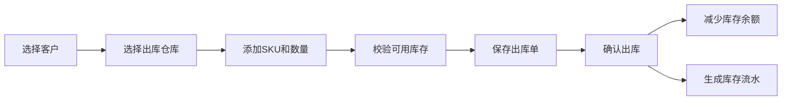

# MiniERP 功能模型

## 当前轻量主线

当前默认启用轻量生产业务模式。业务菜单优先保留：

- 生产订单：先保存主产出、启用 BOM、计划数量和凭据信息，并冻结 BOM 版本及全部投入/产出；班后在订单详情登记一名或多名员工、各项实际投入/损耗/来源库位和全部实际产出/去向库位。投入可以是原材料、半成品或已有产品。
- 流程转移：独立于生产订单实绩，不使用 BOM；选择一名启用员工后，将同一物料按同一数量在两个不同库位或流程节点之间移动，总库存和总成本不变。
- 仪表盘：订单按创建时间统计；产量只汇总已确认班后实绩的主产出，实绩草稿进入待处理，已冲销实绩不计入数量和产量。
- 物料与 BOM：作为物料主数据和 BOM 关系的统一一级入口。
- 物料管理：维护物料档案、分类、规格、单位和成本核算基础，列表不混入常驻 BOM 编辑工作区；有 BOM 权限时继续显示可隐藏的 BOM 简况，支持按未建立、无启用方案、无默认方案和已有可用默认 BOM 筛选，并可从单个物料打开宽模态窗口快速创建 BOM，保存后留在当前列表并刷新简况。
- BOM 设置：左侧一条记录直接对应一个已建立 BOM，以 BOM 名称和版本为主信息，产品、产出和投入物料只作为摘要及顶部搜索条件。BOM 用途分为生产和包装；包装 BOM 只允许一项产出，并参与库存包装穿透。右侧使用左输入、右输出的整批配方编辑器：两侧都可搜索并添加多项物料，每行填写每批数量；长度和重量可选择同量纲录入单位并自动换算，保存口径仍是物料主库存单位。全部输入共同对应全部输出，不建立逐输出投入关系。首项输出是主产出，废料、废屑和可回收料作为其他输出添加。下方通过同一个“BOM 方案名称”字段完成新建命名或已有 BOM 重命名，并提供唯一保存操作。
- BOM 全览：以统一物料为中心，同时汇总它“作为产出”和“作为投入”关联的全部直接 BOM；左侧筛选并选择物料，右侧分区显示双向关系，每项可精准跳转到对应 BOM 设置。物料列表的 BOM 简况继续显示自身产出关系和作为投入被引用的数量及摘要；“创建 BOM”在当前页打开快速创建模态窗口并将当前物料预选为主产出，复杂维护可再进入完整 BOM 设置。
- 来料管理：记录原材料到货、收货和库存增加；来料单并列保存件数、总长度、总重量，采购单价可按米、kg、件计价，并与总价格双向换算。
- 生产订单：已统一承载事前计划、产后补录和班后实绩；所有生产转换必须选择 BOM。确认实绩时原子扣减全部投入、增加全部产出并累计订单主产出数量；可合法冲销。
- 每日盘点：目标模型按日期、库位和物料记录账面数、实盘数、差异及原因；漏报生产必须生成补录生产订单，不直接作盘盈。
- 库存管理：查询物料总库存、库位余额、库存金额、库存预警和物料封面图；列表显示库位简况，右侧主从详情显示各库位数量、预留、可用量和按库位调整入口。包装 BOM 只读穿透整箱等包装物料库存，将散装实际库存与包装等效数量汇总展示，但不写回库存账。
- 销售订单：按客户登记一张订单中的多项成品、数量、单价和计划交付日期；草稿确认后才进入待发货范围，订单本身不扣库存。
- 发货管理：只能从已确认销售订单的未发明细生成，可分批发货；确认发货后扣减库位和总库存并回写订单进度。已发货记录可下载含甲方客户、乙方供货方和双方签收栏的发货单 PDF。
- 库位管理：在“配置”中维护库位；来料、生产订单实绩、流程转移、发货和退货使用同一套库位实物余额。待检、合格等流程状态可由库位表达。
- 退货管理：创建退货单时必须选择退回库位，处理后增加该库位与物料总库存；拒绝退货不改变库存。
- 供应商资料：业务人员只维护名称、联系人、电话和地址；内部唯一编码由系统自动生成且不在业务界面展示。
- 员工资料：在“配置”中维护姓名、部门、电话和启用状态，员工编码由系统按 `EMP-000001` 格式自动生成并锁定，供班后生产实绩与流程转移选择；可选绑定一个已注册账号且账号不可被其他员工重复绑定，账号审核、角色和权限仍在账户菜单独立维护。
- 产品文档：可在 MES-lite 内直接创建标题和富文本正文，支持标题层级、加粗、斜体、列表、引用、代码块及撤销/重做；正文与通用文件附件可独立或组合使用。文档类别支持可配置的一级/二级结构，产品关联可选，工作中心可多选；未绑定产品时表示通用文档。列表可搜索标题、正文、产品、类别和备注；产品全景图只展示明确关联该产品的全部文档。图片、PDF、文本和 Office 文件支持系统内预览，其他附件支持下载。
- 工作中心：在“配置”中维护锯切、钻孔、检验等逻辑能力区域；工艺文件可选择多个适用工作中心，未选择表示通用。
- 设备台账：作为“设备”一级入口维护实际设备、类型、厂商、型号、状态、位置、基础参数及工作中心归属；具体加工方法继续由工艺文件表达。
- 关键词筛选：物料、来料、工单、库存、发货、退货和产品文档等主列表必须支持输入文字快速检索，拉丁字母统一忽略大小写；当前搜索词可保存为当前浏览器、当前页面独立的快捷搜索，后续点击直接应用。
- AI 协作助手：作为全局业务入口，自动携带当前页面上下文，通过工具白名单查询系统指导、物料、库存、BOM、生产订单和今日/月度经营概览。工具同时受 `aiAssistant` 和目标资源查看权限控制，第一阶段只读且不持久化对话正文；管理员在“配置 / 系统设置”维护国产模型参数并测试连接，页面 API Key 加密保存且不回传浏览器。大段教学说明可由 AI 问答承接，但页面继续保留字段、校验、状态和确认。

BOM 能力保留在轻量模式主线中，并收敛到顶部“物料”分类下的左侧分级菜单；派工暂时作为隐藏高级模块，不在轻量模式主菜单中展示。一级业务分类为工作台、物料、生产、文档、设备、物流、销售、库存、配置、工具：“物流”保留来料管理，“销售”包含销售订单、发货管理和退货管理，“设备”维护设备台账；“配置”收纳供应商资料、客户资料、员工资料、库位配置、单位配置、工作中心、加工工艺、物料路线和系统设置；“工具”保留锯切成本、硬件工具、归档记录、操作记录和数据工具；右上角账户菜单只保留登录账号和权限。硬件工具第一阶段提供独立的 Honeywell 1900 扫码计数底座与 PC310T 标签打印底座，暂不把扫码结果绑定发货单或强制触发标签打印。

补充交互：新增产品文档的首个弹窗即可点击或拖放选择多个文件，文档保存后自动上传并关联所选附件；未选择文件时仍可创建纯在线文档。轻量导航增加“销售”一级分类并包含销售订单、发货管理、退货管理，“物流”保留来料管理。

### 硬件工具底座

- Honeywell 1900 按 USB HID 键盘模式接入，默认以 Enter 或 Tab 作为一条扫码输入的结束符。
- 扫码计数会话独立保存目标条码、目标数量、累计数量、设备型号和状态。
- 每次扫码保存原始值、规范化编码、数量与匹配结果，支持撤销最后一次有效扫码。
- PC310T 配置固定为 203 dpi、网线连接；默认介质为 105 × 70 mm（840 × 560 dots），可选择已有 100 × 150 mm 介质或输入自定义宽高。
- 标签编辑、Code 128 渲染和浏览器打印独立于扫码会话；打印请求单独记录。
- 打印机 IP 目前作为客户机配置保存，网络静默打印后续通过 QZ Tray 或独立局域网打印桥接模块实现。

## 总体功能地图


```mermaid
mindmap
  root((MiniERP))
    基础设置
      租户资料
      员工账号
      角色权限
      门店
      仓库
    商品资料
      商品分类
      商品档案
      SKU规格
      条码
      价格
      库存预警
    往来单位
      客户
      供应商
      联系人
      地址
    采购管理
      采购订单
      采购入库
      入库确认
      采购汇总
    销售管理
      销售订单
      销售出库
      出库确认
      销售汇总
    库存管理
      库存查询
      库存流水
      库存盘点
      库存调整
      低库存预警
    生产订单
      计划与补录
      班后实绩
      产出库位
      投入耗用
      生产批次
    流程转移
      同一物料
      同一数量
      来源库位
      目标库位
    原始单据
      单据照片
      PDF附件
      附件预览
      附件归档
    报表中心
      首页摘要
      当前库存
      采购统计
      销售统计
      商品排行
    成本计算
      锯切成本
      成本对象
      BOM成本快照
    微信小程序
      登录绑定
      租户选择
      移动查库存
      扫码查SKU
      移动入库
      移动出库
      移动盘点
    系统运维
      基础数据
      供应商管理
      物料路线
      BOM工艺
      小程序配置
      数据备份
      操作日志
      迁移交接
```

## 使用角色

| 角色 | 主要目标 | 常用功能 |
| --- | --- | --- |
| 开发商运维 | 开通租户、配置小程序、处理迁移交接 | 租户管理、小程序配置、备份、操作日志 |
| 租户管理员 | 管公司资料、员工权限、看经营情况 | 员工角色、商品资料、仓库、报表 |
| 提交人员 | 录入和提交业务内容 | 创建单据、上传原始单据、提交 |
| 审核人员 | 审核注册和业务提交内容 | 人员审核、单据审核 |
| 管理人员 | 维护人员和权限 | 人员管理、角色调整、停用账号 |
| 仓管 | 保证库存准确 | 查库存、入库、出库、盘点、调整 |
| 采购 | 管供应商和进货 | 供应商、采购订单、采购入库 |
| 销售 | 管客户和出货 | 客户、销售订单、销售出库 |
| 财务查看 | 看业务汇总，不做会计凭证 | 采购汇总、销售汇总、库存金额 |

## 端侧划分

### Web 管理后台

适合录入、配置、审核和看报表。

| 模块 | 页面 | 第一版 |
| --- | --- | --- |
| 首页 | 经营摘要、待办提醒、低库存提醒 | 是 |
| 基础设置 | 租户资料、员工、角色、门店、仓库 | 是 |
| 人员管理 | 操作人员注册、审核、角色管理、停用 | 是 |
| 员工资料 | 系统自动生成且不可修改的业务员工编码、姓名、部门、电话、启用状态及可选的一对一注册账号绑定；供业务单据选人 | 是 |
| 商品资料 | 分类、商品、SKU、条码、价格 | 是 |
| 往来单位 | 客户、供应商、联系人 | 是 |
| 采购管理 | 采购订单、采购入库、入库明细 | 来料入库可见，采购订单可后做 |
| 销售管理 | 销售订单、发货单、出库明细、发货单 PDF | 是 |
| 库存管理 | 库存查询、库存流水、盘点、调整 | 是 |
| 生产订单 | 必选 BOM，先保存计划/补录基本信息，班后记录全部产出、投入耗用、逐项库位和一名或多名员工 | 是 |
| 流程转移 | 选择一名员工，同物料同数量在异库位间移动，不使用 BOM | 是 |
| 原始单据 | 上传照片/PDF、预览、归档 | 是 |
| 报表中心 | 库存、采购、销售、商品排行 | 是 |
| 管理类页面 | 供应商、客户、员工、加工工艺、物料路线、归档记录、操作日志、数据检查与一次性工具、系统设置；按业务归入配置和工具菜单 | 部分 |
| 锯切成本 | 三步测算材料成本、单班收入、混合物料规模营业收入和经营利润 | 是 |
| BOM成本 | 选择物料并展开 BOM，按库存材料成本、成本对象工时机时和固定费用分摊生成成本快照；提供成本数据页签检查成本对象、BOM 组成、工艺参数和最近成本 | 隐藏高级模块 |
| 可计算加工工艺 | 工艺模板保存批量、节拍、人员、设备、费率和合格率，输出千件工时、机时和成本 | 隐藏高级模块 |
| 物料工艺成本路线 | 从可计算工艺模板组合物料工序，保存参数快照并汇总千件工时、机时和成本 | 隐藏高级模块 |

### 微信小程序

适合现场移动操作，不承载消费者商城。

| 模块 | 页面 | 第一版 |
| --- | --- | --- |
| 账号 | 登录绑定、租户选择、我的账号 | 是 |
| 首页 | 库存摘要、今日入库、今日出库、待处理 | 是 |
| 库存 | 搜索库存、扫码查 SKU、SKU 详情 | 是 |
| 入库 | 创建采购入库、扫码加商品、确认入库 | 是 |
| 出库 | 创建销售出库、扫码加商品、确认出库 | 是 |
| 盘点 | 创建盘点、录入实盘、提交差异 | 是 |
| 单据 | 入库单列表、出库单列表、盘点单列表、原始单据照片 | 是 |
| 报表 | 简单销售/库存摘要 | 可选 |

## 一级模块说明

### 1. 首页

目标：让老板或管理员打开系统就知道经营状态。

第一版指标：

- 当前库存 SKU 数
- 低库存 SKU 数
- 今日入库数量
- 今日出库数量
- 近 7 天销售数量
- 待确认单据数

### 2. 基础设置

目标：配置系统使用边界。

功能：

- 租户资料维护
- 员工账号维护
- 员工启用/停用
- 角色权限配置
- 门店维护
- 仓库维护

第一版可以预置角色，减少自定义权限配置工作。

人员注册和审核：

- 操作人员提交注册。
- 首位注册人员自动成为管理人员。
- 后续注册人员默认待审核。
- 审核通过后才能登录系统。
- 角色分为提交、审核、管理。

### 2.1 管理类页面

目标：维护不属于日常单据流转的基础数据，同时避免再套一层“系统管理”页内导航。

第一版包含：

- 加工工艺、物料路线、供应商、客户、员工、库位、单位和工作中心从“配置”菜单进入
- 归档记录、操作记录和数据工具从“工具”菜单进入，系统设置从“配置”菜单进入
- 登录账号管理、人员权限和组权限保留在右上角账户菜单
- 供应商新增、编辑、归档、搜索
- 业务页面只允许归档；“工具 / 归档记录”可永久删除没有有效业务引用的主数据、未生效单据，以及库存和成本净影响已完整冲销的来料单
- 永久删除前必须输入“永久删除”确认；自有附件随主体删除，未冲销库存、BOM、下游单据、扫码或打印记录等有效引用仍会阻止删除
- 数据工具可预检并一次性将全部物料编码删除空白、转换为大写；存在空编码或重复编码时禁止执行
- 物料编码转换同步内部兼容 `Product.sku`，使用事务并写入操作记录
- 数据工具可扫描 BOM 单位漂移、重复/自引用/无效明细、产出单位漂移、日报失效 BOM 指针和有效成本层旧单位风险
- 数据工具可扫描库存归属异常；零余额、无库位、无流水的孤立库存允许事务复检后清理，带余额或业务引用的异常库存只报警
- 数据工具可扫描并批量优化物料图片；服务端保留原图并生成 WebP 缩略图和展示图，新上传物料图片自动生成，列表/详情不再直接加载原始大图
- 可安全处理的问题允许逐条同步单位标签或删除错误 BOM 明细；日报保留耗用快照，只清空失效指针；有效库存和成本层禁止直接删除
- 修复和删除执行前会在事务内重新扫描问题，全部写入操作记录；单位同步不换算任何数量和金额
- 全局顶部工具栏提供公共页面二维码；二维码包含当前页面、子页面、视图和允许分享的筛选状态，扫码或刷新后恢复页面并重新执行登录与权限校验
- 系统设置可开启物料编码数字自然排序；设置对所有客户端生效，物料列表和导出统一得到 `2 < 12`、`A2 < A10` 的顺序
- 自然排序开关不修改编码内容，关闭后恢复数据库字符串排序
- 供应商、客户、员工、库位、单位、工作中心、加工工艺和物料路线均支持可比较列的表头临时排序，并可由管理员保存服务器级默认手动顺序；新增配置默认追加到末尾，手动调整写入操作日志

后续扩展：

- 物料路线维护
- 工单显式选择 BOM 版本并保存快照
- 工艺路线和工序维护
- 客户资料维护
- 新增或导入时的持续业务编码规则
- 系统备份和操作日志

### 2.2 成本计算

目标：先为小微制造企业提供独立于派工的物料关系型 BOM，再在数据稳定后扩展 BOM 成本测算。

当前实现：

- BOM 设置页可为同一产出物料新建多个方案/版本，设定方案名称、基准产出数量和默认状态；不再维护换算模型类方案类型，仅保留生产/包装用途用于业务识别。
- BOM 编辑器右侧以并列输入/输出明细维护完整批次；首个输出是订单与成本基准。输入和输出都可连续添加，长度和重量可按同量纲单位录入，服务端统一换算为该物料主库存单位。
- 服务端直接保存每批输入和每批输出的绝对数量。所有输入构成整体消耗，不绑定某项输出；新记录的 `BOMItem.outputMaterialId` 置空。标准 BOM 不设置固定/百分比损耗，所有可识别的损耗物必须建为废料、废屑或可回收料输出。
- 生产订单创建时默认带出当前主产出物料的默认启用 BOM，也可改选其他启用 BOM；不提供无 BOM 选项。保存后冻结 BOM 名称、版本、所有投入和所有产出，历史不随 BOM 修改漂移。
- 班后实绩按主产出实际数量计算冻结 BOM 的批次倍数并展开全部共同投入；每种投入可选择来源库位、本批次额外的固定或百分比耗用，并允许修正实际耗用。投入可以是原材料、半成品或已有产品。保存草稿时即校验每项来源库位可用量，确认时对并发变化再次复检。
- 班后实绩从启用员工中选择一人或多人；关联表同时保存员工 ID、工号和姓名快照，历史姓名不随员工资料修改。
- 流程转移使用独立入口和转移单，不读取或创建 BOM；只保存一个 `materialId`，输入和输出由系统同时显示为该物料，数量严格 1:1，来源与目标库位必须不同；保存草稿时来源库位可用量必须足够。
- 流程转移从启用员工中选择一名操作员工，同时保存员工 ID、工号和姓名快照。
- 转移确认时只等量移动库位余额并写入一出一入流水，总库存、计价数量、总成本和成本层不变；支持草稿、确认和冲销。
- 当前轻量流程不设置领料步骤；日报确认时在同一事务内逐项扣减来源库位、结转库存成本并增加产出库位。
- 来料、生产订单实绩、流程转移、发货和退货等业务单据统一执行“保存即校验”；字段范围、有效主数据、单位、库位和当时可判断的数量关系不合规时不落草稿。确认/处理阶段仍在事务内复检状态与实时库存，处理保存后发生的并发变化。
- BOM 全览页独立汇总某个物料作为产出或投入关联的全部直接 BOM，并可点击结果跳转到对应的 BOM 设置。
- 锯切费用计算器可保存为临时成本对象或绑定已有物料，并可加入指定物料 BOM。
- 成本对象保存单位材料成本、单位人工工时、单位机时和其他单位直接费用。
- BOM 成本页按主产出筛选，以 BOM 单位消耗量乘数量基准，并结合人工费率、机时费率和固定费用分摊计算成本快照。BOM 可同时包含多项投入和多项产出；成本分摊到其他产出属于后续成本切片。
- BOM 成本快照保存汇总和明细行，可回看历史计算结果。
- BOM 成本页的“成本数据”页签可新增手工成本对象，并集中查看成本对象、物料 BOM、默认工艺路线、可计算加工工艺和最近成本快照。
- 物料全景图展示该物料关联的加工工艺参数、推导工艺路线成本、相关成本对象和产品最新 BOM 成本快照。

边界：

- BOM 负责“基准批量有哪些投入、会产生哪些产出”，投入不限物料分类；不保存具体生产批次损耗或实际耗用。
- 用户可以从 BOM 设置页维护多方案和批量输入/产出关系；单位用量是批量数据的界面派生值。
- 用户侧不再维护独立 `Product` 主数据；旧业务表需要产品外键时，由后端从物料自动生成内部兼容视图。
- 派工负责“怎么做、谁来做、何时做”。
- BOM 成本计算不生成派工、不占用库存；当前轻量流程没有领料步骤，班后实绩确认时按实际投入直接扣减库存。
- 房租、设备折旧等期间性固定费用不建议写入 BOM 本体，当前作为一次成本测算的分摊项保存。

### 3. 商品资料

目标：建立库存管理基础。

功能：

- 商品分类
- 商品档案
- SKU 规格
- 条码
- 单位
- 默认采购价
- 默认销售价
- 低库存预警数量

第一版建议支持 Excel 导入，但不是必须阻塞主流程。

### 4. 往来单位

目标：管理客户和供应商。

功能：

- 客户列表
- 供应商列表
- 联系人
- 电话
- 地址
- 停用

客户和供应商底层可以共用一套数据。

### 5. 采购管理

目标：记录进货和入库。

第一版最小闭环：


```mermaid
flowchart LR
    A[选择供应商] --> B[选择入库仓库]
    B --> C[添加SKU和数量]
    C --> D[保存入库单]
    D --> E[确认入库]
    E --> F[增加库存余额]
    E --> G[生成库存流水]
```

后续增强：

- 采购订单
- 部分入库
- 采购退货
- 供应商对账

### 6. 销售管理

目标：记录出货和客户销售。

第一版最小闭环：


```mermaid
flowchart LR
    A[选择客户] --> B[选择出库仓库]
    B --> C[添加SKU和数量]
    C --> D[校验可用库存]
    D --> E[保存出库单]
    E --> F[确认出库]
    F --> G[减少库存余额]
    F --> H[生成库存流水]
```

后续增强：

- 销售订单
- 部分出库
- 销售退货
- 客户对账

### 7. 库存管理

目标：保证库存数量可信。

功能：

- 当前库存查询
- 按库位查库存
- 按 SKU 查库存流水
- 库存盘点
- 按库位进行库存调整，并同步物料总库存、核算数量和总成本
- 主从详情检查每个有库存库位的数量、预留和可用量，并可按库位筛选
- 通过默认启用的包装 BOM 汇总散装库存和包装物料等效库存；等效数量只读，不参与库存过账
- 低库存预警

盘点流程：


```mermaid
flowchart LR
    A[创建盘点单] --> B[选择仓库]
    B --> C[录入实盘数量]
    C --> D[计算差异]
    D --> E[审核确认]
    E --> F[生成盘盈盘亏流水]
    F --> G[更新库存余额]
```

### 8. 报表中心

目标：用业务报表替代复杂财务系统。

第一版报表：

- 当前库存表
- 库存流水表
- 低库存预警表
- 采购入库汇总
- 销售出库汇总
- 商品销售排行

### 9. 原始单据

目标：每一张业务单据都能保留原始凭证，方便追溯、对账和审计。

适用对象：

- 采购入库单
- 销售出库单
- 来料单
- 发货单
- 退货单
- 派工单
- 库存调整单
- 盘点单
- 生产工单

第一版能力：

- 上传单据照片
- 上传 PDF
- 查看附件缩略图
- 打开原图或 PDF
- 归档误传附件

附件不要分散存到每张业务表，应使用统一附件表，通过 `ownerType + ownerId` 关联业务对象。

### 10. 微信小程序

目标：让现场人员不用电脑也能完成高频操作。

小程序首页建议放 4 个主入口：

- 查库存
- 入库
- 出库
- 盘点

辅助入口：

- 扫码
- 单据
- 我的

## 权限矩阵

| 功能 | 租户管理员 | 仓管 | 采购 | 销售 | 财务查看 |
| --- | --- | --- | --- | --- | --- |
| 员工角色 | 管理 | 无 | 无 | 无 | 无 |
| 商品资料 | 管理 | 查看 | 查看 | 查看 | 查看 |
| 客户 | 管理 | 查看 | 无 | 管理 | 查看 |
| 供应商 | 管理 | 查看 | 管理 | 无 | 查看 |
| 库存查询 | 管理 | 管理 | 查看 | 查看 | 查看 |
| 采购入库 | 管理 | 管理 | 管理 | 无 | 查看 |
| 销售出库 | 管理 | 管理 | 无 | 管理 | 查看 |
| 库存盘点 | 管理 | 管理 | 无 | 无 | 查看 |
| 库存调整 | 管理 | 管理 | 无 | 无 | 查看 |
| 报表 | 管理 | 查看 | 查看 | 查看 | 查看 |

## 第一版功能优先级

### P0：必须有

- 登录和租户身份
- 员工角色
- 操作人员注册、登录、审核和管理
- 管理类页面和供应商基础资料维护
- 仓库
- 商品/SKU
- 客户/供应商
- 库存余额
- 库存流水
- 采购入库
- 销售出库
- 库存查询
- 小程序登录绑定
- 小程序查库存、入库、出库
- 原始单据照片上传

### P1：应该有

- 库存盘点
- 库存调整
- 低库存预警
- 首页摘要
- 单据列表
- 单据附件预览和归档
- 基础报表
- 操作日志

### P2：后续增强

- 采购订单
- 销售订单
- 部分入库/部分出库
- 调拨
- Excel 导入导出
- 客户独立小程序 AppID
- 数据迁出包

### 暂不做

- C 端商城
- 微信支付
- 会员积分
- 财务凭证
- 发票税务
- 复杂生产计划

## 第一版推荐导航

当前 MES-lite Web 后台：

```text
工作台
  仪表盘
  所有功能
物料
生产
物流
库存
配置
工具
```

工作台快捷入口支持系统默认、按当前账号主动访问次数智能排序和自定义摆放；“所有功能”按上述一级入口分组展示当前账号可读页面。整个系统只允许“一级入口 + 一级页面 + 可选二级详情/子页”，终端功能不超过三次跳转。

微信小程序：

```text
首页
库存
入库
出库
我的
```

## 关键验收场景

1. 管理员创建仓库、员工、商品和供应商。
2. 仓管在小程序创建采购入库单并确认入库。
3. 系统库存余额增加，并能看到采购入库流水。
4. 销售在小程序创建销售出库单并确认出库。
5. 系统库存余额减少，并能看到销售出库流水。
6. 管理员在 Web 后台查看当前库存、低库存预警和销售汇总。
7. 同一个微信用户可以选择进入不同租户身份。
