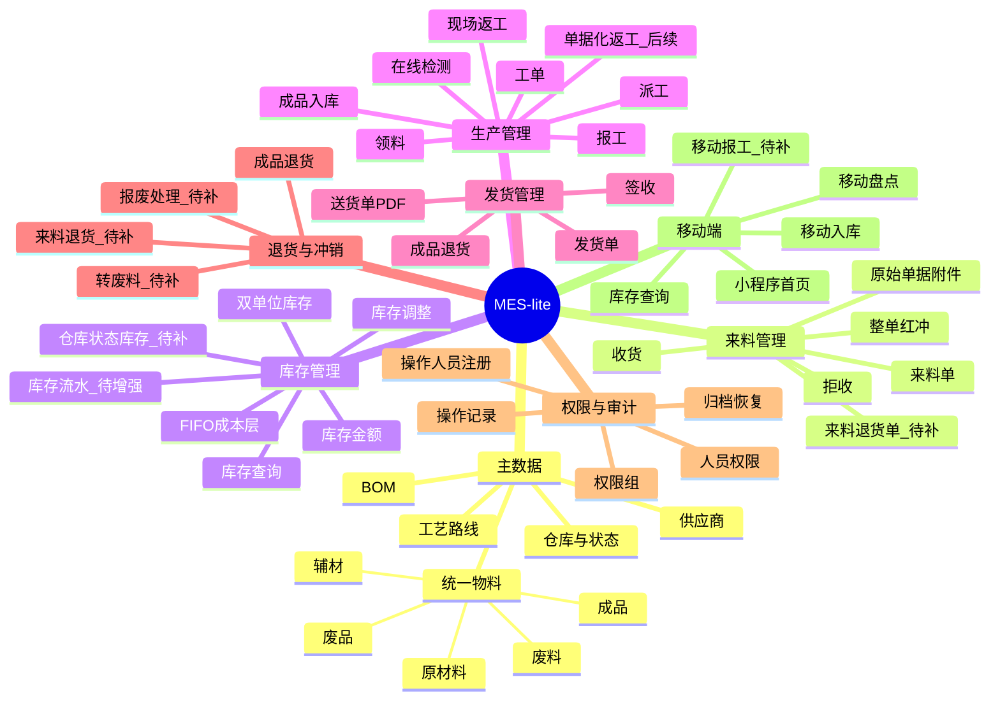
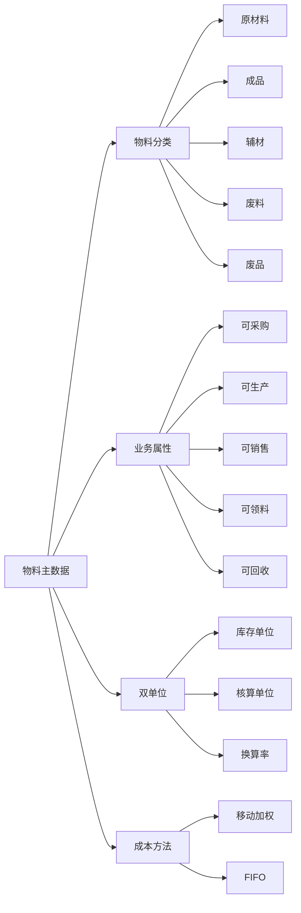
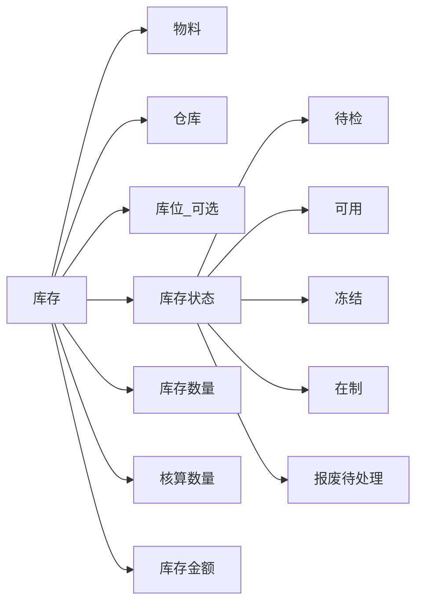
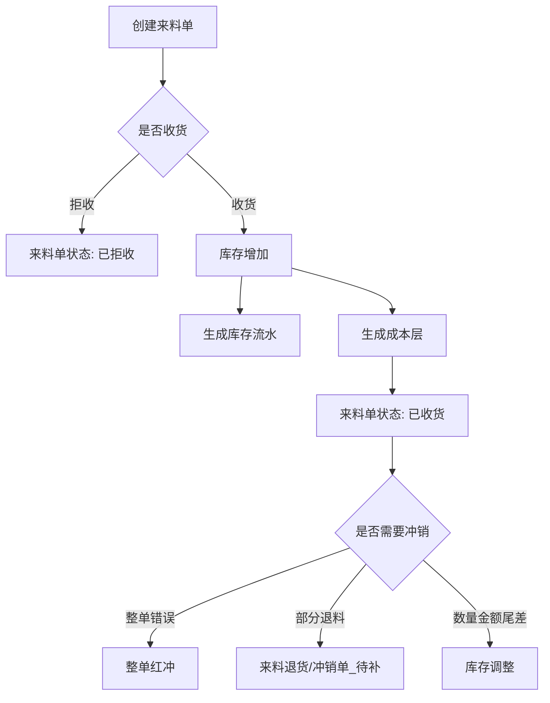
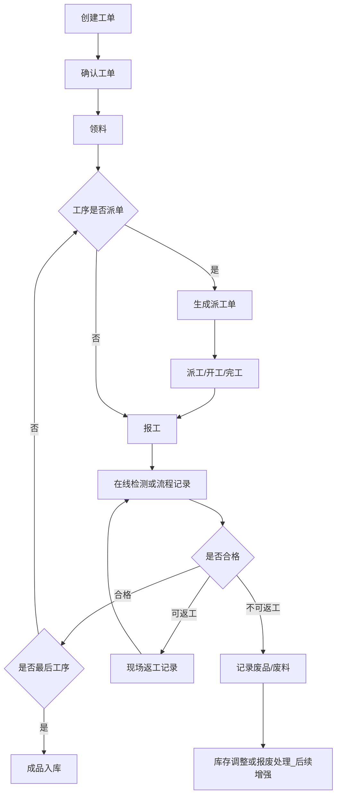
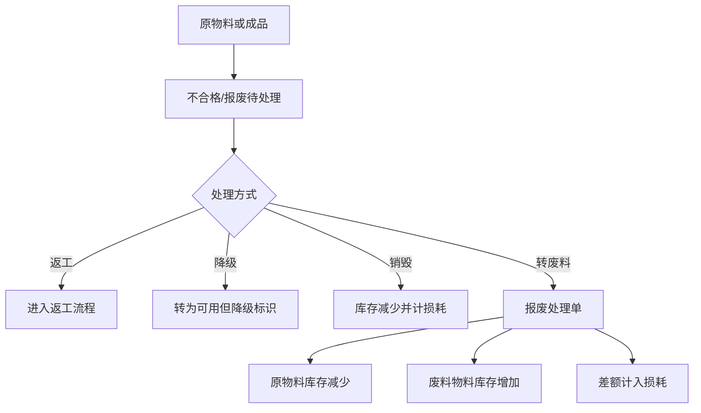
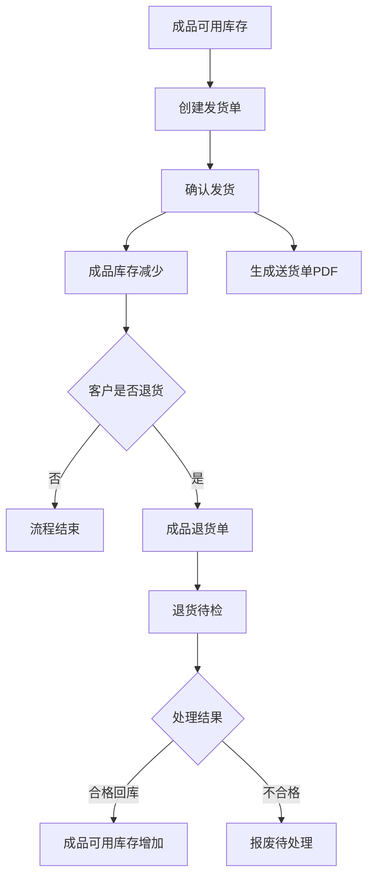
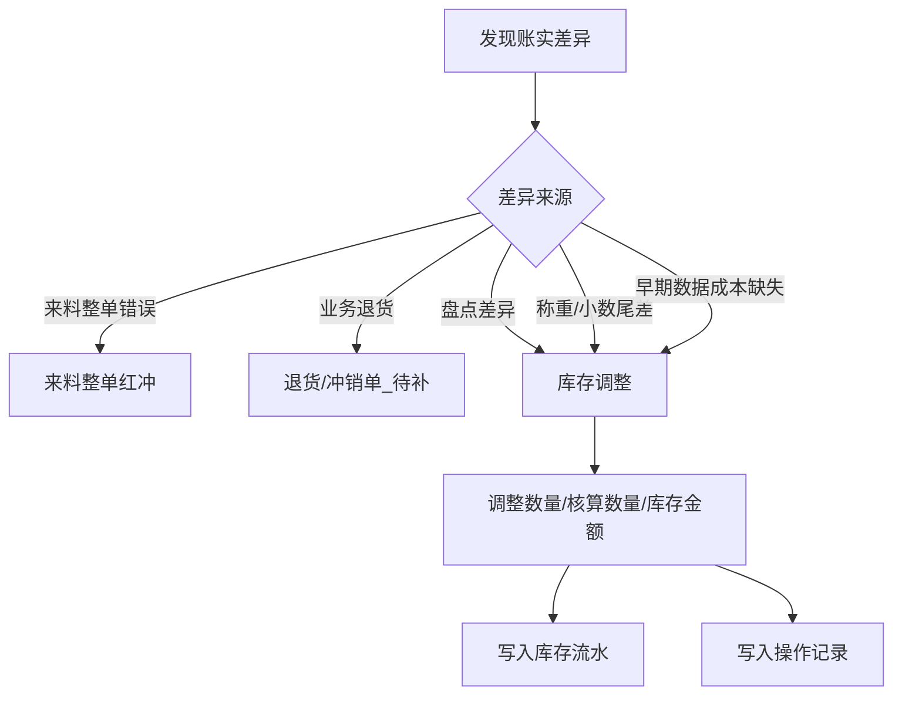
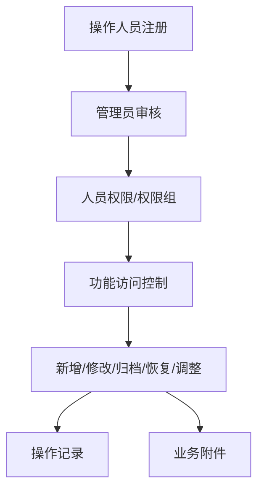

# MES-lite 系统功能与流程总览

本文用于统一当前系统建模口径，并标出后续需要补齐的功能。

## 核心建模原则

- 所有可库存、可采购、可生产、可销售、可报废、可回收的对象统一称为“物料”。
- 原材料、成品、辅材、废料、废品是物料分类，不是独立主数据体系。
- 待检、可用、冻结、在制、报废待处理是库存状态，不是物料分类。
- 来料红冲保持整单冲销；非整单反向业务后续通过独立来料退货/冲销单处理。
- 普通数量、重量、金额尾差通过库存调整处理，并写入库存流水和操作记录。
- 工序类型和是否派单分开配置；派单节点进入派工管理，不派单节点只随报工记录。

## 总体功能图

## 统一物料模型

当前系统仍存在 `Material` 与 `Product` 两套主数据。后续应逐步合并为统一物料，成品由物料分类表达。

## 库存模型

建议目标模型：

第一阶段建议先做“仓库 + 库存状态”，库位细分后置。

## 来料流程

现状：

- 已有来料单、收货、拒收、整单红冲、附件。
- 已有旧数据兼容红冲和库存调整。
- 缺少独立来料退货/冲销单。

## 生产流程

当前采用轻量生产模式：工序可配置是否派单。辅助流程默认不派单，但允许打开派单；在线检测、现场返工默认随报工记录，不强制形成独立单据。

现状：

- 已有工单、领料、派工、报工、成品入库基础能力。
- 现场检测和返工可以先随报工记录表达，不强制生成质检单或返工单。
- 辅助流程默认只作为工艺/报工结果记录；如果打开派单开关，则进入派工管理。
- 待检库存、返工单、报废处理单属于后续增强，不作为当前简单生产的前置条件。

### 派单与不派单逻辑

| 模式 | 适用场景 | 操作逻辑 |
| --- | --- | --- |
| 派单 | 需要追踪负责人、计划数量、计划时间、进度和责任的工序 | 工单领料后生成派工单，执行派工、开工、完工，再报工 |
| 不派单 | 辅助流程、在线检测、简单返工、临时处理 | 不进入派工管理，只在报工时记录数量、质量结果、备注和附件 |

## 报废转废料流程

关键判断：

- 报废待处理时，仍然是原物料。
- 只有确认转废料后，才变成新的废料物料。

## 发货与成品退货流程

现状：

- 已有发货单、确认发货、送货单 PDF、成品退货基础能力。
- 成品退货后的待检/报废状态需要继续增强。

## 库存调整流程

库存调整不是业务退货单据，只用于账实修正、盘点差异、损耗和历史数据尾差。

## 权限与审计流程

## 当前已具备功能

- 登录注册、人员审核、权限组、人员权限。
- 物料管理，支持图片、多图封面、归档。
- 来料管理，支持双单位、报价方式、收货、拒收、整单红冲。
- 库存查询，支持数量、核算数量、库存金额、单位成本。
- 库存调整，支持数量、核算数量、库存金额调整。
- FIFO 成本层与领料消耗。
- 工单、领料、派工、报工、成品入库。
- 发货、送货单 PDF、成品退货基础流程。
- 操作记录、归档记录、附件。
- Coolify 部署与持久化目录。

## 需要优先补齐的功能

| 优先级 | 功能 | 目的 |
| --- | --- | --- |
| P0 | 统一物料主数据 | 将 Product 合并为物料分类=成品 |
| P0 | 仓库与库存状态 | 区分待检、可用、在制、报废待处理 |
| P0 | 来料退货/冲销单 | 支持非整单退料，不再直接改来料单 |
| P0 | 库存流水页面 | 人工核查每次库存变化 |
| P1 | 工序类型与派单开关 | 区分主工序、辅助流程、检验点，并配置是否生成派工单 |
| P1 | 报工质量结果 | 在报工中记录合格、返工、废品、废料数量 |
| P1 | 废品/废料入账 | 将报工产生的废品、废料进入对应物料库存 |
| P2 | 报废处理单 | 支持复杂报废、返工、转废料、损耗 |
| P2 | 在制品流转 | 工序间需要精细追踪时再启用 |
| P2 | 成品待检与质检单 | 需要独立质检部门或批量检验时再启用 |
| P1 | 仓库管理 | 原材料仓、成品仓、待检仓、废料仓 |
| P2 | 库位管理 | 后续按区域、货架、箱号管理 |
| P2 | 小程序移动报工/盘点 | 现场操作闭环 |

## 下一步建议

1. 先补“库存流水页面”，方便继续测试和查账。
2. 再补“仓库 + 库存状态”，先不做细库位。
3. 然后做“来料退货/冲销单”，把非整单反向业务从红冲里分离。
4. 最后做“统一物料主数据”，迁移 Product 到 Material。
