# MES-lite 系统功能与流程总览

本文用于统一当前系统建模口径，并标出后续需要补齐的功能。

## 核心建模原则

- 所有可库存、可采购、可生产、可销售、可报废、可回收的对象统一称为“物料”。
- 当前默认启用轻量生产业务模式：仪表盘、生产日报、物料、来料、工单、库存、发货、退货作为主线入口。
- 物料 BOM 关联和 BOM 反查保留在轻量主线中；BOM 保存原料主库存单位下的每件成品单位消耗量。派工暂时隐藏，待日常流转稳定后再逐步打开。
- 原材料、成品、辅材、废料、废品是物料分类，不是独立主数据体系。
- 待检、可用、冻结、在制、报废待处理是库存状态，不是物料分类。
- 来料红冲保持整单冲销；非整单反向业务后续通过独立来料退货/冲销单处理。
- 普通数量、重量、金额尾差通过库存调整处理，并写入库存流水和操作记录。
- 工序类型和是否派单分开配置；派单节点进入派工管理，不派单节点只随报工记录。
- 产品文档保持通用：只关联成品物料和可配置文档类别，不保存适用工序；适用范围等说明写入备注，产品全景图展示该物料的全部相关文档。

## 总体功能图

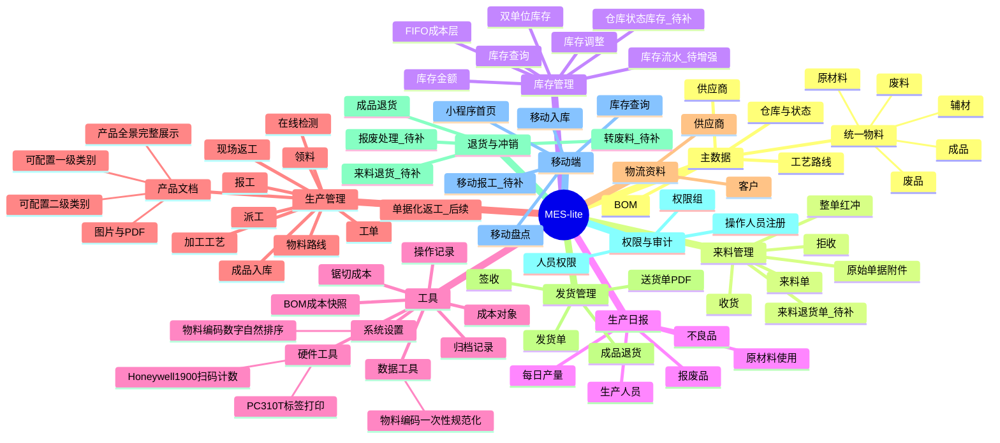
```mermaid
mindmap
  root((MES-lite))
    主数据
      统一物料
        原材料
        成品
        辅材
        废料
        废品
      供应商
      BOM
      工艺路线
      仓库与状态
    来料管理
      来料单
      原始单据附件
      收货
      拒收
      整单红冲
      来料退货单_待补
    库存管理
      库存查询
      双单位库存
      库存金额
      FIFO成本层
      库存调整
      库存流水_待增强
      仓库状态库存_待补
    生产日报
      每日产量
      不良品
      报废品
      原材料使用
      生产人员
    工具
      锯切成本
      成本对象
      BOM成本快照
      硬件工具
        Honeywell1900扫码计数
        PC310T标签打印
      归档记录
      操作记录
      数据工具
        物料编码一次性规范化
      系统设置
        物料编码数字自然排序
    生产管理
      产品文档
        可配置一级类别
        可配置二级类别
        图片与PDF
        产品全景完整展示
      工单
      领料
      派工
      报工
      在线检测
      现场返工
      成品入库
      加工工艺
      物料路线
      单据化返工_后续
    物流资料
      客户
      供应商
    发货管理
      发货单
      送货单PDF
      签收
      成品退货
    退货与冲销
      成品退货
      来料退货_待补
      报废处理_待补
      转废料_待补
    权限与审计
      操作人员注册
      人员权限
      权限组
    移动端
      小程序首页
      库存查询
      移动入库
      移动盘点
      移动报工_待补
```

## 扫码计数与标签打印底座

当前阶段先验证硬件接入和通用能力，不与发货、库存或生产状态联动。

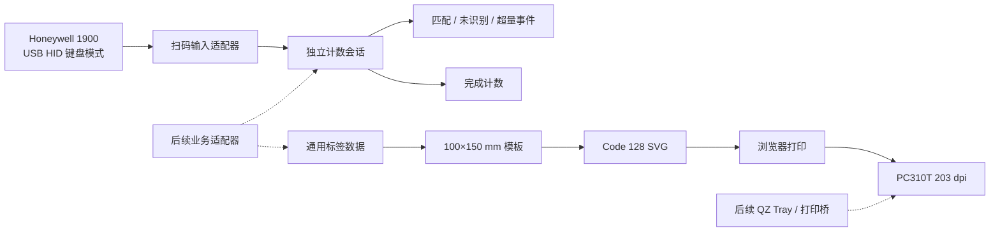
```mermaid
flowchart LR
  A["Honeywell 1900<br/>USB HID 键盘模式"] --> B["扫码输入适配器"]
  B --> C["独立计数会话"]
  C --> D["匹配 / 未识别 / 超量事件"]
  C --> E["完成计数"]

  F["通用标签数据"] --> G["100×150 mm 模板"]
  G --> H["Code 128 SVG"]
  H --> I["浏览器打印"]
  I --> J["PC310T 203 dpi"]

  K["后续业务适配器"] -.-> C
  K -.-> F
  L["后续 QZ Tray / 打印桥"] -.-> J
```

边界：

- 扫码会话不修改发货单、库存或生产记录。
- 标签打印不依赖扫码会话是否完成。
- 浏览器只能发起系统打印对话框；打印机 IP 不代表浏览器可以直接连接 RAW 9100 端口。
- 后续业务联动通过 `referenceType + referenceId` 接入，不修改设备适配器。
- 详细设备配置和验收方法见 `docs/minierp/hardware-print-scan.md`。

## 物料编码一次性规范化

“工具 / 数据工具”提供一次性物料编码转换，不作为持续运行的后台开关。

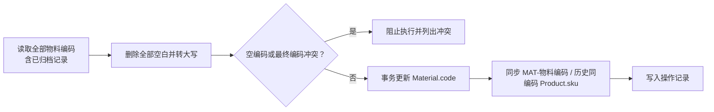
```mermaid
flowchart LR
  A["读取全部物料编码<br/>含已归档记录"] --> B["删除全部空白并转大写"]
  B --> C{"空编码或最终编码冲突？"}
  C -- 是 --> D["阻止执行并列出冲突"]
  C -- 否 --> E["事务更新 Material.code"]
  E --> F["同步 MAT-物料编码 / 历史同编码 Product.sku"]
  F --> G["写入操作记录"]
```

边界：

- 空白包括空格、制表符和换行，名称、规格、备注不转换。
- 已归档物料也参与预检和转换，避免后续恢复时占用规范化编码。
- 历史业务单据中的编码快照不追改。
- 若任何最终物料编码或关联产品编码重复，整批不执行。

## 物料编码数字自然排序

“工具 / 系统设置”提供持续生效的排序开关，和一次性编码规范化工具相互独立。

```mermaid
flowchart LR
  A["管理员开启数字自然排序"] --> B["SystemSetting 持久化"]
  B --> C["物料列表按编码排序"]
  B --> D["物料导出按编码排序"]
  C --> E["读取完整筛选结果"]
  E --> F["按数字片段排序"]
  F --> G["再执行分页"]
  D --> H["按相同规则输出"]
```

- 开启后所有客户端共享设置，`2` 排在 `12` 前，`A2` 排在 `A10` 前。
- 关闭后恢复原有数据库字符串排序。
- 该开关只影响排序结果，不会补零或改写物料编码。
- 非编码字段及用户选择的创建时间、库存等排序方式不受影响。

## 归档记录永久删除

日常业务页面仍只提供归档。“工具 / 归档记录”提供受保护的永久删除，用于清理误建、未使用且持续占用唯一编码的记录。

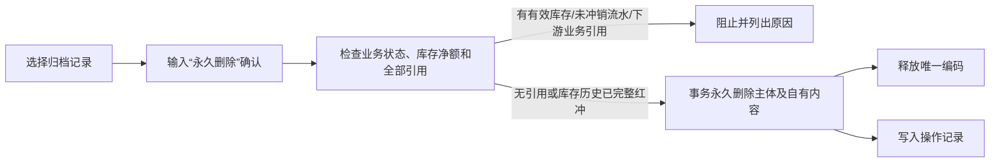
```mermaid
flowchart LR
  A["选择归档记录"] --> B["输入“永久删除”确认"]
  B --> C["检查业务状态、库存净额和全部引用"]
  C -->|有有效库存/未冲销流水/下游业务引用| D["阻止并列出原因"]
  C -->|无引用或库存历史已完整红冲| E["事务永久删除主体及自有内容"]
  E --> F["释放唯一编码"]
  E --> G["写入操作记录"]
```

- 已确认、已收货、已发货、已完成或已处理的业务单据不能永久删除。
- 已完整红冲的来料单在库存数量、核算数量和成本金额净影响均为零，且成本层余额为零、没有成本消耗或其他下游引用时，可以永久删除；其成对库存流水和红冲成本层一并清理。
- 归档物料只有在库存余额为零、来料历史均已完整红冲或已拒收、且没有 BOM、领料、生产、发货等下游引用时，才可连同上述失效来料历史永久删除。
- 附件属于被删除记录的自有内容，不作为阻断引用；永久删除时同步删除附件记录和文件。
- 未冲销库存流水、仍有效单据及其他业务引用继续禁止删除，不能通过级联破坏有效业务追溯。

## 统一物料模型

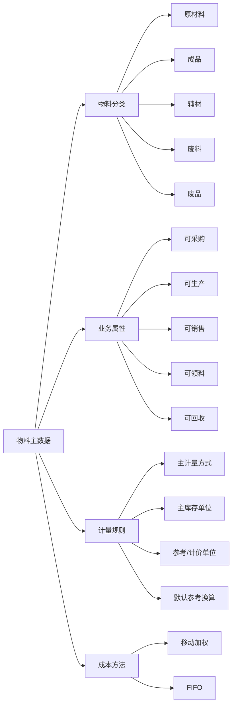
```mermaid
flowchart LR
  M["物料主数据"] --> C["物料分类"]
  C --> C1["原材料"]
  C --> C2["成品"]
  C --> C3["辅材"]
  C --> C4["废料"]
  C --> C5["废品"]

  M --> A["业务属性"]
  A --> A1["可采购"]
  A --> A2["可生产"]
  A --> A3["可销售"]
  A --> A4["可领料"]
  A --> A5["可回收"]

  M --> U["计量规则"]
  U --> U1["主计量方式"]
  U --> U2["主库存单位"]
  U --> U3["参考/计价单位"]
  U --> U4["默认参考换算"]

  M --> K["成本方法"]
  K --> K1["移动加权"]
  K --> K2["FIFO"]
```

当前用户侧统一使用 `Material` 作为唯一物品主数据。`Product` 仅作为旧 BOM、工单、发货、退货和成本表的内部兼容视图，由后端按物料自动映射，不再作为独立产品资料入口。

物料主计量方式分为长度、重量、数量和其他。库存、领料与生产耗用只按主库存单位记账；其它单位作为来料实测、采购计价和成本参考。物料不保存标准长度。长度型来料记录根数、总长度和总重量：总长度可以直接填写，也可以由根数乘单根长度计算；总重量始终表示本批总重量。三值完整时可锁定本批比例进行录入联动，但收货保存的是三个本批实际总量及实际换算。

## 库存模型

建议目标模型：

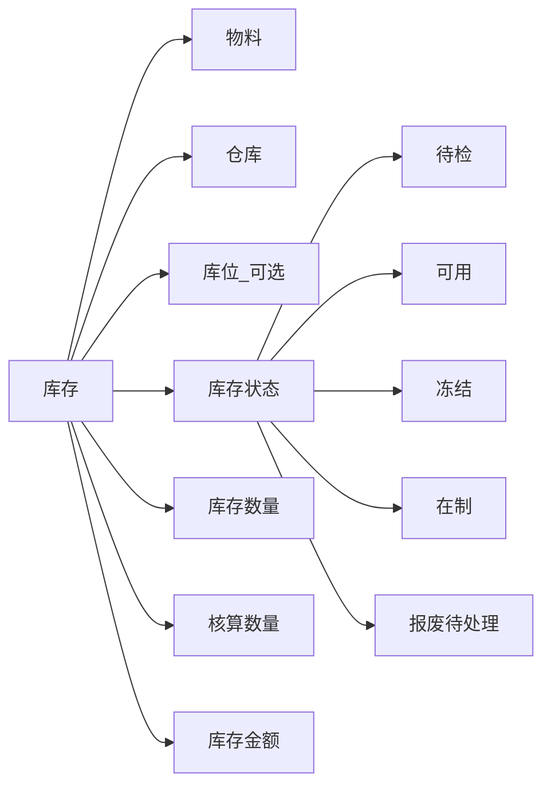
```mermaid
flowchart LR
  I["库存"] --> M["物料"]
  I --> W["仓库"]
  I --> L["库位_可选"]
  I --> S["库存状态"]
  I --> Q["库存数量"]
  I --> V["核算数量"]
  I --> A["库存金额"]

  S --> S1["待检"]
  S --> S2["可用"]
  S --> S3["冻结"]
  S --> S4["在制"]
  S --> S5["报废待处理"]
```

第一阶段建议先做“仓库 + 库存状态”，库位细分后置。

## 来料流程

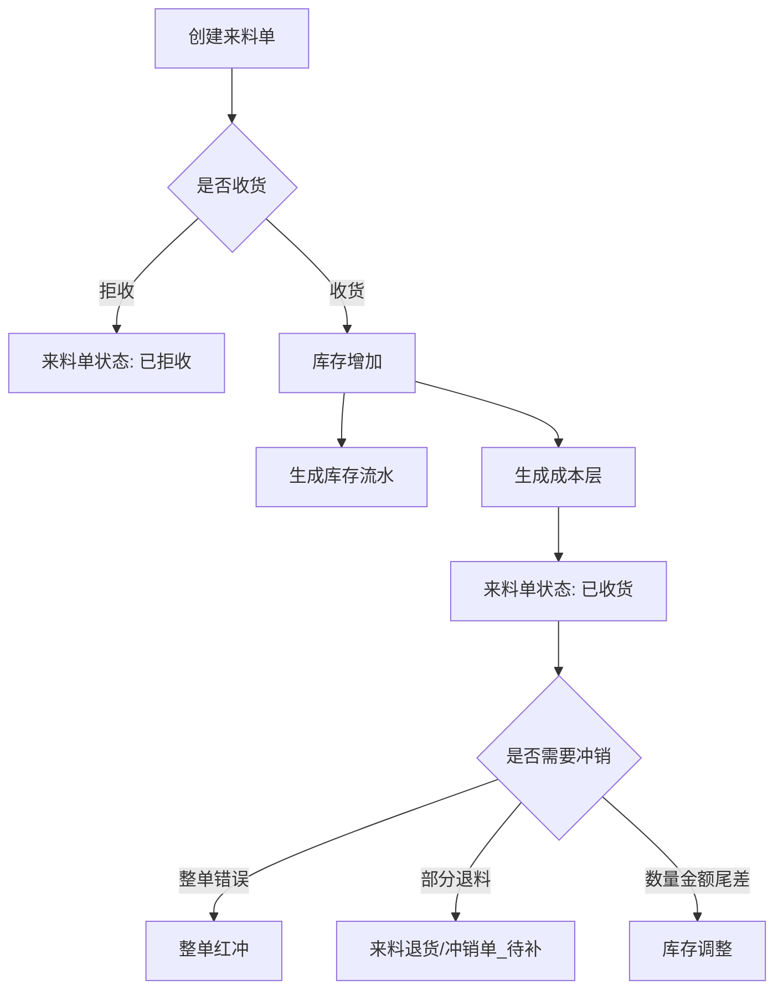
```mermaid
flowchart TD
  A["创建来料单"] --> B{"是否收货"}
  B -->|拒收| C["来料单状态: 已拒收"]
  B -->|收货| D["库存增加"]
  D --> E["生成库存流水"]
  D --> F["生成成本层"]
  F --> G["来料单状态: 已收货"]
  G --> H{"是否需要冲销"}
  H -->|整单错误| I["整单红冲"]
  H -->|部分退料| J["来料退货/冲销单_待补"]
  H -->|数量金额尾差| K["库存调整"]
```

现状：

- 已有来料单、收货、拒收、整单红冲、附件。
- 已有旧数据兼容红冲和库存调整。
- 缺少独立来料退货/冲销单。

## 生产日报流程

当前轻量模式不强制先派工，只要求每天把产量、报废、不良、原材料使用和生产人员记录准确；需要时仍可用工单记录计划、领料、报工和入库。

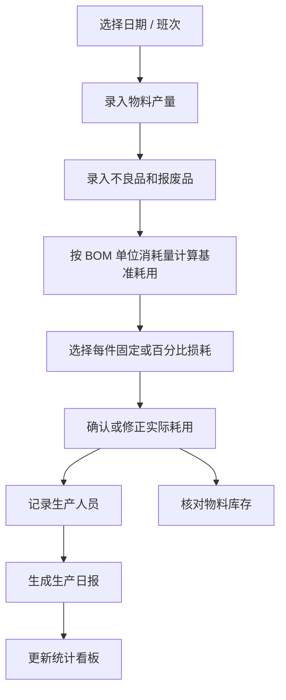
```mermaid
flowchart TD
  A["选择日期 / 班次"] --> B["录入物料产量"]
  B --> C["录入不良品和报废品"]
  C --> D["按 BOM 单位消耗量计算基准耗用"]
  D --> E["选择每件固定或百分比损耗"]
  E --> I["确认或修正实际耗用"]
  I --> J["记录生产人员"]
  J --> F["生成生产日报"]
  F --> G["更新统计看板"]
  I --> H["核对物料库存"]
```

## 可选派工生产流程

工单流程保留在轻量业务菜单中，派工管理暂时隐藏。需要完整追踪负责人、计划时间、工序进度和责任时，再打开派工。

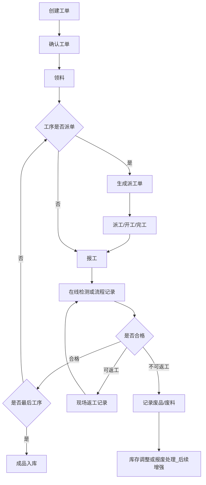
```mermaid
flowchart TD
  A["创建工单"] --> B["确认工单"]
  B --> C["领料"]
  C --> D{"工序是否派单"}
  D -->|是| E["生成派工单"]
  E --> F["派工/开工/完工"]
  F --> G["报工"]
  D -->|否| G
  G --> H["在线检测或流程记录"]
  H --> I{"是否合格"}
  I -->|合格| J{"是否最后工序"}
  I -->|可返工| K["现场返工记录"]
  K --> H
  I -->|不可返工| L["记录废品/废料"]
  J -->|否| D
  J -->|是| M["成品入库"]
  L --> N["库存调整或报废处理_后续增强"]
```

现状：

- 已有工单、领料、派工、报工、成品入库基础能力。
- 现场检测和返工可以先随报工记录表达，不强制生成质检单或返工单。
- 辅助流程默认只作为工艺/报工结果记录；如果打开派单开关，则进入派工管理。
- 待检库存、返工单、报废处理单属于后续增强，不作为当前简单生产的前置条件。

## BOM 关系与成本计算流程

BOM 第一阶段在“物料 BOM 关联”页维护产出物料对应的原材料和单位消耗量，并在“BOM 反查”页从原材料查看引用它的物料。生产日报按总加工数量计算基准耗用，为每种原料选择每件固定损耗或百分比损耗，并允许修正实际耗用。BOM 成本页按单位消耗量和数量基准形成成本快照，不联动派工，不改变库存和工单状态。

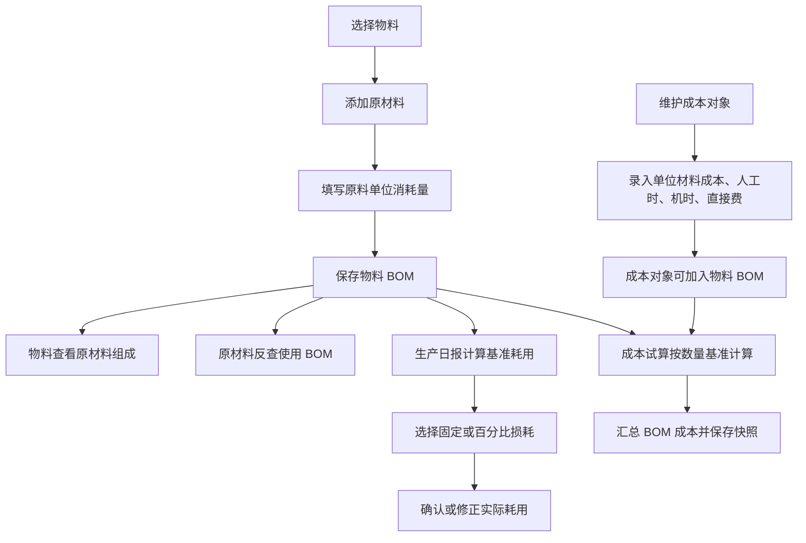
```mermaid
flowchart TD
  A["选择物料"] --> B["添加原材料"]
  B --> C["填写原料单位消耗量"]
  C --> D["保存物料 BOM"]
  D --> E["物料查看原材料组成"]
  D --> F["原材料反查使用 BOM"]
  D --> G["成本试算按数量基准计算"]
  D --> P["生产日报计算基准耗用"]
  P --> L["选择固定或百分比损耗"]
  L --> M["确认或修正实际耗用"]
  H["维护成本对象"] --> I["录入单位材料成本、人工时、机时、直接费"]
  I --> J["成本对象可加入物料 BOM"]
  J --> G
  G --> K["汇总 BOM 成本并保存快照"]
```

边界：

- `MATERIAL` BOM 项保存每件成品单位消耗量，单位固定为原料主库存单位；当前轻量流程不存在领料和库存预留。
- 日报基准耗用等于总加工数量乘单位消耗量；固定损耗按总加工数量乘每件损耗，百分比损耗按基准耗用计算。确认时按实际耗用扣减，再由库存成本层换算参考数量与成本。
- `SAWING_COST` / 成本对象 BOM 项只参与成本结构和 BOM 成本计算。
- 固定费用分摊只写入本次成本快照，不写回 BOM。
- 派工仍由工艺路线和工单驱动，不由 BOM 成本快照驱动。
- 物料 BOM 关联页用于维护产品和原材料的直接关系，BOM 反查页用于按原材料检查引用关系；物料全景图同步展示该物料相关 BOM、加工参数和成本对象。

### 派单与不派单逻辑

| 模式 | 适用场景 | 操作逻辑 |
| --- | --- | --- |
| 派单 | 需要追踪负责人、计划数量、计划时间、进度和责任的工序 | 工单领料后生成派工单，执行派工、开工、完工，再报工 |
| 不派单 | 辅助流程、在线检测、简单返工、临时处理 | 不进入派工管理，只在报工时记录数量、质量结果、备注和附件 |

## 报废转废料流程

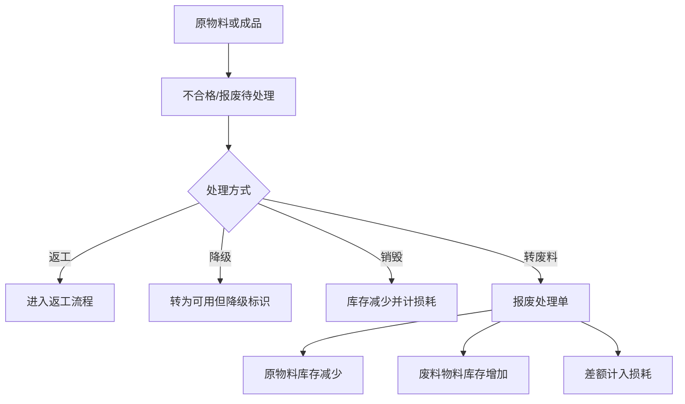
```mermaid
flowchart TD
  A["原物料或成品"] --> B["不合格/报废待处理"]
  B --> C{"处理方式"}
  C -->|返工| D["进入返工流程"]
  C -->|降级| E["转为可用但降级标识"]
  C -->|销毁| F["库存减少并计损耗"]
  C -->|转废料| G["报废处理单"]
  G --> H["原物料库存减少"]
  G --> I["废料物料库存增加"]
  G --> J["差额计入损耗"]
```

关键判断：

- 报废待处理时，仍然是原物料。
- 只有确认转废料后，才变成新的废料物料。

## 发货与成品退货流程

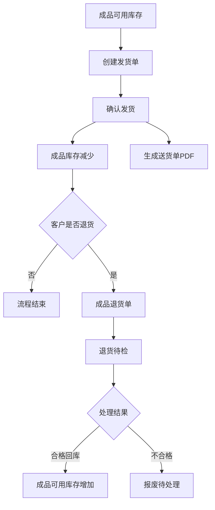
```mermaid
flowchart TD
  A["成品可用库存"] --> B["创建发货单"]
  B --> C["确认发货"]
  C --> D["成品库存减少"]
  C --> E["生成送货单PDF"]
  D --> F{"客户是否退货"}
  F -->|否| G["流程结束"]
  F -->|是| H["成品退货单"]
  H --> I["退货待检"]
  I --> J{"处理结果"}
  J -->|合格回库| K["成品可用库存增加"]
  J -->|不合格| L["报废待处理"]
```

现状：

- 已有发货单、确认发货、送货单 PDF、成品退货基础能力。
- 成品退货后的待检/报废状态需要继续增强。

## 库存调整流程

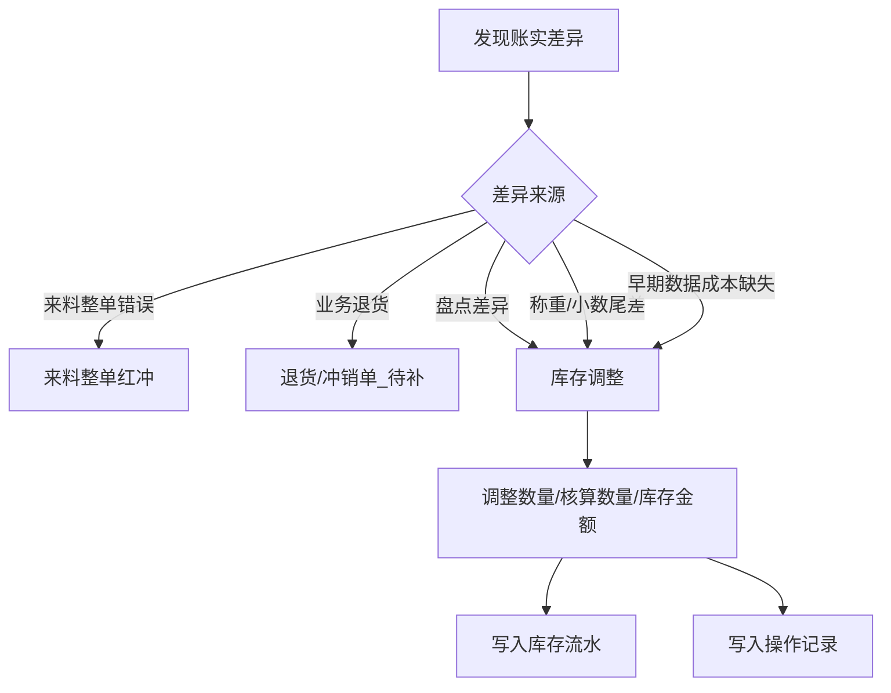
```mermaid
flowchart TD
  A["发现账实差异"] --> B{"差异来源"}
  B -->|来料整单错误| C["来料整单红冲"]
  B -->|业务退货| D["退货/冲销单_待补"]
  B -->|盘点差异| E["库存调整"]
  B -->|称重/小数尾差| E
  B -->|早期数据成本缺失| E
  E --> F["调整数量/核算数量/库存金额"]
  F --> G["写入库存流水"]
  F --> H["写入操作记录"]
```

库存调整不是业务退货单据，只用于账实修正、盘点差异、损耗和历史数据尾差。

库存页会做一致性检查：物料或内部兼容记录必须有对应 `Stock` 余额行。`Material` 是用户侧主数据，`Product` 仅作为旧外键兼容视图，`Stock` 是库存余额表，库存页只是在展示时把物料与库存余额组合成库存清单。

若只缺少 0 余额行，具备库存修改权限的人员打开库存页时会自动调用“补齐库存余额”动作创建缺失的物料/产品库存记录；该动作不调整已有数量和金额，只补主数据对应余额行并写操作记录。若自动补齐失败，页面会显示手动补齐入口；若当前人员没有库存修改权限，页面会保留一致性异常提示，等待有权限人员处理。若存在负库存、预留大于库存或关联异常，则停止展示并列出需要人工处理的明细。

## 权限与审计流程

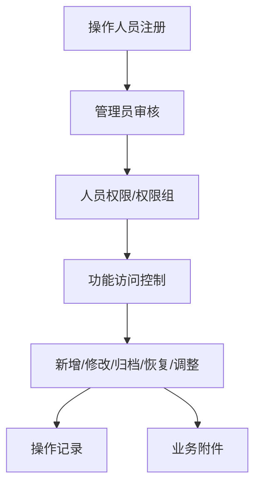
```mermaid
flowchart TD
  A["操作人员注册"] --> B["管理员审核"]
  B --> C["人员权限/权限组"]
  C --> D["功能访问控制"]
  D --> E["新增/修改/归档/恢复/调整"]
  E --> F["操作记录"]
  E --> G["业务附件"]
```

## 当前已具备功能

- 登录注册、人员审核、权限组、人员权限。
- 物料管理，支持图片、多图封面、归档。
- 来料管理，支持双单位、报价方式、收货、拒收、整单红冲。
- 库存查询，支持数量、核算数量、库存金额、单位成本。
- 库存调整，支持数量、核算数量、库存金额调整。
- FIFO 成本层与领料消耗。
- 工单、领料、派工、报工、成品入库。
- 发货、送货单 PDF、成品退货基础流程。
- 操作记录、归档记录、附件。
- Coolify 部署与持久化目录。

## 需要优先补齐的功能

| 优先级 | 功能 | 目的 |
| --- | --- | --- |
| P0 | 统一物料主数据 | 用户侧已统一为 Material；后续继续把旧 Product 外键物理迁移为 materialId |
| P0 | 仓库与库存状态 | 区分待检、可用、在制、报废待处理 |
| P0 | 来料退货/冲销单 | 支持非整单退料，不再直接改来料单 |
| P0 | 库存流水页面 | 人工核查每次库存变化 |
| P1 | 工序类型与派单开关 | 区分主工序、辅助流程、检验点，并配置是否生成派工单 |
| P1 | 报工质量结果 | 在报工中记录合格、返工、废品、废料数量 |
| P1 | 废品/废料入账 | 将报工产生的废品、废料进入对应物料库存 |
| P2 | 报废处理单 | 支持复杂报废、返工、转废料、损耗 |
| P2 | 在制品流转 | 工序间需要精细追踪时再启用 |
| P2 | 成品待检与质检单 | 需要独立质检部门或批量检验时再启用 |
| P1 | 仓库管理 | 原材料仓、成品仓、待检仓、废料仓 |
| P2 | 库位管理 | 后续按区域、货架、箱号管理 |
| P2 | 小程序移动报工/盘点 | 现场操作闭环 |

## 下一步建议

1. 先补“库存流水页面”，方便继续测试和查账。
2. 再补“仓库 + 库存状态”，先不做细库位。
3. 然后做“来料退货/冲销单”，把非整单反向业务从红冲里分离。
4. 最后做“统一物料主数据”，迁移 Product 到 Material。
