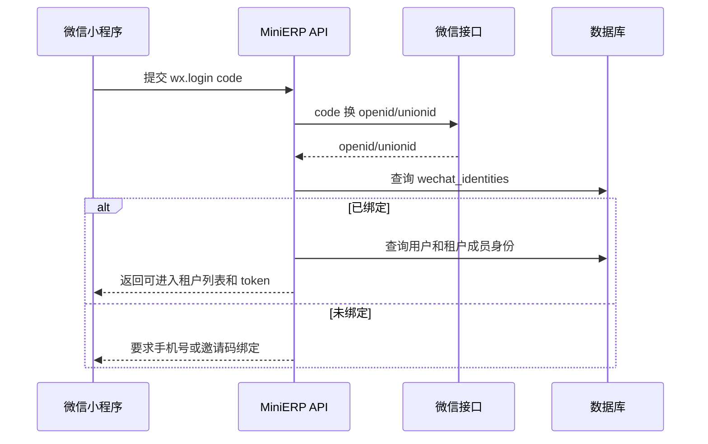

# 微信小程序接入模型

## 接入定位

MiniERP 小程序第一版定位为移动管理端，服务企业内部人员。

适合放在开发商主体下的功能：

- 查库存
- 扫码查 SKU
- 采购入库
- 销售出库
- 库存盘点
- 拍照上传原始单据
- 经营摘要
- 审批提醒

不建议放在开发商主体下的功能：

- 面向消费者的商城
- 客户公司的商品销售和在线支付
- 门店会员营销
- 客户公司行业资质相关服务

## 主体模型

系统区分三种主体：

- 开发商主体：MiniERP 软件提供方。
- 小程序主体：当前 AppID 所属法律主体。
- 业务主体：实际经营、履约和持有业务数据的客户公司。

第一版可以是：

```text
开发商主体 = 小程序主体
客户公司 = 业务主体 = 租户
```

后续迁移后可以是：

```text
客户公司 = 小程序主体 = 业务主体 = 租户
开发商主体 = 软件服务商
```

## 登录绑定流程



## 租户选择

一个微信用户可能属于多个租户。

进入小程序后：

1. 如果只有一个活跃租户身份，直接进入。
2. 如果有多个租户身份，显示租户选择页。
3. 系统记录最近使用租户，下次默认进入。

## 可迁移设计

为了后续小程序主体变更或客户独立 AppID：

- 用户登录绑定表记录 `mini_program_app_id + openid`。
- 业务身份绑定到 `user_id`，不要只绑定 openid。
- 有 unionid 时优先用 unionid 合并同一自然人。
- 小程序 AppID 配置和租户配置分表存储。
- 客户迁移到独立 AppID 后，可重新绑定 openid，但保留同一个 `user_id`。

## 权限模型

小程序端不单独发明权限，复用后台角色权限。

第一版角色：

- 提交：录入和提交业务内容。
- 审核：审核注册人员和业务内容。
- 管理：人员、权限和系统配置管理。

建议权限编码：

| 权限 | 含义 |
| --- | --- |
| inventory.read | 查看库存 |
| inventory.adjust | 调整库存 |
| stock_count.create | 创建盘点 |
| stock_count.confirm | 确认盘点 |
| purchase_receipt.create | 创建采购入库 |
| purchase_receipt.confirm | 确认采购入库 |
| sales_shipment.create | 创建销售出库 |
| sales_shipment.confirm | 确认销售出库 |
| report.read | 查看报表 |
| tenant.manage | 管理租户配置 |

## 小程序页面第一版

- 登录/绑定
- 租户选择
- 首页摘要
- 库存查询
- SKU 详情
- 采购入库
- 销售出库
- 库存盘点
- 单据列表和原始单据照片
- 我的账号

## 审核注意事项

小程序页面文案应突出内部管理属性，例如：

- 企业库存管理
- 员工移动办公
- 入库、出库、盘点

避免在开发商主体小程序里突出：

- 在线商城
- 面向消费者购买
- 客户公司品牌商品售卖
- 代收款

## 后续客户主体迁移清单

迁移前需要确认：

- 小程序是否绑定微信支付。
- 小程序服务类目是否适合目标主体。
- 服务器域名是否可继续使用或需要客户备案域名。
- 客户员工是否需要重新绑定 openid。
- 客户是否要求导出全量业务数据。
- 合同是否明确数据归属和交接方式。
