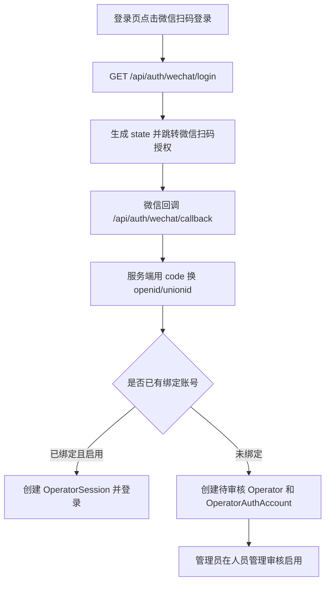

# 网站微信扫码登录配置步骤

本文记录 MES-lite Web 管理端接入微信扫码登录的实施步骤。

## 适用范围

- PC 浏览器网页登录：使用微信开放平台“网站应用”扫码登录。
- 微信小程序登录：后续使用小程序 `wx.login`，但可以复用同一张第三方账号绑定表。
- 微信内打开网页：后续如需要，再接公众号网页授权，不和本次 Web 扫码登录混用。

## 目标地址

- 网站域名：`https://mes.csyufeng.com`
- 微信登录回调地址：`https://mes.csyufeng.com/api/auth/wechat/callback`
- 微信开放平台授权回调域：`mes.csyufeng.com`

注意：微信开放平台后台通常填写“授权回调域”，只填域名，不填 `https://`，也不填 `/api/auth/wechat/callback`。MES-lite 的环境变量里填写完整回调地址。

## 配置步骤

### 1. 准备域名和 HTTPS

1. DNS 中将 `mes.csyufeng.com` 指向 Coolify 所在服务器。
2. Coolify 应用绑定域名 `https://mes.csyufeng.com`。
3. 确认浏览器可以正常打开 `https://mes.csyufeng.com`。
4. 确认 HTTPS 证书正常，不能使用浏览器报错的证书。

检查标准：

- 打开 `https://mes.csyufeng.com` 能进入 MES-lite。
- 登录页或系统右上角显示当前版本号。
- `https://mes.csyufeng.com/api/health` 返回健康状态。

### 2. 创建微信开放平台网站应用

1. 登录微信开放平台。
2. 创建“网站应用”。
3. 填写应用名称、应用介绍、官网地址等基础信息。
4. 授权回调域填写 `mes.csyufeng.com`。
5. 等待网站应用审核通过。
6. 记录应用的 `AppID` 和 `AppSecret`。

检查标准：

- 已拿到网站应用的 `AppID`。
- 已拿到网站应用的 `AppSecret`。
- 授权回调域包含 `mes.csyufeng.com`。

### 3. 配置 Coolify 环境变量

在 Coolify 的 MES-lite 应用环境变量中增加：

```env
WECHAT_WEB_APP_ID=
WECHAT_WEB_APP_SECRET=
WECHAT_WEB_REDIRECT_URI=https://mes.csyufeng.com/api/auth/wechat/callback
```

填写方式：

- `WECHAT_WEB_APP_ID`: 微信开放平台网站应用的 AppID。
- `WECHAT_WEB_APP_SECRET`: 微信开放平台网站应用的 AppSecret。
- `WECHAT_WEB_REDIRECT_URI`: 固定填写 `https://mes.csyufeng.com/api/auth/wechat/callback`。

安全要求：

- `WECHAT_WEB_APP_SECRET` 只允许放在服务端环境变量中。
- 不要把真实 `AppSecret` 写入代码、文档、截图或 Git 仓库。
- `.env.coolify.example` 只保存变量名和回调地址示例。

检查标准：

- Coolify 环境变量里能看到三项变量。
- `WECHAT_WEB_APP_SECRET` 没有出现在仓库文件中。
- 修改环境变量后重新部署或重启容器。

### 4. 部署并验证登录入口

1. 在 Coolify 重新部署 MES-lite。
2. 打开 `https://mes.csyufeng.com`。
3. 退出当前登录账号，进入登录页。
4. 确认登录页出现“微信扫码登录”按钮。

检查标准：

- 未配置微信变量时，按钮显示“微信登录未配置”。
- 配置微信变量后，按钮显示“微信扫码登录”。
- 点击按钮后跳转到微信扫码授权页，而不是停留在登录页。

### 5. 完成首次扫码登录测试

1. 点击“微信扫码登录”。
2. 使用微信扫码确认授权。
3. 微信回调到 `https://mes.csyufeng.com/api/auth/wechat/callback`。
4. 系统根据微信身份创建或匹配操作人员账号。

检查标准：

- 如果系统内没有任何操作人员，首次微信登录会自动创建并启用管理员。
- 如果系统已有操作人员，新微信账号会创建为待审核账号。
- 待审核账号看到“微信登录已提交，请等待管理员审核”。
- 管理员审核启用后，该微信账号可以直接扫码登录。

## 本地开发

本地开发仍然使用本地回调：

```env
WECHAT_WEB_REDIRECT_URI=http://localhost:3002/api/auth/wechat/callback
```

但真实微信开放平台通常要求已备案、已配置的 HTTPS 域名。本地 `localhost` 一般不能完成真实扫码回调测试，本地主要验证：

- 登录页按钮状态。
- `/api/auth/wechat/status` 是否按环境变量返回启用状态。
- `/api/auth/wechat/login` 未配置时是否返回 `wechat_login=not_configured`。
- 代码构建和类型检查是否通过。

## 登录流程



## 数据模型

新增 `OperatorAuthAccount` 保存第三方身份：

- `provider`: 当前 Web 扫码登录使用 `WECHAT_WEB`
- `providerUserId`: 微信 `openid`
- `unionId`: 微信开放平台 `unionid`，有则保存
- `operatorId`: 绑定的系统操作人员

微信返回的 `access_token`、`refresh_token` 只用于服务端即时换取资料，不写入数据库。

这样以后小程序可以新增 `WECHAT_MINI_PROGRAM` provider，并在有 `unionId` 时和同一人员账号关联。

## 首次登录规则

- 如果系统里没有任何操作人员，首次微信登录会创建并启用管理员账号。
- 如果系统已有人员，首次微信登录会创建待审核账号。
- 待审核、拒绝、停用账号不能登录。
- 账号密码登录仍然保留。

## 常见问题

### 点击后提示微信登录未配置

原因：

- Coolify 没有配置 `WECHAT_WEB_APP_ID` 或 `WECHAT_WEB_APP_SECRET`。
- 修改环境变量后没有重新部署或重启容器。

处理：

1. 检查 Coolify 环境变量。
2. 重新部署或重启容器。
3. 打开登录页刷新后再测试。

### 微信提示回调域名错误

原因：

- 微信开放平台的授权回调域没有填写 `mes.csyufeng.com`。
- MES-lite 的 `WECHAT_WEB_REDIRECT_URI` 和微信开放平台域名不一致。
- 使用了非 HTTPS 地址。

处理：

1. 微信开放平台授权回调域填写 `mes.csyufeng.com`。
2. Coolify 环境变量填写完整地址 `https://mes.csyufeng.com/api/auth/wechat/callback`。
3. 确认 `https://mes.csyufeng.com` 可正常访问。

### 扫码后显示等待管理员审核

这是正常逻辑。系统已有管理员时，新微信账号不会自动启用，需要管理员在人员管理或权限管理中审核启用。

### 扫码后仍然无法登录

检查顺序：

1. 操作人员状态是否为 `ACTIVE`。
2. 操作人员是否被停用。
3. 服务器日志是否出现微信接口错误。
4. `WECHAT_WEB_APP_SECRET` 是否正确。
5. 微信开放平台网站应用是否已审核通过。

## 上线检查清单

- [ ] `https://mes.csyufeng.com` 已能访问。
- [ ] Coolify 域名和 HTTPS 已配置。
- [ ] 微信开放平台网站应用已审核通过。
- [ ] 微信开放平台授权回调域为 `mes.csyufeng.com`。
- [ ] Coolify 已配置 `WECHAT_WEB_APP_ID`。
- [ ] Coolify 已配置 `WECHAT_WEB_APP_SECRET`。
- [ ] Coolify 已配置 `WECHAT_WEB_REDIRECT_URI=https://mes.csyufeng.com/api/auth/wechat/callback`。
- [ ] 修改环境变量后已重新部署或重启容器。
- [ ] 登录页显示“微信扫码登录”。
- [ ] 新微信账号扫码后能进入待审核状态。
- [ ] 管理员审核启用后能扫码登录。
