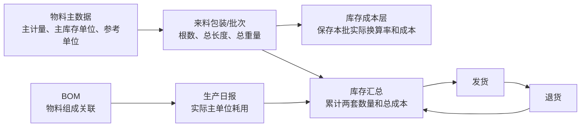

# MES-lite 双单位库存与成本核算说明

## 1. 文档目的

MES-lite 使用“主计量 + 参考/计价数量”表达物料的业务库存和核算属性，长度型来料还保存物理根数，适用于以下常见场景：

- 棒料按“根”管理、按“kg”计价。
- 线材按“卷”管理、按“米”或“kg”核算。
- 板材按“张”管理、按“平方米”计价。
- 成品按“件”管理，同时保留重量、长度等辅助核算数量。

本文说明当前系统中主计量、参考数量、来料包装/批次、换算规则和成本计算。物料不保存标准长度；每次不同的实测长度属于来料包装/批次，不创建新的同义物料规格。

轻量主流程的来料、库存、BOM、生产日报、发货和退货已经统一双单位规则。扩展阶段与隐藏工单的后续收敛方案见[双单位全流程改造规划](./双单位全流程改造规划.md)。

## 2. 核心概念

### 2.1 主计量方式与库存单位

`Material.primaryMeasure` 选择长度、重量、数量或其他；`Material.stockUnit` 是该方式下发生业务增减的主单位。

库存表中的以下字段都以库存单位记录：

| 字段 | 含义 |
| --- | --- |
| `Stock.qty` | 账面库存数量 |
| `Stock.reservedQty` | 已预留数量 |
| `Stock.availableQty` | 可用数量 |
| `Stock.stockUnitCost` | 每库存单位成本 |

例如库存单位为“米”时，来料、生产耗料、发货和退货的主数量都必须按米填写。

### 2.2 参考/计价单位

参考/计价单位是物料用于实测、采购计价和成本分析的辅助单位，对应 `Material.referenceMeasure` 与 `Material.valuationUnit`。

库存表中的以下字段都以核算单位记录：

| 字段 | 含义 |
| --- | --- |
| `Stock.valuationQty` | 账面核算数量 |
| `Stock.reservedValuationQty` | 已预留核算数量 |
| `Stock.availableValuationQty` | 可用核算数量 |
| `Stock.valuationUnitCost` | 每核算单位成本 |

参考数量主要用于采购成本、库存成本和辅助数量展示。它不会代替主库存单位驱动业务单据的主数量，也不能作为独立可领用库存。

### 2.3 换算系数

物料主数据中的换算系数对应 `Material.conversionRate`，定义为：

```text
1 个库存单位 = conversionRate 个核算单位
```

换算公式：

```text
核算数量 = 库存数量 × 换算系数
库存数量 = 核算数量 ÷ 换算系数
```

系统将数量结果保留到小数点后 6 位。换算系数为空、无效或小于等于 0 时，程序按 `1` 处理，但物料配置和导入校验要求有效换算系数必须大于 0。

### 2.4 单单位物料

当库存单位和核算单位相同、换算系数为 1 时，该物料按单单位处理：

```text
库存单位 = 件
核算单位 = 件
换算系数 = 1
```

此时库存数量和核算数量数值相同，采购价格按库存单位计算。

## 3. 数据之间的关系



物料主数据保存默认换算关系；每张来料单可以根据本批实际数量形成自己的换算率；库存汇总保存所有已确认业务累加后的余额；成本层保留每个来料批次的剩余数量和成本。

## 4. 物料主数据配置

物料需要配置以下字段：

| 配置项 | 说明 | 示例 |
| --- | --- | --- |
| 主计量方式 | 长度、重量、数量或其他 | 长度 |
| 主库存单位 | 所有业务增减使用的主单位 | m |
| 参考计量/计价单位 | 采购计价或辅助分析单位 | 重量 / kg |
| 默认参考换算 | 缺少本批实测值时的兜底 | 0.785 kg/m |
| 成本方法 | 移动加权平均或 FIFO | FIFO |
| 换算说明 | 记录理论值或测量来源 | 理论米重，来料时按实重修正 |

物料主数据中的换算系数只是默认值。物料不记录标准长度；对于长度、重量随批次变化的原料，来料包装/批次上的实际总长度和总重量优先。

## 5. 来料入库计算

### 5.1 创建来料单

长度型来料单记录三个本批事实：

```text
pieceCount   = 本批根数
qty          = 本批总长度
valuationQty = 本批总重量
```

`stockQtyMode=TOTAL` 时直接填写总长度；`stockQtyMode=PER_PIECE` 时 `qty = pieceCount × stockQtyInput`。总重量始终表示本批总重量，不再乘根数。本批实际换算率为 `valuationQty ÷ qty`。

如果用户填写了有效的核算数量：

```text
本批实际换算率 = valuationQty ÷ qty
```

如果用户没有填写核算数量：

```text
valuationQty = qty × 物料默认换算系数
```

每张来料单独立保存本批实际换算率，因此不同批次可以有不同长度、重量或实际米重。

### 5.2 采购金额

来料价格支持两种计价基准。

按核算单位计价：

```text
本批金额 = 核算数量 × 核算单位单价
核算单位成本 = 本批金额 ÷ 核算数量
库存单位成本 = 本批金额 ÷ 库存数量
```

按库存单位计价：

```text
本批金额 = 库存数量 × 库存单位单价
核算单位成本 = 本批金额 ÷ 核算数量
库存单位成本 = 本批金额 ÷ 库存数量
```

单单位物料固定按库存单位计价。

### 5.3 确认收货

来料单只有确认收货后才影响库存：

```text
库存数量 += 本批库存数量
可用库存数量 += 本批库存数量
核算数量 += 本批核算数量
可用核算数量 += 本批核算数量
库存总成本 += 本批金额
```

确认时同时创建一条库存流水和一个库存成本层。成本层保存本批原始数量、剩余数量、两套单位成本及剩余金额。

待收货单不会改变库存。已确认来料冲销时，只有该批库存和成本仍可完整恢复的情况下才能安全撤销。

## 6. 库存汇总计算

库存汇总不是使用物料默认换算系数实时重算，而是累计每笔已确认业务实际写入的数量：

```text
库存数量 = 所有库存单位收入 - 所有库存单位发出
核算数量 = 所有核算单位收入 - 所有核算单位发出
库存总成本 = 所有成本收入 - 所有成本发出
```

当前库存平均换算率：

```text
库存平均换算率 = 当前核算数量 ÷ 当前库存数量
```

当前平均单位成本：

```text
库存单位成本 = 库存总成本 ÷ 当前库存数量
核算单位成本 = 库存总成本 ÷ 当前核算数量
```

因此，多批不同换算率的物料混合后，库存汇总中的换算关系是当前剩余库存的综合结果，不一定等于物料主数据中的默认换算系数。

## 7. BOM 与生产日报

### 7.1 BOM 关联口径

BOM 的物料项只保存“产出物料关联哪些原料”，不保存固定用量、损耗率或长度比例。历史数量字段保留兼容，新保存的物料关联数量统一为 `0`。实际生产耗用和成本试算都使用原料主库存单位单独录入。

### 7.2 生产日报耗料

生产日报的总加工数量包括：

```text
总加工数量 = 合格数量 + 不良数量 + 报废数量
```

三类产量都会消耗原料。操作员对 BOM 关联的原料按主库存单位填写本次实际耗用；系统不再用固定 BOM 比例自动推导。

日报保存为草稿时生成 BOM 消耗快照，不改变库存。确认日报时：

1. 校验所有原料的可用库存数量。
2. 按成本方法计算对应核算数量和成本。
3. 扣减原料的库存数量、核算数量和库存金额。
4. 仅将合格数量增加到成品库存。
5. 将全部原料成本归集到本次合格品库存成本。
6. 写入原料消耗和合格品入库流水。

日报确认后不能直接修改；冲销日报会恢复原料库存，并撤回本次增加的合格品库存。

### 7.3 生产耗料的核算数量

移动加权平均物料按当前库存平均换算率计算：

```text
耗用核算数量 =
耗用库存数量 ×（当前核算数量 ÷ 当前库存数量）

耗用成本 =
耗用核算数量 × 当前核算单位成本
```

FIFO 物料从最早的未关闭成本层开始消耗。每层分别计算：

```text
本层换算率 = 本层剩余核算数量 ÷ 本层剩余库存数量
本层耗用核算数量 = 本层耗用库存数量 × 本层换算率
本层耗用成本 = 本层耗用库存数量 × 本层库存单位成本
```

FIFO 可以保留各来料批次不同的实际换算率和成本；移动加权平均使用库存综合平均值。

## 8. 成品入库

生产日报确认后，只有合格数量进入成品库存：

```text
成品库存数量 += 合格数量
成品核算数量 += 合格数量 × 成品默认换算系数
成品库存总成本 += 本次全部原料消耗成本
```

不良品和报废品当前只影响原料消耗，不增加合格成品库存。人工、机时和固定费用当前没有自动归集到生产日报成品库存成本，因此当前成品成本主要是 BOM 原料成本。

## 9. 发货与退货

### 9.1 发货

发货数量按成品的库存单位填写。确认发货后：

```text
发货核算数量 =
发货库存数量 ×（当前核算数量 ÷ 当前库存数量）

发货成本 =
发货库存数量 × 当前库存单位成本
```

系统扣减成品的库存数量、核算数量和库存金额，并把本次发货的核算数量和成本保存在发货单中。

移动加权平均物料按当前库存平均值出库；FIFO 物料按最早开放成本层依次出库。两种方式都会把实际核算数量、换算来源和成本快照写入发货单及库存流水。

### 9.2 退货

关联原发货单的退货按原发货比例恢复：

```text
退回核算数量 =
原发货核算数量 × 退货数量 ÷ 原发货数量

退回成本 =
原发货成本 × 退货数量 ÷ 原发货数量
```

没有关联原发货单时，系统按当前库存平均换算率和平均库存单位成本估算恢复数量与成本。

## 10. 推荐配置

### 10.1 长短不一的棒料，只要求库存显示总长度

推荐：

```text
库存单位：米
核算单位：kg（需要重量计价时）或米（不需要第二单位时）
BOM：只关联可用原料
生产日报耗用：按本次实际米数填写
来料库存数量：本批所有棒料总长度
```

例如 20 根 6 米和 10 根 4.5 米分别入库：

```text
第一批库存数量 = 20 × 6 = 120 米
第二批库存数量 = 10 × 4.5 = 45 米
库存汇总 = 165 米
```

这样生产日报可以直接按本次实际耗用米数扣减总长度。当前来料单同时记录根数；同长批次可按“单根长度 × 根数”计算，混合长度批次直接填写总长度。

### 10.2 棒料按根管理、按重量采购

推荐：

```text
库存单位：根
核算单位：kg
生产日报耗用：按本次实际根数填写
```

这种配置适合整根领用或每根规格固定的场景。每批来料输入实际总重量，可以准确核算不同批次的实际重量和采购成本。

它不适合按长度切割并要求准确扣减剩余米数的场景。

### 10.3 板材按张管理、按面积计价

推荐：

```text
库存单位：张
核算单位：平方米
换算系数：单张面积
生产日报耗用：按本次实际张数填写
```

如果实际生产按面积消耗而不是整张消耗，应改为：

```text
库存单位：平方米
核算单位：kg 或平方米
生产日报耗用：按本次实际平方米数填写
```

### 10.4 线材按米消耗、按重量计价

推荐：

```text
库存单位：米
核算单位：kg
换算系数：kg/米
生产日报耗用：按本次实际米数填写
来料核算数量：本批实际称重
```

### 10.5 普通件数物料

推荐：

```text
库存单位：件
核算单位：件
换算系数：1
生产日报耗用：按本次实际件数填写
```

## 11. 操作规范

为保证库存闭环准确，应遵守以下规则：

1. 库存单位应选择实际生产、发货和盘点时最需要准确扣减的单位。
2. BOM 只维护物料关联；生产实绩和成本试算的耗用量必须使用原料主库存单位。
3. 不同批次实际重量或长度不一致时，在来料单填写实际核算数量，不依赖物料默认换算系数。
4. 来料单确认后才增加库存，生产日报确认后才消耗库存，发货确认后才扣减成品。
5. 不良品和报废品必须录入生产日报，因为它们同样消耗原料。
6. 已确认单据发现错误时应使用冲销或退货流程，不直接修改数据库余额。
7. 同一物料已有库存、流水或 BOM 后，系统禁止直接修改库存单位和核算单位。
8. 库存调整必须同时考虑库存数量、核算数量和成本层；FIFO 物料当前不允许普通直接盘点调整。

## 12. 当前边界

当前双单位制有以下明确边界：

- 物料库存仍只有一个主库存单位和一个参考/计价单位；长度型来料额外保存根数，因此来料快照可以同时回答根数、总长度和总重量。
- 不管理“每一根材料分别剩余多少长度”。
- 不管理切割后余料的独立条码、尺寸和库位。
- 不自动根据规格计算理论重量或截面积。
- BOM 不保存固定投入比例；生产和成本耗用量按原料主库存单位填写。
- 移动加权平均会合并不同批次的换算率；只有 FIFO 保留逐批消耗关系。
- 生产日报归集原料成本，但当前不自动归集人工、机时、房租和设备折旧。
- 正式 FIFO 存货调整单和隐藏工单的全部过账路径仍需继续收敛；当前 FIFO 物料禁止普通直接盘点调整。

如果企业需要同时精确管理“根数、总长度、重量”，或者需要记录每根余料，应在后续增加批次条料/余料模型，而不是继续扩展当前两个数量字段。

## 13. 数据一致性检查

系统维护时应定期检查：

```text
库存数量 >= 0
可用库存数量 >= 0
核算数量 >= 0
可用核算数量 >= 0
库存总成本 >= 0
可用库存数量 = 库存数量 - 预留数量
可用核算数量 = 核算数量 - 预留核算数量
```

对于 FIFO 物料，还应检查：

```text
库存数量 = 所有未关闭成本层剩余库存数量之和
核算数量 = 所有未关闭成本层剩余核算数量之和
库存总成本 = 所有未关闭成本层剩余金额之和
```

库存流水应能解释每次余额变化，主要类型包括：

| 流水类型 | 业务含义 |
| --- | --- |
| `IN` | 来料确认入库 |
| `PRODUCTION_CONSUME` | 生产日报自动耗料 |
| `PRODUCTION_IN` | 生产日报合格品入库 |
| `OUT` | 发货出库 |
| `RETURN_IN` | 客户退货入库 |

## 14. 完整示例

物料“圆钢 A”配置：

```text
库存单位：米
核算单位：kg
默认换算系数：0.785 kg/米
成本方法：FIFO
```

第一批来料：

```text
库存数量：120 米
实际核算数量：95 kg
采购单价：8 元/kg
本批金额：760 元
本批实际换算率：95 ÷ 120 = 0.791667 kg/米
```

第二批来料：

```text
库存数量：45 米
实际核算数量：34.5 kg
采购单价：8.2 元/kg
本批金额：282.9 元
本批实际换算率：34.5 ÷ 45 = 0.766667 kg/米
```

确认两批来料后：

```text
库存数量：165 米
核算数量：129.5 kg
库存总成本：1042.9 元
库存平均换算率：129.5 ÷ 165 = 0.784848 kg/米
```

成品 BOM：

```text
关联原料：圆钢
```

生产日报：

```text
合格：96 件
不良：3 件
报废：1 件
总加工数量：100 件
本次实际原料耗用：36.75 米
```

原料消耗：

```text
按日报实绩直接记录 36.75 米
```

因为成本方法是 FIFO，这 36.75 米首先从第一批的 120 米中扣减，并按照第一批实际换算率计算：

```text
耗用核算数量约为：
36.75 × (95 ÷ 120) = 29.09375 kg

耗用成本约为：
36.75 × (760 ÷ 120) = 232.75 元
```

确认日报后：

```text
原料库存减少 36.75 米
原料核算库存减少约 29.09375 kg
合格成品库存增加 96 件
原料消耗成本约 232.75 元归集到 96 件合格品
```

不良和报废合计 4 件不进入合格库存，但它们对应的原料已经包含在 100 件总加工数量中。
