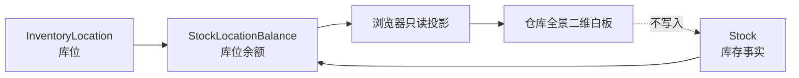

# MES-lite 库存数字孪生仓库 MVP

版本：v0.1.443
日期：2026-08-28

## 目标

在“库存 → 仓库全景”提供一个可直接试用的二维仓库白板，让管理人员快速回答三个问题：有哪些授权库位、每个库位放了什么、哪些库位存在待检/冻结/返工风险。

## 已交付范围

- 复用现有库存和库位接口，不新增数据库表、不复制库存余额。
- 只展示当前账号 `stocks.read` 和库位数据范围允许看到的事实。
- 库位卡片按 `可用 / 待检 / 冻结 / 返工 / 空库位` 着色。
- 输入物料编码、名称、规格或库位并按回车/点击搜索，匹配库位高亮。
- 支持鼠标拖动白板、放大、缩小和复位。
- 点击库位查看每种物料的原单位总量、可用量、待检量、冻结量和返工量，并可返回库存管理。

## 数据关系

不同物料、不同单位永远逐行显示，不把 `kg`、`m`、`件` 相加成无意义的仓库总数。库位风险色按 `冻结 > 待检 > 返工 > 可用 > 空` 的优先级呈现。

## MVP 停止线

本版不支持 3D、自由绘制永久布局、货箱/包裹节点、设备实时坐标、温湿度、拖拽过账或自动刷新。后续只有在真实使用验证“二维白板确实提高查找效率”后，才考虑保存布局和扫码定位；任何库存变化仍必须调用既有库存事务与冲销流程。
