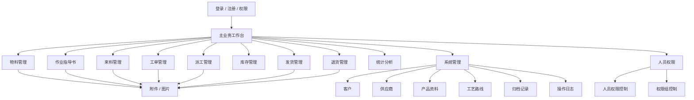
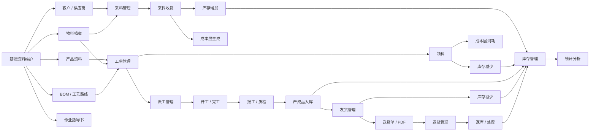
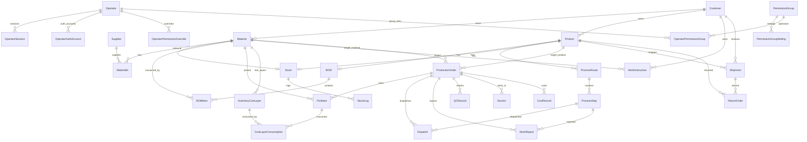
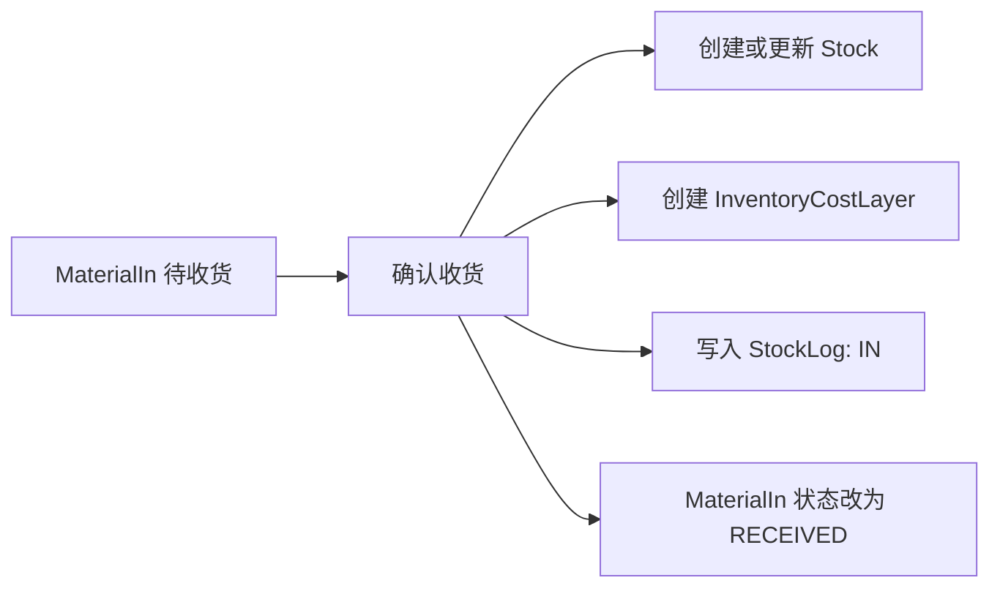
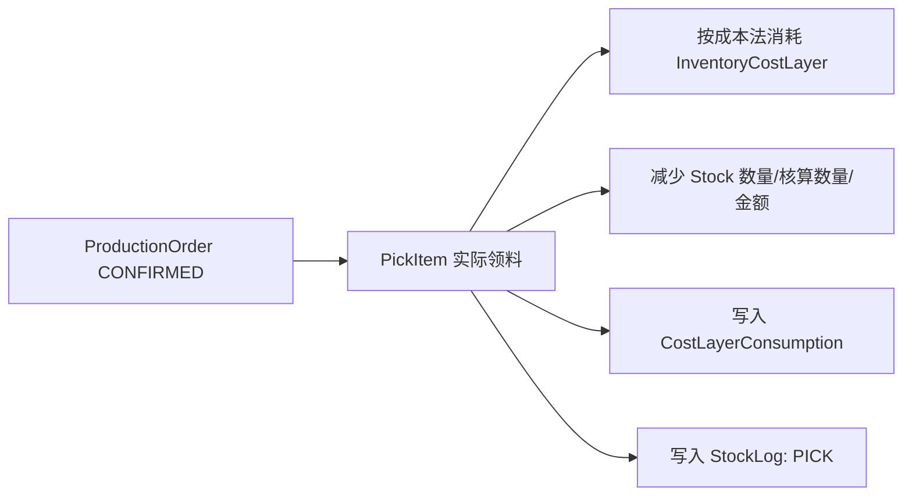
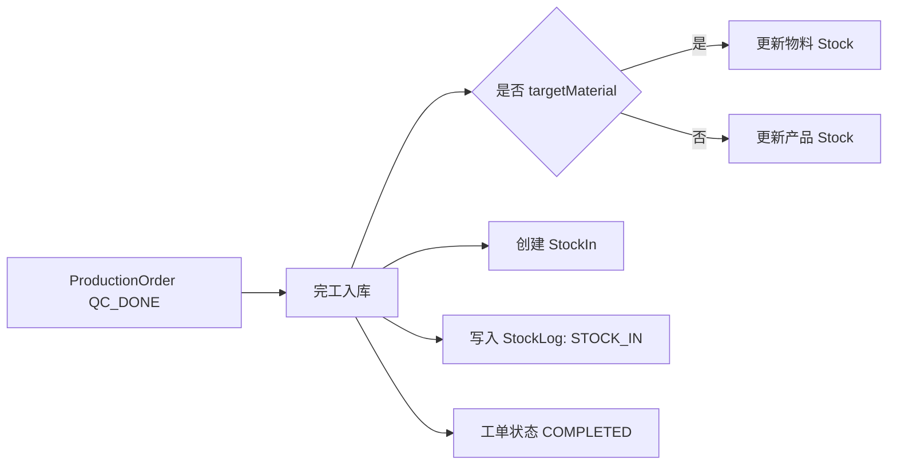
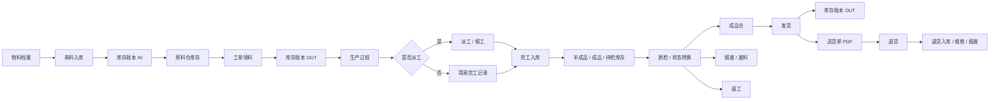

# MES-lite 当前系统建模与结构审查

本文基于当前工程代码、`prisma/schema.prisma`、前端页面入口和 API 路由整理。目标是先把系统真实结构建出来，再判断流程结构和数据结构是否存在问题。

审查日期：2026-07-15。

## 0. 文档维护规则

本文件不是一次性说明文档，而是随代码一起维护的系统模型。

后续任何代码修改，只要影响业务流程、数据模型、页面结构、接口契约、权限、审计、库存成本逻辑，都必须同步更新本文件中对应的流程图、数据结构图、问题清单或目标模型说明。

如果代码修改影响了更细的专题文档，也必须同步更新对应文档，例如：

- `docs/minierp/system-function-flow.md`
- `docs/minierp/data-model.md`
- `docs/minierp/domain-model.md`
- `docs/minierp/feature-model.md`
- `docs/minierp/界面开发规则.md`
- `docs/minierp/桌面端界面开发规范.md`
- `docs/minierp/移动端界面开发规范.md`
- `docs/minierp/响应式断点与验收矩阵.md`

提交或汇报时需要说明代码影响了哪些流程/模型，以及同步更新了哪些文档。

## 1. 总体结论

当前 MES-lite 是一个单体应用：

- 前端：Next.js App Router + React 页面组件。
- 后端：Next.js API Route。
- ORM：Prisma。
- 数据库：SQLite。
- 部署：Docker / Coolify。
- 存储：本地持久化目录中的 SQLite 与上传文件。

当前结构已经覆盖小微制造场景的主流程：物料、来料、库存、工单、派工、发货、退货、作业指导书、权限、审计。

主要问题不在“能不能用”，而在以下几个结构边界还不够清晰：

1. `Material` 和 `Product` 同时存在，和“所有东西统一叫物料”的方向存在重叠。
2. `Stock` 只有总库存，没有库位、库存状态、批次维度。
3. 作业指导书同时关联客户和物料，容易产生重复客户来源。
4. 附件使用 `ownerType + ownerId` 弱关联，没有数据库外键约束。
5. 库存成本、库存流水、成本层已经有基础，但还不是完整库存台账模型。
6. 工单当前仍强依赖 `Product`，物料工单通过自动生成简易 `Product` 兼容，长期会增加模型理解成本。
7. 工艺路线、作业指导书、派工之间还没有强绑定。
8. 退货、红冲、库存调整还没有形成统一的库存调整/逆向业务模型。

## 2. 当前功能模块图



## 3. 当前业务主流程



## 4. 当前数据结构总览



## 5. 核心数据模型说明

### 5.1 基础资料

| 模型 | 作用 | 当前状态 |
| --- | --- | --- |
| `Customer` | 客户主数据 | 已实现软删除 |
| `Supplier` | 供应商主数据 | 已实现软删除 |
| `Material` | 物料档案 | 已支持分类、客户、双单位、成本法、图片附件 |
| `Product` | 产品资料 | 仍独立存在，和物料统一模型有重叠；当前没有软删除字段 |
| `BOM` / `BOMItem` | 产品物料清单 | 绑定 `Product`，消耗 `Material` |
| `ProcessRoute` / `ProcessStep` | 工艺路线 | 绑定 `Product`，派工绑定工序 |
| `WorkInstruction` | 作业指导书 | 可绑定客户和物料，有附件展示 |

### 5.2 库存与成本

| 模型 | 作用 | 当前状态 |
| --- | --- | --- |
| `Stock` | 物料或产品总库存 | 只记录总量，不记录库位/状态/批次 |
| `StockLog` | 库存流水 | 已有数量、核算数量、金额字段 |
| `MaterialIn` | 来料单 | 记录供应商、物料、双单位、价格、状态 |
| `InventoryCostLayer` | FIFO 成本层 | 支持材料成本层 |
| `CostLayerConsumption` | 成本层消耗 | 绑定领料记录 |
| `StockIn` | 工单入库记录 | 表结构绑定工单和产品；入库接口会根据工单 `targetMaterial` 决定更新物料库存或产品库存 |

### 5.3 生产与单据

| 模型 | 作用 | 当前状态 |
| --- | --- | --- |
| `ProductionOrder` | 工单 | `productId` 当前必填；`materialId` 可选，物料工单通过自动创建/复用简易产品实现 |
| `PickItem` | 领料 | 支持实际数量、核算数量、成本消耗 |
| `Dispatch` | 派工单 | 绑定工单和工序 |
| `WorkReport` | 报工 | 记录工人、时间、良品、不良、照片 |
| `QCRecord` | 质检 | 已有模型，但流程集成较弱 |
| `Shipment` | 发货单 | 绑定产品和客户，可输出送货单 |
| `ReturnOrder` | 退货单 | 绑定发货单或产品，库存处理仍需完善 |

### 5.4 系统能力

| 模型 | 作用 | 当前状态 |
| --- | --- | --- |
| `Operator` | 操作人员 | 支持注册审核、状态、角色 |
| `OperatorSession` | 登录会话 | 已实现 |
| `OperatorAuthAccount` | 第三方登录账号 | 为微信登录预留 |
| `PermissionSetting` | 角色权限 | 已实现基础角色权限 |
| `PermissionGroup` | 权限组 | 已实现组权限 |
| `OperatorPermissionOverride` | 人员单独赋权 | 已实现 |
| `AuditLog` | 操作日志 | 已有模型，需检查所有写操作覆盖率 |
| `DocumentAttachment` | 附件 | 通用附件模型，使用弱关联 |

## 6. 当前结构优点

1. 已经具备小型 MES/ERP 的完整主链路。
2. 物料支持双单位和成本法，为库存核算打了基础。
3. 来料、领料、成本层、库存流水之间已有基础闭环。
4. 附件模型通用，可以承载原始凭证、物料图片、作业指导书。
5. 权限模型已经从角色扩展到权限组和人员覆盖。
6. 审计日志模型已经存在，适合后续补全操作追踪。
7. 软删除方向基本一致，符合“原则上不物理删除”的要求；但 `Product` 等少数模型还未补齐。

## 7. 当前结构问题与风险

| 编号 | 问题 | 风险 | 建议 |
| --- | --- | --- | --- |
| P1-01 | `Material` 和 `Product` 双模型并存 | 成品到底是物料还是产品容易混乱；BOM、发货、工单目标分裂 | 中期统一为“物料 + 类型/用途/状态”，或保留 `Product` 作为销售视图并明确映射关系 |
| P1-02 | `Stock` 只有总库存 | 无法区分成品仓、待检、半成品、废料、库位 | 增加 `Warehouse`、`StockLocation`、`InventoryBalance` 或库存状态维度 |
| P1-03 | 退货、红冲、调整未统一 | 逆向业务容易各自改库存，账目不统一 | 建立统一 `InventoryAdjustment` / `InventoryTransaction` 模型 |
| P1-04 | 附件弱关联 | 数据库无法防止附件孤儿数据 | 短期保留，增加附件清理检查；中期用服务层校验 owner 是否存在 |
| P1-05 | 作业指导书客户与物料客户双来源 | 可能出现显示客户和筛选客户不一致；客户级指导书也可能被误显示到所有同客户物料全景 | 物料全景页只显示 `materialId` 精确绑定的指导书；指导书管理页仍可按客户筛选 |
| P1-06 | 物料工单通过自动 `Product` 映射 | 简易生产可用，但会产生 `MAT-物料编码` 的隐性产品资料；后续统计和筛选容易重复 | 明确这是过渡兼容方案，或改为真正以物料作为工单目标 |
| P2-01 | 工艺路线和作业指导书没有强绑定 | 用户难以从工序直接找到对应指导书 | 增加 `processStepId` 或指导书适用范围模型 |
| P2-02 | 质检模型存在但流程弱 | 待检、返工、报废不能形成稳定闭环 | 增加质量结果与库存状态转换 |
| P2-03 | `StockLog` 和成本层不是完整台账 | 追溯某笔库存变化时可能需要跨多表拼 | 建立统一库存交易流水作为账本 |
| P2-04 | 审计日志覆盖率需要检查 | 部分写操作可能没有记录 | 对所有 POST/PUT/DELETE/状态流转 API 做审计覆盖清单 |
| P2-05 | `Shipment.customer` 字符串和 `customerId` 并存 | 客户名称可能和主数据不一致 | 明确字符串是快照字段，界面标注并保留主数据引用 |
| P2-06 | `Stock` 允许 `materialId` 或 `productId` 为空 | 数据库层不能强制“一条库存必须且只能对应一种库存对象” | 服务层增加创建校验；中期用统一物料库存对象消除这个分支 |
| P2-07 | `Product` 缺少软删除字段 | 产品资料可能和“不物理删除”规则不一致 | 补齐 `deletedAt/deletedBy`，并同步筛选和恢复入口 |
| P3-01 | SQLite 适合早期，但并发有限 | 多用户高频操作后可能受限 | 后续可迁移 PostgreSQL |
| P3-02 | 多租户未建模 | 多公司/多客户独立实例只能靠部署隔离 | 若未来 SaaS 化，需要增加 `tenantId` |

## 8. 当前关键数据流审查

### 8.1 来料入库



判断：来料入库的数据闭环基本成立，数量、核算数量、金额、成本层都有记录。

主要风险：它直接写 `Stock` 和 `StockLog`，后续如果退货、红冲、库存调整各自也直接写库存，会形成多套库存变更逻辑。

### 8.2 工单领料



判断：领料成本逻辑已经比简单扣数量更完整，具备 FIFO / 加权平均扩展基础。

主要风险：预留、实际扣减、成本层恢复、红冲、损耗调整需要统一规则，否则容易在异常流程里出现尾差或状态不一致。

### 8.3 工单入库



判断：当前能支持标准产品工单和简易物料工单。

主要风险：`StockIn` 表仍绑定 `productId`，但实际库存可能写入 `materialId` 对应的 `Stock`。这会让“入库记录对象”和“库存对象”不完全一致，是后续统一物料模型时应优先处理的点。

## 9. 建议的目标数据模型方向

### 9.1 物料统一方向

建议长期采用：

```txt
Material
  + materialType       原料 / 辅材 / 成品 / 废料 / 包材 / 其他
  + lifecycleStatus    正常 / 归档
  + inventoryStatus    可用 / 待检 / 半成品 / 报废 / 隔离
  + customerId         最终客户
```

如果保留 `Product`，建议明确：

```txt
Product = 面向销售、发货、BOM 的产品视图
Material = 统一库存对象
Product.materialId = 指向成品物料
```

这样可以避免“成品到底在 Product 还是 Material”这个长期问题。

### 9.2 库存账本方向

建议中期建立统一库存账本：

```txt
InventoryTransaction
  id
  materialId / productId
  warehouseId
  locationId
  inventoryStatus
  direction        IN / OUT / ADJUST / TRANSFER
  stockQty
  valuationQty
  costAmount
  sourceType       MATERIAL_IN / PICK / STOCK_IN / SHIPMENT / RETURN / ADJUSTMENT
  sourceId
  createdBy
  createdAt
```

当前 `StockLog` 可以视为早期版本；后续应逐步升级为完整库存交易流水。

### 9.3 库位与状态方向

建议不要一开始做复杂 WMS，但需要最小模型：

```txt
Warehouse
  原料仓 / 成品仓 / 待检区 / 半成品区 / 废料区

InventoryBalance
  materialId
  warehouseId
  inventoryStatus
  qty
  valuationQty
  totalCost
```

这样能支持：

- 原料仓领料。
- 工单完工进入半成品或成品仓。
- 待检品隔离。
- 报废转废料。
- 发货只能从成品仓扣减。

## 10. 建议的业务流程目标



## 11. 优先改进顺序

### 第一阶段：先建模和统一规则

1. 明确 `Material` 与 `Product` 的边界。
2. 明确库存状态和库位的最小模型。
3. 明确作业指导书与物料、工序、客户的关联规则。
4. 明确所有库存变化必须通过统一库存流水。
5. 明确 `Product` 是否作为销售/BOM视图保留，以及是否必须指向一个成品物料。

### 第二阶段：补齐库存与单据闭环

1. 增加库存调整单。
2. 增加库位/库存状态。
3. 将退货、红冲、报废统一接入库存交易流水。
4. 补齐发货扣库存、退货返库、工单完工入库的账本记录。

### 第三阶段：流程体验优化

1. 物料全景视图继续作为核心查询入口。
2. 作业指导书与工序、物料、客户增强关联。
3. 桌面端和移动端按独立规范重构。
4. 增加响应式模拟测试。

## 12. 当前判断

当前系统结构可以继续开发，不需要推倒重来。

但在继续增加业务功能前，建议先确认三件事：

1. 是否正式把“所有库存对象统一为物料”作为长期方向。
2. 是否开始引入最小库位/库存状态模型。
3. 是否将所有库存变化统一收敛到库存交易流水。

这三件事决定后，后续来料、生产、发货、退货、报废、待检、半成品都会更容易闭环。
