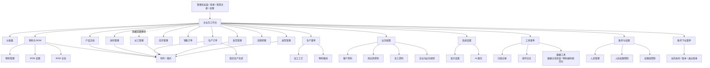
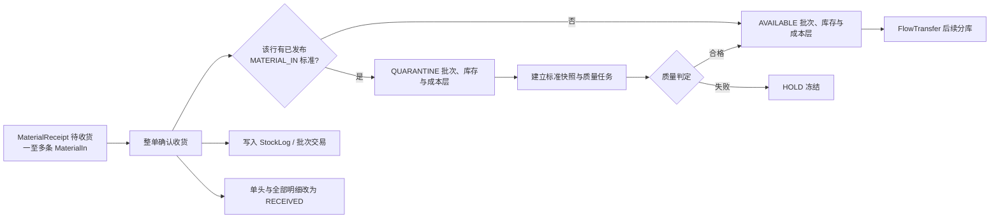
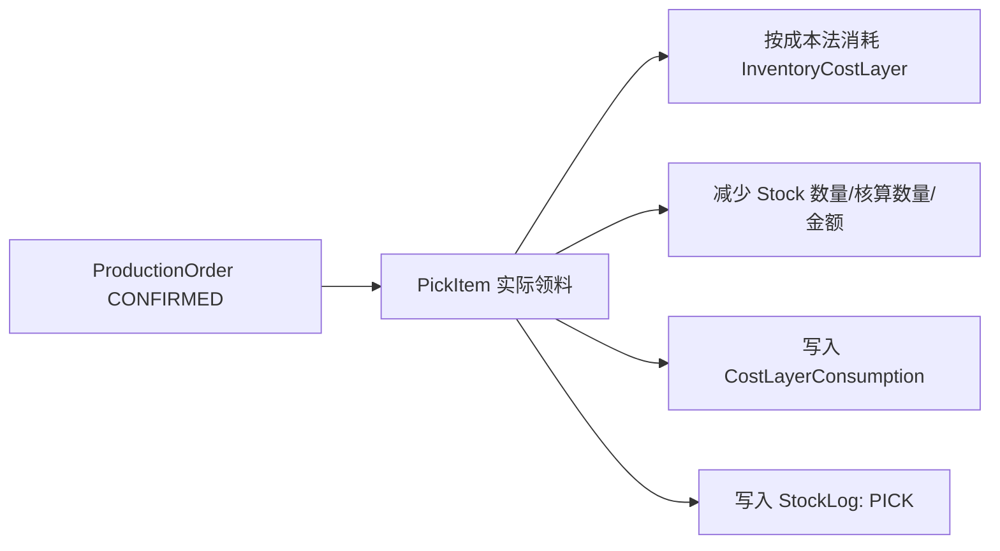
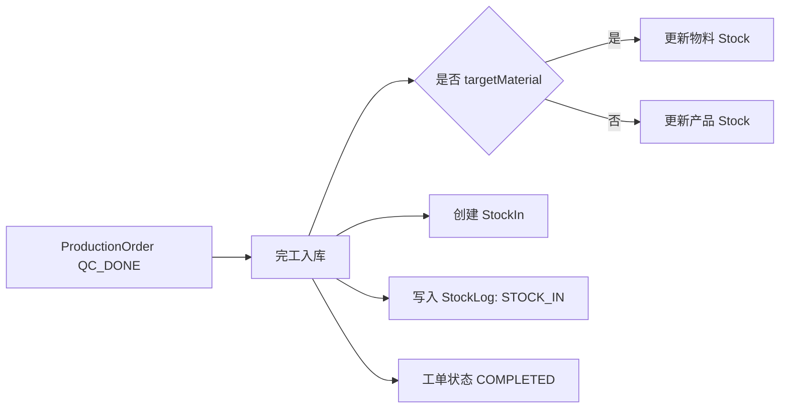
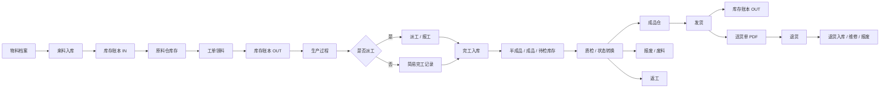

# MES-lite 当前系统建模与结构审查

本文基于当前工程代码、`prisma/schema.prisma`、前端页面入口和 API 路由整理。目标是先把系统真实结构建出来，再判断流程结构和数据结构是否存在问题。

审查日期：2026-08-21。

> 维护说明：本文保留各版本切片落地时的数量和缺口，用于解释系统如何演进；这些段落中的“当时基线”不是当前总数。`v0.1.444` 当前为 17 个模块、48 个页面定义、164 条 Route Handler、100 个 Prisma 模型、92 个迁移和 63 个权限资源；仓库数字孪生 MVP 通过独立只读查询投影既有库存与库位事实，不新增数据模型或库存账。

## 0S. v0.1.443 仓库数字孪生 MVP

仓库全景使用 `stocks.read` 和既有库存数据范围，复用 `/api/stocks` 与 `/api/inventory-locations?context=stocks` 生成二维白板。每个库位显示物料、原单位数量和可用/待检/冻结/返工状态；搜索只高亮匹配库位，详情可返回库存管理。该页面不保存坐标、不允许拖动过账、不建立第二套库存余额，因此库存、批次、成本与流水仍以现有事务账为唯一事实。

## 0R. v0.1.442 发货状态与库存冲销闭环

发货不再把“确认签收”当作唯一后续动作。`PENDING` 单据只能在没有库存事实时有原因取消；`SHIPPED` 单据可以确认签收，或者在尚未签收且没有退货依赖时，由持有独立 `shipmentReverse.update` 权限的仓库主管执行受控冲销；`DELIVERED` 单据不得直接冲销，实物回流必须建立客户退货单。`REVERSED` 与 `CANCELLED` 都是终态，只读保留责任人、时间和原因。

确认发货时，每条 `ShipmentItem` 保存实际消耗的 FIFO 成本层快照。冲销在同一数据库事务中恢复 `Stock`、`StockLocationBalance`、可用量、核算量、库存金额、原成本层和内部批次余额；`ShipmentLotAllocation` 与 `PackageDocument` 标记为 `REVERSED`，原发货流水保持不变，并追加与原流水双向关联的 `SHIPMENT_REVERSE_IN` 反向流水。迁移前未保存成本层快照的历史发货只创建明确的发货冲销恢复层，不伪造原来料成本层。

该状态命令通过详情页的“单据状态与下一步”区域呈现：页面只显示当前状态可执行的动作，同时列出发货、签收、取消或冲销的操作人和时间。服务端再次校验单据状态、退货依赖、库存范围和独立权限；普通仓管、销售跟单和通用编辑账号不能通过直接调用 API 绕过界面门禁。

## 0. v0.1.424 实际字段搜索目录与文档详情布局

29 个业务搜索页面统一使用公共字段式高级搜索。每类资源以 `ResourceSearchCatalog` 声明实际可检索字段，关键词画像和高级字段表从同一目录生成；服务端以同一字段键白名单解析组合条件，页面不再维护与智能搜索脱节的映射式高级筛选。文档资源会把当前类别的 `DocumentFieldDefinition` 动态合并进目录，因此扩展字段新增、编辑后无需再改前端硬编码；字段仍受数据范围和服务端明确查询映射约束，不会自动暴露数据库内部列。

产品文档详情的查看态继续使用紧凑摘要栏；编辑态在大桌面为左侧至少 22rem 的字段区和右侧预览，宽度不足时纵向堆叠，避免标签在窄列内逐字换行。

## 0.1 v0.1.423 文档批量与分类字段增量

文档库将标题、类别、产品、版本、状态、备注和正文固定为基础字段；文档不再保存或维护工作中心关系。每个现有 `DocumentCategory` 可以独立维护文本、数字、日期、布尔或单选扩展字段。未使用字段可修改名称、类型和选项；一旦产生 `WorkInstructionFieldValue`，仍可安全改名，但禁止删除或改变类型/选项。批量导入以每个文件独立创建 `WorkInstruction` 和原始附件；批量修改只接受同一类别，并只更新操作者显式选择的字段。写入口继续使用既有产品文档、附件和文档类别权限及审计，不创造平行资源。

## 0.1 v0.1.411 电子表格直览增量

XLS、XLSX、ODS 默认由独立自托管 Collabora 直接读取原始附件，保留原生工作表标签与横向/纵向滚动。MES-lite 只实现只读 `CheckFileInfo` 和 `GetFile`；短期令牌只保存摘要，每次回调重新校验 proof key、账号状态、附件所属资源和数据范围。兼容 PDF 仍是用户主动降级路径；Word、PowerPoint 等其他 Office 文件的既有预览不变。

## 0A. v0.1.349 治理修正

本轮将当前产品固定为单厂轻量 MES，权威边界见[单厂 MES 产品边界与核心模型收敛](../architecture/单厂MES产品边界与核心模型收敛.md)。`Material` 是唯一用户侧物品主档；`Product` 只作为待迁移的旧外键投影。库存完整性自此只补有效 Material，不再产生 Product 独占库存；旧通用生产日报创建接口继续禁用，`v0.1.433` 起仅允许专用 BOM 快捷入口原子创建并确认；旧领料、报工、入库 URL 只服务 `materialId=null` 的历史工单。

新增 `npm run audit:model-convergence` 只读盘点 Product 映射、旧外键、缺失 Material 投影、独占库存和旧生产记录。本地开发库当前仍有未映射 Product、缺少 `materialId` 的订单/发货和 Product 独占库存，因此不能进行物理外键迁移；该结果不代表生产库，生产必须在备份和恢复演练后重新审计。

## 0B. v0.1.350 状态机收敛

新 Material 生产订单只写 `DRAFT / RELEASED / IN_PROGRESS / COMPLETED / CANCELLED`。草稿详情增加显式发布动作，未发布时服务端拒绝派工和生产实绩；确认实绩、完成和冲销都由同一纯状态规则重算。历史 `CONFIRMED / PICKED / DISPATCHED / RUNNING / QC_WAITING / QC_DONE` 不再成为新写入目标，只在列表、筛选、派工、仪表盘和 AI 查询中归并显示。该版本不批量改写生产数据。

## 0C. v0.1.354 生产产出质量批次切片

新生产实绩的每个产出建立唯一 `InventoryLot`、按库位与状态余额、批次交易、待检 `QualityInspection` 和带批次/状态的成本层。产出首先进入 `QUARANTINE`，具有 `qualityDecision.update` 权限的人员可在生产订单详情整批或部分合格放行到 `AVAILABLE`，或将不合格数量冻结到 `HOLD`。判定不改变总数量与总成本，并同时留下批次交易、库存流水和审计操作人。FIFO 领料、发货和普通调整只消费可用库存。

该切片没有把来料、投入和发货接入内部批次，也不支持部分放行、复检、让步、返工、报废或解冻；因此不能将系统描述为已经完成供应商到客户的完整追溯。代码所有权增加 `modules/quality`，当前基线为 16 个模块和 123 条 Route Handler。

## 0D. v0.1.355 来料到生产批次谱系切片

新来料收货的每个 `MaterialIn` 行建立唯一 `InventoryLot`，内部批号与供应商批号分离保存。`FlowTransfer` 同步移动批次库位余额；生产实绩确认在减少库存后按来源库位 `AVAILABLE` 批次 FIFO 建立 `InventoryLotAllocation`，并为每项投入与每个产出建立 `InventoryLotGenealogy`。生产冲销恢复原批次余额并撤销分配/谱系，已被使用的来料批次不允许直接红冲。

来料详情、生产投入和产出质量卡复用同一批次追溯弹窗，通过 `stocks.read` 只读接口查看来源单据、当前余额、质检和相邻父/子批次。历史未追踪库存显式进入 `LEGACY_INVENTORY` 兼容批次，不伪造真实来源。当前代码基线是 16 个模块、71 个 Prisma 模型、72 个迁移和 124 条 Route Handler。发货、退货与客户批次边尚未建立，因此仍不是供应商到客户的完整追溯。

## 0E. v0.1.356 发货到客户与退货质检谱系切片

确认发货时，系统在同一事务内按发货库位 `AVAILABLE` 内部批次 FIFO 建立 `ShipmentLotAllocation`，保存实际发出数量、核算量、成本和累计退回量；`Shipment.lotTraceStatus` 区分真实 `TRACKED`、历史兼容 `LEGACY` 和待发货 `PENDING`。新退货单必须选择已发货或已签收且仍有可退数量的原发货单，物料自动继承，服务端再次校验状态、物料和剩余可退数量。

确认退货收货后，系统建立独立 `RETURN_ORDER` 内部批次和 `QualityInspection`，库存先进入 `QUARANTINE`；`ReturnLotAllocation` 将退货批次逐项连接到原发货批次，质量人员整批合格后转 `AVAILABLE`，不合格转 `HOLD`。统一批次追溯弹窗继续显示生产上下游，同时增加客户发货去向、退货来源和退货回流批次。迁移前已发货单首次发生退货时只建立明确的 `LEGACY_SHIPMENT` 兼容批次，不伪造过去未保存的真实批次。当前代码基线为 16 个领域模块、73 个 Prisma 模型、73 个迁移和 125 条 Route Handler；批次级供应商到客户及退货回流链已贯通，但序列号、部分放行、复检、让步、返工、报废和解冻仍未实现。

## 0F. v0.1.357 质量任务与不合格处置闭环

生产产出和客户退货共用独立“质量任务”工作台，按待检、待处置和全部记录组织车间任务。检验结果支持整批判定与部分放行/冻结；冻结批次可申请复检、转返工、返工完成送检、报废、让步放行或解冻放行。每个动作写入不可变 `QualityDisposition`，并与批次余额、库存流水、成本层、审计人和后续检验轮次在同一事务内更新；重复 `operationId` 保证幂等。

库存状态扩展为 `AVAILABLE / QUARANTINE / HOLD / REWORK / SCRAPPED`，仅 `AVAILABLE` 可被普通领料和发货消费。权限拆分为质量任务查看、质量判定、复检/返工/报废处置、让步/解冻放行四层。当前代码基线为 16 个领域模块、74 个 Prisma 模型、74 个迁移和 129 条 Route Handler；完整质量处置与跨批次搜索全景已经贯通，逐件序列号和设备事件仍未贯通。

## 0G. v0.1.361 人员数据范围与临时授权

账号级生产范围支持全厂、本人和指定工作中心，库存范围支持全部和指定库位。新增 `OperatorDataScope`、工作中心/库位关联表，以及 `ProcessStep.workCenterId`、`Dispatch.employeeId` 稳定外键；生产、质量、来料、库存、履约、统计、任务、附件和状态动作在服务端合并资源权限与数据范围。个人覆盖新增原因、授权人、起止时间和历史兼容标记，到期记录自动退出有效权限。当前代码基线为 16 个领域模块、77 个 Prisma 模型、76 个迁移和 129 条 Route Handler；部门/班组范围仍未独立建模。

## 0H. v0.1.367 归档对象权限收口

归档工具不再把 `archive` 当作访问全部业务对象的万能权限。列表、恢复和永久删除分别叠加被归档对象原业务资源的读取、更新和归档权限；来料、生产订单、派工、发货与退货继续叠加人员生产/库存数据范围。归档列表只返回最小展示字段，页面动作由服务端有效权限决定，跨范围动作返回 403。本版本不修改 Prisma Schema。

## 0I. v0.1.368 Product→Material 只读预检

生产映射维护工具增加 `preflight`：人工确认映射在进入停止写入、备份和回填窗口前，先验证确认人/时间、逐行依据、Material 有效性、一对一关系、BOM 主产出、单据投影、Product 库存风险、引用计数和计划快照。通过与失败都生成不可覆盖报告并记录数据库前后 SHA-256，预检不创建备份、不回填数据。2026-08-13 生产恢复候选的匿名审计已证明源文件未变，并量化为 13 个唯一候选、3 个无候选、2 张缺主产出 BOM 和 0 个高风险 Product 库存；它不是在线生产实时快照，仍需在维护窗口前刷新并由业务人员签字。

## 0J. v0.1.369 设备运行事件切片

设备基础资料不再接受 `status`，新设备固定从 `AVAILABLE` 开始。设备维护员通过 `START / STOP / FAULT / RECOVER` 命令改变状态；服务端校验合法转换，在同一事务创建 `EquipmentEvent` 与更新当前快照。故障、停机或维护被恢复时，持续时间写回被关闭事件，恢复事件只记录恢复时点；归档也写 `ARCHIVE`。事件保留原因、补充说明、操作人快照和时间，设备只读岗位可回放，命令另需独立 `equipmentEvents.update`。

该切片交付时的代码基线为 17 个领域模块、78 个 Prisma 模型、77 个迁移、132 条 Route Handler 和 49 个权限资源。该切片只解决基础运行状态可追溯，不代表点检、保养、维修工单、自动采集、产量或 OEE 已完成。

## 0K. v0.1.370 设备周期点检与全屏帮助切片

设备点检形成 `contracts → domain → server → client → UI` 完整设备领域切片：计划与项目保存周期标准，记录与结果冻结应检/实检时间、逐项实测、结果、说明和人员；数据库触发器保护计划主体、项目和事实记录不可覆盖。执行必须处于启用且到期状态，并一次提交完整清单；`operationId` 防重复，异常项目必须说明。设备原为可用或运行中时，异常点检与 `FAULT` 事件在同一事务保存；附件以点检记录为所有者并叠加独立资源和工作中心范围。

页面增加到期、逾期、异常任务、计划新建、逐项执行、暂停/恢复和最近记录；仪表盘新增“我的设备任务”。快捷帮助保留侧边速查，同时把“当前功能全屏”和“完整帮助中心”统一为新页面打开，并继续使用登录会话与同源 SOP 权限过滤。该切片交付时的代码基线为 17 个领域模块、82 个 Prisma 模型、78 个迁移、135 条 Route Handler 和 50 个权限资源。

## 0L. v0.1.371 设备维保与备件批次闭环切片

设备维保继续归 `modules/equipment`：周期保养计划与项目不可覆盖；计划保养和故障维修共用工单状态机，开始时写 `MAINTAIN` 事件，完成时写 `RECOVER` 事件。计划保养必须一次提交全部达标项目；完成事实、结果、备件用量和实际批次分配不可更新或删除。

备件领用不复制库存规则，而是通过 `modules/inventory` 公开的业务领料入口在同一事务扣减可用库存、成本层和 FIFO 批次，冻结主量/核算量、单位换算、成本法和金额快照。页面新增到期计划、待办/完成工单、计划/报修/完成弹窗、附件与岗位任务；权限新增 `equipmentMaintenance` 并叠加工作中心和库位范围。该切片交付时的代码基线为 17 个领域模块、88 个 Prisma 模型、79 个迁移、143 条 Route Handler、44 个页面模块定义和 51 个权限资源。

## 0M. v0.1.372 质量标准、抽样与趋势切片

质量领域新增版本化 `QualityInspectionStandard` 和有序 `QualityInspectionStandardItem`。标准固定适用物料和生产/退货任务来源，只有草稿可改；发布后不可覆盖，新版发布自动停用同物料同来源旧版。生产或退货待检任务建立时，把标准身份、抽样规则、建议抽样数和全部项目复制为 `QualityInspection` 快照与 `QualityInspectionCheckItem`，复检沿用原快照，历史任务不随标准修订漂移。

带项目的检验必须逐项提交合格/不合格，数据库与服务同时校验整单结论一致性；完成结果不可覆盖。趋势直接聚合已完成检验和失败项目并叠加库位数据范围，附件继续复用公共附件服务。页面复用质量任务工作区、公共弹窗、物料关系选择和附件组件；权限新增 `qualityStandards`。该切片交付时的代码基线为 17 个领域模块、91 个 Prisma 模型、80 个迁移、149 条 Route Handler、44 个页面模块定义和 52 个权限资源。

## 0N. v0.1.373 按标准启用的来料检验切片

来料收货继续由 `modules/receiving` 拥有库存与成本过账，但通过 `modules/quality` 公共入口查询已发布 `MATERIAL_IN` 标准并建立任务。受控行以 `QUARANTINE` 状态创建批次、余额和成本层，无标准行保持原 `AVAILABLE` 行为；一张多行收货单允许两种路径并存。来料任务沿用标准快照、抽样、逐项判定、附件、趋势、库存状态和既有四层权限，不建立来料专用质量台账。

红冲在同一事务检查任务与批次状态：待检任务取消并反向隔离库存；已合格且没有下游使用的批次可反向可用库存；失败或已处理批次阻断直接红冲。数据库第 81 个迁移允许 `MATERIAL_IN` 来源，并保护已取消检验不可再次修改。该切片交付时仍为 17 个领域模块、91 个 Prisma 模型、149 条 Route Handler、44 个页面模块定义、52 个权限资源和 81 个迁移。

## 0O. v0.1.374 来料收货与红冲命令分权切片

来料页面不新增平行工作区，只通过应用壳注入新建、编辑、收货/拒收和红冲四类有效权限。草稿维护继续使用 `materialIn`，收货/拒收使用 `materialInReceive`，整单红冲使用 `materialInReverse`；仪表盘待收货任务和 Route Handler 使用相同命令资源，前端隐藏按钮不替代服务端 403。

新安装仓库作业组获得收货/拒收但不获得红冲，仓库主管组另获有原因红冲。既有角色、内置/自定义组和个人例外不会由通用更新自动继承高风险命令，部署后须依据岗位签字显式授予。本切片不修改库存、质量或 Prisma 模型；当前基线仍为 17 个领域模块、91 个 Prisma 模型、149 条 Route Handler、44 个页面模块定义、54 个权限资源和 81 个迁移。

## 0P. v0.1.375 物流状态命令分权与审计切片

发货、退货和流程转移继续使用原页面、领域服务和状态机，但应用壳分别注入草稿、新建及每个状态命令的有效权限。`shipmentDispatch`、`shipmentDeliver`、`shipmentCancel` 分别控制库存发出、客户签收和待发货取消；`returnReceive`、`returnReject` 分别控制退货接收入库与拒绝；`flowTransferConfirm`、`flowTransferReverse` 分别控制正向移库与冲销。仪表盘待发货和退货待收货只按正向仓库命令生成。

新安装普通仓管获得发货、退货收货和移库确认但不获得签收、取消、拒绝或冲销；仓库主管另获高风险仓库命令，销售跟单获得签收、取消和拒绝但不获得仓库出入库，生产执行/主管分别获得转移确认/冲销。既有角色、内置/自定义组和个人例外不会从三个通用更新自动获得七个命令。发货、签收、取消、退货收货和拒绝补齐请求级审计，取消、拒绝与移库冲销强制填写原因。当前基线仍为 17 个领域模块、91 个 Prisma 模型、149 条 Route Handler、44 个页面模块定义和 81 个迁移，权限资源增至 61 个。

## 0Q. v0.1.376 生产实绩执行上下文快照切片

班后实绩把“人机料法”中的机与法接入正式事实：设备候选只来自订单派工或默认路线工作中心内的可用/运行设备；作业文件候选只来自适用订单物料或通用的已生效文档，不再按文档工作中心关系过滤。保存草稿时由服务端重新解析选择并冻结设备身份、状态、工作中心，以及文件标题、版本、状态、正文和附件清单，来源主数据后续修改不回写历史。

每张实绩必须同时满足“实际设备或设备例外原因”和“作业文件或文件例外原因”。确认服务复检该约束，第 82 个迁移为旧实绩回填明确迁移原因，并用数据库触发器保护已确认/已冲销的上下文和原因不可修改或删除。页面复用公共一对多关联编辑骨架，桌面双列、移动单列；本切片增加 2 个 Prisma 模型，当前基线为 17 个领域模块、93 个 Prisma 模型、149 条 Route Handler、44 个页面模块定义、61 个权限资源和 82 个迁移。自动采集、设备节拍和 OEE 仍未贯通。

## 0R. v0.1.377 生产物理 Schema 收敛切片

本版本不修改 Prisma Schema、迁移、页面、API 或权限，而是将“迁移记录已补齐”与“物理 Schema 与主线一致”分开验证。审计器从指定 Git 提交的 82 个迁移建立空库基线，在不打开源数据库的前提下检测额外、缺失与语义变更对象。

保存的生产恢复候选发现 17 张退役表、52 个额外索引和 3 张核心表的历史额外列；17 张表中只有 `ManufacturingConfig` 保留 1 行。非覆盖工具先归档结构与数据，再只对新候选收敛，后置审计已达到 `NO_SCHEMA_DRIFT`。应用检查通过但旧备份 RPO 超标，所以该候选是可审批的技术证据，不是生产切换授权。当前代码基线仍为 17 个领域模块、93 个 Prisma 模型、149 条 Route Handler、44 个页面模块定义、61 个权限资源和 82 个迁移。

## 0S. v0.1.378 写操作审计覆盖切片

当前 134 个 `POST / PUT / PATCH / DELETE` 处理器全部进入自动清单：129 个记录请求级审计或把当前请求上下文传入领域事务，5 个没有业务数据写入的兼容/偏好/匿名统计处理器以具体原因显式豁免。14 个订单、派工、成本、扫码、注册和人员管理高风险命令不能使用豁免或仅声明服务委托，必须显式传递请求审计上下文。

新增审计不改变业务模型、权限资源或状态机。订单创建/取消、派工流转、生产成本、历史报工/入库、扫码事件/撤销/完成、账号注册和人员审批把业务结果与 `AuditLog` 放在同一事务；失败和幂等重放不会留下虚假成功记录。附件和登录会话仍采用请求级尽力审计，因为文件系统或 Cookie 生命周期不能纳入 SQLite 事务。当前 Prisma 模型、迁移、页面和权限资源数量保持不变。

## 0. 文档维护规则

本文件不是一次性说明文档，而是随代码一起维护的系统模型。

后续任何代码修改，只要影响业务流程、数据模型、页面结构、接口契约、权限、审计、库存成本逻辑，都必须同步更新本文件中对应的流程图、数据结构图、问题清单或目标模型说明。

如果代码修改影响了更细的专题文档，也必须同步更新对应文档，例如：

- `docs/minierp/system-function-flow.md`
- `docs/minierp/data-model.md`
- `docs/minierp/domain-model.md`
- `docs/minierp/feature-model.md`
- `docs/minierp/界面开发规则.md`
- `docs/minierp/桌面端界面开发规范.md`
- `docs/minierp/移动端界面开发规范.md`
- `docs/minierp/响应式断点与验收矩阵.md`

提交或汇报时需要说明代码影响了哪些流程/模型，以及同步更新了哪些文档。

## 1. 总体结论

当前 MES-lite 是一个单体应用：

- 前端：Next.js App Router + React 页面组件。
- 后端：Next.js API Route。
- ORM：Prisma。
- 数据库：SQLite。
- 部署：Docker / Coolify。
- 存储：本地持久化目录中的 SQLite 与上传文件。

部署形态仍是单体，但代码所有权开始按领域垂直切片：工作台、生产、库存、业务配置、物料、BOM、系统设置、运维工具、文档、来料、身份权限和销售均通过 `modules/<domain>/index.ts` 提供公开入口。归档、审计、数据工具、业务设置、系统设置、加工工艺和物料路线已经从 1,949 行的 `SystemPage.tsx` 迁入对应模块，原页面降至 31 行纯分派层。生产工程写入 Schema 与事务规则已进入生产服务，派工页、流程转移页、契约和 HTTP client 也已迁入生产领域并不再直接访问接口；流程转移页从 591 行降至 485 行，其既有同物料、同数量、跨库位、总库存/总成本不变规则继续由事务回归验证。物料查询和写入事务进入物料服务，物料 API 从 549 行降至 73 行，双形态工具栏与 BOM 工作区拆出后主页面从 887 行降至 709 行，物料全景 API 从 412 行降至 20 行且聚合查询与附件分类分别进入服务，物料导入 API 从 398 行降至 36 行且 CSV 解析、单位校验、客户匹配和批量事务已分层；BOM API 从 464 行降至 45 行，结构校验、版本规则、资料查询和方案替换事务进入 BOM 模块，BOM 成本 API 从 340 行降至 45 行且成本输入、折算/分摊纯规则、查询装配和快照写入已分层，未注册的保留成本页也迁入 BOM 模块并从 720 行降至 490 行；物料全景页面从 1485 行降至 187 行；作业文档 API 从 551 行降至 78 行，主页面从 1497 行降至 591 行；来料 API 从 295 行降至 90 行，页面从 1679 行降至 684 行；库存契约、HTTP、格式规则、集合、详情、调整和一致性提示进入库存模块，协调页从 853 行降至 304 行，库存 API 从 449 行降至 79 行，查询、包装穿透、补齐/调整命令和余额一致性规则已分层；权限 API 从 350 行降至 79 行，人员 API 降至 41 行，人员和权限页面、client、输入契约、资源授权判断及管理事务进入身份权限模块；销售订单、发货和退货页面、client、契约和视图规则统一进入销售模块，三个页面均不再直接访问接口。旧生产日报页已退出应用壳，生产实绩只从生产订单详情进入；旧日报表与 API 暂为服务器历史数据保留。当前已无超过 800 行的页面和超过 300 行的 API；根级页面从 13 个降至 5 个，其中 `SystemPage` 是刻意保留的兼容分派层，自动边界校验继续阻止职责回流。

设备台账已进一步进入独立 `modules/equipment`：页面从 246 行降至 210 行，列表、工作中心候选、保存和归档统一通过领域 client；该阶段共有 13 个领域模块，根级页面降至 4 个，其中 `SystemPage` 是刻意保留的兼容分派层，真正待迁移领域页为 3 个。

员工档案已进入业务配置模块：页面从 263 行降至 214 行，读取和保存统一通过配置领域 client；员工仍是业务人员而非登录账号权限对象。当前根级页面降至 3 个，其中真正待迁移领域页为扫码打印和锯切成本。

业务配置参考资料已进一步统一访问边界：供应商/客户、库位和单位共享配置领域契约与 HTTP client；文档类别和工作中心虽保留配置菜单入口，但分别由文档、设备领域独立拥有。所有页面继续复用公共 `ResourcePage` 或 `ResourcePageShell` 且不直接调用 `fetch`，未建立第二套配置骨架。

运维维护工具也已统一访问边界：归档、审计和数据工具共享维护契约与 HTTP client，归档九类记录的标签映射和时间排序成为独立纯规则，3 个页面不再直接调用 `fetch`。当前页面级直连请求仅余公共页内选项、生产订单和工作台。

页面访问层现已清零：公共页内选项通过能力注入读取业务单位目录，生产订单的列表/候选/详情/创建进入生产 client，订单分组和创建输入进入纯模型，工作台统计读取、旧字段归一化、指标装配和展示面板进入工作台模块。生产订单协调页从 535 行降至 448 行，工作台协调页从 397 行降至 74 行；所有 `*Page` / `*PageModule` 均不再直接调用 `fetch`，全局边界守卫阻止回流。

工作台服务端也已进入领域：生产流指标纯规则从扁平 `lib` 迁入 `modules/workspace/domain`，日/月时间窗口、并行统计、状态分布、待处理事项与库存预警过滤进入查询服务。仪表盘 API 从 141 行降至 17 行且不再直接访问 Prisma，工作台形成完整的 contracts/client/model/ui/domain/server 垂直切片。

生产订单主接口也已进入生产领域：创建 Schema、组号/行号纯规则、列表查询和创建/归档命令分别进入 contracts、domain 与 server。`/api/orders` 从 257 行降至 84 行，不再直接访问 Prisma 或持有 BOM 校验、物料映射和事务；临时完整 SQLite 回归覆盖多行原子创建、BOM 快照、空格分隔关键词查询和软归档，不接触本机测试库或服务器正式数据。

生产订单详情、候选、确认和取消也已收口：详情与候选装配进入查询服务，确认/取消状态规则进入纯领域函数，取消退料、成本恢复、总库存与库位预留释放进入独立状态事务服务。四个相邻 API 均降至 24 行以内且不再访问 Prisma；临时库回归覆盖重复确认/取消拒绝和取消后的库存、库位、领料明细一致性。

生产实绩服务端也已形成完整垂直切片：输入契约、BOM/成本层快照、日期编号、投入/多产出展开、订单累计、工作区/草稿服务及确认/冲销状态事务全部归 `modules/production`；原扁平 helper 已删除。四条实绩 API 均为 26–43 行薄适配层，直接访问 Prisma 的 API 从 82 个降至 78 个。临时库回归覆盖草稿、人员、库位、确认过账、成本、主/副产出、冲销恢复、删除和编号断档；本版本不改 Prisma Schema。

扫码打印与锯切成本现已进入 `modules/operations-tools`：页面分别降至 415 行和 363 行，标签/扫描器配置、HTTP client、请求契约、锯切材料/班次/规模计算与保存输入均拥有独立边界。根级 `*Page.tsx` 只剩 31 行的 `SystemPage` 兼容分派层，不再存在待迁移根级领域页；锯切核心计算由确定样例守卫，不依赖 React 或数据库即可回归。

通用附件现已进入独立 `modules/attachments`：契约、领域错误与存储规则、浏览器 client、查询服务和命令服务拥有单一代码所有权。附件主/草稿 API 分别从 291/88 行降至 102/53 行，六条附件路由不再直接访问 Prisma，页面和相邻领域不再重复附件请求；直接访问 Prisma 的 API 从 78 个降至 72 个。临时 SQLite 与临时文件目录回归覆盖上传、旋转、封面、归档接替、草稿绑定和取消清理；本版本不改 Prisma Schema。

销售服务端已形成完整垂直切片：订单/调价/发货/退货输入契约、日期编号、定价、查询、命令、状态事务和送货单 PDF 全部归 `modules/sales`；旧扁平销售订单 helper 已删除。当前销售订单与发货完全解耦：销售订单只记录客户需求，发货单只记录一个客户和多条实际发货物料，不保存订单 ID、不占用或回写订单数量与状态。未发、待发、已发和超发按“客户 + 物料”动态汇总供页面与仪表盘参考，允许超发。临时完整 SQLite 回归覆盖默认价快照、受控调价、多明细发货、总库存/库位/成本扣减、送达、PDF、退货按原成本恢复、拒绝、查询、归档和重复状态拒绝；本版本新增 `ShipmentItem` 并迁移历史单行发货数据。

`v0.1.356` 在该切片上新增第 17 条退货选项 API，并把确认发货、退货收货、质量判定接入内部批次与库存状态事务。销售 API 仍保持薄层；专用临时库回归覆盖真实/历史兼容发货批次、原发货剩余可退量、独立退货待检批次、回流谱系和整批质量放行。

来料服务端现也覆盖完整生命周期：`MaterialReceipt` 保存单头，`MaterialIn` 保存一至多条物料明细；输入契约、日期编号、详情装配、待收货编辑、收货/拒收状态约束、总库存/库位/成本层过账和整单红冲恢复均归 `modules/receiving`。一张单的所有明细强制进入同一待分库库位，后续分库复用 `FlowTransfer`。临时完整 SQLite 回归覆盖多物料单头原子创建、整单编辑/收货/红冲、成本层变更阻断、查询和归档。

派工服务端现也形成完整生产领域切片：创建 Schema、日期编号、五态流转、列表/详情查询、工单与工序校验、创建/归档和状态事务均归 `modules/production`。6 条派工 API 为 17–67 行薄适配层，使直接访问 Prisma 的 API 从 52 条降至 46 条。临时完整 SQLite 回归覆盖当日最大序号、工序归属、组合查询、派工、开工、完工、取消、归档和非法重复流转；本版本不改 Prisma Schema。

流程转移服务端现也形成完整生产领域切片：草稿/确认/冲销 Schema、业务日期编号、状态规则、工作区查询、草稿命令和库位确认/冲销事务均归 `modules/production`，旧扁平 helper 已删除。4 条流程转移 API 为 29–48 行薄适配层，使直接访问 Prisma 的 API 从 46 条降至 42 条。临时完整 SQLite 回归通过真实领域服务覆盖编号、查询、草稿编辑、来源库存、确认、冲销及总库存/成本层不变；本版本不改 Prisma Schema。

供应商与客户现已形成配置领域的参数化往来单位切片：前端继续共用 `PartySettingsPage`，服务端新增共同输入契约、资源定义、领域错误、资料服务和 HTTP 适配器。两条 Route Handler 各 6 行，只声明 `supplier` 或 `customer`；共同搜索、输入清理、排序、新增、更新、归档和审计不再复制，同时显式保留客户有效名称唯一、供应商允许同名但编码唯一的既有差异。直接访问 Prisma 的 API 从 42 条降至 40 条，14 个领域/平台模块共有 258 个 TypeScript 文件。临时完整 SQLite 回归不接触本机测试库或服务器正式数据；本版本不改 Prisma Schema。

库位服务端现也归入配置领域：输入 Schema、编码/默认状态纯规则、数量汇总查询、新增/更新和受保护归档事务均由 `modules/configuration` 所有。库位 API 从 156 行降至 84 行且不再访问 Prisma，使直接访问 Prisma 的 API 从 40 条降至 39 条；14 个领域/平台模块共有 263 个 TypeScript 文件。临时完整 SQLite 回归覆盖唯一默认库位、编码规范化、数量汇总、库存和待处理来料阻断、归档恢复及直接停用旁路封闭；本版本不改 Prisma Schema。

设备与工作中心现已形成同一设备领域的完整垂直切片：工作中心页面、契约、搜索模型和 client 从配置领域迁入 `modules/equipment`，业务配置只经设备模块公开入口挂载。设备与工作中心 Schema、查询、命令、有效归属、迁移、引用归档阻断、恢复和直接停用旁路封闭均由设备领域拥有，两条 API 从 139/135 行降至 84/85 行且不再直接访问 Prisma，使直接访问 Prisma 的 API 从 39 条降至 37 条；14 个领域/平台模块共有 272 个 TypeScript 文件。临时完整 SQLite 回归不接触本机测试库或服务器正式数据；本版本不改 Prisma Schema。

旧生产日报兼容链路也已收口到生产领域：输入契约、日期与最大序号规则、BOM/人员/耗用快照、组合查询、草稿命令、数据库异常翻译和确认/冲销库存成本事务均由 `modules/production` 拥有，纯领域规则不依赖 Prisma，两个旧扁平 helper 已删除。4 条兼容 API 合计从 714 行降至 139 行且不再直接访问 Prisma，使直接访问 Prisma 的 API 从 37 条降至 33 条；14 个领域/平台模块共有 281 个 TypeScript 文件。临时完整 SQLite 回归覆盖草稿、查询、确认过账与冲销恢复；本版本不恢复旧页面、不改 Prisma Schema，也不触碰本机测试库或服务器正式数据。

单位配置生命周期现也归入业务配置领域：输入契约、身份判等、同量纲编码判重、语义变更、目录/使用量查询和自定义单位事务均由 `modules/configuration` 所有。`/api/system/units` 从 228 行降至 79 行且不再直接访问 Prisma，使直接访问 Prisma 的 API 从 33 条降至 32 条；14 个领域/平台模块共有 287 个 TypeScript 文件。已被物料或 BOM 使用的单位只允许修改显示名称，预置单位不可修改或删除；临时完整 SQLite 回归不触碰本机测试库或服务器正式数据。本次不修改 Prisma Schema、单位接口 URL 或界面结构。

员工档案现已形成配置领域的完整垂直切片：页面/client/展示契约、输入 Schema、自动编号、账号绑定、查询、写入及有效员工引用均由 `modules/configuration` 所有。生产实绩和旧日报只通过配置模块公开出口取得有效员工与姓名快照，扁平 `lib/employees.ts` 已删除；账号审核、角色和权限继续由身份权限领域负责。`/api/employees` 从 185 行降至 61 行且不再直接访问 Prisma，使直接访问 Prisma 的 API 从 32 条降至 31 条；14 个领域/平台模块共有 295 个 TypeScript 文件。临时完整 SQLite 回归不触碰本机测试库或服务器正式数据；本次不修改 Prisma Schema、页面结构或员工与账号的一对一语义。

文档类别现已形成文档领域的完整垂直切片：页面、树形管理面板、client、输入 Schema、名称/层级规则、查询和写入事务均由 `modules/documents` 所有；“业务配置 / 文档类别”只是菜单入口，不再让配置领域复制文档契约或请求。`/api/document-categories` 从 100 行降至 73 行且不再直接访问 Prisma，旧根级面板和扁平 `lib/document-categories.ts` 已删除，使直接访问 Prisma 的 API 从 31 条降至 30 条；14 个领域/平台模块共有 302 个 TypeScript 文件。临时完整 SQLite 回归覆盖两级层次、同层判重、父级变更和文档引用保护，不触碰本机测试库或服务器正式数据；本次不修改 Prisma Schema、页面入口、接口 URL 或类别业务语义。

业务单据打印现已形成独立横切模块：7 类单据定义、独立打印入口、单据详情附件骨架、查询投影、受控格式规则、A4 PDF、格式版本归档缓存和重生成版本统一由 `modules/business-documents` 所有；销售、来料和生产页面保存时只提交业务数据，不再预生成或自动打开 PDF。企业与业务规则提供紧凑/标准密度和 8–20 mm 页边距，默认 10 mm 紧凑版以 14 条来料明细单页为回归基线；打印配置变化后，旧归档在下次打印时生成新格式版本。打印 API 仍保持 42 行薄适配层且不直接访问 Prisma；本次不修改 Prisma Schema、单据状态流程、打印 URL 或现有权限语义。

旧生产订单执行接口也已收口到生产领域：当前页面没有调用 `/pick`、`/reports` 和 `/stock-in`，正式生产过账继续只使用班后生产实绩；考虑服务器可能仍有 `PickItem`、`WorkReport` 与 `StockIn` 历史记录，三个 URL 暂时保留。输入契约、状态与非连续工序顺序纯规则、领料成本事务、报工查询/状态事务和旧入库流水事务统一进入 `modules/production`。在该阶段，三条 Route Handler 合计从 501 行降至 80 行且不再直接访问 Prisma，使直接访问 Prisma 的 API 从 29 条降至 26 条；15 个领域/平台模块共有 320 个 TypeScript 文件。临时完整 SQLite 回归覆盖领料成本与预留释放、跨序阻断、完整报工、质检后入库、首次库存流水和重复入库拒绝；本次不修改 Prisma Schema、现有 URL 或服务器正式数据。

当前结构已经覆盖小微制造场景的主流程：物料、来料、库存、工单、派工、销售订单、发货、退货、产品文档、权限、审计。

当前入口已收敛为轻量生产业务模式：桌面导航按工作台、物料、生产、文档、设备、物流、销售、库存、业务配置、系统设置、工具、账号与权限划分。业务配置维护企业资料、业务主数据和业务规则；系统设置维护显示效果、导航、文件预览引擎、AI 服务及后续系统集成，两者不再混在同一配置页。文件预览设置读取隔离转换服务健康状态并保存全局 CAD 引擎选择；LibreDWG 与 ACadSharp 随默认转换镜像提供，QCAD 只作为服务器合法授权后的可选命令适配。左侧可调宽辅助区显示当前一级分类下的功能页面；提供详情、BOM 等上下文功能的页面可在右侧打开可调宽辅助区，中央区域始终作为主显示区。低于 `1024px` 时统一使用移动端外壳；底部只保留四个可配置常用入口。归档记录、操作记录、数据工具与锯切成本、硬件工具归入“工具”；账号下拉菜单只显示当前身份、版本和退出登录。

工作台已增加账号级常用功能区，支持系统默认、按主动访问次数智能排序和自定义摆放；独立“所有功能”页按一级业务入口分组并搜索权限内全部页面。系统信息层级固定为一级业务入口、一级页面和可选二级详情/子页，不再扩展第三级业务页面。

主要问题不在“能不能用”，而在以下几个结构边界还不够清晰：

1. `Material` 是唯一用户侧物品主数据；`Product` 仅作为旧表兼容层存在，不再作为独立产品资料入口。
2. `Stock` 保留总库存和成本汇总；已增加可配置库位、可用/待检/冻结/返工/报废状态、来料/产出/退货批次余额，以及投入、发货、退货回流和质量处置谱系；仓库层级和序列号仍未建模。
3. 产品文档已支持独立标题和结构化在线正文；成品物料关联改为可选，未绑定时表示通用文档。客户仍只从非空关联产品读取，不保存独立客户或适用工序。
4. 图片、PDF 和 Office 派生预览由服务器生成并保存在附件持久化目录，派生文件不是独立业务记录。物料图片保留原图，同时使用版本化 WebP 缩略图和展示图承担日常页面引用；客户端长缓存只负责加速。
5. 附件使用 `ownerType + ownerId` 弱关联，没有数据库外键约束。
6. 库存成本、库存流水、成本层已经有基础，但还不是完整库存台账模型。
7. 工单、BOM、发货、退货和成本表的数据库外键仍保留 `Product`，但所有新业务输入统一选择 `Material`，由后端自动映射到内部兼容 `Product`。
8. 产品文档被明确建模为通用资料，不与工艺路线或派工强绑定；产品全景图按物料展示明确关联该物料的全部文档。
9. 客户退货已形成“原发货 → 原批次 → 独立退货待检批次 → 质量状态”的受控链；来料退货、部分退货处置、红冲和普通库存调整仍未形成统一逆向业务模型。
10. `WorkCenter`、`Equipment` 和工艺文件已与班后实绩贯通：实绩保存实际设备、所属工作中心及作业文件版本快照，并要求缺失时填写例外原因；“人机料法”手工事实已经可回放。尚未完成的是自动采集、设备节拍和 OEE，而不是继续增加另一套实绩入口。
11. BOM 已升级为多方案/版本、基准批次和受控生命周期模型；`productId + version` 保证版本唯一，草稿可编辑，已发布和已作废版本永久只读，变更通过复制下一版本完成。BOM 是标准转换预设而不是现场事实约束：生产订单可引用已发布版本并冻结完整快照，也可不使用 BOM 建立临时生产/转换；班后实绩可按快照预填后增删、修正实际输入和输出。无 BOM 或含临时明细时必须保存说明，实际明细用可空来源 ID 与标准预设区分，确认后只过账实际事实且不回写 BOM。投入不限制为原材料，可使用半成品或已有产品表达二次加工。全部投入组成整批共同消耗，全部输出在同一批次同时产生。单位目录处理同量纲换算；物料配置标准单重或标准单位长度重量后允许主计量与参考计量互换，BOM 同时冻结主库存数量、原始录入量和换算依据。标准 BOM 不记录固定/百分比损耗，废料、废屑和可回收料作为明确产出。同物料的库位/流程状态变化继续使用独立 `FlowTransfer`。
12. 已增加独立 `Employee` 员工档案，数据库 `id`、系统自动生成且不可修改的业务员工编码、`Operator` 登录账号三者分离，并支持员工与账号可空的一对一绑定。一个注册账号最多绑定一名员工，绑定不改变账号状态、角色或权限；班后实绩通过关联表支持多名员工，流程转移关联一名员工并保存工号、姓名快照。
13. 账号初始化不再依赖注册顺序：公开注册默认关闭，密码和微信注册只产生待审核操作员；首个管理员使用一次性服务器令牌显式安装。`Operator` 保存密码失败窗口与锁定截止时间，`AuthenticationThrottle` 保存来源哈希限流窗口；写 API 在 Middleware 统一校验 Origin。

## 2. 当前功能模块图

当前一级业务分类增加“文档”和“销售”；“物流”保留来料管理，“销售”按销售订单、发货管理、退货管理组织完整出货闭环。


```mermaid
flowchart TB
  A["管理员安装 / 登录 / 受控注册 / 权限"] --> B["主业务工作台"]

  B --> M["仪表盘"]
  B --> C["物料与 BOM"]
  C --> C1["物料管理"]
  C --> C2["BOM 设置"]
  C --> C3["BOM 全览"]
  B --> D["产品文档"]
  B --> E["来料管理"]
  B --> F["生产订单"]
  B --> H["库存管理"]
  B --> S["销售订单"]
  B --> I["发货管理"]
  B --> J["退货管理"]
  F --> K["班后生产实绩"]
  B --> K2["流程转移"]
  B -.隐藏高级模块.-> G["派工管理"]

  B --> P["生产菜单"]
  P --> P1["加工工艺"]
  P --> P2["物料路线"]
  B --> Q["业务配置"]
  Q --> Q1["客户资料"]
  Q --> Q2["供应商资料"]
  Q --> Q3["员工资料"]
  Q --> Q4["企业与业务规则"]
  B --> R["系统设置"]
  R --> R1["显示设置"]
  R --> R2["AI 服务"]
  B --> T["工具菜单"]
  T --> T1["归档记录"]
  T --> T2["操作日志"]
  T --> T3["数据工具<br/>数据关系检查 / 物料编码规范化"]

  B --> O["账号与权限"]
  O --> O1["人员管理"]
  O --> O2["人员权限控制"]
  O --> O3["权限组控制"]
  B --> U["账号下拉菜单"]
  U --> U1["当前身份 / 版本 / 退出登录"]

  C --> N["附件 / 图片"]
  D --> N
  E --> N
  F --> N
  G --> N
  I --> N
  J --> N
```

## 3. 当前业务主流程


```mermaid
flowchart LR
  A["基础资料维护"] --> B["物料档案"]
  A --> C["客户 / 供应商"]
  A --> D["物料 BOM / 物料路线"]
  A --> E["BOM / 工艺路线"]
  A --> F["产品文档"]

  C --> G["来料管理"]
  B --> G
  G --> H["来料收货"]
  H --> I["库存增加"]
  H --> J["成本层生成"]

  D --> K["生产订单"]
  B --> K
  E --> K
  K --> L["领料"]
  L --> M["库存减少"]
  L --> N["成本层消耗"]

  K --> O["派工管理"]
  O --> P["开工 / 完工"]
  P --> Q["报工 / 质检"]
  Q --> R["产成品入库"]

  R --> S["发货管理"]
  S --> T["送货单 / PDF"]
  S --> U["库存减少"]

  T --> V["退货管理"]
  V --> W["返库 / 处理"]

  I --> X["库存管理"]
  M --> X
  R --> X
  U --> X
  W --> X

  X --> Y["统计分析"]
```

## 4. 当前数据结构总览


```mermaid
erDiagram
  Customer ||--o{ Material : owns
  Customer ||--o{ Product : owns
  Customer ||--o{ Shipment : receives

  Supplier ||--o{ MaterialReceipt : supplies
  MaterialReceipt ||--|{ MaterialIn : contains

  Material ||--o{ MaterialIn : inbound
  Material ||--o| Stock : has
  Material ||--o{ BOMItem : consumed_by
  Material ||--o{ BOMOutput : produced_by
  Material ||--o{ PickItem : picked
  Material ||--o{ InventoryCostLayer : has_layers
  Material ||--o{ WorkInstruction : linked
  DocumentCategory ||--o{ WorkInstruction : classifies
  DocumentCategory ||--o{ DocumentCategory : contains
  DocumentCategory ||--o{ DocumentFieldDefinition : defines
  DocumentFieldDefinition ||--o{ WorkInstructionFieldValue : values
  WorkInstruction ||--o{ WorkInstructionFieldValue : metadata
  Material ||--o{ ProductionOrder : target_material

  Product ||--o{ BOM : has_versions
  Product ||--o{ ProcessRoute : has
  Product ||--o| Stock : has
  Product ||--o{ ProductionOrder : target_product
  Product ||--o{ Shipment : shipped
  Product ||--o{ ReturnOrder : returned

  BOM ||--o{ BOMItem : contains
  BOM ||--o{ BOMOutput : produces
  ProcessRoute ||--o{ ProcessStep : contains
  ProcessStep ||--o{ Dispatch : dispatched
  ProcessStep ||--o{ WorkReport : reported

  ProductionOrder ||--o{ PickItem : picks
  ProductionOrder ||--o{ Dispatch : dispatches
  ProductionOrder ||--o{ WorkReport : reports
  ProductionOrder ||--o{ QCRecord : checks
  ProductionOrder ||--o{ StockIn : stock_in
  ProductionOrder ||--o{ CostRecord : costs

  PickItem ||--o{ CostLayerConsumption : consumes
  InventoryCostLayer ||--o{ CostLayerConsumption : consumed_by

  Stock ||--o{ StockLog : logs
  Shipment ||--o{ ReturnOrder : returns

  Operator ||--o{ OperatorSession : sessions
  Operator ||--o{ WopiViewSession : wopi_view_sessions
  Operator ||--o{ OperatorAuthAccount : auth_accounts
  Operator ||--o{ OperatorPermissionOverride : overrides
  Operator ||--o{ OperatorPermissionGroup : group_links
  Operator ||--o| OperatorWorkspacePreference : workspace_preference
  Operator ||--o{ OperatorFunctionUsage : function_usage

  AuthenticationThrottle {
    string scope
    string keyHash
    datetime blockedUntil
  }

  PermissionGroup ||--o{ PermissionGroupSetting : settings
  PermissionGroup ||--o{ OperatorPermissionGroup : operators
```

## 5. 核心数据模型说明

### 5.1 基础资料

| 模型 | 作用 | 当前状态 |
| --- | --- | --- |
| `Customer` | 客户主数据 | 已实现软删除和服务器级人工顺序 |
| `Supplier` | 供应商主数据 | 已实现软删除和服务器级人工顺序；内部编码由服务端生成且业务界面不展示 |
| `Employee` | 业务员工档案 | 内部 `id` 不作业务输出；员工编码按 `EMP-000001` 自动生成、唯一且创建后不可修改；保存姓名、部门、电话、启用状态和人工顺序，可通过唯一 `operatorId` 绑定一个注册账号 |
| `Material` | 物料档案 | 定义主计量方式、主库存单位、可选参考/计价单位、成本法和图片附件；不保存标准长度 |
| `Product` | 内部兼容产品视图 | 不再作为用户侧主数据维护；由物料自动映射，兼容旧 BOM、工单、发货、退货和成本外键 |
| `BOM` / `BOMItem` / `BOMOutput` | 受控生产标准转换 | 以基准批次保存共同投入与同时产出；版本号唯一，草稿发布后不可修改，作废不删除；保存主库存数量及原始录入、换算率、来源和单位版本快照 |
| `ProductionOrder` / `ProductionOrderActual` / 投入输出与员工明细 | 生产计划、冻结 BOM 与班后实绩 | 订单保存 BOM 版本及全部投入/产出快照；实绩按主产出计算批次倍数并展开整批投入，确认后产出进入内部批次待检，确认/冲销原子更新库存、成本层和订单累计 |
| `InventoryLot` / `InventoryLotBalance` / `InventoryLotTransaction` | 内部批次、状态余额与交易 | 来料、生产产出和客户退货均建立内部批次；按库位和 `AVAILABLE / QUARANTINE / HOLD / REWORK / SCRAPPED` 保存数量、核算数量、成本及来源 |
| `InventoryLotAllocation` / `InventoryLotGenealogy` | 生产投入与产出谱系 | 按来源库位可用批次 FIFO 分配生产投入，并保存父批次到子批次的显式关系 |
| `ShipmentLotAllocation` / `ReturnLotAllocation` | 客户发货与退货回流谱系 | 保存发货实际内部批次、累计退回量，以及每个独立退货批次到原发货批次的反向关系 |
| `QualityInspection` / `QualityDisposition` | 生产产出和客户退货质量任务、判定与处置 | 自动关联产出或退货批次；支持整批/部分判定、复检、返工、报废、让步与解冻，每个动作保存原因、数量、操作者、幂等键和后续检验轮次；旧 `QCRecord` 不再作为新主流程 |
| `DailyProductionReport` / `DailyProductionConsumption` / `DailyProductionOutput` / `DailyProductionReportEmployee` | BOM 快捷生产日报与历史兼容 | 专用快捷入口按“计划产出 → 已发布 BOM”把基准数量直接写入可编辑的实际投入和产出行；修改主产出会同比例更新尚未手工修正的其它行，每行显示权限范围内库位库存供复核。BOM 仅为可选预设，仍允许有原因的无 BOM 临时转换。确认时同事务按可用批次 FIFO 记录投入耗用；确认记录不可覆盖。冲销必须有独立权限和原因，在同一事务内精确恢复原耗用批次、保留原日报、追加双向关联的反向库存流水及审计；原批次依据缺失时整笔回滚，不按当前 FIFO 重算。不创建订单、派工或报工，产出可直接可用或建立待检批次与质量任务，员工关联仅用于解释历史记录 |
| `FlowTransfer` | 流程转移单 | 一个物料在不同来源/目标库位间按同一数量转移，并关联一名员工及其快照；支持草稿、确认、冲销，只改库位余额和流水，不改总库存或成本层 |
| 数据关系检查（服务层工具） | 关系完整性诊断与受控清理 | 扫描 BOM、兼容产品、生产耗用和有效成本层；安全修复或删除使用事务和审计，库存成本风险只提示人工处理 |
| `CostObject` / `CostObjectCost` | 成本对象与成本版本 | 支持把锯切等非库存成本纳入 BOM 成本计算 |
| `BomCostRun` / `BomCostRunLine` | BOM 成本计算快照 | 独立保存成本测算结果，不联动派工和库存 |
| `ProcessRoute` / `ProcessStep` | 物料工艺路线 | 数据库暂绑定内部兼容 `Product`，用户侧选择物料，派工绑定工序；路线支持服务器级人工顺序 |
| `DocumentCategory` | 产品文档类别 | 支持可配置的一级、二级类别；“作业指导书”是默认一级类别，可添加“机床作业、环境作业”等二级类别 |
| `DocumentFieldDefinition` / `WorkInstructionFieldValue` | 分类扩展字段 | 每个类别独立定义文本、数字、日期、布尔或单选字段；基础字段不进入动态定义，扩展字段被使用后禁止删除 |
| `WorkInstruction` | 在线文档 | 必须保存独立标题和文档类别，可选关联成品物料；不承担工作中心分配，正文保存结构化 JSON 和搜索文本投影，也可维护通用文件附件 |

### 5.2 库存与成本

| 模型 | 作用 | 当前状态 |
| --- | --- | --- |
| `Stock` | Material 总库存；Product 关系仅为待迁移历史兼容 | 记录总量、双单位、成本及可用/待检/冻结/返工汇总；迁移门禁和数据库触发器保证恰有一个 Material/旧 Product 所有者；库位实物数量与状态由 `StockLocationBalance` 分解，生产批次由 `InventoryLotBalance` 分解；报废批次保留审计余额但不计入可用库存 |
| `InventoryLocation` / `StockLocationBalance` | 库位主数据与实物余额 | 来料、生产订单实绩、流程转移、发货和退货共用；库位支持服务器级人工顺序，各库位数量合计必须与 `Stock` 总量一致 |
| `StockLog` | 库存流水 | 已有数量、核算数量、金额字段 |
| `MaterialReceipt` / `MaterialIn` | 来料单头与物料明细 | 一单多料共用供应商、状态和待分库库位；新明细记录主单位实收量、一个辅助单位实测/历史推算量、计价、来源、样本数和单位版本 |
| `InventoryCostLayer` | FIFO 成本层 | 支持材料成本层 |
| `CostLayerConsumption` | 成本层消耗 | 绑定领料记录 |
| `StockIn` | 工单入库记录 | 表结构绑定工单和产品；入库接口会根据工单 `targetMaterial` 决定更新物料库存或产品库存 |

当前长度库存只按物料主库存单位维护汇总，不维护件数或具体长度分布。未来需要查询各长度件数时，在来料批次下增加同长分组/包装明细即可，不在当前阶段建立单根实体。

### 5.3 生产与单据

| 模型 | 作用 | 当前状态 |
| --- | --- | --- |
| `ProductionOrder` | 工单 | 用户侧只选择 `Material`；`productId` 作为旧外键由系统自动创建/复用内部兼容记录 |
| `ProductionOrderActual` / `ProductionOrderActualEquipment` / `ProductionOrderActualWorkInstruction` | 班后实绩及执行上下文 | 保存人员、设备、作业文件版本、投入和产出事实；确认后上下文与例外原因不可改写 |
| `PickItem` | 领料 | 支持实际数量、核算数量、成本消耗 |
| `Dispatch` | 派工单 | 绑定工单和工序 |
| `WorkReport` | 报工 | 记录工人、时间、良品、不良、照片 |
| `QCRecord` | 质检 | 已有模型，但流程集成较弱 |
| `SalesOrder` / `SalesOrderItem` | 销售订单及明细 | 一张订单支持多个统一物料，保存客户需求、数量、单位、销售价来源与快照和交付日期；旧 `shippedQty` 暂作兼容字段，当前发货链路不再写入 |
| `Shipment` / `ShipmentItem` | 发货单及多条明细 | 单头只对应一个客户，不绑定销售订单；每条明细保存物料、库位、数量、价格、单位与成本快照，确认时按库位可用批次 FIFO 出库并保存客户去向，可输出发货单 PDF |
| `PackageDocument` / `PackageDocumentItem` | 货箱单据与内容物 | 一个发货单可有多个可扫码货箱，保存装箱人员、时间、重量/尺寸、封签、内容物和现场照片；建立货箱后确认发货必须箱内合计与发货数量一致 |
| `ReturnOrder` | 客户退货单 | 新建必须选择具体原发货明细与退回库位；收货生成独立待检批次并保留原发货明细/原批次关系，拒绝不改库存 |

### 5.4 系统能力

| 模型 | 作用 | 当前状态 |
| --- | --- | --- |
| `Operator` | 登录操作账号 | 支持审核、状态、角色、权限、密码失败次数与临时锁定；可选被一个业务员工档案绑定，但权限仍独立维护 |
| `OperatorSession` | 登录会话 | 已实现 |
| `WopiViewSession` | 表格只读直览会话 | 保存令牌摘要、附件、账号、过期/撤销和最近访问时间；回调仍实时复核权限 |
| `OperatorAuthAccount` | 第三方登录账号 | 为微信登录预留 |
| `AuthenticationThrottle` | 认证入口来源限流 | 保存 scope、来源哈希、窗口计数和阻断截止时间，不保存原始 IP |
| `PermissionSetting` | 角色权限 | 已实现基础角色权限 |
| `PermissionGroup` | 权限组 | 已实现组权限 |
| `OperatorPermissionOverride` | 人员单独赋权 | 已实现 |
| `OperatorWorkspacePreference` | 账号级工作台模式、布局和固定项 | 已实现 |
| `OperatorFunctionUsage` | 账号主动访问次数和最近使用时间 | 已实现 |
| `SystemSetting` | 系统级运行设置 | 保存物料编码自然排序、单位目录、单位人工顺序、CAD 预览引擎和 AI 页面配置；AI Key 只保存 AES-256-GCM 密文 |
| `AuditLog` | 操作日志 | 已有模型，需检查所有写操作覆盖率 |
| `DocumentAttachment` | 附件 | 通用附件模型，使用弱关联 |

人员权限的当前分组、页面入口、操作动作和数据范围见 `docs/architecture/人员权限组与页面矩阵.md`。`v0.1.359-v0.1.361` 已交付岗位任务、四类生产命令、48 个细分资源、数据范围和临时授权；`v0.1.369-v0.1.372` 增加设备运行事件、点检、维保与检验标准资源，`v0.1.374-v0.1.375` 再拆出来料与物流状态命令，`v0.1.430` 增加独立 CAD 预览设置资源，形成 62 个资源。旧 `system` / `permissions` 只保留普通资源升级兼容；来料和物流状态命令须显式审批，部门/班组尚未独立建模，历史全厂默认范围和永久个人覆盖仍须逐人收窄。

## 6. 当前结构优点

1. 已经具备小型 MES/ERP 的完整主链路。
2. 物料支持双单位和成本法，为库存核算打了基础。
3. 来料、领料、成本层、库存流水之间已有基础闭环。
4. 附件模型通用，可以承载原始凭证、物料图片、作业指导书。
5. 权限模型已经从角色扩展到权限组和人员覆盖。
6. 审计日志模型已经存在，适合后续补全操作追踪。
7. 软删除方向基本一致；业务页面仍只允许归档。系统管理对无有效业务引用的归档主数据、未生效单据，以及净影响已完整冲销的来料历史开放受保护的永久删除，用于释放误占用的唯一编码；`Product` 已退为内部兼容表，后续物理迁移外键时再处理其生命周期字段。

## 7. 当前结构问题与风险

| 编号 | 问题 | 风险 | 建议 |
| --- | --- | --- | --- |
| P1-01 | `Material` 和 `Product` 双模型并存 | 成品到底是物料还是产品容易混乱；BOM、发货、工单目标分裂 | 已收敛为用户侧统一物料；`Product` 仅保留为内部兼容视图，后续再物理迁移外键 |
| P1-02 | 库位和质量处置状态已落地，仓库仍缺失 | 已能表达生产与退货批次的待检、可用、冻结、返工和报废；仓库层级仍未建模 | 保留当前轻量库位与五态模型，后续按真实需求增加仓库，不把状态塞进物料分类 |
| P1-03 | 退货、红冲、调整未统一 | 已关闭：`StockLog` 是唯一库存事务账本，来料、生产、转移和取消退料的精确冲销使用双向锁定关系；库存调整使用服务器会话身份并与审计同事务 | 持续运行 `verify:inventory-transaction-ledger`；部分退货等业务来源关系继续允许一对多，不误标为精确冲销 |
| P1-04 | 附件弱关联 | 数据库仍无法用外键防止附件孤儿数据 | 已由服务层强制校验受支持 owner、对象存在性、所属资源权限和暂存账号归属；中期随模型统一评估显式关联表 |
| P1-05 | 作业指导书客户与物料客户双来源 | 已解决 | 文档不保存独立客户；关联产品非空时客户只从物料读取，通用文档无客户；全景图按 `materialId` 精确显示 |
| P1-06 | 物料业务通过自动 `Product` 映射 | 简易生产可用，但会产生 `MAT-物料编码` 的隐性兼容记录；后续统计和筛选容易重复 | 已禁止用户侧维护 Product；中期把旧外键迁移为真正的物料外键 |
| P2-01 | 产品文档是否应强绑定工艺 | 已决策 | 产品文档保持通用，不保存适用工序；使用可配置类别和备注表达范围，并在产品全景图展示全部相关文档 |
| P2-02 | 质量标准、检验与不合格处置已形成同一事实链 | 生产、退货及按标准启用的来料检验已贯通标准版本、自动抽样、任务/项目快照、逐项判定、附件、趋势、复检、返工、报废、让步和解冻；尚缺 SPC/过程能力、原因分类和多级审批 | 保持 `QualityInspection + QualityDisposition + QualityInspectionCheckItem` 为事实源，后续按真实质量体系扩展，不复制处置或统计台账 |
| P2-03 | 批次级供应商到客户及退货回流已建立 | 来料、生产、发货、客户、退货待检批次可按批号、客商和单据搜索并多跳正反向查询；历史单明确标注兼容来源 | 按真实需求评估逐件序列号；不把历史兼容批次误报为真实来源 |
| P2-04 | 写接口审计覆盖率 | 已关闭：134 个写处理器中 129 个已审计、5 个具体原因豁免；15 个高风险命令强制事务上下文 | CI 持续运行 `verify:mutation-audit-coverage`；新增写接口必须同步审计或明确无业务写入原因 |
| P2-05 | `Shipment.customer` 字符串和 `customerId` 并存 | 客户名称可能和主数据不一致 | 明确字符串是快照字段，界面标注并保留主数据引用 |
| P2-06 | `Stock` 所有者二选一 | 已关闭：`v0.1.380` 的迁移门禁和 SQLite 新建/更新触发器拒绝无归属及双归属库存，Product-only 仅作为待迁移合法状态 | CI 持续运行 `verify:stock-owner-invariant`；人工映射完成后再移除 Product 分支，不在本约束中自动猜测 |
| P2-07 | `Product` 缺少软删除字段 | 内部兼容记录生命周期不完整 | 中期物理迁移旧外键，或仅在兼容层补齐归档字段 |
| P2-08 | 历史物料编码可能包含小写或空白 | 扫码、导入和人工查询的编码口径不一致 | 系统管理提供冲突预检后的事务化一次性转换；新数据持续规范后续单独确定 |
| P2-09 | 归档主数据持续占用唯一编码 | 误建或重复记录无法清理，阻塞编码规范化和重新建档 | 归档记录增加带引用检查、强确认和审计的永久删除；完整红冲且净影响为零的来料历史可安全级联清理，其他有效业务引用继续禁止 |
| P2-10 | 编码使用字符串排序时 `12` 排在 `2` 前 | 数字段位不同的物料编码不符合人工查找习惯 | 系统管理增加共享的数字自然排序开关；开启后物料列表和导出在分页前统一排序 |
| P2-11 | 物料单位变更后既有 BOM、兼容产品和有效成本层可能保留旧单位 | BOM 保存/生产耗用可能被阻断，跨量纲成本层不能仅改标签 | 数据工具增加持续关系检查；BOM/兼容产品可逐条同步或删除错误明细，日报失效指针只清空，非零成本层只报警并要求合法库存调整 |
| P3-01 | SQLite 适合早期，但并发有限 | 多用户高频操作后可能受限 | 后续可迁移 PostgreSQL |
| P3-02 | 多租户未建模 | 多公司/多客户独立实例只能靠部署隔离 | 若未来 SaaS 化，需要增加 `tenantId` |

## 8. 当前关键数据流审查

### 8.1 来料入库


```mermaid
flowchart LR
  A["MaterialReceipt 待收货<br/>一至多条 MaterialIn"] --> B["整单确认收货"]
  B --> C{"该行有已发布<br/>MATERIAL_IN 标准?"}
  C -->|否| D["AVAILABLE 批次、库存与成本层"]
  C -->|是| E["QUARANTINE 批次、库存与成本层"]
  E --> F["建立标准快照与质量任务"]
  F --> G{"质量判定"}
  G -->|合格| D
  G -->|失败| H["HOLD 冻结"]
  D --> I["FlowTransfer 后续分库"]
  B --> J["写入 StockLog / 批次交易"]
  B --> K["单头与全部明细改为 RECEIVED"]
```

判断：来料入库的数据闭环已支持按物料显式启用质量交接；数量、核算数量、金额、批次、成本层、标准快照和质量结论共用同一事务事实链。

主要风险：来料红冲已覆盖待检取消和未使用合格批次，但失败、下游已消耗和复杂退供应商仍需独立逆向业务，不得用直接库存调整绕过质量事实。

### 8.2 工单领料


```mermaid
flowchart LR
  A["ProductionOrder CONFIRMED"] --> B["PickItem 实际领料"]
  B --> C["按成本法消耗 InventoryCostLayer"]
  B --> D["减少 Stock 数量/核算数量/金额"]
  B --> E["写入 CostLayerConsumption"]
  B --> F["写入 StockLog: PICK"]
```

判断：领料成本逻辑已经比简单扣数量更完整，具备 FIFO / 加权平均扩展基础。

主要风险：预留、实际扣减、成本层恢复、红冲、损耗调整需要统一规则，否则容易在异常流程里出现尾差或状态不一致。

### 8.3 工单入库


```mermaid
flowchart LR
  A["ProductionOrder QC_DONE"] --> B["完工入库"]
  B --> C{"是否 targetMaterial"}
  C -->|是| D["更新物料 Stock"]
  C -->|否| E["更新产品 Stock"]
  B --> F["创建 StockIn"]
  B --> G["写入 StockLog: STOCK_IN"]
  B --> H["工单状态 COMPLETED"]
```

判断：当前能支持标准产品工单和简易物料工单。

主要风险：`StockIn` 表仍绑定 `productId`，但实际库存可能写入 `materialId` 对应的 `Stock`。这会让“入库记录对象”和“库存对象”不完全一致，是后续统一物料模型时应优先处理的点。

## 9. 建议的目标数据模型方向

### 9.1 物料统一方向

建议长期采用：

```txt
Material
  + materialType       原料 / 辅材 / 成品 / 废料 / 包材 / 其他
  + lifecycleStatus    正常 / 归档
  + inventoryStatus    可用 / 待检 / 半成品 / 报废 / 隔离
  + customerId         最终客户
```

当前过渡期保留 `Product`，但必须明确：

```txt
Product = 面向旧外键的内部兼容视图，不作为用户侧资料
Material = 统一库存对象
Product.sku = MAT-物料编码 或历史同编码，用于临时匹配物料
```

这样可以避免“成品到底在 Product 还是 Material”这个长期问题。

一次性物料编码规范化会同步上述两类兼容 `Product.sku`。历史单据中的编码快照保留原值，不作为主数据回写目标；若规范化后的物料编码或产品编码冲突，则整批事务不执行。

### 9.2 库存账本方向

建议中期建立统一库存账本：

```txt
InventoryTransaction
  id
  materialId / productId
  warehouseId
  locationId
  inventoryStatus
  direction        IN / OUT / ADJUST / TRANSFER
  stockQty
  valuationQty
  costAmount
  sourceType       MATERIAL_IN / PICK / STOCK_IN / SHIPMENT / RETURN / ADJUSTMENT
  sourceId
  createdBy
  createdAt
```

当前 `StockLog` 可以视为早期版本；后续应逐步升级为完整库存交易流水。

### 9.3 库位与状态方向

建议不要一开始做复杂 WMS，但需要最小模型：

```txt
Warehouse
  原料仓 / 成品仓 / 待检区 / 半成品区 / 废料区

InventoryBalance
  materialId
  warehouseId
  inventoryStatus
  qty
  valuationQty
  totalCost
```

这样能支持：

- 原料仓领料。
- 工单完工进入半成品或成品仓。
- 待检品隔离。
- 报废转废料。
- 发货只能从成品仓扣减。

## 10. 建议的业务流程目标


```mermaid
flowchart LR
  A["物料档案"] --> B["来料入库"]
  B --> C["库存账本 IN"]
  C --> D["原料仓库存"]

  D --> E["工单领料"]
  E --> F["库存账本 OUT"]
  F --> G["生产过程"]

  G --> H{"是否派工"}
  H -->|是| I["派工 / 报工"]
  H -->|否| J["简易完工记录"]

  I --> K["完工入库"]
  J --> K
  K --> L["半成品 / 成品 / 待检库存"]

  L --> M["质检 / 状态转换"]
  M --> N["成品仓"]
  M --> O["报废 / 废料"]
  M --> P["返工"]

  N --> Q["发货"]
  Q --> R["库存账本 OUT"]
  Q --> S["送货单 PDF"]

  S --> T["退货"]
  T --> U["退货入库 / 维修 / 报废"]
```

## 11. 优先改进顺序

### 第一阶段：先建模和统一规则

1. 明确 `Material` 与 `Product` 的边界。
2. 明确库存状态和库位的最小模型。
3. 保持文档独立标题、可配置类别、结构化正文和可选成品物料关联，工序适用范围不使用自由文本关系字段。
4. 明确所有库存变化必须通过统一库存流水。
5. 明确 `Product` 是否作为销售/BOM视图保留，以及是否必须指向一个成品物料。

### 第二阶段：补齐库存与单据闭环

1. 增加库存调整单。
2. 增加库位/库存状态。
3. 将退货、红冲、报废统一接入库存交易流水。
4. 补齐发货扣库存、退货返库、工单完工入库的账本记录。

### 第三阶段：流程体验优化

1. 物料全景视图继续作为核心查询入口。
2. 产品全景图完整展示该物料的全部产品文档及其一级/二级类别。
3. 桌面端和移动端按独立规范重构。
4. 增加响应式模拟测试。

## 12. 当前判断

当前系统结构可以继续开发，不需要推倒重来。

但在继续增加业务功能前，建议先确认三件事：

1. 是否正式把“所有库存对象统一为物料”作为长期方向。
2. 是否开始引入最小库位/库存状态模型。
3. 是否将所有库存变化统一收敛到库存交易流水。

这三件事决定后，后续来料、生产、发货、退货、报废、待检、半成品都会更容易闭环。

## 13. 当前模块化收口进度（v0.1.328）

- 成本能力没有被误合并为新的“大成本模块”：成本对象和 BOM 成本版本归 BOM 领域，锯切试算与方案保存归运维工具，工单成本记录与统计归生产领域。
- 相关 5 条 API 已移除直接 Prisma 访问，直接访问 Prisma 的 Route Handler 从 26 条降至 21 条；页面入口、响应契约和数据库模型未改变。
- 锯切方案、分项成本和 BOM 成本对象仍由同一事务保证一致；临时 SQLite 回归验证不会连接本机测试库或服务器正式库。

### v0.1.329 运维与扫码收口

- 扫码计数、标签打印、归档/恢复、审计、数据一致性和编码规范化统一归运维工具领域；9 条相关 API 不再直接访问 Prisma。
- 扁平 `lib` 中 5 个运维规则/服务文件已迁入模块，直接 Prisma Route Handler 从 21 条降至 12 条。
- 扫码、归档删除、编码规范化和一致性修复均由临时 SQLite 回归，不会把验证数据插入本机测试库或服务器正式库。

### v0.1.330 平台访问边界收口

- 密码/微信认证归身份权限领域，AI 文档识别归附件领域，工作区偏好、物料导出/兼容查询、生产统计与配置排序分别归已有模块。
- 12 条剩余 Route Handler 不再直接访问 Prisma，使 API HTTP 层直连 Prisma 从 12 条降至 0 条；事务和查询保留在明确的领域服务内。
- 本版本不修改页面形态、业务流程、权限语义、Prisma Schema 或迁移；身份回归使用运行后删除的临时 SQLite，本机测试库与服务器正式数据均未改写。

### v0.1.331 结构目标验收

- 附件、文档、生产、配置、运维、物料、工作区和系统显示组件已从根目录归回所属模块；`app/components` 只保留应用壳与跨领域公共控件。
- 生产实绩、配置排序、数据维护、AI 识别、身份、AI 助手和工作区导航均通过模块 client 访问 API，页面、组件和 UI Hook 直接 HTTP 请求为 0。
- `v0.1.394` 结构验收基线为 17 个模块、149 条薄 API、44 个页面模块定义和 6 类公共页面骨架；Route Handler 直连 Prisma、超 800 行页面、超 300 行路由和公共工具栏例外均为 0。
- 本版本不修改页面视觉/交互、业务流程、权限语义或数据库模型。后续页面问题可在稳定骨架和领域边界上独立修复。
