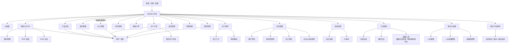
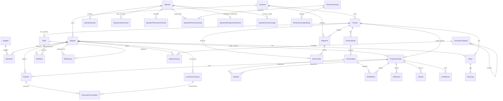
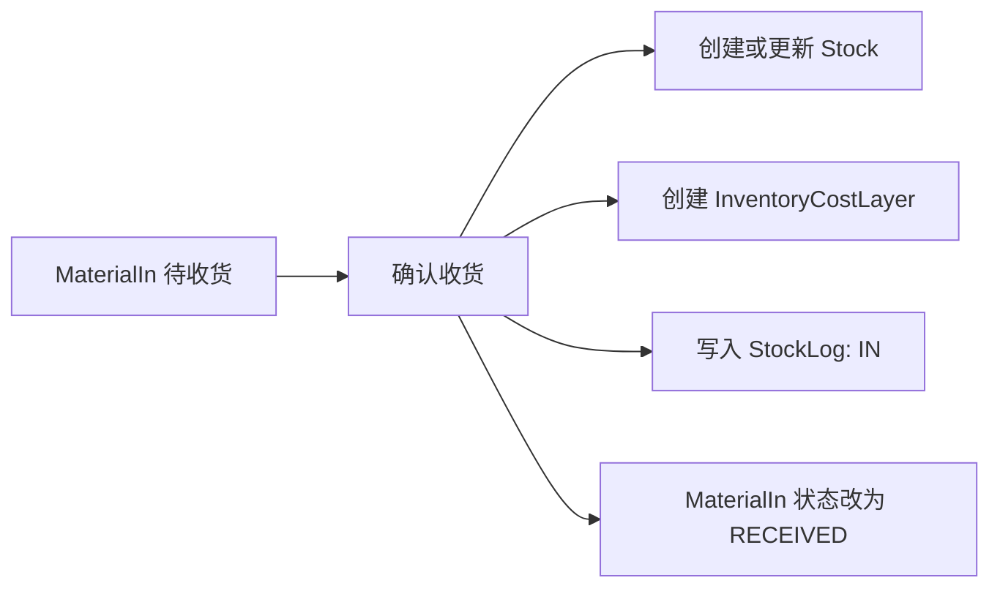
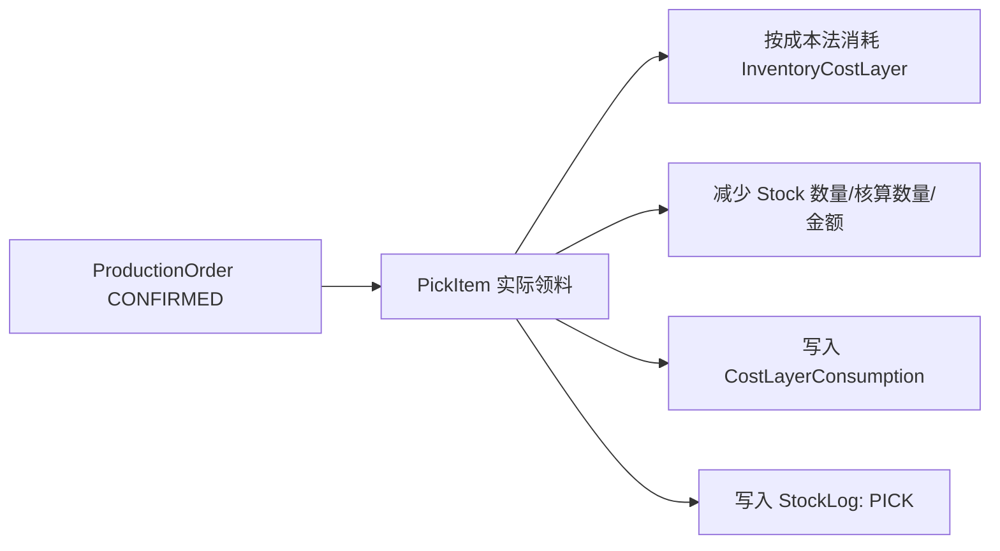
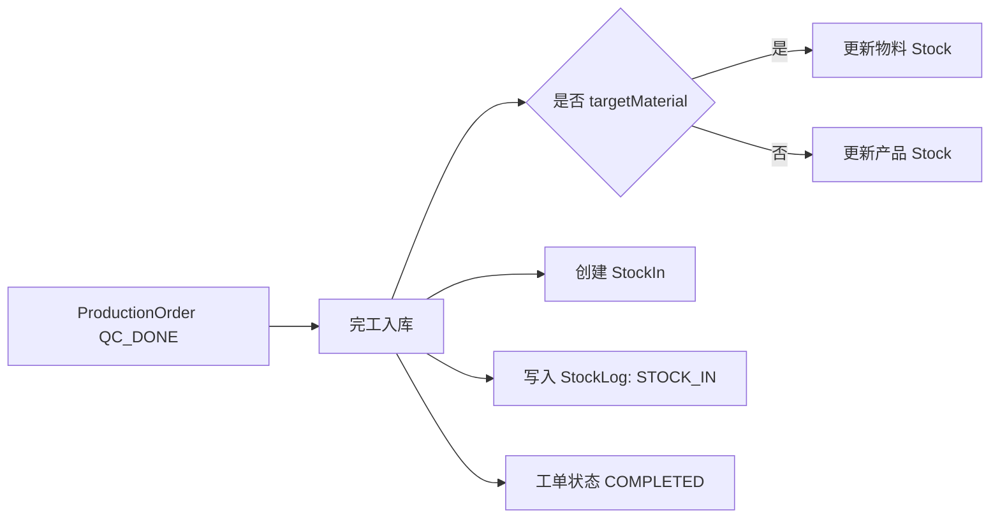
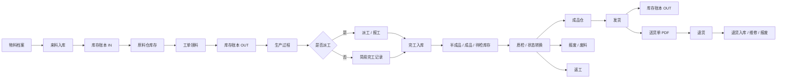

# MES-lite 当前系统建模与结构审查

本文基于当前工程代码、`prisma/schema.prisma`、前端页面入口和 API 路由整理。目标是先把系统真实结构建出来，再判断流程结构和数据结构是否存在问题。

审查日期：2026-07-27。

## 0. 文档维护规则

本文件不是一次性说明文档，而是随代码一起维护的系统模型。

后续任何代码修改，只要影响业务流程、数据模型、页面结构、接口契约、权限、审计、库存成本逻辑，都必须同步更新本文件中对应的流程图、数据结构图、问题清单或目标模型说明。

如果代码修改影响了更细的专题文档，也必须同步更新对应文档，例如：

- `docs/minierp/system-function-flow.md`
- `docs/minierp/data-model.md`
- `docs/minierp/domain-model.md`
- `docs/minierp/feature-model.md`
- `docs/minierp/界面开发规则.md`
- `docs/minierp/桌面端界面开发规范.md`
- `docs/minierp/移动端界面开发规范.md`
- `docs/minierp/响应式断点与验收矩阵.md`

提交或汇报时需要说明代码影响了哪些流程/模型，以及同步更新了哪些文档。

## 1. 总体结论

当前 MES-lite 是一个单体应用：

- 前端：Next.js App Router + React 页面组件。
- 后端：Next.js API Route。
- ORM：Prisma。
- 数据库：SQLite。
- 部署：Docker / Coolify。
- 存储：本地持久化目录中的 SQLite 与上传文件。

部署形态仍是单体，但代码所有权开始按领域垂直切片：工作台、生产、库存、业务配置、物料、BOM、系统设置、运维工具、文档、来料、身份权限和销售均通过 `modules/<domain>/index.ts` 提供公开入口。归档、审计、数据工具、业务设置、系统设置、加工工艺和物料路线已经从 1,949 行的 `SystemPage.tsx` 迁入对应模块，原页面降至 31 行纯分派层。生产工程写入 Schema 与事务规则已进入生产服务，派工页、流程转移页、契约和 HTTP client 也已迁入生产领域并不再直接访问接口；流程转移页从 591 行降至 485 行，其既有同物料、同数量、跨库位、总库存/总成本不变规则继续由事务回归验证。物料查询和写入事务进入物料服务，物料 API 从 549 行降至 73 行，双形态工具栏与 BOM 工作区拆出后主页面从 887 行降至 709 行，物料全景 API 从 412 行降至 20 行且聚合查询与附件分类分别进入服务，物料导入 API 从 398 行降至 36 行且 CSV 解析、单位校验、客户匹配和批量事务已分层；BOM API 从 464 行降至 45 行，结构校验、版本规则、资料查询和方案替换事务进入 BOM 模块，BOM 成本 API 从 340 行降至 45 行且成本输入、折算/分摊纯规则、查询装配和快照写入已分层，未注册的保留成本页也迁入 BOM 模块并从 720 行降至 490 行；物料全景页面从 1485 行降至 187 行；作业文档 API 从 551 行降至 78 行，主页面从 1497 行降至 591 行；来料 API 从 295 行降至 90 行，页面从 1679 行降至 684 行；库存契约、HTTP、格式规则、集合、详情、调整和一致性提示进入库存模块，协调页从 853 行降至 304 行，库存 API 从 449 行降至 79 行，查询、包装穿透、补齐/调整命令和余额一致性规则已分层；权限 API 从 350 行降至 79 行，人员 API 降至 41 行，人员和权限页面、client、输入契约、资源授权判断及管理事务进入身份权限模块；销售订单、发货和退货页面、client、契约和视图规则统一进入销售模块，三个页面均不再直接访问接口。旧生产日报页已退出应用壳，生产实绩只从生产订单详情进入；旧日报表与 API 暂为服务器历史数据保留。当前已无超过 800 行的页面和超过 300 行的 API；根级页面从 13 个降至 5 个，其中 `SystemPage` 是刻意保留的兼容分派层，自动边界校验继续阻止职责回流。

设备台账已进一步进入独立 `modules/equipment`：页面从 246 行降至 210 行，列表、工作中心候选、保存和归档统一通过领域 client；当前共有 13 个领域模块，根级页面降至 4 个，其中 `SystemPage` 是刻意保留的兼容分派层，真正待迁移领域页为 3 个。

员工档案已进入业务配置模块：页面从 263 行降至 214 行，读取和保存统一通过配置领域 client；员工仍是业务人员而非登录账号权限对象。当前根级页面降至 3 个，其中真正待迁移领域页为扫码打印和锯切成本。

业务配置参考资料已进一步统一访问边界：供应商/客户、库位、单位和文档类别共享配置领域契约与 HTTP client；工作中心虽保留配置菜单入口，但由设备领域独立拥有。所有页面继续复用公共 `ResourcePage` 或 `ResourcePageShell` 且不直接调用 `fetch`，未建立第二套配置骨架。

运维维护工具也已统一访问边界：归档、审计和数据工具共享维护契约与 HTTP client，归档九类记录的标签映射和时间排序成为独立纯规则，3 个页面不再直接调用 `fetch`。当前页面级直连请求仅余公共页内选项、生产订单和工作台。

页面访问层现已清零：公共页内选项通过能力注入读取业务单位目录，生产订单的列表/候选/详情/创建进入生产 client，订单分组和创建输入进入纯模型，工作台统计读取、旧字段归一化、指标装配和展示面板进入工作台模块。生产订单协调页从 535 行降至 448 行，工作台协调页从 397 行降至 74 行；所有 `*Page` / `*PageModule` 均不再直接调用 `fetch`，全局边界守卫阻止回流。

工作台服务端也已进入领域：生产流指标纯规则从扁平 `lib` 迁入 `modules/workspace/domain`，日/月时间窗口、并行统计、状态分布、待处理事项与库存预警过滤进入查询服务。仪表盘 API 从 141 行降至 17 行且不再直接访问 Prisma，工作台形成完整的 contracts/client/model/ui/domain/server 垂直切片。

生产订单主接口也已进入生产领域：创建 Schema、组号/行号纯规则、列表查询和创建/归档命令分别进入 contracts、domain 与 server。`/api/orders` 从 257 行降至 84 行，不再直接访问 Prisma 或持有 BOM 校验、物料映射和事务；临时完整 SQLite 回归覆盖多行原子创建、BOM 快照、空格分隔关键词查询和软归档，不接触本机测试库或服务器正式数据。

生产订单详情、候选、确认和取消也已收口：详情与候选装配进入查询服务，确认/取消状态规则进入纯领域函数，取消退料、成本恢复、总库存与库位预留释放进入独立状态事务服务。四个相邻 API 均降至 24 行以内且不再访问 Prisma；临时库回归覆盖重复确认/取消拒绝和取消后的库存、库位、领料明细一致性。

生产实绩服务端也已形成完整垂直切片：输入契约、BOM/成本层快照、日期编号、投入/多产出展开、订单累计、工作区/草稿服务及确认/冲销状态事务全部归 `modules/production`；原扁平 helper 已删除。四条实绩 API 均为 26–43 行薄适配层，直接访问 Prisma 的 API 从 82 个降至 78 个。临时库回归覆盖草稿、人员、库位、确认过账、成本、主/副产出、冲销恢复、删除和编号断档；本版本不改 Prisma Schema。

扫码打印与锯切成本现已进入 `modules/operations-tools`：页面分别降至 415 行和 363 行，标签/扫描器配置、HTTP client、请求契约、锯切材料/班次/规模计算与保存输入均拥有独立边界。根级 `*Page.tsx` 只剩 31 行的 `SystemPage` 兼容分派层，不再存在待迁移根级领域页；锯切核心计算由确定样例守卫，不依赖 React 或数据库即可回归。

通用附件现已进入独立 `modules/attachments`：契约、领域错误与存储规则、浏览器 client、查询服务和命令服务拥有单一代码所有权。附件主/草稿 API 分别从 291/88 行降至 102/53 行，六条附件路由不再直接访问 Prisma，页面和相邻领域不再重复附件请求；直接访问 Prisma 的 API 从 78 个降至 72 个。临时 SQLite 与临时文件目录回归覆盖上传、旋转、封面、归档接替、草稿绑定和取消清理；本版本不改 Prisma Schema。

销售服务端也已形成完整垂直切片：订单/调价/发货/退货输入契约、日期编号、定价、订单履约状态、查询、命令、状态事务和送货单 PDF 全部归 `modules/sales`；旧扁平销售订单 helper 已删除。16 条销售订单、发货和退货 API 均为 16–62 行薄适配层，直接访问 Prisma 的 API 从 72 条降至 56 条。临时完整 SQLite 回归覆盖默认价快照、受控调价、待发占用、分批发货、总库存/库位/成本扣减、送达、PDF、退货按原成本恢复、拒绝、独立发货、查询、归档和重复状态拒绝；本版本不改 Prisma Schema。

来料服务端现也覆盖完整生命周期：输入契约、日期编号、详情装配、待收货编辑、收货/拒收状态约束、总库存/库位/成本层过账和整单红冲恢复均归 `modules/receiving`。来料主路由及 4 条详情/状态路由均不再直接访问 Prisma，使直接访问 Prisma 的 API 从 56 条降至 52 条。临时完整 SQLite 回归覆盖多明细原子创建、编号断号、编辑、收货、重复状态拒绝、红冲恢复、成本层变更阻断、查询和归档；本版本不改 Prisma Schema。

派工服务端现也形成完整生产领域切片：创建 Schema、日期编号、五态流转、列表/详情查询、工单与工序校验、创建/归档和状态事务均归 `modules/production`。6 条派工 API 为 17–67 行薄适配层，使直接访问 Prisma 的 API 从 52 条降至 46 条。临时完整 SQLite 回归覆盖当日最大序号、工序归属、组合查询、派工、开工、完工、取消、归档和非法重复流转；本版本不改 Prisma Schema。

流程转移服务端现也形成完整生产领域切片：草稿/确认/冲销 Schema、业务日期编号、状态规则、工作区查询、草稿命令和库位确认/冲销事务均归 `modules/production`，旧扁平 helper 已删除。4 条流程转移 API 为 29–48 行薄适配层，使直接访问 Prisma 的 API 从 46 条降至 42 条。临时完整 SQLite 回归通过真实领域服务覆盖编号、查询、草稿编辑、来源库存、确认、冲销及总库存/成本层不变；本版本不改 Prisma Schema。

供应商与客户现已形成配置领域的参数化往来单位切片：前端继续共用 `PartySettingsPage`，服务端新增共同输入契约、资源定义、领域错误、资料服务和 HTTP 适配器。两条 Route Handler 各 6 行，只声明 `supplier` 或 `customer`；共同搜索、输入清理、排序、新增、更新、归档和审计不再复制，同时显式保留客户有效名称唯一、供应商允许同名但编码唯一的既有差异。直接访问 Prisma 的 API 从 42 条降至 40 条，14 个领域/平台模块共有 258 个 TypeScript 文件。临时完整 SQLite 回归不接触本机测试库或服务器正式数据；本版本不改 Prisma Schema。

库位服务端现也归入配置领域：输入 Schema、编码/默认状态纯规则、数量汇总查询、新增/更新和受保护归档事务均由 `modules/configuration` 所有。库位 API 从 156 行降至 84 行且不再访问 Prisma，使直接访问 Prisma 的 API 从 40 条降至 39 条；14 个领域/平台模块共有 263 个 TypeScript 文件。临时完整 SQLite 回归覆盖唯一默认库位、编码规范化、数量汇总、库存和待处理来料阻断、归档恢复及直接停用旁路封闭；本版本不改 Prisma Schema。

设备与工作中心现已形成同一设备领域的完整垂直切片：工作中心页面、契约、搜索模型和 client 从配置领域迁入 `modules/equipment`，业务配置只经设备模块公开入口挂载。设备与工作中心 Schema、查询、命令、有效归属、迁移、引用归档阻断、恢复和直接停用旁路封闭均由设备领域拥有，两条 API 从 139/135 行降至 84/85 行且不再直接访问 Prisma，使直接访问 Prisma 的 API 从 39 条降至 37 条；14 个领域/平台模块共有 272 个 TypeScript 文件。临时完整 SQLite 回归不接触本机测试库或服务器正式数据；本版本不改 Prisma Schema。

当前结构已经覆盖小微制造场景的主流程：物料、来料、库存、工单、派工、销售订单、发货、退货、产品文档、权限、审计。

当前入口已收敛为轻量生产业务模式：桌面导航按工作台、物料、生产、文档、设备、物流、销售、库存、业务配置、系统设置、工具、账号与权限划分。业务配置维护企业资料、业务主数据和业务规则；系统设置维护显示效果、AI 服务及后续系统集成，两者不再混在同一配置页。左侧可调宽辅助区显示当前一级分类下的功能页面；提供详情、BOM 等上下文功能的页面可在右侧打开可调宽辅助区，中央区域始终作为主显示区。低于 `1024px` 时统一使用移动端外壳；底部只保留四个可配置常用入口。归档记录、操作记录、数据工具与锯切成本、硬件工具归入“工具”；账号下拉菜单只显示当前身份、版本和退出登录。

工作台已增加账号级常用功能区，支持系统默认、按主动访问次数智能排序和自定义摆放；独立“所有功能”页按一级业务入口分组并搜索权限内全部页面。系统信息层级固定为一级业务入口、一级页面和可选二级详情/子页，不再扩展第三级业务页面。

主要问题不在“能不能用”，而在以下几个结构边界还不够清晰：

1. `Material` 是唯一用户侧物品主数据；`Product` 仅作为旧表兼容层存在，不再作为独立产品资料入口。
2. `Stock` 保留总库存和成本汇总；已增加可配置库位及主库存单位下的库位实物余额，但仓库、库存状态和批次余额维度仍未建模。
3. 产品文档已支持独立标题和结构化在线正文；成品物料关联改为可选，未绑定时表示通用文档。客户仍只从非空关联产品读取，不保存独立客户或适用工序。
4. 图片、PDF 和 Office 派生预览由服务器生成并保存在附件持久化目录，派生文件不是独立业务记录。物料图片保留原图，同时使用版本化 WebP 缩略图和展示图承担日常页面引用；客户端长缓存只负责加速。
5. 附件使用 `ownerType + ownerId` 弱关联，没有数据库外键约束。
6. 库存成本、库存流水、成本层已经有基础，但还不是完整库存台账模型。
7. 工单、BOM、发货、退货和成本表的数据库外键仍保留 `Product`，但所有新业务输入统一选择 `Material`，由后端自动映射到内部兼容 `Product`。
8. 产品文档被明确建模为通用资料，不与工艺路线或派工强绑定；产品全景图按物料展示明确关联该物料的全部文档。
9. 退货、红冲、库存调整还没有形成统一的库存调整/逆向业务模型。
10. 已增加 `WorkCenter` 与 `Equipment` 主数据，工艺文件可关联适用工作中心；班后实绩尚未保存实际设备和工艺文档版本快照，这是“人机料法环”闭环的下一缺口。
11. BOM 已升级为多方案/版本和基准批次模型；投入不限制为原材料，可使用半成品或已有产品表达二次加工。全部投入组成整批共同消耗，全部输出在同一批次同时产生，各行直接保存物料主库存单位数量，不再逐产出绑定投入或提供跨量纲转换模型。标准 BOM 不记录固定/百分比损耗，废料、废屑和可回收料作为明确产出。生产订单创建时显式选择启用 BOM 并冻结全部投入/产出快照，班后实绩按主产出计算批次倍数并统一过账。同物料的库位/流程状态变化继续使用独立 `FlowTransfer`。
12. 已增加独立 `Employee` 员工档案，数据库 `id`、系统自动生成且不可修改的业务员工编码、`Operator` 登录账号三者分离，并支持员工与账号可空的一对一绑定。一个注册账号最多绑定一名员工，绑定不改变账号状态、角色或权限；班后实绩通过关联表支持多名员工，流程转移关联一名员工并保存工号、姓名快照。

## 2. 当前功能模块图

当前一级业务分类增加“文档”和“销售”；“物流”保留来料管理，“销售”按销售订单、发货管理、退货管理组织完整出货闭环。


```mermaid
flowchart TB
  A["登录 / 注册 / 权限"] --> B["主业务工作台"]

  B --> M["仪表盘"]
  B --> C["物料与 BOM"]
  C --> C1["物料管理"]
  C --> C2["BOM 设置"]
  C --> C3["BOM 全览"]
  B --> D["产品文档"]
  B --> E["来料管理"]
  B --> F["生产订单"]
  B --> H["库存管理"]
  B --> S["销售订单"]
  B --> I["发货管理"]
  B --> J["退货管理"]
  F --> K["班后生产实绩"]
  B --> K2["流程转移"]
  B -.隐藏高级模块.-> G["派工管理"]

  B --> P["生产菜单"]
  P --> P1["加工工艺"]
  P --> P2["物料路线"]
  B --> Q["业务配置"]
  Q --> Q1["客户资料"]
  Q --> Q2["供应商资料"]
  Q --> Q3["员工资料"]
  Q --> Q4["企业与业务规则"]
  B --> R["系统设置"]
  R --> R1["显示设置"]
  R --> R2["AI 服务"]
  B --> T["工具菜单"]
  T --> T1["归档记录"]
  T --> T2["操作日志"]
  T --> T3["数据工具<br/>数据关系检查 / 物料编码规范化"]

  B --> O["账号与权限"]
  O --> O1["人员管理"]
  O --> O2["人员权限控制"]
  O --> O3["权限组控制"]
  B --> U["账号下拉菜单"]
  U --> U1["当前身份 / 版本 / 退出登录"]

  C --> N["附件 / 图片"]
  D --> N
  E --> N
  F --> N
  G --> N
  I --> N
  J --> N
```

## 3. 当前业务主流程


```mermaid
flowchart LR
  A["基础资料维护"] --> B["物料档案"]
  A --> C["客户 / 供应商"]
  A --> D["物料 BOM / 物料路线"]
  A --> E["BOM / 工艺路线"]
  A --> F["产品文档"]

  C --> G["来料管理"]
  B --> G
  G --> H["来料收货"]
  H --> I["库存增加"]
  H --> J["成本层生成"]

  D --> K["生产订单"]
  B --> K
  E --> K
  K --> L["领料"]
  L --> M["库存减少"]
  L --> N["成本层消耗"]

  K --> O["派工管理"]
  O --> P["开工 / 完工"]
  P --> Q["报工 / 质检"]
  Q --> R["产成品入库"]

  R --> S["发货管理"]
  S --> T["送货单 / PDF"]
  S --> U["库存减少"]

  T --> V["退货管理"]
  V --> W["返库 / 处理"]

  I --> X["库存管理"]
  M --> X
  R --> X
  U --> X
  W --> X

  X --> Y["统计分析"]
```

## 4. 当前数据结构总览


```mermaid
erDiagram
  Customer ||--o{ Material : owns
  Customer ||--o{ Product : owns
  Customer ||--o{ Shipment : receives

  Supplier ||--o{ MaterialIn : supplies

  Material ||--o{ MaterialIn : inbound
  Material ||--o| Stock : has
  Material ||--o{ BOMItem : consumed_by
  Material ||--o{ BOMOutput : produced_by
  Material ||--o{ PickItem : picked
  Material ||--o{ InventoryCostLayer : has_layers
  Material ||--o{ WorkInstruction : linked
  DocumentCategory ||--o{ WorkInstruction : classifies
  DocumentCategory ||--o{ DocumentCategory : contains
  Material ||--o{ ProductionOrder : target_material

  Product ||--o{ BOM : has_versions
  Product ||--o{ ProcessRoute : has
  Product ||--o| Stock : has
  Product ||--o{ ProductionOrder : target_product
  Product ||--o{ Shipment : shipped
  Product ||--o{ ReturnOrder : returned

  BOM ||--o{ BOMItem : contains
  BOM ||--o{ BOMOutput : produces
  ProcessRoute ||--o{ ProcessStep : contains
  ProcessStep ||--o{ Dispatch : dispatched
  ProcessStep ||--o{ WorkReport : reported

  ProductionOrder ||--o{ PickItem : picks
  ProductionOrder ||--o{ Dispatch : dispatches
  ProductionOrder ||--o{ WorkReport : reports
  ProductionOrder ||--o{ QCRecord : checks
  ProductionOrder ||--o{ StockIn : stock_in
  ProductionOrder ||--o{ CostRecord : costs

  PickItem ||--o{ CostLayerConsumption : consumes
  InventoryCostLayer ||--o{ CostLayerConsumption : consumed_by

  Stock ||--o{ StockLog : logs
  Shipment ||--o{ ReturnOrder : returns

  Operator ||--o{ OperatorSession : sessions
  Operator ||--o{ OperatorAuthAccount : auth_accounts
  Operator ||--o{ OperatorPermissionOverride : overrides
  Operator ||--o{ OperatorPermissionGroup : group_links
  Operator ||--o| OperatorWorkspacePreference : workspace_preference
  Operator ||--o{ OperatorFunctionUsage : function_usage

  PermissionGroup ||--o{ PermissionGroupSetting : settings
  PermissionGroup ||--o{ OperatorPermissionGroup : operators
```

## 5. 核心数据模型说明

### 5.1 基础资料

| 模型 | 作用 | 当前状态 |
| --- | --- | --- |
| `Customer` | 客户主数据 | 已实现软删除和服务器级人工顺序 |
| `Supplier` | 供应商主数据 | 已实现软删除和服务器级人工顺序；内部编码由服务端生成且业务界面不展示 |
| `Employee` | 业务员工档案 | 内部 `id` 不作业务输出；员工编码按 `EMP-000001` 自动生成、唯一且创建后不可修改；保存姓名、部门、电话、启用状态和人工顺序，可通过唯一 `operatorId` 绑定一个注册账号 |
| `Material` | 物料档案 | 定义主计量方式、主库存单位、可选参考/计价单位、成本法和图片附件；不保存标准长度 |
| `Product` | 内部兼容产品视图 | 不再作为用户侧主数据维护；由物料自动映射，兼容旧 BOM、工单、发货、退货和成本外键 |
| `BOM` / `BOMItem` / `BOMOutput` | 生产标准转换 | 以基准批次保存共同投入与同时产出；每种投入只出现一次，产出中有且只有一项主产出，不再使用方案类型 |
| `ProductionOrder` / `ProductionOrderActual` / 投入输出与员工明细 | 生产计划、冻结 BOM 与班后实绩 | 订单保存 BOM 版本及全部投入/产出快照；实绩按主产出计算批次倍数并展开整批投入，草稿校验库位与库存，确认/冲销原子更新库存、成本层和订单累计 |
| `DailyProductionReport` / `DailyProductionConsumption` / `DailyProductionReportEmployee` | 测试期旧生产过账 | 业务入口已移除，旧表暂留到每日盘点分片清理测试数据和旧代码 |
| `FlowTransfer` | 流程转移单 | 一个物料在不同来源/目标库位间按同一数量转移，并关联一名员工及其快照；支持草稿、确认、冲销，只改库位余额和流水，不改总库存或成本层 |
| 数据关系检查（服务层工具） | 关系完整性诊断与受控清理 | 扫描 BOM、兼容产品、生产耗用和有效成本层；安全修复或删除使用事务和审计，库存成本风险只提示人工处理 |
| `CostObject` / `CostObjectCost` | 成本对象与成本版本 | 支持把锯切等非库存成本纳入 BOM 成本计算 |
| `BomCostRun` / `BomCostRunLine` | BOM 成本计算快照 | 独立保存成本测算结果，不联动派工和库存 |
| `ProcessRoute` / `ProcessStep` | 物料工艺路线 | 数据库暂绑定内部兼容 `Product`，用户侧选择物料，派工绑定工序；路线支持服务器级人工顺序 |
| `DocumentCategory` | 产品文档类别 | 支持可配置的一级、二级类别；“作业指导书”是默认一级类别，可添加“机床作业、环境作业”等二级类别 |
| `WorkInstruction` | 在线文档 | 必须保存独立标题和文档类别，可选关联成品物料及多个工作中心；正文保存结构化 JSON 和搜索文本投影，也可维护通用文件附件 |

### 5.2 库存与成本

| 模型 | 作用 | 当前状态 |
| --- | --- | --- |
| `Stock` | 物料或内部兼容物料总库存 | 记录总量、双单位和成本；库位实物数量由 `StockLocationBalance` 分解，状态/批次仍未建模 |
| `InventoryLocation` / `StockLocationBalance` | 库位主数据与实物余额 | 来料、生产订单实绩、流程转移、发货和退货共用；库位支持服务器级人工顺序，各库位数量合计必须与 `Stock` 总量一致 |
| `StockLog` | 库存流水 | 已有数量、核算数量、金额字段 |
| `MaterialIn` | 来料单 | 记录件数、总长度、总重量、主库存/核算数量、米/kg/件计价单价、总价格、本批实际换算和状态 |
| `InventoryCostLayer` | FIFO 成本层 | 支持材料成本层 |
| `CostLayerConsumption` | 成本层消耗 | 绑定领料记录 |
| `StockIn` | 工单入库记录 | 表结构绑定工单和产品；入库接口会根据工单 `targetMaterial` 决定更新物料库存或产品库存 |

当前长度库存只做总件数、总长度和总重量汇总，不维护具体长度分布。未来需要查询各长度件数时，在来料批次下增加同长分组/包装明细即可，不在当前阶段建立单根实体。

### 5.3 生产与单据

| 模型 | 作用 | 当前状态 |
| --- | --- | --- |
| `ProductionOrder` | 工单 | 用户侧只选择 `Material`；`productId` 作为旧外键由系统自动创建/复用内部兼容记录 |
| `PickItem` | 领料 | 支持实际数量、核算数量、成本消耗 |
| `Dispatch` | 派工单 | 绑定工单和工序 |
| `WorkReport` | 报工 | 记录工人、时间、良品、不良、照片 |
| `QCRecord` | 质检 | 已有模型，但流程集成较弱 |
| `SalesOrder` / `SalesOrderItem` | 销售订单及明细 | 一张订单支持多个统一物料，保存客户、数量、单位、销售价来源与快照、已发数量和交付日期 |
| `Shipment` | 发货单 | 可独立创建，也可显式绑定已确认销售订单明细并继承客户、物料和单价；数据库暂绑定内部兼容产品，可输出含甲乙双方的发货单 PDF |
| `ReturnOrder` | 退货单 | 用户侧选择物料和退回库位，可绑定发货单；接受后按所选库位返库 |

### 5.4 系统能力

| 模型 | 作用 | 当前状态 |
| --- | --- | --- |
| `Operator` | 登录操作账号 | 支持注册审核、状态、角色和权限；可选被一个业务员工档案绑定，但权限仍独立维护 |
| `OperatorSession` | 登录会话 | 已实现 |
| `OperatorAuthAccount` | 第三方登录账号 | 为微信登录预留 |
| `PermissionSetting` | 角色权限 | 已实现基础角色权限 |
| `PermissionGroup` | 权限组 | 已实现组权限 |
| `OperatorPermissionOverride` | 人员单独赋权 | 已实现 |
| `OperatorWorkspacePreference` | 账号级工作台模式、布局和固定项 | 已实现 |
| `OperatorFunctionUsage` | 账号主动访问次数和最近使用时间 | 已实现 |
| `SystemSetting` | 系统级运行设置 | 保存物料编码自然排序、单位目录、单位人工顺序和 AI 页面配置；AI Key 只保存 AES-256-GCM 密文 |
| `AuditLog` | 操作日志 | 已有模型，需检查所有写操作覆盖率 |
| `DocumentAttachment` | 附件 | 通用附件模型，使用弱关联 |

人员权限的目标分组、页面入口、操作动作和权限资源拆分基线见 `docs/architecture/人员权限组与页面矩阵.md`。该矩阵当前仅用于评审，尚未写入系统预置权限；尤其是多个业务配置和系统维护页面仍共用 `system` 资源，完成资源拆分前不能据此直接批量赋权。

## 6. 当前结构优点

1. 已经具备小型 MES/ERP 的完整主链路。
2. 物料支持双单位和成本法，为库存核算打了基础。
3. 来料、领料、成本层、库存流水之间已有基础闭环。
4. 附件模型通用，可以承载原始凭证、物料图片、作业指导书。
5. 权限模型已经从角色扩展到权限组和人员覆盖。
6. 审计日志模型已经存在，适合后续补全操作追踪。
7. 软删除方向基本一致；业务页面仍只允许归档。系统管理对无有效业务引用的归档主数据、未生效单据，以及净影响已完整冲销的来料历史开放受保护的永久删除，用于释放误占用的唯一编码；`Product` 已退为内部兼容表，后续物理迁移外键时再处理其生命周期字段。

## 7. 当前结构问题与风险

| 编号 | 问题 | 风险 | 建议 |
| --- | --- | --- | --- |
| P1-01 | `Material` 和 `Product` 双模型并存 | 成品到底是物料还是产品容易混乱；BOM、发货、工单目标分裂 | 已收敛为用户侧统一物料；`Product` 仅保留为内部兼容视图，后续再物理迁移外键 |
| P1-02 | 库位已落地，仓库和库存状态仍缺失 | 已能区分配置库位，但尚不能表达待检、冻结、在制和废料状态 | 保留当前轻量库位模型，后续按真实需求增加仓库/库存状态，不把状态塞进物料分类 |
| P1-03 | 退货、红冲、调整未统一 | 逆向业务容易各自改库存，账目不统一 | 建立统一 `InventoryAdjustment` / `InventoryTransaction` 模型 |
| P1-04 | 附件弱关联 | 数据库无法防止附件孤儿数据 | 短期保留，增加附件清理检查；中期用服务层校验 owner 是否存在 |
| P1-05 | 作业指导书客户与物料客户双来源 | 已解决 | 文档不保存独立客户；关联产品非空时客户只从物料读取，通用文档无客户；全景图按 `materialId` 精确显示 |
| P1-06 | 物料业务通过自动 `Product` 映射 | 简易生产可用，但会产生 `MAT-物料编码` 的隐性兼容记录；后续统计和筛选容易重复 | 已禁止用户侧维护 Product；中期把旧外键迁移为真正的物料外键 |
| P2-01 | 产品文档是否应强绑定工艺 | 已决策 | 产品文档保持通用，不保存适用工序；使用可配置类别和备注表达范围，并在产品全景图展示全部相关文档 |
| P2-02 | 质检模型存在但流程弱 | 待检、返工、报废不能形成稳定闭环 | 增加质量结果与库存状态转换 |
| P2-03 | `StockLog` 和成本层不是完整台账 | 追溯某笔库存变化时可能需要跨多表拼 | 建立统一库存交易流水作为账本 |
| P2-04 | 审计日志覆盖率需要检查 | 部分写操作可能没有记录 | 对所有 POST/PUT/DELETE/状态流转 API 做审计覆盖清单 |
| P2-05 | `Shipment.customer` 字符串和 `customerId` 并存 | 客户名称可能和主数据不一致 | 明确字符串是快照字段，界面标注并保留主数据引用 |
| P2-06 | `Stock` 允许 `materialId` 或 `productId` 为空 | 数据库层不能强制“一条库存必须且只能对应一种库存对象” | 服务层增加创建校验；中期用统一物料库存对象消除这个分支 |
| P2-07 | `Product` 缺少软删除字段 | 内部兼容记录生命周期不完整 | 中期物理迁移旧外键，或仅在兼容层补齐归档字段 |
| P2-08 | 历史物料编码可能包含小写或空白 | 扫码、导入和人工查询的编码口径不一致 | 系统管理提供冲突预检后的事务化一次性转换；新数据持续规范后续单独确定 |
| P2-09 | 归档主数据持续占用唯一编码 | 误建或重复记录无法清理，阻塞编码规范化和重新建档 | 归档记录增加带引用检查、强确认和审计的永久删除；完整红冲且净影响为零的来料历史可安全级联清理，其他有效业务引用继续禁止 |
| P2-10 | 编码使用字符串排序时 `12` 排在 `2` 前 | 数字段位不同的物料编码不符合人工查找习惯 | 系统管理增加共享的数字自然排序开关；开启后物料列表和导出在分页前统一排序 |
| P2-11 | 物料单位变更后既有 BOM、兼容产品和有效成本层可能保留旧单位 | BOM 保存/生产耗用可能被阻断，跨量纲成本层不能仅改标签 | 数据工具增加持续关系检查；BOM/兼容产品可逐条同步或删除错误明细，日报失效指针只清空，非零成本层只报警并要求合法库存调整 |
| P3-01 | SQLite 适合早期，但并发有限 | 多用户高频操作后可能受限 | 后续可迁移 PostgreSQL |
| P3-02 | 多租户未建模 | 多公司/多客户独立实例只能靠部署隔离 | 若未来 SaaS 化，需要增加 `tenantId` |

## 8. 当前关键数据流审查

### 8.1 来料入库


```mermaid
flowchart LR
  A["MaterialIn 待收货"] --> B["确认收货"]
  B --> C["创建或更新 Stock"]
  B --> D["创建 InventoryCostLayer"]
  B --> E["写入 StockLog: IN"]
  B --> F["MaterialIn 状态改为 RECEIVED"]
```

判断：来料入库的数据闭环基本成立，数量、核算数量、金额、成本层都有记录。

主要风险：它直接写 `Stock` 和 `StockLog`，后续如果退货、红冲、库存调整各自也直接写库存，会形成多套库存变更逻辑。

### 8.2 工单领料


```mermaid
flowchart LR
  A["ProductionOrder CONFIRMED"] --> B["PickItem 实际领料"]
  B --> C["按成本法消耗 InventoryCostLayer"]
  B --> D["减少 Stock 数量/核算数量/金额"]
  B --> E["写入 CostLayerConsumption"]
  B --> F["写入 StockLog: PICK"]
```

判断：领料成本逻辑已经比简单扣数量更完整，具备 FIFO / 加权平均扩展基础。

主要风险：预留、实际扣减、成本层恢复、红冲、损耗调整需要统一规则，否则容易在异常流程里出现尾差或状态不一致。

### 8.3 工单入库


```mermaid
flowchart LR
  A["ProductionOrder QC_DONE"] --> B["完工入库"]
  B --> C{"是否 targetMaterial"}
  C -->|是| D["更新物料 Stock"]
  C -->|否| E["更新产品 Stock"]
  B --> F["创建 StockIn"]
  B --> G["写入 StockLog: STOCK_IN"]
  B --> H["工单状态 COMPLETED"]
```

判断：当前能支持标准产品工单和简易物料工单。

主要风险：`StockIn` 表仍绑定 `productId`，但实际库存可能写入 `materialId` 对应的 `Stock`。这会让“入库记录对象”和“库存对象”不完全一致，是后续统一物料模型时应优先处理的点。

## 9. 建议的目标数据模型方向

### 9.1 物料统一方向

建议长期采用：

```txt
Material
  + materialType       原料 / 辅材 / 成品 / 废料 / 包材 / 其他
  + lifecycleStatus    正常 / 归档
  + inventoryStatus    可用 / 待检 / 半成品 / 报废 / 隔离
  + customerId         最终客户
```

当前过渡期保留 `Product`，但必须明确：

```txt
Product = 面向旧外键的内部兼容视图，不作为用户侧资料
Material = 统一库存对象
Product.sku = MAT-物料编码 或历史同编码，用于临时匹配物料
```

这样可以避免“成品到底在 Product 还是 Material”这个长期问题。

一次性物料编码规范化会同步上述两类兼容 `Product.sku`。历史单据中的编码快照保留原值，不作为主数据回写目标；若规范化后的物料编码或产品编码冲突，则整批事务不执行。

### 9.2 库存账本方向

建议中期建立统一库存账本：

```txt
InventoryTransaction
  id
  materialId / productId
  warehouseId
  locationId
  inventoryStatus
  direction        IN / OUT / ADJUST / TRANSFER
  stockQty
  valuationQty
  costAmount
  sourceType       MATERIAL_IN / PICK / STOCK_IN / SHIPMENT / RETURN / ADJUSTMENT
  sourceId
  createdBy
  createdAt
```

当前 `StockLog` 可以视为早期版本；后续应逐步升级为完整库存交易流水。

### 9.3 库位与状态方向

建议不要一开始做复杂 WMS，但需要最小模型：

```txt
Warehouse
  原料仓 / 成品仓 / 待检区 / 半成品区 / 废料区

InventoryBalance
  materialId
  warehouseId
  inventoryStatus
  qty
  valuationQty
  totalCost
```

这样能支持：

- 原料仓领料。
- 工单完工进入半成品或成品仓。
- 待检品隔离。
- 报废转废料。
- 发货只能从成品仓扣减。

## 10. 建议的业务流程目标


```mermaid
flowchart LR
  A["物料档案"] --> B["来料入库"]
  B --> C["库存账本 IN"]
  C --> D["原料仓库存"]

  D --> E["工单领料"]
  E --> F["库存账本 OUT"]
  F --> G["生产过程"]

  G --> H{"是否派工"}
  H -->|是| I["派工 / 报工"]
  H -->|否| J["简易完工记录"]

  I --> K["完工入库"]
  J --> K
  K --> L["半成品 / 成品 / 待检库存"]

  L --> M["质检 / 状态转换"]
  M --> N["成品仓"]
  M --> O["报废 / 废料"]
  M --> P["返工"]

  N --> Q["发货"]
  Q --> R["库存账本 OUT"]
  Q --> S["送货单 PDF"]

  S --> T["退货"]
  T --> U["退货入库 / 维修 / 报废"]
```

## 11. 优先改进顺序

### 第一阶段：先建模和统一规则

1. 明确 `Material` 与 `Product` 的边界。
2. 明确库存状态和库位的最小模型。
3. 保持文档独立标题、可配置类别、结构化正文和可选成品物料关联，工序适用范围不使用自由文本关系字段。
4. 明确所有库存变化必须通过统一库存流水。
5. 明确 `Product` 是否作为销售/BOM视图保留，以及是否必须指向一个成品物料。

### 第二阶段：补齐库存与单据闭环

1. 增加库存调整单。
2. 增加库位/库存状态。
3. 将退货、红冲、报废统一接入库存交易流水。
4. 补齐发货扣库存、退货返库、工单完工入库的账本记录。

### 第三阶段：流程体验优化

1. 物料全景视图继续作为核心查询入口。
2. 产品全景图完整展示该物料的全部产品文档及其一级/二级类别。
3. 桌面端和移动端按独立规范重构。
4. 增加响应式模拟测试。

## 12. 当前判断

当前系统结构可以继续开发，不需要推倒重来。

但在继续增加业务功能前，建议先确认三件事：

1. 是否正式把“所有库存对象统一为物料”作为长期方向。
2. 是否开始引入最小库位/库存状态模型。
3. 是否将所有库存变化统一收敛到库存交易流水。

这三件事决定后，后续来料、生产、发货、退货、报废、待检、半成品都会更容易闭环。
