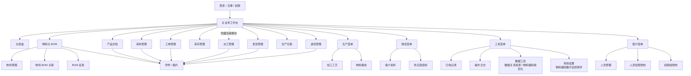
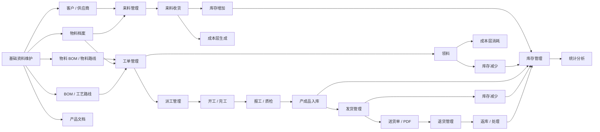
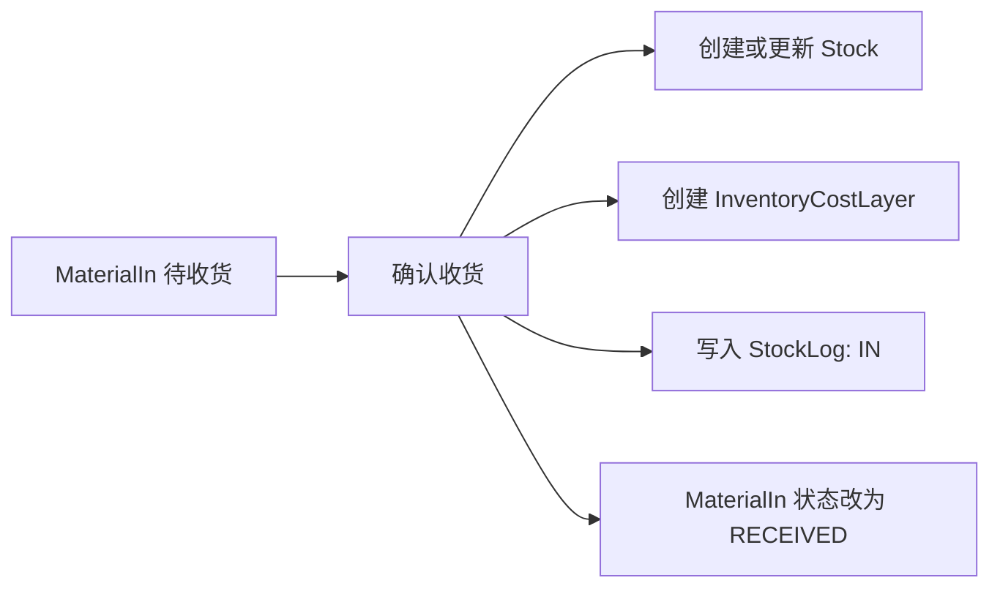
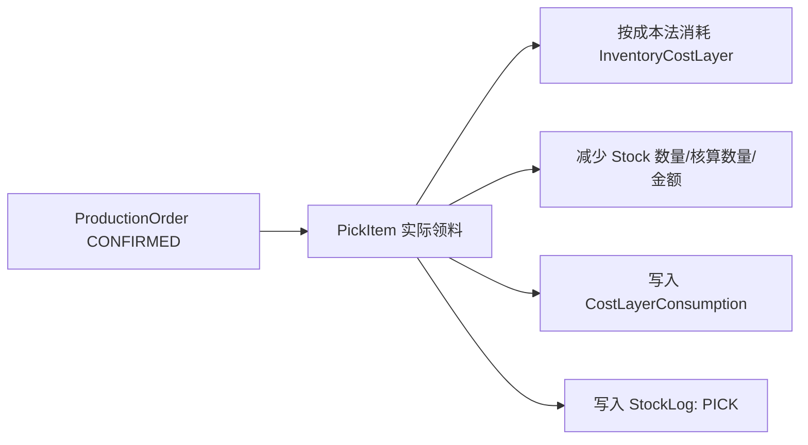
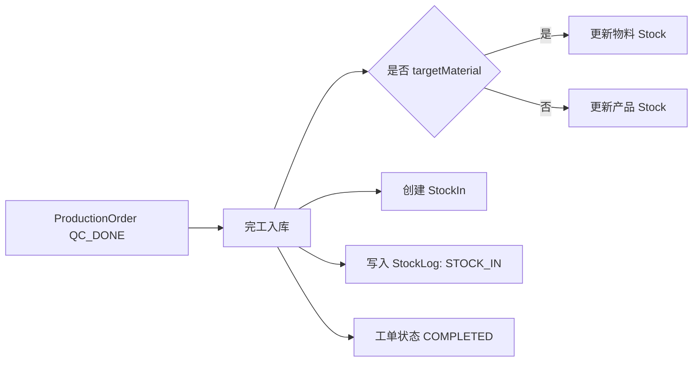
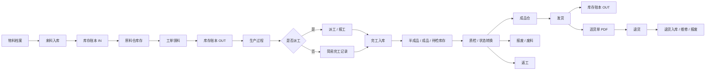

# MES-lite 当前系统建模与结构审查

本文基于当前工程代码、`prisma/schema.prisma`、前端页面入口和 API 路由整理。目标是先把系统真实结构建出来，再判断流程结构和数据结构是否存在问题。

审查日期：2026-07-27。

## 0. 文档维护规则

本文件不是一次性说明文档，而是随代码一起维护的系统模型。

后续任何代码修改，只要影响业务流程、数据模型、页面结构、接口契约、权限、审计、库存成本逻辑，都必须同步更新本文件中对应的流程图、数据结构图、问题清单或目标模型说明。

如果代码修改影响了更细的专题文档，也必须同步更新对应文档，例如：

- `docs/minierp/system-function-flow.md`
- `docs/minierp/data-model.md`
- `docs/minierp/domain-model.md`
- `docs/minierp/feature-model.md`
- `docs/minierp/界面开发规则.md`
- `docs/minierp/桌面端界面开发规范.md`
- `docs/minierp/移动端界面开发规范.md`
- `docs/minierp/响应式断点与验收矩阵.md`

提交或汇报时需要说明代码影响了哪些流程/模型，以及同步更新了哪些文档。

## 1. 总体结论

当前 MES-lite 是一个单体应用：

- 前端：Next.js App Router + React 页面组件。
- 后端：Next.js API Route。
- ORM：Prisma。
- 数据库：SQLite。
- 部署：Docker / Coolify。
- 存储：本地持久化目录中的 SQLite 与上传文件。

当前结构已经覆盖小微制造场景的主流程：物料、来料、库存、工单、派工、发货、退货、产品文档、权限、审计。

当前入口已收敛为轻量生产业务模式：桌面顶部基础导航按工作台、物料、生产、物流、库存、工具划分，左侧可调宽辅助区显示当前一级分类下的功能页面；提供详情、BOM 等上下文功能的页面可在右侧打开可调宽辅助区，中央区域始终作为主显示区。`640–1023px` 使用“一级域 · 当前页”顶部弹出菜单且不显示底部导航；小于 `640px` 时顶部只显示当前页标题，页面切换统一交给底部常用入口和“更多”，避免重复导航。“物料”下设物料管理、物料 BOM 关联和 BOM 反查；重复的“BOM 关系设定”页已移除。加工工艺、物料路线归入“生产”；客户、供应商资料归入“物流”；归档记录、操作记录、数据工具、系统设置与原有锯切成本、硬件工具共同归入“工具”。右上角账户菜单只保留人员管理和权限配置。硬件工具先独立提供 Honeywell 1900 扫码计数与 PC310T 标签测试打印，不与发货单、库存或生产状态联动。派工管理作为隐藏高级模块，不再作为小微企业第一阶段主流程入口。

主要问题不在“能不能用”，而在以下几个结构边界还不够清晰：

1. `Material` 是唯一用户侧物品主数据；`Product` 仅作为旧表兼容层存在，不再作为独立产品资料入口。
2. `Stock` 只有总库存，没有库位、库存状态、批次维度。
3. 产品文档已改为必选成品物料，不再保存独立编码、标题、客户和适用工序；通用说明统一使用备注。
4. 产品文档图片/PDF 缩略图由服务器生成并保存在附件持久化目录，列表、详情与全景图复用；缩略图不是独立业务记录。
5. 附件使用 `ownerType + ownerId` 弱关联，没有数据库外键约束。
6. 库存成本、库存流水、成本层已经有基础，但还不是完整库存台账模型。
7. 工单、BOM、发货、退货和成本表的数据库外键仍保留 `Product`，但所有新业务输入统一选择 `Material`，由后端自动映射到内部兼容 `Product`。
8. 产品文档被明确建模为通用资料，不与工艺路线或派工强绑定；产品全景图按物料展示全部相关文档。
9. 退货、红冲、库存调整还没有形成统一的库存调整/逆向业务模型。

## 2. 当前功能模块图


```mermaid
flowchart TB
  A["登录 / 注册 / 权限"] --> B["主业务工作台"]

  B --> M["仪表盘"]
  B --> C["物料与 BOM"]
  C --> C1["物料管理"]
  C --> C2["物料 BOM 关联"]
  C --> C3["BOM 反查"]
  B --> D["产品文档"]
  B --> E["来料管理"]
  B --> F["工单管理"]
  B --> H["库存管理"]
  B --> I["发货管理"]
  B --> J["退货管理"]
  B --> K["生产日报"]
  B -.隐藏高级模块.-> G["派工管理"]

  B --> P["生产菜单"]
  P --> P1["加工工艺"]
  P --> P2["物料路线"]
  B --> Q["物流菜单"]
  Q --> Q1["客户资料"]
  Q --> Q2["供应商资料"]
  B --> T["工具菜单"]
  T --> T1["归档记录"]
  T --> T2["操作日志"]
  T --> T3["数据工具<br/>数据关系检查 / 物料编码规范化"]
  T --> T4["系统设置<br/>物料编码数字自然排序"]

  B --> O["账户菜单"]
  O --> O1["人员管理"]
  O --> O2["人员权限控制"]
  O --> O3["权限组控制"]

  C --> N["附件 / 图片"]
  D --> N
  E --> N
  F --> N
  G --> N
  I --> N
  J --> N
```

## 3. 当前业务主流程


```mermaid
flowchart LR
  A["基础资料维护"] --> B["物料档案"]
  A --> C["客户 / 供应商"]
  A --> D["物料 BOM / 物料路线"]
  A --> E["BOM / 工艺路线"]
  A --> F["产品文档"]

  C --> G["来料管理"]
  B --> G
  G --> H["来料收货"]
  H --> I["库存增加"]
  H --> J["成本层生成"]

  D --> K["工单管理"]
  B --> K
  E --> K
  K --> L["领料"]
  L --> M["库存减少"]
  L --> N["成本层消耗"]

  K --> O["派工管理"]
  O --> P["开工 / 完工"]
  P --> Q["报工 / 质检"]
  Q --> R["产成品入库"]

  R --> S["发货管理"]
  S --> T["送货单 / PDF"]
  S --> U["库存减少"]

  T --> V["退货管理"]
  V --> W["返库 / 处理"]

  I --> X["库存管理"]
  M --> X
  R --> X
  U --> X
  W --> X

  X --> Y["统计分析"]
```

## 4. 当前数据结构总览


```mermaid
erDiagram
  Customer ||--o{ Material : owns
  Customer ||--o{ Product : owns
  Customer ||--o{ Shipment : receives

  Supplier ||--o{ MaterialIn : supplies

  Material ||--o{ MaterialIn : inbound
  Material ||--o| Stock : has
  Material ||--o{ BOMItem : consumed_by
  Material ||--o{ PickItem : picked
  Material ||--o{ InventoryCostLayer : has_layers
  Material ||--o{ WorkInstruction : linked
  DocumentCategory ||--o{ WorkInstruction : classifies
  DocumentCategory ||--o{ DocumentCategory : contains
  Material ||--o{ ProductionOrder : target_material

  Product ||--o| BOM : has
  Product ||--o{ ProcessRoute : has
  Product ||--o| Stock : has
  Product ||--o{ ProductionOrder : target_product
  Product ||--o{ Shipment : shipped
  Product ||--o{ ReturnOrder : returned

  BOM ||--o{ BOMItem : contains
  ProcessRoute ||--o{ ProcessStep : contains
  ProcessStep ||--o{ Dispatch : dispatched
  ProcessStep ||--o{ WorkReport : reported

  ProductionOrder ||--o{ PickItem : picks
  ProductionOrder ||--o{ Dispatch : dispatches
  ProductionOrder ||--o{ WorkReport : reports
  ProductionOrder ||--o{ QCRecord : checks
  ProductionOrder ||--o{ StockIn : stock_in
  ProductionOrder ||--o{ CostRecord : costs

  PickItem ||--o{ CostLayerConsumption : consumes
  InventoryCostLayer ||--o{ CostLayerConsumption : consumed_by

  Stock ||--o{ StockLog : logs
  Shipment ||--o{ ReturnOrder : returns

  Operator ||--o{ OperatorSession : sessions
  Operator ||--o{ OperatorAuthAccount : auth_accounts
  Operator ||--o{ OperatorPermissionOverride : overrides
  Operator ||--o{ OperatorPermissionGroup : group_links

  PermissionGroup ||--o{ PermissionGroupSetting : settings
  PermissionGroup ||--o{ OperatorPermissionGroup : operators
```

## 5. 核心数据模型说明

### 5.1 基础资料

| 模型 | 作用 | 当前状态 |
| --- | --- | --- |
| `Customer` | 客户主数据 | 已实现软删除 |
| `Supplier` | 供应商主数据 | 已实现软删除 |
| `Material` | 物料档案 | 定义主计量方式、主库存单位、可选参考/计价单位、成本法和图片附件；不保存标准长度 |
| `Product` | 内部兼容产品视图 | 不再作为用户侧主数据维护；由物料自动映射，兼容旧 BOM、工单、发货、退货和成本外键 |
| `BOM` / `BOMItem` | 物料组成与标准耗用 | `MATERIAL` 项保存对应原料及每一成品主单位的单位消耗量，显示原料主库存单位/成品主单位 |
| `DailyProductionReport` / `DailyProductionConsumption` | 生产日报与耗用快照 | 按总加工数量和 BOM 单位消耗量计算基准耗用，保存固定/百分比损耗、计算耗用、实际耗用及库存成本换算 |
| 数据关系检查（服务层工具） | 关系完整性诊断与受控清理 | 扫描 BOM、兼容产品、生产耗用和有效成本层；安全修复或删除使用事务和审计，库存成本风险只提示人工处理 |
| `CostObject` / `CostObjectCost` | 成本对象与成本版本 | 支持把锯切等非库存成本纳入 BOM 成本计算 |
| `BomCostRun` / `BomCostRunLine` | BOM 成本计算快照 | 独立保存成本测算结果，不联动派工和库存 |
| `ProcessRoute` / `ProcessStep` | 物料工艺路线 | 数据库暂绑定内部兼容 `Product`，用户侧选择物料，派工绑定工序 |
| `DocumentCategory` | 产品文档类别 | 支持可配置的一级、二级类别；“作业指导书”是默认一级类别，可添加“机床作业、环境作业”等二级类别 |
| `WorkInstruction` | 产品文档 | 必须直接关联成品物料和文档类别，维护图片/PDF；不保存独立编码、标题、客户和适用工序，通用说明使用备注 |

### 5.2 库存与成本

| 模型 | 作用 | 当前状态 |
| --- | --- | --- |
| `Stock` | 物料或内部兼容物料总库存 | 只记录总量，不记录库位/状态/批次 |
| `StockLog` | 库存流水 | 已有数量、核算数量、金额字段 |
| `MaterialIn` | 来料单 | 长度型物料记录根数、总长度/单根长度录入模式、总重量、本批实际换算、价格和状态 |

当前长度库存只做总根数、总长度和总重量汇总，不维护具体长度分布。未来需要查询各长度根数时，在来料批次下增加同长分组/包装明细即可，不在当前阶段建立单根实体。
| `InventoryCostLayer` | FIFO 成本层 | 支持材料成本层 |
| `CostLayerConsumption` | 成本层消耗 | 绑定领料记录 |
| `StockIn` | 工单入库记录 | 表结构绑定工单和产品；入库接口会根据工单 `targetMaterial` 决定更新物料库存或产品库存 |

### 5.3 生产与单据

| 模型 | 作用 | 当前状态 |
| --- | --- | --- |
| `ProductionOrder` | 工单 | 用户侧只选择 `Material`；`productId` 作为旧外键由系统自动创建/复用内部兼容记录 |
| `PickItem` | 领料 | 支持实际数量、核算数量、成本消耗 |
| `Dispatch` | 派工单 | 绑定工单和工序 |
| `WorkReport` | 报工 | 记录工人、时间、良品、不良、照片 |
| `QCRecord` | 质检 | 已有模型，但流程集成较弱 |
| `Shipment` | 发货单 | 用户侧选择物料和客户；数据库暂绑定内部兼容产品，可输出送货单 |
| `ReturnOrder` | 退货单 | 用户侧选择物料，可绑定发货单；库存处理仍需完善 |

### 5.4 系统能力

| 模型 | 作用 | 当前状态 |
| --- | --- | --- |
| `Operator` | 操作人员 | 支持注册审核、状态、角色 |
| `OperatorSession` | 登录会话 | 已实现 |
| `OperatorAuthAccount` | 第三方登录账号 | 为微信登录预留 |
| `PermissionSetting` | 角色权限 | 已实现基础角色权限 |
| `PermissionGroup` | 权限组 | 已实现组权限 |
| `OperatorPermissionOverride` | 人员单独赋权 | 已实现 |
| `SystemSetting` | 系统级运行设置 | 当前保存物料编码数字自然排序开关，所有客户端共享 |
| `AuditLog` | 操作日志 | 已有模型，需检查所有写操作覆盖率 |
| `DocumentAttachment` | 附件 | 通用附件模型，使用弱关联 |

## 6. 当前结构优点

1. 已经具备小型 MES/ERP 的完整主链路。
2. 物料支持双单位和成本法，为库存核算打了基础。
3. 来料、领料、成本层、库存流水之间已有基础闭环。
4. 附件模型通用，可以承载原始凭证、物料图片、作业指导书。
5. 权限模型已经从角色扩展到权限组和人员覆盖。
6. 审计日志模型已经存在，适合后续补全操作追踪。
7. 软删除方向基本一致；业务页面仍只允许归档。系统管理对无有效业务引用的归档主数据、未生效单据，以及净影响已完整冲销的来料历史开放受保护的永久删除，用于释放误占用的唯一编码；`Product` 已退为内部兼容表，后续物理迁移外键时再处理其生命周期字段。

## 7. 当前结构问题与风险

| 编号 | 问题 | 风险 | 建议 |
| --- | --- | --- | --- |
| P1-01 | `Material` 和 `Product` 双模型并存 | 成品到底是物料还是产品容易混乱；BOM、发货、工单目标分裂 | 已收敛为用户侧统一物料；`Product` 仅保留为内部兼容视图，后续再物理迁移外键 |
| P1-02 | `Stock` 只有总库存 | 无法区分成品仓、待检、半成品、废料、库位 | 增加 `Warehouse`、`StockLocation`、`InventoryBalance` 或库存状态维度 |
| P1-03 | 退货、红冲、调整未统一 | 逆向业务容易各自改库存，账目不统一 | 建立统一 `InventoryAdjustment` / `InventoryTransaction` 模型 |
| P1-04 | 附件弱关联 | 数据库无法防止附件孤儿数据 | 短期保留，增加附件清理检查；中期用服务层校验 owner 是否存在 |
| P1-05 | 作业指导书客户与物料客户双来源 | 已解决 | 产品文档必须直接绑定成品物料，客户只从物料读取；全景图按 `materialId` 精确显示 |
| P1-06 | 物料业务通过自动 `Product` 映射 | 简易生产可用，但会产生 `MAT-物料编码` 的隐性兼容记录；后续统计和筛选容易重复 | 已禁止用户侧维护 Product；中期把旧外键迁移为真正的物料外键 |
| P2-01 | 产品文档是否应强绑定工艺 | 已决策 | 产品文档保持通用，不保存适用工序；使用可配置类别和备注表达范围，并在产品全景图展示全部相关文档 |
| P2-02 | 质检模型存在但流程弱 | 待检、返工、报废不能形成稳定闭环 | 增加质量结果与库存状态转换 |
| P2-03 | `StockLog` 和成本层不是完整台账 | 追溯某笔库存变化时可能需要跨多表拼 | 建立统一库存交易流水作为账本 |
| P2-04 | 审计日志覆盖率需要检查 | 部分写操作可能没有记录 | 对所有 POST/PUT/DELETE/状态流转 API 做审计覆盖清单 |
| P2-05 | `Shipment.customer` 字符串和 `customerId` 并存 | 客户名称可能和主数据不一致 | 明确字符串是快照字段，界面标注并保留主数据引用 |
| P2-06 | `Stock` 允许 `materialId` 或 `productId` 为空 | 数据库层不能强制“一条库存必须且只能对应一种库存对象” | 服务层增加创建校验；中期用统一物料库存对象消除这个分支 |
| P2-07 | `Product` 缺少软删除字段 | 内部兼容记录生命周期不完整 | 中期物理迁移旧外键，或仅在兼容层补齐归档字段 |
| P2-08 | 历史物料编码可能包含小写或空白 | 扫码、导入和人工查询的编码口径不一致 | 系统管理提供冲突预检后的事务化一次性转换；新数据持续规范后续单独确定 |
| P2-09 | 归档主数据持续占用唯一编码 | 误建或重复记录无法清理，阻塞编码规范化和重新建档 | 归档记录增加带引用检查、强确认和审计的永久删除；完整红冲且净影响为零的来料历史可安全级联清理，其他有效业务引用继续禁止 |
| P2-10 | 编码使用字符串排序时 `12` 排在 `2` 前 | 数字段位不同的物料编码不符合人工查找习惯 | 系统管理增加共享的数字自然排序开关；开启后物料列表和导出在分页前统一排序 |
| P2-11 | 物料单位变更后既有 BOM、兼容产品和有效成本层可能保留旧单位 | BOM 保存/生产耗用可能被阻断，跨量纲成本层不能仅改标签 | 数据工具增加持续关系检查；BOM/兼容产品可逐条同步或删除错误明细，日报失效指针只清空，非零成本层只报警并要求合法库存调整 |
| P3-01 | SQLite 适合早期，但并发有限 | 多用户高频操作后可能受限 | 后续可迁移 PostgreSQL |
| P3-02 | 多租户未建模 | 多公司/多客户独立实例只能靠部署隔离 | 若未来 SaaS 化，需要增加 `tenantId` |

## 8. 当前关键数据流审查

### 8.1 来料入库


```mermaid
flowchart LR
  A["MaterialIn 待收货"] --> B["确认收货"]
  B --> C["创建或更新 Stock"]
  B --> D["创建 InventoryCostLayer"]
  B --> E["写入 StockLog: IN"]
  B --> F["MaterialIn 状态改为 RECEIVED"]
```

判断：来料入库的数据闭环基本成立，数量、核算数量、金额、成本层都有记录。

主要风险：它直接写 `Stock` 和 `StockLog`，后续如果退货、红冲、库存调整各自也直接写库存，会形成多套库存变更逻辑。

### 8.2 工单领料


```mermaid
flowchart LR
  A["ProductionOrder CONFIRMED"] --> B["PickItem 实际领料"]
  B --> C["按成本法消耗 InventoryCostLayer"]
  B --> D["减少 Stock 数量/核算数量/金额"]
  B --> E["写入 CostLayerConsumption"]
  B --> F["写入 StockLog: PICK"]
```

判断：领料成本逻辑已经比简单扣数量更完整，具备 FIFO / 加权平均扩展基础。

主要风险：预留、实际扣减、成本层恢复、红冲、损耗调整需要统一规则，否则容易在异常流程里出现尾差或状态不一致。

### 8.3 工单入库


```mermaid
flowchart LR
  A["ProductionOrder QC_DONE"] --> B["完工入库"]
  B --> C{"是否 targetMaterial"}
  C -->|是| D["更新物料 Stock"]
  C -->|否| E["更新产品 Stock"]
  B --> F["创建 StockIn"]
  B --> G["写入 StockLog: STOCK_IN"]
  B --> H["工单状态 COMPLETED"]
```

判断：当前能支持标准产品工单和简易物料工单。

主要风险：`StockIn` 表仍绑定 `productId`，但实际库存可能写入 `materialId` 对应的 `Stock`。这会让“入库记录对象”和“库存对象”不完全一致，是后续统一物料模型时应优先处理的点。

## 9. 建议的目标数据模型方向

### 9.1 物料统一方向

建议长期采用：

```txt
Material
  + materialType       原料 / 辅材 / 成品 / 废料 / 包材 / 其他
  + lifecycleStatus    正常 / 归档
  + inventoryStatus    可用 / 待检 / 半成品 / 报废 / 隔离
  + customerId         最终客户
```

当前过渡期保留 `Product`，但必须明确：

```txt
Product = 面向旧外键的内部兼容视图，不作为用户侧资料
Material = 统一库存对象
Product.sku = MAT-物料编码 或历史同编码，用于临时匹配物料
```

这样可以避免“成品到底在 Product 还是 Material”这个长期问题。

一次性物料编码规范化会同步上述两类兼容 `Product.sku`。历史单据中的编码快照保留原值，不作为主数据回写目标；若规范化后的物料编码或产品编码冲突，则整批事务不执行。

### 9.2 库存账本方向

建议中期建立统一库存账本：

```txt
InventoryTransaction
  id
  materialId / productId
  warehouseId
  locationId
  inventoryStatus
  direction        IN / OUT / ADJUST / TRANSFER
  stockQty
  valuationQty
  costAmount
  sourceType       MATERIAL_IN / PICK / STOCK_IN / SHIPMENT / RETURN / ADJUSTMENT
  sourceId
  createdBy
  createdAt
```

当前 `StockLog` 可以视为早期版本；后续应逐步升级为完整库存交易流水。

### 9.3 库位与状态方向

建议不要一开始做复杂 WMS，但需要最小模型：

```txt
Warehouse
  原料仓 / 成品仓 / 待检区 / 半成品区 / 废料区

InventoryBalance
  materialId
  warehouseId
  inventoryStatus
  qty
  valuationQty
  totalCost
```

这样能支持：

- 原料仓领料。
- 工单完工进入半成品或成品仓。
- 待检品隔离。
- 报废转废料。
- 发货只能从成品仓扣减。

## 10. 建议的业务流程目标


```mermaid
flowchart LR
  A["物料档案"] --> B["来料入库"]
  B --> C["库存账本 IN"]
  C --> D["原料仓库存"]

  D --> E["工单领料"]
  E --> F["库存账本 OUT"]
  F --> G["生产过程"]

  G --> H{"是否派工"}
  H -->|是| I["派工 / 报工"]
  H -->|否| J["简易完工记录"]

  I --> K["完工入库"]
  J --> K
  K --> L["半成品 / 成品 / 待检库存"]

  L --> M["质检 / 状态转换"]
  M --> N["成品仓"]
  M --> O["报废 / 废料"]
  M --> P["返工"]

  N --> Q["发货"]
  Q --> R["库存账本 OUT"]
  Q --> S["送货单 PDF"]

  S --> T["退货"]
  T --> U["退货入库 / 维修 / 报废"]
```

## 11. 优先改进顺序

### 第一阶段：先建模和统一规则

1. 明确 `Material` 与 `Product` 的边界。
2. 明确库存状态和库位的最小模型。
3. 保持产品文档只关联成品物料和可配置类别，工序适用范围统一写入备注。
4. 明确所有库存变化必须通过统一库存流水。
5. 明确 `Product` 是否作为销售/BOM视图保留，以及是否必须指向一个成品物料。

### 第二阶段：补齐库存与单据闭环

1. 增加库存调整单。
2. 增加库位/库存状态。
3. 将退货、红冲、报废统一接入库存交易流水。
4. 补齐发货扣库存、退货返库、工单完工入库的账本记录。

### 第三阶段：流程体验优化

1. 物料全景视图继续作为核心查询入口。
2. 产品全景图完整展示该物料的全部产品文档及其一级/二级类别。
3. 桌面端和移动端按独立规范重构。
4. 增加响应式模拟测试。

## 12. 当前判断

当前系统结构可以继续开发，不需要推倒重来。

但在继续增加业务功能前，建议先确认三件事：

1. 是否正式把“所有库存对象统一为物料”作为长期方向。
2. 是否开始引入最小库位/库存状态模型。
3. 是否将所有库存变化统一收敛到库存交易流水。

这三件事决定后，后续来料、生产、发货、退货、报废、待检、半成品都会更容易闭环。
