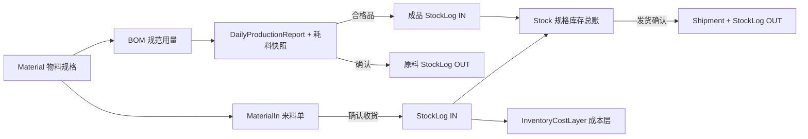
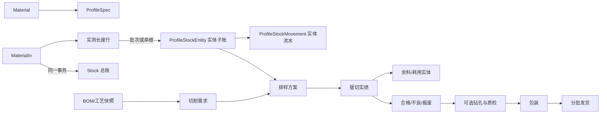

# 铝型材定制 MES 阶段 0 审计

## 审计范围

本次阅读了 Prisma schema 与迁移、物料/BOM、来料、库存总账与成本层、生产工单、独立生产日报、发货、锯切成本、权限、审计和当前页面导航。

## 现有数据流

## 可直接复用的能力

- `Material` 是用户侧统一物料主数据，`Product` 仅保留兼容关联。
- `Stock` 已包含现存、预留、可用、核算数量和成本金额。
- `StockLog.idempotencyKey` 已支持库存总账写入幂等。
- `InventoryCostLayer` 已支持加权平均/FIFO成本与来料红冲保护。
- 来料确认、生产日报确认和发货确认已使用数据库事务。
- 生产日报已保存 BOM 耗料快照并支持合法冲销。
- 权限按资源与动作管理，页面已有顶部一级菜单、左侧当前模块菜单和单一页面纵向滚动。

## 关键差距

| 领域 | 当前状态 | 目标差距 |
| --- | --- | --- |
| 不规则来料 | 来料单只有总数量/重量和批次 | 缺少每种实测长度、同长数量和单根拆分 |
| 可用库存 | 只有物料规格总量 | 缺少可被排样选择的具体实体 |
| 余料 | 只能作为普通数量或成本测算值 | 缺少来源、剩余长度、可复用状态和谱系 |
| 工单快照 | 领料行保存计算后的数量；生产日报有 BOM 快照 | 工单缺少完整 BOM/工艺快照 |
| 排样/锯切 | 锯切成本方案是测算模型 | 缺少切割需求、实体选择、计划与实绩 |
| 冲销 | 总账已有反向流水 | 实体子账尚无反向流水与状态恢复 |
| 质检/包装追溯 | 有基础 QC、发货记录 | 未串联到原料实体和包装层级 |

## 目标数据流

## 迁移与兼容策略

1. 所有新表均为增量表；不删除、不改写现有物料、库存、BOM、生产和发货数据。
2. `Stock` 继续是数量与成本总账，实体是可选但可逐步提高覆盖率的子账。
3. 新来料只有在录入实测长度行时才生成实体；旧来料和旧库存不伪造长度。
4. 来料确认同时写总账和实体子账；任一失败则整笔回滚。
5. 来料红冲前检查实体未被拆分、占用、耗用或报废。
6. 实体变化使用唯一幂等键和追加流水；禁止物理删除已入账实体。
7. 第一阶段不把旧生产/发货强制切到实体库存，避免破坏已有流程。

## 阶段 1 垂直切片边界

- 型材规格扩展资料。
- 来料实测长度行和批次/单根模式。
- 收货生成实体、红冲恢复实体。
- 实体库存列表、长度/状态筛选、批次拆分和实体流水查询。
- 权限与验证脚本。

排样、占用、耗用、余料生成、钻孔、包装和硬件业务联动不在本切片实现。

## 后续实施状态

- 阶段 1 已完成：型材规格、实测来料、实体库存、拆分、流水和红冲。
- 阶段 2 已完成：工单 BOM/工艺快照、BOM 切长、公差、切割需求、人工选料、实时计算、排样占用、取消恢复和混单配置约束。
- 阶段 3 起仍待实现：锯切任务/实绩、实际余料或废料、冲销；随后是钻孔、质检、包装发货与追溯。
