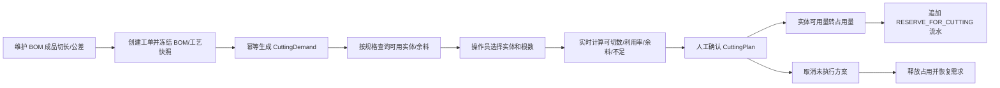

# 铝型材定制 MES 阶段 2：切割需求与人工排样

## 已实现闭环

## 计算口径

- 每件占用长度：`成品切长 + 锯缝`。
- 每根可排长度：`实际长度 - 首端切除 - 尾端切除 - 夹持死区`。
- 单根可切数量：`floor(可排长度 / 每件占用长度)`。
- 利用率：`成品净长度合计 / 来源实际长度合计`。
- 预计余料只表示计划值；阶段 3 以实绩测量值生成余料实体。
- 参数未确认时保留 `NULL`，生成需求时把“本次按 0 mm 计算”写入规则警告；操作员可在方案上明确覆盖。

## 状态与事务

- 需求状态：`OPEN → PARTIALLY_PLANNED → PLANNED`。
- 方案确认、实体占用、需求已排数量和实体流水在同一事务提交。
- 客户端请求 ID 保证确认重试不会重复占用。
- 取消方案在同一事务释放实体、恢复需求并追加反向流水。
- 已执行方案将在阶段 3 禁止直接取消，改用锯切实绩冲销。

## 兼容边界

- 普通 BOM 行和没有实体库存的历史物料仍按原流程运行。
- 新工单在创建时冻结快照；旧工单第一次生成需求时以当时有效 BOM 补做兼容快照。
- 排样只维护实体子账；规格总账的工单预留不重复扣减。
- 当前页面支持单条需求的人工选料；服务模型和计算 API 已支持配置允许后的多需求混单。
