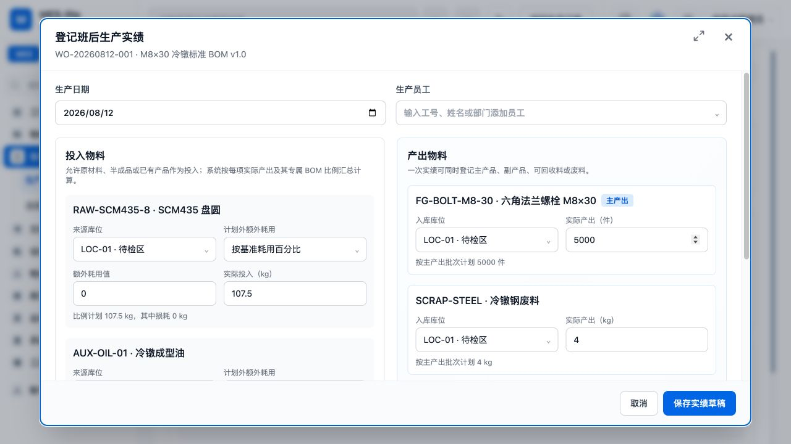
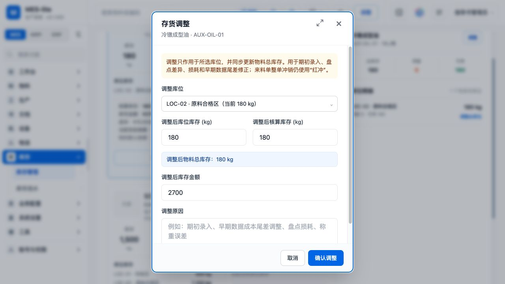
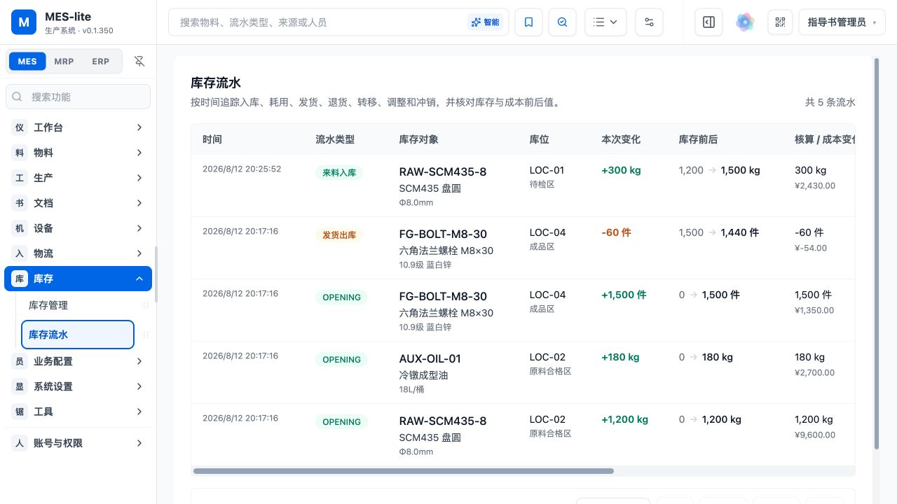
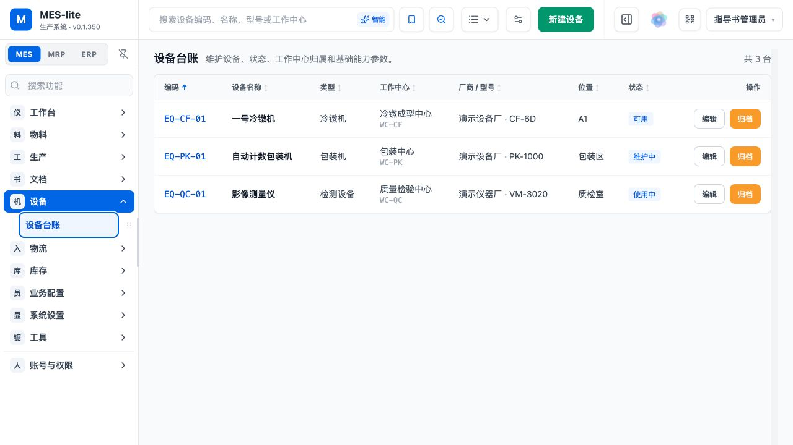
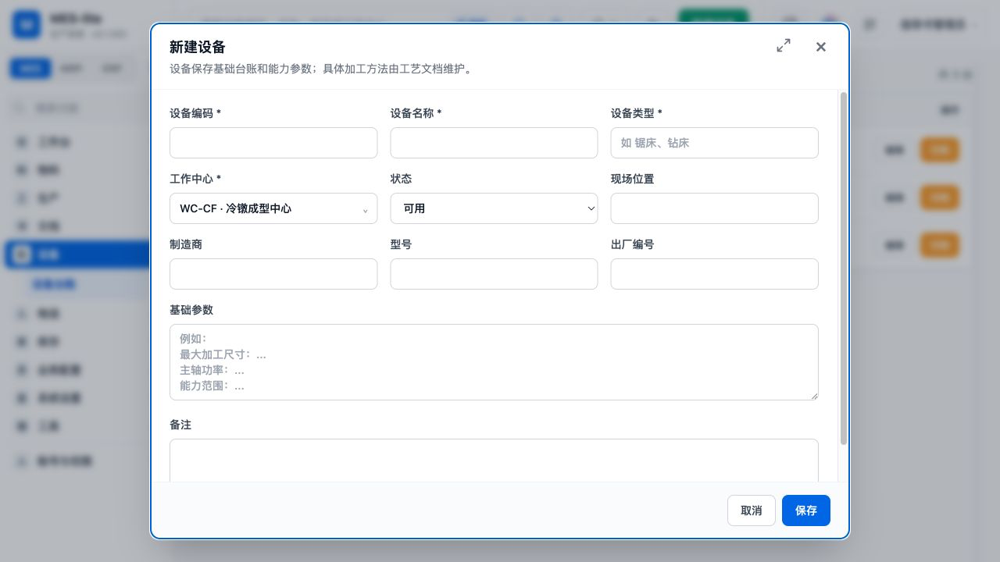
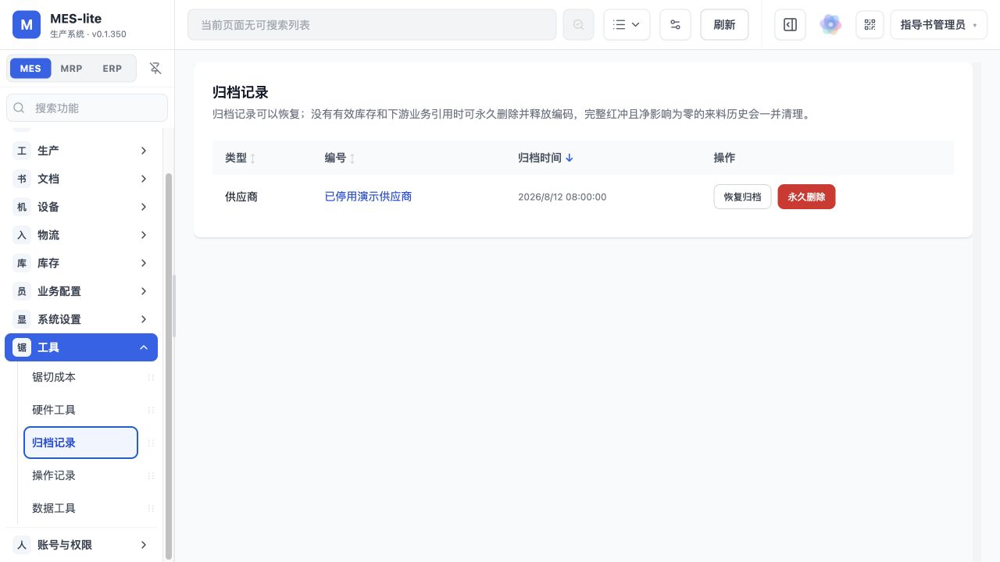

# MES-lite 全流程作业指导书

- 交付版本：v0.1.354
- 截图基线：v0.1.350（65 张通用流程）+ v0.1.354（7 张质量批次流程）
- 数据范围：隔离本地临时演示库，不含生产业务数据
- 编制日期：2026-08-13

> 重要：生产产出已完成内部批次、待检和整批放行/冻结；来料、投入、发货批次和完整不合格处置尚未贯通。

## 推荐业务顺序

单位/库位/员工/供应商/客户/工作中心 → 物料 → BOM/工艺路线 → 生产订单/销售订单 → 派工/来料/发货 → 实绩 → 产出待检与整批判定 → 收货/退货 → 库存与审计复核。

## 1. 登录与工作区导航

### 登录系统

目的：使用分配的操作员账号进入系统。

1. 打开系统登录页。
2. 输入登录账号和密码。
3. 点击“登录”，等待工作台加载。

结果检查：顶部显示当前人员名称，左侧出现有权限的功能菜单。

### 查看工作台

目的：在班前确认生产、库存和待办概况。

1. 进入 MES 工作区。
2. 查看常用功能、生产负荷和待处理事项。
3. 发现红色或橙色预警时进入对应功能核查。

结果检查：统计卡片与当前演示业务数据一致。

### 使用所有功能

目的：从完整功能目录进入业务页面。

1. 在工作台点击“所有功能”。
2. 按业务分组找到目标功能。
3. 只会显示当前账号拥有权限的页面。

结果检查：页面按物料、生产、物流、库存、配置、工具等分组。

### 切换 ERP 工作区

目的：进入销售、发货和退货业务。

1. 点击左上角“ERP”工作区。
2. 点击“所有功能”。
3. 选择销售订单、发货管理或退货管理。

结果检查：左侧菜单切换为 ERP 业务导航。

## 2. 物料与 BOM 主数据

### 查询物料

目的：查询物料编码、规格、单位和库存概况。

1. 进入 MES > 物料 > 物料管理。
2. 使用顶部搜索框输入编码、名称或规格。
3. 需要时切换列表/卡片视图并打开详情。

结果检查：目标物料及库存单位正确显示。

### 新建物料

目的：建立可用于库存和生产的统一 Material 主数据。

1. 点击“新建物料”。
2. 填写编码、名称、规格、分类、库存单位和主要计量方式。
3. 按需要填写默认价格、安全库存和客户。
4. 保存后返回列表复核。

结果检查：新物料可被 BOM、订单、收发货等业务选择。

### 进入 BOM 工作区

目的：查找物料并维护 BOM 版本。

1. 进入 MES > 物料 > BOM 设置。
2. 搜索并选择目标产出物料。
3. 查看当前版本、状态、输入项和输出项。

结果检查：BOM 工作区显示目标物料和版本状态。

### 维护并发布 BOM

目的：定义整批投入、主产出和副产出。

1. 新建或打开草稿 BOM。
2. 填写基准产量、投入物料、数量和单位。
3. 维护主产出与副产出比例。
4. 校验无误后发布，生产只能引用已发布版本。

结果检查：发布版本显示“已发布”，投入单位与物料计量方式一致。

## 3. 生产订单与班后实绩

### 查看生产订单

目的：查看生产计划及统一状态。

1. 进入 MES > 生产 > 生产订单。
2. 按订单号、物料或状态搜索。
3. 关注草稿、已发布、生产中、已完成和已取消状态。

结果检查：列表显示计划数量、日期、BOM 和当前状态。

### 新建生产订单

目的：建立物料化生产计划。

1. 点击“新建生产订单”。
2. 选择产出物料、已发布 BOM、计划数量和计划日期。
3. 填写班组或备注后保存。

结果检查：订单以“草稿”创建，此时不可登记实绩。

### 发布生产订单

目的：将已复核计划转为可执行任务。

1. 打开草稿订单详情。
2. 核对物料、数量、日期和 BOM。
3. 点击“发布订单”并确认。

结果检查：状态由“草稿”变为“已发布”。

### 确认订单可执行

目的：确认发布后实绩入口已经解锁。

1. 发布完成后重新查看订单详情。
2. 确认状态为“已发布”。
3. 确认“登记班后产量”按钮可用。

结果检查：发布状态与操作按钮保持一致。

### 登记班后生产实绩

目的：按真实投入和产出记录班后实绩。

1. 点击“登记班后产量”。
2. 填写员工、工作中心、实际日期和产出数量。
3. 按现场记录填写实际投入、主产出、副产出及库位。
4. 保存后核对实绩与库存流水。

结果检查：实绩保存成功，投入与产出生成可追溯记录。

## 4. 生产产出批次与质检

### 查看产出批次与质量状态

目的：从生产实绩核对内部批次、检验单和当前库存状态。

1. 进入生产订单详情并展开已确认实绩。
2. 在每项产出下查看内部批次号和检验单号。
3. 区分待检、已放行和冻结状态。

结果检查：每项新产出具有唯一内部批次，待检任务只允许判定一次。

### 填写合格判定

目的：记录抽样结果并准备整批放行。

1. 在待检批次点击“合格放行”。
2. 录入抽检数量、合格数量和不合格数量。
3. 填写检验结论说明并核对批次号。

结果检查：合格数量与不合格数量之和等于抽检数量，整批合格时不合格数为 0。

### 确认整批放行

目的：把检验合格的整批产出从待检转为可用。

1. 点击“确认整批放行”。
2. 等待保存成功并刷新订单详情。
3. 核对批次状态、判定人和抽样结果。

结果检查：批次显示“已放行”，待检库存减少、可用库存增加。

### 填写不合格判定

目的：记录不合格样本和冻结原因。

1. 在另一待检批次点击“不合格冻结”。
2. 录入抽检、合格和不合格数量。
3. 在说明中写清不合格现象和冻结原因。

结果检查：抽样关系校验通过，说明可供后续处置人员理解。

### 确认整批冻结

目的：阻止不合格产出进入领料或发货可用量。

1. 点击“确认整批冻结”。
2. 等待保存成功并刷新订单详情。
3. 核对批次状态、判定人和抽样结果。

结果检查：批次显示“冻结”，待检库存减少、冻结库存增加。

### 核对库存状态

目的：在库存总账复核质量判定后的可用、待检和冻结数量。

1. 进入 MES > 库存 > 库存管理。
2. 搜索质检涉及的产出物料。
3. 核对总量、可用、待检、冻结及库位余额。

结果检查：总库存等于可用、待检和冻结之和，质量判定不改变总量或总成本。

### 核对质量状态流水

目的：确认放行或冻结可以从统一库存流水回放。

1. 进入 MES > 库存 > 库存流水。
2. 搜索产出物料或质量来源。
3. 核对 QUALITY RELEASE / QUALITY HOLD、批次、状态方向、操作人和时间。

结果检查：状态转换流水数量变化为 0，但明确记录待检到可用或冻结的转换。

## 5. 派工与流程转移

### 查看派工

目的：查看生产任务的人员和工作中心分配。

1. 进入 MES > 生产 > 派工管理。
2. 按任务、人员或状态筛选。
3. 核对生产订单、工作中心和执行人员。

结果检查：待处理派工及其来源订单可追溯。

### 新建派工

目的：把已发布生产任务分配到员工和工作中心。

1. 点击“新建派工”。
2. 选择生产订单、员工、工作中心和计划时间。
3. 填写要求并保存。

结果检查：派工记录出现在列表并可跟踪状态。

### 查看流程转移

目的：跟踪物料在流程节点或库位间的移动。

1. 进入 MES > 生产 > 流程转移。
2. 搜索转移单号、物料或员工。
3. 核对来源库位、目标库位、数量和状态。

结果检查：列表完整显示待处理与已完成转移。

### 新建流程转移

目的：登记同一物料的现场流转。

1. 点击“新建流程转移”。
2. 选择物料、来源库位、目标库位和数量。
3. 填写执行员工、节点和备注后保存。
4. 审批/完成后检查库位库存。

结果检查：转移完成后总库存不变，库位分布变化。

## 6. 来料与库存闭环

### 查看来料单

目的：查看供应商来料及收货状态。

1. 进入 MES > 物流 > 来料管理。
2. 按单号、供应商或物料搜索。
3. 核对采购数量、实测数据、计价和状态。

结果检查：待收货与已收货单据清晰区分。

### 新建来料单

目的：登记供应商原材料到货。

1. 点击“新建来料单”。
2. 选择供应商、物料、收货库位。
3. 填写数量、实测重量、单价、凭据和附件。
4. 创建后保留为待收货，等待现场确认。

结果检查：来料单生成，但库存尚未增加。

### 确认收货

目的：确认实物到厂并增加指定库位库存。

1. 在待收货记录上点击“收货”。
2. 再次核对物料、数量和库位。
3. 确认操作后查看成功提示。

结果检查：状态变为“已收货”，库存和流水同步增加。

### 查看库存

目的：按物料和库位核对库存、占用和可用量。

1. 进入 MES > 库存 > 库存管理。
2. 搜索目标物料。
3. 展开库位分布并核对总量、占用、可用和成本。

结果检查：物料总库存等于各库位库存合计。

### 库存调整

目的：在授权和有凭据时纠正账实差异。

1. 在库存记录中点击“调整”。
2. 选择库位并填写调整后数量或调整差额。
3. 填写原因和凭据，确认保存。
4. 立即进入库存流水复核来源。

结果检查：调整生成独立流水，不覆盖历史业务单据。

### 核对库存流水

目的：追溯每次数量和成本变化。

1. 进入 MES > 库存 > 库存流水。
2. 按物料、业务类型、时间或来源单据筛选。
3. 核对来料、发货、退货、调整和生产实绩记录。

结果检查：流水数量、库位和来源单据能相互对应。

## 7. 销售、发货与退货

### 查看销售订单

目的：跟踪客户需求、占用、已发和未发数量。

1. 进入 ERP > 销售 > 销售订单。
2. 搜索客户、订单号或物料。
3. 查看草稿、已确认、部分发货和完成状态。

结果检查：订单数量与发货占用、已发和未发数量一致。

### 新建销售订单

目的：登记客户需求、价格和交期。

1. 点击“新建销售订单”。
2. 选择客户并填写订单日期、交期和客户单号。
3. 添加物料、数量、单价和附件。
4. 创建后复核并确认订单。

结果检查：草稿订单生成，确认后才可用于关联发货。

### 复核销售订单详情

目的：在发货前核对客户和订单明细。

1. 打开订单“详情”。
2. 核对客户、客户单号、日期、金额和附件。
3. 确认订购、待发占用、已发和未发数量。

结果检查：详情与列表及原始凭据一致。

### 查看发货单

目的：查看待发、已发货和已签收记录。

1. 进入 ERP > 销售 > 发货管理。
2. 按发货单、订单、客户或物流号搜索。
3. 核对发货库位、数量、价格和状态。

结果检查：每张发货单可追溯销售订单和客户。

### 新建发货单

目的：建立独立或关联销售订单的发货任务。

1. 点击“新建发货单”。
2. 选择销售订单或独立发货。
3. 选择客户、物料、发货库位并填写数量、价格和物流信息。
4. 保存后先保持待发货。

结果检查：待发货记录生成并占用订单未发数量。

### 确认发货

目的：实际出库并扣减发货库位库存。

1. 在待发货记录点击“发货”。
2. 核对库位库存和发货数量。
3. 确认后查看成功提示，可继续办理签收。

结果检查：状态变为“已发货”，库存减少，销售订单已发数量增加。

### 查看退货单

目的：查看客户退货、原因和处理状态。

1. 进入 ERP > 销售 > 退货管理。
2. 按退货单、物料、发货单或原因搜索。
3. 核对数量、退回库位和待处理状态。

结果检查：退货可追溯原发货单和客户。

### 新建退货单

目的：登记客户退回物料。

1. 点击“新建退货单”。
2. 选择物料并填写数量、退回库位和原因。
3. 按需填写外部凭据、备注和附件。
4. 保存后等待授权人员处理。

结果检查：新单状态为“待处理”，库存尚未返库。

### 处理退货返库

目的：确认退货接收并增加指定库位库存。

1. 在待处理退货上点击“处理”。
2. 核对数量和退回库位。
3. 确认后检查成功提示、库存和流水。

结果检查：状态变为“已处理”，退回库位库存增加。

## 8. 文档与设备台账

### 查看受控文档

目的：按物料、客户和工作中心查找现场文件。

1. 进入 MES > 文档 > 产品文档。
2. 按标题、正文、产品或备注搜索。
3. 点击“在线阅读”或“详情”查看版本和附件。

结果检查：能确认文件标题、版本、状态和适用范围。

### 新建受控文档

目的：上传原文件或创建在线作业正文。

1. 点击“新建文档”。
2. 上传原文件或填写在线正文。
3. 关联物料、类别、版本和工作中心。
4. 保存后在列表复核状态。

结果检查：文档可按适用范围检索并保留原始附件。

### 查看设备台账

目的：维护设备状态、工作中心和能力参数。

1. 进入 MES > 设备 > 设备台账。
2. 搜索设备编码、名称、型号或工作中心。
3. 核对设备状态和现场位置。

结果检查：台账显示可用、使用中、维护中或停用状态。

### 新建设备

目的：建立设备基础台账。

1. 点击“新建设备”。
2. 填写编码、名称、类型和工作中心。
3. 填写状态、位置、厂商、型号、参数和备注。
4. 保存后复核列表。

结果检查：设备可用于后续事件、派工和产能关联。

## 9. 业务主数据配置

### 进入业务配置

目的：按顺序建立业务运行依赖的主数据。

1. 展开 MES 的“业务配置”。
2. 建议依次维护单位、库位、员工、工作中心、工艺、路线和文档类别。
3. ERP 工作区维护供应商、客户和企业规则。

结果检查：业务单据下拉项来自已启用主数据。

### 查看员工资料

目的：区分业务员工与登录账号。

1. 进入员工资料。
2. 核对员工编码、部门、电话、账号绑定和在职状态。
3. 员工用于派工、实绩和转移，账号绑定不授予权限。

结果检查：员工与账号关系清晰且无重复绑定。

### 新建员工

目的：建立业务执行人员。

1. 点击“新建员工”。
2. 填写姓名、部门和电话。
3. 按需绑定注册账号；权限仍在权限模块设置。
4. 保存后系统生成员工编码。

结果检查：员工可被业务单据选择。

### 查看库位配置

目的：维护库存实物分布和默认库位。

1. 进入库位配置。
2. 核对编码、名称、启用状态、物料数和库存。
3. 默认库位必须保持启用。

结果检查：各库位库存分布与库存管理一致。

### 新建库位

目的：建立收发存可选的现场位置。

1. 点击“新建库位”。
2. 填写唯一编码、名称和备注。
3. 仅在确有需要时设为默认库位。

结果检查：启用库位可被来料、生产、转移、发货和退货选择。

### 查看单位配置

目的：维护长度、重量、数量和其他计量目录。

1. 进入单位配置。
2. 核对单位编码、显示名称、计量方式和换算系数。
3. 已被引用的单位不要随意改变换算关系。

结果检查：物料单位与计量方式保持一致。

### 新建自定义单位

目的：添加系统未预置的计量单位。

1. 点击“新建单位”。
2. 选择计量方式并填写编码和显示名称。
3. 准确填写到系统基准单位的换算系数。
4. 保存前由业务负责人复核。

结果检查：自定义单位可选且换算定义明确。

### 维护文档类别

目的：建立受控文件的一级/二级分类。

1. 进入文档类别。
2. 新建或编辑分类名称和层级。
3. 已有文档引用的分类优先停用，不直接删除。

结果检查：文档建档时可选择正确分类。

### 查看工作中心

目的：维护生产能力区域。

1. 进入工作中心。
2. 核对编码、名称、类别、设备和工艺文档关联。
3. 停用前确认没有正在执行的任务。

结果检查：工作中心与设备、工艺引用一致。

### 新建工作中心

目的：建立生产、检验或包装能力区域。

1. 点击“新建工作中心”。
2. 填写编码、名称、类别和说明。
3. 保存后再关联设备和适用文档。

结果检查：工作中心可在派工、实绩和设备台账中使用。

### 维护加工工艺模板

目的：建立可复用的工艺与成本参数。

1. 进入加工工艺。
2. 新建或编辑工艺编码、名称、类别和工作中心。
3. 维护千件人工、机时和成本参数。

结果检查：工艺模板可加入物料路线。

### 查看物料工艺路线

目的：查看物料的有序工序。

1. 进入物料路线。
2. 搜索目标物料。
3. 核对默认路线、工序号、工序名称、工位和设备。

结果检查：默认路线及工序顺序正确。

### 新建物料工艺路线

目的：为物料建立有序加工步骤。

1. 点击“新建工艺路线”。
2. 选择物料并填写路线名称。
3. 按顺序添加工序或引用工艺模板。
4. 设置默认路线并保存。

结果检查：路线可被工程和执行流程引用。

### 查看供应商

目的：维护来料业务的供应商档案。

1. 切换 ERP > 业务配置 > 供应商资料。
2. 核对编码、名称、联系人、电话和状态。
3. 停用前确认没有未完成来料。

结果检查：来料单可选择启用供应商。

### 新建供应商

目的：建立供应商基础资料。

1. 点击“新建供应商”。
2. 填写名称、联系人、电话、地址和备注。
3. 保存后在供应商列表复核。

结果检查：供应商可用于来料登记。

### 查看客户

目的：维护销售、库存和发货筛选所需客户档案。

1. 进入 ERP > 业务配置 > 客户资料。
2. 核对编码、名称、联系人、电话和地址。
3. 归档前确认没有未完成订单。

结果检查：客户可被销售订单和发货单选择。

### 新建客户

目的：建立客户基础资料。

1. 点击“新建客户”。
2. 填写名称、联系人、电话、地址和备注。
3. 保存后在客户列表复核。

结果检查：客户可用于销售订单。

### 设置企业与业务规则

目的：维护发货单乙方资料和全局业务规则。

1. 进入“企业与业务规则”。
2. 填写企业名称、联系人、电话和地址并保存。
3. 变更全局排序规则前评估所有客户端影响。

结果检查：发货 PDF 乙方信息和业务列表规则正确。

## 10. 系统、工具与权限

### 显示设置

目的：配置界面配色、对比度和显示效果。

1. 进入系统设置 > 显示设置。
2. 调整主题和显示选项。
3. 保存后刷新并检查可读性。

结果检查：设置对当前客户端或系统范围按页面说明生效。

### 导航与工作区设置

目的：配置页面在 MES/MRP/ERP 的唯一归属和顺序。

1. 进入导航与工作区。
2. 调整页面归属、名称和顺序。
3. 保存后逐个工作区核对菜单。

结果检查：每个页面仅在一个工作区出现，导航符合现场任务流。

### AI 服务设置

目的：配置兼容模型连接和助手外观。

1. 进入系统设置 > AI 服务。
2. 选择提供商并填写接口、模型和超时。
3. API Key 依赖服务器密钥保护；保存前遵守页面安全提示。
4. 测试已保存配置后再开放给用户。

结果检查：配置测试通过，密钥不在页面或日志中明文泄露。

### 锯切成本计算

目的：估算锯切、损耗和直接加工成本。

1. 进入工具 > 锯切成本。
2. 填写材料、尺寸、数量、损耗和工时参数。
3. 核对计算结果并按业务要求留存。

结果检查：计算口径与报价/工艺约定一致。

### 扫码计数与标签打印

目的：验证扫码枪计数和浏览器标签打印底座。

1. 进入工具 > 硬件工具。
2. 扫码计数：填写任务与目标条码，创建会话后扫描。
3. 标签打印：填写条码、名称、规格、数量和介质尺寸。
4. 先做测试打印并校准纸张；当前打印机 IP 仅保存配置。

结果检查：扫码计数正确，测试标签尺寸和条码可读。

### 管理归档记录

目的：恢复误归档记录或执行受控清理。

1. 进入工具 > 归档记录。
2. 按业务类型查找记录。
3. 优先恢复；永久删除前确认依赖、备份和授权。

结果检查：恢复后记录回到业务列表；永久删除有审计记录。

### 查看操作记录

目的：追溯关键业务和系统变更。

1. 进入工具 > 操作记录。
2. 按人员、动作、资源或时间筛选。
3. 将异常操作与来源单据、库存流水交叉核对。

结果检查：关键修改可以定位到人员、时间和对象。

### 执行数据检查

目的：预检关键数据关系并仅处理明确安全的问题。

1. 进入工具 > 数据工具。
2. 先点击“重新检查”。
3. 查看阻塞、警告和可安全修复项。
4. 修改/清理前备份，完成后再次检查。

结果检查：检查无阻塞问题；所有维护动作写入审计记录。

### 人员管理

目的：审核、启停和维护登录人员。

1. 进入账号与权限 > 人员管理。
2. 核对账号、姓名、角色、审核和启用状态。
3. 离职或异常账号应及时停用。

结果检查：只有已审核且启用的账号能够登录。

### 配置个人权限

目的：为指定人员分配权限组和个人例外权限。

1. 进入账号与权限 > 人员权限。
2. 选择人员并分配权限组。
3. 仅在必要时增加个人权限。
4. 保存后用该账号复核可见菜单和操作。

结果检查：人员实际权限符合岗位最小权限原则。

### 配置权限组

目的：维护可复用的岗位权限集合。

1. 进入账号与权限 > 组权限。
2. 选择或新建权限组。
3. 按资源勾选查看、新建、编辑、归档、删除。
4. 保存后复核组内人员。

结果检查：同岗位人员获得一致、可审计的权限。

## 暂不作为现行 SOP 的治理项

- 生产产出已支持整批放行/冻结；部分放行、复检、让步、返工、报废和解冻尚未贯通。
- 生产产出已有内部批次；来料、投入和发货批次尚未形成端到端追溯。
- 设备开停机、故障、维护、产量和 OEE 尚未形成统一事件流。
- 旧 Product 与 Material 仍需分阶段迁移，禁止继续扩展旧模型写入口。
