# MES-lite 全流程作业指导书

- 交付版本：v0.1.434
- 截图基线：v0.1.350-v0.1.430（184 张经验证流程截图）
- 数据范围：业务流程使用隔离本地临时演示库；第 17 章使用真实 Coolify 运维配置和脱敏生产恢复候选演练证据，不展示生产业务明细、账号、密码或密钥
- 编制日期：2026-08-14

> 重要：质量标准版本、来料自动待检、来料/物流状态命令分权、自动抽样、逐项判定、批次/库存处置、统一库存事务账本、库存所有者数据库约束、趋势统计、岗位权限、数据范围、设备事件、周期点检、维保，以及生产实绩实际设备/作业文件版本快照已落地。2026-08-17 已只读核验真实 Coolify 的 v0.1.396 部署、三个显式持久挂载、live/ready、84 个迁移和最新一致备份，基础运行通过；Product 到 Material 人工确认和回填、真实岗位签字、关键业务闭环与回切演练、OSS/异地存储及自动设备采集/OEE 仍待人工跟进，不能据此承诺完整模型收敛、商业验收、异地容灾或设备绩效。

## 推荐业务顺序

单位/库位/员工/供应商/客户/工作中心 → 物料 → 检验标准 → BOM/工艺路线 → 生产订单/销售订单 → 派工/来料/发货 → 收货转待检 → 质量判定/处置/复检 → 生产日报 → 库存盘点与审计复核。

## 1. 登录与功能导航

### 使用站内帮助中心

目的：按当前账号权限搜索并阅读当前版本的作业指导书。

1. 在任一页面展开“工作台”功能区。
2. 点击“帮助中心”。
3. 需要独立全屏查看时，在快捷帮助中点击“打开完整帮助中心”，系统会新开页面且保留当前业务页面。
4. 使用搜索框输入页面、单据、岗位或操作关键字。
5. 视频教程按既有 SOP 章节显示；点击视频可直接播放，或在新页面打开原始视频。
6. 展开目标流程，逐步操作并核对结果检查。
7. 商业交付环境若已配置外部文档下载地址，可在页头下载与当前系统版本一致的 PDF 或 DOCX；没有下载按钮时继续使用在线帮助并联系管理员完成成品发布。

结果检查：独立帮助页面显示系统版本、可读流程数、视频数和章节；视频与流程按同一章节、权限和当前页面关系显示，无权限内容不会出现；只有配置了只读发布地址时才显示当前版本 PDF/DOCX 下载和已登记的视频文件。

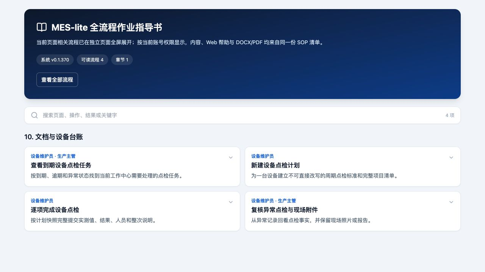

### 查看当前页面操作帮助

目的：不离开当前业务页面即可查看与该页面关联的操作流程。

1. 进入需要操作的业务页面。
2. 点击顶部问号按钮。
3. 在右侧抽屉播放当前页面相关视频，或展开相关流程查看步骤、结果和截图。
4. 点击“新页面全屏查看”只查看当前功能，或点击“打开完整帮助中心”在新页面检索全部流程。

结果检查：抽屉只显示当前页面且当前账号有权读取的 SOP 流程和视频；两个底部入口均在新页面打开，不中断当前业务操作。

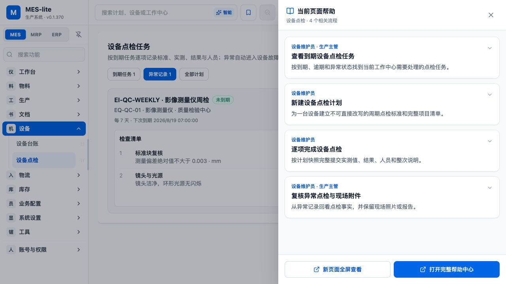

### 登录系统

目的：使用分配的操作员账号进入系统。

1. 打开系统登录页。
2. 输入登录账号和密码。
3. 点击“登录”，等待工作台加载。

结果检查：顶部显示当前人员名称，左侧出现有权限的功能菜单。

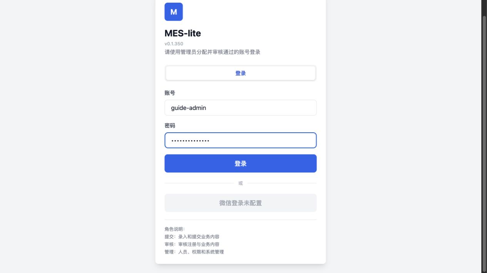

### 查看工作台

目的：在班前确认生产、库存和待办概况。

1. 从左上角当前主模块按钮进入统一 MES 工作台；默认名称为 MES-lite。
2. 确认 MRP、ERP 若显示则带预留标识且不可切换业务菜单；系统版本显示在左侧导航底部。
3. 查看常用功能、生产负荷和待处理事项。
4. 发现红色或橙色预警时进入对应功能核查。

结果检查：统计卡片与当前演示业务数据一致。

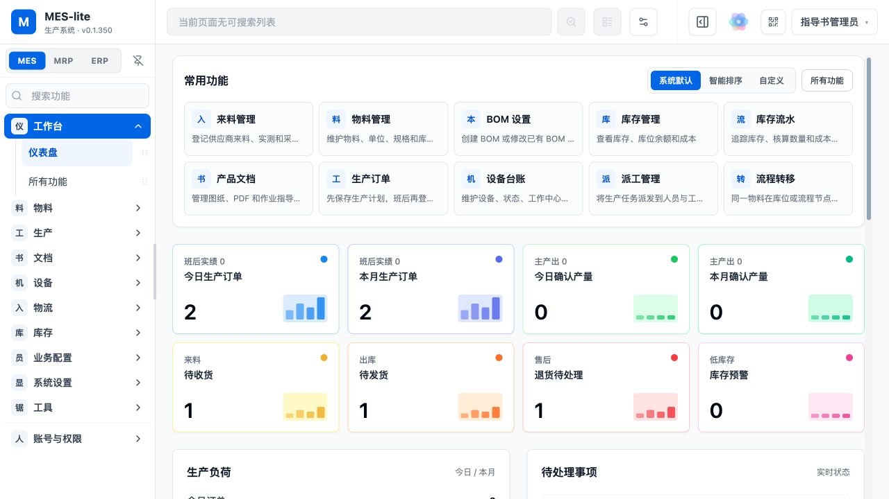

### 使用所有功能

目的：从完整功能目录进入业务页面。

1. 在工作台点击“所有功能”。
2. 按业务分组找到目标功能。
3. 只会显示当前账号拥有权限的页面。

结果检查：页面按物料、生产、物流、库存、配置、工具等分组。

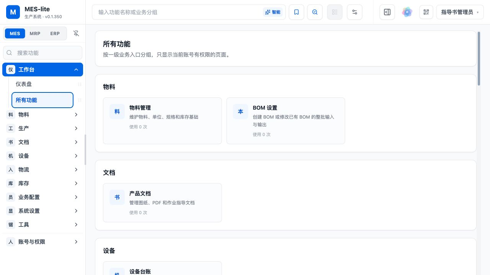

### 进入销售履约功能区

目的：在统一 MES 工作台进入销售、发货和退货业务。

1. 打开左侧导航或“所有功能”。
2. 展开“销售”功能区。
3. 选择销售订单、发货管理或退货管理。

结果检查：无需切换系统即可进入销售履约页面，页面继续使用原权限和业务数据。

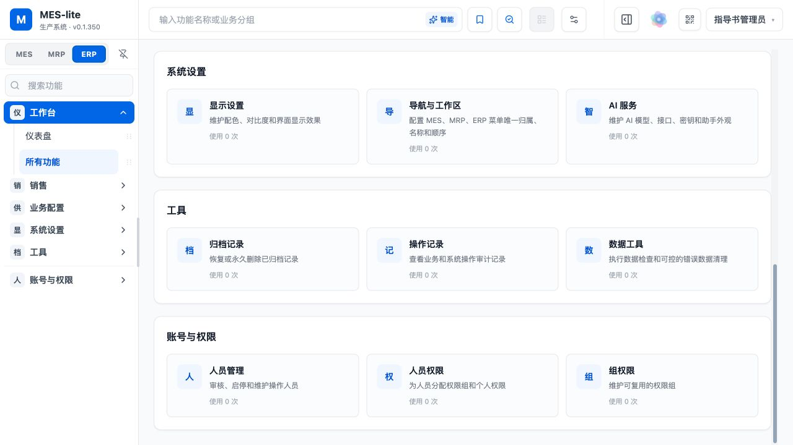

## 2. 物料与 BOM 主数据

### 查询物料

目的：查询物料编码、规格、单位和库存概况。

1. 展开“物料”功能区，进入“物料管理”。
2. 使用顶部搜索框输入编码、名称或规格。
3. 需要时切换列表/卡片视图并打开详情。

结果检查：目标物料及库存单位正确显示。

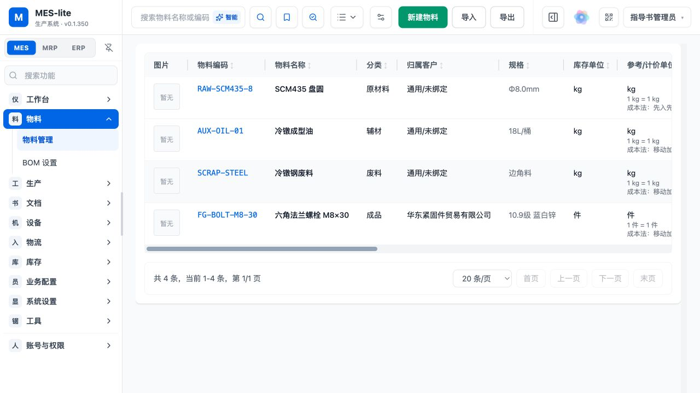

### 新建物料

目的：建立可用于库存和生产的统一 Material 主数据。

1. 点击“新建物料”。
2. 填写编码、名称、规格、分类、库存单位和主要计量方式。
3. 按需要填写默认价格、安全库存和客户。
4. 保存后返回列表复核。

结果检查：新物料可被 BOM、订单、收发货等业务选择。

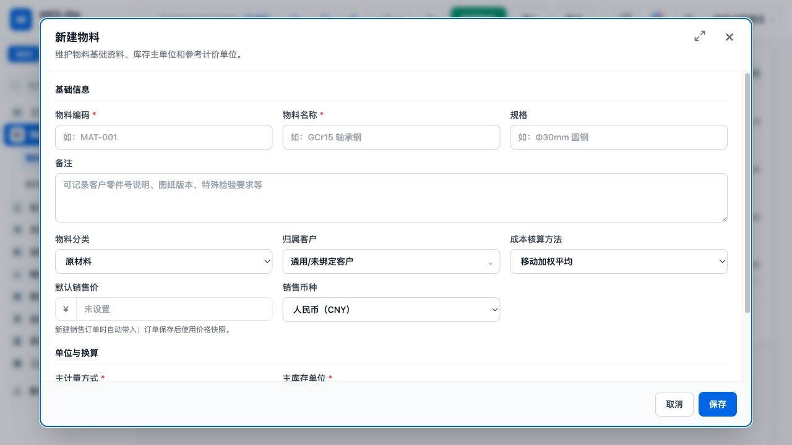

### 进入 BOM 工作区

目的：查找物料并维护 BOM 版本。

1. 展开“物料”功能区，进入“BOM 设置”。
2. 搜索并选择目标产出物料。
3. 查看当前版本、状态、输入项和输出项。

结果检查：BOM 工作区显示目标物料和版本状态。

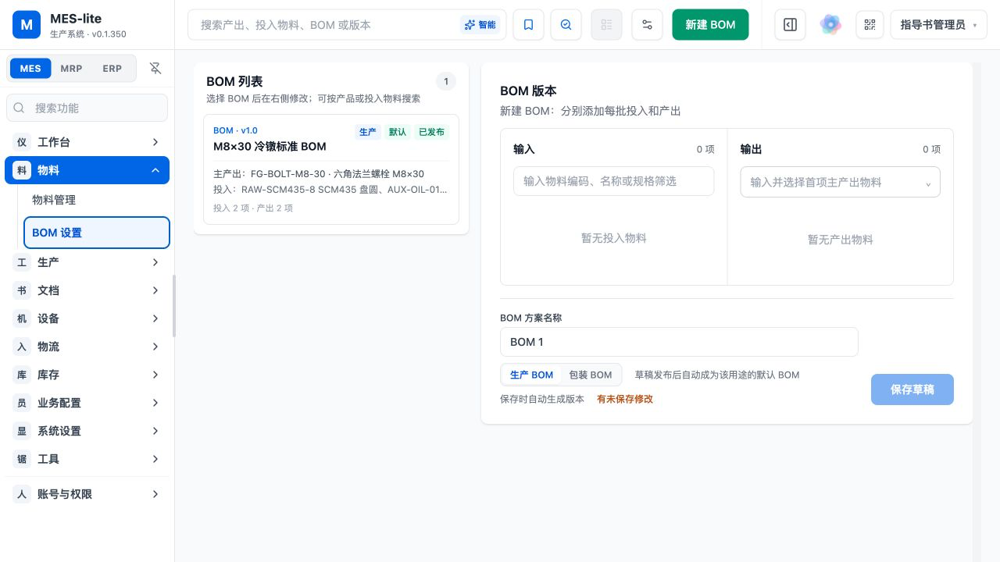

### 维护并发布 BOM

目的：定义整批投入、主产出和副产出。

1. 新建或打开草稿 BOM。
2. 填写基准产量、投入物料、数量和单位。
3. 维护主产出与副产出比例。
4. 校验无误后发布，生产只能引用已发布版本。

结果检查：发布版本显示“已发布”，投入单位与物料计量方式一致。

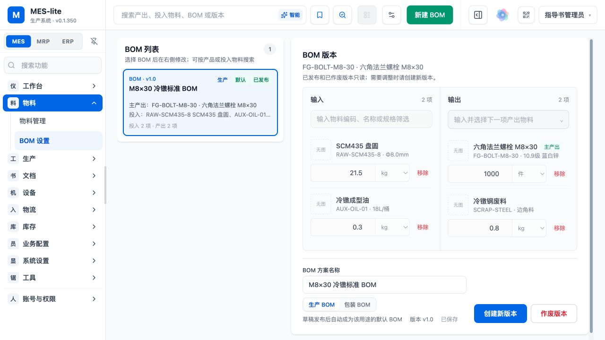

## 3. 生产订单与班后实绩

### 查看生产订单

目的：查看生产计划及统一状态。

1. 展开“生产”功能区，进入“生产订单”。
2. 按订单号、物料或状态搜索。
3. 关注草稿、已发布、生产中、已完成和已取消状态。

结果检查：列表显示计划数量、日期、BOM 和当前状态。

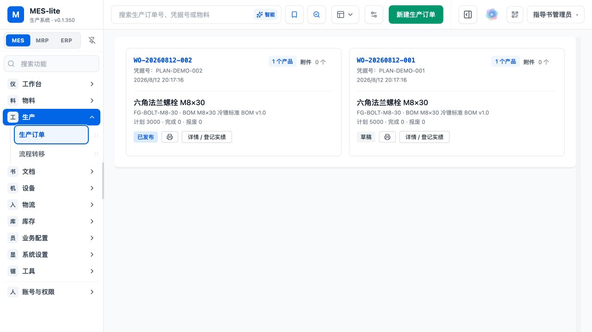

### 新建生产订单

目的：建立物料化生产计划。

1. 点击“新建生产订单”。
2. 选择产出物料、已发布 BOM、计划数量和计划日期。
3. 填写班组或备注后保存。
4. 需要纸质单据时，保存后在生产订单清单点击“打印”。

结果检查：订单以“草稿”创建，此时不可登记实绩。

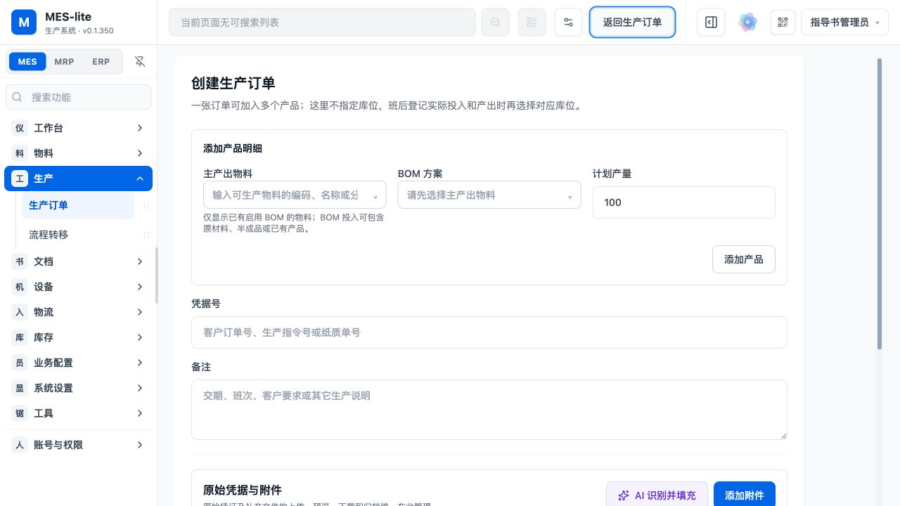

### 发布生产订单

目的：将已复核计划转为可执行任务。

1. 打开草稿订单详情。
2. 核对物料、数量、日期和 BOM。
3. 点击“发布订单”并确认。

结果检查：状态由“草稿”变为“已发布”。

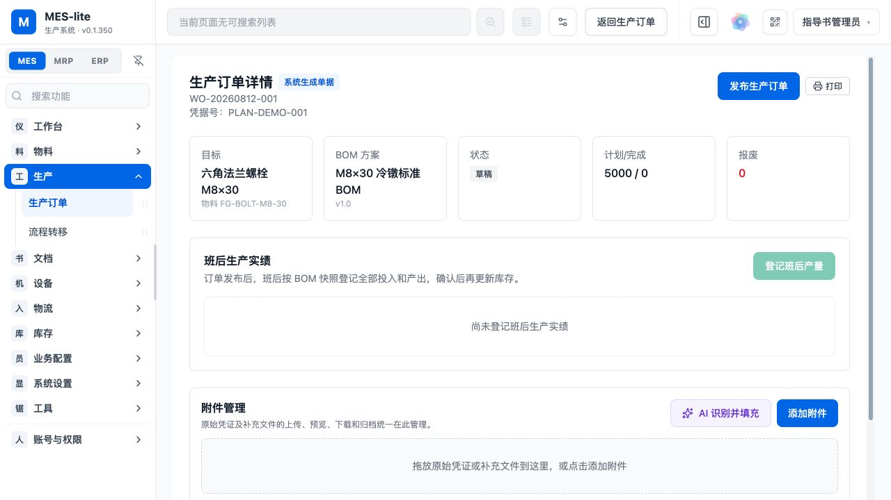

### 确认订单可执行

目的：确认发布后实绩入口已经解锁。

1. 发布完成后重新查看订单详情。
2. 确认状态为“已发布”。
3. 确认“登记班后产量”按钮可用。

结果检查：发布状态与操作按钮保持一致。

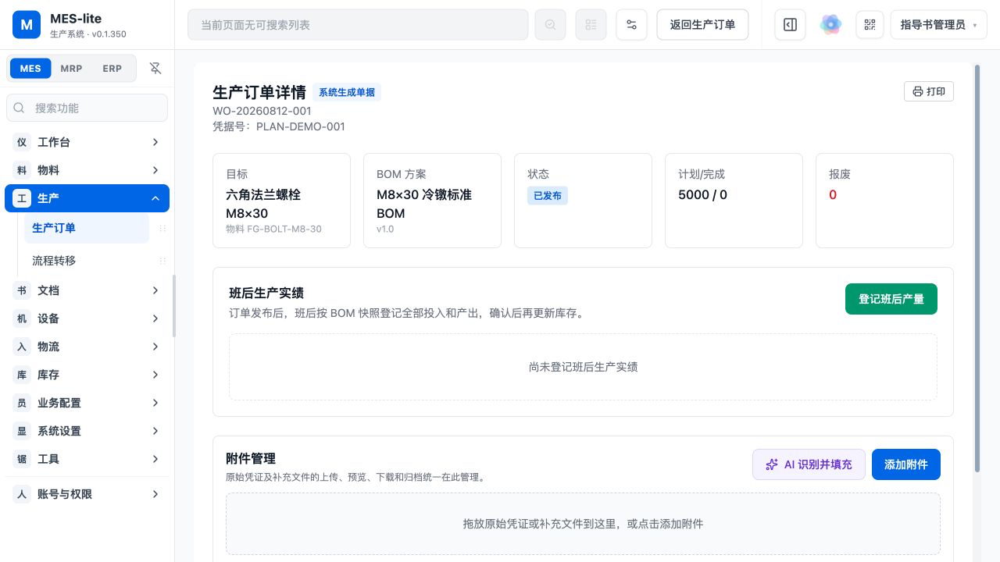

### 登记班后生产实绩

目的：按人员、设备、作业文件、投入和产出记录可回放的班后实绩。

1. 点击“登记班后产量”。
2. 填写实际日期并从启用员工中选择一人或多人。
3. 从订单工作中心范围内选择本次实际使用的设备。
4. 选择适用于订单物料或通用的已生效作业文件；工作中心由派工或路线决定。
5. 按现场记录填写实际投入、主产出、副产出及库位。
6. 保存后先核对实绩草稿中的人员、设备和文件版本快照，再执行确认。

结果检查：实绩草稿保存成功；确认前必须同时具备设备和作业文件快照，或分别填写明确的例外原因。

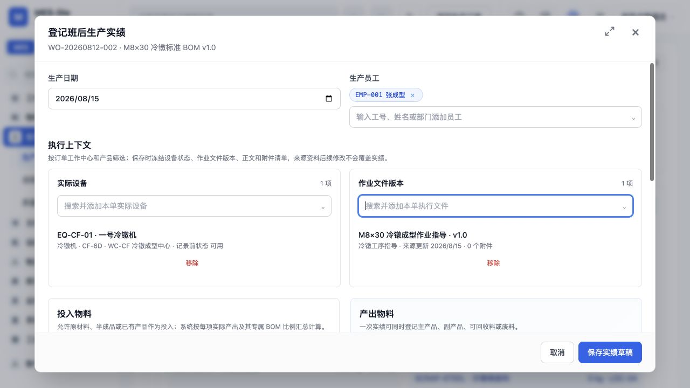

### 核对生产实绩执行上下文快照

目的：确认班后实绩保存的是当时实际设备和作业文件版本，而不是可漂移的主数据引用。

1. 打开生产订单详情并找到目标班后实绩。
2. 在“实际设备”中核对设备编码、名称、型号、状态和所属工作中心快照。
3. 在“作业文件”中核对标题、版本、状态、类别和适用物料快照；实际工作中心在实绩字段中单独核对。
4. 主数据后续调整时，以实绩卡片保存的历史快照解释当时执行条件。

结果检查：实绩卡片独立显示人、机、法证据；来源设备或文件后续修改不会改写既有快照。

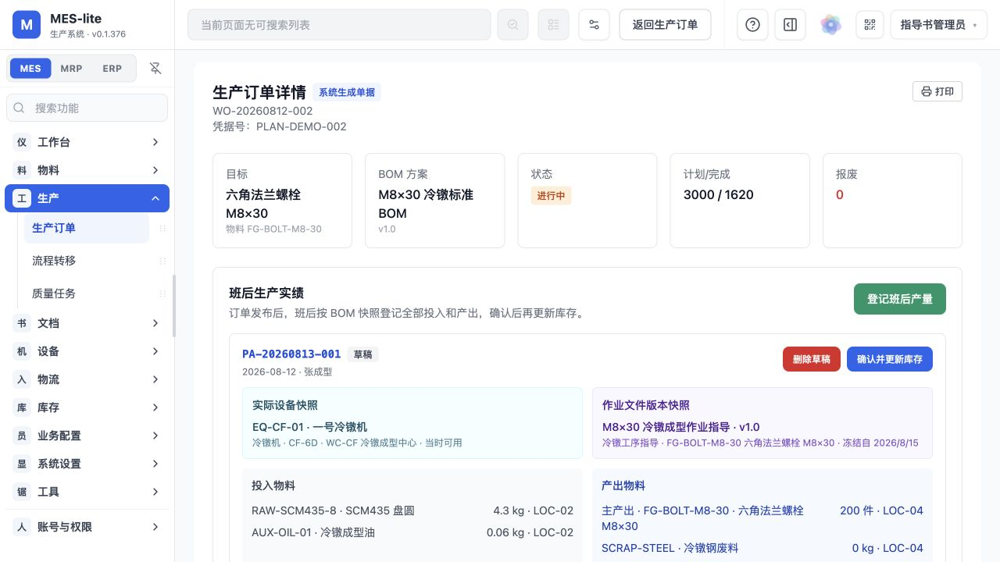

### 登记无设备或无作业文件的例外

目的：在合法的无设备或无文件场景保留可审计原因，避免用空值伪装完整执行记录。

1. 在登记实绩时确认本次确实没有可选择的实际设备或适用作业文件。
2. 对应选择保持为空，并在其例外原因中填写 2 到 200 个字符的具体说明。
3. 继续核对人员、投入、产出和库位后保存草稿。
4. 确认前再次核对例外原因；确认后原因与上下文快照均不可修改或删除。

结果检查：每一类缺失上下文都有明确原因；手机端保持单列滚动和底部保存操作，不遮挡最后一项。

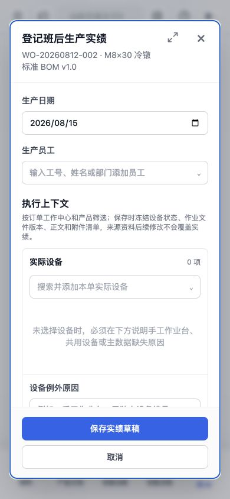

## 4. 生产产出批次与质检

### 查看产出批次与质量状态

目的：从生产实绩核对内部批次、检验单和当前库存状态。

1. 进入生产订单详情并展开已确认实绩。
2. 在每项产出下查看内部批次号和检验单号。
3. 区分待检、已放行和冻结状态。

结果检查：每项新产出具有唯一内部批次，待检任务只允许判定一次。

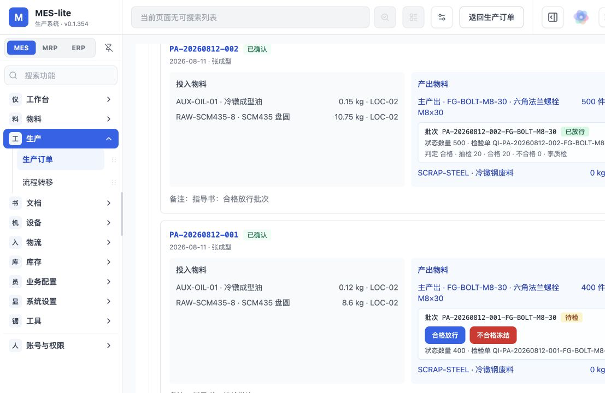

### 填写合格判定

目的：记录抽样结果并准备整批放行。

1. 在待检批次点击“合格放行”。
2. 录入抽检数量、合格数量和不合格数量。
3. 填写检验结论说明并核对批次号。

结果检查：合格数量与不合格数量之和等于抽检数量，整批合格时不合格数为 0。

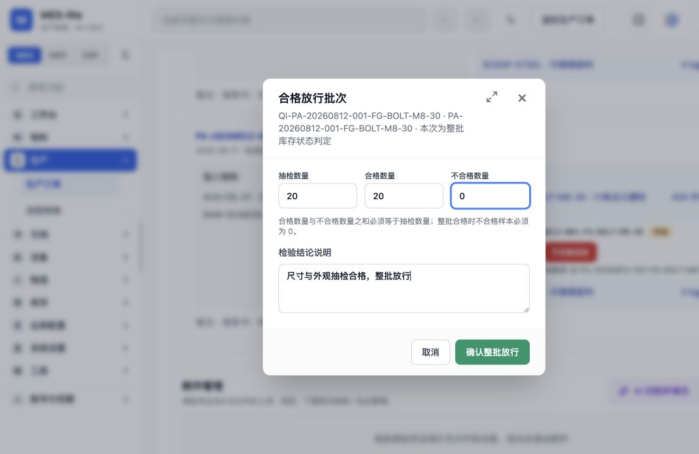

### 确认整批放行

目的：把检验合格的整批产出从待检转为可用。

1. 点击“确认整批放行”。
2. 等待保存成功并刷新订单详情。
3. 核对批次状态、判定人和抽样结果。

结果检查：批次显示“已放行”，待检库存减少、可用库存增加。

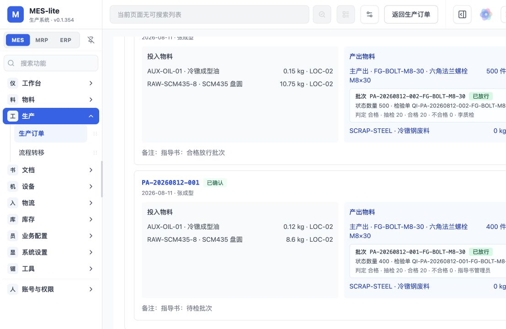

### 填写不合格判定

目的：记录不合格样本和冻结原因。

1. 在另一待检批次点击“不合格冻结”。
2. 录入抽检、合格和不合格数量。
3. 在说明中写清不合格现象和冻结原因。

结果检查：抽样关系校验通过，说明可供后续处置人员理解。

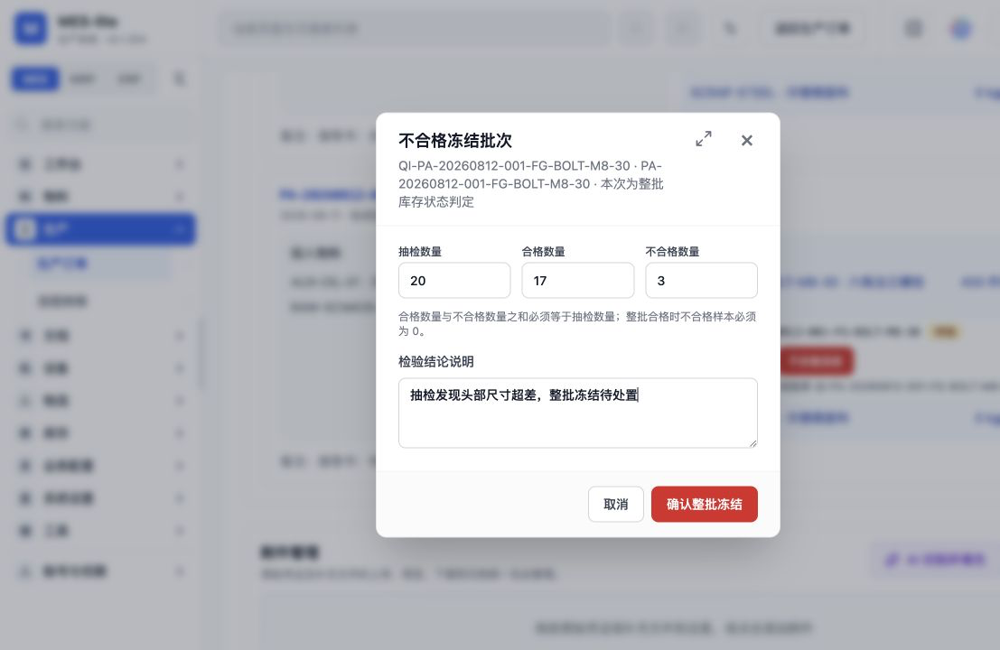

### 确认整批冻结

目的：阻止不合格产出进入领料或发货可用量。

1. 点击“确认整批冻结”。
2. 等待保存成功并刷新订单详情。
3. 核对批次状态、判定人和抽样结果。

结果检查：批次显示“冻结”，待检库存减少、冻结库存增加。

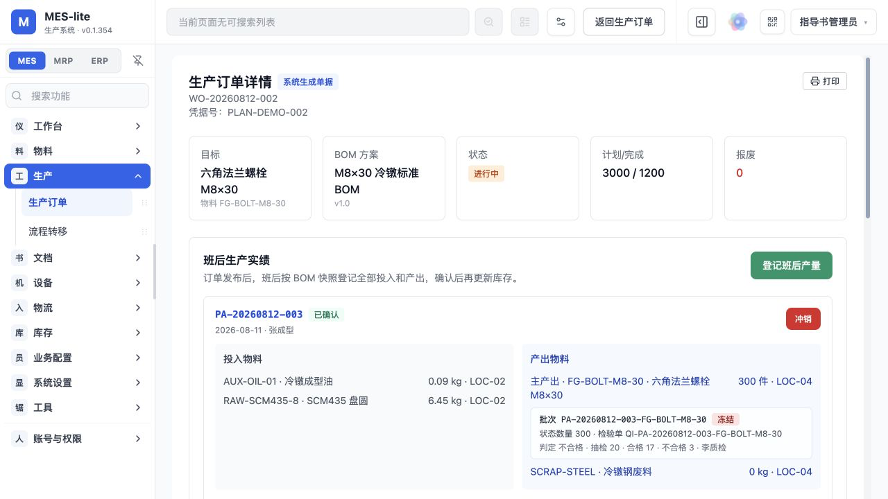

### 核对库存状态

目的：在库存总账复核质量判定后的可用、待检和冻结数量。

1. 展开“库存”功能区，进入“库存管理”。
2. 搜索质检涉及的产出物料。
3. 核对总量、可用、待检、冻结及库位余额。

结果检查：总库存等于可用、待检和冻结之和，质量判定不改变总量或总成本。

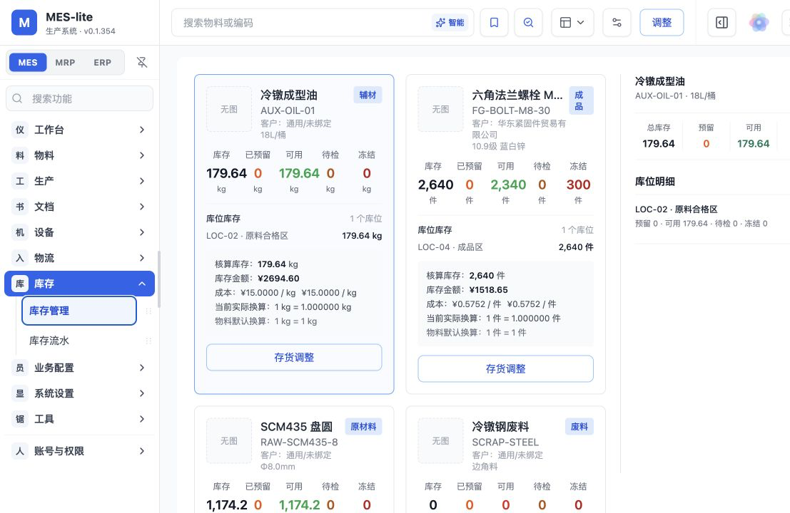

### 核对质量状态流水

目的：确认放行或冻结可以从统一库存流水回放。

1. 展开“库存”功能区，进入“库存流水”。
2. 搜索产出物料或质量来源。
3. 核对 QUALITY RELEASE / QUALITY HOLD、批次、状态方向、操作人和时间。

结果检查：状态转换流水数量变化为 0，但明确记录待检到可用或冻结的转换。

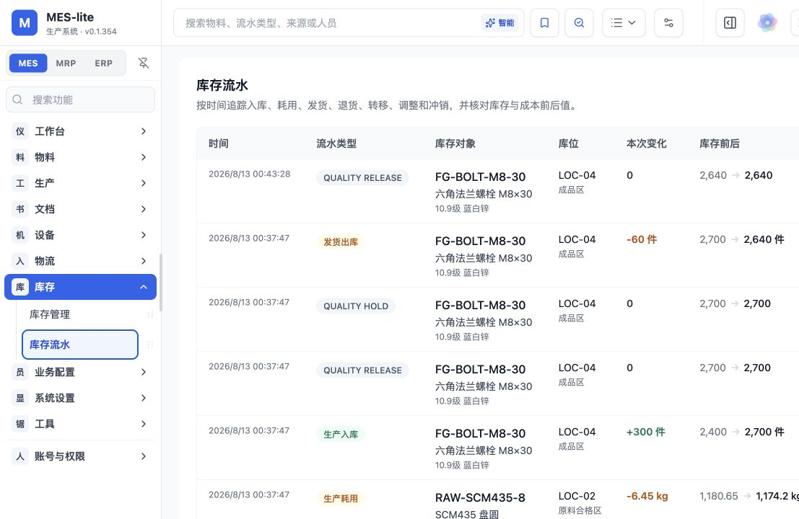

## 5. 质量任务与不合格处置

### 启用来料检验标准

目的：只为需要来料质量控制的物料显式启用入库待检。

1. 展开“生产”功能区，进入“质量任务”，点击“检验标准”。
2. 新建或复制标准，选择物料和“来料入库待检”来源。
3. 配置抽样方式、最低/最高数量和逐项接收标准。
4. 完成质量审批后发布标准。

结果检查：已发布标准显示“来料入库”；只有该物料后续收货会自动转待检，未启用标准的物料保持直接可用。

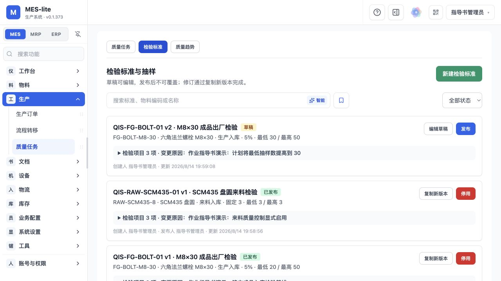

### 接收来料检验任务

目的：由质检岗位接收仓管收货后自动生成的来料检验任务。

1. 展开“生产”功能区，进入“质量任务”。
2. 在“待检任务”中按内部批号、物料或来料单搜索。
3. 核对来源显示“来料入库”、检验单号、标准快照和建议抽样数。
4. 展开检验项目快照，确认接收标准与来料检验计划一致。

结果检查：质检员可读取授权库位的任务；仓管员只能完成收货，不能代替质量判定。

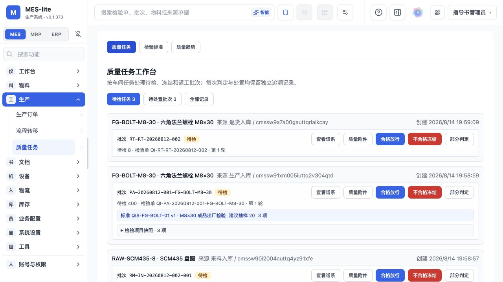

### 逐项判定来料质量

目的：按生效标准和建议抽样数完成来料逐项检验。

1. 在来料待检任务点击“合格放行”“不合格冻结”或“部分判定”。
2. 进入全屏表单，核对抽检、合格和不合格样本数量。
3. 逐项选择结果，填写实测值、项目备注和检验结论。
4. 确认总判定与逐项结果一致后提交。

结果检查：系统拒绝低于标准建议抽样数、项目缺失或总判定矛盾的提交。

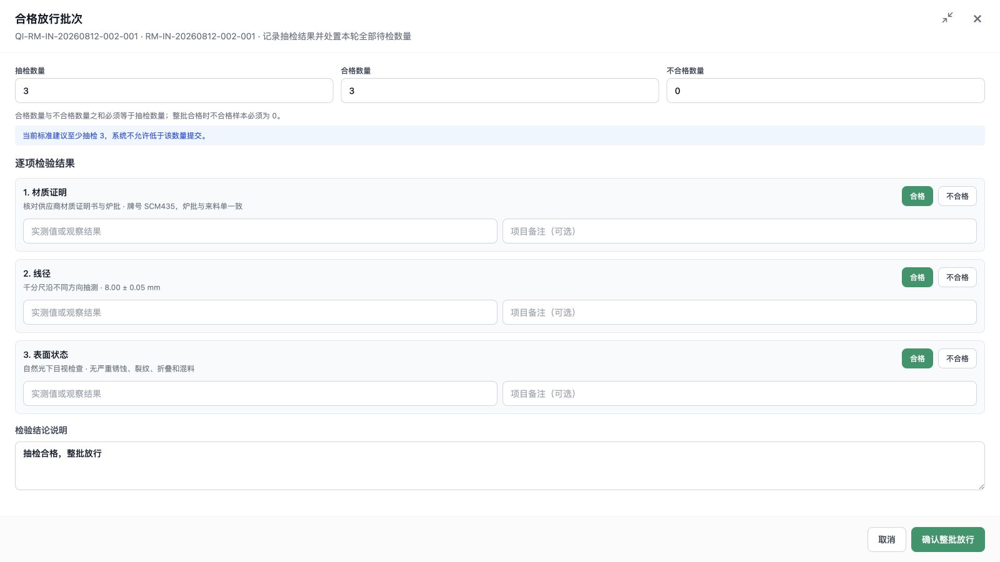

### 核对来料合格放行

目的：确认来料库存由待检转为可用并保留完整检验事实。

1. 切换质量任务“全部记录”。
2. 按来料内部批号搜索已完成检验。
3. 核对“已放行”数量、标准快照、抽样和判定人。
4. 在库存或批次谱系复核同批次可用余额。

结果检查：同一批次待检余额归零、可用余额增加，总数量和总成本不变。

### 查看来料质量趋势

目的：单独分析供应来料的批次和样本质量表现。

1. 点击“质量趋势”。
2. 选择日期范围，并把来源切换为“来料入库”。
3. 点击“刷新统计”。
4. 核对完成批次、批次合格率、样本合格率、不合格项目和物料排名。

结果检查：趋势只统计已完成来料检验，不把待检或已随红冲取消的任务计入分母。

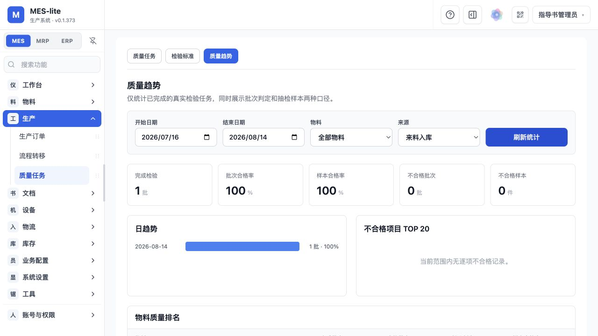

### 查看检验标准版本

目的：按物料和任务来源查看草稿、已发布和已停用标准。

1. 展开“生产”功能区，进入“质量任务”。
2. 点击页内“检验标准”。
3. 使用智能搜索覆盖标准、物料、抽样、检验项和人员；需要精确组合时打开高级搜索并按实际字段填写条件。
4. 展开检验项目，核对方法、接收标准和变更原因。

结果检查：同一标准编码的多个版本独立显示，只有草稿可编辑。

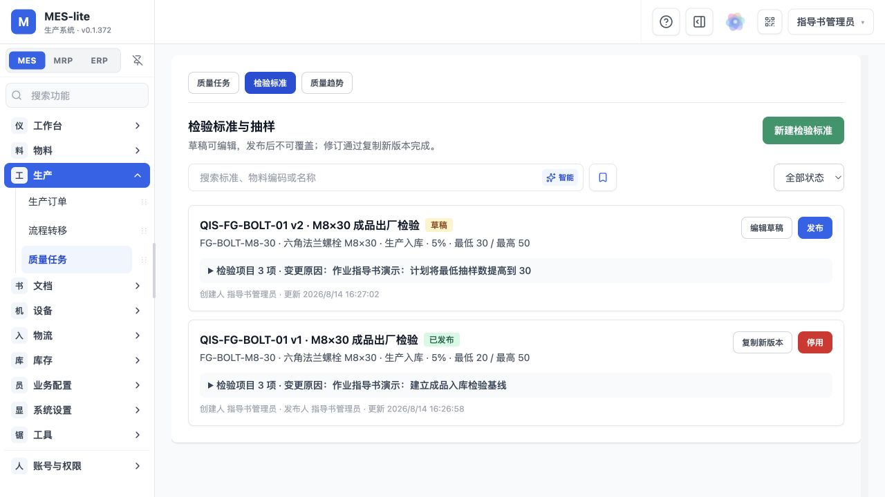

### 新建检验标准草稿

目的：为物料建立任务来源、抽样规则和完整检验项目。

1. 在检验标准页点击“新建检验标准”。
2. 填写编码和名称，搜索并选择适用物料。
3. 选择生产入库、来料入库待检或退货入库来源，设置全检、固定数量或比例抽样。
4. 逐项添加项目名称、检验方法和接收标准。
5. 填写建立原因并保存草稿。

结果检查：标准以 v1 草稿建立，发布前可继续编辑。

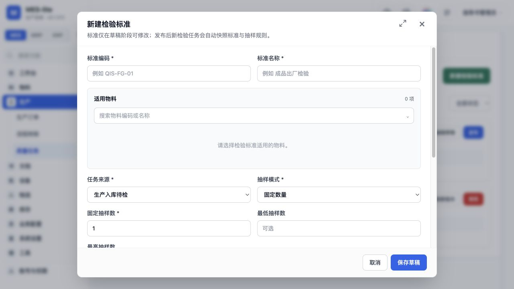

### 发布检验标准新版本

目的：使新检验任务引用经批准版本，同时保留旧版历史。

1. 在草稿行展开项目并完成发布前复核。
2. 点击“发布”并确认不可覆盖提示。
3. 核对新版本显示“已发布”。
4. 核对同物料同来源的旧发布版本自动显示“已停用”。

结果检查：同物料同来源始终只有一个生效版本，历史任务快照不受影响。

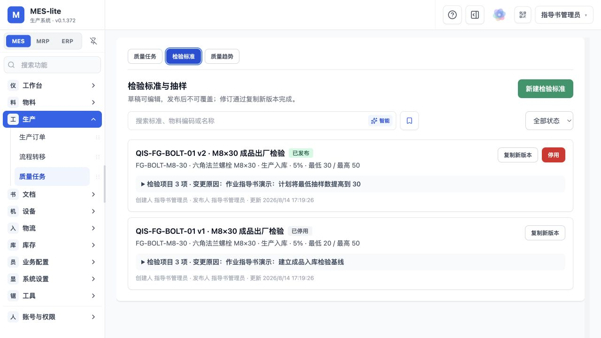

### 核对检验任务标准快照

目的：确认待检批次自动带入当时生效标准和建议抽样数。

1. 进入“质量任务”并搜索待检批次。
2. 核对标准编码、版本、名称和建议抽样数。
3. 展开“检验项目快照”核对任务建立时的接收标准。

结果检查：任务保留独立快照，后续发布新标准不会改写已建任务。

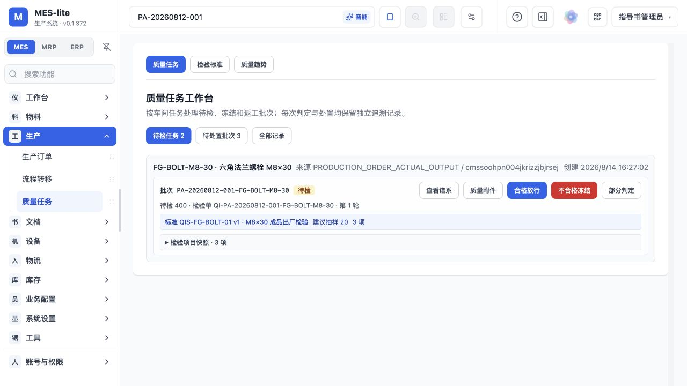

### 按标准逐项记录检验结果

目的：按建议抽样数填写样本结果并完成每个标准项判定。

1. 在待检任务选择合格、不合格或部分判定。
2. 确认抽检数量不低于标准建议值。
3. 为每个检验项选择合格或不合格，填写实测值和必要备注。
4. 填写结论说明并提交。

结果检查：系统校验抽样下限、全部项目完整性和总判定一致性。

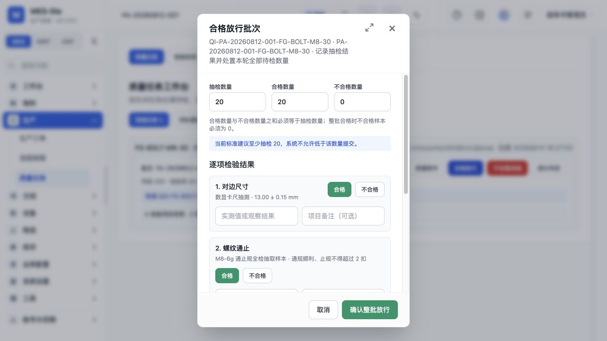

### 上传质量检验凭证

目的：把测量报告、现场照片或客户凭证绑定到具体检验单。

1. 在检验任务点击“质量附件”。
2. 点击“上传文件”并选择 50 MB 以内的凭证。
3. 上传后核对附件数量和缩略入口。
4. 点击附件确认可通过受权 API 预览。

结果检查：附件只对拥有质量任务、附件权限且在授权库位范围内的人员可见。

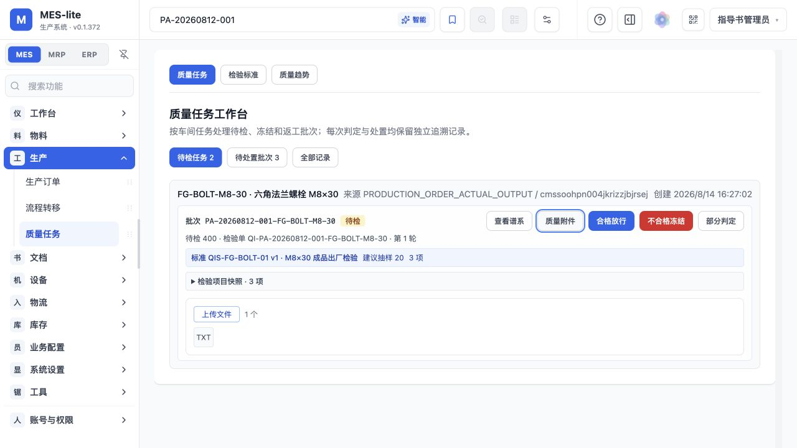

### 查看质量趋势

目的：按日期、物料和来源分析批次与样本质量。

1. 点击页内“质量趋势”。
2. 选择日期范围，必要时限定物料或任务来源。
3. 区分批次合格率与样本合格率，不得混用。
4. 查看日趋势、不合格项目排名和物料质量排名。

结果检查：统计只包含已完成真实检验，超过 5000 条时明确提示截断。

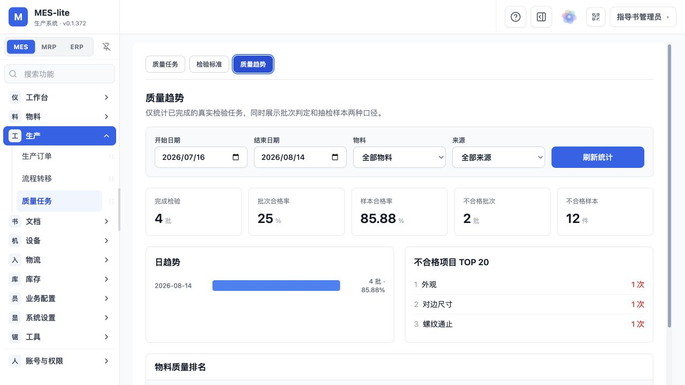

### 进入质量任务工作台

目的：按车间待办集中查看待检和待处置批次。

1. 展开“生产”功能区，进入“质量任务”。
2. 先查看待检任务数量，再查看待处置批次数量。
3. 使用智能搜索覆盖检验、批次、物料、标准、项目和处置；需要精确组合时打开高级搜索并按实际字段填写条件。

结果检查：页面显示待检、待处置和全部记录三个任务视图。

### 填写部分判定

目的：把同一待检批次按合格和不合格数量拆分。

1. 在待检任务点击“部分判定”。
2. 填写抽检、合格和不合格样本数量。
3. 填写放行数量、冻结数量和结论说明。
4. 确认放行与冻结之和等于本轮待检数量。

结果检查：表单通过样本关系和整批处置数量校验。

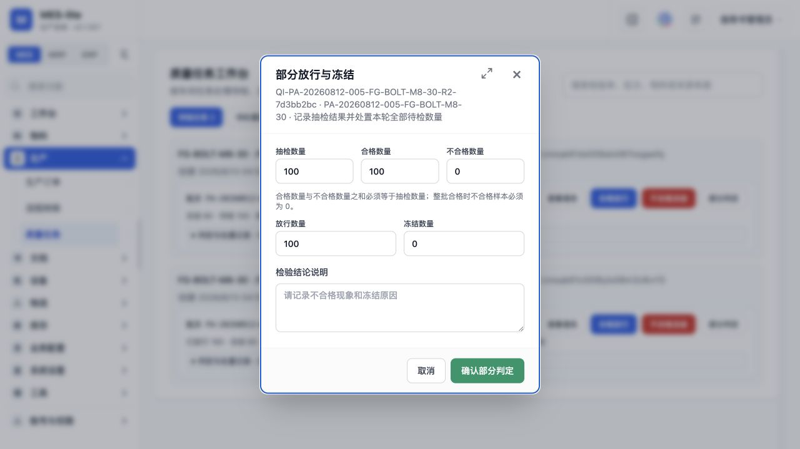

### 核对部分放行结果

目的：确认合格部分可用、不合格部分冻结。

1. 提交部分判定后切换“待处置批次”。
2. 找到刚处理的内部批次。
3. 核对已放行、冻结、抽检结果和判定人。

结果检查：同一批次同时显示已放行和冻结余额，总量与判定前一致。

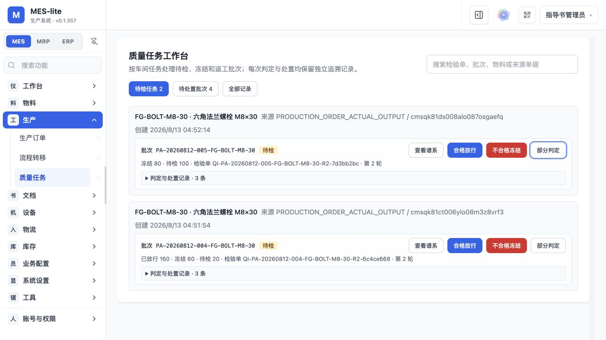

### 查看判定与处置记录

目的：审计同一批次的每次状态变化。

1. 展开“判定与处置记录”。
2. 核对判定放行和判定冻结的数量。
3. 核对原因、操作人和独立处置编号。

结果检查：每个动作都有独立、不可覆盖的质量处置记录。

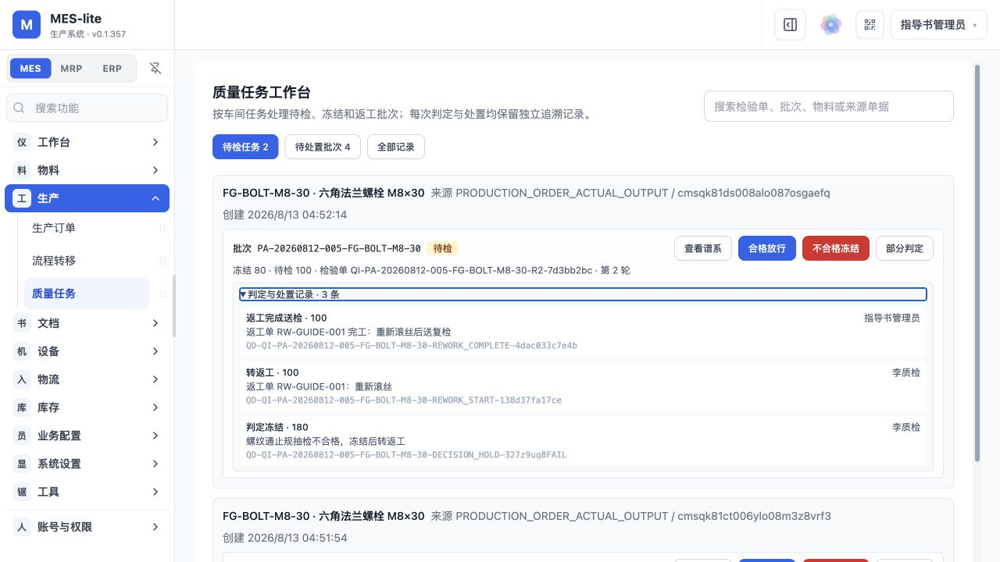

### 申请复检

目的：从冻结库存抽取指定数量进入新一轮待检。

1. 在冻结批次点击“申请复检”。
2. 填写处置数量。
3. 填写复检申请号、原因或审批依据。
4. 点击“确认送复检”。

结果检查：指定数量由冻结转为待检，并生成新的检验轮次。

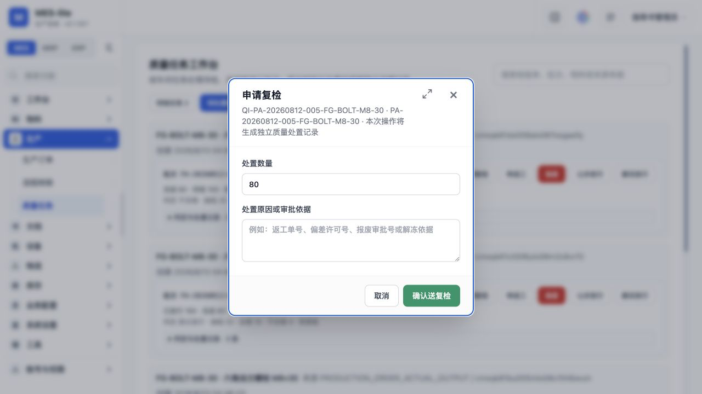

### 核对复检任务

目的：确认新一轮检验单与批次余额同步生成。

1. 切换到“待检任务”。
2. 找到复检批次。
3. 核对冻结余量、待检数量、新检验单号和轮次。

结果检查：页面显示第 2 轮检验单，原冻结余额按复检数量减少。

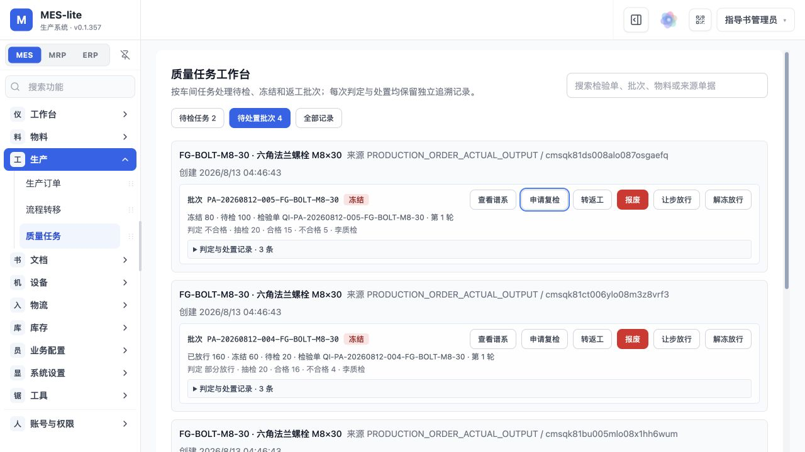

### 返工完成送检

目的：把完成返工的数量重新送入质量检验。

1. 在含返工余额的批次点击“返工完成送检”。
2. 填写本次完工数量。
3. 填写返工单号和完工说明。
4. 确认返工完成送检。

结果检查：本次数量由返工中转为待检并生成复检任务。

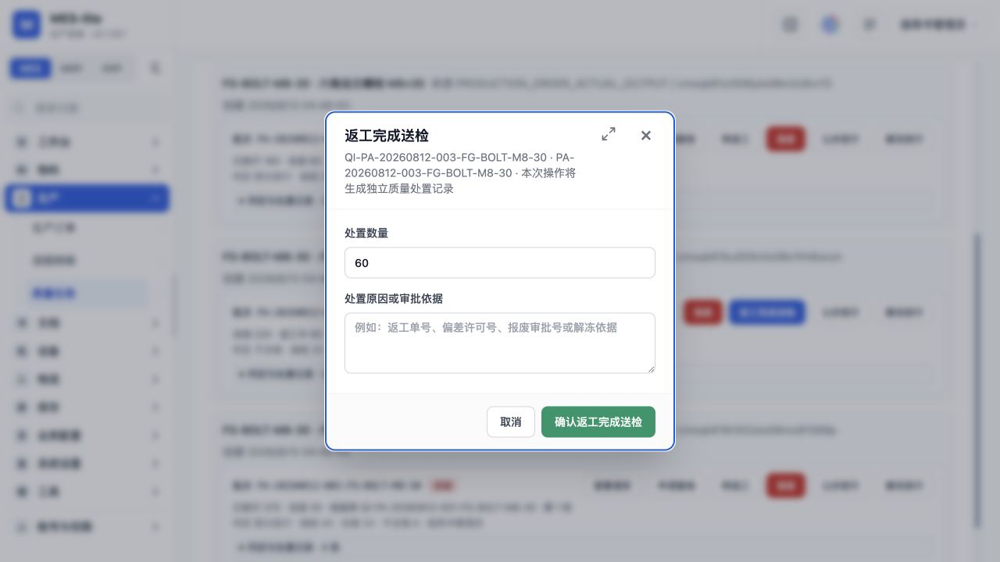

### 核对返工复检任务

目的：确认返工不会直接恢复为可用库存。

1. 切换到“待检任务”。
2. 找到返工完成批次。
3. 核对冻结余量、待检数量和第 2 轮检验单。

结果检查：返工完成数量保持待检隔离，必须再次质量判定。

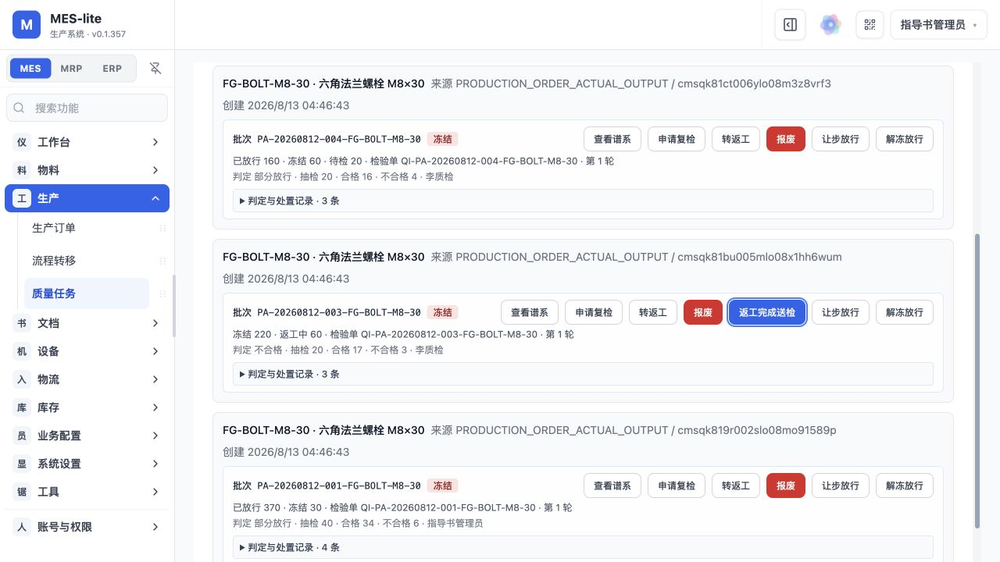

### 转入返工

目的：把可返修的冻结数量转为返工中状态。

1. 在冻结批次点击“转返工”。
2. 填写返工数量。
3. 填写返工单号、返工内容和审批依据。
4. 确认转返工。

结果检查：冻结库存减少，返工中库存等量增加。

### 核对返工中状态

目的：确认返工库存不能被领料或发货。

1. 提交转返工后留在待处置视图。
2. 核对冻结余额和返工中余额。
3. 展开处置记录核对返工动作。

结果检查：返工中数量单独列示，不计入可用库存。

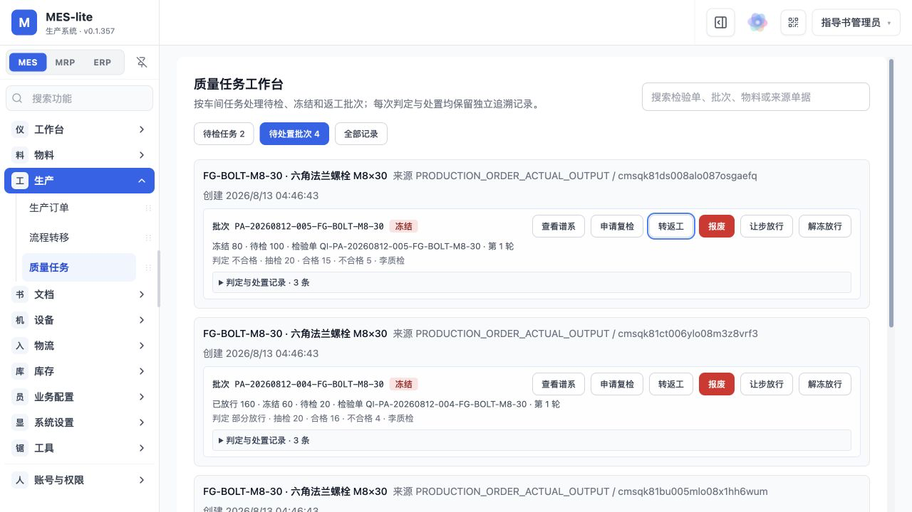

### 提交质量报废

目的：从冻结库存中报废无法返修的数量。

1. 在冻结批次点击“报废”。
2. 填写报废数量。
3. 填写报废审批号和原因。
4. 确认报废前再次核对批次与数量。

结果检查：报废表单包含明确审批依据，且只能使用冻结余额。

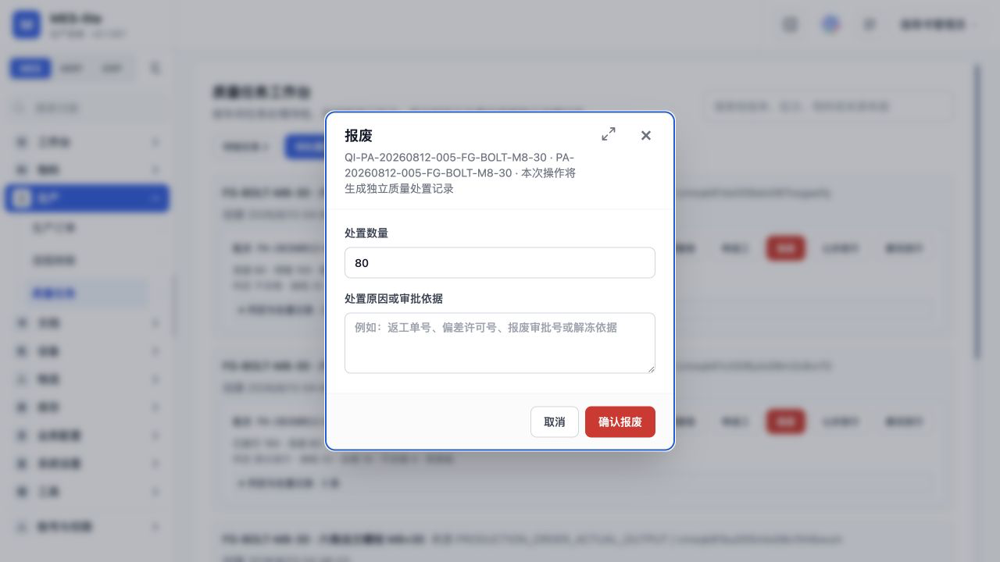

### 核对报废结果

目的：确认报废同步减少库存数量与批次成本。

1. 提交报废后查看成功提示。
2. 核对冻结余额按报废数量减少。
3. 展开处置记录核对报废动作和审批号。
4. 在库存流水复核质量报废记录。

结果检查：总库存与总成本按批次比例减少，处置历史保留。

### 执行让步放行

目的：依据客户偏差许可放行指定冻结数量。

1. 具有授权放行权限的主管点击“让步放行”。
2. 填写数量。
3. 填写客户偏差许可号和适用条件。
4. 确认让步放行。

结果检查：只有配置质量放行权限的人员可以提交。

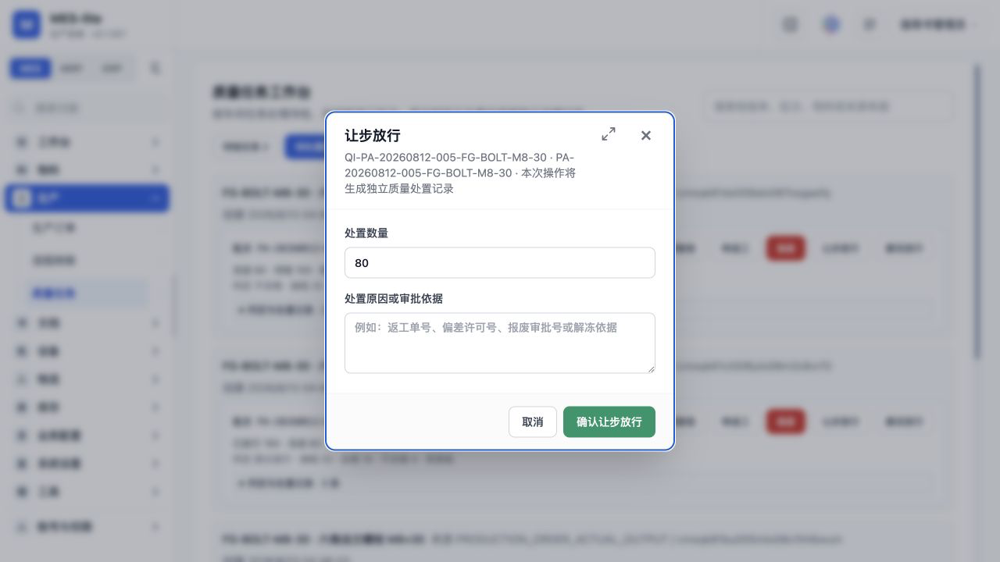

### 核对让步放行结果

目的：确认让步数量恢复为可用并可追溯审批依据。

1. 提交后核对已放行和冻结余额。
2. 展开处置记录。
3. 核对让步放行数量、操作人和偏差许可号。

结果检查：可用库存增加、冻结库存等量减少，总库存和总成本不变。

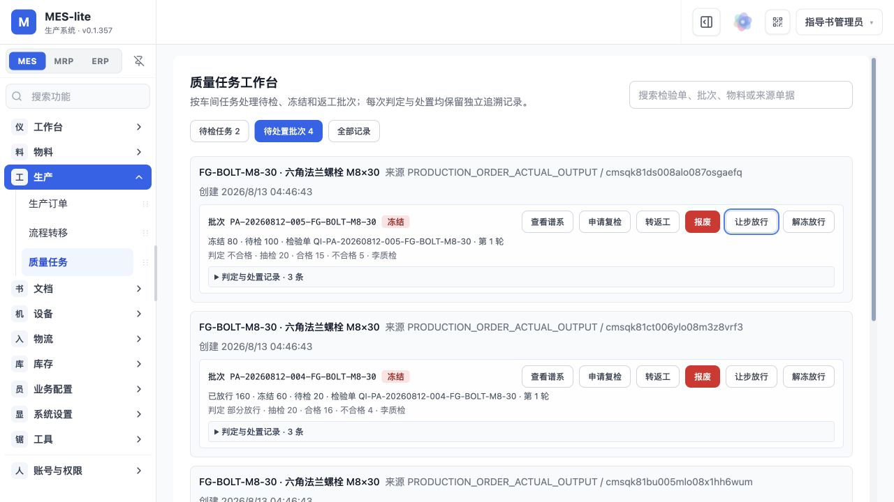

### 执行解冻放行

目的：在冻结原因已纠正后授权恢复可用。

1. 具有授权放行权限的主管点击“解冻放行”。
2. 填写数量。
3. 填写解冻审批号、纠正措施和复核说明。
4. 确认解冻放行。

结果检查：解冻原因和审批依据不能为空。

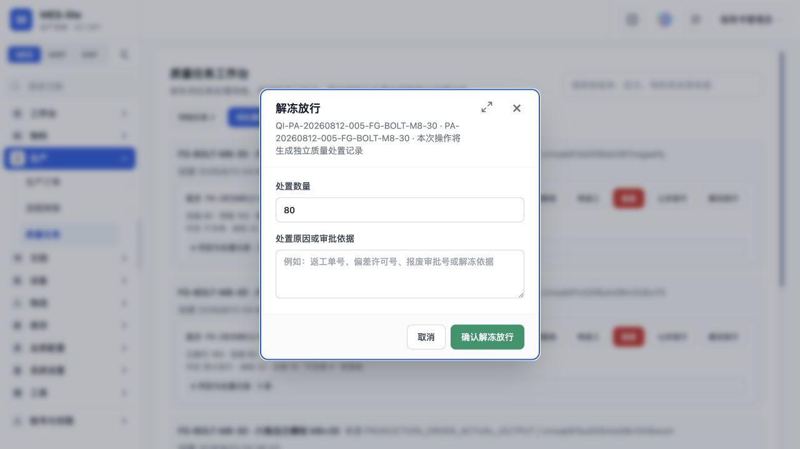

### 核对授权放行历史

目的：从同一批次回放让步、解冻和初始判定。

1. 提交解冻后展开处置历史。
2. 核对解冻放行和让步放行分别记录。
3. 向下核对初始判定冻结与放行记录。

结果检查：四条动作各自保留数量、原因、人员和处置编号。

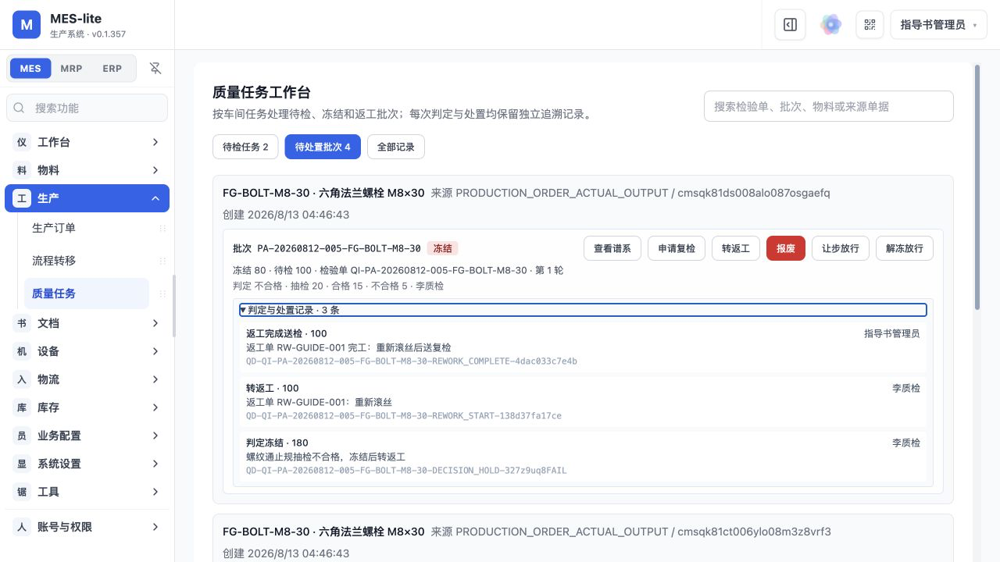

### 核对五类库存状态

目的：在库存总账确认可用、待检、冻结和返工中守恒。

1. 展开“库存”功能区，进入“库存管理”。
2. 搜索质量处置物料。
3. 核对总库存、预留、可用、待检、冻结和返工中。
4. 核对库位明细使用相同状态口径。

结果检查：可用量等于总量减预留、待检、冻结和返工中；返工品不可出库。

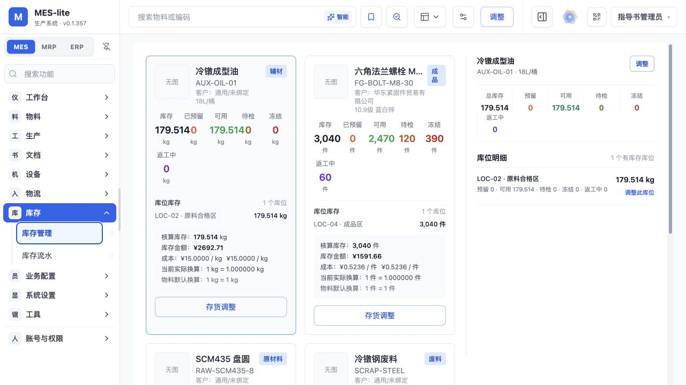

### 配置质量操作权限

目的：按岗位拆分查看、判定、处置和授权放行权限。

1. 进入账号与权限 > 组权限。
2. 分别配置质量任务查看、质量判定、复检/返工/报废处置、让步/解冻放行。
3. 按岗位只勾选必要的查、增、改权限。
4. 保存后使用目标账号复核菜单和按钮。

结果检查：检验员、处置人员和质量主管的高风险操作可以分离授权。

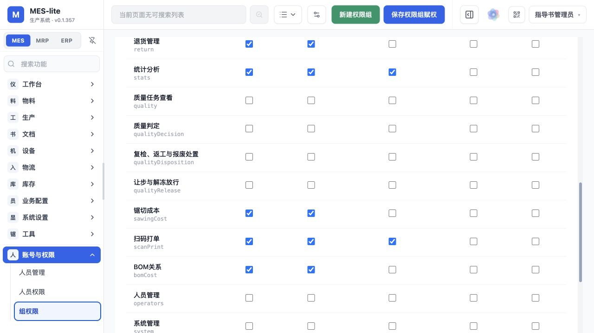

## 6. 来料到生产批次谱系

### 核对来料内部批次

目的：确认收货后的内部批号与供应商炉批号并存。

1. 展开“物流”功能区，进入“来料管理”。
2. 打开状态为“已收货”的来料单详情。
3. 在物料明细的批次列同时核对供应批号和内部批号。

结果检查：内部批号以 RM- 开头，供应批号与原始单据一致。

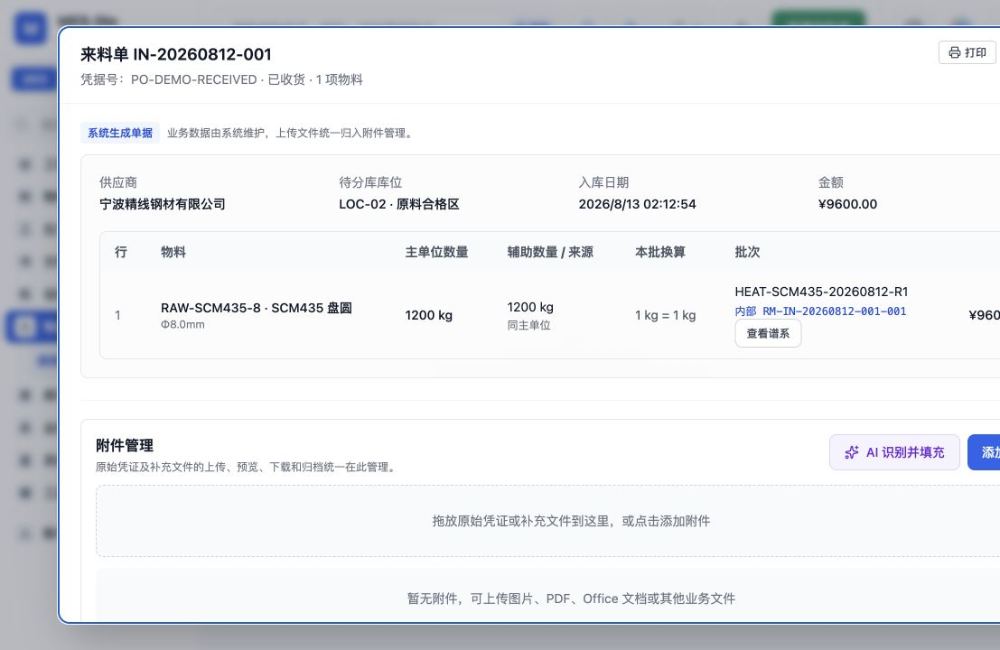

### 查看原料批次追溯

目的：从来料批次查看来源、库位余额和下游产出。

1. 在已收货来料明细点击“查看谱系”。
2. 核对当前批次的物料、来源单据和各库位可用余额。
3. 查看右侧下游产出批次数量。

结果检查：来料批次无上游；已投入生产时可看到下游产出。

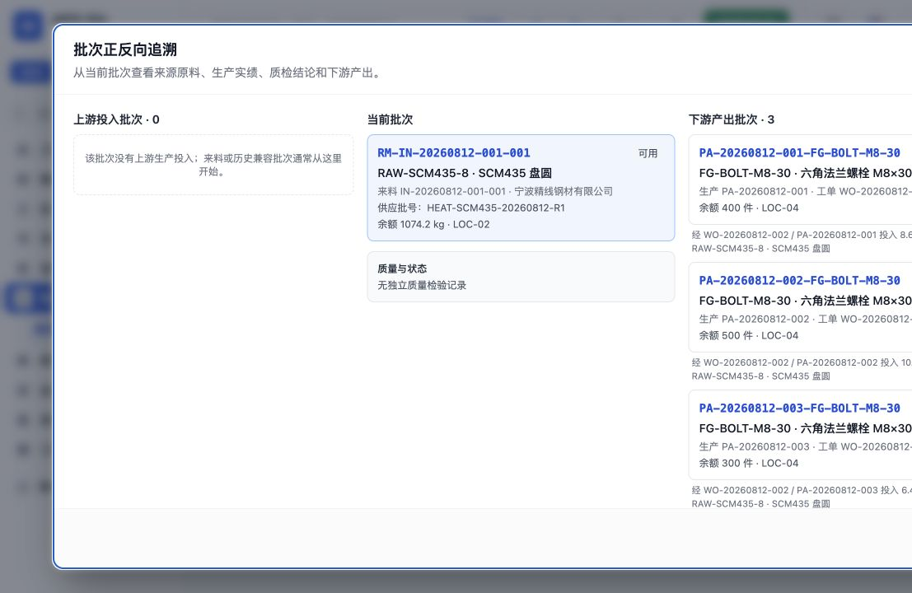

### 确认生产批次谱系

目的：在改变库存前复核 FIFO 分配和谱系生成的事务边界。

1. 打开已发布生产订单的班后实绩。
2. 在待确认实绩点击“确认并更新库存”。
3. 阅读弹窗中的投入扣减、FIFO、产出待检和整笔回滚提示。
4. 无误后点击“确认并生成批次谱系”。

结果检查：库存不足时整笔不生效；成功时实绩转为已确认。

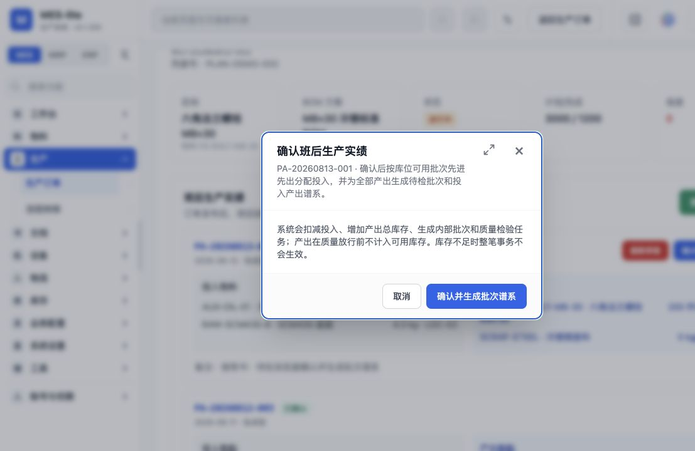

### 核对投入批次分配

目的：核对本次实绩实际消耗的内部批次、供应批号和数量。

1. 确认完成后等待实绩卡片刷新。
2. 在“投入物料”中查看批次明细。
3. 核对内部批号、供应批号、库位和分配数量。
4. 展开产出卡的“投入批次谱系”复核父批次。

结果检查：各投入分配合计等于本次实际投入，产出谱系显示同一来源批次。

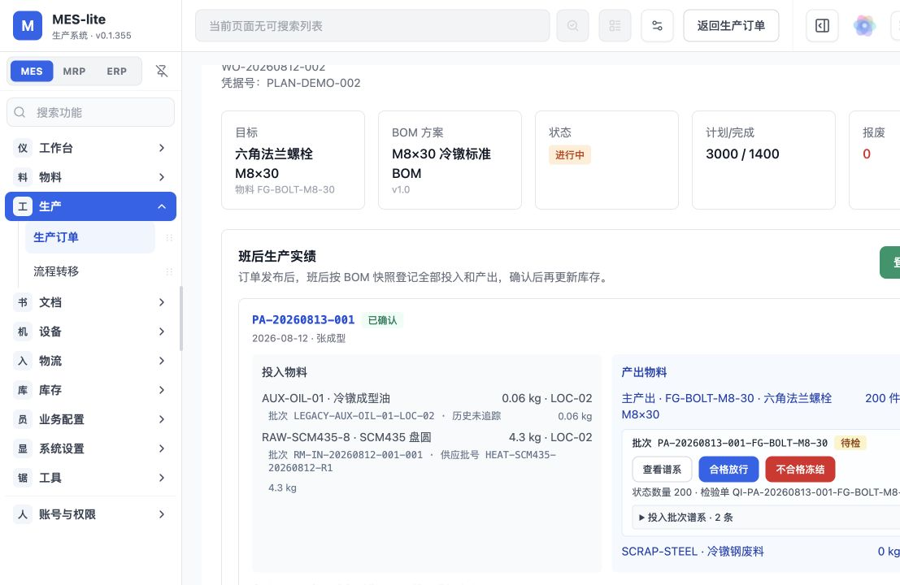

### 从产出批次反查上游

目的：从成品内部批次反查所有投入和供应商炉批。

1. 在产出批次卡点击“查看谱系”。
2. 在中间核对产出批号、质检单和待检余额。
3. 在左侧核对所有投入批次、物料和分配数量。

结果检查：产出批次能反查原料内部批号和供应批号。

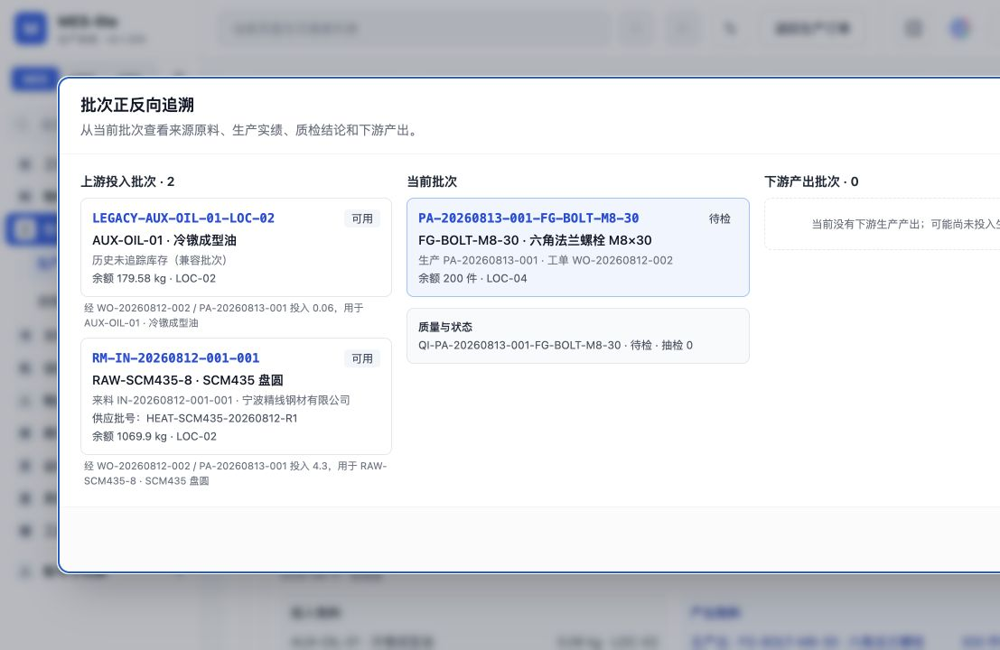

### 从原料批次正查下游

目的：沿相邻谱系节点返回原料批次并查看全部下游产出。

1. 在产出追溯弹窗点击左侧原料批次。
2. 确认中间当前批次已切换为来料批次。
3. 在右侧查看所有相邻下游产出，需要时可继续点击。

结果检查：同一原料批次对应的多个生产产出均可查看，弹窗不重叠。

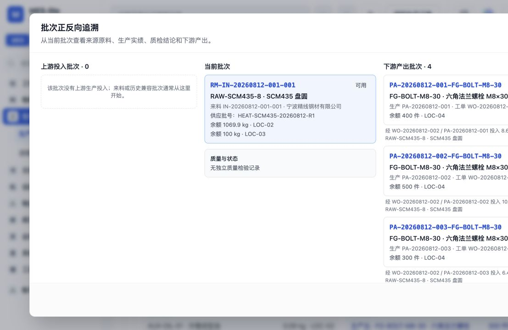

## 7. 派工与流程转移

### 查看派工

目的：查看生产任务的人员和工作中心分配。

1. 展开“生产”功能区，进入“派工管理”。
2. 按任务、人员或状态筛选。
3. 核对生产订单、工作中心和执行人员。

结果检查：待处理派工及其来源订单可追溯。

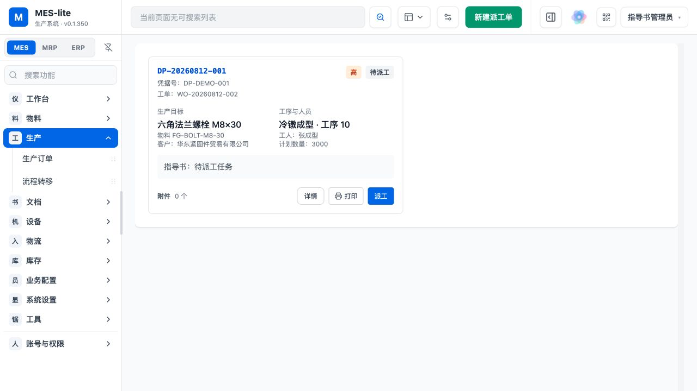

### 新建派工

目的：把已发布生产任务分配到员工和工作中心。

1. 点击“新建派工”。
2. 选择生产订单、员工、工作中心和计划时间。
3. 填写要求并保存。
4. 需要纸质单据时，保存后在派工清单点击“打印”。

结果检查：派工记录出现在列表并可跟踪状态。

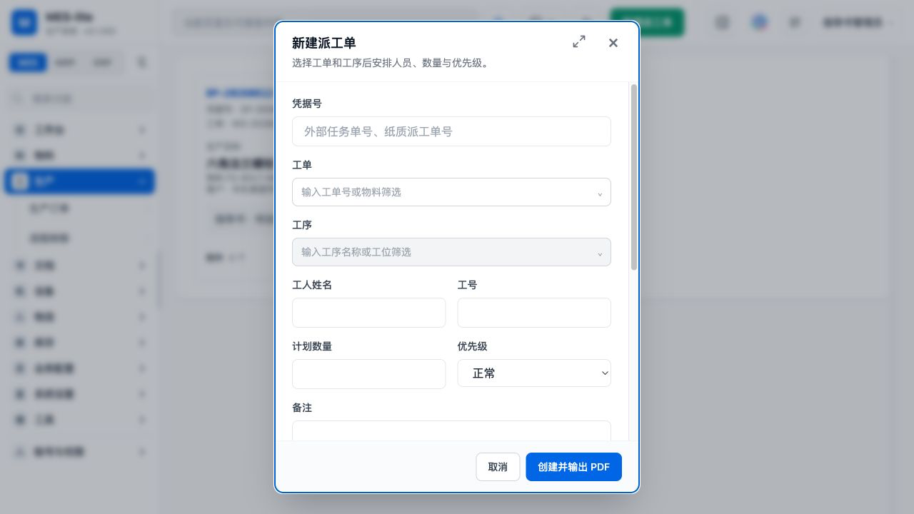

### 查看流程转移

目的：跟踪物料在流程节点或库位间的移动。

1. 展开“生产”功能区，进入“流程转移”。
2. 搜索转移单号、物料或员工。
3. 核对来源库位、目标库位、数量和状态。

结果检查：列表完整显示待处理与已完成转移。

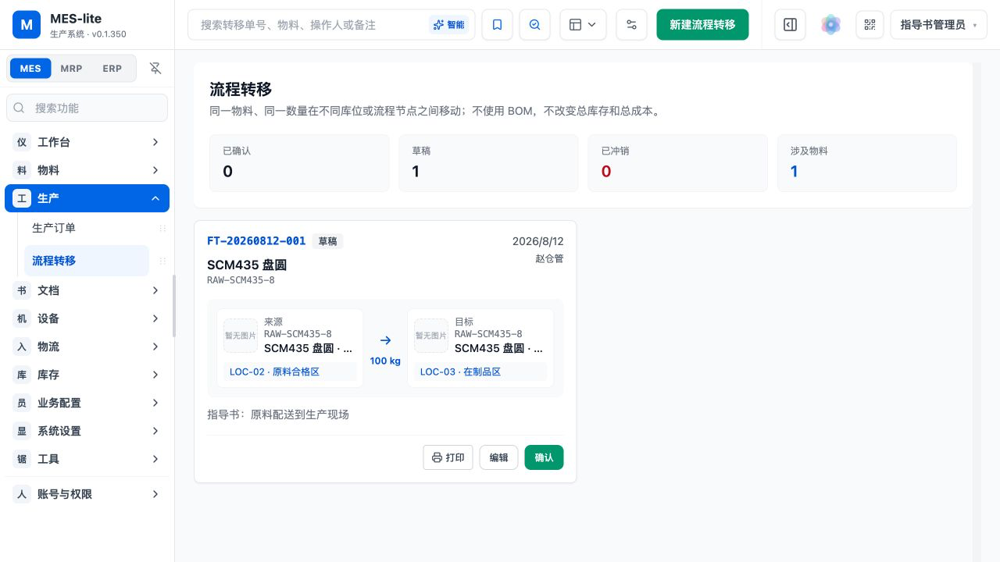

### 新建流程转移

目的：登记同一物料的现场流转。

1. 点击“新建流程转移”。
2. 选择物料、来源库位、目标库位和数量。
3. 填写执行员工、节点和备注后保存。
4. 需要纸质单据时，保存后在流程转移清单点击“打印”。
5. 审批/完成后检查库位库存。

结果检查：转移完成后总库存不变，库位分布变化。

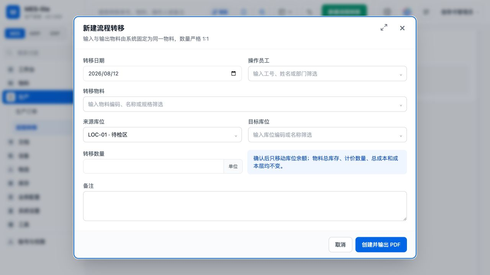

## 8. 来料与库存闭环

### 查看来料单

目的：查看供应商来料及收货状态。

1. 展开“物流”功能区，进入“来料管理”。
2. 按单号、供应商或物料搜索。
3. 核对采购数量、实测数据、计价和状态。

结果检查：待收货与已收货单据清晰区分。

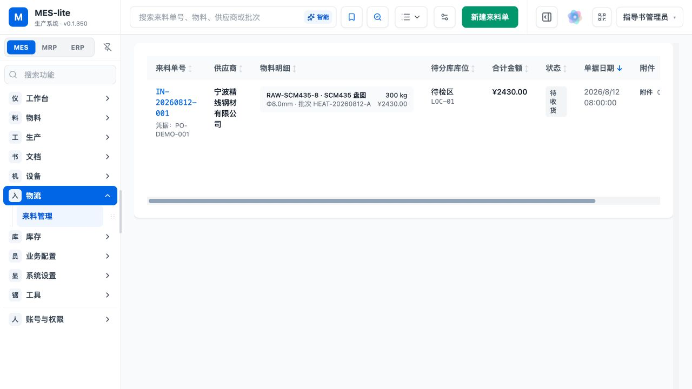

### 新建来料单

目的：登记供应商原材料到货。

1. 点击“新建来料单”。
2. 选择供应商、物料、收货库位。
3. 填写数量、实测重量、单价、凭据和附件。
4. 添加多项物料时，在右侧“本单已加入”清单中滚动核对全部明细；需要调整时点击“编辑”，在左侧修改后点击“保存本项修改”，或点击“取消编辑”放弃调整。
5. 创建后保留为待收货，等待现场确认。
6. 修改已有待收货来料单时，点击“保存整单”提交当前全部修改并留在编辑窗口；可继续编辑下一条，全部完成后点击“关闭”。
7. 需要纸质单据时，保存后在来料清单或详情点击“打印”。

结果检查：右侧清单可滚动查看全部已加入物料，并可编辑后按原项替换而不产生重复明细；已有待收货单据保存后不退出，可连续修改多条明细，来料单生成后库存尚未增加。

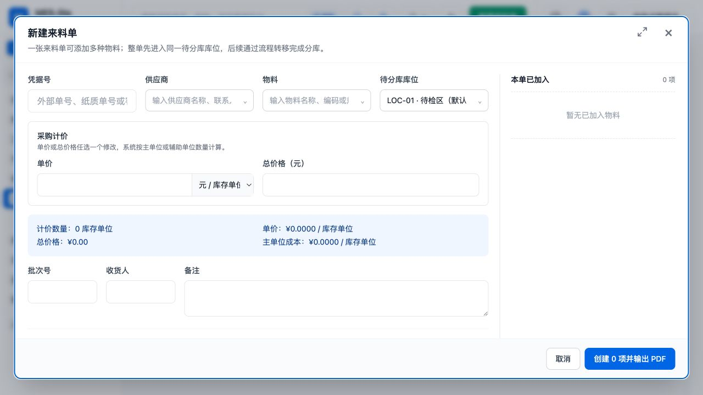

### 确认收货

目的：确认实物到厂并增加指定库位库存。

1. 在待收货记录上点击“收货”。
2. 再次核对物料、数量和库位。
3. 确认操作后查看成功提示。

结果检查：状态变为“已收货”，库存和流水同步增加。

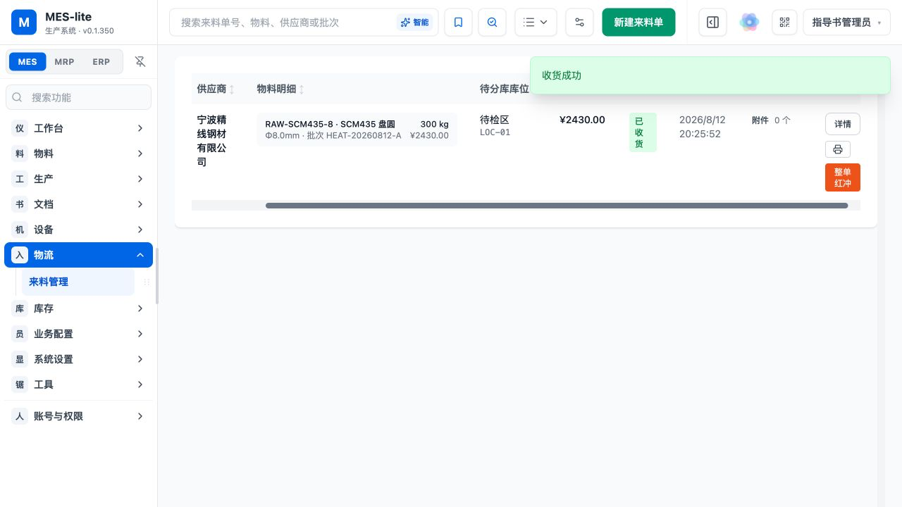

### 确认启用质检的来料收货

目的：仓管员确认实物到厂，并把受控物料交接到待检库存。

1. 展开“物流”功能区，进入“来料管理”并搜索待收货单。
2. 核对供应商、物料、数量、供应批号和待检库位。
3. 点击“整单收货”。
4. 查看成功提示中的来料检验任务数量。

结果检查：来料单由待收货变为已收货；受控行不会直接可用，而是生成内部批次和质量任务。

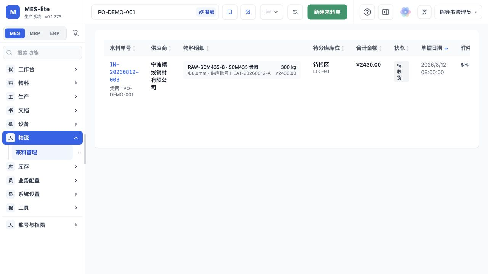

### 核对来料待检隔离

目的：确认收货后的受控物料不可提前领用或发出。

1. 收货完成后保持来料单搜索条件。
2. 核对状态为“已收货”，物料行显示“待质量检验”。
3. 记录内部批号和检验单号。
4. 在库存中确认该数量计入待检而非可用。

结果检查：待检数量参与总库存和成本，但不进入可用数量，生产领料和发货不能消费该批次。

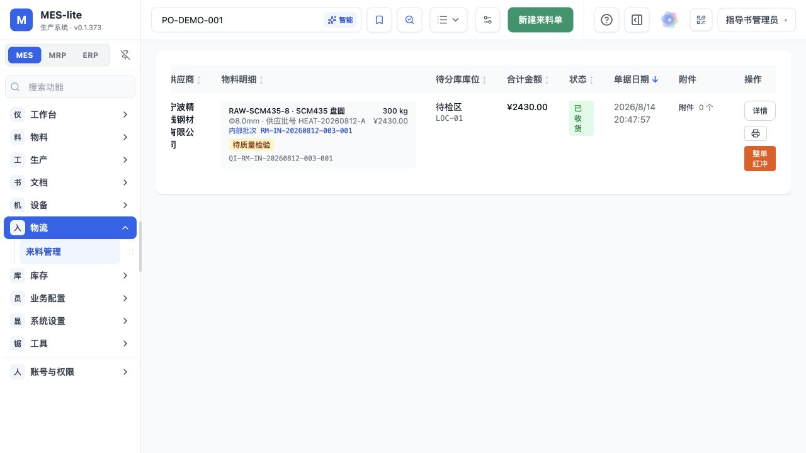

### 红冲未完成质检的来料

目的：在原单取消且尚未判定质量时，成套冲销待检库存和未完成任务。

1. 在已收货且仍待检的来料单点击“整单红冲”。
2. 填写不可为空的红冲原因并提交。
3. 在质量任务“全部记录”按内部批号搜索。
4. 核对批次已冲销、在库余额为零，检验任务显示“待检已冲销”。

结果检查：待检库存、库位余额、成本层和来料状态成套冲销；标准快照与取消记录保留审计。已不合格、部分判定或处置过的批次禁止直接红冲。

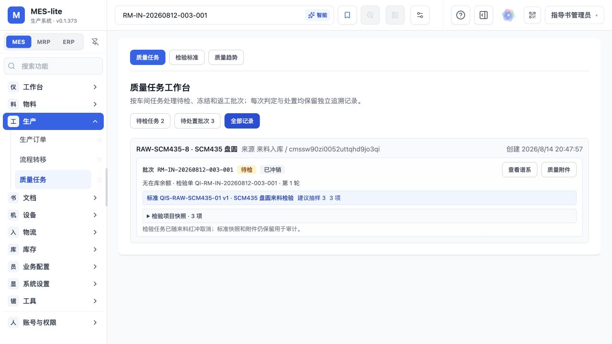

### 查看库存

目的：按物料和库位核对库存、占用和可用量。

1. 展开“库存”功能区，进入“库存管理”。
2. 搜索目标物料。
3. 展开库位分布并核对总量、占用、可用和成本。

结果检查：物料总库存等于各库位库存合计。

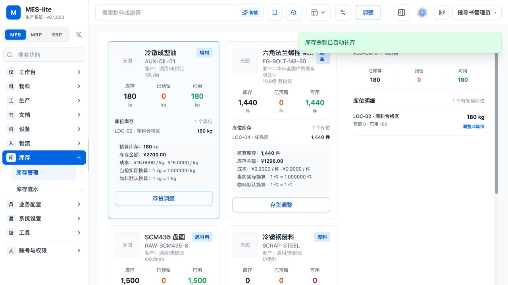

### 库存调整

目的：在授权和有凭据时，以当前登录身份纠正账实差异。

1. 在库存记录中点击“调整”。
2. 选择库位并填写调整后数量或调整差额。
3. 填写原因和凭据，确认保存；操作人由服务器会话自动记录，页面不能代填。
4. 立即进入库存流水和操作记录，确认余额、调整流水与审计记录同时存在。

结果检查：调整生成独立流水，不覆盖历史业务单据；失败调整不留下孤立审计记录。

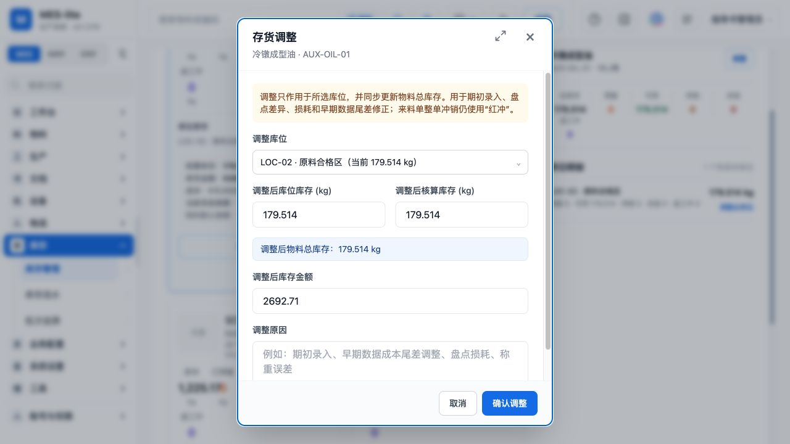

### 库存盘点

目的：按一个库位快速核对多种物品的账面数与实盘数，不伪造生产或质量事实。

1. 从“库存”功能区进入“库存盘点”。
2. 选择盘点日期和库位，填写可解释差异的原因。
3. 搜索逐项加入物品，或加入该库位全部有账面库存的物品。
4. 系统默认带出账面数，只修改有差异行的实盘数并核对差异。
5. 点击“确认整单”，随后到库存流水和操作记录核对 ADJUST 流水与 RECONCILE 审计。

结果检查：账实一致行不产生空流水，差异行整单成功或全部回滚；盘点不创建生产实绩或质量记录。

### 生产日报 BOM 快捷转换

目的：绕过生产订单和派工，按正式 BOM 快速完成投入转产出。

1. 从“生产”功能区进入“生产日报”。
2. 选择正式 BOM、产出数量、投入与产出库位，并确认系统计算的投入数量和成本。
3. 选择“直接进入可用库存”，或选择“先进入待检库存”并创建质量任务。
4. 确认过账后核对生产日报、库存流水和操作记录。
5. 需要纠错时使用日报冲销；已部分放行、返工或拆分处置的批次必须先完成库存处置，不能直接冲销。

结果检查：单事务完成 BOM 投入扣减、主产出、成本和审计，不创建生产订单、派工或报工；待检模式建立批次和质量任务。

### 核对库存流水

目的：追溯每次数量和成本变化。

1. 展开“库存”功能区，进入“库存流水”。
2. 按物料、业务类型、时间、来源单据或关联流水 ID 筛选。
3. 核对来料、发货、退货、调整和生产实绩记录。
4. 对精确红冲同时核对原流水的“已由流水冲销”和冲销流水的“冲销原流水”；普通部分退货只显示关联来源。

结果检查：流水数量、核算数量、成本、库位和来源单据相互对应；精确冲销双向可追溯且金额守恒。

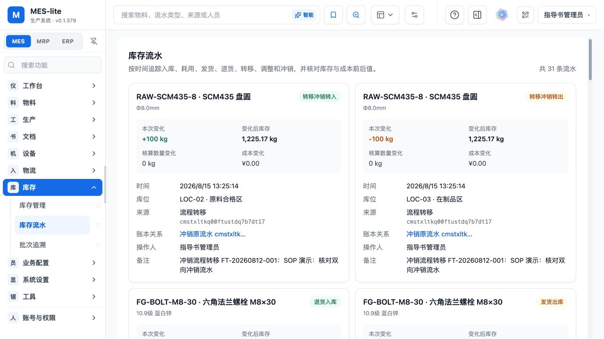

## 9. 销售、发货与退货

### 查看销售订单

目的：跟踪客户需求，并按客户与物料查看动态未发和超发参考。

1. 展开“销售”功能区，进入“销售订单”。
2. 搜索客户、订单号或物料。
3. 查看订单自身状态，以及按客户与物料汇总的需求、待发、已发、未发或超发参考。
4. 按需打开“显示项”选择物料图片、客户单号、日期、状态、金额和附件。

结果检查：订单不保存发货关系；参考量来自客户与物料的动态汇总，不限制实际发货。

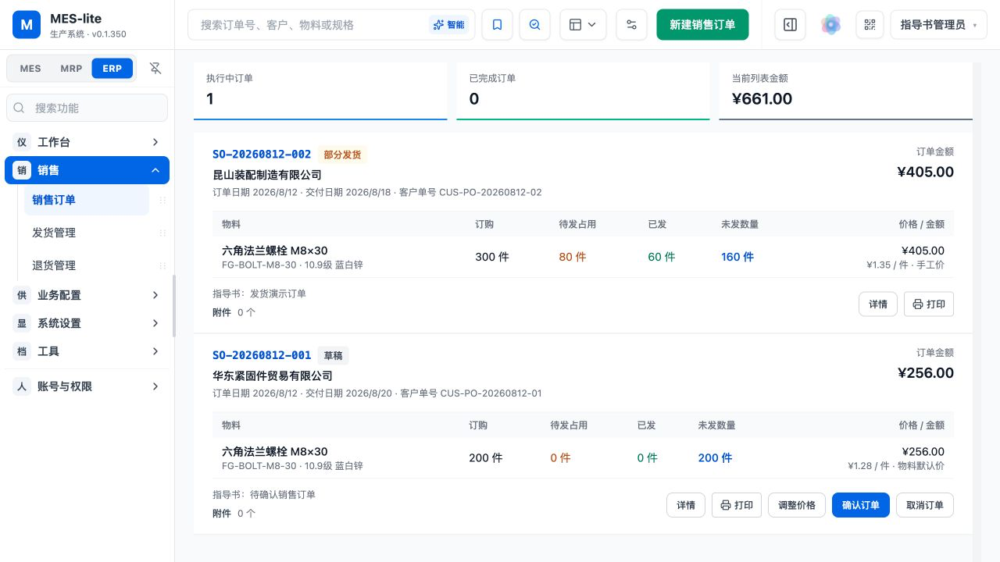

### 新建销售订单

目的：登记客户需求、价格和交期。

1. 点击“新建销售订单”。
2. 选择客户并填写订单日期、交期和客户单号。
3. 添加物料、数量、单价和附件。
4. 创建后复核并确认订单。
5. 需要纸质单据时，在订单清单或详情点击“打印”。

结果检查：草稿订单生成并独立表达客户需求，不直接派生或绑定发货单。

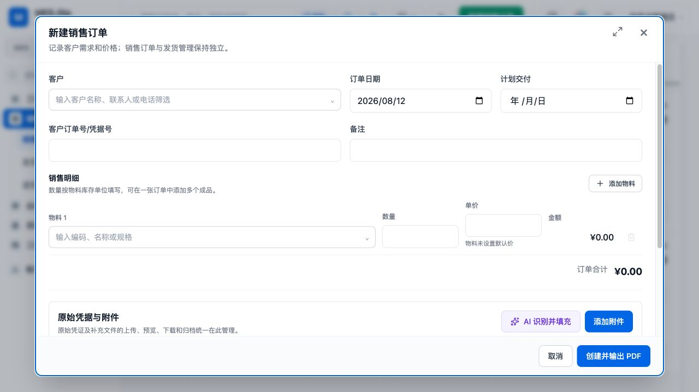

### 复核销售订单详情

目的：核对客户需求和订单明细。

1. 打开订单“详情”。
2. 核对客户、客户单号、日期、金额和附件。
3. 确认订购、待发、已发、未发和超发参考；这些值不形成订单履约绑定。
4. 点击物料名称或编码查看物料详情；关闭物料详情后返回原订单继续复核。

结果检查：详情与列表及原始凭据一致。

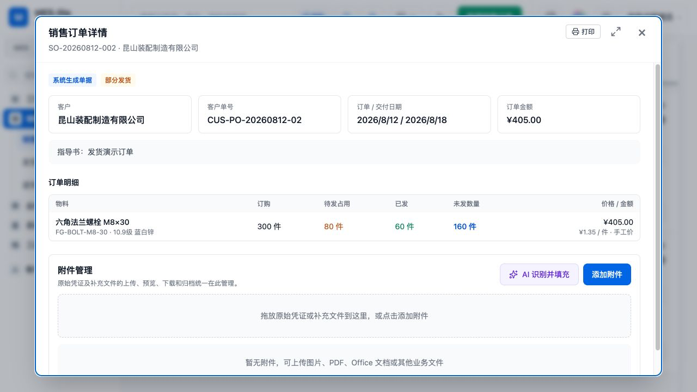

### 查看发货单

目的：查看待发、已发货和已签收记录。

1. 展开“销售”功能区，进入“发货管理”。
2. 按发货单、物料、客户或物流号搜索。
3. 核对发货库位、数量、价格和状态。
4. 按需打开“显示项”选择物料图片、凭据号、库位、数量、价格、客户、状态、日期和附件。
5. 打开详情，查看多条发货明细、发货单码、货箱内容物、打包照片、客户发货批次和附件。

结果检查：每张发货单可追溯客户、全部实际发货物料、货箱和打包现场，不保存销售订单关系。

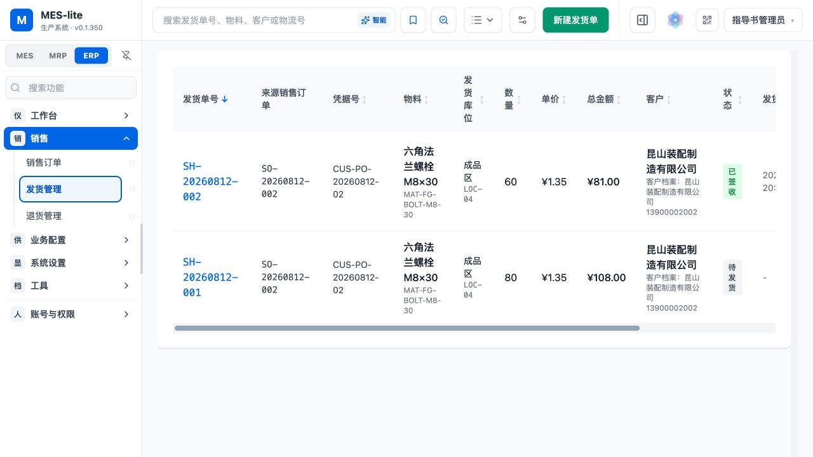

### 新建发货单

目的：为一个客户登记包含多条实际发货物料的独立发货任务。

1. 点击“新建发货单”。
2. 选择客户并填写凭据号、地址、物流和备注等单头信息。
3. 选择物料和发货库位，填写数量与价格，点击“添加本项并继续”；重复添加需要发货的全部物料。
4. 在“本单已加入”中编辑或移除明细，核对总项数和总金额；未发/超发只作参考且不限制数量。
5. 点击“保存整单（N 项）”。
6. 保存后先保持待发货。
7. 在详情中按实际包装创建一个或多个货箱，录入打包人、重量、尺寸和封箱号，再上传货箱实物/打包现场照片。
8. 核对货箱数量合计等于发货数量，分别打印箱码和发货单码；物流运单号仍独立维护。
9. 需要纸质单据时，在发货清单或详情点击“打印”。

结果检查：一张多明细待发货记录生成且不关联销售订单；货箱获得唯一箱码并保留内容物和打包证据。

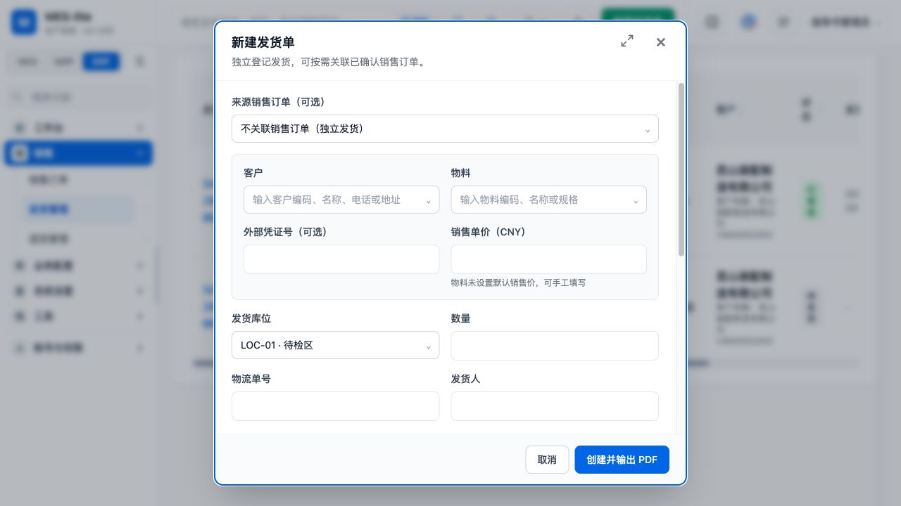

### 确认发货

目的：实际出库并扣减发货库位库存。

1. 在待发货记录点击“发货”。
2. 核对库位库存和发货数量。
3. 如果已创建货箱，确认有效货箱内容数量合计与发货数量一致；否则系统会阻止发货。
4. 确认后查看成功提示，可继续办理签收。

结果检查：发货单和有效货箱同步变为“已发货”，各明细库存、批次和成本原子扣减，销售订单不被回写。

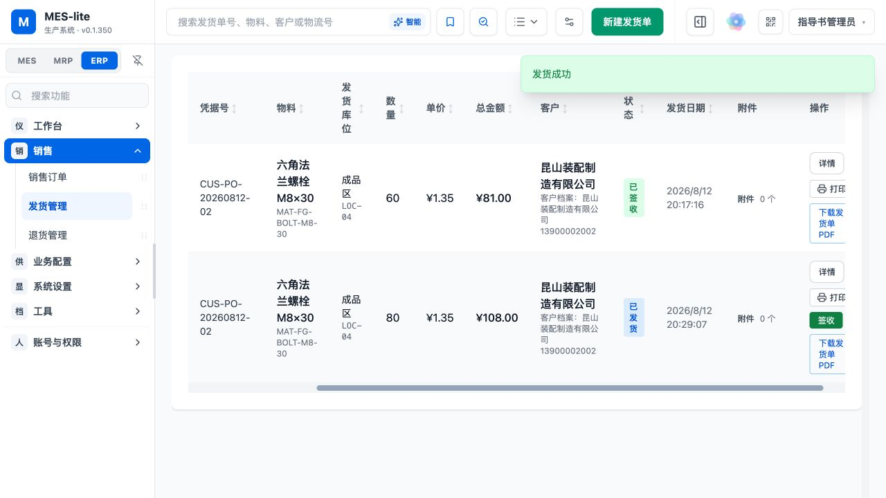

### 核对发货批次追踪状态

目的：确认已发货或已签收单据已经记录真实内部批次，而不是只有总库存扣减。

1. 展开“销售”功能区，进入“发货管理”。
2. 找到已签收发货单并核对客户、物料、库位和数量。
3. 打开“详情”，确认“客户发货批次”的追溯状态为“真实内部批次”。

结果检查：发货单状态正确，批次卡片显示内部批次号、发出数量、已退数量和发货库位。

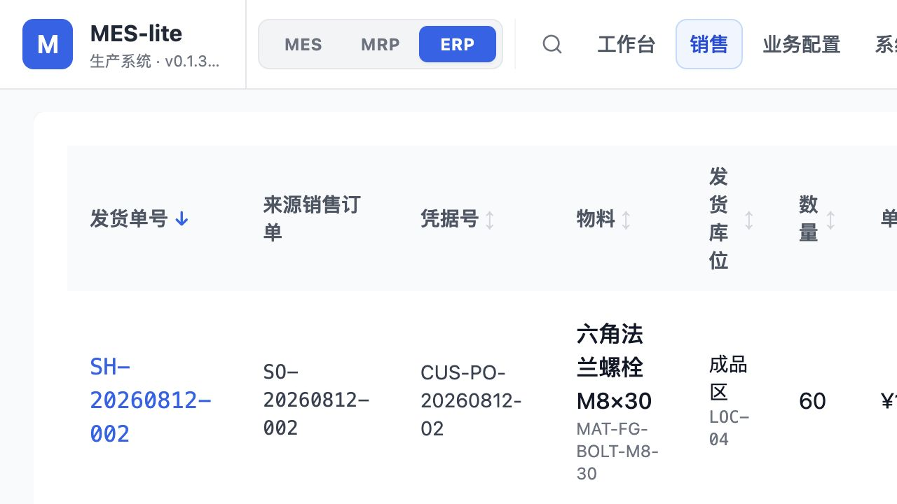

### 查看客户发货批次分配

目的：核对出库数量按可用库存批次分配，并保留客户去向。

1. 在已发货/已签收发货单点击“详情”。
2. 向下查看“客户发货批次”。
3. 逐条核对内部批次、发出数量、已退数量和库位。

结果检查：分配合计等于发货数量；历史未追踪库存会明确标为兼容批次，不伪造成来料或生产批次。

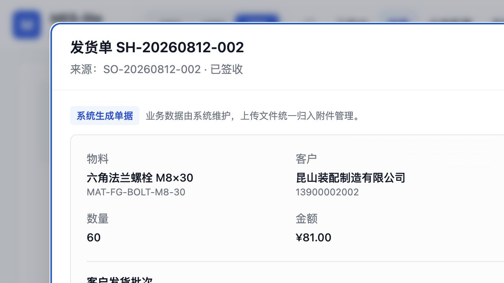

### 从发货批次查看客户去向

目的：从内部批次正向确认发货单、客户、物流和退货累计。

1. 在客户发货批次点击“查看谱系”。
2. 查看“客户履约追溯 > 客户发货去向”。
3. 核对发货单、客户编码/名称、发出数量、已退数量、库位和物流号。

结果检查：客户发货去向显示对应发货记录；尚未收货的退货不会提前形成回流批次。

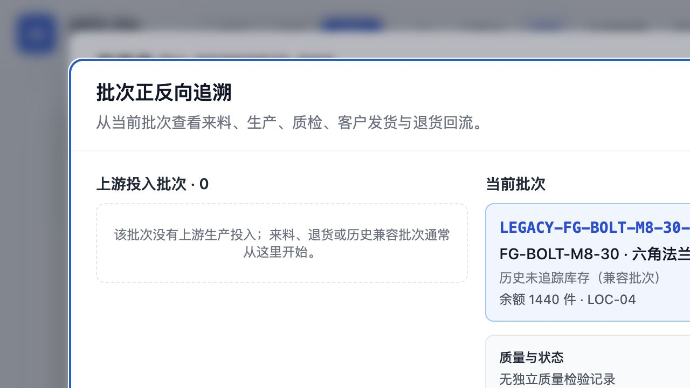

### 查看退货单

目的：查看客户退货、原因和处理状态。

1. 展开“销售”功能区，进入“退货管理”。
2. 按退货单、物料、发货单或原因搜索。
3. 核对数量、退回库位和待处理状态。

结果检查：退货可追溯原发货单和客户。

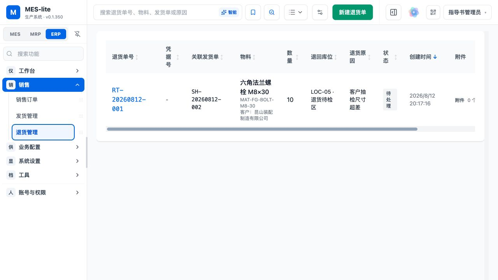

### 新建退货单

目的：登记客户退回物料。

1. 点击“新建退货单”。
2. 选择物料并填写数量、退回库位和原因。
3. 按需填写外部凭据、备注和附件。
4. 保存后等待授权人员处理。
5. 需要纸质单据时，在退货清单或详情点击“打印”。

结果检查：新单状态为“待处理”，库存尚未返库。

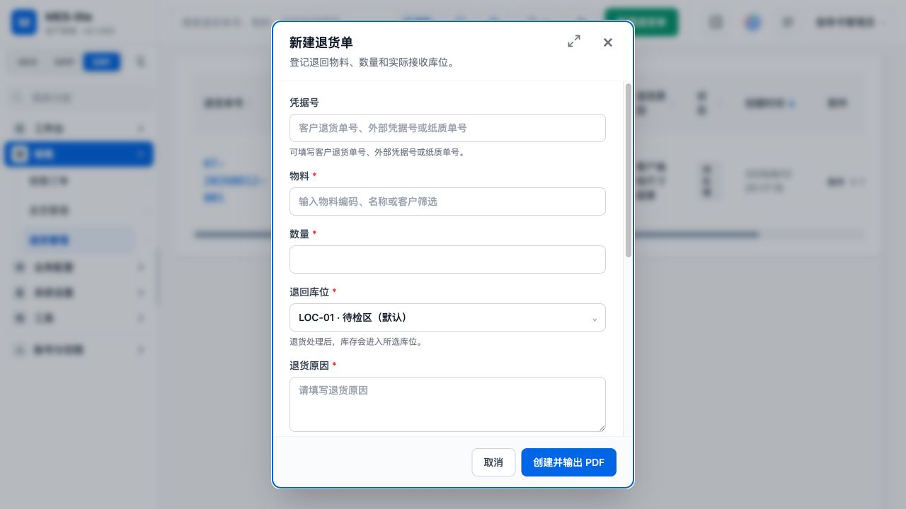

### 按原发货单登记可退数量

目的：在界面中复核原发货单是必选项，避免退货脱离客户和出库批次。

1. 点击“新建退货单”。
2. 在“原发货单”选择目标单据。
3. 核对自动带出的客户、物料和“剩余可退”提示。
4. 选择退货待检库位后再填写数量和原因。

结果检查：仅显示仍可退的发货单；物料不可随意替换，数量上限等于剩余可退数量。

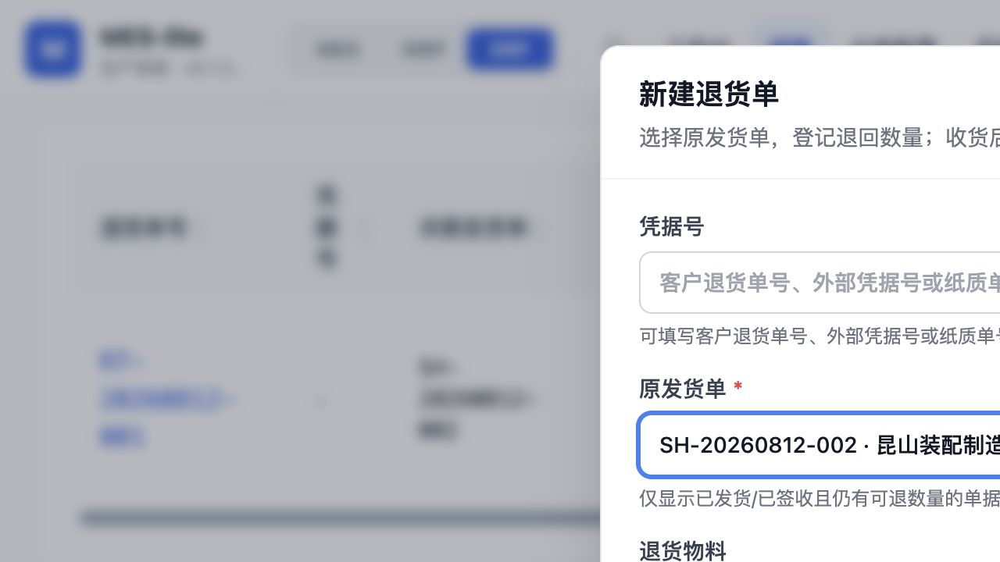

### 处理退货返库

目的：确认退货接收并增加指定库位库存。

1. 在待处理退货上点击“处理”。
2. 核对数量和退回库位。
3. 确认后检查成功提示、库存和流水。

结果检查：状态变为“已处理”，退回库位库存增加。

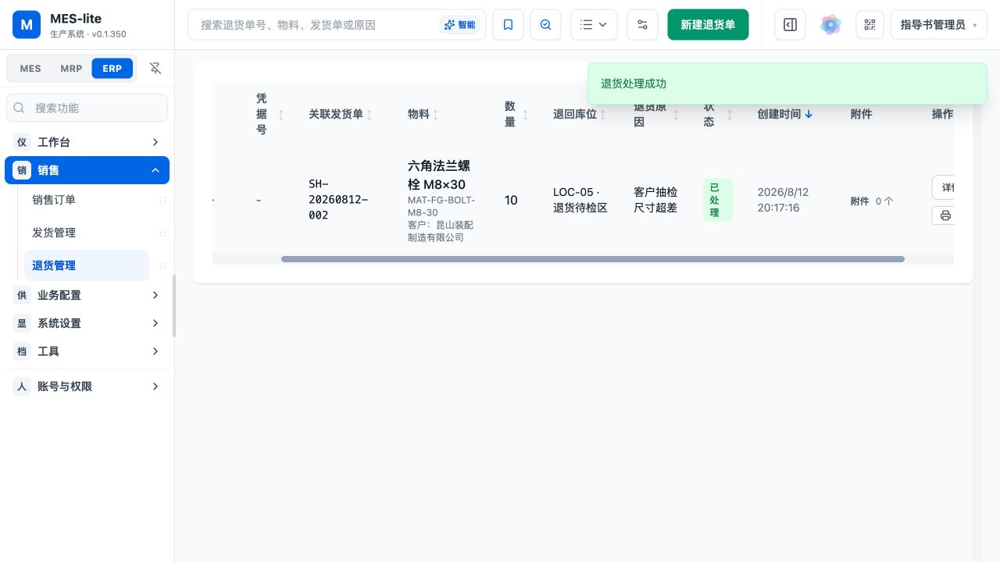

### 确认退货已收货

目的：核对业务单状态与库存质量状态分离。

1. 在待收货退货单点击“处理”。
2. 等待成功提示并刷新列表。
3. 核对退货状态为“已收货”。

结果检查：列表显示已收货，但这不代表批次已可用；必须继续完成质量判定。

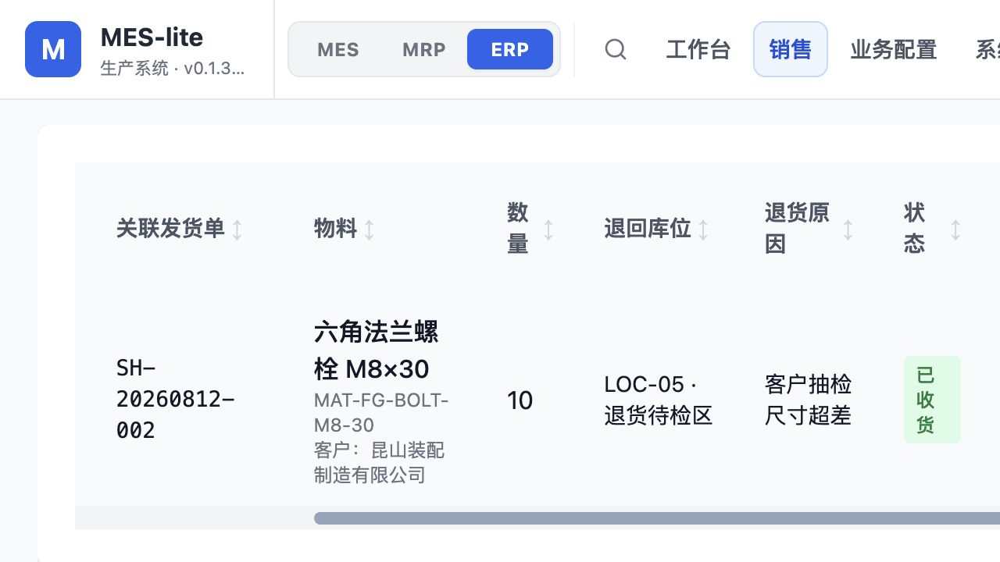

### 核对原发货批次与退货待检批次

目的：确认退回数量从原发货批次分配，并形成独立、可质检的退货批次。

1. 打开已收货退货单“详情”。
2. 查看“原发货批次来源”，核对原批次、本次退回数量、发货单和库位。
3. 查看“退货待检批次”，核对批次号、待检状态、状态数量和检验单号。

结果检查：来源分配合计等于退货数量；退货批次号以 RT- 开头且质量状态为待检。

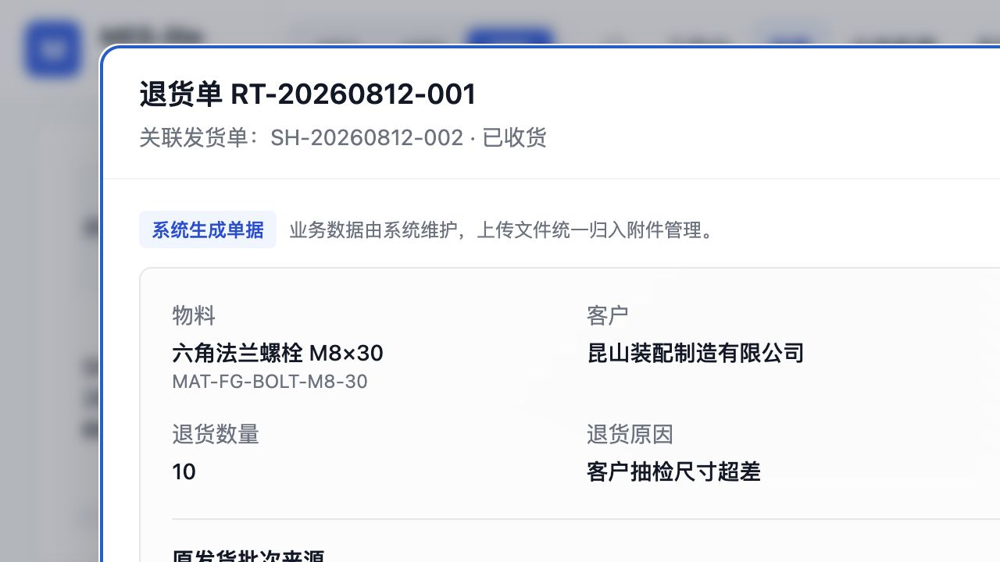

### 从退货批次反查原发货

目的：从退货回流批次反向定位客户、原发货单和原出库批次。

1. 在退货待检批次点击“查看谱系”。
2. 查看当前批次说明与质量检验单。
3. 在“客户退货来源”核对原批次、退货单、原发货单、客户和退回数量。

结果检查：退货批次显示原发货单和客户；来源内部批次可继续点击追溯。

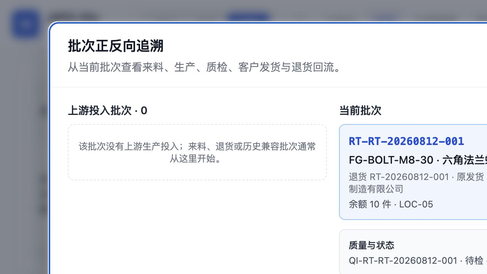

### 填写退货批次合格判定

目的：对已收货退货批次执行整批质量放行。

1. 在退货详情点击“合格放行”。
2. 填写抽检数量、合格数量、不合格数量和结论说明。
3. 确认合格数与不合格数之和等于抽检数，且整批合格时不合格数为 0。
4. 点击“确认整批放行”。

结果检查：系统保存检验人、判定和抽检结果，并把整批库存由待检转为可用。

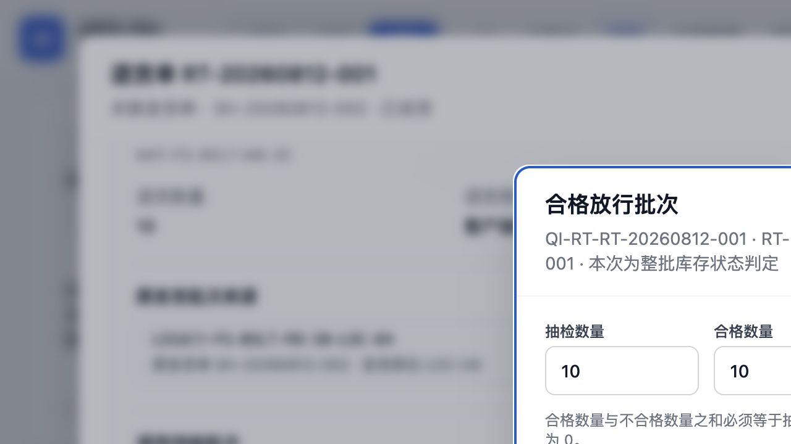

### 核对退货批次已放行

目的：确认质量结果和库存状态已经同步落账。

1. 提交质量判定后留在退货详情。
2. 核对批次状态从“待检”变为“已放行”。
3. 核对判定、抽检、合格、不合格数量和检验人。

结果检查：批次显示“已放行”，状态数量保持不变，质量判定信息完整。

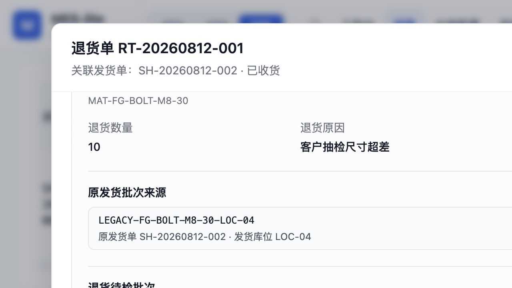

### 从原发货批次查看退货回流

目的：从原出库批次正向确认客户退回数量及其最终质量状态。

1. 从退货批次谱系点击来源内部批次。
2. 查看“客户发货去向”，核对发出数量和已退累计。
3. 查看“退货回流批次”，核对退货批次、状态、数量、库位、退货单和客户。

结果检查：原发货批次显示发出和已退累计；回流批次显示最终质量状态，并关联原发货单和退货原因。

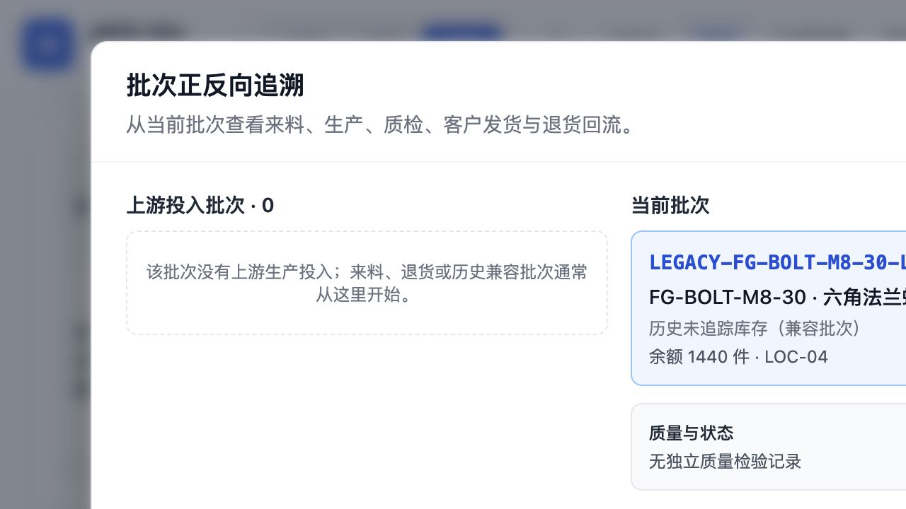

## 10. 文档与设备台账

### 查看受控文档

目的：按标题、正文、类别、产品和扩展字段查找受控文件。

1. 展开“文档”功能区，进入“产品文档”。
2. 使用智能搜索覆盖标题、正文、产品、类别、备注和当前类别扩展字段；需要精确组合时打开高级搜索，字段列表会随类别字段定义更新。
3. 表格视图在常规桌面固定保留可读的文档标题宽度，适用产品使用紧凑摘要；文档不显示工作中心列，宽表只在自身容器横向滚动。
4. 需要共同维护元数据时，在卡片或表格勾选同一类别的多篇文档，点击“批量修改”，逐项勾选要应用的基础或扩展字段后保存；不同类别不能混合提交。
5. 需要调整某类文件的字段时，点击“字段设置”并选择类别；基础字段不可删除。扩展字段点击“编辑”：未使用时可修改名称、类型和选项，已使用时只能改名；只有未被任何文档使用的扩展字段可以删除。
6. 点击“全屏预览”直接阅读在线正文或首个附件，并可继续切换其他附件；点击“详情”查看版本、适用范围并管理附件。进入编辑后，基础信息在预览上方按可用宽度排列，标签不得逐字换行。XLS/XLSX/ODS 使用自托管 LibreOffice 核心查看器直接打开。DWG/DXF 通过内部 CAD 服务排队生成只读 PDF；具备维护权限时可点击“重新生成预览”重建 PDF 与缩略图，原图保持不变。图纸异常时由管理员进入“系统设置 > 文件预览”，检查 LibreDWG、ACadSharp、QCAD 可用状态并切换自动或指定引擎后重新生成；QCAD 只有服务器已合法安装和配置时可用。缺字时把已授权字体放入转换器外挂目录并重启；服务会受控修正目录权限、立即降权，并在健康检查显示路径所有者和有效权限。随后重新生成旧预览；预览服务异常时下载原文件。

结果检查：文档标题和编辑字段保持可读宽度；同类别文档可只覆盖明确选择的共同字段，类别扩展字段可安全编辑并受使用保护；全屏预览与详情职责分离，CAD 派生预览按引擎隔离缓存、可由获权人员手动重建且不改原图。

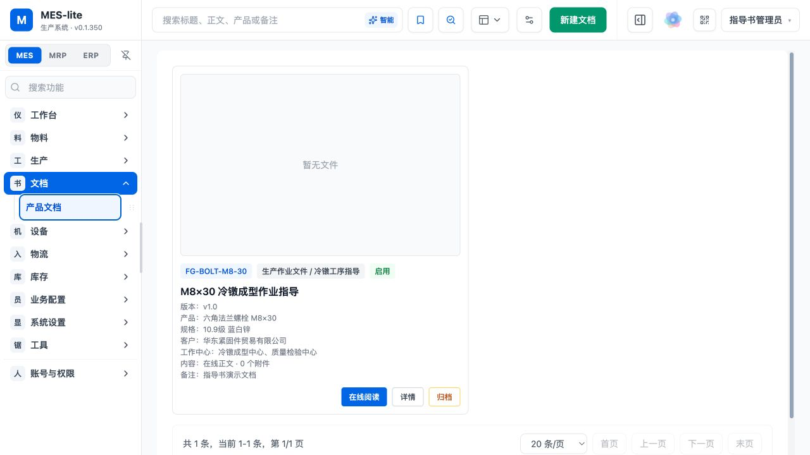

### 新建受控文档

目的：上传原文件、批量导入同类文件或创建在线作业正文。

1. 单篇建档点击“新建文档”；同类图纸批量建档点击“批量导入”，一次选择最多 50 个文件。
2. 关联物料、类别、版本、工作中心，并按所选类别填写扩展字段；可搜索选择器既可点击输入框输入筛选，也可点击右侧箭头展开或收起；普通新增也可填写在线正文。
3. 确认批量导入中的每个文件会独立创建一篇文档并保留原始附件，再提交。
4. 保存后在列表逐篇复核状态；CAD 缩略图会延迟加载并按受控并发排队转换，不要连续重复刷新。批量导入存在部分失败时按文件名处理失败项。

结果检查：单篇文档和批量导入的每篇文档均可独立检索、维护分类字段并保留原始附件。

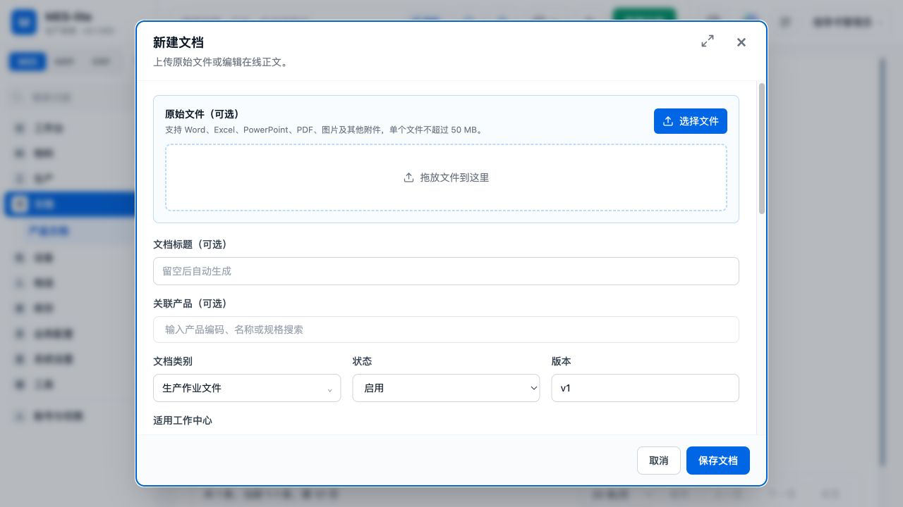

### 查看设备台账

目的：核对设备基础资料、当前状态和运行事件入口。

1. 展开“设备”功能区，进入“设备台账”。
2. 搜索设备编码、名称、型号或工作中心。
3. 核对设备当前状态、现场位置和事件数量。

结果检查：台账显示可用、使用中、故障、维护中或停机状态；状态不能在基础资料中直接改写。

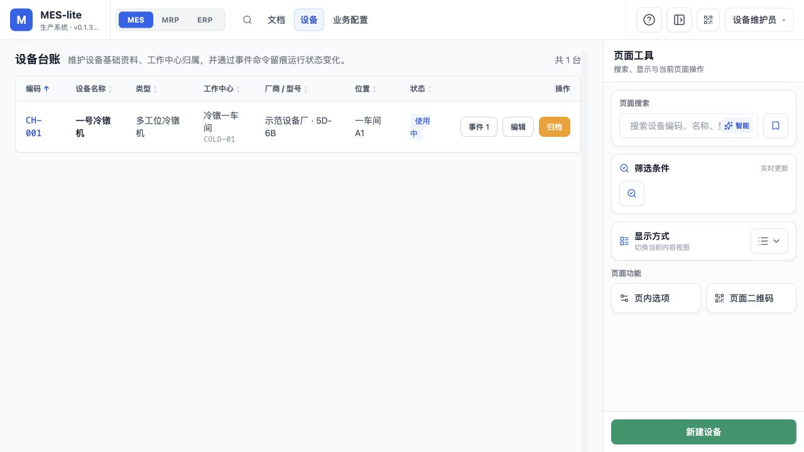

### 新建设备

目的：建立设备基础台账。

1. 点击“新建设备”。
2. 填写编码、名称、类型和工作中心。
3. 填写位置、厂商、型号、参数和备注；不要在基础资料中设置运行状态。
4. 保存后复核列表。

结果检查：设备以“可用”作为初始状态，可用于后续运行事件、派工和产能关联。

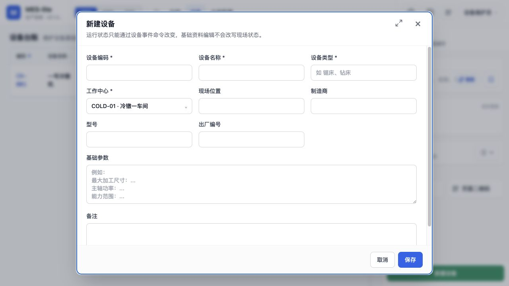

### 上报设备故障

目的：把现场故障作为可审计事件登记并立即改变设备状态。

1. 进入设备台账，在目标设备点击“事件”。
2. 点击“报告故障”。
3. 填写现场可核对的故障原因和已采取的安全措施。
4. 确认设备编码、当前状态和原因后点击“确认记录事件”。

结果检查：设备转为“故障”，时间线保留原状态、原因、操作人和发生时间。

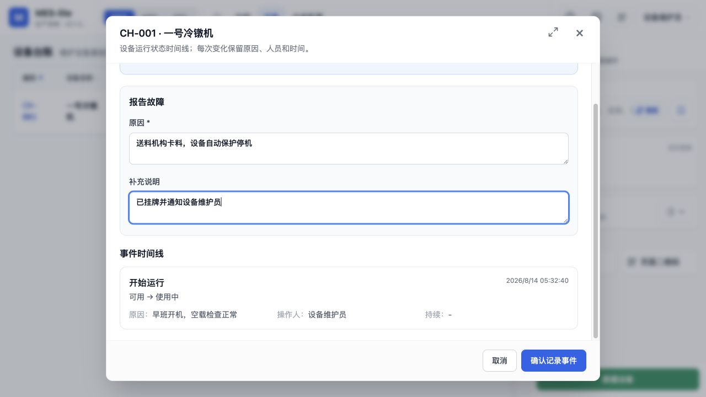

### 恢复设备并回放事件时间线

目的：恢复设备前完成试运行，并核对故障持续时间与完整状态链。

1. 在故障设备的事件弹窗点击“恢复可用”。
2. 填写维修结果、试运行结论和复核说明。
3. 确认记录后重新打开“事件”。
4. 核对恢复、故障、开机事件的状态链、人员、原因和故障持续时间。

结果检查：设备回到“可用”；故障事件记录从故障发生到恢复的持续时间，恢复事件不重复计算。

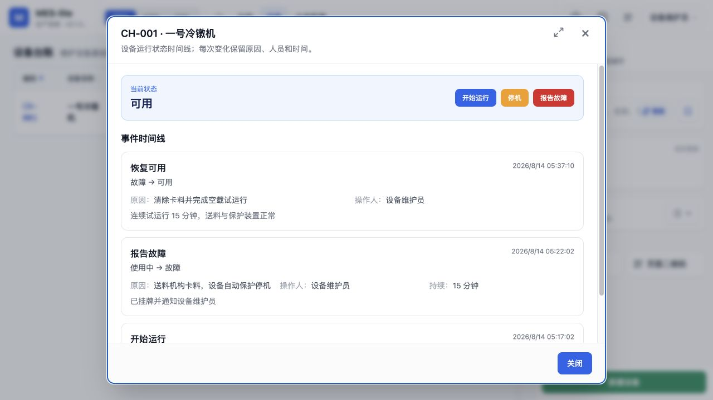

### 查看到期设备点检任务

目的：按到期、逾期和异常状态找到当前工作中心需要处理的点检任务。

1. 展开 MES 的“设备”菜单并进入“设备点检”。
2. 先查看到期、逾期和异常记录计数。
3. 使用“到期任务”筛选；智能搜索覆盖计划、设备、工作中心、检查项、记录和人员，需要精确组合时打开高级搜索。
4. 核对设备、周期、下次到期时间和完整检查清单。

结果检查：页面只显示当前账号工作中心范围内的点检计划，到期任务可直接执行。

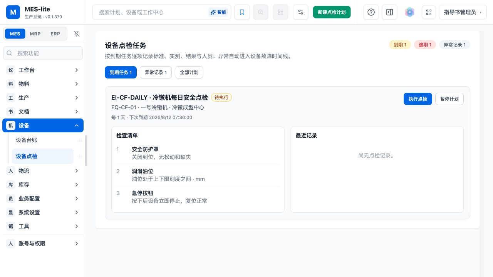

### 新建设备点检计划

目的：为一台设备建立不可直接改写的周期点检标准和完整项目清单。

1. 在设备点检页面点击“新建点检计划”。
2. 填写唯一计划编码、名称、周期和首次到期时间。
3. 搜索并选择当前工作中心范围内的设备。
4. 逐项添加项目名称、检查标准和可选单位，一次保存计划。

结果检查：新计划进入到期任务或全部计划；项目清单保存后只能暂停或恢复计划，不能覆盖历史标准。

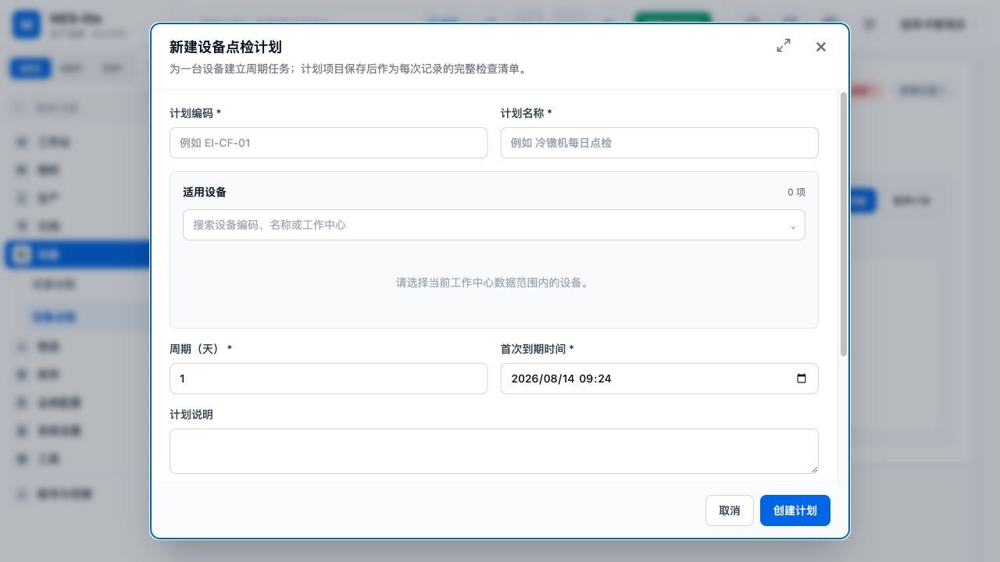

### 逐项完成设备点检

目的：按计划快照完整提交实测值、结果、人员和整次说明。

1. 在到期任务卡片点击“执行点检”。
2. 核对实际点检时间和每一项标准。
3. 逐项选择正常或异常，并填写实测值；异常项必须填写异常说明。
4. 填写整次说明后点击“确认完成点检”。

结果检查：系统一次保存全部项目、点检人、到期周期与审计记录，并把下次到期时间推进一个周期。

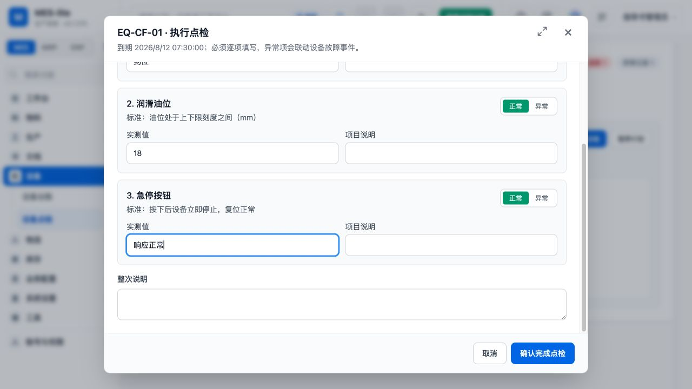

### 复核异常点检与现场附件

目的：从异常记录回看点检事实，并保留现场照片或报告。

1. 切换到“异常记录”筛选。
2. 核对异常记录号、点检时间、点检人和异常说明。
3. 确认原设备已进入故障状态，并在设备事件时间线中存在对应故障事件。
4. 按需要在该次记录下上传现场照片、测量报告或维修凭证。

结果检查：异常点检记录不可改写；设备原为可用或运行中时，同一事务生成故障事件，附件继承点检与工作中心权限。

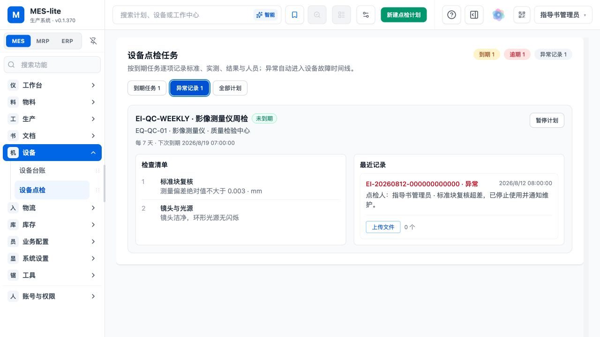

### 查看到期设备保养计划

目的：按到期和逾期状态找到当前工作中心需要生成工单的周期保养任务。

1. 展开 MES 的“设备”菜单并进入“设备维保”。
2. 查看到期保养、逾期、维修中和待处理计数。
3. 切换到“到期计划”；智能搜索覆盖计划、工单、设备、负责人、备件和记录，需要精确组合时打开高级搜索。
4. 核对计划周期、下次到期时间、完整项目清单以及是否已生成工单。

结果检查：页面只显示当前账号工作中心范围内的保养计划；同一计划和到期周期不会重复生成活动工单。

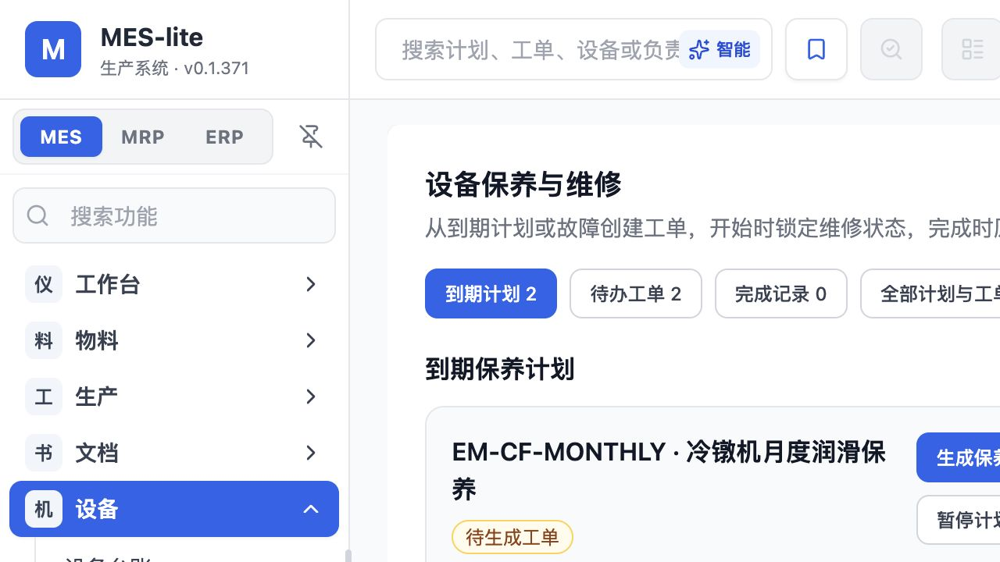

### 新建设备保养计划

目的：为一台设备建立不可直接覆盖的周期保养标准和项目清单。

1. 在设备维保页面点击“新建保养计划”。
2. 填写唯一计划编码、名称、周期、首次到期时间和说明。
3. 搜索并选择当前工作中心范围内的设备。
4. 逐项添加项目名称和作业标准，一次保存计划。

结果检查：计划进入到期或全部计划；项目清单保存后只能暂停或恢复计划，不能覆盖历史工单标准。

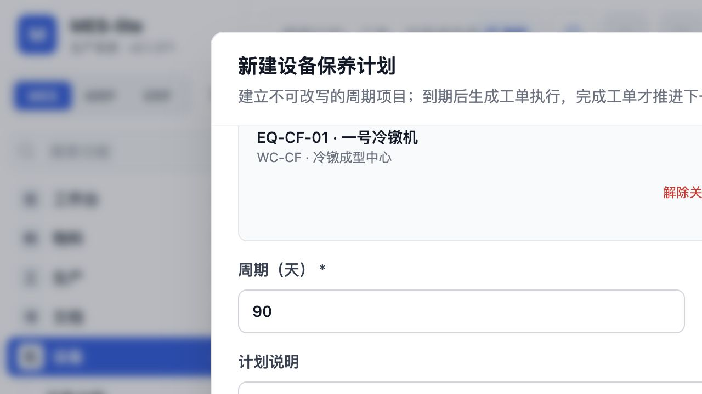

### 登记设备故障维修工单

目的：把真实故障现象登记为可执行、可追溯的纠正性维修工单。

1. 在设备维保页面点击“新建维修工单”。
2. 搜索并选择发生故障的设备。
3. 填写维修主题、优先级、要求完成时间、负责人和客观故障现象。
4. 核对信息后点击“创建维修工单”。

结果检查：系统创建待处理维修工单；原为可用或运行中的设备同时进入故障状态并保留故障事件。

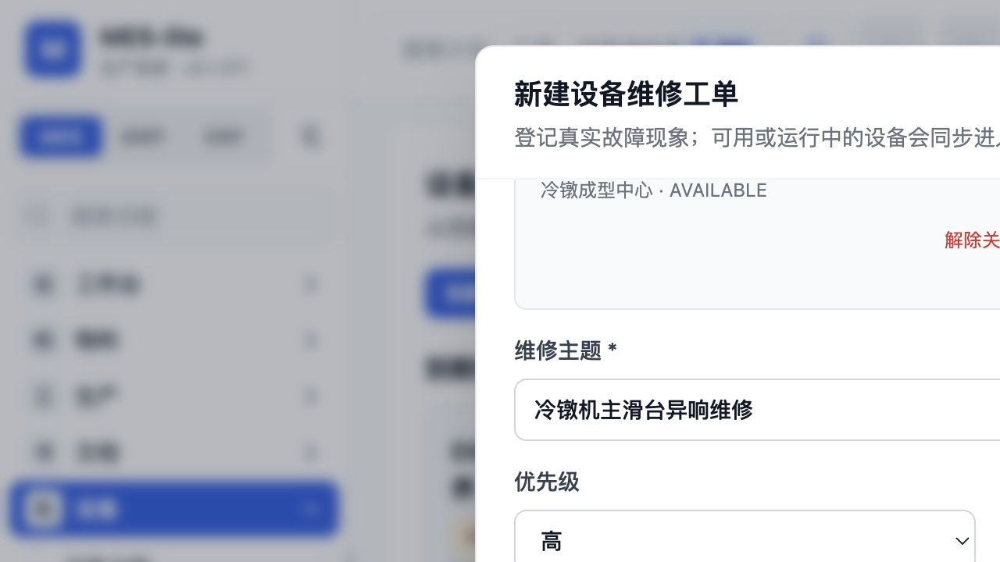

### 开始设备维修或保养工单

目的：明确现场作业开始时点，并阻止设备在维修期间被视为可生产。

1. 切换到“待办工单”并核对工单、设备、负责人和故障现象或保养来源。
2. 在待处理工单点击“开始维修”。
3. 确认工单状态由“待处理”变为“维修中”。
4. 到设备台账核对同一设备状态已经同步变为“维修中”。

结果检查：工单记录开始人和开始时间，设备事件链增加进入维修状态的事件。

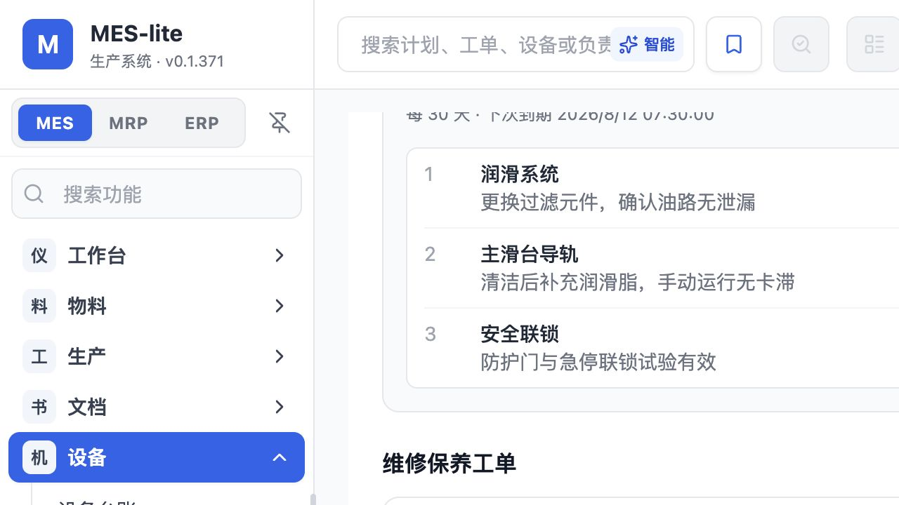

### 完成维修并领用备件

目的：一次提交真实作业结果和备件领用，让设备、库存、成本与批次保持原子一致。

1. 在维修中工单点击“完成并领料”。
2. 计划保养工单须逐项确认全部清单达标；故障维修填写故障原因。
3. 按“搜索—选择物料—选择库位—填写数量—添加”录入全部备件。
4. 填写维修或保养内容、完成时间并点击“确认完成并过账”。

结果检查：工单完成、设备恢复可用；备件按可用批次扣减库存并形成库存流水、成本金额和批次分配。

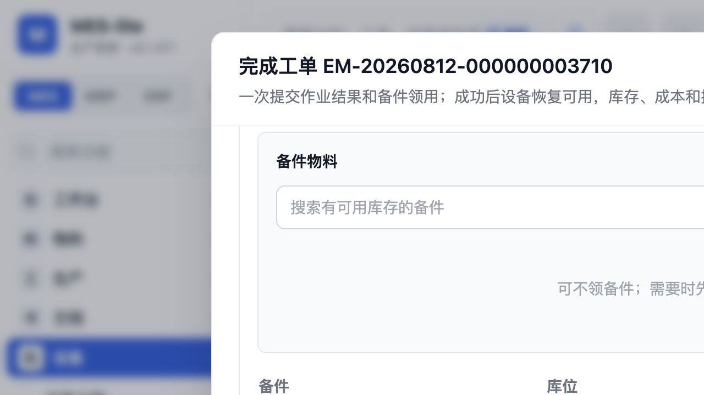

### 复核维保历史与备件批次

目的：从完成事实回看工单、作业结果、设备恢复、备件成本和实际消耗批次。

1. 在设备维保页面切换到“完成记录”。
2. 核对工单号、设备、负责人、故障现象和实际作业结果。
3. 在“备件领用”中核对物料、数量、库位和实际批次。
4. 按需要上传维修照片、校准报告或外协凭证，并到库存流水反查同一业务来源。

结果检查：完成工单、设备恢复事件、备件库存流水、成本和批次分配可相互追溯，完成事实不可覆盖。

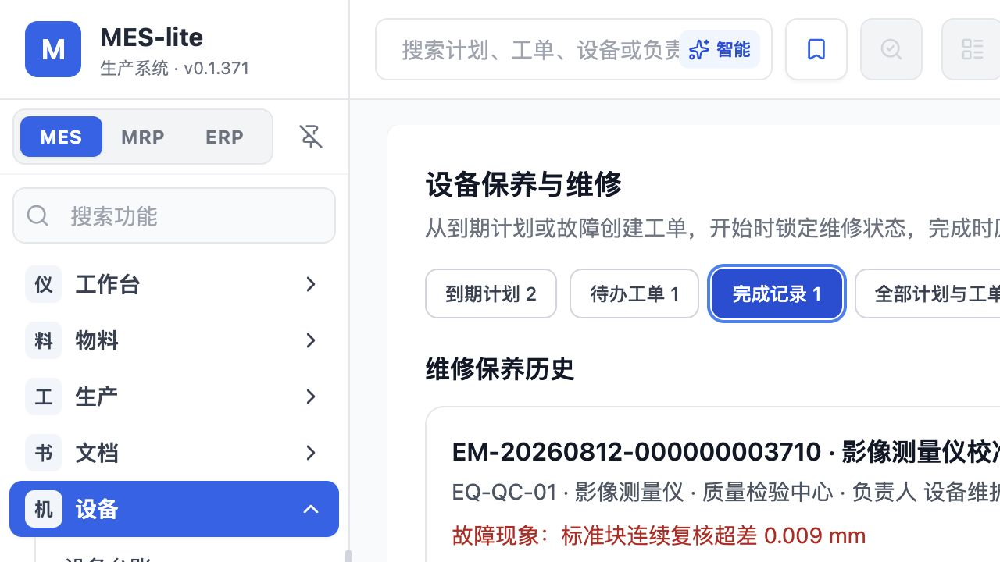

## 11. 业务主数据配置

### 进入业务配置

目的：按顺序建立业务运行依赖的主数据。

1. 展开统一 MES 工作台的“业务配置”。
2. 建议依次维护单位、库位、员工、工作中心、工艺、路线和文档类别。
3. 在同一功能区维护供应商、客户和企业规则。

结果检查：业务单据下拉项来自已启用主数据。

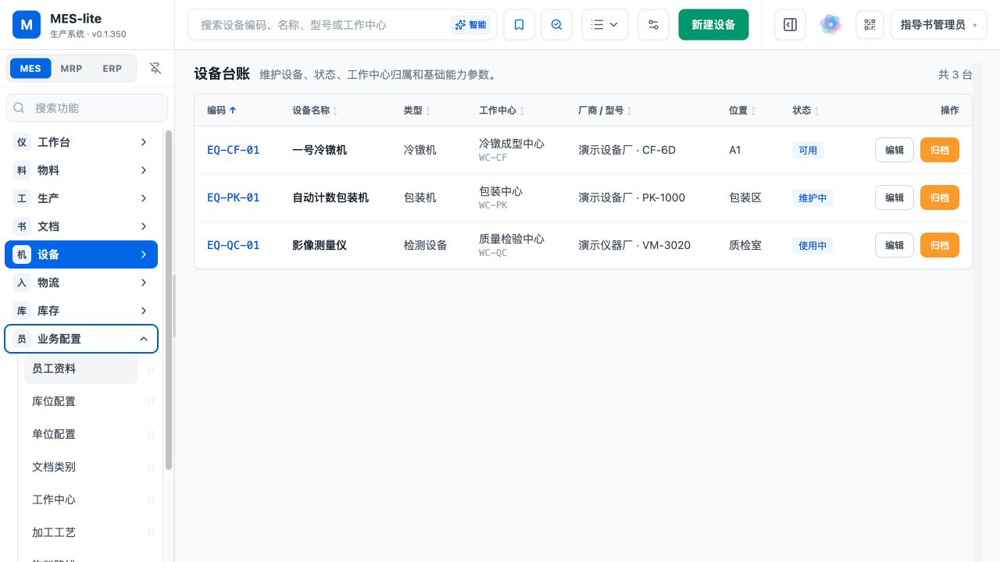

### 查看员工资料

目的：区分业务员工与登录账号。

1. 进入员工资料。
2. 核对员工编码、部门、电话、账号绑定和在职状态。
3. 员工用于派工、实绩和转移，账号绑定不授予权限。

结果检查：员工与账号关系清晰且无重复绑定。

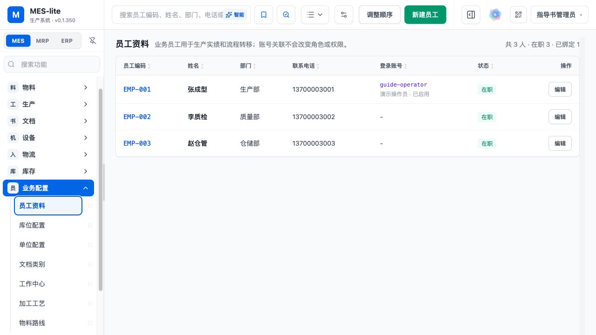

### 新建员工

目的：建立业务执行人员。

1. 点击“新建员工”。
2. 填写姓名、部门和电话。
3. 按需绑定注册账号；权限仍在权限模块设置。
4. 保存后系统生成员工编码。

结果检查：员工可被业务单据选择。

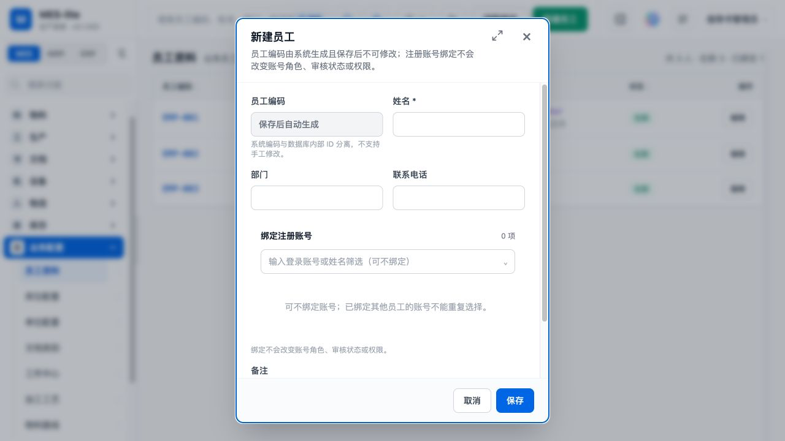

### 查看库位配置

目的：维护库存实物分布和默认库位。

1. 进入库位配置。
2. 核对编码、名称、启用状态、物料数和库存。
3. 默认库位必须保持启用。

结果检查：各库位库存分布与库存管理一致。

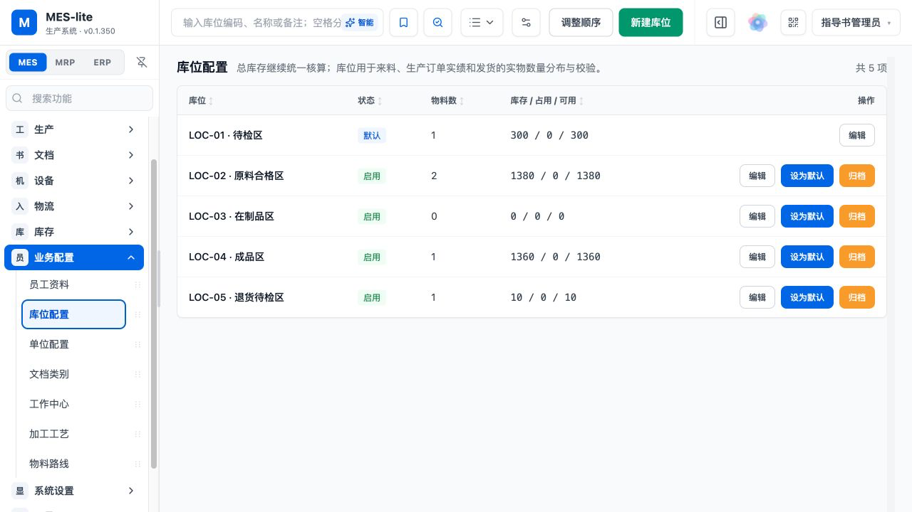

### 新建库位

目的：建立收发存可选的现场位置。

1. 点击“新建库位”。
2. 填写唯一编码、名称和备注。
3. 仅在确有需要时设为默认库位。

结果检查：启用库位可被来料、生产、转移、发货和退货选择。

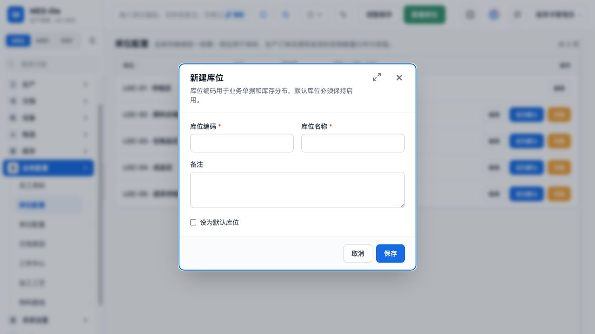

### 查看单位配置

目的：维护长度、重量、数量和其他计量目录。

1. 进入单位配置。
2. 核对单位编码、显示名称、计量方式和换算系数。
3. 已被引用的单位不要随意改变换算关系。

结果检查：物料单位与计量方式保持一致。

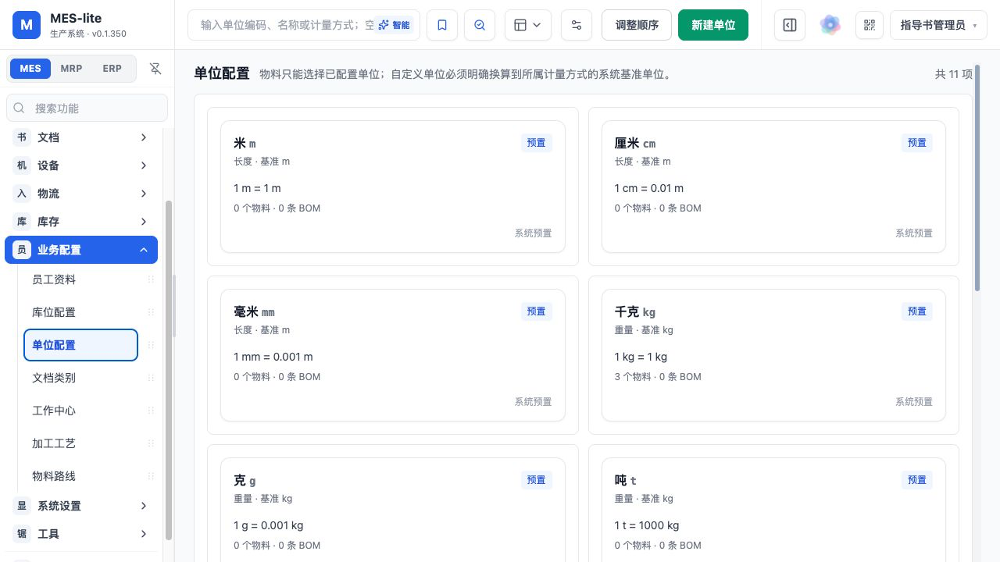

### 新建自定义单位

目的：添加系统未预置的计量单位。

1. 点击“新建单位”。
2. 选择计量方式并填写编码和显示名称。
3. 准确填写到系统基准单位的换算系数。
4. 保存前由业务负责人复核。

结果检查：自定义单位可选且换算定义明确。

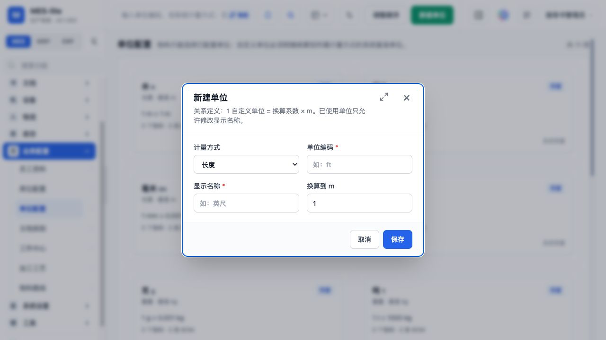

### 维护文档类别

目的：建立受控文件的一级/二级分类。

1. 进入文档类别。
2. 新建或编辑分类名称和层级。
3. 已有文档引用的分类优先停用，不直接删除。

结果检查：文档建档时可选择正确分类。

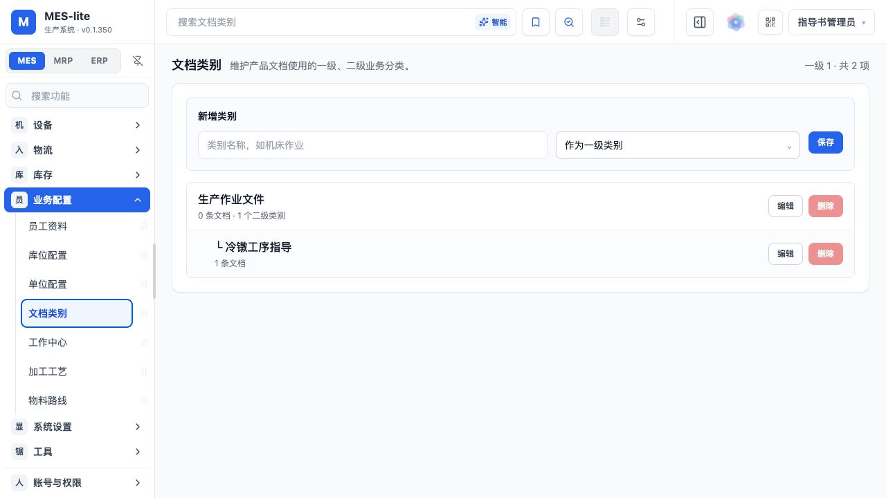

### 查看工作中心

目的：维护生产能力区域。

1. 进入工作中心。
2. 核对编码、名称、类别、设备和工艺文档关联。
3. 停用前确认没有正在执行的任务。

结果检查：工作中心与设备、工艺引用一致。

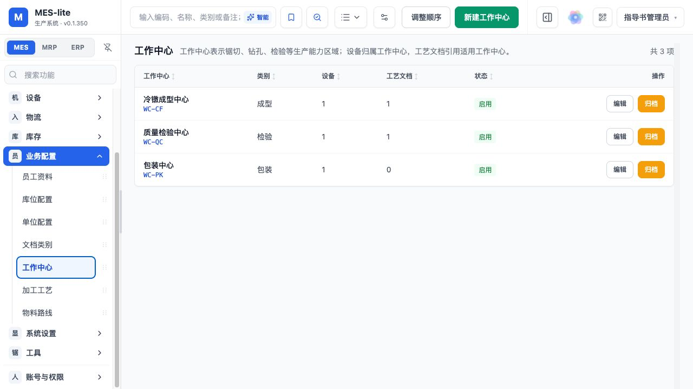

### 新建工作中心

目的：建立生产、检验或包装能力区域。

1. 点击“新建工作中心”。
2. 填写编码、名称、类别和说明。
3. 保存后再关联设备和适用文档。

结果检查：工作中心可在派工、实绩和设备台账中使用。

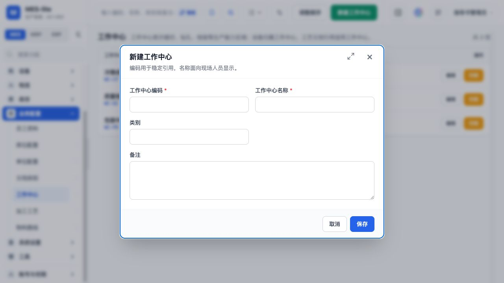

### 维护加工工艺模板

目的：建立可复用的工艺与成本参数。

1. 进入加工工艺。
2. 新建或编辑工艺编码、名称、类别和工作中心。
3. 维护千件人工、机时和成本参数。

结果检查：工艺模板可加入物料路线。

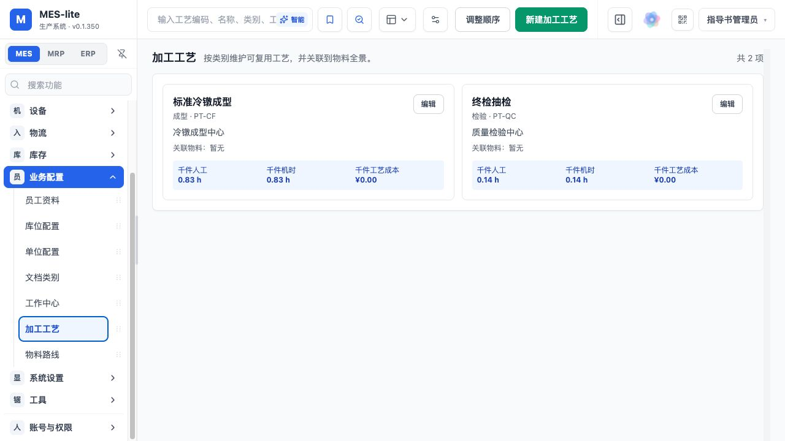

### 查看物料工艺路线

目的：查看物料的有序工序。

1. 进入物料路线。
2. 搜索目标物料。
3. 核对默认路线、工序号、工序名称、工位和设备。

结果检查：默认路线及工序顺序正确。

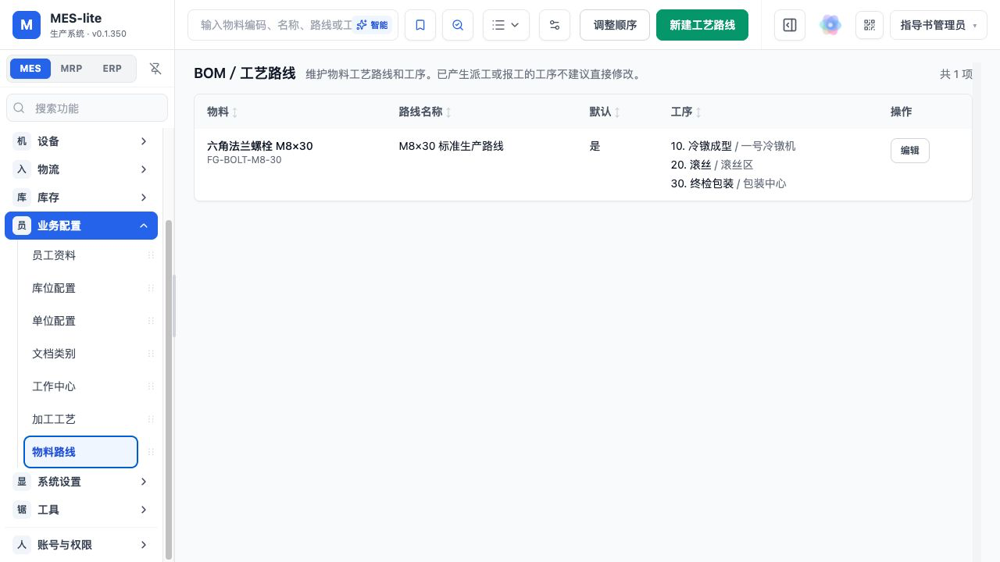

### 新建物料工艺路线

目的：为物料建立有序加工步骤。

1. 点击“新建工艺路线”。
2. 选择物料并填写路线名称。
3. 按顺序添加工序或引用工艺模板。
4. 设置默认路线并保存。

结果检查：路线可被工程和执行流程引用。

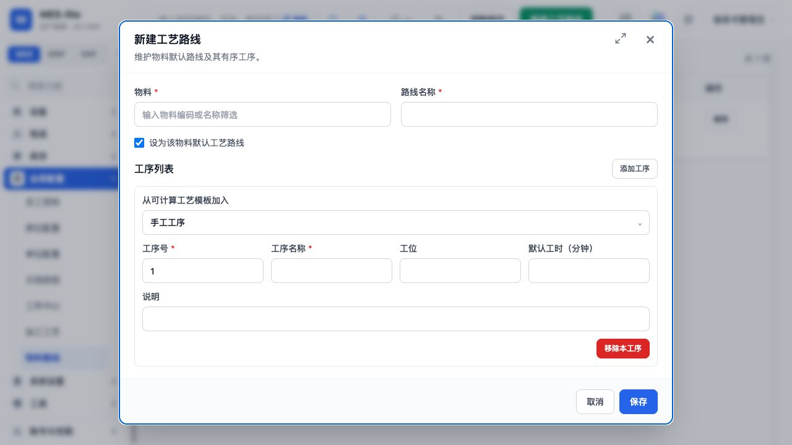

### 查看供应商

目的：维护来料业务的供应商档案。

1. 展开“业务配置”功能区，进入“供应商资料”。
2. 核对编码、名称、联系人、电话和状态。
3. 停用前确认没有未完成来料。

结果检查：来料单可选择启用供应商。

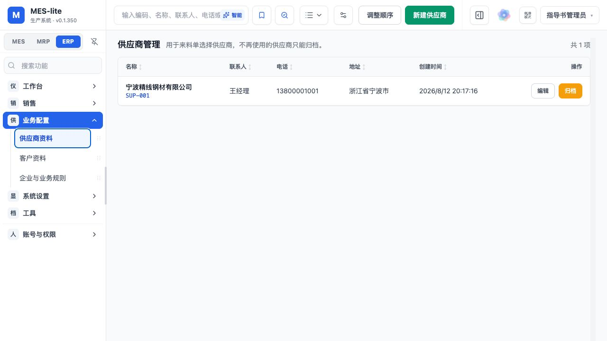

### 新建供应商

目的：建立供应商基础资料。

1. 点击“新建供应商”。
2. 填写名称、联系人、电话、地址和备注。
3. 保存后在供应商列表复核。

结果检查：供应商可用于来料登记。

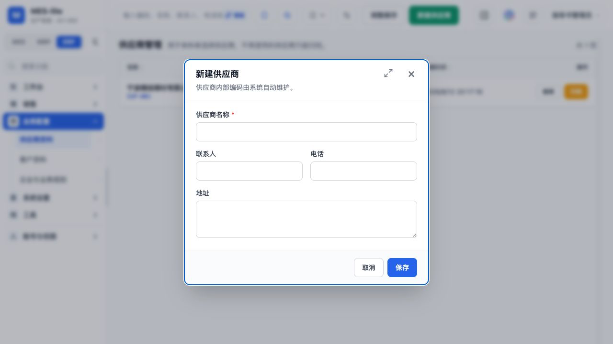

### 查看客户

目的：维护销售、库存和发货筛选所需客户档案。

1. 展开“业务配置”功能区，进入“客户资料”。
2. 核对编码、名称、联系人、电话和地址。
3. 归档前确认没有未完成订单。

结果检查：客户可被销售订单和发货单选择。

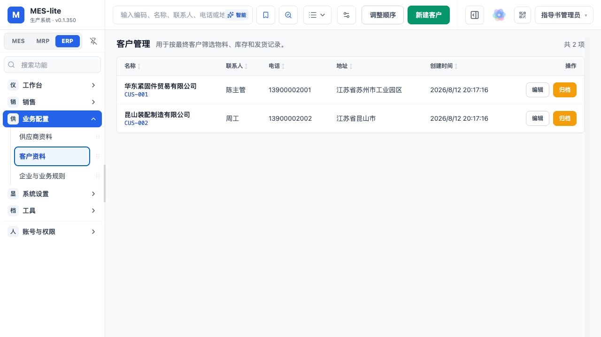

### 新建客户

目的：建立客户基础资料。

1. 点击“新建客户”。
2. 填写名称、联系人、电话、地址和备注。
3. 保存后在客户列表复核。

结果检查：客户可用于销售订单。

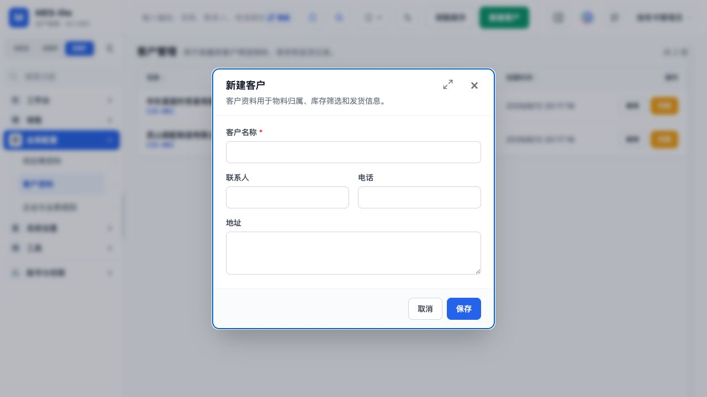

### 设置企业与业务规则

目的：维护发货单乙方资料、业务单据打印格式和全局业务规则。

1. 进入“企业与业务规则”。
2. 填写企业名称、联系人、电话和地址并保存。
3. 在“业务单据打印格式”选择紧凑或标准密度，并设置 8–20 mm 页面边距后保存；默认使用 10 mm 紧凑版。
4. 变更全局排序规则前评估所有客户端影响。

结果检查：发货 PDF 乙方信息、A4 打印密度、页面边距和业务列表规则正确；旧归档在下次打印时按新格式生成新版。

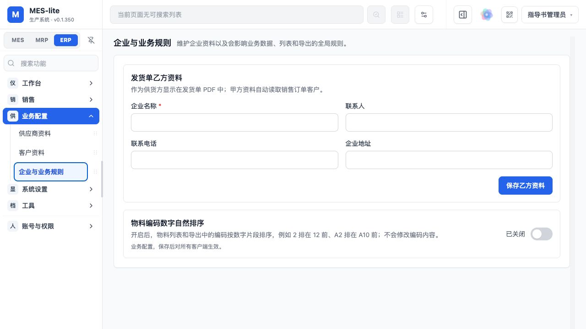

## 12. 系统、工具与权限

### 显示设置

目的：配置界面配色、对比度和显示效果。

1. 进入系统设置 > 显示设置。
2. 选择标准管理或画布工作；标准管理可设置左栏常驻显示或自动隐藏。
3. 使用 MES-lite 产品模块按钮右侧的图钉切换常驻与自动隐藏，确认侧栏不再重复显示“全部功能”标题；自动隐藏时点击导航按钮，或让鼠标进入顶部栏以下的页面左侧 30px 感应带立即呼出，点击页面空白处收回。

结果检查：显示偏好在当前客户端生效；左栏状态只改变是否占用正文空间，不改变导航入口和菜单外观。

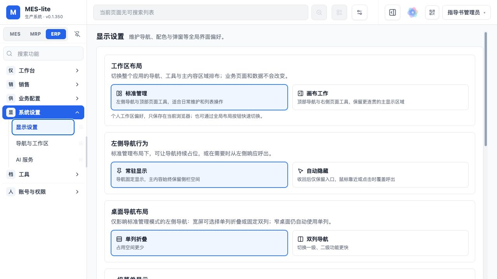

### 导航设置

目的：配置模块按钮，以及统一 MES 工作台的功能区、页面名称和顺序。

1. 进入系统设置 > 导航设置。
2. 按需修改模块按钮名称和 MRP/ERP 显隐；MES-lite 主按钮始终显示。
3. 调整一级功能区顺序、页面名称和页面顺序。
4. 保存后分别在桌面侧栏、顶部导航和移动端菜单核对结果。

结果检查：模块按钮按设置显示且不切换业务域；所有已授权页面在统一 MES 工作台按功能区呈现，历史 MRP/ERP 配置已自动合并且业务数据不变。

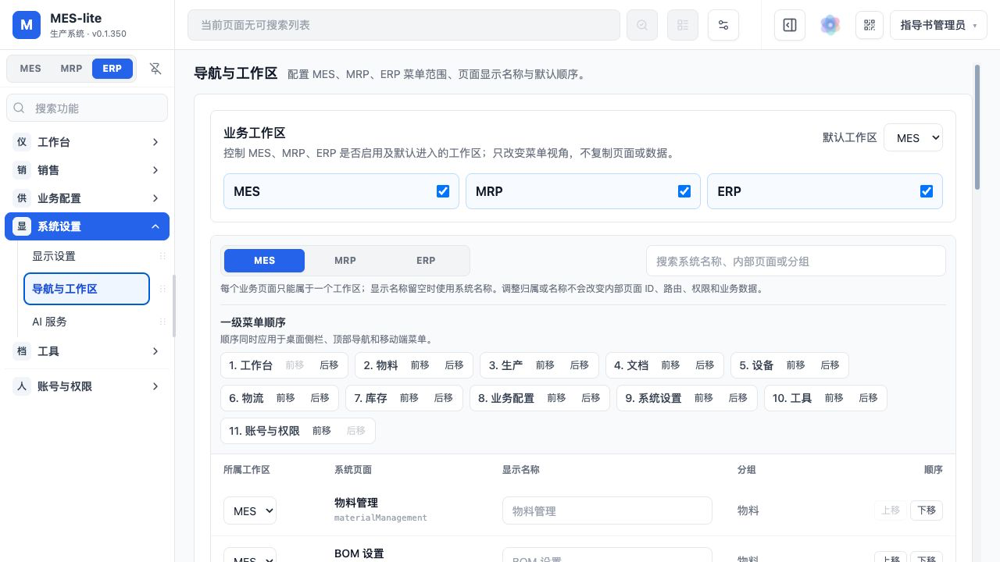

### 选择 CAD 预览引擎

目的：检查 CAD 转换服务并为 DWG/DXF 预览选择自动或指定转换引擎。

1. 进入系统设置 > 文件预览，点击“重新检测”读取当前服务和引擎状态。
2. 无特殊要求时选择“自动选择”；排查兼容性时可指定显示为“可用”的 LibreDWG 或 ACadSharp。
3. QCAD 只有在服务器已合法安装并配置命令后才可选；未配置时界面保持禁用。
4. 点击“保存引擎设置”，再回到文档详情对异常图纸执行“重新生成预览”。

结果检查：新生成的 CAD 预览按所选引擎使用独立缓存；自动模式在失败或输出明显异常时尝试下一个可用引擎。

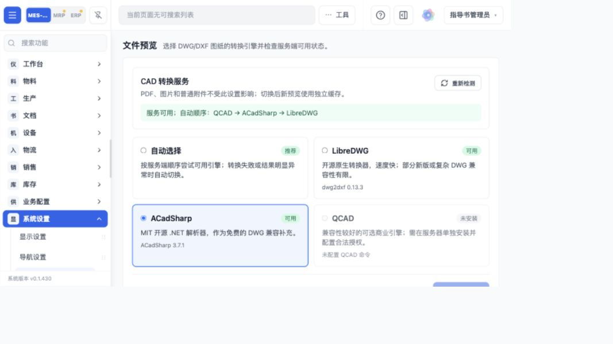

### AI 服务设置

目的：配置兼容模型连接和助手外观。

1. 进入系统设置 > AI 服务。
2. 选择提供商并填写接口、模型和超时。
3. API Key 依赖服务器密钥保护；保存前遵守页面安全提示。
4. 测试已保存配置后再开放给用户。

结果检查：配置测试通过，密钥不在页面或日志中明文泄露。

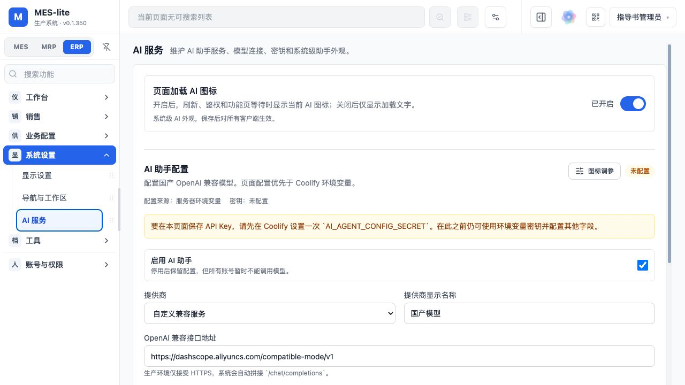

### 锯切成本计算

目的：估算锯切、损耗和直接加工成本。

1. 进入工具 > 锯切成本。
2. 填写材料、尺寸、数量、损耗和工时参数。
3. 核对计算结果并按业务要求留存。

结果检查：计算口径与报价/工艺约定一致。

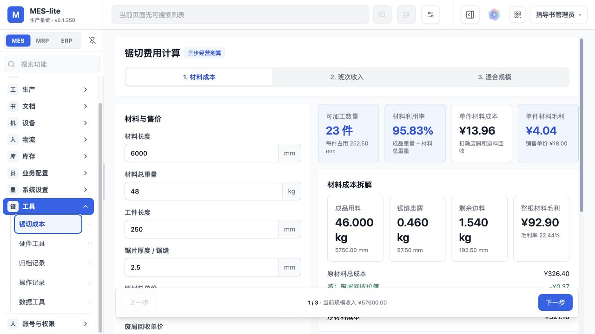

### 单据扫码、扫码计数与标签打印

目的：通过扫码枪打开货箱/发货单据，并验证独立计数和浏览器标签打印底座。

1. 进入工具 > 硬件工具。
2. 扫描或手工输入 `BX-` 货箱码/`SH-` 发货单码，以 Enter 或 Tab 结束，核对匹配结果后打开对应系统单据。
3. 扫码计数：填写任务与目标条码，创建会话后扫描。
4. 标签打印：填写条码、名称、规格、数量和介质尺寸。
5. 先做测试打印并校准纸张；当前打印机 IP 仅保存配置。

结果检查：货箱/发货单码能返回唯一单据，扫码计数正确，测试标签尺寸和条码可读。

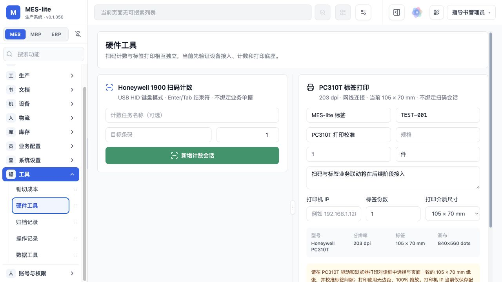

### 管理归档记录

目的：在归档权限、原业务权限和人员数据范围同时满足时，恢复误归档记录或执行受控清理。

1. 进入工具 > 归档记录。
2. 确认当前账号同时具有归档读取权限和目标业务对象读取权限；列表只显示授权业务类型及数据范围内的记录。
3. 恢复前确认同时具有归档更新权限和目标业务更新权限；无权恢复的记录不显示恢复按钮。
4. 永久删除前确认同时具有归档删除权限和目标业务归档权限，并核对依赖、备份和数据范围。

结果检查：越权列表和动作由服务端返回 403；恢复后记录回到业务列表，永久删除保留审计记录。

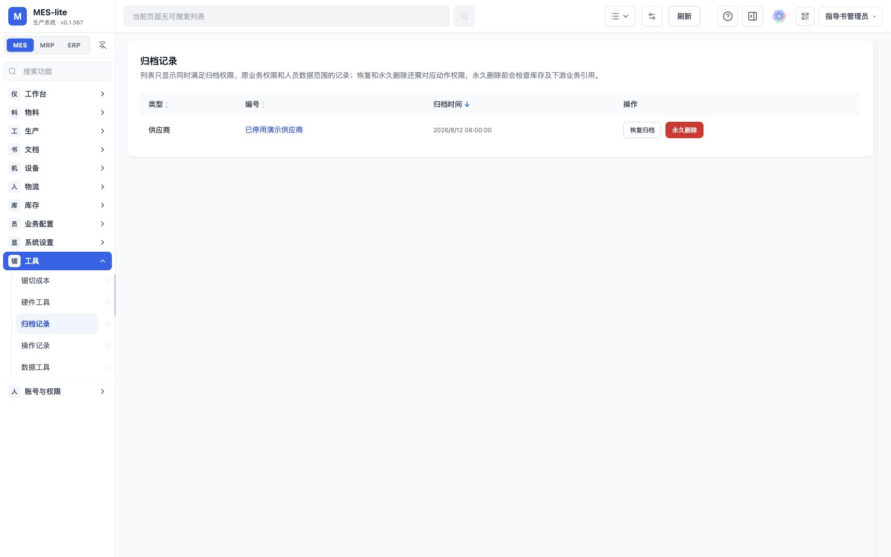

### 查看操作记录

目的：追溯关键业务和系统变更，并确认高风险业务结果与审计记录一致。

1. 进入工具 > 操作记录。
2. 按人员、动作、资源或时间筛选。
3. 抽查生产订单创建/取消、派工状态、生产成本、库存调整、扫码完成、账号注册或人员审批，确认操作人、时间、对象和结果快照完整。
4. 将异常操作与来源单据、库存流水交叉核对；失败请求或幂等重放不得出现虚假成功记录。

结果检查：关键修改可定位到人员、时间、对象和结果；高风险业务结果与审计同事务提交，失败或幂等分支无重复记录。

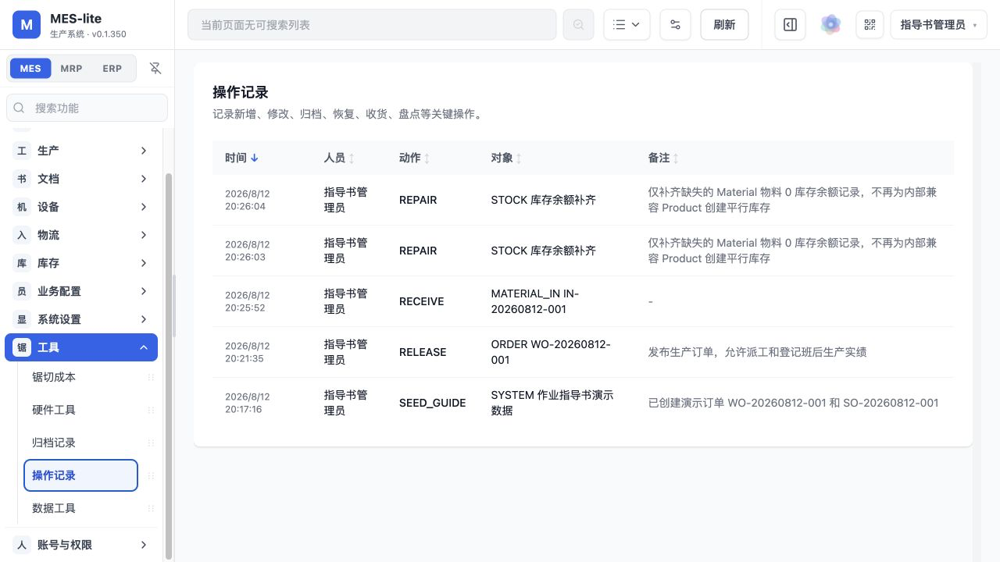

### 执行数据检查

目的：预检关键数据关系并仅处理明确安全的问题。

1. 进入工具 > 数据工具。
2. 先点击“重新检查”。
3. 查看阻塞、警告和可安全修复项。
4. 修改/清理前备份，完成后再次检查。

结果检查：检查无阻塞问题；所有维护动作写入审计记录。

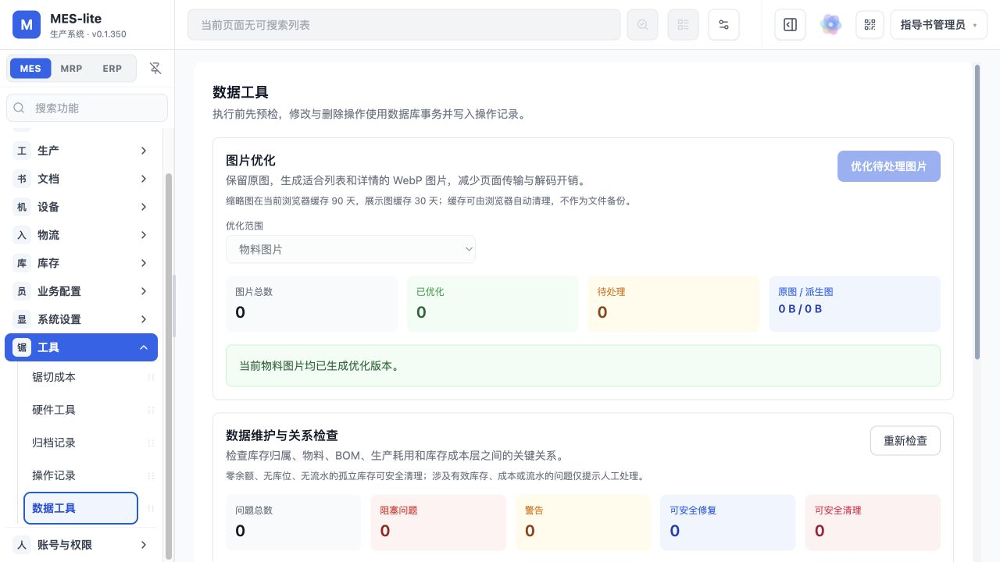

### 人员管理

目的：审核、启停、恢复、维护账号资料并安全清理无关联的登录人员。

1. 进入账号与权限 > 人员管理。
2. 核对登录账号、姓名、手机号、角色、审核和启用状态。
3. 管理员点击“编辑资料”，修改登录账号、姓名或手机号并保存；登录账号重复时系统会阻止保存。
4. 需要重置密码时点击“重置密码”，连续输入两次至少 10 位的新密码并确认；重置会撤销该账号在所有设备上的登录会话。
5. 离职或异常账号应及时停用；需要重新启用已停用账号时点击“恢复”。
6. 测试或误注册账号确认处于待审核、已拒绝或已停用状态后，点击“删除”。
7. 核对二次确认中的账号并确认；若系统提示存在员工、业务、审计、设备、审批、授权或工作区关联，应保留账号并继续使用停用状态。

结果检查：只有已审核且启用的账号能够登录；管理员可维护账号资料、重置密码并恢复已停用账号，重复登录账号会被阻止；重置后旧密码和旧会话失效；只有具备删除权限且无任何受保护关联的非启用账号会被删除，资料、密码重置、状态和删除动作均保留审计。

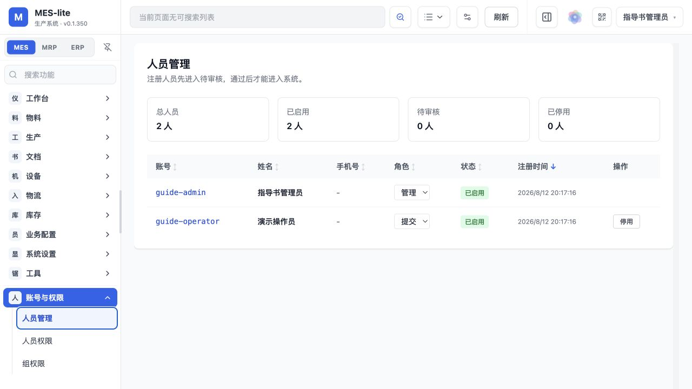

### 配置个人权限

目的：为指定人员分配权限组和个人例外权限。

1. 进入账号与权限 > 人员权限。
2. 选择人员并分配权限组。
3. 仅在必要时增加个人权限。
4. 保存后用该账号复核可见菜单和操作。

结果检查：人员实际权限符合岗位最小权限原则。

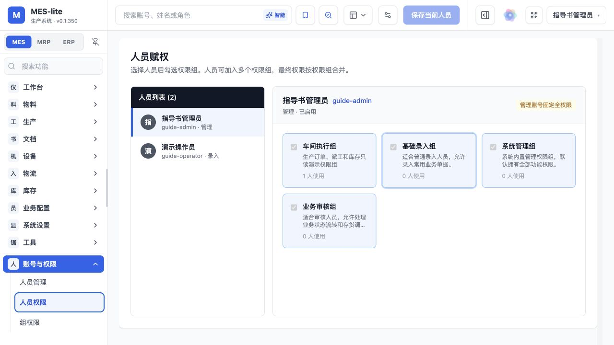

### 配置权限组

目的：维护可复用的岗位权限集合。

1. 进入账号与权限 > 组权限。
2. 选择或新建权限组。
3. 按资源勾选查看、新建、编辑、归档、删除。
4. 保存后复核组内人员。

结果检查：同岗位人员获得一致、可审计的权限。

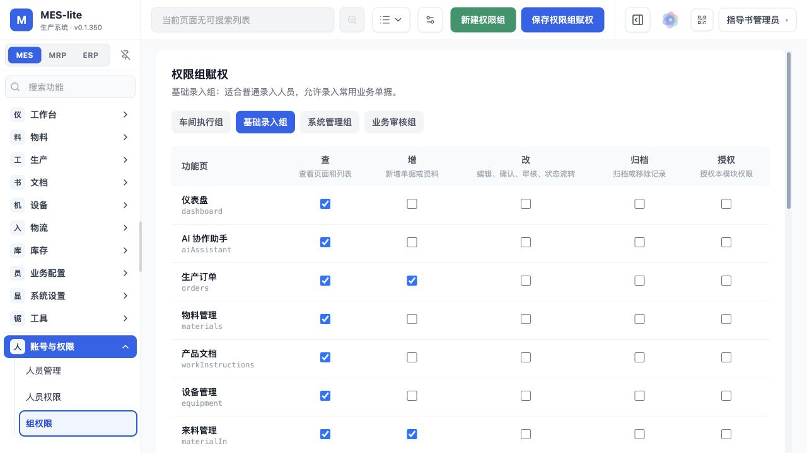

## 13. 跨业务批次追溯全景

### 进入批次追溯全景

目的：从统一入口按任意业务线索查找内部批次。

1. 展开“库存”功能区，进入“批次追溯”。
2. 确认智能搜索支持批号、物料、供应商、客户、库位、来料/生产/检验/发货/退货单；需要精确组合时可直接用高级搜索字段定位。
3. 确认页面显示单次 100 条结果、300 个关联批次的安全上限。

结果检查：页面处于空态，不会在没有搜索线索时加载全库关系。

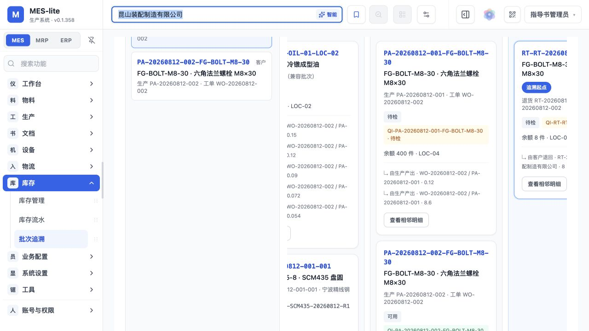

### 按供应批号定位来料批次

目的：从供应商炉批号定位系统内部来料批次。

1. 在顶部搜索框输入供应批号 HEAT-SCM435-20260812-R1。
2. 在左侧匹配结果核对命中依据为“供应批号”。
3. 核对内部批号、物料、来料单和供应商名称。

结果检查：搜索结果只显示匹配批次，供应批号与原始来料信息一致。

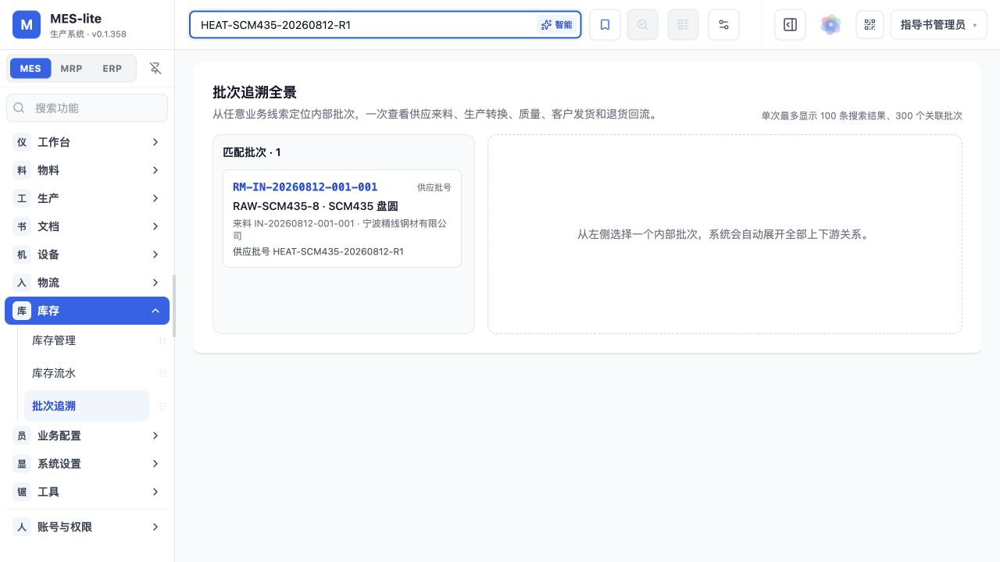

### 展开供应到生产全景

目的：正向查看同一来料批次参与的全部生产转换和质量状态。

1. 点击匹配的来料内部批次。
2. 核对关联批次、转换关系、供应批次、客户和质量检验汇总。
3. 横向查看当前批次与下游生产批次。
4. 核对每个产出批次的工单、实绩、库存余额和质量状态。

结果检查：来料批次能正向展开全部有效生产谱系，转换数量和质量任务可审计。

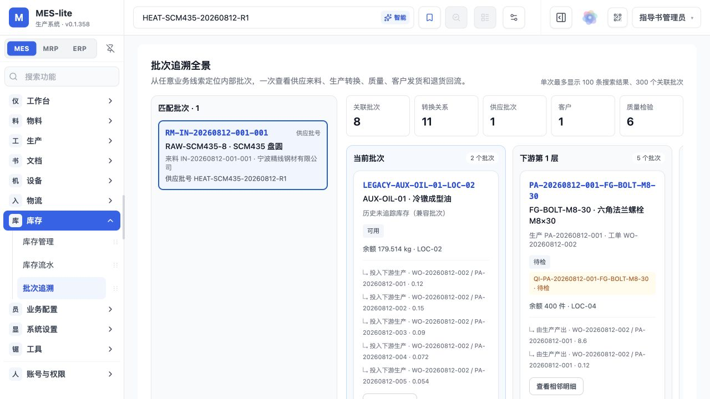

### 按客户定位发货与退货批次

目的：从客户名称定位实际发货批次和退货回流批次。

1. 将搜索词改为客户名称“昆山装配制造有限公司”。
2. 核对结果同时包含客户发货来源生产批次和已收货退货批次。
3. 确认切换搜索词后旧全景已经清空，避免误读。

结果检查：搜索结果标明命中依据为客户或退货单，右侧等待重新选择。

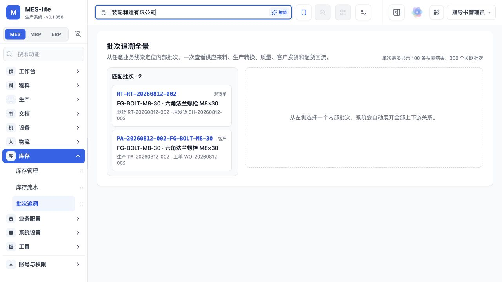

### 从退货批次反查供应来源

目的：从客户退货待检批次反向展开原发货、生产投入和供应批号。

1. 选择退货内部批次 RT-RT-20260812-002。
2. 核对当前批次的待检状态和退货检验单。
3. 向左查看原发货生产批次，再继续查看原料/辅料投入。
4. 在底部核对客户、发货单、发出数量和已退数量。

结果检查：退货批次可反查到原发货、生产批次、工单、来料内部批号和供应批号。

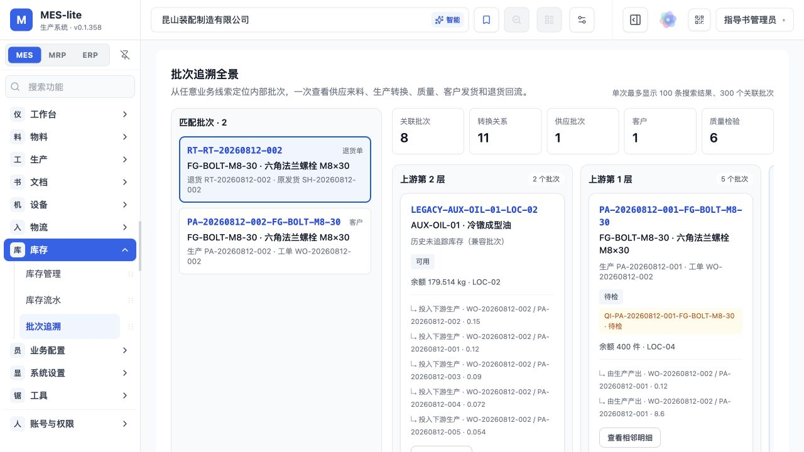

### 查看相邻批次追溯明细

目的：对全景中的单个节点查看相邻关系与客户退货原因。

1. 在目标批次卡点击“查看相邻明细”。
2. 核对当前批次、质量与库存状态。
3. 在客户退货来源中核对原发货批次、退货单、客户、数量和原因。
4. 需要时点击相邻批次继续逐节点核查。

结果检查：相邻明细与全景汇总一致，弹窗内可沿关系继续导航。

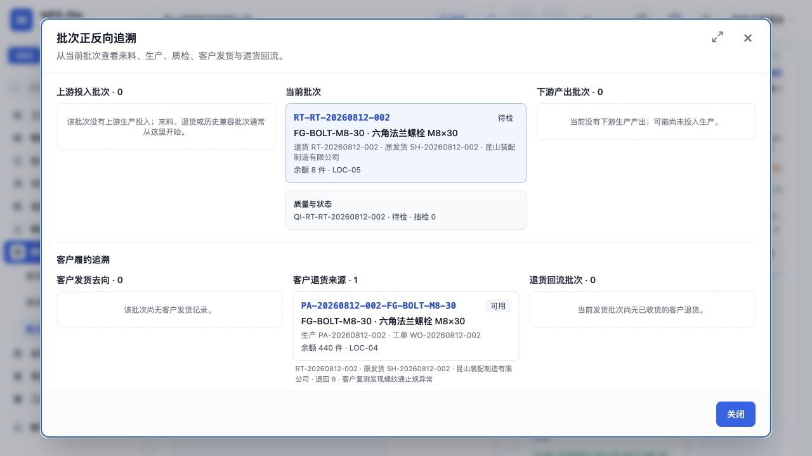

## 14. 岗位任务台与操作权限

### 查看生产主管任务台

目的：按当前账号的服务端权限优先查看生产待办。

1. 使用生产主管账号登录并进入 MES 仪表盘。
2. 在页面首屏查看待发布订单、可登记实绩订单和待确认实绩。
3. 核对每个任务数量与下方业务统计。

结果检查：生产主管只收到其可执行的发布、登记和确认任务。

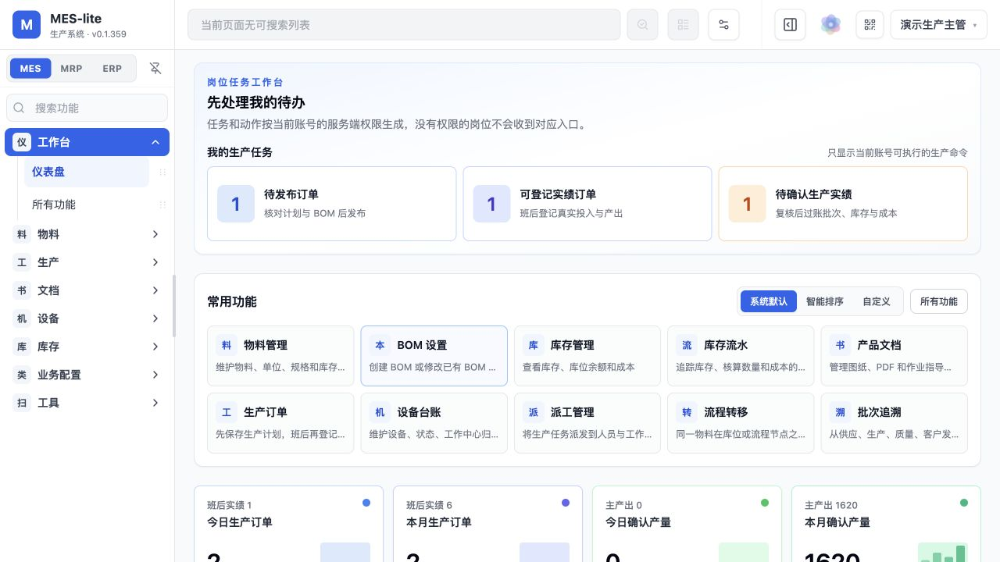

### 直达待发布生产订单

目的：从任务卡直接进入已筛选的业务清单。

1. 在生产主管任务台点击“待发布订单”。
2. 确认系统打开生产订单页。
3. 核对状态筛选自动设为“草稿”，且地址保留任务参数。

结果检查：列表只展示待发布订单，不需要再次手工设置状态。

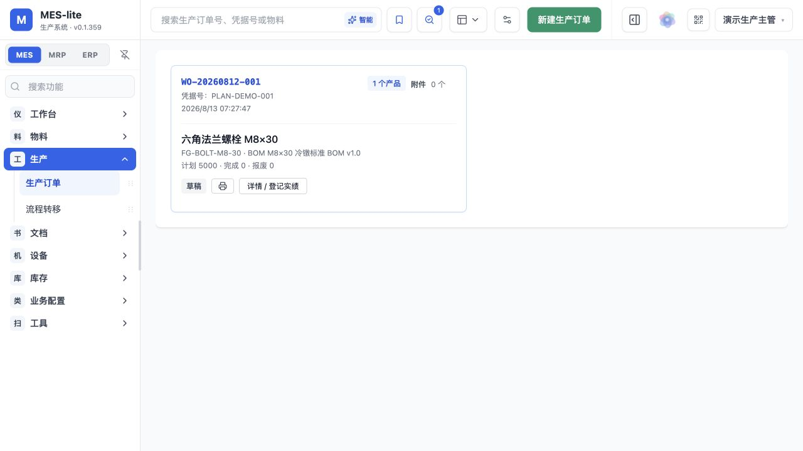

### 查看质检员任务台

目的：让质检岗位只看到允许执行的质量任务。

1. 使用质检员账号登录并进入 MES 仪表盘。
2. 查看“我的质量任务”。
3. 核对质检员只显示待检任务，不显示处置或授权放行任务。

结果检查：任务入口与质量判定权限一致，未授权动作不会出现在任务台。

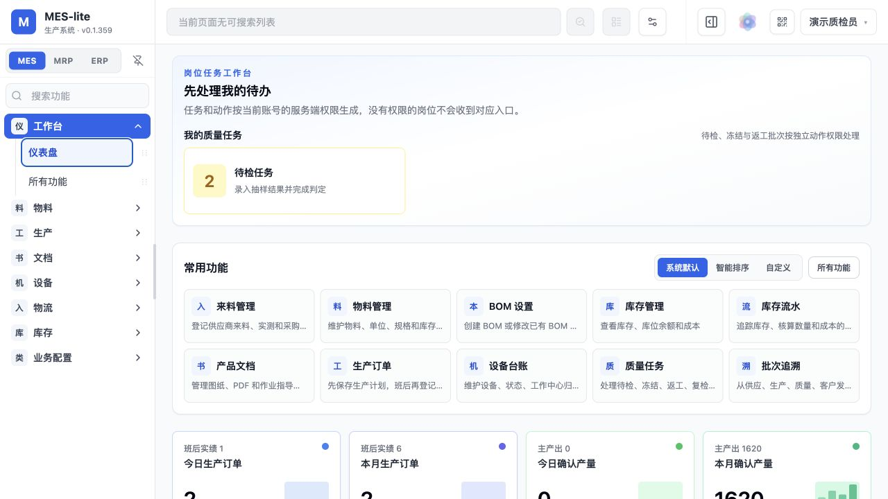

### 直达待检质量任务

目的：从质检员任务卡进入待检视图并使用公共搜索。

1. 在质检员任务台点击“待检任务”。
2. 确认打开质量任务工作台且默认选中待检任务。
3. 使用顶部搜索框按检验单、批次、物料或来源单据检索。

结果检查：页面只显示待检记录，判定按钮与当前岗位权限一致。

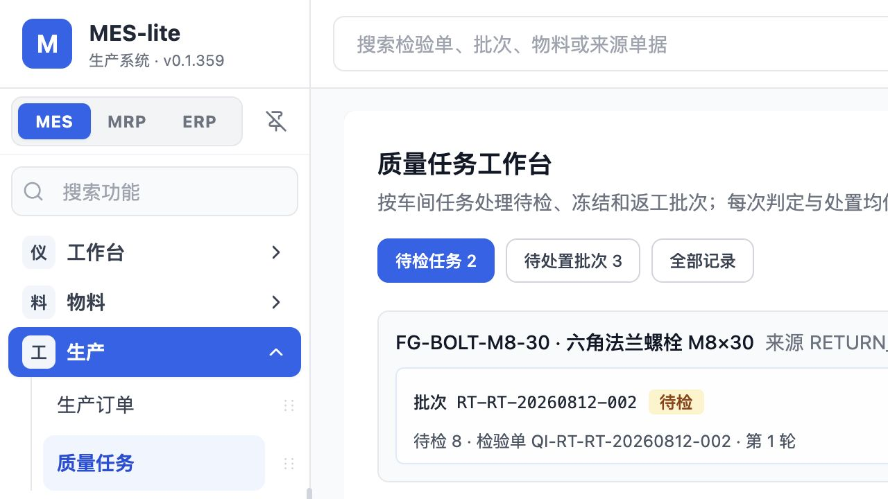

### 查看仓管员任务台

目的：集中处理仓库收货、发货和退货待办。

1. 使用仓管员账号登录并进入 MES 仪表盘。
2. 查看“我的仓储任务”。
3. 核对待收货、待发货和退货待处理数量。

结果检查：仓管任务按单据状态汇总，未授权的生产和质量命令不显示。

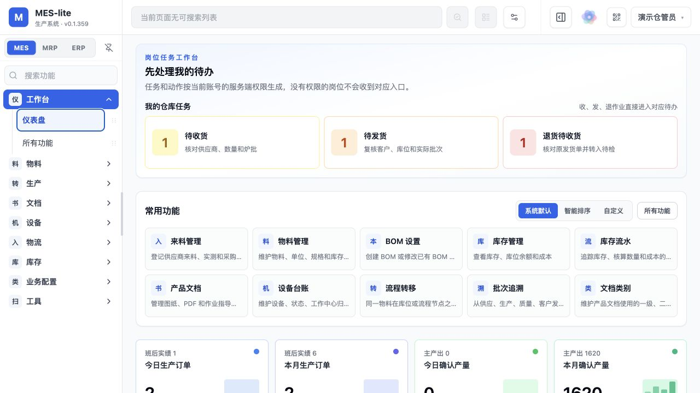

### 直达待收货来料单

目的：从仓储任务卡进入已筛选的来料清单。

1. 在仓管员任务台点击“待收货”。
2. 确认系统打开来料管理页。
3. 核对状态自动筛选为“待收货”。

结果检查：列表只显示需要当前仓储岗位处理的待收货单。

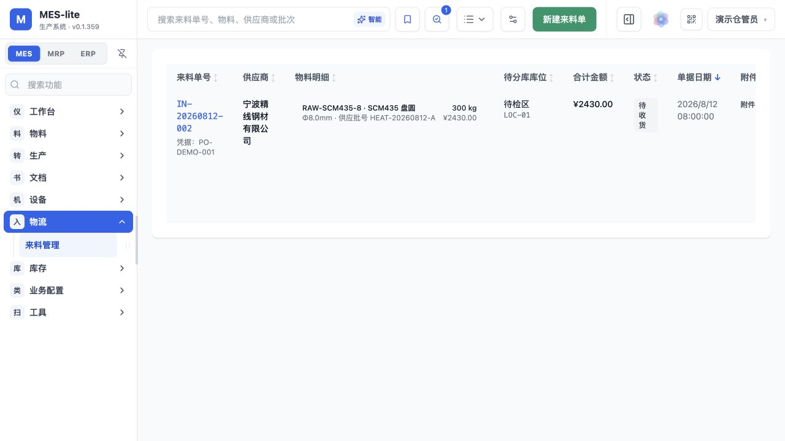

### 配置生产命令权限

目的：把发布、实绩登记、实绩确认和冲销拆成独立授权。

1. 使用管理员账号进入账号与权限 > 组权限。
2. 选择生产管理或计划岗位组。
3. 分别核对生产订单发布、生产实绩登记、生产实绩确认和生产实绩冲销四个资源。
4. 保存后使用目标岗位账号复核任务入口、按钮和 API 结果。

结果检查：四类高风险命令可独立授权；前端按钮和服务端接口使用相同门禁。

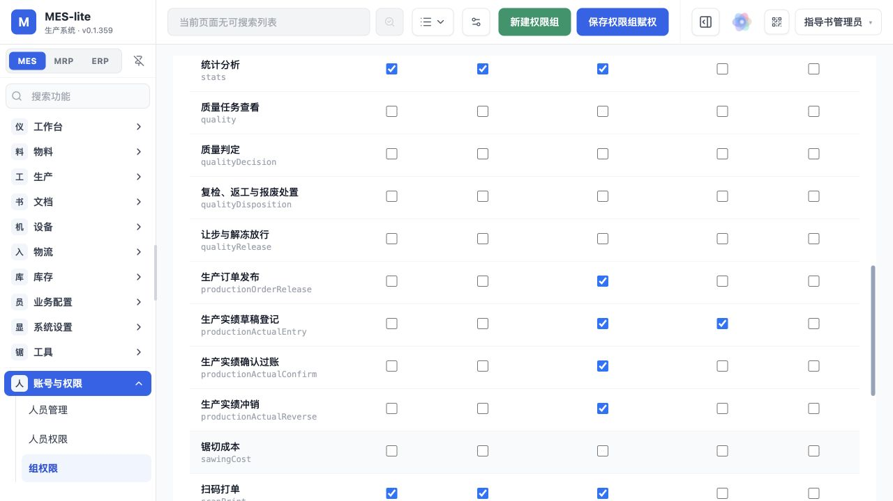

### 在手机端处理岗位待办

目的：让车间人员在窄屏首屏直接看到本人任务。

1. 将浏览器或手持终端调整为手机宽度。
2. 使用生产主管账号进入 MES 仪表盘。
3. 先处理顶部岗位任务卡，再按需展开导航或下方统计。

结果检查：390 像素宽度下任务卡完整可读、可点击，不需要先穿过多级菜单。

## 15. 细粒度权限与岗位边界

### 按业务域查看细粒度权限

目的：在 49 项资源中快速定位要配置的业务权限。

1. 使用管理员进入账号与权限 > 组权限。
2. 选择目标权限组。
3. 按公共入口、生产质量、物料工艺、来料销售、人员运维和升级兼容分区核对。
4. 只修改岗位实际需要的动作。

结果检查：权限矩阵按业务域分区展示，新增、编辑、归档和授权动作可独立配置。

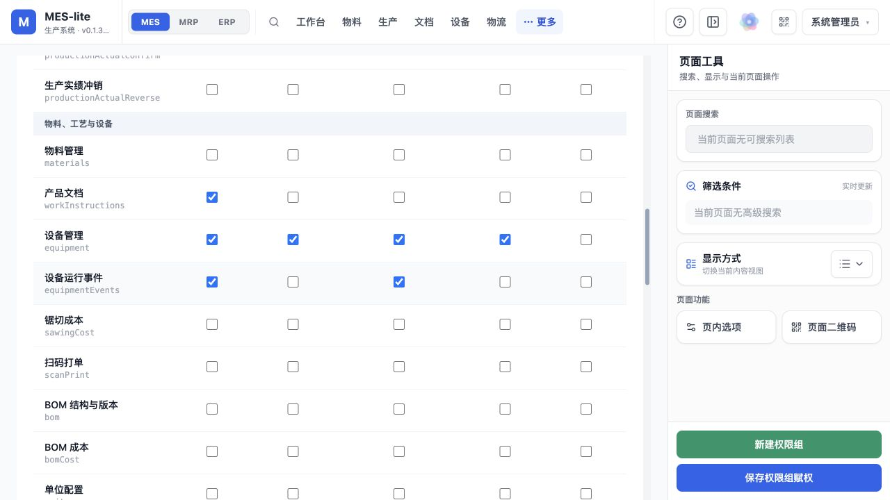

### 分开配置 BOM 结构与成本

目的：避免工艺工程师因维护 BOM 结构而自动获得成本权限。

1. 在组权限中选择工艺技术组。
2. 定位物料、工艺与设备分区。
3. 为 BOM 结构与版本配置必要动作。
4. 保持 BOM 成本关闭，除非岗位确需查看成本。

结果检查：BOM 结构与版本和 BOM 成本是两个独立资源，工艺组可维护结构而不能读取成本。

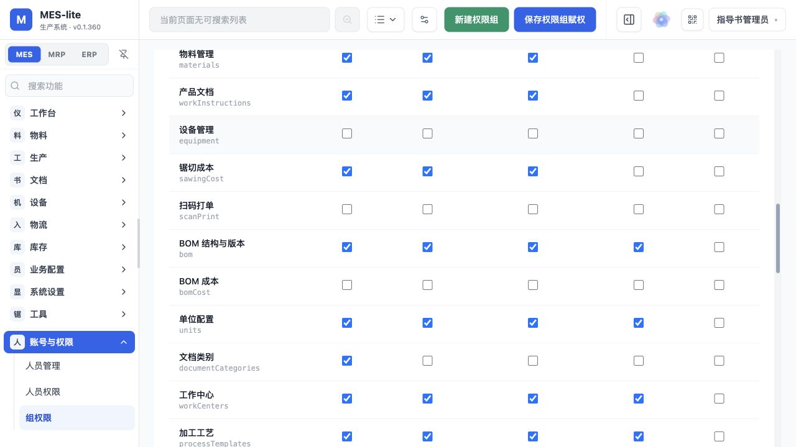

### 使用工艺岗位维护 BOM

目的：让工艺工程师只进入工艺相关页面并维护 BOM。

1. 使用工艺工程师账号登录。
2. 进入物料 > BOM 设置。
3. 新建或选择 BOM 草稿，维护投入、产出与方案名称。
4. 核对左侧没有销售、系统设置和权限管理菜单。

结果检查：工艺岗位可新建和维护 BOM，非工艺业务入口不会显示。

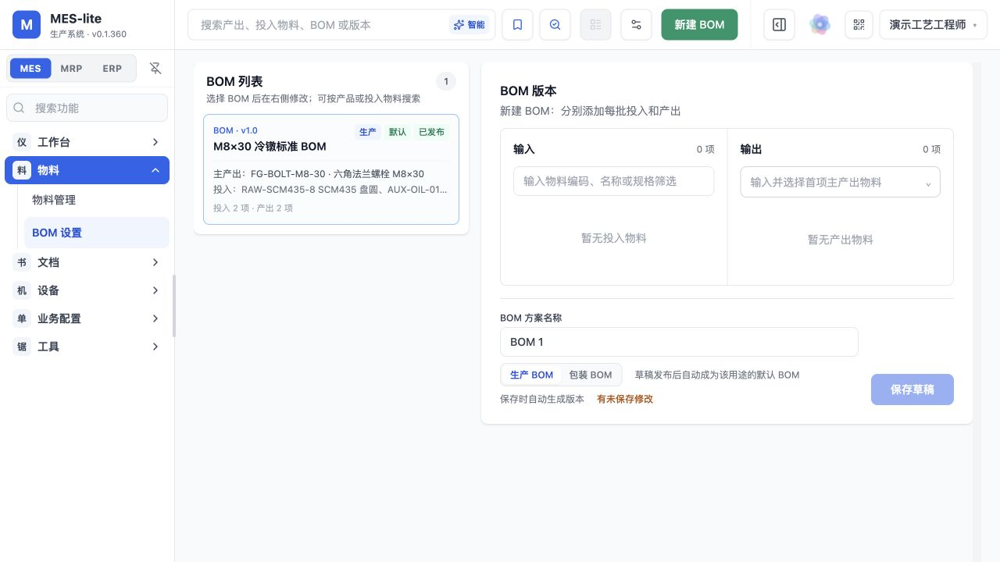

### 使用仓库岗位执行流程转移

目的：让仓库主管独立执行库位转移，不获得统计维护权限。

1. 使用仓库主管账号登录。
2. 进入生产 > 流程转移。
3. 核对已有转移单并按需新建。
4. 确认账号没有统计分析维护入口。

结果检查：流程转移按 flowTransfers 资源授权，可与 stats 统计权限分别控制。

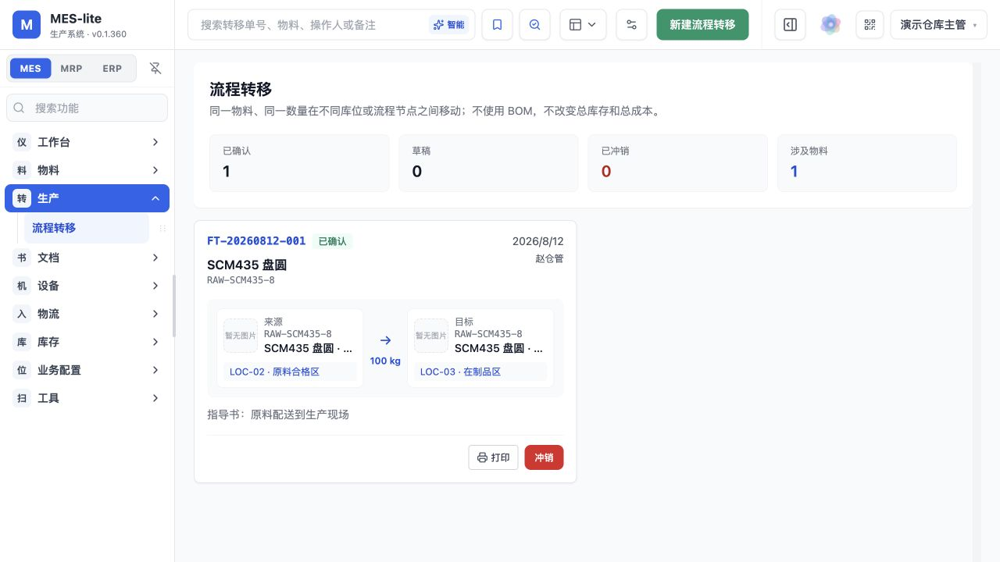

### 使用销售岗位维护客户

目的：让销售跟单人员维护客户和履约资料，不进入员工或系统配置。

1. 使用销售发运账号登录并切换 ERP。
2. 进入业务配置 > 客户资料。
3. 查询、新建或编辑客户。
4. 核对员工、AI、归档和权限管理入口不可见。

结果检查：销售岗位可维护客户、订单、发货与退货，其他主数据和系统设置保持隔离。

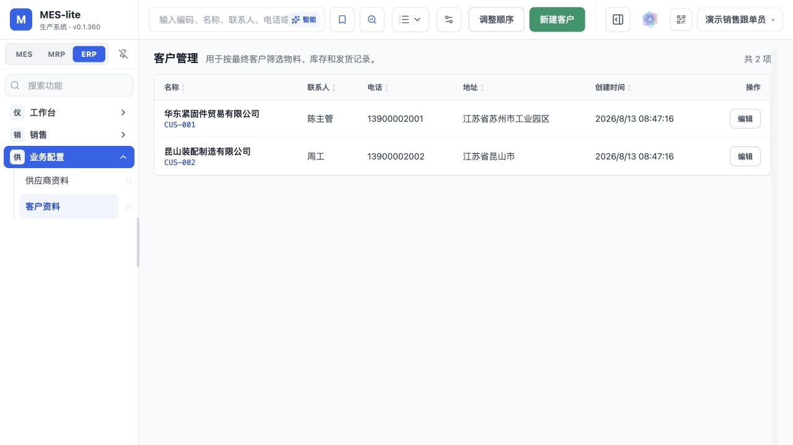

### 使用人事岗位维护员工

目的：把员工业务档案和其他业务主数据分开授权。

1. 使用人事管理员账号登录并切换 MES。
2. 进入业务配置 > 员工资料。
3. 新建或编辑员工，并按需绑定登录账号。
4. 核对客户、库位、工艺和系统设置入口不可见。

结果检查：人事岗位可维护员工与账号状态，但不会自动获得生产、销售或系统配置权限。

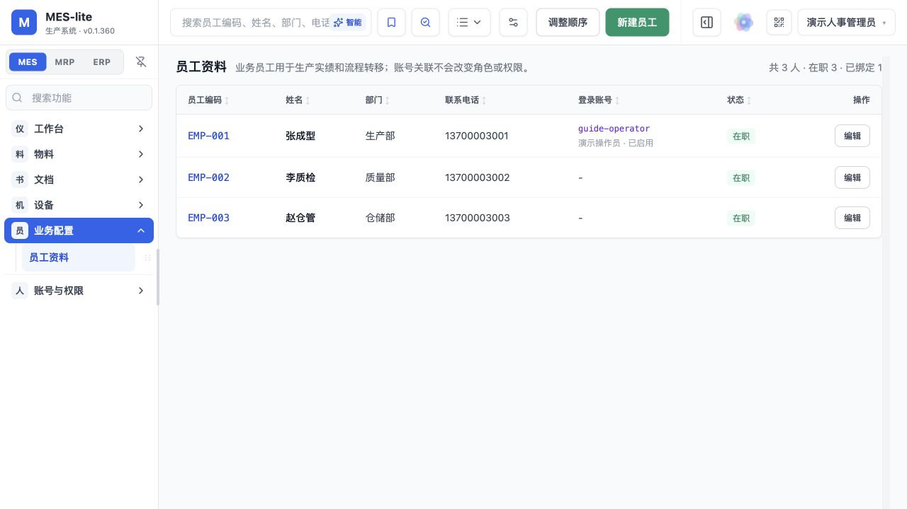

### 只读核对 AI 服务配置

目的：允许运维观察员查看 AI 配置状态而不能修改密钥或模型。

1. 使用 AI 配置只读账号登录。
2. 进入系统设置 > AI 服务。
3. 核对启用开关、提供商、接口、模型和密钥状态。
4. 确认所有字段禁用，且没有保存、测试或图标调参按钮。

结果检查：aiSettings 只读权限仅展示配置；页面动作和写接口均不可用。

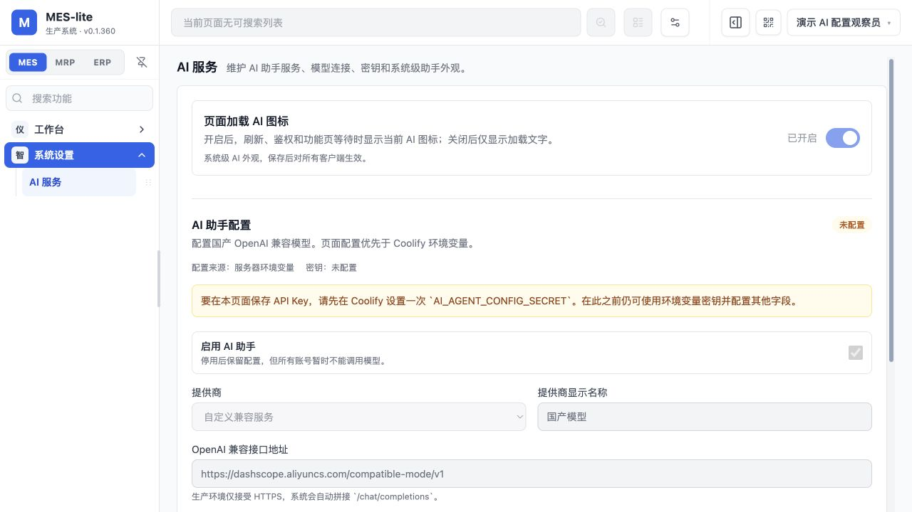

### 使用权限管理员维护赋权

目的：把安全赋权职责与业务、系统运维职责分开。

1. 使用权限管理员账号登录。
2. 进入账号与权限 > 组权限。
3. 维护权限组或人员赋权并保存。
4. 尝试进入企业规则、AI、数据工具等页面并确认被留在已授权页面。

结果检查：权限管理员可维护人员赋权和组权限，但不会自动获得业务数据或系统配置权限。

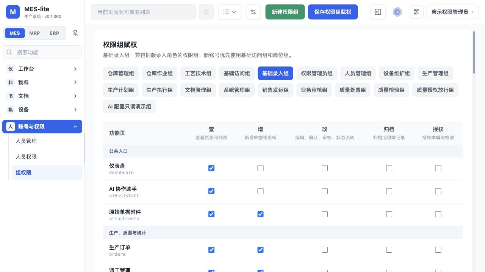

### 在手机端核对权限组

目的：在窄屏设备上查看岗位组和权限矩阵。

1. 将浏览器或手持终端调整到手机宽度。
2. 使用权限管理员账号进入组权限。
3. 选择目标岗位组并纵向浏览资源分区。
4. 涉及批量赋权时仍建议在桌面端完成并复核。

结果检查：375 像素宽度下岗位组可选择、矩阵可阅读，底部导航不会遮挡当前内容。

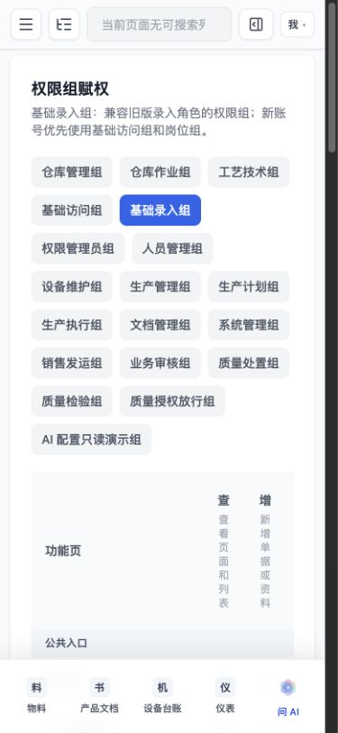

### 分配来料收货与红冲命令

目的：把来料草稿维护、库存收货和高风险红冲分配给不同仓库岗位。

1. 使用权限管理员账号进入账号与权限 > 组权限。
2. 选择仓库作业组，在来料、库存与销售区确认“来料管理”可读/新增/修改，并为“来料收货与拒收”勾选修改。
3. 确认仓库作业组没有“来料红冲”修改权限；选择仓库管理组后，仅依据仓储负责人签字为其勾选来料红冲修改。
4. 保存后使用真实普通仓管和仓库主管账号分别复核按钮与 HTTP 403。

结果检查：普通仓管可登记、编辑、收货或拒收但不能红冲；仓库主管另有有原因红冲，旧通用更新不会自动扩大命令权限。

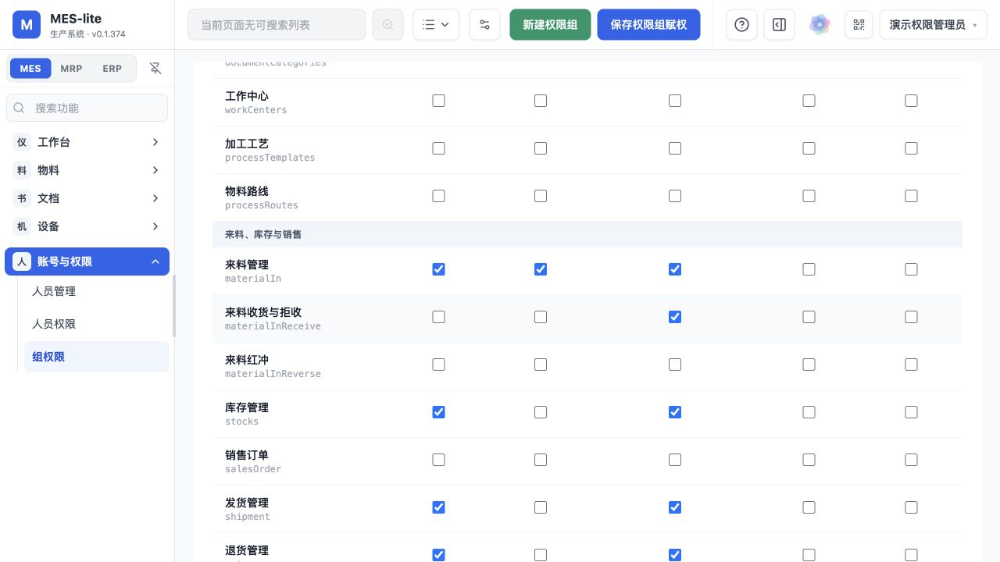

### 按仓库岗位执行来料命令

目的：使用岗位账号完成收货交接，并把整单红冲限制给仓库主管。

1. 普通仓管进入物流 > 来料管理，核对待收货单可编辑并显示“整单收货”“整单拒收”。
2. 确认收货后核对受控物料进入待检、非受控物料进入可用；普通仓管不显示“整单红冲”，直接调用也返回 403。
3. 仓库主管复核原单、批次、质量状态和下游使用情况后，使用有红冲权限的账号打开已收货单。
4. 点击“整单红冲”，填写具体原因并在库存流水、批次、质量任务和审计中复核成对恢复。

结果检查：来料录入、收货/拒收、红冲和质量判定使用四层独立权限，页面动作与服务端门禁一致。

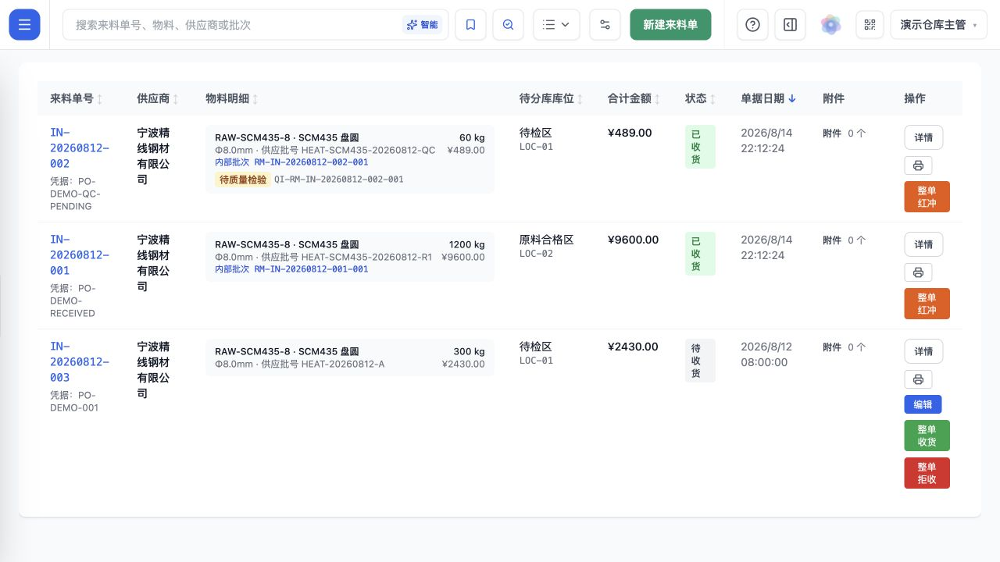

### 分配物流状态命令权限

目的：把单据登记、库存正向执行、业务确认和高风险取消/冲销分配给不同岗位。

1. 使用权限管理员账号进入账号与权限 > 组权限。
2. 选择仓库作业组，确认其具有发货执行、退货收货和流程转移确认，但没有签收、取消、拒绝或冲销。
3. 选择仓库管理组，依据仓储负责人签字增加发货取消、退货拒绝和流程转移冲销。
4. 选择销售发运组，确认其可确认客户签收、取消待发货和拒绝退货，但不能执行仓库出入库。
5. 保存后分别使用通用编辑、普通仓管、仓库主管和销售跟单账号复核按钮与 HTTP 403。

结果检查：61 个资源中的七个物流状态命令独立授权；既有角色、组和个人例外不会由通用修改自动扩大权限。

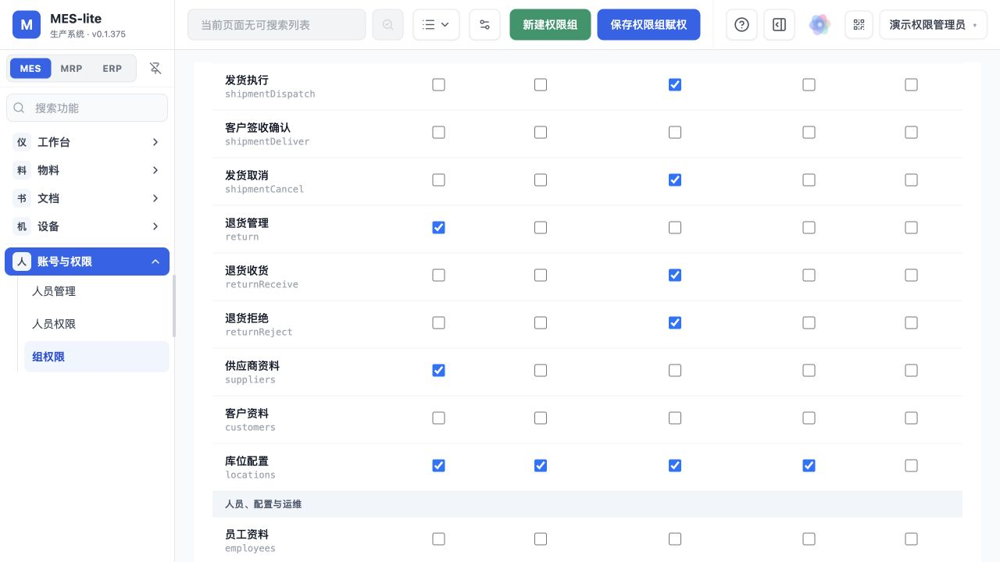

### 仓管确认发货并扣减库存

目的：由普通仓管复核待发货单并执行批次、库存和成本的正向发出。

1. 使用普通仓管账号进入销售 > 发货管理，筛选待发货。
2. 复核客户、全部发货物料、各明细发货库位、数量和物流单号；发货单不关联销售订单。
3. 点击“确认发货”，等待状态变为已发货。
4. 在详情、库存流水和批次追溯中复核实际批次、数量、成本和可信操作人。

结果检查：普通仓管可以执行发货库存过账，但页面不显示客户签收和取消命令；直接越权调用返回 403。

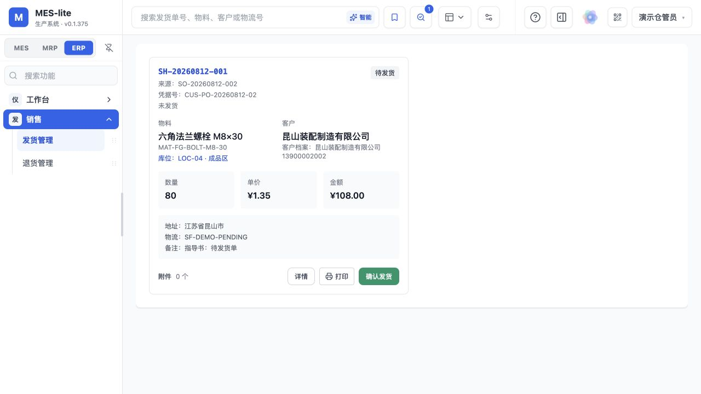

### 销售确认客户签收

目的：由销售跟单确认客户已签收，不允许其代替仓库执行库存发出。

1. 使用销售跟单账号进入销售 > 发货管理，筛选已发货。
2. 复核发货单、客户、物流单号和发货时间。
3. 点击“确认签收”，等待状态变为已签收。
4. 在操作记录中核对 DELIVER 动作、操作人和前后状态。

结果检查：销售跟单可确认客户签收，但不能执行库存发货；签收动作不重复扣减库存。

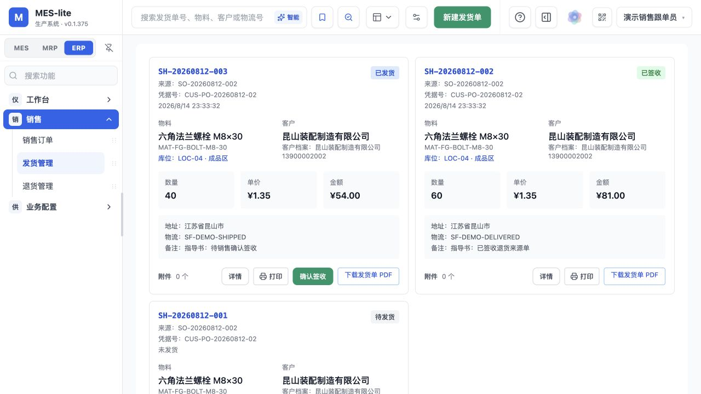

### 有原因取消待发货单

目的：在尚未扣减库存前，由获批主管结束错误或已撤销的待发货单。

1. 使用仓库主管或销售负责人账号打开待发货单。
2. 确认单据尚未发货且没有库存、成本或批次过账。
3. 点击“取消发货”，填写至少 2 个字的具体原因。
4. 确认后核对状态为已取消，并在操作记录中复核 CANCEL、原因、操作人和前后快照。

结果检查：取消仅允许待发货状态且必须记录原因；普通仓管与通用编辑账号没有该命令。

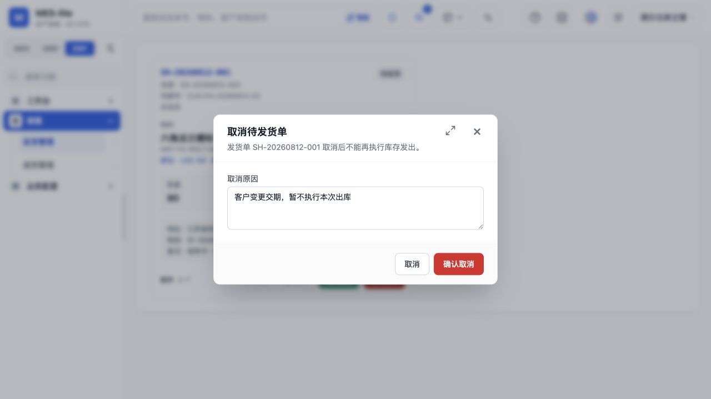

### 仓管接收入库退货

目的：由普通仓管核对原发货来源，将客户退货接收入库并进入待检状态。

1. 使用普通仓管账号进入销售 > 退货管理，筛选待处理。
2. 复核原发货单、客户、物料、剩余可退数量、退回库位和退货原因。
3. 点击“确认退货收货”。
4. 在详情、质量任务、库存流水和批次追溯中核对独立退货批次及 QUARANTINE 数量。

结果检查：普通仓管可以接收入库退货但不能拒绝申请；退货库存进入待检，不直接增加可用量。

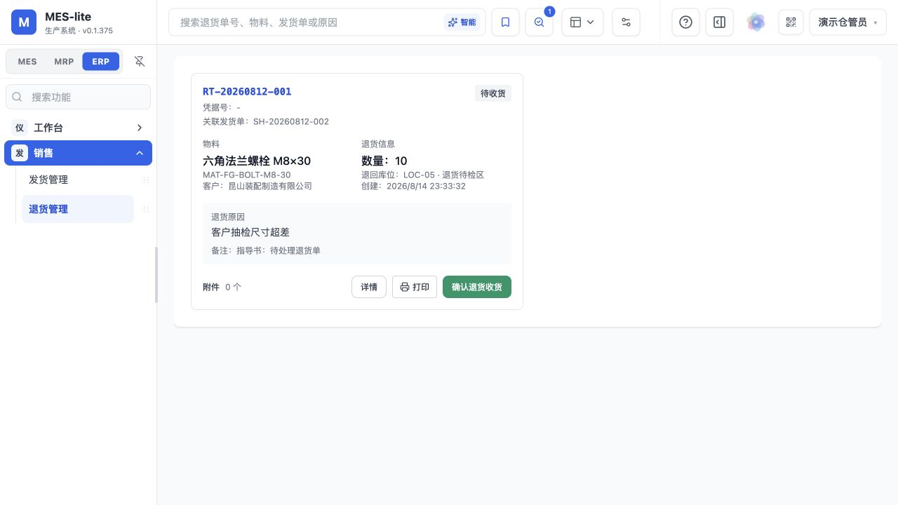

### 有原因拒绝退货

目的：由获批销售或仓库主管拒绝不符合协议的待处理退货，且不产生库存。

1. 使用销售跟单或仓库主管账号打开待处理退货单。
2. 核对客户、原发货、物料、数量及退货协议依据。
3. 点击“拒绝退货”，填写至少 2 个字的具体原因。
4. 确认后核对状态为已拒绝、没有退货批次或库存流水，并在操作记录中复核 REJECT 原因。

结果检查：退货拒绝与退货收货分离授权；拒绝必须有原因且不会产生库存或质量任务。

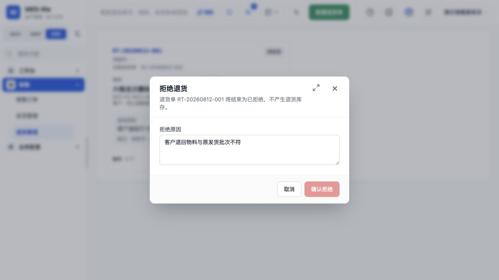

### 仓管确认正向流程转移

目的：由普通仓管确认同物料、同数量的正向移库，不改变总库存和总成本。

1. 使用普通仓管账号进入生产 > 流程转移，找到草稿转移单。
2. 复核物料、来源库位、目标库位、数量和操作员工。
3. 点击“确认移库”，再次核对移动方向后确认。
4. 在库位余额和库存流水中核对一出一入，总库存、计价数量和成本层保持不变。

结果检查：普通仓管可确认正向移库但不能冲销；库存只在两个获批库位之间移动。

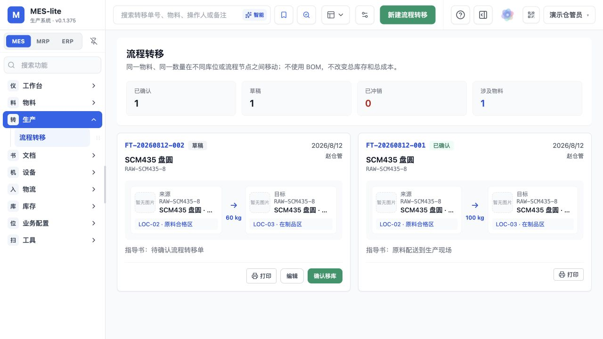

### 主管有原因冲销流程转移

目的：由获批主管在目标库位余额足够时恢复原移库，保留完整原因和审计。

1. 使用仓库主管或生产主管账号打开已确认流程转移单。
2. 复核目标库位仍有足够可用数量，确认没有造成单边恢复风险。
3. 点击“冲销”，填写具体原因并确认。
4. 核对数量从目标库位移回来源库位，一出一入流水、REVERSE 审计和总库存/成本守恒。

结果检查：冲销与草稿修改、正向确认独立授权；普通仓管调用冲销返回 403，主管必须填写原因。

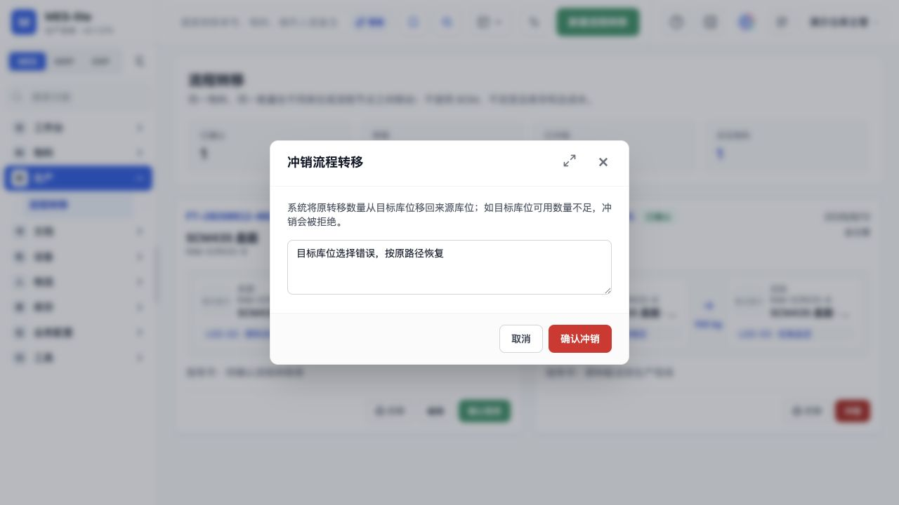

## 16. 人员数据范围与临时授权

### 配置本人和指定库位范围

目的：限制操作员只能处理本人生产任务和获批库位业务数据。

1. 使用权限管理员进入账号与权限 > 人员权限。
2. 选择已绑定在职员工的目标账号。
3. 将生产范围设为“本人”，库存范围设为“指定库位”。
4. 勾选允许操作的库位并保存。

结果检查：页面显示本人范围及获批库位；目标账号的列表、统计、任务、附件和状态动作使用同一服务端范围。

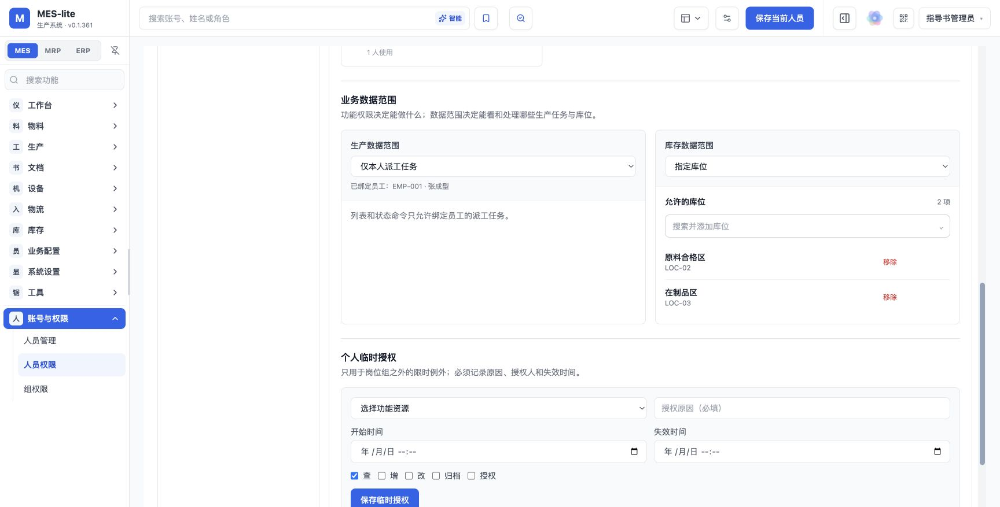

### 授予个人临时权限

目的：为短期替岗或异常处置提供有原因、有期限、可审计的个人例外。

1. 在人员权限中选择目标账号。
2. 选择资源并勾选确需临时授予的动作。
3. 填写业务原因、开始时间和失效时间。
4. 保存后复核生效状态；任务完成后可提前移除。

结果检查：授权记录显示原因、授权人和有效期；到期后自动从有效权限中排除，新增、修改和删除均写入审计。

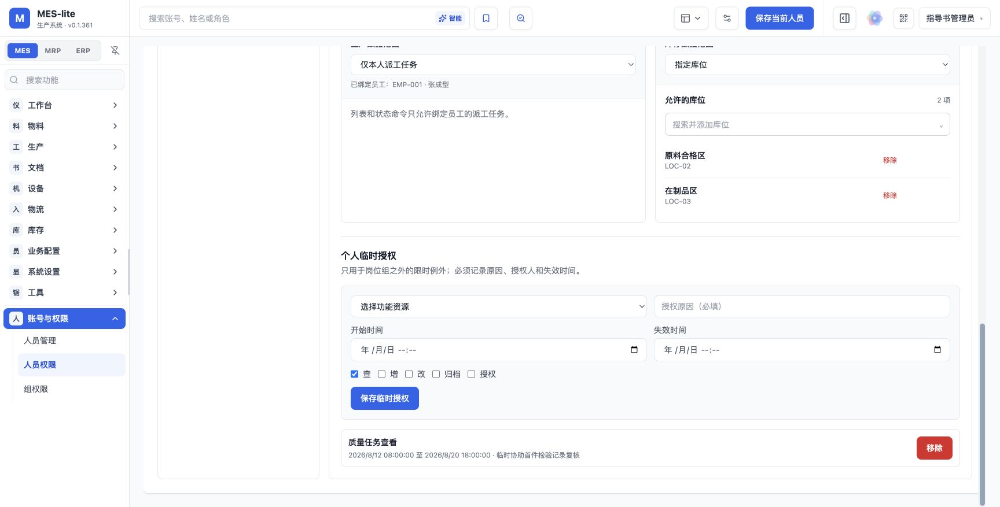

### 配置工作中心和全库范围

目的：让生产主管查看获批工作中心，同时按岗位职责访问全厂库存。

1. 使用权限管理员选择生产主管账号。
2. 将生产范围设为“指定工作中心”。
3. 勾选允许管理的工作中心。
4. 按审批结果将库存范围设为“全部库位”，保存并使用目标账号复核。

结果检查：生产订单、派工、实绩、统计与任务只覆盖所选工作中心；库存业务按已保存的全库范围执行。

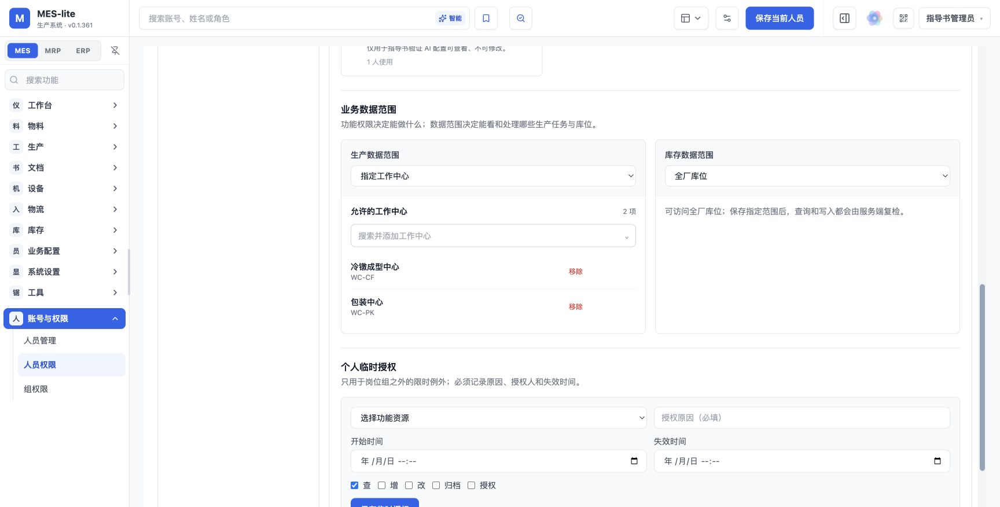

## 17. Coolify 发布、备份与恢复

### 固定生产提交并关闭自动部署

目的：让生产只部署经过审批的精确版本，避免 main 推送直接改变线上状态。

1. 进入 Coolify 应用 > Git Source，填写并保存已批准的完整 Commit SHA。
2. 进入 Advanced，关闭 Auto Deploy。
3. 核对顶部 Running 链接仍指向当前批准提交且状态为 healthy。
4. 只有在备份、CI 和维护窗口就绪后才人工 Redeploy。

结果检查：生产发布由完整提交和人工维护窗口双重控制；推送 main 不再自动部署。

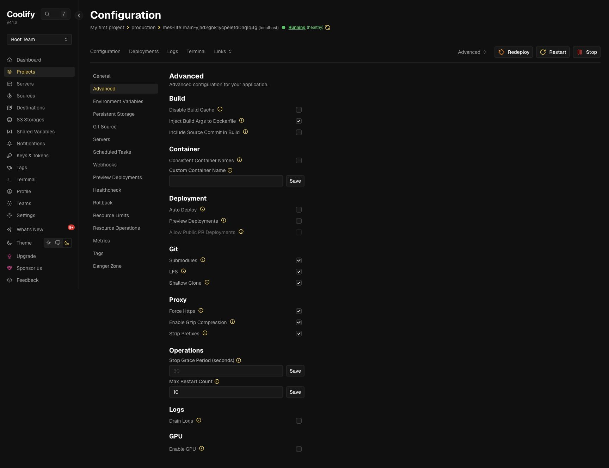

### 配置持久备份目录

目的：确保容器重建后数据库、附件和备份归档都保留。

1. 进入应用 > Persistent Storage。
2. 核对 data 映射到 /app/data。
3. 核对 uploads 映射到 /app/public/uploads。
4. 新增并核对 backups 映射到 /app/backups。

结果检查：Directories 显示 3 项，三个业务目录均为独立持久挂载。

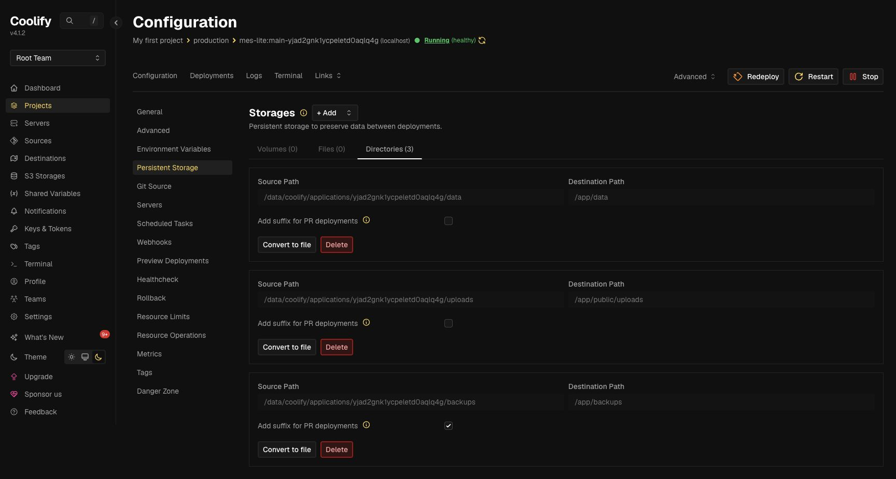

### 配置每日一致备份

目的：每日生成包含 SQLite 一致快照和附件的可验证归档。

1. 进入 Scheduled Tasks 并打开“MES-lite 每日一致备份”。
2. 填写命令 node /app/scripts/runtime-backup.mjs create。
3. 先核验容器时区；当前 UTC 容器使用 0 18 * * * 对应北京时间 02:00。
4. 设置 1800 秒超时并保存。

结果检查：任务已启用，最近执行状态为 Success；失败通知由 Coolify 邮件通道发送。

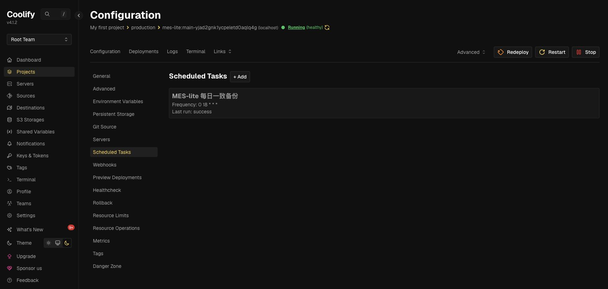

### 执行并验证首份生产备份

目的：确认真实生产数据库和附件能生成通过完整校验的归档。

1. 在每日备份任务点击 Execute Now。
2. 等待 Recent executions 显示 Success。
3. 展开执行结果，记录 archivePath 与 SHA-256。
4. 核对 databaseQuickCheck=ok、附件记录数和清单文件数。

结果检查：首份生产一致备份成功并保存可追溯的归档路径、SHA-256 和清单统计。

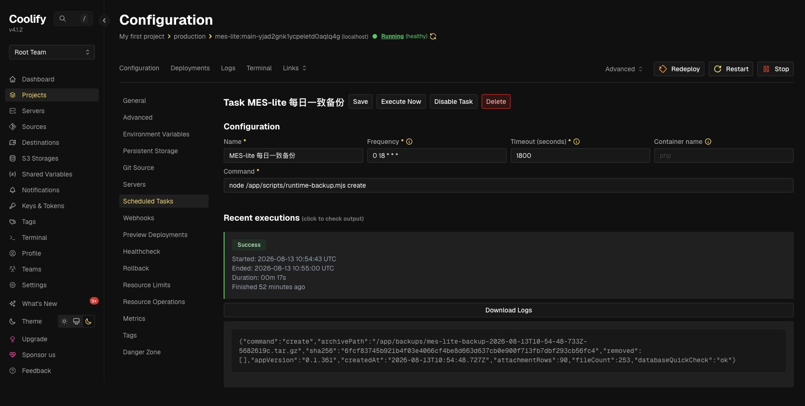

### 验证生产就绪状态

目的：在发布或恢复后确认应用、数据库、迁移、持久目录和备份新鲜度同时可用。

1. 打开 https://mes.szxiangshu.com/api/health/ready。
2. 确认 HTTP 状态为 200 且整体 status 为 ready。
3. 逐项核对 database、migrations、dataStorage、attachmentStorage 和 backupFreshness。
4. 任一硬检查失败时停止验收并按返回项排查。

结果检查：所有硬检查与备份新鲜度均为 pass，Coolify 同时显示 Running (healthy)。

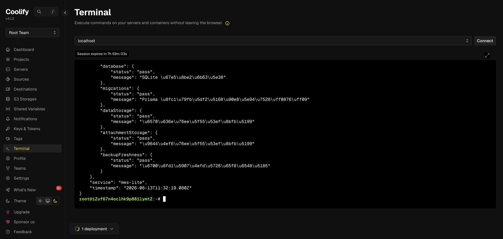

### 核对迁移前备份与启动日志

目的：证明每次非空生产部署会先完成一致备份，再执行迁移和启动服务。

1. 完成固定版本 Redeploy 后进入应用 Logs。
2. 核对 data、uploads 和 backups 三个目录权限均已就绪。
3. 记录启动前 create 结果中的归档、SHA-256、附件数和 quick_check。
4. 确认 76 个迁移无待处理、Next.js Ready 且顶部 Running healthy。

结果检查：新容器先生成经验证备份，再执行迁移并健康启动；旧容器只在新容器健康后移除。

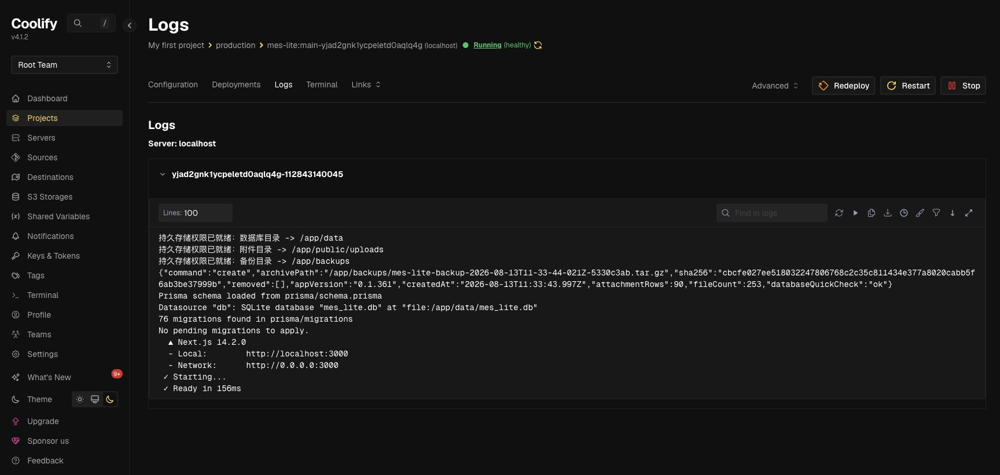

### 执行应用级恢复演练

目的：在不改写在线生产和源候选的前提下，先收敛恢复候选的 Schema 漂移，再证明它能启动隔离应用并通过关键业务抽查。

1. 准备已验证的恢复候选数据库和附件目录，固定目标 Git 提交，并确认所有输出路径不存在。
2. 执行 npm run audit:production-schema-drift，核对源证据哈希未变、目标迁移基线正确，并保存不可覆盖的 JSON 报告。
3. 如审计返回漂移，先审批历史数据处置，再执行 npm run prepare:production-schema-reconciliation，生成退役结构归档和非覆盖收敛候选。
4. 只有候选后置审计为 NO_SCHEMA_DRIFT时，才执行 npm run storage:drill:application，填写数据库、附件、目标、报告、环境、备份创建时间和操作人。
5. 等待全附件哈希、迁移、readiness、临时管理员登录、物料/库存/生产单和附件原文件抽查完成。
6. 核对 Schema 和应用报告：所有技术检查为 PASS、RPO/RTO 分别判定，临时管理员已清理，且源候选 SHA-256 全程未变。

结果检查：Schema 收敛候选的后置审计为零漂移，隔离应用检查全部通过，且在线生产和源候选未被改写。备份超过 24 小时时 RPO 必须判定失败；异地副本与真实 Coolify 挂载切换仍单独验收。

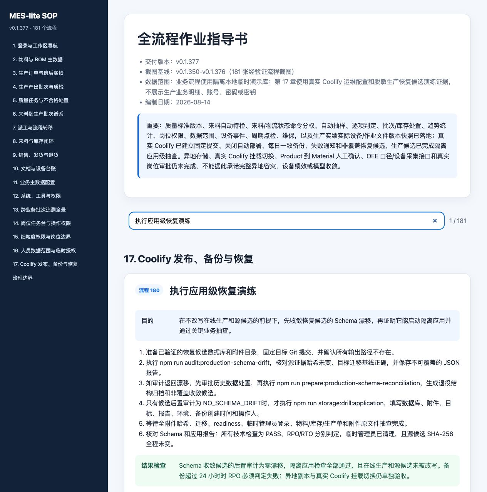

### 预检 Product 到 Material 映射

目的：在进入生产维护窗口前，只读验证人工映射签字、引用一致性、库存风险和数据漂移。

1. 在停止写入的生产恢复候选上先执行 audit 和 plan，并将映射文件交给熟悉业务数据的负责人逐行核对。
2. 为每个 Product 填写 materialId、materialCode、库存处置和非空 decision.note，最后填写真实确认人及确认时间。
3. 执行 product-material-migration.mjs preflight，并把输出写入不存在的新报告文件。
4. 只有报告为 PASS、readyForApply=true 且 databaseSha256Before 与 databaseSha256After 相同时，才允许安排备份和维护窗口 apply。
5. 若报告为 FAILED，按错误修正；如提示签字后数据变化，废弃旧映射并重新生成，禁止绕过预检。

结果检查：未签字、缺少核对依据、引用冲突、非零库存或签字后漂移都会在写数据前被拒绝并留档；预检本身不创建备份、不回填数据库。

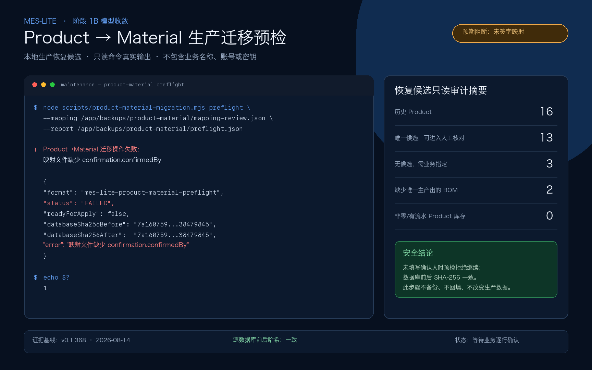

## 暂不作为现行 SOP 的治理项

- 生产、退货和显式启用标准的来料质量闭环与岗位动作权限已贯通；正式上线前仍须按企业审批制度配置岗位权限、数据范围并使用真实不合格评审单验收。
- 供应商、来料待检、生产投入产出、发货和退货回流已形成可搜索全景；未发布来料检验标准的物料仍直接入可用库存，跨工厂或供应商系统集成不在本阶段。
- 岗位任务、生产命令、来料收货/拒收与红冲命令、本人/工作中心生产范围与库位库存范围已经分层；已有安装须按岗位审批显式授予新来料命令，部门/班组范围尚未独立建模。
- 设备开机、停机、故障和恢复已形成事件时间线，周期点检、保养、维修工单、备件批次成本和现场附件已贯通；真实产量采集与 OEE 口径仍待企业确认。
- 生产实绩已冻结实际设备和作业文件版本；没有设备或文件时必须分别保存例外原因。文件快照只保存正文和附件元数据清单，法规级原件固化仍需内容哈希与保留策略。
- 精确库存冲销已建立原流水与冲销流水双向关系并校验数量、核算量和成本守恒；部分退货等一对多回流只表示一般来源关系，不能据此认定原流水已整笔冲销。
- 每条库存余额必须且只能归属 Material 或待迁移的旧 Product；无归属和双归属写入由数据库拒绝，旧 Product-only 库存仍须按人工确认计划迁移。
- DOCX、PDF、离线 Web 与视频成品保存在本地 output 目录，不进入 Git 或 Docker 发布树；PDF/DOCX 和自托管视频可发布到同一个只读对象存储地址，视频通过 sop/videos.json 关联现有 SOP 章节与流程。
- 最终 PDF/DOCX 登记到站内产品文档库时必须先做零写入预检和一致备份，再由启用的文控账号显式执行；版本、路径、大小或 SHA-256 不一致时不得生效。
- 旧 Product 与 Material 仍需分阶段迁移，禁止继续扩展旧模型写入口。
