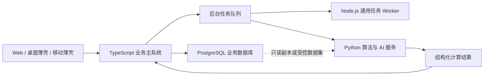

# MES-lite 功能模块规划

## 一、系统总体架构

```
┌─────────────────────────────────────────────────────────────┐
│                        MES-lite 系统                         │
├──────────┬──────────┬──────────┬──────────┬─────────────────┤
│  来料管理 │  派工管理 │  产量统计 │  库存管理 │  发货/退货/成本  │
└──────────┴──────────┴──────────┴──────────┴─────────────────┘
```

### 1.1 技术架构演进原则

MES-lite 长期保留 TypeScript 业务主系统，不规划把现有后端整体改写为 Python。MES 的核心负载是页面交互、业务校验、数据库事务、状态流转、权限和审计，现有 Next.js、TypeScript 与 Prisma 技术栈可以让前后端共享类型、枚举和校验规则，适合持续建设统一业务模块。

未来采用“TypeScript 业务核心 + PostgreSQL 生产数据库 + 按需 Python 计算服务”的混合架构：



各层职责固定如下：

| 层级 | 长期职责 | 不承担的职责 |
| --- | --- | --- |
| TypeScript 业务主系统 | 页面、API、账号权限、业务规则、库存和生产事务、审计、外部系统接入 | 不在同步请求内执行长时间算法任务 |
| PostgreSQL | 生产业务唯一事实源、并发事务、约束、备份与恢复 | 不把业务规则分散到不可追踪的临时脚本 |
| Node.js Worker | 图片优化、PDF 处理、批量导入导出、通知等通用异步任务 | 不复制主系统权限和库存算法 |
| Python 服务 | OCR、机器视觉、APS 排程、预测性维护、复杂统计和模型推理 | 不直接成为账号、权限、BOM、库存或工单的第二事实源 |

### 1.2 Python 服务引入门槛

只有同时满足以下条件时才新增 Python 服务：

1. 已存在可测量的计算密集型、算法型或 Python 生态依赖需求，普通 TypeScript 服务难以合理实现。
2. 输入、输出、超时、失败、重试和幂等规则能够定义成稳定的 API 或任务消息契约。
3. 算法结果必须返回 TypeScript 主系统，由主系统完成权限检查、人工确认、业务写入和审计。
4. Python 默认不直接写生产业务表；训练和分析优先使用受控导出数据、只读副本或专用分析库。
5. 服务具备独立版本、日志、监控和部署方式，不与主系统形成无法回滚的隐式耦合。

普通 CRUD、列表筛选、表单校验、报表查询、权限控制和库存事务不得仅因“Python 更流行”而拆分。单个 AI 功能也不构成重写主系统的理由。

### 1.3 分阶段扩展路线

| 阶段 | 目标 | 主要工作 |
| --- | --- | --- |
| 当前阶段 | 稳定 TypeScript 单体 | 继续提取公共页面、关系模块和业务服务，收敛事务与审计边界 |
| 数据库阶段 | 支撑多人并发和可靠运维 | 生产环境由 SQLite 迁移 PostgreSQL，建立约束、备份、恢复和迁移演练 |
| 异步化阶段 | 隔离耗时任务 | 引入任务队列和 Node.js Worker，迁移图片、PDF、导入导出和通知任务 |
| 混合计算阶段 | 按需求补充算法能力 | 独立接入 Python OCR、视觉质检、APS 排程、预测维护或模型推理服务 |
| 分析阶段 | 避免分析拖慢生产事务 | 需要时建设只读副本、分析库或数据仓库，不直接在生产库执行重型分析 |

该路线的优先顺序是数据库可靠性、业务模块边界、后台任务，最后才是按需引入 Python；不以微服务数量或编程语言数量作为系统先进程度的指标。具体边界见 [ADR 0022：TypeScript 业务核心与按需 Python 计算服务](./adr/0022-typescript-core-and-python-compute-services.md)。

商业化 SaaS 的目标不是把当前单实例直接复制给每个客户，而是采用“共享多租户为主、企业独立数据单元为高阶套餐”的架构。PostgreSQL 继续作为唯一业务事实源，OSS 承载附件对象，应用租户上下文和 PostgreSQL RLS 共同隔离客户数据；达到负载、地域或合规阈值后再按 DataCell 扩展。完整方案见 [MES-lite 商业化 SaaS 数据与存储架构](./architecture/saas-data-and-storage-architecture.md)。

---

## 二、模块详细规划

### 模块 1：来料管理（Material Inbound）

**功能定位**：管理原材料从供应商到货、质检到入库的全流程

#### 1.1 数据模型

| 实体 | 说明 |
|------|------|
| Supplier | 供应商 |
| MaterialIn | 来料入库单 |

**Supplier（供应商）字段：**
- id, code（供应商编码）, name（供应商名称）
- contact（联系人）, phone（电话）, address（地址）
- createdAt

**MaterialIn（来料入库单）字段：**
- id, inboundNo（入库单号：IN-YYYYMMDD-XXX）
- supplierId（供应商）, materialId（物料）
- qty（数量）, unit（单位）
- unitPrice（单价）, totalAmount（总金额）
- batchNo（批次号）
- status（状态：PENDING/INSPECTING/RECEIVED/REJECTED）
- inboundDate（入库日期）, receivedBy（收货人）
- note（备注）

#### 1.2 状态流转

```
PENDING（待收货） → INSPECTING（质检中） → RECEIVED（已入库）
                                          ↘ REJECTED（已拒收）
```

#### 1.3 API 接口

| 方法 | 路径 | 功能 |
|------|------|------|
| GET | `/api/suppliers` | 供应商列表 |
| POST | `/api/suppliers` | 新增供应商 |
| GET | `/api/material-ins` | 来料单列表（支持状态筛选） |
| POST | `/api/material-ins` | 创建来料单 |
| GET | `/api/material-ins/:id` | 来料单详情 |
| PATCH | `/api/material-ins/:id/receive` | 确认收货（入库+增加库存） |
| PATCH | `/api/material-ins/:id/reject` | 拒收 |

#### 1.4 核心业务逻辑

1. 创建来料单时自动生成入库单号
2. 确认收货时：
   - 校验状态必须为 PENDING
   - 增加原材料库存（qty + availableQty）
   - 记录库存日志（IN 类型，refType=MATERIAL_IN）
   - 更新状态为 RECEIVED
3. 拒收时状态改为 REJECTED，不影响库存

---

### 模块 2：派工管理（Dispatch）

**功能定位**：将生产工单的工序分派给具体工人，跟踪派工进度

#### 2.1 数据模型

**Dispatch（派工单）字段：**
- id, dispatchNo（派工单号：DP-YYYYMMDD-XXX）
- orderId（关联工单）, stepId（关联工序）
- workerName（工人姓名）, workerId（工号）
- planQty（计划数量）
- priority（优先级：LOW/NORMAL/HIGH/URGENT）
- status（状态：PENDING/DISPATCHED/IN_PROGRESS/COMPLETED/CANCELLED）
- dispatchedAt（派工时间）, startedAt（开始时间）, completedAt（完成时间）
- note（备注）

#### 2.2 状态流转

```
PENDING（待派工） → DISPATCHED（已派工） → IN_PROGRESS（进行中） → COMPLETED（已完成）
     ↘ CANCELLED（已取消）
```

#### 2.3 API 接口

| 方法 | 路径 | 功能 |
|------|------|------|
| GET | `/api/dispatches` | 派工单列表（支持工人、状态、工单筛选） |
| POST | `/api/dispatches` | 创建派工单 |
| GET | `/api/dispatches/:id` | 派工单详情 |
| PATCH | `/api/dispatches/:id/start` | 开始生产 |
| PATCH | `/api/dispatches/:id/complete` | 完成派工 |
| PATCH | `/api/dispatches/:id/cancel` | 取消派工 |

#### 2.4 核心业务逻辑

1. 创建派工单：
   - 校验工单状态必须为 PICKED 或 RUNNING
   - 校验工序属于该工单产品的工艺路线
   - 校验该工序是否已完成（未完成才能派工）
   - 自动生成派工单号
2. 开始生产：状态改为 IN_PROGRESS，记录开始时间
3. 完成派工：
   - 状态改为 COMPLETED
   - 记录完成时间
   - （可选）自动触发工序报工
4. 取消派工：仅 PENDING/DISPATCHED 状态可取消

---

### 模块 3：产量统计（Production Statistics）

**功能定位**：按时间、产品、工序、工人等维度统计产量数据

#### 3.1 统计维度

| 维度 | 说明 |
|------|------|
| 按时间 | 日/周/月产量趋势 |
| 按产品 | 各产品产量占比 |
| 按工序 | 各工序完成情况 |
| 按工人 | 工人绩效统计 |
| 按质量 | 合格率/不良品统计 |

#### 3.2 API 接口

| 方法 | 路径 | 功能 |
|------|------|------|
| GET | `/api/stats/production` | 产量统计（支持维度筛选） |
| GET | `/api/stats/quality` | 质量统计 |
| GET | `/api/stats/worker` | 工人绩效统计 |
| GET | `/api/stats/dashboard` | 仪表盘汇总数据 |

#### 3.3 统计指标

- 计划产量 vs 实际产量
- 完成率（实际产量/计划产量）
- 合格率（合格数/总数）
- 不良率（不良数/总数）
- 工时统计
- 人均产量

---

### 模块 4：库存管理（Inventory Management）

**功能定位**：完善的库存管理，包括原材料、成品的出入库、盘点、预警

#### 4.1 已有功能（增强）

| 功能 | 说明 |
|------|------|
| 库存查询 | 支持物料/成品分类、关键词搜索 |
| 盘点调整 | 调整库存数量，记录原因 |
| 库存日志 | 所有库存变动记录 |

#### 4.2 新增功能

| 功能 | 说明 |
|------|------|
| 库存预警 | 低于安全库存自动预警 |
| 库存明细 | 按批次/单据号查询明细 |
| 出入库记录 | 统一的出入库流水 |

#### 4.3 API 接口（新增）

| 方法 | 路径 | 功能 |
|------|------|------|
| GET | `/api/stocks/logs` | 库存变动日志列表 |
| GET | `/api/stocks/alerts` | 库存预警列表 |
| POST | `/api/stocks/transfer` | 库存调拨（预留） |

---

### 模块 5：发货管理（Shipment）

**功能定位**：成品发货管理，从创建发货单到出库的全流程

#### 5.1 数据模型

**Shipment（发货单）字段：**
- id, shipmentNo（发货单号：SH-YYYYMMDD-XXX）
- productId（产品）
- qty（数量）
- unitPrice（单价）, totalAmount（总金额）
- customer（客户名称）, customerPhone（客户电话）, address（收货地址）
- status（状态：PENDING/SHIPPED/DELIVERED/CANCELLED）
- shippedAt（发货时间）, shippedBy（发货人）
- trackingNo（物流单号）
- note（备注）

#### 5.2 状态流转

```
PENDING（待发货） → SHIPPED（已发货） → DELIVERED（已签收）
     ↘ CANCELLED（已取消）
```

#### 5.3 API 接口

| 方法 | 路径 | 功能 |
|------|------|------|
| GET | `/api/shipments` | 发货单列表（支持状态、客户筛选） |
| POST | `/api/shipments` | 创建发货单 |
| GET | `/api/shipments/:id` | 发货单详情 |
| PATCH | `/api/shipments/:id/ship` | 确认发货（扣减库存） |
| PATCH | `/api/shipments/:id/deliver` | 确认签收 |
| PATCH | `/api/shipments/:id/cancel` | 取消发货 |

#### 5.4 核心业务逻辑

1. 创建发货单：
   - 校验成品库存充足
   - 自动生成发货单号
2. 确认发货：
   - 校验状态必须为 PENDING
   - 扣减成品库存（qty - availableQty）
   - 记录库存日志（OUT 类型，refType=SHIPMENT）
   - 更新状态为 SHIPPED
3. 取消发货：
   - 仅 PENDING 状态可取消
   - SHIPPED 状态取消需走退货流程

---

### 模块 6：退货统计（Return Order）

**功能定位**：客户退货管理，从退货申请到入库处理

#### 6.1 数据模型

**ReturnOrder（退货单）字段：**
- id, returnNo（退货单号：RT-YYYYMMDD-XXX）
- shipmentId（关联发货单，可选）
- productId（产品）
- qty（数量）
- reason（退货原因）
- status（状态：PENDING/PROCESSED/REJECTED）
- processedAt（处理时间）, processedBy（处理人）
- note（备注）

#### 6.2 状态流转

```
PENDING（待处理） → PROCESSED（已处理）
               ↘ REJECTED（已拒绝）
```

#### 6.3 API 接口

| 方法 | 路径 | 功能 |
|------|------|------|
| GET | `/api/returns` | 退货单列表（支持状态筛选） |
| POST | `/api/returns` | 创建退货单 |
| GET | `/api/returns/:id` | 退货单详情 |
| PATCH | `/api/returns/:id/process` | 处理退货（退回库存） |
| PATCH | `/api/returns/:id/reject` | 拒绝退货 |

#### 6.4 核心业务逻辑

1. 创建退货单：记录退货原因和关联发货单
2. 处理退货：
   - 校验状态必须为 PENDING
   - 增加成品库存（qty + availableQty）
   - 记录库存日志（RETURN_IN 类型，refType=RETURN）
   - 更新状态为 PROCESSED
3. 拒绝退货：状态改为 REJECTED，不影响库存

---

### 模块 7：成本统计（Cost Statistics）

**功能定位**：统计生产成本、物料成本、人工成本等

#### 7.1 数据模型

**CostRecord（成本记录）字段：**
- id
- orderId（关联工单，可选）
- costType（成本类型：MATERIAL/LABOR/EQUIPMENT/OVERHEAD/OTHER）
- category（明细分类：如 轴承钢/车工工资/设备折旧 等）
- amount（金额）
- description（描述）
- date（发生日期）
- createdBy（记录人）
- createdAt

#### 7.2 成本类型

| 类型 | 说明 | 示例 |
|------|------|------|
| MATERIAL | 物料成本 | 原材料采购费 |
| LABOR | 人工成本 | 工人工资、加班费 |
| EQUIPMENT | 设备成本 | 设备折旧、维护费 |
| OVERHEAD | 制造费用 | 水电费、厂房租金 |
| OTHER | 其他成本 | 运输费、包装费 |

#### 7.3 API 接口

| 方法 | 路径 | 功能 |
|------|------|------|
| GET | `/api/costs` | 成本记录列表（支持类型、时间筛选） |
| POST | `/api/costs` | 新增成本记录 |
| GET | `/api/costs/stats` | 成本统计（按类型/时间维度） |
| GET | `/api/costs/order/:orderId` | 工单成本明细 |

#### 7.4 统计分析

- 总成本趋势（日/周/月）
- 成本构成占比（饼图）
- 单位产品成本
- 工单成本明细
- 同比/环比分析

---

## 三、前端页面规划

### 3.1 页面结构

顶部导航栏（标签页切换）：

| 标签页 | 子页面/功能 |
|--------|------------|
| 工单管理 | 工单列表、创建工单、工单详情 |
| 来料管理 | 来料单列表、创建来料单、来料单详情 |
| 派工管理 | 派工单列表、创建派工、派工详情 |
| 库存管理 | 库存查询、库存日志、库存预警 |
| 发货管理 | 发货单列表、创建发货单、发货详情 |
| 退货管理 | 退货单列表、创建退货单、退货详情 |
| 统计分析 | 产量统计、质量统计、成本统计、仪表盘 |

### 3.2 各页面功能

#### 仪表盘（首页）
- 今日产量/本月产量
- 待办事项（待收货、待发货、待处理退货）
- 库存预警
- 最近7天产量趋势图
- 产品产量占比

#### 产量统计
- 时间范围选择
- 维度切换（产品/工序/工人）
- 趋势图表
- 数据表格
- 导出功能

#### 成本统计
- 成本构成饼图
- 成本趋势折线图
- 成本明细表格
- 工单成本对比

---

## 四、实施优先级

### 第一阶段（核心业务）
1. ✅ 生产工单管理（已完成）
2. ✅ 库存管理基础（已完成）
3. 来料管理
4. 派工管理
5. 发货管理

### 第二阶段（统计分析）
6. 产量统计
7. 退货管理
8. 成本统计

### 第三阶段（增强功能）
9. 库存预警
10. 仪表盘
11. 报表导出
12. 权限管理

---

## 五、统一编码规则

| 单据类型 | 前缀 | 格式 | 示例 |
|----------|------|------|------|
| 生产工单 | WO | WO-YYYYMMDD-XXX | WO-20260703-001 |
| 来料入库 | IN | IN-YYYYMMDD-XXX | IN-20260703-001 |
| 派工单 | DP | DP-YYYYMMDD-XXX | DP-20260703-001 |
| 发货单 | SH | SH-YYYYMMDD-XXX | SH-20260703-001 |
| 退货单 | RT | RT-YYYYMMDD-XXX | RT-20260703-001 |

---

## 六、状态枚举统一

| 模块 | 状态值 | 说明 |
|------|--------|------|
| 通用 | PENDING | 待处理 |
| 通用 | COMPLETED | 已完成 |
| 通用 | CANCELLED | 已取消 |
| 来料 | INSPECTING | 质检中 |
| 来料 | RECEIVED | 已入库 |
| 来料 | REJECTED | 已拒收 |
| 派工 | DISPATCHED | 已派工 |
| 派工 | IN_PROGRESS | 进行中 |
| 发货 | SHIPPED | 已发货 |
| 发货 | DELIVERED | 已签收 |
| 退货 | PROCESSED | 已处理 |
