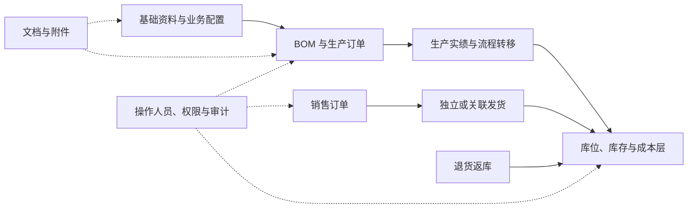
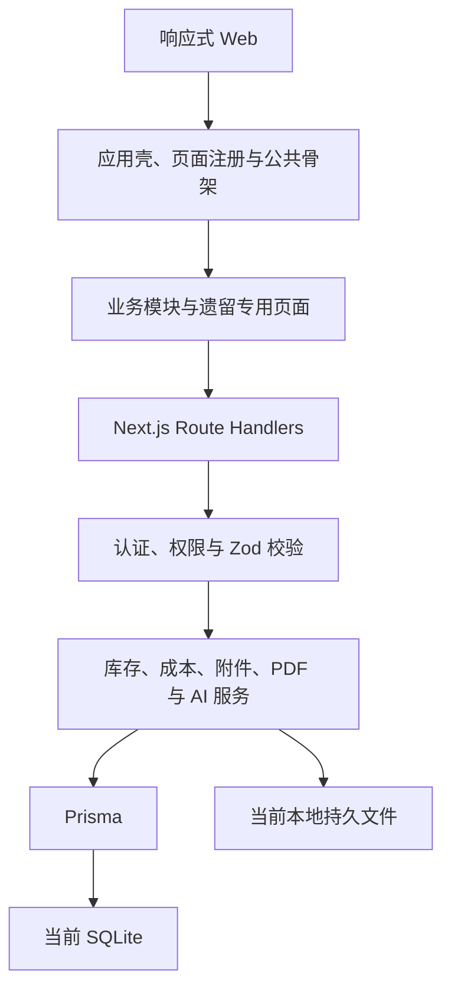

# MES-lite 系统开发与理解手册

> 文档定位：本文是 MES-lite 的系统级总说明书，用于快速建立业务、页面、权限、数据和代码之间的整体认知。
>
> 事实基线：`v0.1.374` / 2026-08-14。代码会持续变化；当文档与代码冲突时，以 `lib/page-registry.ts`、`lib/permissions.ts`、`prisma/schema.prisma`、`sop/manifest.json` 和实际 API 为准。
>
> 文档总入口：[MES-lite 文档中心](./README.md)。

## 1. 先用十分钟理解系统

MES-lite 是面向小微制造企业的轻量化复合系统：

- **MES 是主体**：管物料、BOM、生产订单、生产实绩、库位、库存、设备、文档和流程转移。
- **MRP-lite 有限支持**：当前主要提供 BOM 用量与生产订单所需的基础数据，不是完整的净需求和自动计划引擎。
- **ERP-lite 有限支持**：管客户、供应商、销售订单、发货、退货和销售价格快照，不包含财务总账、应收应付、税务和完整采购管理。

三个工作区只是菜单和认知边界，底层仍是同一个 Web 应用、同一套页面注册、权限和数据。业务页面原则上只归属一个工作区，避免同一功能在 MES、MRP、ERP 里重复出现。



## 2. 如何阅读本手册

| 读者 | 建议阅读路径 |
| --- | --- |
| 企业管理者 | 第 1、3、4、5、16 章，先确认系统做什么与不做什么 |
| 产品经理/实施人员 | 第 3–8、15–17 章，理解页面、流程、权限和缺口 |
| 前端开发 | 第 6、9、10、15 章，理解页面注册和公共骨架 |
| 后端/数据开发 | 第 7、11–14 章，理解 API、数据不变式和权限校验 |
| 运维 | 第 12、13、14 章，理解环境、存储、测试和部署 |

### 2.1 信息可信度顺序

1. **运行代码和数据库迁移**：当前已实现事实。
2. **本手册**：系统级导航与当前边界。
3. **专题文档**：某个领域的细节、流程或验收标准。
4. **ADR**：已接受的重要架构决策及理由。
5. **规划文档**：只是目标，不能当作已实现功能。
6. **历史发布记录**：用于追溯变更，不保证仍是最终形态。

旧版文档已保存在 [archive/开发文档-v1.md](./archive/开发文档-v1.md)，仅供追溯。

## 3. 产品边界与工作区

当前产品合同、唯一物料主档、旧生产写入冻结和阶段 1B 迁移表以[单厂 MES 产品边界与核心模型收敛](./architecture/单厂MES产品边界与核心模型收敛.md)为权威入口。

| 工作区 | 当前主要能力 | 暂不包含 |
| --- | --- | --- |
| MES | 物料、BOM、产品文档、设备、生产订单、派工、流程转移、来料/产出/退货内部批次、按已发布标准启用的来料自动送检、生产投入与发货 FIFO 分配、客户去向和退货回流、库存状态、检验标准/抽样/逐项判定/趋势、质量处置、设备事件/点检/维保和备件批次领用 | APS 高级排程、SPC/过程能力、设备协议全覆盖、序列号、自动采集和 OEE |
| MRP-lite | BOM 全览、用量与计划数据基础 | 净需求、物料短缺展开、采购/生产建议自动编排 |
| ERP-lite | 客户、供应商、销售订单、销售价、发货、退货、企业资料 | 总账、应收应付、发票税务、完整采购、跨组织结算 |

“系统设置 → 导航与工作区”可以启停 MES/MRP/ERP、调整页面的唯一工作区归属、菜单名称和一级分组顺序。仪表盘、系统设置、工具和人员权限是共享能力。

## 4. 当前页面与功能地图

统一页面注册表共有 **44 个页面模块定义**：42 个稳定入口（含帮助中心、质量任务、设备点检、设备维保与批次追溯），以及生产订单的 `create`/`detail` 内部形态。

| 一级分组 | 页面注册键 | 用户看到的功能 |
| --- | --- | --- |
| 工作台 | `dashboard`, `allFunctions`, `helpCenter` | 仪表盘、所有功能、按权限展示的站内 SOP |
| 物料 | `materialManagement`, `bomWorkspace`, `bomUsage` | 物料管理、BOM 设置、BOM 全览 |
| 生产 | `orders`, `dispatch`, `flowTransfers`, `create`, `detail` | 生产订单、派工、流程转移、订单新增/详情 |
| 文档 | `workInstructions` | 产品文档、作业指导和图纸 |
| 设备 | `equipment`, `equipmentInspections`, `equipmentMaintenance` | 设备台账、工作中心归属、开停机/故障/恢复事件时间线、周期点检、保养维修、备件批次领用与现场附件 |
| 物流 | `materialIn` | 供应商来料与入库 |
| 销售 | `salesOrders`, `shipment`, `return` | 销售订单、发货、退货 |
| 库存 | `stocks` | 总库存、库位余额、成本与调整 |
| 业务配置 | `suppliers`, `customers`, `employees`, `locationSettings`, `unitSettings`, `documentCategories`, `workCenters`, `processTemplates`, `processRoutes`, `businessSettings` | 客商、人员、单位、库位、文档分类、工作中心、工艺和企业规则 |
| 系统设置 | `displaySettings`, `navigationSettings`, `aiSettings` | 显示效果、导航工作区和 AI 服务 |
| 工具 | `sawingCost`, `scanPrint`, `archive`, `auditLogs`, `dataTools` | 锯切成本、硬件、归档、审计和数据维护 |
| 账号与权限 | `operators`, `permissionUsers`, `permissionGroups` | 操作人员、人员权限和组权限 |

页面的名称、分组、资源权限、渲染器和打开形态必须在 `lib/page-registry.ts` 中统一声明，不得再建宽屏、窄屏或弹窗专用的平行菜单清单。

逐页查看“主要功能 → 页面键 → 当前权限资源 → API 入口”，见[功能、页面、权限与接口矩阵](./architecture/功能页面权限接口矩阵.md)。

## 5. 核心业务流程

### 5.1 基础资料

建议按顺序建档：企业规则、单位、库位和工作中心 → 客户、供应商、员工和操作人员 → 物料 → BOM、工艺、设备和文档 → 权限组。

### 5.2 物料和 BOM

- 用户层统一使用“物料”概念；旧 `Product` 模型只作为待退出的旧外键兼容投影，不再拥有新库存，也不能成为新功能的主档。
- `v0.1.353` 已为 Product 及五张旧依赖表增加可空 Material 投影。编码候选可用于保持扩展阶段业务连续，但只有签字后且通过 `v0.1.368 preflight` 只读预检的[Product 到 Material 映射与回填](./operations/Product到Material映射与回填.md)才能进入维护窗口写入 `Product.materialId`。
- BOM 是版本化的整批共同投入/多产出结构，并保留单位和换算语义。
- BOM 是生产用量和成本计算根据；修改历史已用版本必须谨慎。

### 5.3 生产订单和实绩

1. 创建生产订单，保存计划产出和 BOM 快照，初始状态为 `DRAFT`。
2. 具有订单修改权限的人员显式发布订单，状态进入 `RELEASED`；发布不等于实际开工。
3. 可选派工；轻量模式不强制每张订单走完派工。
4. 班后登记实际投入、良品、不良品、人员、库位和时间；首次确认实绩后订单进入 `IN_PROGRESS`。
5. 达到计划数量后订单进入 `COMPLETED`；冲销全部确认实绩后回到 `RELEASED`，不会退回草稿。

生产实绩的请求 Schema、BOM/成本层快照解析、日期编号、投入/多产出展开、工作区查询、草稿创建/删除、确认过账、冲销恢复和订单累计重算均归 `modules/production`。对应 Route Handler 只保留权限、参数解析、操作人、审计和 HTTP 错误映射；验证只使用运行后删除的临时 SQLite。

当前列表、筛选、派工、仪表盘和 AI 查询只展示 `DRAFT / RELEASED / IN_PROGRESS / COMPLETED / CANCELLED` 五态口径。历史 `CONFIRMED / PICKED / DISPATCHED` 读取为 `RELEASED`，历史 `RUNNING / QC_WAITING / QC_DONE` 读取为 `IN_PROGRESS`；数据库原值暂不批量改写。

### 5.4 来料、库存和库位

- 来料单可包含多物料、实收主数量、可选辅助实测数量、计价单位、单价、供应商和统一待分库库位。辅助数量缺失时，只有当前单位版本已有至少 3 批已收货实测记录才允许按加权历史推算；推算记录不进入后续历史样本。
- `Stock` 是对象总量，`StockLocationBalance` 是可运算的物理库位余额，两者必须一致。
- 库存调整必须指定库位、填原因并写流水。
- 成本来自来料成本层、消耗记录和 BOM/生产计算，不在物料表中维护动态“当前成本”。

### 5.5 销售、发货和退货

- 物料可设默认销售价和币种，销售订单创建时存为快照，手工调价要审计。
- 发货单是独立单据，可选关联已确认销售订单；只有显式关联时才更新订单已发数量。
- 发货确认后扣减指定库位，退货审核后按用户选择的库位返库。

### 5.6 文档和附件

- 产品文档同时支持原生在线正文和用户上传文件。
- 单据的上传、下载、预览和归档统一归入附件管理。
- 新建单据可先上传草稿附件，主单保存后再绑定正式 `ownerType/ownerId`。
- PDF、图片、Word、Excel、PowerPoint 等常用文件使用自托管预览，其他格式可下载原文件。

附件的上传校验、存储命名、URL 装配、封面切换、旋转、归档接替以及草稿绑定/清理统一归 `modules/attachments`。页面和其他领域只通过附件模块公开 client 调用；六条附件 Route Handler 只保留对象级权限、HTTP 文件流、审计和错误映射，不再直接访问 Prisma。附件鉴权同时检查全局附件动作、所属业务资源、对象存在性和暂存账号归属；AI 单据识别复用同一边界，`/uploads/*` 被 Middleware 阻断静态直读。

确认、冲销、收货、发货、退货处理、成本录入及兼容领料/入库的审计身份只能由服务端会话提供。业务表单可以继续记录实际员工、收货人或发货人，但这些业务参与者不得替代当前登录操作人写入库存流水和审计身份。

详细流程见 [系统功能与流程总览](./minierp/system-function-flow.md) 和 [系统时序图](./architecture/系统时序图.md)。

## 6. 页面骨架与交互规则

### 6.1 六类页面

| 类型 | 用途 | 典型页面 |
| --- | --- | --- |
| `workspace` | 总览、导航和工作台 | 仪表盘、所有功能 |
| `resource` | 普通主数据 CRUD | 客户、供应商、设备 |
| `master-detail` | 列表/卡片/分栏与连续详情 | 物料、文档、库存 |
| `transaction` | 有状态、明细和确认/回退的单据 | 生产订单、来料、发货 |
| `settings` | 业务配置或系统设置 | 单位、库位、显示、权限 |
| `utility` | 数据、计算或硬件工具 | 锯切成本、扫码打印、数据工具 |

### 6.2 公共顶部工具栏

- 左侧是智能多关键词搜索；空格分隔后，每个词都在该页声明的字段范围中混合匹配。
- 高级搜索按页面列出可精确检索字段，支持操作符、联想和保存快捷搜索。
- 视图、页内选项、新建、导入/导出和工具统一靠右。
- 窄屏仍使用同一套控件与数据，只在宽度不足时改为紧凑图标或工具菜单。
- 无搜索或无视图切换的页面由页面能力声明决定隐藏/禁用，不在页面里自制伪按钮。

### 6.3 打开形态

- 从主导航进入的功能在主显示区打开。
- 页内点击详情、新建或编辑默认使用公共弹窗，保留来源页面和滚动位置。
- 公共弹窗只提供一个“进入全屏 / 退出全屏”切换按钮；全屏与普通弹窗复用同一组件和状态，不再提供“在主页面打开”平行入口。
- PDF、图片和 Office 文件等专用查看器继续复用全屏语义，这不改变页面归属。
- 命令型操作在当前上下文行内完成，不制造不必要的跳转。

### 6.4 公共组件优先

新页面必须先复用 `PageModuleBoundary`、公共资源骨架、`ResponsiveToolbarActions`、`ModalDialog`、附件面板、关系字段和自适应布局。若现有组件不够，应先在公共模块增加可复用能力，再由业务页调用。

规范见 [公共前端模块使用指南](./minierp/公共前端模块使用指南.md)、[页面模块分类与接入清单](./minierp/页面模块分类与接入清单.md) 和 [界面开发规则](./minierp/界面开发规则.md)。

## 7. 数据模型的理解方式

当前 `prisma/schema.prisma` 包含 **91 个数据模型**，建议按数据不变式而不是表名孤立理解：

| 数据组 | 核心模型 | 关键语义 |
| --- | --- | --- |
| 基础资料 | `Material`, `Product`, `Customer`, `Supplier`, `Employee`, `Equipment`, `WorkCenter`, `InventoryLocation` | 被单据引用，原则上归档而不是直接删除 |
| BOM/工艺 | `BOM`, `BOMItem`, `BOMOutput`, `ProcessRoute`, `ProcessStep`, `ProcessTemplate` | 版本化投入、产出、原始录入/换算快照和工艺路径 |
| 生产 | `ProductionOrder`, `ProductionOrderActual` 及其 Input/Output/Employee、`Dispatch`, `FlowTransfer`；历史只读兼容 `DailyProductionReport` | 新生产事实只写入订单与实绩；旧日报禁止创建 |
| 库存与成本 | `Stock`, `StockLocationBalance`, `StockLog`, `InventoryLot`/`Balance`/`Transaction`/`Allocation`/`Genealogy`, `InventoryCostLayer`, `CostLayerConsumption`, `CostRecord` | 总量、库位余额、批次分配/谱系、流水和成本层可对账 |
| 销售与物流 | `SalesOrder`, `SalesOrderItem`, `MaterialReceipt`, `MaterialIn`, `Shipment`, `ReturnOrder` | 来料单头/多物料明细、单据状态、数量、价格快照和明确来源 |
| 文档 | `WorkInstruction`, `DocumentCategory`, `DocumentAttachment` | 在线正文、分类与多业务对象附件 |
| 权限与运行 | `Operator`, `OperatorSession`, `PermissionGroup`, `PermissionGroupSetting`, `OperatorPermissionGroup`, `OperatorPermissionOverride`, `OperatorDataScope` 及工作中心/库位范围表、`AuditLog`, `SystemSetting` | 登录身份、有效权限、人员数据范围、审计和全局配置 |
| 设备运行 | `WorkCenter`, `Equipment`, `EquipmentEvent`, 点检计划/项目/记录/结果，维保计划/项目/工单/结果/备件/批次分配 | 设备归属、事件派生状态、不可变点检/保养标准、维修状态机、设备恢复、备件库存/成本/FIFO 批次与记录附件 |
| 硬件/工具 | `ScanCountSession`, `ScanCountEvent`, `LabelPrintJob`, `SawingCostScenario` | 扫码、标签任务与计算工具记录 |

当前字段和关系见[数据库结构](./architecture/数据库结构.md)与[当前系统建模与结构审查](./minierp/当前系统建模与结构审查.md)。[目标数据模型草案](./minierp/data-model.md)包含未来租户化设计，不代表当前已经存在的表；实际字段始终以 Prisma schema 为准。

## 8. 功能、页面和权限的边界

```text
业务目标 → 原子功能 → 发布到页面/入口 → 权限资源与操作 → API 校验 → 验收用例
```

- **页面不是最小权限单位**。一个页面可发布查询、新建、修改、归档、确认、回退、导出等多个功能。
- 当前运行时有 54 个权限资源，通用操作为“查、增、改、归档、授权”；质量使用任务查看、标准维护、判定、处置和授权放行五个独立资源，生产另拆发布、实绩登记、实绩确认和实绩冲销四个命令资源，来料另拆收货/拒收和红冲两个命令资源，设备运行命令使用 `equipmentEvents.update`，点检使用 `equipmentInspections`，保养维修使用 `equipmentMaintenance`。
- `workspace.functionKey` 当前是导航页面功能键，不是完整的原子业务功能目录。
- 生产发布、实绩登记、实绩确认和冲销已独立授权；其他业务的确认、审核、冲销、导出仍多映射到 `update`，后续应随功能目录逐步细分。

当前有效权限规则：

1. `ADMIN` 拥有全部资源权限。
2. 非管理员未加入权限组时，使用 `OPERATOR`/`AUDITOR` 角色默认值。
3. 加入权限组后，各组允许权限取并集，不再叠加角色默认值。
4. 当前有效的个人临时授权是最后一层，对整个资源五个标志进行替换；过期记录不参与计算，历史永久覆盖只用于升级兼容。
5. 前端只负责隐藏菜单/按钮；安全边界是 API 中的 `requireResourcePermission`。
6. 权限动作通过后，生产与库存业务继续校验账号数据范围：生产为全厂/本人/工作中心，库存为全部/指定库位；部门/班组尚未独立建模。

见 [人员权限组与页面矩阵](./architecture/人员权限组与页面矩阵.md)。

## 9. 技术架构

| 层级 | 当前技术 | 职责 |
| --- | --- | --- |
| Web 框架 | Next.js 14.2 App Router, React 18, TypeScript 5 | 应用壳、页面、Route Handlers 和类型 |
| 界面 | Tailwind CSS 3.4 + 自有公共组件 + 少量 Radix Collapsible | 设计 token、骨架、弹窗、导航和响应式交互 |
| 编辑/预览 | Tiptap, pdf.js, PDFKit, Poppler, LibreOffice, `@napi-rs/canvas` | 在线文档、PDF/图片生成和 Office 预览 |
| 数据 | Prisma 5.x（锁文件当前为 5.22）+ SQLite | 模型、迁移、事务和当前单机生产数据 |
| 校验 | Zod + 领域校验函数 | 请求输入、单位、库存和状态不变式 |
| 认证 | HttpOnly Cookie + 哈希会话 Token + PBKDF2 | 操作人员登录和 7 天会话 |
| 交付 | Node 20 多阶段 Docker + Coolify | 单实例、持久卷、滚动更新和健康检查 |

TypeScript/JavaScript 全栈适合当前状态流转、事务、表单和查询为主的 MES。未来若出现高强度排程、视觉检测或科学计算，再按 [ADR 0022](./adr/0022-typescript-core-and-python-compute-services.md) 拆出受控 Python 计算服务，而不重写主应用。



完整图见 [系统结构图](./architecture/系统结构图.md)。

## 10. 代码目录与模块化现状

```text
app/
  page.tsx                  Next.js 入口，只负责挂载 HomeApp
  HomeApp.tsx               应用视图壳，只组装公共控制器与页面宿主
  api/                      129 个 Route Handler 文件
  components/
    shell/                  页面渲染、权限菜单、导航和壳层状态控制器
    resource/               资源页、详情、编辑和搜索骨架
    page-modules/           页面模块边界
    relations/              一对一、一对多和多对一关系控件
    navigation/             宽屏/窄屏共用导航结构
modules/
  workspace/                工作台领域模块
  production/               生产订单、加工工艺与物料路线领域模块
  inventory/                库存领域模块
  configuration/            业务配置领域模块
  equipment/                设备、工作中心、事件、点检与维保生命周期规则
  system-settings/          显示、导航和 AI 系统设置
  materials/                物料契约、数据访问、物料页和全景
  bom/                      BOM 契约、数据访问、草稿规则、编辑器和全览页
  documents/                作业文档、附件查询与文档写入事务
  attachments/              通用附件契约、客户端、领域规则和服务端生命周期
  business-documents/       业务单据打印、详情附件骨架、PDF 与归档缓存
  receiving/                来料集合、编辑、详情与服务端规则
  identity-access/          人员/权限页面、client、输入契约、授权规则与管理事务
  sales/                    销售订单页面、client、契约与视图规则
  operations-tools/         数据/硬件工具、扫码打印、锯切成本、归档和审计
lib/
  page-registry.ts          页面单一事实源
  workspace-navigation-*.ts MES/MRP/ERP 菜单配置
  auth.ts / permissions.ts  认证与资源权限
  prisma.ts                 数据库连接
prisma/                     数据模型、迁移和种子
docs/                       总手册、专题文档、ADR 和版本记录
scripts/                    初始化、数据维护和契约验证
```

当前已完成统一页面注册、权限感知的应用导航控制器、页面连续性/偏好/桌面导航控制器，并建立工作台、生产、库存、业务配置、物料、BOM、系统设置、运维工具、文档、来料、身份权限、销售和设备 13 个领域模块。`HomeApp.tsx` 已从 1233 行降至 522 行；`MaterialPage.tsx` 已从 2432 行降至 709 行。BOM 草稿、结构规则、查询装配、方案保存事务、成本输入契约、成本纯计算、成本工作区查询和快照写入进入 `modules/bom`；未注册但保留的 BOM 成本页也从根目录迁入模块，并从 720 行降至 490 行且不再直接访问接口。企业资料、供应商/客户、库位、单位、业务规则和员工档案进入 `modules/configuration`；文档类别和工作中心仍从业务配置菜单进入，但分别由 `modules/documents`、`modules/equipment` 唯一拥有，配置模块不复制其页面、契约或请求。公共页内选项通过调用方注入配置模块公开的单位目录能力，不形成公共框架反向依赖。显示、导航和 AI 设置进入 `modules/system-settings`；数据工具、归档、审计、扫码打印和锯切成本进入 `modules/operations-tools`。生产订单及生产实绩的 contracts、domain、server、client 和 UI 已集中到 `modules/production`；工作台的统计契约、client、兼容归一化、指标装配和展示面板进入 `modules/workspace`。加工工艺、物料路线、工程成本、派工和流程转移也归属生产领域；物料、文档、库存、身份权限和销售分别由各自领域模块拥有。`SystemPage.tsx` 从 1,949 行降至 31 行；自动边界守卫强制所有页面通过所属领域 client 访问接口。当前 44 个注册页面全部使用公共顶部工具栏，所有 `*Page` / `*PageModule` 均为零直接 `fetch`，且已无超过 800 行的页面和超过 300 行的 API。

`v0.1.314` 新增横切 `modules/attachments`；`v0.1.326` 新增横切 `modules/business-documents`；`v0.1.354` 新增 `modules/quality`；`v0.1.365` 新增 `modules/sop`，因此当前模块目录总数为 17：13 个业务领域模块、质量领域，以及附件、业务单据和 SOP 三个平台模块。`v0.1.315` 至 `v0.1.320` 依次将销售履约、来料、派工、流程转移、往来单位和库位生命周期收口到所属领域服务。`v0.1.321` 将设备与工作中心的输入契约、查询、写入、引用保护和归档恢复统一收口到 `modules/equipment`。`v0.1.322` 曾把旧生产日报兼容链路收口到 `modules/production`；`v0.1.349` 进一步禁止新建旧日报，只保留历史查询、修改、确认和冲销。`v0.1.323` 将单位新增、修改、删除和使用量装配收口到 `modules/configuration`；单位 API 仅保留鉴权、校验、审计和响应映射，预置及已引用单位保护由配置领域规则和服务统一执行。`v0.1.324` 将员工查询、自动编号、账号绑定、写入事务及生产引用收口到同一配置领域；登录账号的审核、角色和权限仍归身份权限领域。`v0.1.325` 将文档类别页面、client、契约、层级规则和事务统一收口到 `modules/documents`；业务配置只保留菜单入口，文档类别 API 成为薄 HTTP 适配层。`v0.1.326` 将 7 类业务单据的打印链接、详情附件骨架、打印投影、PDF 和归档缓存统一收口到 `modules/business-documents`，打印 API 成为薄适配层。`v0.1.327` 将无当前页面调用但可能承载服务器历史数据的生产订单领料、工序报工和旧入库 URL 收口到 `modules/production`；`v0.1.349` 起三条 URL 只处理 `materialId=null` 的历史工单，正式过账只使用班后生产实绩。`v0.1.328` 按既有边界继续收口成本能力：BOM 成本对象归 BOM，锯切方案归运维工具，工单成本记录与统计归生产，5 条 API 均成为无 Prisma 的薄适配层。`v0.1.329` 将扫码、标签、归档、恢复、审计、数据一致性和编码规范化统一收口到运维工具领域；相关规则与委托不再散落在扁平 `lib`，9 条维护/扫码 API 均成为薄适配层。`v0.1.330` 将认证、AI 文档识别、工作区偏好、物料导出/兼容查询、生产统计和配置排序收口到既有模块，使所有 Route Handler 清零直接 Prisma 访问。`v0.1.331` 将根目录中的附件、文档、生产、配置、运维、物料、工作区与显示设置组件归回所属模块，并清零页面、组件和 UI Hook 的直接 HTTP 请求。

新代码的放置和依赖方向以 [代码目录与模块边界规范](./architecture/code-directory-and-module-boundary.md) 为准。

## 11. API 开发规则

当前有 149 个 `app/api/**/route.ts` 文件，覆盖：

- 认证、操作人员、员工、权限组和审计。
- 物料、BOM、作业文档、附件、客户和供应商。
- 生产订单、班后实绩、派工、生产日报和流程转移。
- 库存、来料、销售订单、发货、退货和成本。
- 设备基础资料、工作中心、设备运行事件时间线、周期点检、保养维修工单和备件批次领用。
- 系统配置、工作区偏好、扫码打印、PDF、AI 和运行就绪检查。

新增或修改 API 必须：

1. 在入口尽早调用 `requireResourcePermission(resource, action)`。登录、受控注册、管理员安装、微信回调和健康检查是明确例外；认证入口必须执行自身的限流、锁定或一次性令牌边界。
2. 使用 Zod 或同等明确校验解析输入，不直接信任请求 JSON。
3. 状态流转、库存、成本层和多表更新放入 Prisma 事务。
4. 需保留业务证据的变更写入 `AuditLog`，保留原因和前后快照。
5. 归档优先于硬删除；永久删除只从受控数据工具执行。
6. 库存和状态转换需增加专用回归脚本，不只测试 HTTP 200。

当前还没有自动生成的 OpenAPI 规范。对外集成的新 API 应建立契约文档，而不把全部路由手工复制到本手册。

## 12. 认证、AI 与文件存储

### 12.1 认证

- `Operator` 是登录身份，`Employee` 是业务人员主数据；两者可绑定，但不应混为一张表。
- 密码使用 PBKDF2-SHA512 和随机 salt 存储。
- 会话 Token 只以 SHA-256 哈希入库，浏览器使用 HttpOnly、SameSite=Lax Cookie，生产环境额外强制 `Secure`，默认有效期 7 天。
- 公开注册默认关闭；启用后密码注册和首次微信登录均只创建 `OPERATOR / PENDING`，需管理员审核为 `ACTIVE` 后使用。
- 首个管理员只能通过至少 32 字符的一次性 `MES_INITIAL_ADMIN_TOKEN` 显式安装；已有管理员后拒绝重复安装，完成后必须删除令牌。
- 15 分钟内连续 5 次密码错误会锁定账号 15 分钟；登录、注册和安装入口还使用 `AuthenticationThrottle` 按来源持久限流。
- 所有非安全方法的 `/api/*` 请求在 Middleware 先校验 Origin；额外可信来源必须显式加入 `MES_TRUSTED_ORIGINS`。

### 12.2 AI

- 全局 AI 助手是应用内只读协作助手，使用明确工具白名单，并在后端重新校验当前用户权限。
- AI 不获得任意 SQL、Shell 或任意 HTTP 能力。
- AI 可从单据附件识别字段并生成建议；高置信度可回填草稿，但不自动确认业务事务。
- 页面保存的 API Key 使用 `AI_AGENT_CONFIG_SECRET` 进行 AES-256-GCM 加密；丢失该主密钥会导致已保存密钥无法解密。

### 12.3 存储边界

- 当前数据库是 SQLite，附件是本地持久目录；Docker 部署必须挂载 `/app/data`、`/app/public/uploads` 和 `/app/backups`。
- Git 不跟踪 SQLite 运行文件或 `tsconfig.tsbuildinfo`；备份使用经 SQLite 一致性快照、附件引用及 SHA-256 校验的归档，不直接打包正在写入的数据库文件。
- 图片永久保留原图，可生成 WebP 缩略图和展示图；缓存不代替原文件备份。
- PostgreSQL、对象存储和多租户数据单元是暂停的长期候选，**不是当前运行架构或当前产品承诺**。只有单厂模型收敛后、真实需求触发重新评审才可启动。

## 13. 本地开发

### 13.1 启动

需要 Node.js 20+ 和 npm；本地不需要单独安装数据库服务。如需完整 Office/PDF 预览，建议用 Docker 或本机安装 LibreOffice/Poppler。

```bash
cp .env.example .env
npm install
npm run db:generate
npm run db:deploy
npm run db:seed
npm run dev
```

打开 `http://localhost:3000`。固定端口可使用 `npm run dev:3001` 或 `npm run dev:3002`。

### 13.2 开发管理员

```bash
DEV_ADMIN_USERNAME=admin \
DEV_ADMIN_PASSWORD='replace-this-password' \
DEV_ADMIN_NAME='开发管理员' \
npm run dev:admin
```

脚本在 `NODE_ENV=production` 下拒绝执行。不要把本地示例密码带入生产。

### 13.3 环境变量

| 变量 | 用途 | 要求 |
| --- | --- | --- |
| `DATABASE_URL` | Prisma SQLite 连接 | 必需；本地如 `file:./mes_lite.db` |
| `MES_LITE_DATABASE_PATH`, `MES_LITE_DATA_DIR` | 备份源文件与 readiness 数据目录 | 生产分别为 `/app/data/mes_lite.db` 和 `/app/data` |
| `MES_TRUSTED_ORIGINS` | 浏览器写 API 允许的额外 Origin，逗号分隔 | 生产必须包含实际 HTTPS 域名 |
| `MES_PUBLIC_REGISTRATION_ENABLED` | 是否显示并开放公开注册 | 默认 `false`，只建议临时开启 |
| `MES_INITIAL_ADMIN_TOKEN` | 首位管理员一次性安装令牌 | 至少 32 字符；安装完成后删除 |
| `MES_LITE_UPLOAD_DIR` | 覆盖附件存储目录 | 可选，生产要指向持久卷 |
| `MES_LITE_BACKUP_DIR` | 可验证备份归档目录 | 生产为 `/app/backups`，必须持久化 |
| `MES_LITE_BACKUP_RETENTION_COUNT/DAYS` | 本机备份保留上限 | 默认 30 份 / 14 天 |
| `MES_LITE_BACKUP_MAX_AGE_HOURS` | readiness 备份新鲜度告警阈值 | 默认 26 小时 |
| `MES_LITE_PRE_MIGRATION_BACKUP_ENABLED` | 旧库迁移前自动备份 | 生产默认 `true` |
| `COMPANY_NAME` | 单据和界面的企业名称 | 可选 |
| `PDF_FONT_PATH` | PDF 中文字体 | 自定义字体时配置 |
| `AI_AGENT_ENABLED` | AI 助手总开关 | 默认按配置使用 |
| `AI_AGENT_PROVIDER_NAME`, `AI_AGENT_BASE_URL`, `AI_AGENT_MODEL` | OpenAI 兼容提供商 | 启用 AI 时配置 |
| `AI_AGENT_API_KEY` | 服务端 API Key 回退来源 | 密钥，不入库/不提交 |
| `AI_AGENT_CONFIG_SECRET` | 加密页面保存的 AI Key | 生产必须长期稳定保存 |
| `WECHAT_WEB_APP_ID/SECRET/REDIRECT_URI` | 微信网页扫码登录 | 不使用时留空 |
| `DEV_ADMIN_*` | 本地管理员初始化 | 仅开发环境 |
| `NEXT_PUBLIC_APP_VERSION` | 容器界面版本标识 | 构建/部署注入 |

## 14. 测试、版本和部署

### 14.1 验证层级

1. **局部契约脚本**：`package.json` 当前有 107 个 `verify:*` 命令，覆盖结构目标、模型收敛和 Product→Material 映射回填、岗位任务与命令权限、52 项细粒度资源、质量标准/抽样/趋势、按标准启用的来料检验与红冲、设备事件/点检/维保状态机与 HTTP 越权、人员数据范围、归档三重授权、身份认证、可信操作人、模块边界、生产工程、质量、批次、销售、文档、库存、系统设置、附件、BOM、恢复演练、SOP/全屏帮助、CI 编排和开发文档事实基线。GitHub Actions 先生成生产构建并执行应用级恢复演练，再运行不会改写 `.next` 的 32 项领域/治理基线。
2. **静态校验**：`npx tsc --noEmit`、`npm run lint`。
3. **生产构建**：`npm run build`。
4. **业务数据验收**：库存、成本和状态流转需使用专用脚本或隔离数据库。
5. **响应式验收**：测试宽屏、窄屏、弹窗、主页面模式、返回上下文、菜单和顶部工具栏。

开发时只运行与改动相关的验证；高风险业务变更或发布前再扩大到类型检查和生产构建。

### 14.2 版本规则

- 推送代码、配置或文档前同步递增 `package.json` 和 `package-lock.json` 版本。
- 新增 `docs/releases/v<版本>.md`，并把新版本放到 `docs/releases/README.md` 顶部。
- 推送前运行 `npm run verify:release-notes`。
- 不提交 `.env`、数据库、`.next`、运行时上传文件、密钥和无关用户变更。

### 14.3 Docker/Coolify

当前推荐单实例 Docker + SQLite 持久卷：

```text
/app/data              SQLite 数据库
/app/public/uploads    原始附件和派生预览
/app/backups           经校验的数据库+附件备份
/api/health/live       进程存活检查
/api/health/ready      数据与持久存储就绪检查
```

容器启动时执行 Prisma migration，随后启动 Next.js standalone server。详见 [Coolify 部署说明](./deployment/coolify.md)。

## 15. 新增功能的标准流程

1. **定义功能**：写出用户、目标、输入、输出、状态和数据不变式。
2. **确定归属**：是 MES、MRP-lite、ERP-lite、共享能力还是明确不做。
3. **确定发布位置**：复用现有页面还是新页面；页面不是默认的最小权限单位。
4. **选页面骨架**：在六类模块中选一类，复用搜索、视图、关系、附件、弹窗和页内选项。
5. **注册页面**：在 `lib/page-registry.ts` 中声明标题、渲染器、分组、权限资源和打开形态。
6. **设计权限**：先复用已有资源；前端和 API 必须同时校验。
7. **设计数据**：优先扩展已有领域模型；涉及库存、单位、成本和状态时先明确不变式。
8. **建立垂直切片**：从一个可用流程打通 UI、API、权限、数据和审计。
9. **增加验证**：至少有一个可重复的契约或回归验证。
10. **同步文档和版本**：只更新受影响的总手册/专题文档，并写发布记录。

### 15.1 常见需求应该从哪里修改

| 需求 | 先检查 | 主要落点 | 必须同步验证 |
| --- | --- | --- | --- |
| 新增页面或菜单 | 页面是否能复用现有六类骨架 | `lib/page-registry.ts`、对应 `modules/<domain>` | 页面注册、权限、宽窄屏导航和打开形态 |
| 修改普通资料 CRUD | `resource` 骨架是否已有能力 | 资源配置、领域 client/contracts；公共能力缺失时先扩展框架 | 搜索、视图、空/错状态、归档和权限 |
| 修改生产/库存状态 | 事务不变式、回退条件和成本影响 | 领域服务、API 薄适配器、Prisma 事务 | 成功、重复提交、无权限、冲销和数据一致性 |
| 增加字段 | 是否属于业务配置、系统设置或单据快照 | Prisma 迁移、契约、API、表单和详情 | 旧数据、导入导出、搜索、权限和文档 |
| 修改附件/预览 | 是否可复用统一附件管理 | 附件模块或通用文件底座 | 所属单据权限、原文件、预览失败和归档 |
| 修改菜单/响应式布局 | 是否仍使用同一页面注册和导航数据源 | 公共应用壳、导航和页面宿主 | 宽屏、窄屏、键盘、弹窗、主页面模式和返回上下文 |
| 增加 AI 能力 | 是否能用只读白名单工具完成 | `lib/ai-agent`、目标领域公开查询 | 目标资源二次鉴权、最小数据、审计和失败降级 |
| 修改权限 | 功能动作是否已明确、是否需要数据范围 | 页面注册、`lib/permissions.ts`、API 和 AI 工具 | 菜单可见性、API 403、组并集和个人覆盖 |

## 16. 已知缺口和演进顺序

### 16.1 当前明确不完整

- `v0.1.374` 已交付设备事件/点检/维保、备件库存/成本/FIFO 批次过账，生产/退货/按标准启用的来料检验、自动抽样、逐项结果、附件、趋势与来料红冲联动，以及来料收货/拒收和红冲命令分权；仍缺逐件序列号、SPC/过程能力、复杂审批、部门/班组范围、自动设备采集、停机原因、节拍和 OEE。
- MRP-lite 没有完整的净需求、短缺展开和采购/生产建议。
- ERP-lite 不包含财务、税务、应收应付和完整采购。
- 权限已有质量四层、生产四类命令资源及本人/工作中心/库位数据范围，但其他高风险动作和完整原子功能目录仍未完成。
- 还没有自动生成的 OpenAPI/外部集成契约。
- SQLite + 本地文件目录适合当前单实例，不等于已具备高可用多租户 SaaS。
- Product 外键仍存在于 BOM、工艺、订单、库存、成本和销售历史表；新写入已止增，但阶段 1B 必须先在生产完成备份、人工映射和逐表迁移。
- 前端已有公共骨架，但仍需继续把历史专用组件迁入领域模块。

### 16.2 建议顺序

1. 建立“原子功能 → 页面 → 权限操作 → API → 验收用例”可维护目录。
2. 完善质量和生产实绩/库存的 MES 核心闭环。
3. 实现可解释、需人工确认的 MRP-lite 短缺和建议。
4. 保持 ERP-lite 为辅助边界，不在 MES 核心未稳定前扩展财务。
5. 当单实例或本地存储成为真实瓶颈时，再迁移 PostgreSQL 和对象存储。

## 17. 专题文档导航

| 问题 | 权威入口 |
| --- | --- |
| 当前产品合同、Material 主档和旧模型退出 | [单厂 MES 产品边界与核心模型收敛](./architecture/单厂MES产品边界与核心模型收敛.md) |
| 系统如何连起来 | [系统结构图](./architecture/系统结构图.md)、[系统时序图](./architecture/系统时序图.md) |
| 当前数据表与核心关系 | [数据库结构](./architecture/数据库结构.md)、[当前系统建模与结构审查](./minierp/当前系统建模与结构审查.md) |
| 未来租户化数据模型 | [目标数据模型草案](./minierp/data-model.md)、[SaaS 数据与存储目标架构](./architecture/saas-data-and-storage-architecture.md) |
| MES/MRP/ERP 边界 | [MES-MRP-ERP 功能矩阵](./architecture/MES-MRP-ERP功能矩阵.md) |
| 人员、组、页面和权限 | [人员权限组与页面矩阵](./architecture/人员权限组与页面矩阵.md) |
| 功能发布到哪个页面、权限和接口 | [功能、页面、权限与接口矩阵](./architecture/功能页面权限接口矩阵.md) |
| 页面骨架和公共组件 | [公共前端模块使用指南](./minierp/公共前端模块使用指南.md)、[页面模块接入清单](./minierp/页面模块分类与接入清单.md) |
| 代码放哪里 | [代码目录与模块边界规范](./architecture/code-directory-and-module-boundary.md) |
| 库存、成本和双单位 | [双单位库存与成本核算说明](./minierp/双单位库存与成本核算说明.md)、[FIFO 成本清单](./minierp/fifo-costing-checklist.md) |
| 扫码、标签和硬件 | [硬件打印扫码](./minierp/hardware-print-scan.md) |
| 响应式界面验收 | [响应式断点与验收矩阵](./minierp/响应式断点与验收矩阵.md) |
| 架构决策 | [`docs/adr/`](./adr/) |
| 版本变更 | [版本更新记录](./releases/README.md) |

## 18. 术语表

| 术语 | 本系统中的含义 |
| --- | --- |
| 物料 | 原材料、半成品、成品、包装物和废料的统一业务对象 |
| BOM | 版本化的整批共同投入与多产出关系 |
| 生产计划 | 生产订单中事前保存的目标 |
| 生产实绩 | 班后记录的实际投入、产出、人员和库位 |
| 库存总量 | 某库存对象在全部库位的汇总 |
| 库位余额 | 可发生实际收、发、转移的物理数量 |
| 快照 | 单据创建时复制的名称、价格或 BOM 证据，不随主数据变化 |
| 操作人员 | 可登录系统的账号身份 |
| 员工 | 在派工、报工和流程中被选择的业务人员资料 |
| 业务配置 | 直接参与业务数据的单位、库位、分类、工艺和企业规则 |
| 系统设置 | 不改变业务数据语义的显示、导航、AI 服务和底层配置 |

---

维护原则：本手册只讲“系统现在是什么、各部分如何连接、开发应从哪里进入”。字段级细节、某张单据的完整规则和实验方案留在专题文档中，避免再次形成多份互相冲突的“总文档”。
